# The Wire Framework: User Guide

**Rittman Analytics**

**Version**: 4.0.0 | **Date**: July 2026

---

## Contents

1. [What Is the Wire Framework?](#1-what-is-the-wire-framework)
2. [The Problem It Solves](#2-the-problem-it-solves)
3. [Engagements and Releases](#3-engagements-and-releases)
4. [Release Types](#4-release-types)
5. [Installation and Setup](#5-installation-and-setup)
6. [Core Concepts You Need to Know](#6-core-concepts-you-need-to-know)
7. [Running a Discovery Release (Shape Up Planning)](#7-running-a-discovery-release-shape-up-planning)
8. [Running a Discovery Release (SOP / Canonical)](#8-running-a-discovery-release-sop--canonical)
9. [Generating a Client Kick-off Deck](#9-generating-a-client-kick-off-deck)
10. [Running a Full Platform Release (End-to-End)](#10-running-a-full-platform-release-end-to-end)
11. [Running a Pipeline + dbt Release](#11-running-a-pipeline--dbt-release)
12. [Running a dbt Development Release](#12-running-a-dbt-development-release)
13. [Running a Dashboard Extension Release](#13-running-a-dashboard-extension-release)
14. [Running a Dashboard-First Rapid Development Release](#14-running-a-dashboard-first-rapid-development-release)
15. [Running an Enablement Release](#15-running-an-enablement-release)
16. [Running a Platform Migration Release](#16-running-a-platform-migration-release)
17. [Running an Agentic Data Stack Release](#17-running-an-agentic-data-stack-release)
18. [Running a Droughty Release](#18-running-a-droughty-release)
19. [Running a Custom Release](#19-running-a-custom-release)
20. [Worked Example: Barton Peveril Live Pastoral Analytics](#20-worked-example-barton-peveril-live-pastoral-analytics)
21. [Wire Autopilot: Autonomous Execution](#21-wire-autopilot-autonomous-execution)
22. [Wire Agents: Specialist Subagents](#22-wire-agents-specialist-subagents)
23. [Wire Framework VS Code Extension](#23-wire-framework-vs-code-extension)
24. [Issue Tracking: Jira and Linear](#24-issue-tracking-jira-and-linear)
25. [Document Store: Confluence and Notion](#25-document-store-confluence-and-notion)
26. [Extending and Customising the Framework](#26-extending-and-customising-the-framework)
27. [FAQ](#27-faq)
28. [Troubleshooting](#28-troubleshooting)
29. [Framework Management Commands](#29-framework-management-commands)
    - [`/wire:playbook-generate`](#wireplaybook-generate--delivery-playbook)
30. [Tutorials](#30-tutorials)
31. [Release Notes](#31-release-notes)

---

## 1. What Is the Wire Framework?

The Wire Framework is Rittman Analytics' AI-accelerated delivery system for data platform engagements. It uses an AI coding agent — either **Claude Code** (Anthropic) or **Gemini CLI** (Google) — as its runtime, and encodes 20+ years of analytics engineering methodology as structured, executable workflow specifications.

In practical terms: instead of a practitioner manually writing dbt models, LookML, pipeline code, training materials, and documentation over several weeks, the framework directs the AI to produce all of these artifacts in a fraction of the time — with embedded quality gates ensuring the output meets our standards.

**The framework does not replace practitioners.** It gives them an AI that works at machine speed and never forgets a naming convention, freeing the practitioner to focus on client relationships, design decisions, and the creative problem-solving that AI cannot do.

### What it looks like in practice

You open Claude Code in a git repository where the framework is installed. You type `/wire:new` and answer a few questions about the client and project. You copy the SOW PDF into a folder. Then you work through a sequence of `/wire:*` commands — generating requirements, then designs, then code, then tests, then a deployment runbook, then training materials. At each step the framework validates the output and asks you or the client to approve it before moving on. Alternatively, you can use `/wire:autopilot` to have the AI run through the entire lifecycle autonomously — it asks a few clarifying questions upfront, then generates, validates, and self-reviews every artifact without further input.

At the end, you have: a production-ready dbt project, a LookML semantic layer, deployed Looker dashboards, data quality tests, a deployment runbook, and training materials — all version-controlled in git with a complete audit trail.

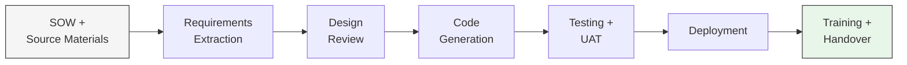
```mermaid
graph LR
    A["SOW +<br/>Source Materials"] --> B["Requirements<br/>Extraction"]
    B --> C["Design<br/>Review"]
    C --> D["Code<br/>Generation"]
    D --> E["Testing +<br/>UAT"]
    E --> F["Deployment"]
    F --> G["Training +<br/>Handover"]

    style A fill:#f5f5f5,stroke:#333
    style G fill:#e8f5e9,stroke:#333
```

---

## 2. The Problem It Solves

### The methodology gap

Naive AI code generation tools (GitHub Copilot, raw ChatGPT prompting) can produce syntactically valid SQL. What they fail at is *methodology*:

- Consistent naming conventions across 15+ models (`stg_focus__student_notes`, not `staging_notes` or `stg_notes`)
- Correct surrogate key patterns and grain management
- Relationship test coverage on every foreign key
- Traceability from business requirements to warehouse columns
- Cross-system join integrity (Focus `assignment_marks.enrolment_id` → ProSolution `Enrolment.EnrolmentID`)
- Requirements-driven design rather than improvised structure

These failures are not knowledge failures — the models know the conventions. They are *context and control* failures. Without a structured methodology constraining the generation process, LLMs improvise, and the accumulated inconsistencies across a project erode the value proposition entirely.

### How the Wire Framework closes the gap

The framework encodes the methodology itself as workflow specifications that the AI reads before generating anything. Each specification tells the AI:

- Which upstream artifacts to read as inputs
- What templates to follow for naming, structure, and testing
- What validation checks to apply before presenting output for review
- How to update the project state tracker

The AI fills in the blanks within a tightly constrained template rather than inventing structure from scratch. The result looks like it was written by a senior analytics engineer who has been on the project for months — because it was generated by an AI that read every design decision and requirement that a senior analytics engineer would have absorbed.

---

## 3. Engagements and Releases

### Key terminology

Wire uses a two-tier structure with precise terminology. Understanding these two concepts is essential before using the framework.

**Engagement** — a complete client engagement from start to finish. The engagement holds all context that spans the whole relationship with that client: the Statement of Work, call transcripts and meeting notes, org charts, stakeholder lists, and the current-state architecture of their systems. This context belongs to the engagement, not to any specific unit of delivery.

**Release** — a scoped, time-boxed unit of delivery within an engagement. Every piece of work the team does for a client is a release. Releases have a type (discovery, full_platform, pipeline_only, etc.), a defined scope, a planned start and end date, and their own `status.md` tracking file.

An engagement typically contains several releases in sequence. A typical engagement might look like:

```
01-discovery       ← Shape Up planning: what do we build and why?
02-data-foundation ← Pipeline + dbt: get data into the warehouse
03-reporting       ← Dashboard extension: client-facing dashboards
04-enablement      ← Training and documentation
```

### The two-tier folder structure

Every Wire engagement uses this structure in the `.wire/` directory:

```
.wire/
  engagement/
    context.md          ← engagement overview, objectives, key stakeholders
    sow.md              ← statement of work (copied at engagement setup)
    calls/              ← call transcripts and meeting notes
    org/                ← org charts and roles/responsibilities
  releases/
    01-discovery/       ← discovery release type
      status.md
      planning/
        problem_definition.md
        pitch.md
        release_brief.md
        sprint_plan.md
    02-data-foundation/  ← delivery release type (e.g. pipeline_only)
      status.md
      requirements/
      design/
      dev/
      test/
      deploy/
      enablement/
    03-reporting/        ← another delivery release
      status.md
      ...
  research/
    sessions/            ← persisted technical research (auto-populated)
      2026-03-01-1430/
        summary.md
```

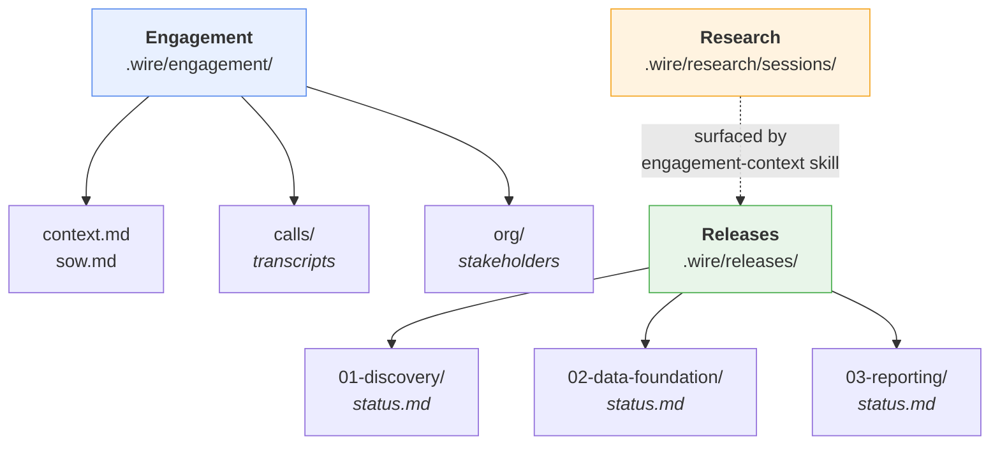
```mermaid
graph TD
    ENG["<b>Engagement</b><br/>.wire/engagement/"]
    SOW["context.md<br/>sow.md"]
    CALLS["calls/<br/><i>transcripts</i>"]
    ORG["org/<br/><i>stakeholders</i>"]
    RESEARCH["<b>Research</b><br/>.wire/research/sessions/"]
    RELEASES["<b>Releases</b><br/>.wire/releases/"]
    R1["01-discovery/<br/><i>status.md</i>"]
    R2["02-data-foundation/<br/><i>status.md</i>"]
    R3["03-reporting/<br/><i>status.md</i>"]

    ENG --> SOW
    ENG --> CALLS
    ENG --> ORG
    RESEARCH -.->|"surfaced by<br/>engagement-context skill"| RELEASES
    RELEASES --> R1
    RELEASES --> R2
    RELEASES --> R3

    style ENG fill:#e8f0ff,stroke:#5b8dee
    style RESEARCH fill:#fff3e0,stroke:#f5a623
    style RELEASES fill:#e8f5e9,stroke:#4caf50
```

### Setting up a new engagement

Run `/wire:new`. The framework asks:

1. **Client and engagement name** — for folder naming and status files
2. **Repo mode**:
   - *Combined* (default): `.wire/` lives directly in the client's code repo — the simplest setup, suitable for most engagements
   - *Dedicated delivery repo*: this repo is exclusively for Wire artifacts; client code lives in a separate repo (stored in `engagement/context.md`). Use for regulated clients where adding files to their code repo is not acceptable, or clients with multiple code repos
3. **First release type** — usually `discovery` for a new engagement, or a delivery type if joining mid-stream
4. **SOW path** — optional; copied to `engagement/sow.md`

To add a subsequent release to an existing engagement, run `/wire:new` again. The framework detects the existing engagement context and skips directly to asking for the new release type.

### Repo mode: combined vs dedicated delivery

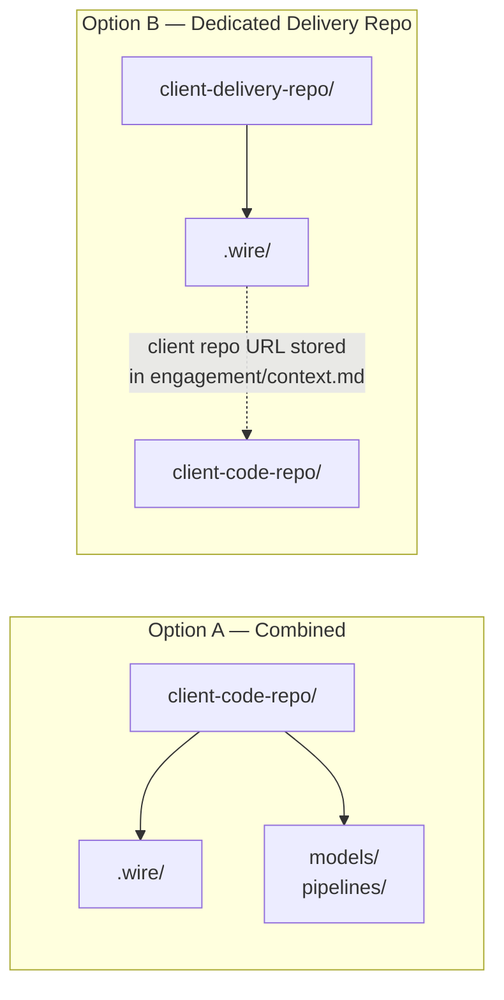
```mermaid
graph LR
    subgraph combined["Option A — Combined"]
        CCR["client-code-repo/"]
        CWire[".wire/"]
        CModels["models/<br/>pipelines/"]
        CCR --> CWire
        CCR --> CModels
    end

    subgraph dedicated["Option B — Dedicated Delivery Repo"]
        DDR["client-delivery-repo/"]
        DWire[".wire/"]
        DDR --> DWire
        DWire -.->|"client repo URL stored<br/>in engagement/context.md"| ClientRepo["client-code-repo/"]
    end
```

**Option A** is the default. Wire artifacts live in the same repo as the client's code. Simple, no extra configuration.

**Option B** is for engagements where adding files directly to the client's code repo is not acceptable (regulated industries, multi-stakeholder repos) or where the client has several code repos and it's unclear which one should hold the Wire artifacts. The delivery repo is typically named `<client_name>-delivery`. Client repo details are stored in `engagement/context.md` so Wire commands can reference the codebase when needed.

### Session lifecycle

As of v3.4.20, session state is managed automatically — no explicit session commands required.

The **engagement-context skill** fires automatically on the first message in any Wire repo. It locates the active release, reads `status.md`, and outputs a 4–6 line context summary before any work begins. You never need to remember to start a session; context loading is invisible and always on.

After each command completes, the framework writes its result to `status.md` and appends a row to `execution_log.md` — so state is captured incrementally rather than at explicit session boundaries.

For an optional structured planning ritual at the start of focused work, use:

```
/wire:plan [release-folder]
```

This enters Plan Mode, reads the current release state, and proposes a 3–5 step session plan before work begins. It is never required — it is there for consultants who want explicit alignment before starting complex multi-step work.

> **Note**: `/wire:session:start` and `/wire:session:end` have been deprecated as of v3.4.20. Running them displays a migration notice. No action is required — the equivalent behaviour now happens automatically.

---

## 4. Release Types

The framework encodes delivery methodology as twelve release types, each defining a different ordered set of in-scope artifacts and the commands that apply to them. When you run `/wire:new` and select a release type, the framework instantiates that process definition into the release's `status.md` file — writing the in-scope artifacts and their gate states as YAML frontmatter. Artifacts that are out of scope for the selected type are marked `not_applicable` and skipped.

**As of v4.0.0**, every release type is backed by a machine-readable `wire/release-types/<type>.yaml` (phases, artifacts, `depends_on`, `sequence`) — not just documentation. This is what the [precondition gate](#the-precondition-gate) and [Autopilot](#21-wire-autopilot-autonomous-execution) both read at runtime to know what depends on what and in which order to run. `pipeline_only`, `dashboard_extension`, and `enablement` — previously conceptual-only in this guide — now have one too, closing a gap where those three release types were documented but not actually schema-backed. See [The Process and Data Model Registries](#the-process-and-data-model-registries) for where these files come from.

| Type | `release_type` | Scope | Typical Duration | Artifacts in Scope |
|------|----------------|-------|------------------|--------------------|
| **Discovery (Shape Up)** | `discovery` | Shape Up planning: problem definition → pitch → release brief → sprint plan | 1–2 weeks | problem_definition, pitch, release_brief, sprint_plan |
| **Discovery (SOP / Canonical)** | `sop_discovery` | Wide-ranging structured discovery leading to a sponsor Findings Playback and go/no-go decision | 3–6 weeks | engagement_brief, stakeholder_map, stakeholder_interview, requirements_matrix, discovery_analyses, findings_playback, delivery_roadmap |
| **Full Platform** | `full_platform` | SOW → production dashboards + trained users | 2–3 weeks | All 15 delivery artifact types |
| **Dashboard-First** | `dashboard_first` | Interactive mocks drive data model; seed data enables immediate dbt | 1–2 weeks | 14 artifacts (inc. viz_catalog, seed_data, data_refactor) |
| **Pipeline + dbt** | `pipeline_only` | New data pipeline + dbt transformation layer | 1–2 weeks | requirements, pipeline_design, data_model, pipeline, dbt, data_quality, deployment |
| **dbt Development** | `dbt_development` | Analytics engineering on existing infrastructure | 1 week | requirements, data_model, dbt, data_quality |
| **Dashboard Extension** | `dashboard_extension` | New dashboards on an existing semantic layer | 3–5 days | requirements, mockups, dashboards, uat |
| **Enablement** | `enablement` | Training and documentation for an existing platform | 2–3 days | training, documentation |
| **Platform Migration** | `platform_migration` | Full lifecycle migration of a data platform from one warehouse stack to another. Covers source platform audit, migration inventory, strategy, parallel platform setup, batched dbt translation, equivalency validation loop, and cutover | 4–16 weeks | ingestion_audit, db_object_audit, security_audit, dbt_audit, orchestration_audit, migration_inventory, lineage_view, migration_strategy, target_setup, ingestion_migration, dbt_migration, orchestration_migration, equivalency_validation, cutover, migration_report |
| **Agentic Data Stack** | `agentic_data_stack` | Overlay for an existing data platform (warehouse + dbt + BI tool). Audits governance maturity, extends the semantic layer, generates per-domain knowledge skill files collocated with dbt models, delivers an installable agentic data stack skill with a CI-wired eval suite. Does not build the underlying pipeline or dbt project — use `full_platform` or `pipeline_only` first if the platform doesn't yet exist. | 4–6 weeks | dataset_audit, metric_audit, query_audit, governance_design, semantic_layer_design, canonical_models, lookml_views (Looker only), semantic_layer, knowledge_skill, agent_config, eval_suite, adversarial_config, launch_gate, enablement |
| **Droughty** | `droughty` | Schema introspection and base-layer generation using the Droughty toolkit. Two modes: **discovery/audit** (maps an existing warehouse — ERD, field docs, QA report — no dbt deployment needed) and **post-dbt** (generates staging SQL, pattern-based schema tests, and base LookML views from deployed dbt tables). Can also be added as an optional phase within any `full_platform` or `dbt_development` release. | 1–3 days | droughty_setup, droughty_introspect, droughty_dbml, droughty_docs, droughty_qa, droughty_stage, droughty_dbt_tests, droughty_lookml |
| **Custom** | `custom` | Bespoke scope derived from SoW or project documents — Wire analyses your docs and generates project-scoped specs for deliverables that don't map to any standard type | Varies (typically 2–6 weeks) | Derived from source documents by `/wire:custom-release-define` |

### Choosing the right release type

- **New engagement, scope can be shaped in 1–2 weeks**: **Discovery (Shape Up)** — problem definition → pitch → release brief → sprint plan
- **New engagement, scope genuinely unknown, requires 3–6 weeks of structured stakeholder discovery**: **Discovery (SOP / Canonical)** — stakeholder interviews → three analyses → Findings Playback sponsor decision
- **Client needs a new data source connected end-to-end through to a dashboard**: **Full Platform**
- **Early stakeholder feedback via interactive mocks before building the data layer**: **Dashboard-First**
- **Client has a BI tool / semantic layer and just needs new data flowing in**: **Pipeline + dbt**
- **Data is already in the warehouse; need to build the transformation layer**: **dbt Development**
- **Semantic layer already has the data; adding new dashboards**: **Dashboard Extension**
- **Platform exists; engaged to train and document it**: **Enablement**
- **Migrating an existing data platform from BigQuery to Snowflake or Snowflake to BigQuery**: **Platform Migration** — five-zone source audit → migration inventory → strategy → target setup → batched dbt translation → equivalency validation loop → cutover
- **Client wants an AI that answers business questions from their data warehouse accurately and reliably**: **Agentic Data Stack** — three-phase audit → governance and semantic layer design → build → eval suite with per-domain accuracy gates → installable agentic data stack skill
- **Need to map an existing warehouse quickly — ERD, field descriptions, data quality report — before starting design work**: **Droughty** (discovery/audit mode)
- **dbt models are deployed and you need base LookML views, pattern-based schema tests, and staging SQL generated from the live schema**: **Droughty** (post-dbt mode) — or add a Droughty release alongside any `full_platform` or `dbt_development` release
- **Engagement with bespoke deliverables — architecture blueprints, advisory reports, decision logs, PoC productionisation plans — that don't fit any standard type**: **Custom**

**Discovery (Shape Up) vs Discovery (SOP / Canonical)**: Use Shape Up when the scope is fuzzy but the problem domain is understood and you can shape a solution in a week or two. Use SOP / Canonical when you genuinely do not yet know what to build, stakeholder alignment is low, or this is the first analytics engagement at the client — it runs a formal structured discovery and culminates in a sponsor-facing Findings Playback slide deck that must be signed off before any delivery work begins.

**Full Platform vs Dashboard-First**: Both produce the same end result (production dashboards with a dbt warehouse). The difference is the *order of operations*. Full Platform follows the traditional flow: requirements → conceptual model → pipeline design → data model → dbt → dashboards. Dashboard-First inverts this: requirements → interactive dashboard mocks → visualization catalog → data model → seed data → dbt → dashboards → data refactor. Choose Dashboard-First when getting visual feedback early is more valuable than following the traditional top-down design sequence — typically when the SOW is well-defined enough to mock dashboards immediately but client data access may take time.

**When to start with Platform Migration vs a discovery release**: A `sop_discovery` or `discovery` release is strongly recommended before starting a migration if the scope is not yet confirmed — migration is irreversible once Fivetran connectors are cut over. The Platform Migration release type assumes the decision to migrate has been made and the scope boundary is agreed. If there is any doubt, run a discovery release first.

**After a Platform Migration completes**: Use `dashboard_extension` to rebuild the BI layer on the new platform, and `enablement` to train the data team on the new stack.

---

## 5. Installation and Setup

### Prerequisites

**Required:**
- Git repository initialised (`git init` or cloned)
- **One of** the following AI coding agents:
  - **Claude Code** — installed and authenticated (`claude` CLI). Requires Claude Pro, Max, Team, or Enterprise subscription. VS Code (1.98.0+) with Claude Code extension, or Claude Code CLI.
  - **Gemini CLI** — installed and authenticated (`gemini` CLI). Requires Gemini Code Assist subscription or Google Cloud project with Gemini API access.
- Python 3.8+ (for dbt and pipeline development)

**Recommended:**
- GitHub Desktop (for non-technical team members)
- dbt Cloud account (or dbt Core installed locally)

**Cloud platform access** (varies by project stack):
- Google Cloud: BigQuery access, Looker access, dbt Cloud connected to BigQuery, GCP service account credentials
- Other platforms: Snowflake/Databricks/Redshift credentials, BI platform access (Tableau, Power BI, etc.), dbt Cloud or dbt Core configured

### Step 1: Install the plugin or extension

**Claude Code users:**

In any Claude Code session, register the marketplace, install the plugin, then activate it:
```
/plugin marketplace add rittmananalytics/wire-plugin
/plugin install wire@rittman-analytics
/reload-plugins
```
When prompted for scope, select **"Install for you (user scope)"** to make Wire available across all repositories.

The `/reload-plugins` step picks up the install in the current session — no Claude Code restart needed. All commands are then available as `/wire:*`.

**Gemini CLI users:**
```bash
gemini extensions install https://github.com/rittmananalytics/wire-extension
```
All commands are available immediately as `/dp *` — no further setup required.

Each command has its full workflow specification embedded inline. No framework files need to exist in the repository. MCP servers (Atlassian, Fathom, Context7) are configured automatically.

### Step 2: Verify

Open your AI coding agent in the repository root:

```bash
claude     # Claude Code
gemini     # Gemini CLI
```

Run `/wire:start` (Claude Code) or `/dp start` (Gemini CLI) to confirm everything works. On first run, `/wire:start` checks whether the plugin is installed and up to date, detects whether this is a new or existing engagement, and either walks you through onboarding or surfaces the right next action for the current project state.

To authenticate optional MCP integrations:
- **Claude Code**: use the `/mcp` command
- **Gemini CLI**: use `gemini mcp` commands

### Upgrading

Plugin and extension users get updates automatically when a new version is published. Project data in `.wire/` is never touched by upgrades — workflow specs are defensively compatible with existing project state.

---

## 6. Core Concepts You Need to Know

> **Command notation:** Commands in this handbook are shown in Claude Code format (`/wire:*`). If you are using Gemini CLI, drop the `/wire:` prefix and replace colons with spaces — e.g., `/wire:requirements-generate my_project` becomes `/dp requirements generate my_project`.

### Self-contained command architecture

Every `/wire:*` command is a single, self-contained file — the command file *is* the complete workflow specification. There is no separation between a discovery layer and a logic layer. In Claude Code, these are `.md` files distributed as a plugin; in Gemini CLI, `.toml` files distributed as an extension.

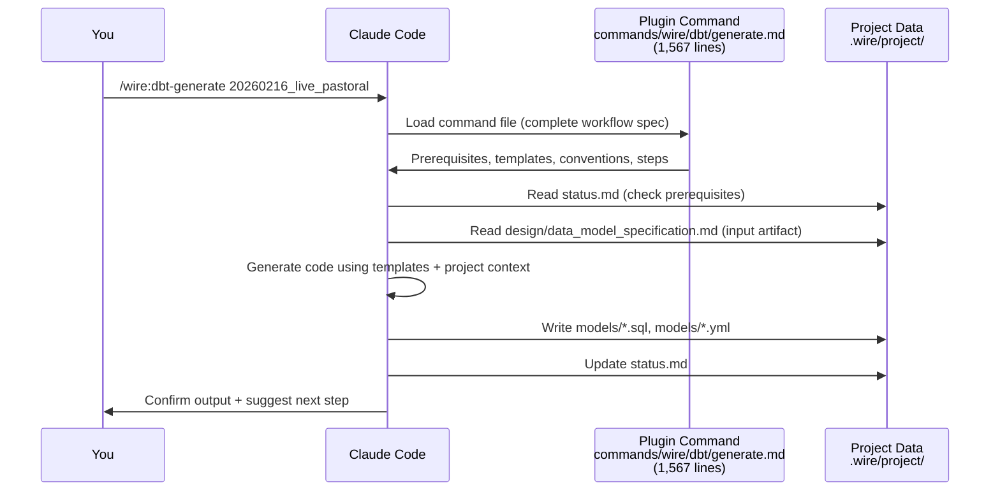
```mermaid
sequenceDiagram
    participant U as You
    participant CC as Claude Code
    participant CMD as Plugin Command<br/>commands/wire/dbt/generate.md<br/>(1,567 lines)
    participant P as Project Data<br/>.wire/project/

    U->>CC: /wire:dbt-generate 20260216_live_pastoral
    CC->>CMD: Load command file (complete workflow spec)
    CMD->>CC: Prerequisites, templates, conventions, steps
    CC->>P: Read status.md (check prerequisites)
    CC->>P: Read design/data_model_specification.md (input artifact)
    CC->>CC: Generate code using templates + project context
    CC->>P: Write models/*.sql, models/*.yml
    CC->>P: Update status.md
    CC->>U: Confirm output + suggest next step
```

Each command file contains the full workflow inline — from 100 lines for a simple review command to over 1,500 lines for dbt generation. No external files are referenced. This means:
- Adding a new command = write one command file, rebuild the plugin/extension
- Modifying a command's behaviour = edit that one file. The change applies on the next invocation — no build step, no reinstallation

### Session lifecycle

As of v3.4.20, session context loading and state capture are automatic — no session commands needed.

The **engagement-context skill** activates on the first message in any Wire repo. It identifies the active release, reads `status.md`, and outputs a brief context summary before any work begins. Each command that completes writes its result to `status.md` and appends a row to `execution_log.md` automatically.

Run `/wire:start` at the start of any session to get a full project overview and a ranked list of next actions. It also acts as a co-pilot: first-time users get onboarding (release type selection, three-step cycle explanation); returning users get a navigation summary with their current artifact state and a specific next command. Run it any time you're unsure what to do next.

Use `/wire:session-plan [release-folder]` for an optional structured planning ritual — it enters Plan Mode and proposes a 3–5 step session plan. It is never required.

### Specialist agents

As of v3.9.4, Wire commands auto-delegate to one of eleven specialist subagents — a `dbt-developer` agent that only knows dbt conventions, a `qa-agent` that is a pure critic with no generation responsibility, and so on. This happens transparently when you run individual commands. To batch-delegate all pending work across an entire release, use `/wire:delegate <release-folder>`. See [Section 22](#22-wire-agents-specialist-subagents) for the full agent roster and how delegation works.

### Research persistence

When the AI performs technical research during a session (looking up warehouse schemas, reading documentation, investigating a library), it automatically saves structured summaries to `.wire/research/sessions/YYYY-MM-DD-HHMM/summary.md` — one file per research session at the engagement level (not inside any individual release).

The engagement-context skill checks these saved summaries when loading context. If a relevant prior finding exists, it is surfaced rather than re-running the same research. This means:
- **Cross-release knowledge carries over**: research done during the discovery release is available when working on the delivery release
- **Re-starting a session doesn't lose context**: prior technical findings are always available
- **Less AI context consumed**: the AI reads a condensed summary instead of re-running the same web searches

### The artifact lifecycle

Every artifact produced by the framework follows three gates:

- **Generate**: AI produces the artifact from upstream inputs and templates
- **Validate**: Automated checks run (naming, test coverage, completeness, etc.)
- **Review**: You or the client approves the artifact

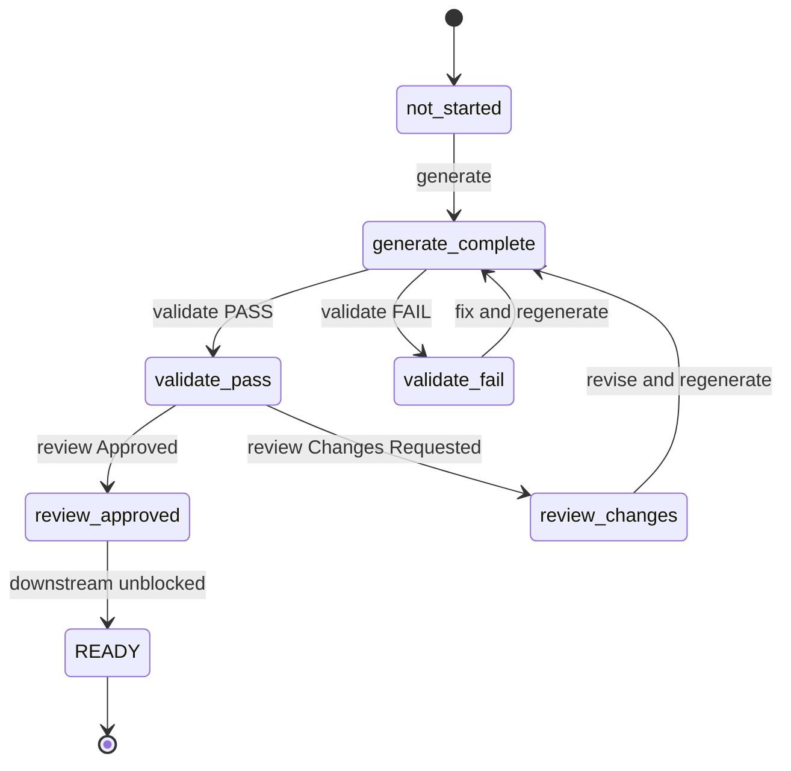
```mermaid
stateDiagram-v2
    [*] --> not_started
    not_started --> generate_complete : generate
    generate_complete --> validate_pass : validate PASS
    generate_complete --> validate_fail : validate FAIL
    validate_fail --> generate_complete : fix and regenerate
    validate_pass --> review_approved : review Approved
    validate_pass --> review_changes : review Changes Requested
    review_changes --> generate_complete : revise and regenerate
    review_approved --> READY : downstream unblocked
    READY --> [*]
```

An artifact should not progress until all three gates are passed. Downstream artifacts check upstream readiness before they generate.

### The precondition gate

**As of v4.0.0**, phase discipline isn't a soft convention baked separately into each command's prose — every `-generate`/`-validate`/`-review` command auto-delegates to a shared utility, `specs/utils/precondition_gate.md`, before doing anything else.

The gate reads the command's declared `preconditions` from its own front-matter: a static list (e.g. "`data_model.review` must be `approved`"), or the literal `dynamic` sentinel for the handful of artifacts (`mockups`, `pipeline_design`, `data_model`, `data_quality`, `dashboards`, `deployment`, `training`, `documentation`) whose correct precondition genuinely differs by release type. A `dynamic` precondition resolves at runtime from the current release's `wire/release-types/<type>.yaml` — the same file Autopilot reads to resolve execution order (see [Section 21](#21-wire-autopilot-autonomous-execution)).

If the precondition isn't met, the command **blocks by default**:

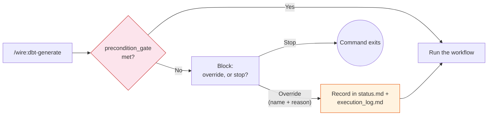
```mermaid
flowchart LR
    CMD["/wire:dbt-generate"] --> GATE{"precondition_gate\nmet?"}
    GATE -->|Yes| RUN["Run the workflow"]
    GATE -->|No| ASK["Block:\noverride, or stop?"]
    ASK -->|"Override\n(name + reason)"| LOG["Record in status.md +\nexecution_log.md"]
    LOG --> RUN
    ASK -->|Stop| END(("Command exits"))

    style GATE fill:#fce4ec,stroke:#c62828
    style LOG fill:#fff3e0,stroke:#e65100
```

You can still override it, but only explicitly — the gate asks for your name and a reason, and records both in `status.md`'s `precondition_overrides` and as an `override` result in `execution_log.md`. This makes "I skipped a step on purpose" a visible, attributable decision instead of something that silently happened. Autopilot never answers this prompt on its own behalf — see "Handling a precondition-gate block" in [Section 21](#21-wire-autopilot-autonomous-execution).

### Git branching

`/wire:new` enforces a mandatory branch check. If you run it while on `main` or `master`, the framework will stop and ask you to create a feature branch before any project files are created. It suggests `feature/{folder_name}` (e.g., `feature/20260210_acme_marketing_analytics`) but you can choose your own name.

If you're already on a feature branch, the check passes silently — no action required.

This ensures all release work lives on a branch that can be reviewed via pull request before merging. When all releases in the engagement are complete, create a PR to merge the work.

### The status file

Each release has a `status.md` file at `.wire/releases/<release-folder>/status.md`. This is the running instance of the delivery process — created by `/wire:new` when you select a release type, and updated by every subsequent command. It has two roles:

1. **Human-readable**: release overview, notes, blockers, and session history
2. **Machine-readable YAML frontmatter**: the instantiated process definition — which artifacts are in scope, which gates have been passed, and what comes next

The YAML frontmatter lists every in-scope artifact with its generate/validate/review gate states. Out-of-scope artifacts (determined by the release type) are marked `not_applicable`. Each command reads this state before executing — that's how the framework enforces phase discipline and prerequisite ordering. The framework updates `status.md` automatically after each command. You can also edit it manually to add notes or record decisions.

The framework updates `status.md` automatically after each command — no manual session tracking required. The execution log (`execution_log.md`) provides a complete timestamped audit trail of all commands and skill activations.

When you run `/wire:start`, the framework reads all `status.md` files across all releases and presents a full project overview — then asks what you want to do. `/wire:start` is also the Wire co-pilot: it checks your plugin version, detects whether you're a new or returning user, and either runs you through onboarding (release type selection, three-step cycle explanation) or navigates you to the right next action. Run it at the start of any session, or any time you're unsure what to do next. Optional arguments: `new` to force onboarding mode, `resume` to go straight to navigation, `explain` to get an explanation of any part of the framework.

### The execution log

In addition to `status.md`, each project maintains an `execution_log.md` file that records a timestamped entry for every command that changes state. This provides a complete, append-only history of the delivery process — what was run, when, what the result was, and a brief summary.

```markdown
| Timestamp | Command | Result | Detail |
|-----------|---------|--------|--------|
| 2026-02-22 14:40 | /wire:requirements-generate | complete | Generated requirements spec (3 files) |
| 2026-02-22 15:12 | /wire:requirements-validate | pass | 14 checks passed, 0 failed |
| 2026-02-22 16:00 | /wire:requirements-review | approved | Reviewed by Jane Smith |
```

The log is useful for handovers (a new team member can see the full history of what was done), for auditing (confirming when artifacts were generated and who approved them), and for debugging (identifying when a failure occurred and what preceded it).

### Detailed execution tracing (opt-in)

**As of v4.0.0.** `execution_log.md`'s one-row-per-command summary can't answer "what actually happened *inside* that command" — which files it read, what it inferred, what it proposed, what you decided and why. For that depth, set:

```bash
export WIRE_TRACE=true
```

Every command checks this on every invocation — on by an environment variable, off by default, zero overhead when unset. Once on, each command writes a step-by-step trace to `.wire/releases/<release_folder>/trace.jsonl` (JSON Lines, one event per line: `command_start`, one `step` event per meaningful step, `command_end`) — local only, never sent anywhere, unlike the anonymous Segment telemetry event. Each event's `detail` field has no length limit, unlike `execution_log.md`'s 120-character cap:

```json
{"ts":"2026-07-05T14:20:11Z","release":"20260705_acme","release_type":"full_platform","command":"data_model-generate","event":"step","step":"1.5.1","step_name":"Resolve the registry location","result":null,"detail":"Checked wire/data-model-registry/ (not found). Checked ~/.wire/data-model-registry/ (found)."}
{"ts":"2026-07-05T14:20:19Z","release":"20260705_acme","release_type":"full_platform","command":"data_model-generate","event":"step","step":"1.5.2","step_name":"Resolve the vertical","result":null,"detail":"No confident vertical match — no dedicated saas vertical exists. Adjacent match found: subscription-commerce, proposed as an analogue for the MRR/NRR model."}
```

That's exactly the level of detail that would have made the [data model registry's](#the-process-and-data-model-registries) automatic-detection behavior visible without reconstructing it by hand — was the registry reachable, what did it search, what matched, how was it used downstream. This is additive to `execution_log.md` and Telemetry, not a replacement for either, and applies uniformly across every command — it's injected once at build time (`wire/specs/utils/tracing.md`, via `build-packages.sh`), so no individual command spec needed to change.

### The chain of derivation

Each artifact constrains the next. By the time the AI generates LookML, the dimension names, measure definitions, and join paths are fully determined by upstream artifacts — there is no room for improvisation.


```mermaid
graph LR
    SOW["SOW PDF<br/><i>Client scope</i>"]
    REQ["Requirements<br/><i>FR-1..FR-N, NFR-1..NFR-N</i>"]
    CM["Conceptual Model<br/><i>Business entities<br/>+ relationships</i>"]
    PD["Pipeline Design<br/><i>Sources, replication,<br/>architecture + DFD</i>"]
    DM["Data Model<br/><i>Tables, columns,<br/>joins, seeds + ERD</i>"]
    DBT["dbt Code<br/><i>SQL models,<br/>YAML tests</i>"]
    LML["LookML<br/><i>Views, explores,<br/>measures</i>"]
    DASH["Dashboards<br/><i>Tiles, filters,<br/>layouts</i>"]

    SOW -->|"extract"| REQ
    REQ -->|"model"| CM
    CM -->|"informs"| PD
    CM -->|"informs"| DM
    PD -->|"informs"| DM
    DM -->|"generate"| DBT
    DBT -->|"expose"| LML
    LML -->|"compose"| DASH

    style SOW fill:#f9f,stroke:#333
    style DASH fill:#9f9,stroke:#333
```

The `dashboard_first` project type follows an alternative chain where interactive dashboard mocks produce a visualization catalog that drives the data model directly — the measures and dimensions the dashboards need determine what the warehouse must provide. Seed data enables dbt to run immediately without client data access, and a later data refactor step transitions from seeds to real client data.


```mermaid
graph LR
    SOW["SOW PDF"]
    REQ["Requirements"]
    MOCK["Dashboard Mocks<br/><i>HTML interactive</i>"]
    VIZ["Viz Catalog<br/><i>Measures + dimensions</i>"]
    DM["Data Model"]
    SEED["Seed Data<br/><i>CSV files</i>"]
    DBT["dbt Code<br/><i>seed-based</i>"]
    LML["LookML"]
    DASH["Dashboards"]
    REFACTOR["Data Refactor<br/><i>seeds → real data</i>"]

    SOW -->|"extract"| REQ
    REQ -->|"mock"| MOCK
    MOCK -->|"catalog"| VIZ
    VIZ -->|"informs"| DM
    DM -->|"generate"| SEED
    SEED -->|"generate"| DBT
    DBT -->|"expose"| LML
    LML -->|"compose"| DASH
    DASH -->|"refactor"| REFACTOR

    style SOW fill:#f9f,stroke:#333
    style DASH fill:#9f9,stroke:#333
    style REFACTOR fill:#e8f5e9,stroke:#333
```

---

## 7. Running a Discovery Release (Shape Up Planning)

A discovery release is the scoping and planning phase for a new engagement. It answers the question: *what do we build and why?* The output is a release brief and sprint plan — the formal inputs to a delivery release.

Discovery uses the **Shape Up** methodology: fixed time, variable scope. You work within an *appetite* (how much time this is worth) and produce a shaped solution — specific enough to build from, but leaving room for implementation decisions. Scope is adjusted to fit the appetite, not the other way around.

### When to start with Discovery

- The client is not sure exactly what they need built
- The scope needs to be negotiated before a fixed SOW is signed
- The team wants to formally validate the problem before committing to a delivery estimate
- There are multiple competing priorities that need to be shaped into a coherent release brief

If you already have a signed, well-scoped SOW, you may not need a discovery release — go straight to the appropriate delivery type.

### Discovery artifact flow

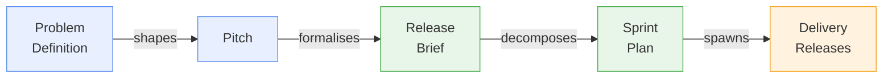
```mermaid
graph LR
    PD["Problem\nDefinition"]
    PI["Pitch"]
    RB["Release\nBrief"]
    SP["Sprint\nPlan"]
    DR["Delivery\nReleases"]

    PD -->|"shapes"| PI
    PI -->|"formalises"| RB
    RB -->|"decomposes"| SP
    SP -->|"spawns"| DR

    style PD fill:#e8f0ff,stroke:#5b8dee
    style PI fill:#e8f0ff,stroke:#5b8dee
    style RB fill:#e8f5e9,stroke:#4caf50
    style SP fill:#e8f5e9,stroke:#4caf50
    style DR fill:#fff3e0,stroke:#f5a623
```

### Discovery workflow (Shape Up)

```
/wire:new                                          # release_type: discovery

# Begin each session:

# Step 1: Problem Definition
/wire:problem-definition-generate 01-discovery
/wire:problem-definition-validate 01-discovery
/wire:problem-definition-review 01-discovery

# Step 2: Pitch
/wire:pitch-generate 01-discovery
/wire:pitch-validate 01-discovery
/wire:pitch-review 01-discovery                    # betting table review

# Step 3: Release Brief
/wire:release-brief-generate 01-discovery
/wire:release-brief-validate 01-discovery
/wire:release-brief-review 01-discovery            # client sign-off

# Step 4: Sprint Plan
/wire:sprint-plan-generate 01-discovery
/wire:sprint-plan-validate 01-discovery
/wire:sprint-plan-review 01-discovery              # team approval

# Spawn the downstream delivery releases:
/wire:release:spawn 01-discovery

# End each session:
```

### Step 1: Problem Definition

```
/wire:problem-definition-generate 01-discovery
```

The AI reads the engagement context (`engagement/context.md`, `engagement/sow.md`) and any call transcripts in `engagement/calls/`, and produces a structured problem framing with six components:
- **Who has the problem**: the specific role or team experiencing the friction
- **What they are trying to do**: the goal or job to be done
- **What the current friction is**: the specific obstacle or pain
- **Why it matters**: business impact if not addressed
- **Current workarounds**: what people are doing instead
- **Constraints**: time, budget, technology, regulatory

```
/wire:problem-definition-validate 01-discovery
```

Validation checks that the problem is specific (not vague), measurable (impact is quantifiable), and framed as a problem (not a solution). Flags any "solution-baked-in" problem statements for revision.

```
/wire:problem-definition-review 01-discovery
```

Review with stakeholders. The goal is to reach agreement that the problem statement accurately reflects the real friction — before any solution design begins. Problems with poor framing produce pitches that solve the wrong thing.

### Step 2: Pitch

```
/wire:pitch-generate 01-discovery
```

Produces a 10-section Shape Up pitch:
1. **Problem** — the approved problem statement
2. **Appetite** — how much time this is worth (1–2 weeks small batch, or 6 weeks big batch)
3. **Solution sketch** — a fat-marker description (specific enough to be actionable, not so detailed it locks the team in)
4. **Rabbit holes** — known implementation traps to avoid
5. **No-gos** — scope items explicitly excluded
6. **Risks** — technical or business risks that need monitoring
7. **Success criteria** — how we'll know this release succeeded
8. **Downstream releases** — delivery releases this pitch would spawn
9. **Timeline** — proposed start date, end date, and key milestones
10. **The bet** — the decision to commit: why this is the right thing to build now

```
/wire:pitch-validate 01-discovery
```

Validates appetite specificity (must be a concrete timeframe, not "TBD"), section completeness, and that the solution sketch is shaped — not a wireframe or a vague goal, but a directional description leaving room for implementation.

```
/wire:pitch-review 01-discovery
```

**The betting table review.** This is where the pitch is presented to decision-makers — typically the engagement lead and client sponsor. The purpose is to make an explicit commitment: "We bet [appetite] that building [solution] will [success criteria]." The outcome is recorded in the pitch document (bet approved, modified, or deferred). If deferred, the reasons are captured for future consideration.

### Step 3: Release Brief

```
/wire:release-brief-generate 01-discovery
```

Formalises the approved pitch as a client-facing release brief — a commitment document. Includes: the approved problem statement, solution description, deliverables list, constraints and assumptions, dependencies, downstream releases, timeline with milestones, and a sign-off section.

```
/wire:release-brief-review 01-discovery
```

**Client sign-off.** The brief is presented to the client for approval. Once signed off, it becomes the authorising document for the downstream delivery releases. If the client requests changes, update the brief and re-review.

### Step 4: Sprint Plan

```
/wire:sprint-plan-generate 01-discovery
```

Decomposes the approved release brief into a sprint plan: epics, stories, and tasks with Fibonacci point estimates (1, 2, 3, 5, 8 — no 13-point stories; anything larger must be broken down). The total points are checked against the appetite budget.

```
/wire:sprint-plan-validate 01-discovery
```

Validates that: no single story is 13 points or more, total points fit the appetite budget, every deliverable from the release brief has at least one story, and no orphan tasks exist without a parent story.

```
/wire:sprint-plan-review 01-discovery
```

Team review and approval. Once approved, the sprint plan marks the discovery release as complete. The AI suggests running `release:spawn`.

### Spawning delivery releases

```
/wire:release:spawn 01-discovery
```

Reads the approved release brief to identify the planned downstream delivery releases, then creates the folder structure and `status.md` for each one:

```
.wire/releases/
  01-discovery/         ← source
    status.md
    planning/
      problem_definition.md
      pitch.md
      release_brief.md
      sprint_plan.md
  02-data-foundation/   ← spawned (pipeline_only or full_platform)
    status.md
    requirements/
    design/
    dev/
    test/
    deploy/
    enablement/
  03-reporting/         ← spawned (dashboard_extension)
    status.md
    ...
```

The spawned releases are ready to start immediately — their `status.md` files are pre-populated with the correct artifact scope for each release type. The engagement-context skill will load the release state automatically on the first message in each release.

### Engagement artifacts and the discovery release

The `.wire/engagement/` folder holds context that belongs to the whole engagement — context that any release can draw on:

```
.wire/engagement/
  context.md          ← engagement objectives, stakeholders, working agreements
  sow.md              ← statement of work or proposal (if available)
  calls/              ← meeting transcripts (added manually as engagements progress)
  org/                ← org charts, RACI, stakeholder maps
```

The discovery release reads from `engagement/` heavily — the problem definition draws from `context.md`, the pitch references the SOW, and reviews use Fathom call transcripts from `calls/`. The delivery releases that follow also read `engagement/context.md` for client background and stakeholder details. The engagement folder is never generated by a command — it is built up over time by the user adding transcripts, org charts, and context notes.

### Discovery release: worked example

A new engagement with an uncertain scope:

```
# Set up the engagement and first release
/wire:new
→ Client: Acme Corp
→ Repo mode: A (combined — .wire/ lives in this repo)
→ First release type: discovery
→ Release ID: 01-discovery
→ SOW path: ./proposals/acme_sow_draft.pdf   ← copied to engagement/sow.md

# Add meeting transcript from kick-off call
# Copy transcript to .wire/engagement/calls/2026-03-10-kickoff.md

# The engagement-context skill loads automatically on first message:
# → Scans status.md: all discovery artifacts at not_started
# → No prior research found
# → Outputs context summary and proceeds with your request

/wire:problem-definition-generate 01-discovery
→ Reads engagement/sow.md + engagement/calls/2026-03-10-kickoff.md
→ Produces structured problem framing

/wire:problem-definition-validate 01-discovery
→ PASS

/wire:problem-definition-review 01-discovery
→ Stakeholder review — approved with one change (friction statement refined)

/wire:pitch-generate 01-discovery
→ Produces 10-section pitch
→ Appetite set: 6 weeks (big batch — full pipeline + dbt + dashboards)

# Next day — engagement-context skill reloads on first message:
# → Surfaces prior research saved from previous session
# → Outputs: "Pitch drafted, not yet validated. Suggested next step: validate + review"

/wire:pitch-validate 01-discovery  → PASS
/wire:pitch-review 01-discovery    → Bet approved: 6-week full_platform release
/wire:release-brief-generate 01-discovery
/wire:release-brief-validate 01-discovery  → PASS
/wire:release-brief-review 01-discovery    → Client sign-off received

/wire:sprint-plan-generate 01-discovery
/wire:sprint-plan-validate 01-discovery    → PASS
/wire:sprint-plan-review 01-discovery      → Team approved

/wire:release:spawn 01-discovery
→ Creates .wire/releases/02-acme-data-foundation/ (full_platform)
→ Creates .wire/releases/03-acme-enablement/ (enablement)
→ Both releases ready to start

→ Discovery release complete.
```

> **Tip**: Run `/wire:playbook-generate 01-discovery` after the problem definition is approved to generate a BPMN-style visual delivery plan and step-by-step narrative for this release. See [Section 29](#29-framework-management-commands).

---

## 8. Running a Discovery Release (SOP / Canonical)

The SOP / Canonical discovery release (`release_type: sop_discovery`) is for engagements where the scope is genuinely unknown at SOW signature — you need structured, wide-ranging stakeholder discovery before you can shape any delivery bet. It models the [Canonical Discovery Playbook (RA Standard)](https://rittmananalytics.atlassian.net/wiki/spaces/RA/pages/343.6.4306/Canonical+Discovery+Playbook+RA+Standard).

Use this release type when:

- Scope is unknown or stakeholder alignment is low at the start of the engagement
- This is the first analytics engagement at the client — you need to diagnose the data landscape before prescribing solutions
- The SOW describes a discovery phase rather than a fixed scope
- Multiple competing priorities exist and a structured hierarchy-of-needs analysis is needed before any build decision

The Shape Up discovery (`release_type: discovery`) is the right choice when the problem domain is understood and you can shape a solution in one or two weeks. If you are not sure which to use, choose SOP / Canonical.

### SOP discovery artifact flow

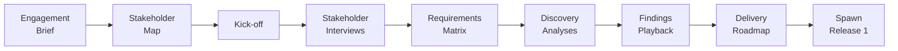
```mermaid
graph LR
    EB["Engagement\nBrief"]
    SM["Stakeholder\nMap"]
    KO["Kick-off"]
    SI["Stakeholder\nInterviews"]
    RM["Requirements\nMatrix"]
    DA["Discovery\nAnalyses"]
    FP["Findings\nPlayback"]
    DR["Delivery\nRoadmap"]
    RS["Spawn\nRelease 1"]

    EB --> SM --> KO --> SI --> RM --> DA --> FP --> DR --> RS
```

### The exit gate: Findings Playback and Sponsor Validation Checklist

The canonical exit deliverable is the **Findings Playback slide deck**, presented to the sponsor in a live session. The playback meeting is the Wire review gate — the release moves to `approved` only when all seven items on the **Sponsor Validation Checklist** are confirmed true on the Fathom recording of the meeting:

1. Maturity Curve pin agreed
2. Hierarchy of Needs diagnosis accepted
3. PPT (People / Process / Technology) diagnosis accepted
4. Vision Statement validated
5. Solution Initiatives accepted
6. Preferred Delivery Option selected
7. Any conflicts between stakeholder priorities resolved

`/wire:release-spawn` refuses to chain forward until the checklist is all-true. If the sponsor defers or partially approves, the release stays open and the playback is rescheduled.

### The mandatory four-tag rule

Every theme bullet on every stakeholder interview write-up carries one tag from each of four closed sets: `#<domain>`, `#<type>`, `#<hierarchy>`, `#<ppt>`. `/wire:stakeholder-interview-validate` enforces this with a parser check, not LLM judgement. The three discovery analyses cannot run without complete tag coverage across all interviews.

### Command sequence

The canonical exit deliverable is the **Findings Playback slide deck**, presented to the sponsor. The playback meeting is the Wire review gate — the release is `approved` only when the Sponsor Validation Checklist (Maturity pin, Hierarchy diagnosis, PPT diagnosis, Vision Statement, Solution Initiatives, preferred Delivery Option, conflicts resolved) is all-true.

```
/wire:new                                          # release_type: sop_discovery

# Phase 0 — Pre-Discovery (1–3 days)
/wire:engagement-brief-generate 01-discovery       # from SoW + HubSpot deal record
/wire:engagement-brief-validate 01-discovery
/wire:engagement-brief-review 01-discovery         # internal RA (Head of Delivery)

/wire:stakeholder-map-generate 01-discovery
/wire:stakeholder-map-validate 01-discovery
/wire:stakeholder-map-review 01-discovery          # sponsor confirms list and bookings

# Phase 1 — Kick-off (1 session)
/wire:kickoff-generate 01-discovery                # release-type-aware; pulls from engagement_brief + stakeholder_map
/wire:kickoff-review 01-discovery

# Phase 2 — Interviews (1–2 weeks; repeat the per-stakeholder generate per interview)
/wire:stakeholder-interview-generate 01-discovery --stakeholder maud-bakker
/wire:stakeholder-interview-validate 01-discovery --stakeholder maud-bakker
/wire:stakeholder-interview-review 01-discovery --stakeholder maud-bakker
# ... repeat for each P0/P1 stakeholder
/wire:stakeholder-interview-validate 01-discovery --all   # tag-completeness coverage

# Phase 3 — Consolidation (3–5 days)
/wire:requirements-matrix-generate 01-discovery
/wire:requirements-matrix-validate 01-discovery
/wire:requirements-matrix-review 01-discovery       # internal RA

/wire:discovery-analyses-generate 01-discovery      # the three analyses
/wire:discovery-analyses-validate 01-discovery
/wire:discovery-analyses-review 01-discovery        # HoD + peer; challenges the Maturity pin

# Phase 4 — Findings Playback (3–5 days prep; 1 sponsor session)
/wire:findings-playback-generate 01-discovery       # populates the deck template
/wire:findings-playback-validate 01-discovery
/wire:findings-playback-review 01-discovery         # ⭐ the sponsor playback — Sponsor Validation Checklist captured here

# Phase 5 — Roadmap & Exit
/wire:delivery-roadmap-generate 01-discovery        # Build / Pair / Coach options
/wire:delivery-roadmap-validate 01-discovery
/wire:delivery-roadmap-review 01-discovery          # sponsor sign-off on Release 1 scope

# Spawn Release 1 (or close as no-go):
/wire:release-spawn 01-discovery
```

The mandatory **four-tag rule** on every interview theme bullet (`#<domain> #<type> #<hierarchy> #<ppt>`) is enforced mechanically by `/wire:stakeholder-interview-validate`. The three analyses (Hierarchy of Needs / PPT / Maturity Curve) cannot run without it.

> **Tip**: Run `/wire:playbook-generate 01-discovery` after the engagement brief is approved to generate a BPMN-style diagram of the full SOP discovery flow with your open questions, team, and target dates wired in. See [Section 29](#29-framework-management-commands).

---

## 9. Generating a Client Kick-off Deck

The Wire Framework can generate a branded, client-specific kick-off presentation deck in HTML (exportable to PDF via headless Chrome). This works immediately after `/wire:new` — the primary source is the Statement of Work. If you run a discovery release first, you can re-run the generate command to enrich the deck with approved discovery artifacts.

### When to use it

Use the kickoff deck for:
- **Delivery kickoff** — opening the delivery phase with shared problem framing, sprint plan, and access requirements
- **Discovery sprint kickoff** — opening a discovery engagement; the deck automatically adjusts its wording when `engagementType` is `"Discovery"`

### Workflow

```
# Right after /wire:new (just SoW):
/wire:kickoff-generate

# Or after discovery artifacts are approved (enriched deck):
/wire:kickoff-generate 01-discovery

# Validate structure and content:
/wire:kickoff-validate

# Internal review, then PDF export instructions on approval:
/wire:kickoff-review
```

### What the generate command does

1. Reads `engagement/context.md` (client name, engagement type, team, SoW reference)
2. Reads the SoW — extracts objectives, approach, key metrics, data sources, and timeline
3. If a release folder is specified and discovery artifacts are approved, enriches the deck: problem framing from `problem_definition.md`, outcomes from `pitch.md`, sprint plan from `sprint_plan.md`, access requirements from `requirements_specification.md`
4. Populates the EDITMODE JSON block inside the deck HTML template
5. Writes output to `.wire/kickoff-deck.html` (engagement-level) or `.wire/releases/<release>/artifacts/kickoff-deck.html` (release-enriched)

### Discovery sprint mode

When the engagement type is `discovery`, the deck automatically sets `engagementType: "Discovery"`, which switches the deck's slide wording to frame the kickoff as a discovery sprint opening rather than a delivery build. No extra flags needed.

### Slide-by-slide content sources

| Slide | Content | Source |
|-------|---------|--------|
| 01 — Title | Client name, date, engagement type, presenters | `context.md` |
| 04 — Diagnosis | Current state / desired state narrative | SoW objectives, or `problem_definition.md` |
| 05 — Big number | Headline metric | SoW impact figures, or `problem_definition.md` Section 4 |
| 07 — Problems grid | Up to 8 root causes | SoW, or `problem_definition.md` Sections 3 & 7 |
| 09 — Outcomes | Up to 5 success criteria | SoW approach, or `pitch.md` Section 7 |
| 11 — Architecture | Mermaid diagram | `pipeline_design.md` (if present) |
| 13 — Two-week timeline | Sprint goals and stories | SoW timeline, or `sprint_plan.md` |
| 15 — Access requirements | Up to 4 data systems | SoW data sources, or `requirements_specification.md` |
| 16 — Team | Presenter names and roles | `context.md` / SoW |

### Re-running and manual edits

The generate command is safe to re-run. On re-run it merges generated values with any manual edits you have made directly to the EDITMODE block — fields like `titlePhoto`, `accentColor`, and `showPartnerBadge` are preserved unless a new generated value is available. You can always open the deck in a browser and use the built-in tweaks panel to make manual adjustments.

### PDF export

After the deck is reviewed and approved, the review command provides the exact headless Chrome command:

```bash
"/Applications/Google Chrome.app/Contents/MacOS/Google Chrome" \
  --headless \
  --print-to-pdf="kickoff.pdf" \
  --print-to-pdf-no-header \
  "file://$PWD/.wire/kickoff-deck.html"
```

If the Mermaid architecture diagram appears blank in the PDF, add `--virtual-time-budget=5000`.

### Template location

The blank deck template is at `wire/decks/kickoff/Project Kickoff.html` in the Wire repo. Never edit this file directly — the generate command reads it and writes a populated copy to the engagement directory.

---

## 10. Running a Full Platform Release (End-to-End)

Use this for releases that go from SOW to production dashboards and trained users. All 15 artifact types are in scope. If you are starting from a discovery release, the release brief and sprint plan from discovery serve as additional inputs alongside the SOW.

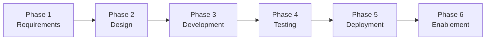
```mermaid
graph LR
    REQ["Phase 1<br/>Requirements"] --> DESIGN["Phase 2<br/>Design"]
    DESIGN --> DEV["Phase 3<br/>Development"]
    DEV --> TEST["Phase 4<br/>Testing"]
    TEST --> DEPLOY["Phase 5<br/>Deployment"]
    DEPLOY --> ENABLE["Phase 6<br/>Enablement"]

    REQ:::phase
    DESIGN:::phase
    DEV:::phase
    TEST:::phase
    DEPLOY:::phase
    ENABLE:::phase
```

### Workflow

```
/wire:new                                          # release_type: full_platform

# Phase 1: Requirements
/wire:requirements-generate <release-folder>
/wire:requirements-validate <release-folder>
/wire:requirements-review <release-folder>

# Phase 2: Design
/wire:conceptual_model-generate <release-folder>
/wire:conceptual_model-validate <release-folder>
/wire:conceptual_model-review <release-folder>

/wire:pipeline_design-generate <release-folder>
/wire:pipeline_design-validate <release-folder>
/wire:pipeline_design-review <release-folder>

/wire:data_model-generate <release-folder>
/wire:data_model-validate <release-folder>
/wire:data_model-review <release-folder>

/wire:mockups-generate <release-folder>
/wire:mockups-review <release-folder>

# Phase 3: Development
/wire:pipeline-generate <release-folder>
/wire:pipeline-validate <release-folder>
/wire:pipeline-review <release-folder>

/wire:dbt-generate <release-folder>
/wire:dbt-validate <release-folder>
/wire:utils-run-dbt <release-folder>
/wire:dbt-review <release-folder>

/wire:orchestration-generate <release-folder>    # choose Dagster, dbt Cloud, or Airflow
/wire:orchestration-validate <release-folder>
/wire:orchestration-review <release-folder>

/wire:semantic_layer-generate <release-folder>
/wire:semantic_layer-validate <release-folder>
/wire:semantic_layer-review <release-folder>

/wire:dashboards-generate <release-folder>
/wire:dashboards-validate <release-folder>
/wire:dashboards-review <release-folder>

# Phase 4: Testing
/wire:data_quality-generate <release-folder>
/wire:data_quality-validate <release-folder>
/wire:data_quality-review <release-folder>

/wire:uat-generate <release-folder>
/wire:uat-review <release-folder>

# Phase 5: Deployment
/wire:deployment-generate <release-folder>
/wire:deployment-validate <release-folder>
/wire:utils-deploy-to-dev <release-folder>
/wire:deployment-review <release-folder>
/wire:utils-deploy-to-prod <release-folder>

# Phase 6: Enablement
/wire:training-generate <release-folder>
/wire:training-validate <release-folder>
/wire:training-review <release-folder>

/wire:documentation-generate <release-folder>
/wire:documentation-validate <release-folder>
/wire:documentation-review <release-folder>

/wire:archive <release-folder>
```

### Phase 1: Requirements (Day 1)

```
/wire:new
```
Answer the prompts: release type (`full_platform`), client name, engagement name, SOW path. Selecting `full_platform` instantiates the complete delivery process into the release's `status.md` — all 15 artifacts across six phases, each with generate/validate/review gates set to `not_started`. A `pipeline_only` release would only activate seven artifacts; a `dashboard_extension` just four. If you're on `main` or `master`, the framework will ask you to create a feature branch before creating any files. Optionally set up Jira tracking.

**After `/wire:new` completes**: Copy the SOW PDF (and any other source materials — meeting notes, SQL examples, existing data model docs) into the release's `requirements/` directory. Also ensure `engagement/sow.md` and `engagement/context.md` are populated — these are read by all commands throughout the release.

```
/wire:requirements-generate <release-folder>
```
The AI reads the SOW and engagement context, extracts structured requirements (functional, non-functional, data, technical, user), maps each SOW deliverable to the framework artifacts that will produce it, and writes `requirements/requirements_specification.md`.

```
/wire:requirements-validate <release-folder>
```
Checks completeness across all 13 sections, verifies each deliverable has acceptance criteria, and flags any timeline feasibility concerns.

```
/wire:requirements-review <release-folder>
```
Present the requirements to the client stakeholder. Record their approval (or requested changes) in the framework. If changes are needed: address them and re-run generate + validate + review.

**If requirements need workshop clarification**:
```
/wire:workshops-generate <release-folder>
/wire:workshops-review <release-folder>
```

**Ready criteria**: requirements artifact is `review: approved`.

### Phase 2: Design (Days 2–4)

The design phase follows a defined sequence. The conceptual model gates everything else.

#### Step 1: Conceptual entity model (Day 2 morning)

```
/wire:conceptual_model-generate <release-folder>
```
Produces a business-level entity model: an inventory of domain entities, a Mermaid `erDiagram` (entity names and relationships, no columns), and a relationship narrative. Any ambiguous entity boundaries or scope questions are surfaced as Open Questions.

```
/wire:conceptual_model-validate <release-folder>
```
Checks entity coverage against functional requirements, cardinality completeness, diagram syntax, PascalCase naming, and that no column-level detail has leaked in.

```
/wire:conceptual_model-review <release-folder>
```
**Review audience: business stakeholders, not just the technical team.** The goal is to confirm the entity landscape — what the business cares about — before pipeline architecture and detailed modelling begins. Approving entities here constrains everything that follows.

**Ready criteria**: `conceptual_model: review: approved` — this unblocks pipeline_design and data_model.

#### Step 2: Pipeline design + data flow diagram (Day 2–3)

```
/wire:pipeline_design-generate <release-folder>
```
Produces the full pipeline architecture document — source system analysis, replication scenarios with cost analysis, scheduling, error handling, design decisions requiring client input — **plus an embedded Data Flow Diagram (DFD)** as a Mermaid flowchart showing the end-to-end movement of data from source systems through ingestion, staging, warehouse, to BI dashboards.

```
/wire:pipeline_design-validate <release-folder>
```
Validates the architecture text and the DFD: all sources present, entity coverage through the flow, staging naming conventions, node labels populated (no placeholders), and Mermaid syntax.

```
/wire:pipeline_design-review <release-folder>
```
Technical review with the data engineering lead. Resolve any open design decisions (replication scenarios, scheduling choices) before this is approved.

#### Step 3: Data model specification + physical ERD (Day 3–4)

```
/wire:data_model-generate <release-folder>
```
Produces the complete dbt-layer data model specification — source definitions with freshness thresholds, staging models with grain and column mappings, integration models, warehouse models with surrogate keys and FK paths, seed files — **plus an embedded Physical ERD** as a Mermaid `erDiagram` with every warehouse model, all columns with types, PKs, FKs, and relationship lines. This is the most consequential design artifact.

```
/wire:data_model-validate <release-folder>
```
Validates naming conventions, grain definitions, PK/FK traceability, test coverage plan, and ERD consistency (every ERD entity matches the model spec, every FK has a corresponding join definition).

```
/wire:data_model-review <release-folder>
```
**This is the most important review gate in the full-platform workflow.** Approving a model with incorrect grain, wrong join keys, or missing entities is expensive to fix after dbt code is generated. Reviewer: analytics engineering lead. Allow adequate time.

#### Step 4: Dashboard mockups (Day 4)

```
/wire:mockups-generate <release-folder>
```
Produces dashboard wireframes based on the requirements. Review with end users, not the technical stakeholder.

**Ready criteria**: all four design artifacts are `review: approved`.

### Phase 3: Development (Days 5–8)

```
/wire:pipeline-generate <release-folder>
```
Generates data pipeline code (Python, Cloud Functions, or equivalent) based on the approved pipeline design. Includes extract logic, load logic, error handling, and scheduling configuration.

```
/wire:dbt-generate <release-folder>
```
Generates all dbt models — staging, integration, and warehouse layers — from the approved data model specification. The generation workflow embeds comprehensive analytics engineering conventions: field naming rules (`_pk`, `_fk`, `_natural_key`, `_ts`, `is_`/`has_` prefixes), field ordering (keys → dates → attributes → metrics → metadata), SQL style rules (4-space indentation, 80-char lines, explicit joins, `s_` CTE prefix, `final` CTE pattern), and multi-source framework support for releases with multiple source systems (configuration-driven source management, entity deduplication with `merge_sources` macro, `IN UNNEST()` join patterns). Convention loading follows a 2-tier system: project-specific conventions (`.dbt-conventions.md`) take priority over embedded defaults. Includes YAML documentation files and automated tests (not_null + unique on every PK, relationships on every FK, typically 40–50 tests for a mid-sized engagement).

```
/wire:utils-run-dbt <release-folder>
```
Runs the generated dbt models in dbt Cloud or locally. Verify all models build and tests pass before proceeding.

```
/wire:dbt-validate <release-folder>
```
Validates dbt models against a comprehensive checklist: file and model naming conventions (singular names, correct layer prefixes/suffixes), field naming conventions (`_pk`, `_fk`, `_ts`, boolean prefixes), field ordering, SQL structure (CTE patterns, style compliance), model configuration (materialization by layer), testing coverage (PK tests, FK relationships, integration model unique combinations), documentation coverage (100% for staging and warehouse layers), and optionally runs sqlfluff linting. Produces a structured validation report with severity-rated issues (critical, important, nice-to-have) and actionable recommendations.

```
/wire:orchestration-generate <release-folder>
```
Sets up the orchestration layer. Prompts you to choose between three tools:

- **Dagster**: scaffolds a Dagster project, adds `dagster-dbt` integration via a `DbtProjectComponent` YAML (one asset per dbt model), generates `@dg.asset` definitions per source system, and creates schedules/sensors matching the pipeline design cadences. Run locally with `dg dev` (Dagster UI at localhost:3000) and `dg launch --assets "*"`.
- **dbt Cloud**: generates environment configs (dev/prod), job definitions per cadence, a CI/PR job, and a `.env.template` for credentials. Includes Terraform HCL snippets for IaC management.
- **Airflow**: generates a Python DAG with `BashOperator` dbt tasks and source readiness sensors (one per source system), an `airflow_connections.md` reference, and an `airflow_variables.md` template. Best when the client already runs Airflow. If Astronomer Cosmos is available, a `DbtTaskGroup` alternative is provided as an inline comment.

The tool choice is stored in `status.md` as `orchestration_tool` and reused by validate and review.

```
/wire:orchestration-validate <release-folder>
```
For Dagster: runs `dg check defs` to verify the asset graph loads, checks all dbt models have corresponding assets, and verifies schedule cadences match the pipeline design. For dbt Cloud: validates config completeness, model selectors, and cron expressions.

```
/wire:semantic_layer-generate <release-folder>
```
Generates LookML views, explores, measures, and dimension definitions from the approved dbt models. The generation follows a 9-phase workflow: understand the task, examine existing LookML project, parse schema information (with full data type mapping), design the LookML structure, create view files (with embedded templates for primary keys, string/date/numeric dimensions, derived fields, measures, and drill sets), update model files, validate syntax, and provide a handover summary. Includes 5 embedded patterns (dimension table, fact table, aggregated PDT, multi-join explore, native derived table with parameters) and BigQuery-specific support (nested/repeated fields with UNNEST, partitioned table optimization, JSON field handling). Validation includes mandatory table/column reference cross-checking against source DDL and `preferred_slug` compliance checking.

```
/wire:dashboards-generate <release-folder>
```
Generates Looker dashboard LookML from the approved mockups and semantic layer. Validate and review.

**Ready criteria**: all four development artifacts are `review: approved` and dbt tests passing.

### Phase 4: Testing (Days 9–10)

```
/wire:data_quality-generate <release-folder>
```
Generates additional data quality tests beyond the embedded dbt tests: freshness checks, row count reconciliation, cross-system validation, custom business rules.

```
/wire:utils-run-dbt <release-folder>
```
Run dbt tests (use `--test` flag). Review any failures and fix the underlying data or model issues.

```
/wire:uat-generate <release-folder>
```
Generates a UAT plan mapped to the functional requirements. Conduct UAT sessions with end users, record outcomes, and iterate on any issues.

```
/wire:uat-review <release-folder>
```
Records UAT sign-off. Do not proceed to deployment without this.

**Ready criteria**: all dbt tests passing, UAT approved.

### Phase 5: Deployment (Day 11)

```
/wire:deployment-generate <release-folder>
```
Generates the deployment runbook (step-by-step production deployment instructions), CI/CD pipeline configuration, monitoring and alerting setup, and rollback procedures.

```
/wire:deployment-validate <release-folder>
```
Pre-deployment checklist: verifies all upstream artifacts are ready, no outstanding blockers, monitoring configuration complete.

```
/wire:utils-deploy-to-dev <release-folder>
```
Test the deployment process in the dev environment. Smoke-test all models, pipelines, and dashboards before the review gate.

```
/wire:deployment-review <release-folder>
```
Present the deployment runbook and dev-environment results to the technical lead. Confirm the production deployment plan and rollback procedures before any production changes.

```
/wire:utils-deploy-to-prod <release-folder>
```
Follow the approved runbook. Smoke-test after deployment. Monitor for the first 24 hours.

**Ready criteria**: production deployment successful, monitoring operational.

### Phase 6: Enablement (Days 12–13)

```
/wire:training-generate <release-folder>
```
Generates two training packages:
- **Data team enablement**: technical session plan (2 hours), covering how to extend the models, add new data sources, interpret monitoring alerts
- **End user training**: dashboard usage session (90 minutes), including responsible interpretation of data signals

```
/wire:training-review <release-folder>
```
Rehearse sessions internally before delivering. Record any adjustments.

Deliver the training sessions. Record attendance in status.

```
/wire:documentation-generate <release-folder>
```
Generates technical architecture documentation and end-user guides. Validate and finalise.

```
/wire:archive <release-folder>
```
Archives the completed release and produces a release summary.

### Utility commands available at any phase

In addition to the phase-specific commands above, the framework provides utility commands that can be used at any point during a release:

- **`/wire:utils-run-dbt <release-folder>`** — Runs the generated dbt models in dbt Cloud or locally
- **`/wire:utils-deploy-to-dev <release-folder>`** — Deploys to the development environment
- **`/wire:utils-deploy-to-prod <release-folder>`** — Deploys to the production environment
- **`/wire:utils-meeting-context <release-folder>`** — Retrieves Fathom meeting transcripts for context, useful for capturing client decisions and requirements discussed in calls
- **`/wire:utils-jira-sync <release-folder>`** — Syncs artifact status to Jira issues, keeping project management tools in sync with framework state
- **`/wire:utils-jira-status-sync <release-folder>`** — Full reconciliation of all artifact states to Jira, ensuring complete alignment between framework status and Jira
- **`/wire:utils-jira-create <release-folder>`** — Creates or links Jira issues for a release. Can create a new Epic/Task/Sub-task hierarchy from scratch, or search an existing Jira project for matching issues and link to them
- **`/wire:utils-atlassian-search <release-folder>`** — Searches Confluence for documentation, useful for finding existing client documentation and prior engagement materials

> **Tip**: Run `/wire:playbook-generate <release-folder>` after requirements are approved to get a visual end-to-end plan for this release. See [Section 29](#29-framework-management-commands).

---

## 11. Running a Pipeline + dbt Release

Use this when a new data source needs connecting through to the dbt layer, but a BI tool / semantic layer is already in place or out of scope.

**In-scope artifacts**: `requirements`, `workshops` (if needed), `pipeline_design`, `data_model`, `pipeline`, `dbt`, `data_quality`, `deployment`

**Out of scope**: `mockups`, `semantic_layer`, `dashboards`, `uat`, `training`, `documentation`

### Choosing a pipeline replication tool

`/wire:pipeline_design-generate` now includes a **pipeline tool selection step** (Design Decision PD-1). The framework supports three managed tools plus a custom option:

| Tool | Best for | Cost model | Infrastructure |
|------|----------|-----------|----------------|
| **Fivetran** | SaaS sources, managed CDC, minimal engineering | MAR-based | Fully managed |
| **dlt** | Python-native teams, cost-sensitive, custom APIs | Open-source | Scripts + dlt Cloud |
| **Airbyte** | Mixed sources, open-source preference | Open-source / Cloud | Self-hosted or Airbyte Cloud |
| **Custom** | Highly specialised sources, full control | Engineering time | Self-managed |

The chosen tool is recorded as `pipeline_tool` in `status.md`. All downstream `/wire:pipeline-*` commands read this value and route automatically — you never need to specify the tool again after the design step.

**Fivetran**: when selected, the design step calls the Fivetran MCP to verify the connector exists and fetch its required config fields before the design document is finalised. The generate step then uses the MCP to create connections, configure table/column sync, and set sync frequency — with idempotency (won't duplicate existing connections on re-runs).

### Workflow

```
/wire:new                                   # release_type: pipeline_dbt

/wire:requirements-generate <release-folder>
/wire:requirements-validate <release-folder>
/wire:requirements-review <release-folder>

/wire:pipeline_design-generate <release-folder>
/wire:pipeline_design-validate <release-folder>
/wire:pipeline_design-review <release-folder>

/wire:data_model-generate <release-folder>
/wire:data_model-validate <release-folder>
/wire:data_model-review <release-folder>

/wire:pipeline-generate <release-folder>
/wire:pipeline-validate <release-folder>
/wire:pipeline-review <release-folder>

/wire:dbt-generate <release-folder>
/wire:dbt-validate <release-folder>
/wire:utils-run-dbt <release-folder>
/wire:dbt-review <release-folder>

/wire:data_quality-generate <release-folder>
/wire:data_quality-validate <release-folder>
/wire:data_quality-review <release-folder>

/wire:deployment-generate <release-folder>
/wire:deployment-validate <release-folder>
/wire:deployment-review <release-folder>
/wire:utils-deploy-to-prod <release-folder>

/wire:archive <release-folder>
```

> **Tip**: Run `/wire:playbook-generate <release-folder>` after the pipeline design is approved to generate a visual delivery plan for this release. See [Section 29](#29-framework-management-commands).

---

## 12. Running a dbt Development Release

Use this when data is already in the warehouse (e.g. via Fivetran, Stitch, or manual loads) and you need to build or extend the dbt transformation layer.

**In-scope artifacts**: `requirements`, `conceptual_model`, `data_model`, `dbt`, `data_quality`

### Workflow

```
/wire:new                                         # release_type: dbt_development

/wire:requirements-generate <release-folder>      # Focus on transformation requirements
/wire:requirements-validate <release-folder>
/wire:requirements-review <release-folder>

/wire:conceptual_model-generate <release-folder>
/wire:conceptual_model-validate <release-folder>
/wire:conceptual_model-review <release-folder>

/wire:data_model-generate <release-folder>        # Read existing source schema + requirements
/wire:data_model-validate <release-folder>
/wire:data_model-review <release-folder>

/wire:dbt-generate <release-folder>
/wire:dbt-validate <release-folder>
/wire:utils-run-dbt <release-folder>
/wire:dbt-review <release-folder>

/wire:data_quality-generate <release-folder>
/wire:data_quality-validate <release-folder>
/wire:data_quality-review <release-folder>

/wire:archive <release-folder>
```

**Tips for dbt-only releases**:
- Add any existing dbt project files (existing `schema.yml`, source definitions, SQL examples) to `requirements/` before running `data_model:generate` — the AI will use them to understand the existing model structure and extend it correctly
- Store SQL examples from the source database (schema introspection results, sample queries) so the AI understands actual column names and types

> **Tip**: Run `/wire:playbook-generate <release-folder>` after requirements are approved to get a step-by-step plan for the dbt development work. See [Section 29](#29-framework-management-commands).

---

## 13. Running a Dashboard Extension Release

Use this when the semantic layer already has the data, and you're adding new dashboards on top.

**In-scope artifacts**: `requirements`, `mockups`, `dashboards`, `uat`

### Workflow

```
/wire:new                                         # release_type: dashboard_extension

/wire:requirements-generate <release-folder>      # Focus on dashboard/user requirements
/wire:requirements-validate <release-folder>
/wire:requirements-review <release-folder>

/wire:mockups-generate <release-folder>           # Wireframes for review with end users
/wire:mockups-review <release-folder>

/wire:dashboards-generate <release-folder>
/wire:dashboards-validate <release-folder>
/wire:dashboards-review <release-folder>

/wire:uat-generate <release-folder>
/wire:uat-review <release-folder>

/wire:archive <release-folder>
```

**Tips**:
- Add existing LookML view files to `requirements/` before generating dashboards — the AI needs to know which dimensions and measures are available
- Screenshots of existing Looker explores also help

> **Tip**: Run `/wire:playbook-generate <release-folder>` after the semantic layer design is confirmed to plan the dashboard build. See [Section 29](#29-framework-management-commands).

---

## 14. Running a Dashboard-First Rapid Development Release

Use this when you want early stakeholder feedback via interactive dashboard mocks before building the data layer. This approach is especially effective when the SOW is well-defined but client data access may be delayed — you can have a working prototype with seed data before the client provides database credentials.

**In-scope artifacts**: `requirements`, `mockups`, `viz_catalog`, `data_model`, `seed_data`, `dbt`, `semantic_layer`, `dashboards`, `data_refactor`, `data_quality`, `uat`, `deployment`, `training`, `documentation`

**Out of scope**: `workshops`, `conceptual_model`, `pipeline_design`, `pipeline`

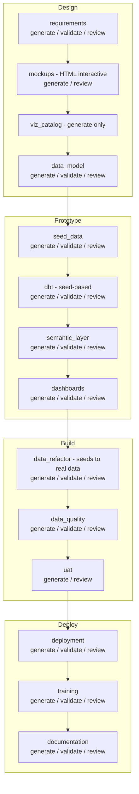
```mermaid
flowchart TB
    subgraph s1["Design"]
        REQ["requirements<br/>generate / validate / review"]
        MK["mockups - HTML interactive<br/>generate / review"]
        VIZ["viz_catalog - generate only"]
        DM["data_model<br/>generate / validate / review"]
    end
    subgraph s2["Prototype"]
        SD["seed_data<br/>generate / validate / review"]
        DBT["dbt - seed-based<br/>generate / validate / review"]
        SL["semantic_layer<br/>generate / validate / review"]
        DASH["dashboards<br/>generate / validate / review"]
    end
    subgraph s3["Build"]
        DR["data_refactor - seeds to real data<br/>generate / validate / review"]
        DQ["data_quality<br/>generate / validate / review"]
        UAT["uat<br/>generate / review"]
    end
    subgraph s4["Deploy"]
        DEP["deployment<br/>generate / validate / review"]
        TR["training<br/>generate / validate / review"]
        DOC["documentation<br/>generate / validate / review"]
    end
    REQ --> MK --> VIZ --> DM
    DM --> SD --> DBT --> SL --> DASH
    DASH --> DR --> DQ --> UAT
    UAT --> DEP --> TR --> DOC
```

### Specialist agents for dashboard_first

Two specialist agents activate exclusively for this release type:

**`dashboard-mock-developer`** handles the mockup and visualization catalog phases. Unlike other agents that produce an artifact and stop, this agent runs an explicit iteration loop: it generates the first HTML mock immediately from requirements, then presents it and invites changes — tile names, chart types, layout, new pages, filter dimensions. It keeps iterating until you confirm approval. Only then does it produce three derived artifacts:
- `design/dashboard_visualization_catalog.csv` — one row per chart, KPI tile, and table
- `design/dashboard_spec.md` — data-content spec stripped of chrome and styling
- `design/data_model_requirements.md` — the distinct measures and dimensions the mock needs, with grain and calculation definitions

The `data_model_requirements.md` is the primary input for both `data-designer` (formal data model) and `mock-data-developer` (seed data).

**`mock-data-developer`** handles two phases separated in time. In the seed data phase (immediately after data model approval), it generates referentially-integral CSV seed files with domain-appropriate data — realistic enough to produce non-zero dashboard output without needing a single row of client data. In the data refactor phase (once client data access is confirmed), it repoints staging models from seeds to real sources, produces a written refactor plan before touching any code, and validates `dbt compile` succeeds.

When using `/wire:delegate` for a `dashboard_first` release, the delegation plan reflects this:

```
Step 1:  discovery-analyst           → requirements
Step 2:  dashboard-mock-developer    → mockups (iterate), viz_catalog, data_model_requirements
Step 3:  data-designer               → data_model (driven by data_model_requirements.md)
Step 4:  mock-data-developer         → seed_data
Step 5:  dbt-developer               → dbt (seed-based, ref() not source())
Step 6a: semantic-layer-developer    → semantic_layer, dashboards  (parallel)
Step 6b: data-quality-engineer       → data_quality                (parallel)
Step 7:  qa-agent                    → validate all artifacts
Step 8:  mock-data-developer         → data_refactor (triggered when client data available)
Step 9:  delivery-lead               → deployment, training, documentation
```

### Workflow

```
/wire:new                                               # release_type: dashboard_first

# Phase 1: Requirements (Day 1)
/wire:requirements-generate <release-folder>
/wire:requirements-validate <release-folder>
/wire:requirements-review <release-folder>

# Phase 2: Interactive Dashboard Mocks (Day 1–2)
/wire:mockups-generate <release-folder>                 # HTML interactive mockups
/wire:mockups-review <release-folder>

# Phase 3: Visualization Catalog (Day 2)
/wire:viz_catalog-generate <release-folder>             # Generate-only, no validate/review

# Phase 4: Data Model (Day 2–3)
/wire:data_model-generate <release-folder>              # Driven by viz_catalog, not conceptual model
/wire:data_model-validate <release-folder>
/wire:data_model-review <release-folder>

# Phase 5: Seed Data (Day 3)
/wire:seed_data-generate <release-folder>               # CSV files with referential integrity
/wire:seed_data-validate <release-folder>
/wire:seed_data-review <release-folder>

# Phase 6: Development — seed-based (Days 3–5)
/wire:dbt-generate <release-folder>                     # Uses ref() to seeds, not source()
/wire:dbt-validate <release-folder>
/wire:utils-run-dbt <release-folder>                    # dbt seed && dbt run && dbt test
/wire:dbt-review <release-folder>

/wire:semantic_layer-generate <release-folder>
/wire:semantic_layer-validate <release-folder>
/wire:semantic_layer-review <release-folder>

/wire:dashboards-generate <release-folder>
/wire:dashboards-validate <release-folder>
/wire:dashboards-review <release-folder>

# Phase 7: Data Refactor — seeds → real data (when client data available)
/wire:data_refactor-generate <release-folder>           # Compares seed schema to real schema
/wire:data_refactor-validate <release-folder>           # Verifies dbt compiles against real data
/wire:data_refactor-review <release-folder>

# Phase 8: Testing
/wire:data_quality-generate <release-folder>
/wire:data_quality-validate <release-folder>
/wire:data_quality-review <release-folder>

/wire:uat-generate <release-folder>
/wire:uat-review <release-folder>

# Phase 9: Deployment + Enablement
/wire:deployment-generate <release-folder>
/wire:deployment-validate <release-folder>
/wire:deployment-review <release-folder>
/wire:utils-deploy-to-prod <release-folder>

/wire:training-generate <release-folder>
/wire:training-validate <release-folder>
/wire:training-review <release-folder>

/wire:documentation-generate <release-folder>
/wire:documentation-validate <release-folder>
/wire:documentation-review <release-folder>

/wire:archive <release-folder>
```

### Phase 1: Requirements (Day 1)

Same as Full Platform — ensure `engagement/sow.md` is present, run requirements generate/validate/review. The key difference is that requirements approval unblocks **mockups** (not conceptual model).

### Phase 2: Interactive Dashboard Mockups (Day 1–2)

This is the key differentiator. Instead of generating ASCII wireframes, the mockups command for `dashboard_first` projects generates **pixel-accurate, interactive HTML Looker mockups** directly inside Claude Code — no external tools required.

```
/wire:mockups-generate <release-folder>
```

The framework:
1. Reads the approved requirements and plans the dashboard structure — pages, KPI tiles, charts, tables, and filters
2. Reads the Looker design system reference (teal sidebar, Google Sans, Chart.js charts) from the bundled skill
3. Generates one or more **self-contained HTML files** that faithfully reproduce the Looker UI, with interactive Chart.js charts and filter controls
4. Simultaneously produces `design/dashboard_visualization_catalog.csv` and `design/dashboard_spec.md` — the downstream inputs for the visualization catalog command
5. All files are saved to `design/mockups/` and ready immediately

```
/wire:mockups-review <release-folder>
```

Review the HTML mockups with end users and stakeholders. Open the HTML files in a browser — they are fully interactive. Attach them to emails or share via a file share for async feedback.

**Tips**:
- Open the HTML file in a browser to experience the full interactive dashboard before sharing with stakeholders — the charts respond to hover and the tabs switch.
- Iterate on the mockups by asking Claude to modify specific tiles, charts, or data before running `viz_catalog:generate`. Changes after the catalog is generated require regenerating downstream artifacts.
- For dashboard-first engagements where the data domain is complex, share the mockup with the client early — even before requirements are fully approved — to validate the direction.

### Phase 3: Visualization Catalog (Day 2)

```
/wire:viz_catalog-generate <release-folder>
```

This is a **generate-only** artifact (no separate validate or review gates). The command parses the CSV and markdown generated by `/wire:mockups-generate` into a structured catalog: a dashboard inventory, measures index, dimensions index, and requirements coverage analysis. This answers the question: exactly which measures and dimensions must the data model provide?

### Phase 4: Data Model (Day 2–3)

```
/wire:data_model-generate <release-folder>
```

For `dashboard_first`, the data model is driven by the **visualization catalog** instead of a conceptual model and pipeline design. The prerequisites are `requirements: approved` and `viz_catalog: complete` (not `conceptual_model: approved` + `pipeline_design: approved` as in Full Platform).

The command also generates `source_tables_ddl.sql` and `target_warehouse_ddl.sql` in the design folder — SQL DDL files that define the expected source and target schemas.

### Phase 5: Seed Data (Day 3)

```
/wire:seed_data-generate <release-folder>
```

After the data model is approved, the framework generates **internally consistent CSV seed data files** — one per source table — with realistic, domain-appropriate values that maintain referential integrity across all foreign key relationships.

The seed data validation gate checks:
- PK uniqueness (no duplicate primary keys)
- FK integrity (every foreign key value exists in the referenced table)
- Date consistency (no future dates in historical fields, chronological ordering)
- Value distributions (realistic for meaningful dashboard visualizations)

### Phase 6: Development — seed-based (Days 3–5)

```
/wire:dbt-generate <release-folder>
```

For `dashboard_first`, dbt generation uses `ref('seed_name')` instead of `source()` — meaning `dbt seed && dbt run && dbt test` works immediately without any client data access. You have a working dbt project, populated warehouse, and functional dashboards before the client provides database credentials.

The rest of development (semantic layer, dashboards) proceeds as in Full Platform.

### Phase 7: Data Refactor (when client data available)

```
/wire:data_refactor-generate <release-folder>
```

Once the client provides access to their actual data sources (DDLs, database credentials, or standard SaaS connector schemas), this command:
1. Compares the seed-based source schema against the real one
2. Generates a refactoring plan documenting every change needed
3. Executes the changes: updates source definitions, staging model SQL, and dbt configuration
4. Preserves seed files as reference

The transition from `ref('customers_seed')` to `source('salesforce', 'accounts')` is a mechanical operation guided by the schema comparison. This step — which would be expensive to do manually — is straightforward because the staging models were designed from the start to be refactorable.

### Tips for dashboard-first engagements

- **Start mocking early**: You can run `/wire:mockups-generate` during the SOW preparation phase or even before project kick-off. The earlier stakeholders see something visual, the better the feedback.
- **Seed data quality matters**: Realistic seed data makes the prototype convincing. The framework generates domain-appropriate values, but review the seeds for realism before showing to stakeholders.
- **Don't delay the refactor**: Once client data is available, run the data refactor promptly. The longer you wait, the more the seed-based version diverges from what the client expects.
- **The prototype is disposable**: The seed-based dbt project exists to validate the design. The real value is the iteration it enables, not the seed data itself.

> **Tip**: Run `/wire:playbook-generate <release-folder>` after mockups are approved to generate a delivery plan that shows the mock → seed → real-data refactor progression. See [Section 29](#29-framework-management-commands).

---

## 15. Running an Enablement Release

Use this when an existing platform needs training and documentation — either as a standalone release or as the final phase of a delivery that was not originally run through the Wire Framework.

**In-scope artifacts**: `training`, `documentation`

### Workflow

```
/wire:new                                         # release_type: enablement

/wire:requirements-generate <release-folder>      # Capture training audience and learning objectives

/wire:training-generate <release-folder>
/wire:training-validate <release-folder>
/wire:training-review <release-folder>

/wire:documentation-generate <release-folder>
/wire:documentation-validate <release-folder>
/wire:documentation-review <release-folder>

/wire:archive <release-folder>
```

**Tips**:
- Add any existing technical documentation, data dictionaries, or architecture diagrams to `requirements/` — the AI will use them as the basis for generated materials
- Add the client stakeholder list (names, roles, technical levels) so training materials can be calibrated appropriately

> **Tip**: Run `/wire:playbook-generate <release-folder>` after requirements are set to plan the training and documentation sequence. See [Section 29](#29-framework-management-commands).

---

## 16. Running a Platform Migration Release

The Platform Migration release type (`release_type: platform_migration`) covers the full lifecycle of migrating a data platform from one warehouse stack to another. It supports bidirectional BigQuery ↔ Snowflake migrations and introduces two structural features not found in other release types: a two-zone artifact model (audit zone then migration zone) and an iterative equivalency loop that runs until all data checks pass before cutover is allowed.

**Supported platform pairs**: `bigquery_to_snowflake`, `snowflake_to_bigquery`

**Typical engagement driver**: existing dbt project on source platform needs to land on target platform — every connector, model, role, and job migrated, proven equivalent, and cut over.

---

### Artifact zones

**Audit zone** — read-only analysis of the source platform. No writes to any external system.

| Artifact | Command | Purpose |
|---|---|---|
| `ingestion_audit` | `/wire:ingestion-audit-*` | Catalog all Fivetran connectors, sync configs, column selections |
| `db_object_audit` | `/wire:db-object-audit-*` | Enumerate databases, schemas, tables, views, procedures, scheduled queries |
| `security_audit` | `/wire:security-audit-*` | Catalog roles, permissions, users, service accounts, row/column-level security |
| `dbt_audit` | `/wire:dbt-audit-*` | Catalog dbt models, classify by migration complexity, detect platform-specific SQL features |
| `orchestration_audit` | `/wire:orchestration-audit-*` | Catalog orchestration jobs, schedules, and dependencies |
| `migration_inventory` | `/wire:migration-inventory-*` | Synthesise all five audits into a unified catalogue with dependency graph and phased plan |

**Migration zone** — writes to the target platform. Safety-gated commands require explicit confirmation before any external system is touched.

| Artifact | Command | Safety gate | Purpose |
|---|---|---|---|
| `migration_batching` | `/wire:migration-batching-*` | No | Partition the approved inventory into named domain batches, checked against the real dependency graph; `-review` is the client sign-off on composition and schedule |
| `migration_strategy` | `/wire:migration-strategy-*` | No | Platform-pair translation decisions, phasing, rollback, equivalency success criteria |
| `target_setup` | `/wire:target-setup-*` | **Yes** | Target warehouse config, schemas, roles, service accounts |
| `ingestion_migration` | `/wire:ingestion-migration-*` | **Yes** | Migrate connectors to target platform via MCP (creates new connectors + connect cards); runbook fallback if MCP unavailable |
| `dbt_migration` | `/wire:dbt-migration-*` | No | Translate dbt models batch by batch to target dialect |
| `orchestration_migration` | `/wire:orchestration-migration-*` | **Yes** | Recreate orchestration jobs on target platform |
| `equivalency_validation` | `/wire:equivalency-*` | No (loop) | Iterative row-count, schema, value, freshness comparison |
| `migration_register` | `/wire:migration-register-*` | No | Per-model state store — source commit, BigQuery target, state, last equivalence result; maintained incrementally by other migration commands |
| `migration_drift` | `/wire:migration-drift-*` | No | Scheduled gate — diffs the live source against each model's last-migrated commit, flags downstream Hightouch syncs and masking-policy changes |
| `cutover` | `/wire:cutover-*` | **Yes** | Go-live runbook — point of no return |
| `migration_report` | `/wire:migration-report-*` | No | Post-migration record |

---

### Setting up a Platform Migration release

Run `/wire:new` and select **Platform Migration**. After the standard engagement questions, you will be asked five additional questions:

1. **Source platform** — BigQuery or Snowflake
2. **Target platform** — must differ from source
3. **dbt project path** — relative to repo root (default: `./dbt`)
4. **Orchestration tool** — Dagster, dbt Cloud, Airflow, or None
5. **Connectivity** — public endpoint (standard MCP) or private network requiring an MCP tunnel

If the source platform is behind a VPC and not publicly reachable, select **Private network — MCP tunnel required**. Wire outputs the exact tunnel deployment steps before continuing — do not proceed until the tunnel is confirmed active.

---

### Audit zone: parallel by default

The five audit commands default to parallel execution via a single wrapper command:

```
/wire:migration-audit-all <release-folder>
```

This fans out five subagents simultaneously — ingestion audit (Fivetran MCP or CSV fallback), db object audit (INFORMATION_SCHEMA), security audit (IAM API), dbt audit (project file parsing), orchestration audit (config files). Each subagent's output is independently verified before being folded into the combined result. On completion, `migration-inventory-generate` is triggered automatically.

Before launching, you will see a token cost confirmation:

```
This will run 5 audit subagents in parallel using a dynamic workflow.
Estimated token usage: HIGH (particularly for large warehouses or dbt projects).

A) Run all 5 audits in parallel (fastest — recommended for most engagements)
B) Run audits sequentially instead
```

If you choose sequential, Wire outputs the five individual commands in order and stops. Run them at your own pace, then continue to `migration-inventory-generate` once all five are approved.

**Individual audit commands (sequential fallback or re-run):**
```
/wire:ingestion-audit-generate <release-folder>
/wire:db-object-audit-generate <release-folder>
/wire:security-audit-generate <release-folder>
/wire:dbt-audit-generate <release-folder>
/wire:orchestration-audit-generate <release-folder>
```

---

### Fivetran connectivity: MCP or CSV fallback

`ingestion-audit-generate` auto-detects Fivetran MCP availability on a 10-second timeout. If the MCP is reachable, it queries connectors, sync configs, and table selections directly. If it times out, it automatically falls back to reading from a CSV file:

```
.wire/releases/<release-folder>/audit/fivetran_connectors_input.csv
```

If neither MCP nor CSV is available, the command outputs the full CSV template with column definitions and halts. The CSV is a first-class input — the audit output is identical whether data came from MCP or CSV. The `status.md` field `ingestion_audit.input_mode` is set to `mcp` or `csv` to record which path was used.

For large engagements (e.g. 134 connectors), prepare the CSV before running the audit zone. The Fivetran Connectors dashboard exports the connector list; the CSV template is at `wire/TEMPLATES/migration/fivetran_connectors_input.csv`.

---

### Ingestion migration: MCP-driven execution

`ingestion-migration-generate` does not just write a runbook — when the relevant ingestion tool's MCP server is reachable, Wire executes the migration directly:

1. **Probes the MCP server** for the ingestion tool identified in the audit (Fivetran → `mcp__fivetran__`, Airbyte → `mcp__airbyte__`, etc.)
2. **Creates a new connector** on the target destination for each in-scope connector — never edits or re-points the existing source connector, which stays active for the parallel-run window
3. **Generates a connect card** (or equivalent setup URL) for each new connector and presents it immediately: *"Open this link to enter credentials for `<connector_name>`"*
4. **Tracks completion** — polls connector state and reports which connectors have reached `connected` status

This approach means Wire handles the mechanical connector setup. You only need to open each connect card URL and enter credentials. The connect cards open to a Fivetran (or Airbyte) credential form pre-scoped to the correct connector — no navigating the UI, no selecting destinations, no configuring schemas.

If the MCP server is not reachable, Wire falls back to generating a step-by-step runbook. In the runbook, all connector steps describe new connector creation — Wire never instructs you to edit an existing connector's destination.

The validate step adapts automatically: for the MCP path it verifies connector state via API; for the runbook path it checks the runbook document for completeness.

---

### dbt audit and complexity classification

`dbt-audit-generate` resolves the dbt project first — a single project at `migration.dbt_project_path`, or, if that path has no `dbt_project.yml`, every nested project exactly one level down (a common shape when a repo holds a source layer and a business layer as separate projects). **If neither resolves, the command hard-fails** rather than falling back to a prior artifact or another release's catalogue — a stale-catalogue substitution is exactly the failure mode this guards against.

It then parses each resolved project to a manifest (`dbt parse`, no warehouse connection, run against a scratch directory so package installs never pollute the client's working tree) and walks the filesystem directly for the model/source/test/macro/seed/snapshot inventory. Each model is tagged with the platform-specific SQL constructs it uses (from `wire/platform_pairs/<pair>/feature_detection.md`) and assigned a complexity rating:

| Rating | Criteria |
|---|---|
| Simple | ≤100 lines, 0 platform-specific feature tags, ≤3 upstream refs, no window functions or recursive CTEs |
| Moderate | 101–300 lines, OR 1–3 feature tags, OR 4–10 upstream refs, OR window functions without nested STRUCT/ARRAY |
| Complex | >300 lines, OR >3 feature tags, OR >10 upstream refs, OR UNNEST/STRUCT/FLATTEN/LATERAL/ML functions/GEOGRAPHY |

**Batch ordering is a topological sort over the parsed manifest**, not a depth-then-pack heuristic keyed on `ref_count` — every model's real dependencies land in an earlier-or-equal batch, and the audit reports the resulting forward-reference count (should be zero). Models with `enabled: false` are catalogued but get a null `batch_number` and are excluded from batching — the CSV's `enabled` column distinguishes the two.

**The macro layer is scanned too.** Every macro is checked against the same feature-detection patterns, and any macro that needs Snowflake→BigQuery translation is classified `translate`, `redesign` (no direct target equivalent — a Snowpark or JS UDF, say — surfaced at the human review gate), or `manual-review-out-of-scope` (session/catalog/dev-tooling operations, not model-build SQL). Each model's `platform_macros` column records, direct or transitive, which of those macros it calls. The audit then produces a **batch-zero macro translation plan** (`audit/batch_zero_plan.json` + `audit/batch_zero_macro_plan.md`) — the macros needing translation, tiered by macro-to-macro dependency, meant to be translated once before model batch 1 starts (a widely-used macro can be referenced by hundreds of models scattered across every batch).

The audit produces a narrative report (`audit/dbt_audit.md`) and a machine-readable CSV (`audit/dbt_audit.csv`) with one row per model. `dbt-audit-validate` independently re-walks the filesystem and re-parses the manifest rather than trusting the generate run's self-report — it reconciles the catalogue against the files actually on disk (catching a stale or substituted catalogue however it arose), re-verifies the batch order against the real dependency graph, and confirms every macro needing translation is classified and every affected model is flagged.

---

### Migration batching: domain batches vs translation batches

`dbt-audit-generate`'s `batch_number` is a **translation batch** — a group of at most 20 models, ordered for `dbt-migration-generate` runs. It has nothing to do with how the migration gets scheduled or delivered. That's a separate concept: a **domain batch** — a named, business-scoped slice spanning every layer it touches (ingestion, warehouse objects, dbt models, orchestration, reverse ETL), delivered as its own release or sprint. Conflating the two is how a hand-drafted batch plan quietly stops matching reality: a domain-batch schedule drawn up before the real dependency graph is known can claim batches build independently in parallel when the graph, once generated, shows they can't.

`/wire:migration-batching-generate` closes that gap. Once `migration_inventory` is approved, it partitions the inventory's unified dependency graph into named domain batches and derives the dependency ordering between them from that graph — not from guesswork. Structural signals (schema/dataset name, dbt model folder or tag, connector→destination pairing) seed the grouping; two candidate groups merge if the edge density between them is high enough that splitting them would just force a declared dependency back and forth. The output states plainly which batches have **zero** dependency edges between them and can genuinely run in parallel, and folds in one dependency that's easy to lose — any batch containing a model with a non-empty `platform_macros` value implicitly depends on the batch-zero macro pass completing first.

Like `region-tagging-generate`, this command produces **candidates, not decisions** — it never marks a batch approved or assigns a committed date. `/wire:migration-batching-review` is the human/client adjudication gate: rename, merge, or split batches, and assign dates and owners, but a change that would violate a real dependency edge must be withdrawn or explicitly accepted as a documented risk — the DAG doesn't get silently overridden. `/wire:migration-batching-validate` re-derives the dependency graph independently (same posture as `dbt-audit-validate`) rather than trusting the generate run's own report, so a batch plan that stops matching reality gets caught automatically instead of by hand, mid-migration.

If a hand-drafted batch plan already exists from an earlier planning stage, pass it as a seed (`--seed <path>`, or `migration.sow.batch_allocation` in status.md) — it's read as a naming/grouping hint to reconcile against the graph, never accepted or discarded silently.

---

### Translation guides, worked examples, and engagement overrides

Wire's platform migration commands read translation knowledge from `wire/platform_pairs/<source>_to_<target>/` (bundled with the plugin) and, optionally, from `.wire/engagement/platform_pair_overrides/<source>_to_<target>/` (engagement-specific).

**Canonical translation knowledge** ships with the plugin and covers the general case:

```
wire/platform_pairs/bigquery_to_snowflake/
├── translation_guide.md     ← pattern table: source construct → target construct → macro
├── type_mapping.md          ← source type → target type
├── feature_detection.md     ← regex / AST patterns the audits use
└── examples/                ← end-to-end before/after worked translations (v3.7.1+)
    ├── 01_unnest_to_flatten/
    │   ├── before.sql
    │   ├── after.sql
    │   └── notes.md
    ├── 02_struct_to_object_construct/
    ├── 03_date_arithmetic/
    └── 04_ml_predict_no_equivalent/
```

The `examples/` folder is what `dbt-migration-generate` uses as few-shot context when translating models with matching patterns. Each example covers the translation rationale, edge cases, dbt-config impact, and any Wire macro equivalent. The Snowflake → BigQuery direction ships its own mirror examples.

**Engagement-level overrides** (v3.7.1+) let teams carry bespoke translations from one engagement to the next at the same client without modifying the framework. Drop overrides into:

```
.wire/engagement/platform_pair_overrides/<source>_to_<target>/
├── translation_guide.md     ← extra rows / overrides for this engagement
└── examples/                ← engagement-specific worked examples
```

When `migration-strategy-generate` and `dbt-migration-generate` run, they load the canonical files first, then layer the engagement directory on top — overrides win where they cover the same construct and supplement where they introduce new ones. The strategy artifact records which decisions came from where under a "Translation overrides applied" section.

**Recommended workflow**: during an engagement, capture novel translations as project-scope overrides. At engagement close, review the override directory and promote anything reusable into the canonical guide via a framework PR. Client-specific patterns stay in the override directory and ride forward into the next engagement at the same client.

See `wire/platform_pairs/README.md` for the full structure and PR guidance.

---

### dbt migration: parallel agents, batches, and folder structure

#### Source repository management

Before running `dbt-migration-generate`, register the source dbt project so Wire knows where to read models, manifests, and translation context. Two commands manage this:

```
/wire:migration-source-register <release>   # first-time registration
/wire:migration-source-refresh <release>    # re-read after source changes
```

`migration-source-register` prompts for the source project path (or remote repo URL), validates that the project is readable by the source platform MCP, and writes the registration to `status.md`. Both the **source platform MCP** and the **target platform MCP** are mandatory from this point — `dbt-migration-generate` uses the source MCP to compile models against source dialect and the target MCP to run translated SQL and confirm it executes cleanly. Wire will not begin batch translation if either MCP is unreachable.

`migration-source-refresh` re-reads the source project without re-asking registration questions. Use it after the client's team lands upstream changes on the source branch mid-engagement.

---

`dbt-migration-generate` processes models in batches defined by the migration inventory's phased plan. Flags:

```
/wire:dbt-migration-generate <release-folder>                      # all pending batches
/wire:dbt-migration-generate <release-folder> --batch 3            # specific batch
/wire:dbt-migration-generate <release-folder> --model stg_x        # single model
/wire:dbt-migration-generate <release-folder> --models stg_x,stg_y # named subset
```

#### Scoping translation with node selectors

`--select` scopes the translation set by graph relationship instead of by batch or name, using dbt's node-selection grammar. `--exclude` is its companion. Both are resolved by Wire over the source project's dependency graph — **no dbt binary is needed**. Wire reads the graph from the source project's `target/manifest.json` (a plain JSON artifact, no warehouse connection), falling back to parsing `ref()`/`source()` and YAML config when no manifest exists.

```
/wire:dbt-migration-generate <release-folder> --select +vehicles            # vehicles and all upstream models
/wire:dbt-migration-generate <release-folder> --select vehicles+            # vehicles and all downstream models
/wire:dbt-migration-generate <release-folder> --select "+vehicles+"         # full subgraph, ancestors and descendants
/wire:dbt-migration-generate <release-folder> --select "vehicles customers" # union — both subgraphs
/wire:dbt-migration-generate <release-folder> --select "+vehicles+" --exclude "tag:deprecated"
```

| Pattern | Meaning |
| :---- | :---- |
| `vehicles` | That model only (same as `--model vehicles`) |
| `+vehicles` / `vehicles+` | Plus all ancestors / all descendants |
| `2+vehicles` / `vehicles+1` | Ancestors up to 2 degrees / descendants down to 1 |
| `@vehicles` | Model, descendants, and ancestors of those descendants |
| `a b` (space) | Union — match either |
| `tag:x,config.materialized:y` (comma) | Intersection — match all |
| `tag:pilot`, `path:models/staging` | Set selectors by tag, config, or path |

A bare `--select vehicles` is identical to `--model vehicles`. `--select` cannot be combined with `--batch`, `--model`, or `--models` (each names the set a different way) — Wire aborts if you mix them. Before translating, Wire prints the resolved model list for confirmation and aborts if the selector matches nothing. Full grammar and resolution algorithm: `wire/docs/specs/dbt-node-selection.md`.

**Parallel agents within each batch** — Wire splits each batch into groups of ~5 models and spawns one `wire:migration-specialist` agent per group simultaneously. A batch of 20 models runs as 4 agents in parallel; 3 pending batches of 20 models each launches 12 agents at once. Each agent operates on a distinct file set with no write conflicts.

**Folder structure preserved** — translated models land at the same relative path as the source. A model at `models/staging/stripe/stg_stripe_charges.sql` in the source project produces `migration/dbt/staging/stripe/stg_stripe_charges.sql` in the release folder — not a flat dump in `migration/dbt/`. Companion schema YAML files follow the same structure.

**PII policy tags resolve automatically.** When a column carries `meta.masking_policy` and column-level protection is dbt-managed, `dbt-migration-generate` looks for a PII tag map (`migration.pii_tag_map_path`, defaulting to `migration/tag_map.json` in the release folder — a flat source-masking-policy-name → target-policy-tag-resource-path JSON map drawn from the same taxonomy `target-setup` stood up) and authors the resolved `policy_tags` into the column YAML directly, with a case-normalised lookup so an inconsistently-cased source policy name still resolves. A `meta.masking_policy` value with no map entry is never silently dropped — it's flagged `MANUAL REVIEW REQUIRED` in the batch summary, naming the column and the unresolved policy. No map at all falls back to manual authoring, same as before.

**Materialisation: preserve by default, two layers of safety.** Every model keeps its source materialisation unless an engagement override rule explicitly forces a different one (`materialization_overrides_path` in status.md — `select`/`exclude`/`force_materialized` per rule). `dbt-migration-lint`'s `MATERIALIZATION_DRIFT` rule is the after-the-fact backstop for anything the generate-time hook can't reach — a model hand-edited after generation, or a materialisation that's wrong despite preservation. Both are intentionally kept: the hook prevents the wrong choice being written, the lint rule catches one that got written anyway.

Each model gets one of three translation treatments:
- **auto-translate**: Mechanical syntax substitution applied with high confidence — no human review needed per model
- **guided-translate**: Non-trivial dialect difference requiring review — translated then flagged with `-- WIRE:REVIEW` at the specific lines
- **rewrite**: Logic tightly coupled to source platform features — structural skeleton generated with `-- WIRE:REWRITE` marker

After translating each model, `dbt-migration-generate` runs an iterative per-model equivalency loop rather than deferring all checks to the separate equivalency phase:

1. Translate the model to the target dialect
2. Compile on the target platform via the target MCP
3. Run the compiled SQL and sample the output
4. Run three checks: row count, schema, and value comparison against the source
5. If any check fails and the cause is fixable, auto-fix and repeat from step 2

The loop runs up to 5 iterations per model before marking it `needs_review`. Models that pass all three checks within the loop are marked `passed` and do not need re-checking in the equivalency validation phase. Flagged models are listed in `migration/dbt/batch_{N}_summary.md` after each batch completes.

---

### Mermaid batch DAGs

`migration-strategy-generate` produces one Mermaid flowchart per batch alongside the strategy document. Files land at:

```
artifacts/migration_strategy/
├── migration_strategy.md
├── dag_batch_1.md
├── dag_batch_2.md
└── dag_batch_N.md
```

The strategy document contains a reference table linking to each file. Each DAG starts with all nodes coloured grey. As `dbt-migration-generate` runs, node colours update in-place to reflect current state:

| Colour | State |
|---|---|
| Grey | Not started |
| Orange | In progress |
| Green | Passed (all three checks passed within the loop) |
| Red | Failed (loop exhausted; needs human review) |

Example diagram for a batch of four models:

````markdown
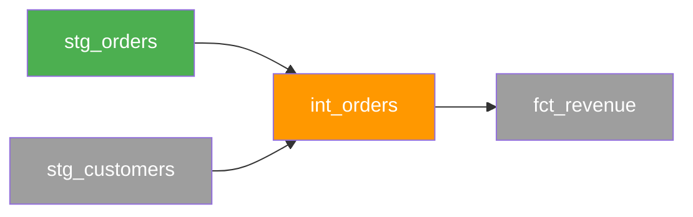
```mermaid
flowchart LR
    stg_orders:::passed --> int_orders:::inprogress
    stg_customers:::notstarted --> int_orders
    int_orders --> fct_revenue:::notstarted

    classDef notstarted fill:#9e9e9e,color:#fff
    classDef inprogress fill:#ff9800,color:#fff
    classDef passed    fill:#4caf50,color:#fff
    classDef failed    fill:#f44336,color:#fff
```
````

The DAGs are updated automatically — no manual editing required.

---

### Migration acceptance packs

After all models in a batch reach a terminal state (green or red), `dbt-migration-generate` automatically generates an acceptance pack at:

```
migration/dbt/acceptance_pack_batch_N.md
```

The pack contains:

- **Per-model results table** — model name, iterations used, row-count / schema / value check results, final status
- **Confirmation statements** — auto-generated plain-language summary of what passed and what needs attention
- **Mermaid DAG embed** — the final state of `dag_batch_N.md` embedded inline
- **Sign-off block** — name, date, decision fields for the approving stakeholder

#### Example acceptance pack

This is what `acceptance_pack_batch_1.md` looks like for a Snowflake → BigQuery migration with 8 staging models in batch 1, of which 6 passed and 2 failed after 5 iterations:

````markdown
# Migration Batch 1 — Acceptance Pack

**Generated**: 2026-05-14
**Release**: 01-gdp-snowflake-to-bq
**Batch**: 1
**Models in batch**: 8
**Status**: 6 passed · 2 failed

## Results Table

| Model | Iterations | Compile | Run | Row Count | Schema | Value Sample | Status |
|---|---|---|---|---|---|---|---|
| stg_salesforce__accounts | 1 | ✅ | ✅ | ✅ | ✅ | ✅ | **PASSED** |
| stg_salesforce__opportunities | 2 | ✅ | ✅ | ✅ | ✅ | ✅ | **PASSED** |
| stg_salesforce__contacts | 1 | ✅ | ✅ | ✅ | ✅ | ✅ | **PASSED** |
| stg_netsuite__transactions | 3 | ✅ | ✅ | ✅ | ✅ | ✅ | **PASSED** |
| stg_netsuite__customers | 1 | ✅ | ✅ | ✅ | ✅ | ✅ | **PASSED** |
| stg_netsuite__revenue_lines | 2 | ✅ | ✅ | ✅ | ✅ | ✅ | **PASSED** |
| stg_intercom__event_attributes | 5 | ✅ | ✅ | ✅ | ✅ | ❌ | **FAILED** |
| stg_intercom__session_metadata | 5 | ✅ | ✅ | ❌ | ✅ | ✅ | **FAILED** |

## Confirmation Statements

- All 8 models in batch 1 have been processed through the translation and equivalency loop
- Models marked PASSED have satisfied: row count ±0.5%, schema match, column value sampling ±1%/±2%
- Models marked FAILED exhausted 5 iterations without passing all equivalency checks
- No writes were made to the source platform (Snowflake) during this batch
- All translated models are committed to `.wire/releases/01-gdp-snowflake-to-bq/migration/dbt/`
- The following models require manual remediation before this batch can be considered complete:
  - `stg_intercom__event_attributes` — WIRE:REWRITE flag; VARIANT positional access has no direct BigQuery equivalent; value sample check failed on `prop_key` / `prop_value` columns
  - `stg_intercom__session_metadata` — row count delta exceeded ±0.5% after 5 iterations; likely caused by QUALIFY window filter not replicating exact Snowflake tie-breaking behaviour

## Batch 1 DAG


```mermaid
graph TD
  stg_salesforce__accounts:::complete
  stg_salesforce__opportunities:::complete
  stg_salesforce__contacts:::complete
  stg_netsuite__transactions:::complete
  stg_netsuite__customers:::complete
  stg_netsuite__revenue_lines:::complete
  stg_intercom__event_attributes:::failed
  stg_intercom__session_metadata:::failed

  classDef complete fill:#2a2,color:#fff
  classDef failed fill:#c00,color:#fff
```

## Sign-off

*Pending review by `/wire:migration-acceptance-pack-review 01-gdp-snowflake-to-bq --batch 1`*

---
*Generated automatically by Wire Framework v3.10.4 · `/wire:dbt-migration-generate 01-gdp-snowflake-to-bq`*
````

After `/wire:migration-acceptance-pack-review` is run, the reviewer's decision is appended to the same file:

````markdown
## Sign-off

| Field | Value |
|---|---|
| Decision | HOLD |
| Reviewer | Alex Caldwell |
| Date | 2026-05-14 |
| Notes | Two Intercom models require manual rewrite. Scheduled for a follow-up batch 1b run. Proceeding with batch 2 for all other model layers. Confirmed that Snowflake VARIANT and QUALIFY edge cases are known gaps — no further automated iterations will close them. |
````

To present the pack for stakeholder sign-off, run:

```
/wire:migration-acceptance-pack-review <release>           # latest batch
/wire:migration-acceptance-pack-review <release> --batch 3 # specific batch
```

The reviewer is presented with three options:

| Decision | Effect |
|---|---|
| **Approve** | Records approval in `status.md`, syncs to Jira and document store, clears the batch to proceed |
| **Reject** | Re-queues red models for another `dbt-migration-generate` run; acceptance pack is regenerated after the re-run |
| **Hold — proceed with reservations** | Records the hold with a comment, allows the next batch to start, flags the batch in `status.md` for final review before cutover |

After approval, `status.md` is updated and the Jira task for the batch is transitioned to Done.

---

### Equivalency validation loop

Once data is flowing into both platforms (after `ingestion_migration` is approved), run the equivalency loop:

```
/wire:equivalency-validate <release-folder>
```

This command is **not** a standard generate/validate/review artifact — it is a repeatable loop. Each run performs up to seven check types against all in-scope tables and dbt models: row count, schema, value sampling, freshness, dbt tests, row-level checksum, and business invariants (release-level aggregate control totals). `--batch N` scopes a run to one migration batch, so batch 1's equivalency can validate as soon as its models reach terminal state rather than waiting for the whole estate.

**Live mode (default) vs. baseline-pin mode.** By default, checks read live source and target tables. Two things matter here:

- **Relative-date models are pinned even in live mode.** A model referencing `CURRENT_DATE()`/`NOW()`-style functions evaluates "today" at whatever instant its side of the check runs — if the source and target checks run even minutes apart, a window near the live edge can show a false divergence that's purely a timing artefact. Wire detects these models, resolves a single as-of instant at the start of the run, and substitutes it into both sides' checks so the comparison is against the same instant. The pinned value is recorded per model in the report.
- **`--baseline` (or `migration.equivalency_baseline` in status.md)** runs a heavier, opt-in mode against a frozen baseline defined in the migration strategy — a Snowflake zero-copy clone at instant `T` on the source side, a Bronze-watermark filter on the target side, and every relative-date function fixed to `T` on both sides. This is the mechanism to reach for release-level, fully-reproducible sign-off; the live-mode pinning above is the always-on safeguard for everyday runs.

**Reports are organised at the table level**, not as a flat check list — for every table in scope, the report states a row-count result, an explicit "all columns present: yes/no" line naming any missing/extra columns, an explicit "sampled column values match: yes/no" line naming any mismatching columns, and one line per remaining applicable check. This is required for passing tables too — an all-clear says so per table, not only in the aggregate summary.

For projects with more than 50 in-scope tables, checks fan out in parallel automatically. Results are written to `migration/equivalency_report_{run_number}.md` (never overwrites prior reports) and the `status.md` `loop_history` is appended.

When a check fails, investigate and fix before re-running:

```
/wire:equivalency-investigate <release-folder> --object sales.fct_orders
/wire:equivalency-fix <release-folder> --object sales.fct_orders --approach "Update TIMESTAMP_DIFF translation"
```

`cutover-generate` is blocked until `checks_failing: 0`.

---

### Keeping migrated models in sync: register and drift gate

A long migration runs against a moving source — models get added, edited, and removed on the source platform while batches are still being translated and validated elsewhere. Two commands keep migrated models honest against that moving target.

**`/wire:migration-register-generate`** maintains `migration_register.csv` — a per-model state store, one row per in-scope model, distinct from the append-only `migration.transformation_log_table` audit trail. It records: `source_path`, `source_layer`, `last_migrated_commit` (the source commit the translated model was built from), `bq_target`, `state` (`pending` / `migrated` / `drifted` / `failed` / `removed` / `deferred`), `last_equivalence_result`, `last_equivalence_t` (the baseline instant, or null for a live run), and `last_validated_commit`. `dbt-migration-generate` and `equivalency-validate` keep it current as they run — this command initialises it and rebuilds/reconciles it on demand.

**`/wire:migration-drift-generate`** is the scheduled gate. It diffs the live source dbt repo against each migrated model's `last_migrated_commit` (`dbt ls --select state:modified`, no warehouse connection needed — falls back to a `git diff`-based approximation if no dbt binary is available), classifies each model new / modified / removed, updates register state accordingly, and surfaces blast radius: which downstream Hightouch syncs a drifted model feeds (via `lineage-generate`'s `model_sync_map.json`), and whether a source `meta.masking_policy` change needs the policy tags regenerated. It's meant to run on a schedule and as a CI gate — drift gets caught the day it happens, not during a cutover scramble.

Two bundled CI templates (`TEMPLATES/migration/ci/`) deploy this: `migrated-model-ci.yml` runs a tiered sweep (Tier 1 `dbt-migration-lint`, Tier 3 `equivalency-validate --baseline`) on any pull request touching a migrated model's path (derived from the register's `source_path` column), and `migration-drift-schedule.yml` runs the drift gate on a cron (default weekdays 06:00 UTC — adjust to the engagement's cadence).

---

### Safety gates

Four commands require explicit confirmation before proceeding. Each gate displays a checklist:

- **`target-setup-review`** — confirms DDL scripts have been reviewed, target environment is isolated, client has approved in writing, rollback plan is in place
- **`ingestion-migration-review`** — confirms target landing schemas are ready, parallel running window is agreed, additional MAR cost is approved
- **`orchestration-migration-review`** — confirms all orchestration jobs have been reviewed, parallel running is stable, jobs will not double-process
- **`cutover-review`** — the point of no return. Requires all equivalency checks passing, written client sign-off, rollback window agreed, cutover outside business hours, support cover arranged

---

### Full command sequence

```
/wire:new                                            # release_type: platform_migration

# Register the source dbt project (both source and target MCP must be reachable)
/wire:migration-source-register <release>
/wire:migration-source-refresh <release>             # re-run after source-side changes

# ── AUDIT ZONE (read-only) ──────────────────────────────────────
# Run all 5 audits in parallel (default) or sequentially
/wire:migration-audit-all <release>

# Per-audit validate + review gates
/wire:ingestion-audit-validate <release>
/wire:ingestion-audit-review <release>
/wire:db-object-audit-validate <release>
/wire:db-object-audit-review <release>
/wire:security-audit-validate <release>
/wire:security-audit-review <release>
/wire:dbt-audit-validate <release>
/wire:dbt-audit-review <release>
/wire:orchestration-audit-validate <release>
/wire:orchestration-audit-review <release>

# Synthesis — requires all five audits approved
/wire:migration-inventory-generate <release>
/wire:migration-inventory-validate <release>
/wire:migration-inventory-review <release>           # internal RA + client scope confirmation

# Optional — domain-batch scheduling (independently-implementable slices, not translation batches)
/wire:migration-batching-generate <release>          # or --seed <path> to reconcile a hand-drafted plan
/wire:migration-batching-validate <release>
/wire:migration-batching-review <release>            # client sign-off on batch composition and schedule

# ── MIGRATION ZONE ──────────────────────────────────────────────
# strategy-generate also writes dag_batch_N.md files alongside the strategy doc
/wire:migration-strategy-generate <release>
/wire:migration-strategy-validate <release>
/wire:migration-strategy-review <release>            # client sign-off on translation decisions

# ⚠ SAFETY GATE
/wire:target-setup-generate <release>
/wire:target-setup-validate <release>
/wire:target-setup-review <release>

# ⚠ SAFETY GATE
/wire:ingestion-migration-generate <release>
/wire:ingestion-migration-validate <release>
/wire:ingestion-migration-review <release>

# Per-model state store — initialise once migration starts; dbt-migration and
# equivalency-validate keep it current on every run from here on
/wire:migration-register-generate <release>
/wire:migration-register-validate <release>

# dbt migration — batched; repeat for each batch
# dbt-migration-generate now runs translate → compile → run → 3-check → auto-fix per model (up to 5 iterations)
/wire:dbt-migration-generate <release>               # or --batch N or --model name
/wire:dbt-migration-validate <release>
/wire:dbt-migration-review <release>
/wire:migration-acceptance-pack-review <release> --batch N   # stakeholder sign-off per batch

# ⚠ SAFETY GATE
/wire:orchestration-migration-generate <release>
/wire:orchestration-migration-validate <release>
/wire:orchestration-migration-review <release>

# Equivalency loop — models that passed inline checks are skipped automatically
/wire:equivalency-validate <release>
/wire:equivalency-investigate <release> --object <table_or_model>
/wire:equivalency-fix <release> --object <table_or_model>

# Drift gate — deploy TEMPLATES/migration/ci/ for on-change + scheduled runs,
# or run ad hoc any time source changes mid-migration are suspected
/wire:migration-drift-generate <release>
/wire:migration-drift-validate <release>

# ⚠ SAFETY GATE — point of no return
/wire:cutover-generate <release>
/wire:cutover-validate <release>
/wire:cutover-review <release>

/wire:migration-report-generate <release>
/wire:migration-report-validate <release>
/wire:migration-report-review <release>

/wire:archive <release>
```

---

### MCP tunnel setup for private networks

If the source or target platform is not publicly reachable (VPC, private endpoint), deploy an MCP server inside the client's network and register a tunnel in the Claude Console. No inbound firewall rules are needed — the tunnel uses a single outbound connection.

**BigQuery (GCP VPC):**
```bash
gcloud run deploy bigquery-mcp \
  --image gcr.io/rittman-analytics/bigquery-mcp:latest \
  --region europe-west2 \
  --no-allow-unauthenticated \
  --ingress internal
# Then register the tunnel in Claude Console → Settings → MCP Tunnels
```

**Snowflake (AWS VPC or on-prem):**
```bash
docker run -d --name snowflake-mcp \
  -e SNOWFLAKE_ACCOUNT=$SNOWFLAKE_ACCOUNT \
  -e SNOWFLAKE_USER=$SNOWFLAKE_USER \
  -e SNOWFLAKE_PASSWORD=$SNOWFLAKE_PASSWORD \
  rittmananalytics/snowflake-mcp:latest
# Then register the tunnel in Claude Console → Settings → MCP Tunnels
```

When `mcp_tunnel_configured: true` is set in `status.md`, all audit and migration commands route through the tunnel automatically.

---

> **Tip**: Run `/wire:playbook-generate <release-folder>` after the migration inventory is approved to generate a visual dependency graph showing which migration batches can proceed in parallel. See [Section 29](#29-framework-management-commands).

---

## 17. Running an Agentic Data Stack Release

The Agentic Data Stack release type (`release_type: agentic_data_stack`) is an **overlay for an existing data platform** — it assumes a warehouse, a dbt project, and a BI tool are already in place. The deliverable is a governed self-service analytics capability built on top of that foundation: an AI that answers business questions accurately, routes through the semantic layer first, and stays accurate as the data platform evolves.

This is not a platform build. It does not provision infrastructure, build pipelines, or create a dbt project from scratch. If a client's warehouse and dbt project don't yet exist, start with `full_platform` or `pipeline_only` and add `agentic_data_stack` as a subsequent release once the foundation is stable.

The release directly implements the architecture [Anthropic published](https://claude.com/blog/how-anthropic-enables-self-service-data-analytics-with-claude) from their own internal analytics build: governed canonical datasets, per-domain knowledge skill files collocated with dbt models, a mandatory semantic-layer-first routing order, adversarial review on every answer, and an offline eval harness wired into CI. The key finding from that build: accuracy failures are primarily governance failures, not model failures. Resolving concept-entity ambiguity before the agent ever sees a question is more effective than any amount of prompt engineering.

### When to use it

Use `agentic_data_stack` when:
- A client already has a data platform (warehouse + dbt + BI tool) and wants an AI that can answer business questions from it reliably
- The data team has tried a self-service SQL agent and accuracy is below 70% — the audit phase will almost always find widespread table duplication as the root cause
- The engagement goal is to reduce analyst time spent answering ad-hoc data questions for business stakeholders

Do not use `agentic_data_stack` as a first release for a new client. If the warehouse and dbt project need to be built first, start with `full_platform` or `pipeline_only`, then add `agentic_data_stack` as a subsequent release once the platform is stable.

### Phase overview

| Phase | Duration | Artifacts |
|---|---|---|
| Audit | 1–2 weeks | dataset_audit, metric_audit, query_audit |
| Design | 1 week | governance_design, semantic_layer_design |
| Build | 2 weeks | canonical_models, lookml_views (Looker only), semantic_layer, knowledge_skill, agent_config |
| Validation | 1 week | eval_suite, adversarial_config |
| Launch | 3–5 days | launch_gate, enablement |

### Setting up an Agentic Data Stack release

```bash
/wire:new
# Select: Agentic Data Stack
# Answer 7 additional questions:
# 1. BI tool (Looker / Tableau / Power BI / Metabase / Omni / Other)
# 2. Semantic layer (dbt Semantic Layer / MetricFlow / LookML / Cube / Omni model / OAC (SMML) / None)
# 3. dbt project path
# 4. Warehouse (BigQuery / Snowflake / Databricks / Redshift)
# 5. Primary business domain
# 6. Approximate table count
# 7. Query history access (yes / limited / no)
```

### Command sequence

```bash
# Phase 1 — Audit (run all three in parallel)
/wire:ads-audit-all YYYYMMDD_client_agentic_data_stack

# Or run individually:
/wire:ads_dataset-audit-generate YYYYMMDD_client_agentic_data_stack
/wire:ads_metric-audit-generate YYYYMMDD_client_agentic_data_stack
/wire:ads_query-audit-generate YYYYMMDD_client_agentic_data_stack

# Validate and review each audit
/wire:ads_dataset-audit-validate YYYYMMDD_client_agentic_data_stack
/wire:ads_dataset-audit-review YYYYMMDD_client_agentic_data_stack
/wire:ads_metric-audit-validate YYYYMMDD_client_agentic_data_stack
/wire:ads_metric-audit-review YYYYMMDD_client_agentic_data_stack
/wire:ads_query-audit-validate YYYYMMDD_client_agentic_data_stack
/wire:ads_query-audit-review YYYYMMDD_client_agentic_data_stack

# Phase 2 — Design
/wire:ads_governance-design-generate YYYYMMDD_client_agentic_data_stack
/wire:ads_governance-design-validate YYYYMMDD_client_agentic_data_stack
/wire:ads_governance-design-review YYYYMMDD_client_agentic_data_stack
/wire:ads_semantic-layer-design-generate YYYYMMDD_client_agentic_data_stack
/wire:ads_semantic-layer-design-validate YYYYMMDD_client_agentic_data_stack
/wire:ads_semantic-layer-design-review YYYYMMDD_client_agentic_data_stack

# Phase 3 — Build
/wire:ads_canonical-models-generate YYYYMMDD_client_agentic_data_stack
/wire:ads_canonical-models-validate YYYYMMDD_client_agentic_data_stack
/wire:ads_canonical-models-review YYYYMMDD_client_agentic_data_stack

# LookML views — Looker projects only (auto-skipped for dbt Semantic Layer / MetricFlow)
/wire:ads_lookml-views-generate YYYYMMDD_client_agentic_data_stack
/wire:ads_lookml-views-validate YYYYMMDD_client_agentic_data_stack
/wire:ads_lookml-views-review YYYYMMDD_client_agentic_data_stack

/wire:ads_semantic-layer-generate YYYYMMDD_client_agentic_data_stack
/wire:ads_semantic-layer-validate YYYYMMDD_client_agentic_data_stack
/wire:ads_semantic-layer-review YYYYMMDD_client_agentic_data_stack
/wire:ads_knowledge-skill-generate YYYYMMDD_client_agentic_data_stack
/wire:ads_knowledge-skill-validate YYYYMMDD_client_agentic_data_stack
/wire:ads_knowledge-skill-review YYYYMMDD_client_agentic_data_stack
/wire:ads_agent-config-generate YYYYMMDD_client_agentic_data_stack
/wire:ads_agent-config-validate YYYYMMDD_client_agentic_data_stack
/wire:ads_agent-config-review YYYYMMDD_client_agentic_data_stack

# Phase 4 — Validation
/wire:ads_eval-suite-generate YYYYMMDD_client_agentic_data_stack
/wire:ads_eval-suite-validate YYYYMMDD_client_agentic_data_stack
/wire:ads_eval-suite-review YYYYMMDD_client_agentic_data_stack
/wire:ads_adversarial-config-generate YYYYMMDD_client_agentic_data_stack
/wire:ads_adversarial-config-validate YYYYMMDD_client_agentic_data_stack
/wire:ads_adversarial-config-review YYYYMMDD_client_agentic_data_stack

# Phase 5 — Launch
/wire:ads_launch-gate-validate YYYYMMDD_client_agentic_data_stack
/wire:ads_launch-gate-review YYYYMMDD_client_agentic_data_stack
/wire:ads_analytics-enablement-generate YYYYMMDD_client_agentic_data_stack
/wire:ads_analytics-enablement-validate YYYYMMDD_client_agentic_data_stack
/wire:ads_analytics-enablement-review YYYYMMDD_client_agentic_data_stack
```

### The eval suite and launch gate

The eval suite (`/wire:ads_eval-suite-generate`) is the most important artifact in the release. It produces:
- Per-domain YAML question-answer pairs (minimum 10 per domain)
- A CI runner script that checks accuracy against every schema change
- Per-domain accuracy thresholds (default 90%)

The launch gate validates accuracy before any domain is announced. A domain that falls below its threshold is blocked until the specific failing questions are fixed. This is not optional — Anthropic documented accuracy falling from 95% to 65% within a month without active maintenance. The eval suite and its CI integration are the mechanism that prevents this.

### Knowledge skill colocation

The `/wire:ads_knowledge-skill-generate` command writes `DOMAIN_REFERENCE.md` files into the client's dbt project alongside their mart models:

```
models/marts/
  orders/
    fct_orders.sql
    fct_orders.yml
    DOMAIN_REFERENCE.md   ← generated and maintained here
  customers/
    dim_customers.sql
    dim_customers.yml
    DOMAIN_REFERENCE.md
```

A CI check template is included that flags when a model PR doesn't update the collocated reference file. This keeps the agent's knowledge current as the data platform evolves — the maintenance becomes an engineering discipline, not a documentation backlog.

### What the release delivers

At the end of the engagement, the client has:
1. A governance-clean dbt project with canonical models and deprecated tables marked for sunset
2. An extended semantic layer covering the most common analytical questions
3. Per-domain knowledge skill files in their dbt repo, with CI maintenance checks
4. An installable Wire skill (`agentic-data-stack-SKILL.md`) their data team runs in Claude Code
5. A per-domain eval suite wired into CI with accuracy baselines
6. User training documentation and a data team maintenance guide

**After the engagement**: The data team installs the agent skill, maintains the `DOMAIN_REFERENCE.md` files in their normal PR workflow, and runs the eval suite monthly. Domain owners can request new metrics via their normal analytics backlog — each addition goes through `ads_semantic-layer-generate` and then `ads_eval-suite-validate` before deployment.

---

## 18. Running a Droughty Release

Use the Droughty release type when the engagement begins with an existing data warehouse and the immediate goal is to understand what's in it, generate documentation, or produce a base semantic layer — before (or instead of) writing dbt models from scratch.

Droughty is a bottom-up schema-introspection toolkit. It reads the live warehouse and generates four categories of artefact: DBML entity-relationship diagrams, AI-generated field descriptions, LangGraph data-quality reports, and base LookML views. Wire wraps these into a structured delivery phase with its own commands, status tracking, and integration with the broader delivery lifecycle.

**Two modes:**

- **Discovery / audit mode** — maps an existing warehouse with no dbt requirement. Use this at the start of an engagement, or when auditing a client's existing analytics estate. Produces schema inventory, DBML, field docs, and QA report.
- **Post-dbt mode** — generates staging SQL, dbt schema tests, and LookML base views from already-deployed dbt models. Use this after `dbt run` succeeds in a full-platform or dbt-development engagement. Can also be added as an optional phase to any standard release type.

### Prerequisites

- Python 3.9–3.12.3 on the consultant's machine
- Access to the target warehouse (BigQuery project and dataset, or Snowflake account credentials)
- OpenAI API key (required for `/wire:droughty-docs` and `/wire:droughty-qa` only)
- For post-dbt mode: a successfully deployed dbt project

### Starting a Droughty Engagement

```
/wire:new
```

When prompted for release type, select **droughty**. Wire will ask two follow-up questions:

1. **Warehouse**: BigQuery or Snowflake
2. **Context**: discovery/audit (no dbt needed) or post-dbt (dbt already deployed)

Wire creates the standard folder structure under `.wire/releases/<release>/`, with an additional `artifacts/droughty/` directory for generated artefacts and a `field_descriptions/` subdirectory.

### Discovery / Audit Mode Walkthrough

**Step 1 — Set up Droughty**

```
/wire:droughty-setup <release>
```

This installs the pinned Droughty version (`pip install "droughty==<pinned-version>"`), generates `~/.droughty/profile.yaml` with your warehouse credentials, and creates `droughty_project.yaml` at the git root pointing output paths to Wire's artefact directories. The profile file is not committed to git — it stays local to the consultant's machine.

For BigQuery, Wire derives the project and dataset from the MCP configuration. For Snowflake, it prompts for account, username, password, warehouse, database, schema, and role.

**Step 2 — Introspect the schema**

```
/wire:droughty-introspect <release>
```

This is a Wire-level step (not a Droughty CLI command). It queries `INFORMATION_SCHEMA` directly and produces a `schema_inventory.md` report — table counts per schema, column counts, estimated PK/FK coverage, and tables without descriptions. Use this to scope the rest of the Droughty phase and identify which schemas need the most attention.

**Step 3 — Generate the DBML diagram**

```
/wire:droughty-dbml <release>
```

Runs `droughty dbml` and stores the `.dbml` file in the artefacts directory. The DBML captures entity relationships across all schemas in scope and can be rendered with any DBML-compatible viewer (dbdiagram.io, DataGrip, etc.).

**Step 4 — Generate field descriptions**

```
/wire:droughty-docs <release>
```

Requires an OpenAI API key in `profile.yaml`. Sends table and column metadata to GPT-4o and writes AI-generated field descriptions back to `field_descriptions/`. For schemas with more than 200 tables, Wire prompts to confirm scope before proceeding — large schemas can take 30+ minutes and cost meaningful OpenAI tokens.

**Step 5 — Run the data quality agent**

```
/wire:droughty-qa <release>
```

Runs the LangGraph QA agent, which executes live warehouse queries to surface data quality issues: nulls in expected-not-null columns, referential integrity gaps, value distribution outliers. **This step is non-deterministic** — the agent chooses which queries to run based on the schema. Different runs on the same schema may surface different issues. Review all output carefully before presenting to a client.

**Step 6 — Feed artefacts forward**

At this point you have a schema inventory, DBML diagram, field descriptions, and QA report. These feed directly into the Wire problem-definition phase:

```
/wire:problem-definition-generate <project_id>
```

The problem-definition spec will read the schema inventory and QA report as upstream context.

### Post-dbt Mode Walkthrough

This mode assumes dbt models have already been built and deployed to the warehouse. Run setup first if not already done:

```
/wire:droughty-setup <release>
```

**Step 1 — Generate staging SQL and sources.yml**

```
/wire:droughty-stage <release>
```

BigQuery only. Runs `droughty stage -p <project> -d <dataset>` and writes staging SQL files and a `sources.yml` to `models/staging/`. If a `sources.yml` already exists, Wire presents three options: merge (add new entries only), overwrite (replace entirely), or diff (show differences and decide). Wire-authored entries take priority in a merge.

**Step 2 — Generate dbt schema tests**

```
/wire:droughty-dbt-tests <release>
```

Confirms that dbt has been deployed before proceeding. Runs `droughty dbt` to generate pattern-based schema tests (`not_null`, `unique`, `accepted_values` where column naming conventions suggest it) and writes them to `schema.yml`. If `schema.yml` already exists, Wire merges new tests in — existing Wire-authored tests are preserved by default.

**Step 3 — Generate base LookML views**

```
/wire:droughty-lookml <release>
```

Confirms dbt has been deployed. Runs `droughty lookml` and writes base views to `lookml/views/generated/`. Wire then creates `lookml/views/extended/` for business-logic extensions. **Never hand-edit files in `views/generated/`** — each `/wire:droughty-lookml` run regenerates them. All business logic goes in `views/extended/` using LookML refinements:

```lookml
view: +orders {
  dimension: order_value_band {
    type: string
    sql: CASE WHEN ${order_total} < 100 THEN 'low'
              WHEN ${order_total} < 500 THEN 'medium'
              ELSE 'high' END ;;
  }
}
```

**Steps 4–5 — Docs and QA**

```
/wire:droughty-docs <release>
/wire:droughty-qa <release>
```

Same as discovery mode. At this point the semantic layer work continues with:

```
/wire:semantic_layer-generate <project_id>
```

which extends the Droughty base views with explores, measures, and business logic.

### Running the Full Phase in One Command

```
/wire:droughty-generate <release>
```

This orchestrates the full sequence based on the context set in `status.md`. Before executing, it shows the planned steps and asks for confirmation. Modes:

- **discovery**: setup → introspect → dbml → docs → qa
- **post-dbt**: setup → dbt-tests → stage → lookml → docs → qa
- **full**: all steps in order

### Keeping the Droughty Version Current

The installed version is pinned in `wire/droughty/pinned_version.txt`. Consultants always install from that pin. If a new Droughty version is released and you want to update the pin:

```bash
bash wire/droughty/refresh_version.sh           # updates pinned_version.txt
bash wire/droughty/refresh_version.sh --commit  # updates and commits
```

Consultants then pull the updated repo and re-run `/wire:droughty-setup --force` to install the new version.

### Common Issues

**`droughty: command not found`** — run `/wire:droughty-setup <release>` first. Python 3.9–3.12.3 is required.

**`No tables found`** — check that the `schemas:` list in `~/.droughty/profile.yaml` matches the actual schema names in the warehouse. BigQuery schema names are case-sensitive.

**`droughty qa` runs for a very long time** — the QA agent executes live queries; large schemas (100+ tables) can take 20–30 minutes. Narrow the `schemas:` list in `profile.yaml` to the most relevant schemas.

**`OpenAI API error`** — check that `openai_api_key` is set in `profile.yaml` and the key has an active billing method.

---

## 19. Running a Custom Release

Use the Custom release type when an engagement has bespoke deliverables that don't map cleanly to any standard Wire release type — architecture advisory reports, technology decision logs, PoC productionisation blueprints, MCP/AI integration roadmaps, compliance reviews, data literacy programmes, or any fixed-scope engagement where the deliverables are defined by the SoW rather than by a standard delivery pattern.

**When to use Custom instead of a standard type:**
- The primary deliverables are documents or advisory outputs (not data pipelines or dashboards)
- The engagement is time-boxed and advisory (e.g. 4 weeks, 48 hours, architecture-and-handover)
- More than one standard release type would be needed to cover the scope, and the combination feels awkward
- The SoW defines specific named deliverables with acceptance criteria that don't match Wire's standard artifact names

**When to use a standard type instead:**
- The engagement primarily involves building a dbt project, pipeline, or BI layer — use `dbt_development`, `pipeline_only`, or `full_platform`
- Discovery is needed before any delivery — use `discovery` or `sop_discovery`
- The "bespoke" deliverable is just one artifact in an otherwise standard release — add it manually to the existing status.md

### How it works

When you select "Custom" in `/wire:new`, Wire immediately invokes `/wire:custom-release-define`, which:

1. **Reads your source documents** — SoW, kick-off notes, agreed delivery plan (PDF, Markdown, Google Drive, Confluence)
2. **Extracts deliverables** — names, descriptions, acceptance criteria, effort estimates, and timeline milestones
3. **Maps each deliverable** — scores it against existing Wire commands; uses standard commands where there's a strong match, flags approximate matches with a workflow comparison note, and proposes custom specs for the rest
4. **Shows a proposal table** — you can accept, swap, or rename any item before anything is written
5. **Generates fully-specified project-scoped specs** for each custom deliverable — not skeletons, but complete generate/validate/review workflows derived from the SoW acceptance criteria
6. **Writes `.claude/commands/` wrappers** so each custom spec is invokable as a slash command
7. **Seeds the status.md session history** from the timeline milestones in the delivery plan

### Workflow

```
/wire:new                           # select "Custom" → triggers /wire:custom-release-define

# Wire prompts for source documents, then shows a proposal:
# ┌─────────────────────────────────────────────────────────────────┐
# │ Deliverable                        │ Handling   │ Command         │
# │ Target State Architecture Document │ Custom 🔧  │ /target-state-architecture-doc-generate │
# │ Decision Log                       │ Custom 🔧  │ /decision-log-generate                  │
# │ Refined dbt Project Structure      │ Custom ⚠️  │ /refined-dbt-structure-generate         │
# │ MCP / AI Integration Roadmap       │ Custom 🔧  │ /mcp-ai-integration-roadmap-generate    │
# └─────────────────────────────────────────────────────────────────┘
# Accept or adjust, then Wire generates the specs and scaffolds the release.

# Custom commands are then available as slash commands:
/target-state-architecture-doc-generate <release-folder>
/target-state-architecture-doc-validate <release-folder>
/target-state-architecture-doc-review <release-folder>

/decision-log-generate <release-folder>
/decision-log-validate <release-folder>
/decision-log-review <release-folder>

# ... and so on for each custom deliverable

/wire:archive <release-folder>
```

### Standalone document analysis

You can analyse source documents before running `/wire:new` — useful for checking what Wire would extract before committing to a release:

```
/wire:utils-doc-analyze path/to/SoW.pdf path/to/kickoff-notes.md
```

This shows the extracted deliverables table with Wire match scores and workflow notes, without writing any files.

### Proposing a bespoke command as a framework addition

If a custom spec you've generated represents a pattern that other RA engagements would benefit from, you can ask Wire to raise a GitHub issue on the Wire repo proposing it as a new standard command:

```
/wire:custom-feature-request target-state-architecture-doc
```

This generalises the spec (removing client-specific details), drafts a GitHub issue body, shows it to you for review, and posts it on confirmation. **This command is never automatically offered** — it exists as an explicit action only, to avoid a proliferation of narrowly-scoped feature requests.

### Tips

- Provide all three document types when available — SoW for acceptance criteria, kick-off notes for stakeholder context, and the delivery plan for timeline milestones. The combination gives Wire the most complete picture.
- If a deliverable's description is vague in the SoW, Wire will flag it and ask for clarification before generating the spec. It's better to clarify early than to generate a spec from incomplete criteria.
- Custom specs live in `.wire/releases/[folder]/custom-commands/` and are the source of truth. The `.claude/commands/` wrappers are entry points only — edit the `.wire/` file if you need to change the workflow.
- The session history skeleton pre-populated from the delivery plan milestones is editable. Update it after each working session to maintain an accurate progress record.

---

## 20. Worked Example: Barton Peveril Live Pastoral Analytics

This section shows how a real engagement — a Full Platform release for Barton Peveril Sixth Form College — was run through the framework from start to finish. It covers every command in the canonical sequence and shows two Wire Agents features in practice: auto-delegation during the design phase, and batch dispatch via `/wire:delegate` at the start of development.

The engagement was run directly from a signed SOW (no discovery release needed — scope was already well-defined).

### Engagement overview

| | |
|-|-|
| **Client** | Barton Peveril Sixth Form College, Hampshire |
| **Engagement** | Live Pastoral Analytics (SOW 2) |
| **Duration** | 2 weeks (Feb 2–13, 2026) |
| **Budget** | $7,100 / 35 hours |
| **Release type** | Full Platform |
| **Orchestration** | dbt Cloud (scheduled jobs + CI/PR job) |

**SOW deliverables**:

| ID | Deliverable | Framework artifacts |
|----|-------------|-------------------|
| D1 | Live Pastoral Data Pipeline (ProSolution + Focus → BigQuery) | `pipeline_design`, `pipeline`, `orchestration`, `data_quality` |
| D2 | Looker Semantic Layer Extension (risk signals) | `data_model`, `dbt`, `semantic_layer` |
| D3 | SPA Operational Dashboard | `mockups`, `dashboards` |
| D4 | Data Team Enablement Session | `training` (technical) |
| D5 | End User Training Session | `training` (end-user) |
| D6 | Technical documentation | `documentation` |

### Data architecture

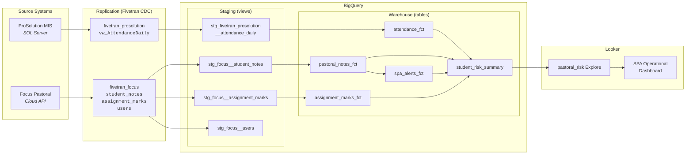
```mermaid
graph LR
    subgraph sources["Source Systems"]
        PS["ProSolution MIS<br/><i>SQL Server</i>"]
        FO["Focus Pastoral<br/><i>Cloud API</i>"]
    end

    subgraph replication["Replication (Fivetran CDC)"]
        F1["fivetran_prosolution<br/><code>vw_AttendanceDaily</code>"]
        F2["fivetran_focus<br/><code>student_notes</code><br/><code>assignment_marks</code><br/><code>users</code>"]
    end

    subgraph bq["BigQuery"]
        subgraph stg["Staging (views)"]
            S1["stg_fivetran_prosolution<br/>__attendance_daily"]
            S2["stg_focus__student_notes"]
            S3["stg_focus__assignment_marks"]
            S4["stg_focus__users"]
        end
        subgraph wh["Warehouse (tables)"]
            W1["attendance_fct"]
            W2["pastoral_notes_fct"]
            W3["spa_alerts_fct"]
            W4["assignment_marks_fct"]
            W5["student_risk_summary"]
        end
    end

    subgraph looker["Looker"]
        EX["pastoral_risk Explore"]
        DB["SPA Operational<br/>Dashboard"]
    end

    PS --> F1
    FO --> F2
    F1 --> S1
    F2 --> S2 & S3 & S4
    S1 --> W1
    S2 --> W2
    W2 --> W3
    S3 --> W4
    W1 & W2 & W3 & W4 --> W5
    W5 --> EX
    EX --> DB
```

---

### Phase 1: Requirements (Day 1)

#### Engagement setup

```
/wire:new
→ Client: Barton Peveril Sixth Form College
→ Engagement name: barton_peveril
→ Release type: full_platform
→ Release ID: 01-barton-peveril-live-pastoral
→ Branch: feature/barton-peveril-live-pastoral (created automatically from main)
→ Jira: WIRE project, Epic BP-1 created
→ .wire/releases/01-barton-peveril-live-pastoral/status.md created
  16 artifacts across 6 phases, all at not_started
```

After `/wire:new`: copy the SOW PDF and the ProSolution SQL schema examples into `releases/01-barton-peveril-live-pastoral/requirements/`, and meeting notes from the pre-engagement call to `engagement/calls/2026-02-01-kickoff.md`.

#### Requirements generation — auto-delegated to `discovery-analyst`

```
/wire:requirements-generate 01-barton-peveril-live-pastoral
→ [auto-delegated to discovery-analyst agent]
```

The `discovery-analyst` agent reads the SOW and SQL examples and produces a 13-section requirements specification. Key outputs:
- FR-1 through FR-9: functional requirements with measurable acceptance criteria
- NFR-1 through NFR-7: performance, security, freshness SLAs
- D1–D6 deliverable-to-artifact mapping
- Design flags: attendance granularity (register-level vs daily snapshot), Fivetran replication cost

The agent appends two entries to `decisions.md`:

```
[2026-02-02] discovery-analyst: Modelled attendance at daily-snapshot grain rather than
register-level. Register-level would require 6× the Fivetran MAR volume. Daily snapshot
supports all dashboard use cases in the SOW. If drill-to-register is needed in future
it can be added as a separate Fivetran table without redesigning the model.

[2026-02-02] discovery-analyst: Excluded student_notes.body from replication scope.
Body text contains free-text pastoral records; replicating it to BigQuery would create
a GDPR data minimisation risk. All SOW requirements are met by note metadata alone.
```

```
/wire:requirements-validate 01-barton-peveril-live-pastoral
→ [auto-delegated to discovery-analyst agent]
→ PASS — all 13 sections complete, acceptance criteria present for all deliverables
```

```
/wire:requirements-review 01-barton-peveril-live-pastoral
→ [main session — review gates always stay with the consultant]
→ Fathom context: pulled 2026-02-01 pre-engagement call transcript
→ Surfaced: client concern about data freshness SLA for live pastoral notes
→ Reviewer: Head of MIS
→ Approved 2026-02-03, with note: "Freshness SLA tightened to 30 min for Focus data"
```

The status of `requirements.review` moves to `approved`. This unblocks Phase 2.

#### Delivery playbook

Before moving into design, generate a playbook for the full release:

```
/wire:playbook-generate 01-barton-peveril-live-pastoral
```

The command reads the approved requirements, SOW timeline, and `status.md` and produces a Mermaid control-flow diagram plus a narrative step guide at `planning/live_pastoral_analytics_playbook.md`. The flowchart is colour-coded: teal for Wire commands, green for offline activities (workshops, UAT sessions), amber for decision gates and open questions. The ✅ and 🔄 markers on phase headings update each time you regenerate — the version below was produced mid-engagement after design was complete, showing requirements and design phases approved and development in progress.


```mermaid
flowchart TD

START([Sprint Start]):::event

subgraph REQ["Phase 1 — Requirements ✅ COMPLETE"]
    R1["/wire:requirements-generate"]:::wireCmd
    R2["/wire:requirements-validate<br/>/wire:requirements-review"]:::wireCmd
    RGATE{"Requirements\napproved?"}:::decision
    RCHASE["Chase MIS team\n— requirements sign-off"]:::offline
end

subgraph DESIGN["Phase 2 — Design ✅ COMPLETE"]
    PD1["/wire:pipeline_design-generate"]:::wireCmd
    PD2["/wire:pipeline_design-validate<br/>/wire:pipeline_design-review"]:::wireCmd
    PDGATE{"Pipeline design\napproved?"}:::decision
    PDCHASE["Chase systems engineer\n— pipeline design review"]:::offline

    DM1["/wire:data_model-generate"]:::wireCmd
    DM2["/wire:data_model-validate<br/>/wire:data_model-review"]:::wireCmd
    DMGATE{"Data model\napproved?"}:::decision
    DMCHASE["Chase data team lead\n— data model review"]:::offline

    MK1["/wire:mockups-generate"]:::wireCmd
    MK2["/wire:mockups-review"]:::wireCmd
    MKGATE{"Mockups\napproved?"}:::decision
    MKCHASE["Chase MIS manager\n— mockups review"]:::offline
end

subgraph DEV["Phase 3 — Development 🔄 IN PROGRESS"]
    PIP1["/wire:pipeline-generate"]:::wireCmd
    PIP2["/wire:pipeline-validate<br/>/wire:pipeline-review"]:::wireCmd
    PIPGATE{"Pipeline impl.\napproved?"}:::decision
    PIPCHASE["Chase systems engineer\n— pipeline implementation review"]:::offline

    OQ_PD2{"PD-2: note_type_id 31\nconfirmed?"}:::decision
    OQ_PD2_CHASE["Chase systems engineer\n— confirm role of note type 31"]:::offline

    DBT1["/wire:dbt-generate"]:::wireCmd
    DBT2["/wire:dbt-validate<br/>/wire:dbt-review"]:::wireCmd
    DBTGATE{"dbt models\napproved?"}:::decision
    DBTCHASE["Address findings\n(ref() in CTEs, s_ prefixes)\nthen re-validate"]:::offline

    SL1["/wire:semantic_layer-generate"]:::wireCmd
    SL2["/wire:semantic_layer-validate<br/>/wire:semantic_layer-review"]:::wireCmd
    SLGATE{"Semantic layer\napproved?"}:::decision
    SLCHASE["Chase data team lead\n— semantic layer review"]:::offline
end

subgraph TEST["Phase 4 — Testing"]
    DASH1["/wire:dashboards-generate"]:::wireCmd
    DASH2["/wire:dashboards-validate<br/>/wire:dashboards-review"]:::wireCmd
    DASHGATE{"Dashboards\napproved?"}:::decision
    DASHCHASE["Chase MIS manager\n— dashboard review"]:::offline

    OQ_PD11{"PD-11: FSA Stage 2/3\nsnapshot data available?"}:::decision
    OQ_PD11_CHASE["Chase MIS team\n— FSA snapshot availability"]:::offline

    DQ1["/wire:data_quality-generate"]:::wireCmd
    DQ2["/wire:data_quality-validate<br/>/wire:data_quality-review"]:::wireCmd
    DQGATE{"Data quality\napproved?"}:::decision
    DQCHASE["Chase systems engineer\n— data quality review"]:::offline

    UAT1["/wire:uat-generate"]:::wireCmd
    UAT2["[Offline] UAT sessions\n— SPAs, tutors, pastoral leads"]:::offline
    UAT3["/wire:uat-review"]:::wireCmd
    UATGATE{"UAT passed?"}:::decision
    UATCHASE["Fix defects raised in UAT\nthen reschedule sessions"]:::offline
end

subgraph DEPLOY["Phase 5 — Deployment"]
    DEP0["[Offline] Confirm production env,\naccess controls, rollback plan"]:::offline
    DEP1["/wire:deployment-generate"]:::wireCmd
    DEP2["/wire:deployment-validate<br/>/wire:deployment-review"]:::wireCmd
    DEPGATE{"Deployment\napproved?"}:::decision
    DEPCHASE["Chase client sponsor\n— deployment sign-off"]:::offline
end

subgraph ENABLE["Phase 6 — Enablement"]
    TRN1["/wire:training-generate"]:::wireCmd
    TRN2["/wire:training-validate<br/>/wire:training-review"]:::wireCmd
    TRNGATE{"Training content\napproved?"}:::decision
    TRNCHASE["Chase MIS manager\n— training content review"]:::offline

    TRN3["[Offline] Data team enablement session"]:::offline
    TRN4["[Offline] End-user training session\n(SPAs / tutors / pastoral leads)"]:::offline

    DOC1["/wire:documentation-generate"]:::wireCmd
    DOC2["/wire:documentation-validate<br/>/wire:documentation-review"]:::wireCmd
    DOCGATE{"Documentation\napproved?"}:::decision
    DOCCHASE["Chase client sponsor\n— documentation sign-off"]:::offline
end

END([Sprint Complete — Platform Go-Live]):::event

START --> R1
R1 --> R2
R2 --> RGATE
RGATE -->|No| RCHASE
RCHASE --> R2
RGATE -->|Yes| PD1
PD1 --> PD2
PD2 --> PDGATE
PDGATE -->|No| PDCHASE
PDCHASE --> PD1
PDGATE -->|Yes| DM1
DM1 --> DM2
DM2 --> DMGATE
DMGATE -->|No| DMCHASE
DMCHASE --> DM1
DMGATE -->|Yes| MK1
MK1 --> MK2
MK2 --> MKGATE
MKGATE -->|No| MKCHASE
MKCHASE --> MK2
MKGATE -->|Yes| PIP1
PIP1 --> PIP2
PIP2 --> PIPGATE
PIPGATE -->|No| PIPCHASE
PIPCHASE --> PIP1
PIPGATE -->|Yes| OQ_PD2
OQ_PD2 -->|Not yet| OQ_PD2_CHASE
OQ_PD2_CHASE --> OQ_PD2
OQ_PD2 -->|Confirmed| DBT1
DBT1 --> DBT2
DBT2 --> DBTGATE
DBTGATE -->|No| DBTCHASE
DBTCHASE --> DBT1
DBTGATE -->|Yes| SL1
SL1 --> SL2
SL2 --> SLGATE
SLGATE -->|No| SLCHASE
SLCHASE --> SL1
SLGATE -->|Yes| DASH1
DASH1 --> DASH2
DASH2 --> DASHGATE
DASHGATE -->|No| DASHCHASE
DASHCHASE --> DASH1
DASHGATE -->|Yes| OQ_PD11
OQ_PD11 -->|Not yet| OQ_PD11_CHASE
OQ_PD11_CHASE --> OQ_PD11
OQ_PD11 -->|Available or deferred| DQ1
DQ1 --> DQ2
DQ2 --> DQGATE
DQGATE -->|No| DQCHASE
DQCHASE --> DQ1
DQGATE -->|Yes| UAT1
UAT1 --> UAT2
UAT2 --> UAT3
UAT3 --> UATGATE
UATGATE -->|No| UATCHASE
UATCHASE --> UAT2
UATGATE -->|Yes| DEP0
DEP0 --> DEP1
DEP1 --> DEP2
DEP2 --> DEPGATE
DEPGATE -->|No| DEPCHASE
DEPCHASE --> DEP1
DEPGATE -->|Yes| TRN1
TRN1 --> TRN2
TRN2 --> TRNGATE
TRNGATE -->|No| TRNCHASE
TRNCHASE --> TRN1
TRNGATE -->|Yes| TRN3
TRN3 --> TRN4
TRN4 --> DOC1
DOC1 --> DOC2
DOC2 --> DOCGATE
DOCGATE -->|No| DOCCHASE
DOCCHASE --> DOC1
DOCGATE -->|Yes| END

classDef wireCmd fill:#1a3a5c,stroke:#4a90d9,color:#fff
classDef offline fill:#2d4a1e,stroke:#6abf4b,color:#fff
classDef decision fill:#5c3a00,stroke:#d98c1a,color:#fff
classDef event fill:#1a1a1a,stroke:#888,color:#fff
```

The narrative guide covers each step in sequence — prerequisites, open questions that must close before the gate moves, and the offline activities (workshops, client calls, UAT sessions) that run alongside Wire commands. Two open questions surfaced at generation time as live gates: **PD-2** (confirm the role of `note_type_id = 31` in Focus before the dbt review is approved) and **PD-11** (FSA Stage 2/3 snapshot data availability — may need to defer to Phase 2 scope if not ready before UAT). Both are named in the narrative with an owner and a target-close action.

The playbook also includes this working principle, which is worth reading before starting development:

> Wire writes the artifacts for this engagement: the requirements specification, pipeline design, physical data model with ERDs, dbt SQL models and YAML configurations, LookML views and explores, UAT scripts, deployment runbooks, training session plans, and system documentation. Wire also runs all mechanical validations — naming convention checks, structural integrity checks, FK referential integrity verification, dbt test coverage audits, and schema consistency checks across staging, integration, and warehouse layers.
>
> Wire does not take decisions on the team's or sponsor's behalf. The decisions register requires human judgment from the client team — Wire surfaces the questions and documents the answers, but the answers come from the client. Every `-generate` command is followed by a `-validate` and a `-review`: the review is the human gate where a named stakeholder approves the artifact before the next phase begins.

Each working session should start with `/wire:status` to confirm the current artifact state, then scope the session to advancing one artifact through one gate. For development artifacts (dbt, semantic layer), a session typically covers generate + validate in the same sitting. When a review returns `changes_requested`, run generate again in the same session if the changes are well-defined, then re-validate before going back to the reviewer. When open questions surface, log them immediately in the decisions register with a named owner and a target-close date.

This is a planning utility — it creates no tracked artifact and blocks nothing. Run it again after any significant scope change to refresh the ✅ markers and narrative.

---

### Phase 2: Design (Days 2–4)

#### Day 2 morning — Conceptual entity model

```
/wire:conceptual_model-generate 01-barton-peveril-live-pastoral
→ [auto-delegated to data-designer agent]
```

The `data-designer` agent produces a business-level entity model: five domain entities (`Student`, `Attendance`, `PastoralNote`, `SPAAlert`, `Assignment`) with a Mermaid `erDiagram` showing cardinalities, and a relationship narrative. No column detail — just what the business cares about.

```
/wire:conceptual_model-validate 01-barton-peveril-live-pastoral
→ [auto-delegated to data-designer agent]
→ PASS — entity coverage against FR-1 through FR-6, cardinality complete,
         no column-level detail leaked in
```

```
/wire:conceptual_model-review 01-barton-peveril-live-pastoral
→ [main session]
→ Reviewer: Head of MIS + Head of Student Services (business stakeholders)
→ Approved 2026-02-04
→ Decision recorded: SPAAlert is a first-class entity, not a derived flag on PastoralNote
```

Approving the conceptual model gates `pipeline_design` and `data_model`. The `data-designer` appends to `decisions.md`:

```
[2026-02-04] data-designer: Modelled SPAAlert as a separate entity rather than a
boolean flag on PastoralNote. SPAs create alerts independently of note creation;
a note can exist without an alert and an alert can outlive its originating note.
Treating it as a flag would make "days since last SPA contact" uncomputable.
```

#### Day 2 afternoon — Pipeline design

```
/wire:pipeline_design-generate 01-barton-peveril-live-pastoral
→ [auto-delegated to pipeline-engineer agent]
```

The `pipeline-engineer` agent produces the full pipeline architecture document using the ProSolution SQL examples from `requirements/`:
- Source schema analysis: `StudentDetail` → `Enrolment` → `RegisterStudent` → `RegisterMark` → `MarkType` → `RegisterSession`
- Three Fivetran connectors: ProSolution (SQL Server CDC via `vw_AttendanceDaily`), Focus CDC (pastoral notes, SPA alerts, assignment marks), MIS Applications (snapshot tables + risk weights)
- 12 design decisions (PD-1 through PD-12) raised for client input
- An embedded Data Flow Diagram in Mermaid showing end-to-end data movement

The pipeline design went through five versions before approval. Key decisions resolved across those iterations:
- **CR-1**: Attendance percentage is never stored — calculated dynamically in Looker from session counts
- **CR-2**: TutorStudent data sourced via `prosolution_dbo.vw_TutorStudent`; the MIS Applications connector was temporarily removed then reinstated (CR-4)
- **CR-3**: Risk scoring sourced from the live `Looker_Risk_Score` table via Fivetran, not a static dbt seed
- **CR-5**: `focus.users` removed from Focus CDC scope (not needed for dashboard requirements)
- **CR-6**: `offering_dim.user_defined_11` (Focus Gradeset Code) added to scope

```
/wire:pipeline_design-validate 01-barton-peveril-live-pastoral
→ [auto-delegated to pipeline-engineer agent]
→ PASS — all sources present, naming conventions compliant, DFD syntax valid
```

```
/wire:pipeline_design-review 01-barton-peveril-live-pastoral
→ [main session]
→ Reviewer: systems engineer
→ Approved v5.0, 2026-02-25 (five rounds incorporating CR-1 through CR-6)
→ PD-2 flagged as open: note_type_id 31 role to be confirmed before dbt review
```

#### Days 3–4 — Data model and mockups

```
/wire:data_model-generate 01-barton-peveril-live-pastoral
→ [auto-delegated to data-designer agent]
```

The `data-designer` agent produces the complete dbt-layer data model specification across six versions:
- `_sources.yml` for all three Fivetran connectors with column-level descriptions and freshness thresholds
- **9 staging models**: `stg_prosolution__attendance_daily`, `stg_prosolution__tutor_student`, `stg_focus__student_notes`, `stg_focus__spa_alerts`, `stg_focus__assignment_marks`, `stg_focus__offering`, `stg_mis_applications__risk_score`, and two further ProSolution views
- **1 integration model**: `int__student_xref` — cross-system student identity resolution between ProSolution and Focus
- **7 warehouse models**: `attendance_fct`, `pastoral_notes_fct`, `spa_alerts_fct`, `assignment_marks_fct`, `student_risk_score_fct`, `student_risk_summary`, `student_risk_history`
- **3 seeds**: `grade_ordering.csv`, `focus_note_type_mapping.csv`, `tracked_assignment_titles.csv`
- Physical ERD with all columns, PKs, FKs, and relationship lines; all facts use incremental (`merge`) materialisation
- Cross-system join key: Focus `assignment_marks.enrolment_id` → ProSolution `Enrolment.EnrolmentID`

```
/wire:data_model-validate 01-barton-peveril-live-pastoral
→ [auto-delegated to data-designer agent]
→ PASS — naming conventions, grain definitions, PK/FK traceability, ERD consistency
```

```
/wire:data_model-review 01-barton-peveril-live-pastoral
→ [main session — the most consequential review gate in a full_platform engagement]
→ Reviewer: data team lead
→ Approved v6.0, 2026-02-25 (six rounds)
→ Key change in v5: student_risk_history added as a separate model — accumulates
  snapshots over time rather than overwriting student_risk_summary on each run
```

```
/wire:mockups-generate 01-barton-peveril-live-pastoral
→ [main session — no specialist agent for wireframes]
```

```
Dashboard Mockups Generated

  File: design/mockups/spa-operational-dashboard.html — open in any browser

  What's in it:

  - Daily Caseload — 4 KPI tiles (Active Risk 12, Monitoring 8, Unanswered
    Alerts 3, No Concerns 45), 6-week at-risk trend line, caseload doughnut,
    8-row student priority table with risk signals. Click any row to drill
    to Student Detail.
  - Student Detail — example student; KPIs for attendance (76%), open alerts,
    notes, CAP below target; stacked attendance bar (8 weeks), horizontal bar
    grades vs MEG, pastoral notes table, SPA alerts table with wellbeing flag
    footer.
  - Note Volume Monitor — college-wide note volumes by department, stacked
    horizontal bar (4 note types × 7 departments), breakdown table with WoW
    % change.
  - High-Risk Cohort — dual-risk cohort (wellbeing + att<90%), unanswered
    alerts, risk score ranking bar chart, alert age chart, two tables for the
    two cohort cuts.

  All charts are Chart.js 4.4.1, fully interactive. Sidebar collapses, tabs
  switch without page load, filter pills are styled correctly.
```

The file is a self-contained interactive HTML prototype — no build step, no server. SPAs and pastoral leads review it directly in a browser before any Looker work begins.

```
/wire:mockups-review 01-barton-peveril-live-pastoral
→ [main session]
→ Reviewers: SPAs and pastoral leads
→ Approved 2026-02-06
→ Change request noted: add "days since last SPA contact" column to risk list
```

All four design artifacts are now `review: approved`. Phase 3 is unblocked.

#### End of Week 1 — close the session

At the end of Day 4, with design complete and development about to start:

```
/wire:session:end 01-barton-peveril-live-pastoral
```

Wire produces a session summary:

```
Session summary — 2026-02-06

Completed this session:
  ✓ requirements (generate, validate, review)
  ✓ playbook generated
  ✓ conceptual_model (generate, validate, review)
  ✓ pipeline_design (generate, validate, review)
  ✓ data_model (generate, validate, review)
  ✓ mockups (generate, review)

Open items carried forward:
  • OQ-1 resolved: Scenario C (Hybrid) chosen for pipeline architecture
  • Change request from mockups review: "days since last SPA contact" column

Next session focus: Phase 3 Development
  Recommend starting with /wire:delegate to dispatch all development artifacts in parallel

Status written to .wire/releases/01-barton-peveril-live-pastoral/status.md
```

---

### Phase 3: Development (Days 5–8)

#### Day 5 morning — Starting a new session and planning the work

Two days later, the consultant opens a new Claude Code session:

```
/wire:start
```

Wire shows all active releases and their states. The consultant selects `01-barton-peveril-live-pastoral` and chooses **Plan session**:

```
Planning session for: 01-barton-peveril-live-pastoral
Current phase: Development (Phase 3 of 6)

Completed artifacts (6/16):
  ✓ requirements, conceptual_model, pipeline_design, data_model, mockups, playbook

Next artifacts (all at not_started):
  → pipeline           (pipeline-engineer)
  → dbt                (dbt-developer)
  → orchestration      (orchestration-engineer)
  → semantic_layer     (semantic-layer-developer)
  → dashboards         (main session)

Open items from last session:
  ⚠ Change request: "days since last SPA contact" in mockups (resolved in data_model v1.1)

Recommended action: /wire:delegate 01-barton-peveril-live-pastoral
  This will dispatch pipeline, dbt, orchestration, and semantic_layer to specialist
  agents in parallel. Estimated wall time: ~15 minutes for all four to complete.
  Dashboards-generate should follow once semantic_layer is approved.
```

#### Day 5 — Batch dispatch with `/wire:delegate`

```
/wire:delegate 01-barton-peveril-live-pastoral
```

Wire inspects `status.md`, identifies all development artifacts at `not_started`, and presents the delegation plan for confirmation. With 9 staging models and 7 warehouse models in scope, the `dbt-developer` step fans out across parallel agents per layer:

```
Delegation plan — Barton Peveril Live Pastoral Analytics / 01-barton-peveril-live-pastoral
───────────────────────────────────────────────────────────────────────────────────────────

Step 1 (sequential):
  pipeline-engineer  →  pipeline-generate
                        (ProSolution SQL Server CDC connector + Focus REST API connector)
  Subagent: 1

Step 2 (multi-wave fan-out, starts after Step 1):

  Wave 2a — Staging layer  (2 parallel agents):
    dbt-developer [staging 1/2]  →  stg_prosolution__students, stg_prosolution__courses,
                                     stg_prosolution__enrolments, stg_prosolution__attendance,
                                     stg_prosolution__targets  (+3 seeds)
    dbt-developer [staging 2/2]  →  stg_focus__attendance_observations,
                                     stg_mis__timetable_slots,
                                     stg_mis__staff_absence,
                                     stg_mis__exam_results

  Wave 2b — Integration layer  (1 agent, starts after Wave 2a):
    dbt-developer [integration 1/1]  →  int__student_unified_profile

  Wave 2c — Warehouse layer  (2 parallel agents, starts after Wave 2b):
    dbt-developer [warehouse 1/2]  →  student_dim, course_dim,
                                       attendance_summary_fct, exam_performance_fct
    dbt-developer [warehouse 2/2]  →  student_risk_scores_fct, student_risk_summary,
                                       student_risk_history

  Total dbt-developer agents: 5  (2 + 1 + 2)

Step 3 (parallel, starts after Step 2):
  3a  orchestration-engineer    →  orchestration-generate  (dbt Cloud job config)
  3b  semantic-layer-developer  →  semantic_layer-generate  (LookML views + explores)
  Subagents: 2 parallel

Total: 8 specialist agents across 4 execution stages.
Review commands stay in this session.
Dashboards-generate will be suggested after semantic_layer is approved.

Confirm? [y/n]
```

After confirmation, the pipeline agent runs first, then the three dbt waves execute (staging agents run in parallel, then integration, then warehouse agents in parallel), then orchestration and semantic layer run concurrently.

#### What the agents produced

**`pipeline-engineer`** — Fivetran connector configuration for both ProSolution (SQL Server CDC) and Focus (REST API). A supplementary Cloud Function handles the Focus authentication token refresh. Error handling: dead-letter queue to a `pipeline_errors` BigQuery table, Slack alerting on consecutive failures.

**`dbt-developer`** — 5 agents ran across 3 sequential waves. Wave 2a (2 staging agents in parallel) completed in roughly the time it would have taken one agent to handle the first 5 staging models; Wave 2b ran the single integration model; Wave 2c ran the warehouse layer in parallel. Total: 19 SQL models generated (9 staging, 1 integration, 7 warehouse, plus 2 utility models) plus 3 seeds and 34 static-analysis tests. Surrogate keys via `dbt_utils.generate_surrogate_key()`; all facts incremental with `merge` strategy. Static analysis PASS with two findings flagged for the team to fix before review:

1. `ref()` calls inside transformation CTEs in `student_risk_score_fct` and `student_risk_summary` — `ref()` must be in the `FROM` or `JOIN` of a source CTE, not embedded in a transformation CTE. Both models refactored before review is requested.
2. Missing `s_` prefixes on source CTEs in several warehouse models — Wire naming convention requires source CTEs to be prefixed `s_`. Applied across all affected models before review.

The agent adds to `decisions.md`:

```
[2026-02-10] dbt-developer: student_risk_summary materialised as a table with
full_refresh=false. The model accumulates historical snapshots; incremental would
require a unique_key that changes the grain. Full-refresh on schedule is acceptable
at current row volumes (~18,000 enrolments × 250 school days).
```

**`orchestration-engineer`** — Generates the dbt Cloud job configuration. Produces `dbt_cloud_config.md`:

```markdown
## Environments

### Production
- Name: barton_peveril_prod
- dbt version: 1.8.x
- Target: prod
- BigQuery project: bp-analytics
- Dataset: bp_analytics

## Jobs

### barton_peveril_scheduled_run
- Environment: Production
- Schedule: every 30 minutes (matches NFR-3 freshness SLA)
- Commands:
    dbt run --select staging+ warehouse+
    dbt test --select staging+ warehouse+
- On failure: Slack notification → #pastoral-data-alerts

### barton_peveril_ci
- Environment: CI/PR
- Trigger: pull request opened or updated against main
- Commands:
    dbt build --select state:modified+
- On completion: GitHub PR status check
```

Agent adds to `decisions.md`:

```
[2026-02-10] orchestration-engineer: Scheduled dbt Cloud job at 30-minute
cadence to match NFR-3. Source readiness is not gated — the job runs on
schedule and downstream freshness tests flag stale data. This is simpler
than sensor-based gating and appropriate for the college's data volumes;
a Fivetran delay longer than 30 minutes would be caught by the dbt test
layer and surface in the Slack alert.

[2026-02-10] orchestration-engineer: CI job uses state:modified+ rather
than a full build to keep PR feedback fast. The production job runs the
full selector to ensure nothing is silently excluded after a merge.
```

**`semantic-layer-developer`** — LookML views for all 7 warehouse models and 5 explores:
- `student_risk_summary` explore — composite risk score, current-state per student
- `pastoral_notes` explore — note volume, type breakdown, SPA workload
- `attendance` explore — sessions present/absent; `attendance_percentage` calculated dynamically as `SUM(sessions_present) / (SUM(sessions_present) + SUM(sessions_absent))` — CR-1 means it is never stored, always derived
- `assignment_marks` explore — CAP marks against tracked assignment titles
- `student_risk_score` explore — time-series risk score history

Risk signal measures in `student_risk_summary`:
- `attendance_deterioration_flag`: sessions below 85% in rolling 10 school days
- `pastoral_note_spike_flag`: more than 3 notes in 5 school days
- `unanswered_alert_flag`: open SPA alert older than 3 school days
- `days_since_last_spa_contact`: derived dimension (fulfils mockups change request)

#### Days 6–8 — Development reviews

Review gates stay in the main session — the consultant reviews each artifact with the relevant stakeholder:

```
/wire:pipeline-review 01-barton-peveril-live-pastoral
→ Reviewer: data engineering lead
→ Approved 2026-02-11
→ Note: Cloud Function authentication approach reviewed and accepted

/wire:dbt-review 01-barton-peveril-live-pastoral
→ Reviewer: analytics engineering lead
→ decisions.md entries surfaced during review — both accepted without override
→ Approved 2026-02-11

/wire:orchestration-review 01-barton-peveril-live-pastoral
→ Reviewer: data engineering lead (dbt Cloud admin)
→ Job selectors verified against deployed model list
→ 30-minute schedule confirmed against NFR-3
→ CI/PR job approach reviewed and accepted
→ Approved 2026-02-11

/wire:semantic_layer-review 01-barton-peveril-live-pastoral
→ Reviewer: analytics engineering lead
→ Approved 2026-02-12
```

With semantic_layer approved, generate the dashboards:

```
/wire:dashboards-generate 01-barton-peveril-live-pastoral
→ [main session]
```

SPA Operational Dashboard from approved mockups:
- Tile: At-risk students, ranked by composite risk score
- Tile: Unanswered SPA alerts with overdue indicators
- Tile: Workload by SPA (alert count per student services advisor)
- Student drillthrough with "days since last SPA contact" column (from change request)

```
/wire:dashboards-validate 01-barton-peveril-live-pastoral
→ PASS — all mockup tiles present, LookML field references valid

/wire:dashboards-review 01-barton-peveril-live-pastoral
→ Reviewers: SPAs and pastoral leads
→ Approved 2026-02-12
```

All development artifacts are `review: approved`. Phase 4 is unblocked.

---

### Phase 4: Testing (Days 9–10)

```
/wire:data_quality-generate 01-barton-peveril-live-pastoral
→ [auto-delegated to data-quality-engineer agent]
```

The `data-quality-engineer` agent adds quality checks beyond the embedded dbt tests:
- Freshness alert: Focus data older than 30 minutes → Slack notification to `#pastoral-data-alerts`
- Row count reconciliation: ProSolution register count vs `attendance_fct` row count (tolerance ±2%)
- Null rate monitoring: attendance mark fields above 5% null rate triggers warning
- Cross-system join integrity: `assignment_marks.enrolment_id` FK hit rate (expected >99%)

```
/wire:data_quality-validate 01-barton-peveril-live-pastoral
→ [auto-delegated to data-quality-engineer agent]
→ PASS — all checks runnable, Slack webhook configured, thresholds documented

/wire:data_quality-review 01-barton-peveril-live-pastoral
→ [main session]
→ Reviewer: Head of MIS
→ Approved 2026-02-13
```

```
/wire:uat-generate 01-barton-peveril-live-pastoral
→ [main session]
```

UAT plan mapped to FR-1 through FR-9. UAT session conducted with SPAs and pastoral leads on Day 9:
- All primary scenarios passed
- One iteration: "days since last SPA contact" column needed rounding to whole days

```
/wire:uat-review 01-barton-peveril-live-pastoral
→ Reviewer: Head of Student Services
→ Approved 2026-02-13
```

---

### Phase 5: Deployment (Day 11)

```
/wire:deployment-generate 01-barton-peveril-live-pastoral
→ [main session — deployment involves external systems, stays with consultant]
```

Generates:
- Step-by-step deployment runbook (Fivetran → BigQuery datasets → dbt Cloud environment + jobs → Looker publish)
- dbt Cloud production environment configuration steps
- Monitoring and alerting setup confirmation
- Rollback procedures for each stage

```
/wire:deployment-validate 01-barton-peveril-live-pastoral
→ PASS — all upstream artifacts approved, no outstanding blockers,
         dbt Cloud job selectors verified, monitoring config complete

/wire:utils-deploy-to-dev 01-barton-peveril-live-pastoral
→ Dev deployment verified — all models built, all tests passing in dbt Cloud
  dev environment, dashboards visible in Looker dev

/wire:deployment-review 01-barton-peveril-live-pastoral
→ [main session]
→ Reviewer: data engineering lead + analytics engineering lead
→ Dev results presented, runbook walked through step-by-step
→ Approved 2026-02-13

/wire:utils-deploy-to-prod 01-barton-peveril-live-pastoral
→ Fivetran connectors activated
→ dbt Cloud production environment configured and tested
→ Scheduled job (30-minute cadence) and CI/PR job activated
→ Dashboards published to Looker production
→ Monitoring alerts live
```

---

### Phase 6: Enablement (Days 12–13)

```
/wire:training-generate 01-barton-peveril-live-pastoral
→ [main session]
```

**D4 — Data Team Enablement** (Day 12 morning, data team):
- How the Fivetran connectors work and how to extend them
- How the dbt models are structured; how to add a new source or warehouse model
- How dbt Cloud jobs work; how to change the schedule or add a command step
- How to extend LookML views and explores
- Hands-on: trace a data point from ProSolution SQL Server to the Looker dashboard

**D5 — End User Training** (Day 12 afternoon, SPAs and pastoral leads):
- Dashboard navigation and filtering
- Interpreting risk signals responsibly — correlation not causation
- Data freshness expectations and what to do when data is stale
- How to raise a data quality issue

```
/wire:training-validate 01-barton-peveril-live-pastoral
→ PASS — both session plans present, learning outcomes mapped to SOW requirements

/wire:training-review 01-barton-peveril-live-pastoral
→ Reviewer: Head of MIS
→ Approved 2026-02-14
```

```
/wire:documentation-generate 01-barton-peveril-live-pastoral
→ [delivery-lead agent handles the technical handover doc draft]
```

The `delivery-lead` agent reads all approved artifacts and `decisions.md` (now 11 entries) and produces the technical documentation package:
- Architecture overview with the data flow diagram
- dbt model reference (grain, columns, test coverage per model)
- dbt Cloud job reference (scheduled run and CI/PR job — selectors, cadence, how to change)
- LookML field catalogue (all dimensions and measures, with business definitions)
- Operational runbook (monitoring alerts, common failure modes, escalation path)

The consultant reviews, adds the college's IT support contact details, and approves:

```
/wire:documentation-validate 01-barton-peveril-live-pastoral
→ PASS — all required sections present

/wire:documentation-review 01-barton-peveril-live-pastoral
→ [main session]
→ Reviewer: Head of MIS
→ Approved 2026-02-14
```

#### Archive and close

```
/wire:archive 01-barton-peveril-live-pastoral
→ Reason: Completed
→ Final status snapshot written
→ Jira Epic BP-1 closed
→ Execution log: 16 artifacts, 48 generate/validate/review actions, 11 decisions.md entries
→ Archived to .wire/releases/archive/20260214_01-barton-peveril-live-pastoral/
```

---

## 21. Wire Autopilot: Autonomous Execution

Wire Autopilot takes a Statement of Work and executes the **entire engagement lifecycle** — starting with a full discovery sprint (problem definition → pitch → release brief → sprint plan), then autonomously creating and executing every downstream delivery release identified by that discovery. Each release is executed with the artifact sequence appropriate for its type.

Safety gates automatically pause execution before any phase that could affect external systems (activating pipelines, running dbt against databases, deploying to environments), requiring explicit confirmation before proceeding.

### When to use Autopilot

- **Rapid prototyping**: You need a complete set of deliverables quickly to demonstrate the approach to a client
- **Standard engagements**: The SOW is well-defined and follows a familiar pattern
- **Internal projects**: Where speed matters more than stakeholder approval at every gate
- **Proof of concept**: Creating a working prototype from a proposal before the engagement formally begins

### When NOT to use Autopilot

- **Complex, ambiguous SOWs**: When the SOW needs significant interpretation or clarification before planning
- **Client-facing review gates required**: When the client must approve each phase before moving forward
- **Novel architectures**: When the project involves unfamiliar technologies or unconventional patterns
- **Single-release engagements**: If you only need one delivery release without a discovery phase, use `/wire:new` and start working — the engagement-context skill loads context automatically

### How it works

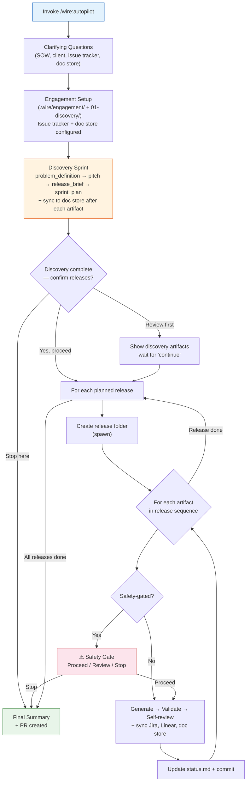
```mermaid
flowchart TB
    A["Invoke /wire:autopilot"] --> B["Clarifying Questions\n(SOW, client, issue tracker, doc store)"]
    B --> C["Engagement Setup\n(.wire/engagement/ + 01-discovery/)\nIssue tracker + doc store configured"]
    C --> D["Discovery Sprint\nproblem_definition → pitch → release_brief → sprint_plan\n+ sync to doc store after each artifact"]
    D --> E{"Discovery complete\n— confirm releases?"}
    E -->|"Yes, proceed"| F["For each planned release"]
    E -->|"Review first"| G["Show discovery artifacts\nwait for 'continue'"]
    G --> F
    E -->|"Stop here"| Z
    F --> H["Create release folder\n(spawn)"]
    H --> I{"For each artifact\nin release sequence"}
    I --> SG{"Safety-gated?"}
    SG -->|No| J["Generate → Validate → Self-review\n+ sync Jira, Linear, doc store"]
    SG -->|Yes| SGP["⚠ Safety Gate\nProceed / Review / Stop"]
    SGP -->|Proceed| J
    SGP -->|Stop| Z
    J --> K["Update status.md + commit"]
    K --> I
    I -->|"Release done"| F
    F -->|"All releases done"| Z["Final Summary\n+ PR created"]

    style A fill:#e3f2fd,stroke:#1565c0
    style D fill:#fff3e0,stroke:#e65100
    style Z fill:#e8f5e9,stroke:#2e7d32
    style SGP fill:#fce4ec,stroke:#c62828
```

### Invoking Autopilot

```
/wire:autopilot path/to/SOW.pdf
```

Or without a path argument (Autopilot will ask for it):

```
/wire:autopilot
```

### Clarifying questions

Autopilot asks a small set of questions before going autonomous — notably, it does **not** ask for a project type upfront. The delivery release types are determined by the discovery sprint.

The questions are asked in this order:

1. **SOW file path** (if not provided as argument)
2. **Supporting documents** — org charts, call transcripts, architecture diagrams (optional)
3. **Client name and engagement name**
4. **Engagement lead name**
5. **Repo mode** — combined (default) or dedicated delivery repo
6. **Issue tracker** — Jira, Linear, both, or none (see below)
7. **Document store** — Confluence, Notion, both, or none (see below)
8. **Additional context** — technologies, naming conventions, preferences (optional)

#### Issue tracker setup

When you select Jira or Linear, Autopilot asks follow-up questions immediately:

**Jira**: asks for the project key and whether to create new issues or link to existing ones.

**Linear**: asks three separate questions in sequence:
1. Linear team identifier (e.g. `ENG`, `DATA`, `ACME`)
2. Setup mode:
   - *Create new project + new issues* — Wire creates a project and populates it
   - *Use existing project + create new issues* — paste a project URL or ID; Wire creates fresh issues inside it
   - *Link to existing project + existing issues* — Wire searches for matching issues and links them
3. Project URL or ID (only asked if mode 2 or 3 was chosen)

#### Document store setup

When you select Confluence, Notion, or both, Autopilot asks follow-up questions immediately:

- **Confluence**: asks for the space key (e.g. `PROJ`, `ACME`) where Wire documents should be published
- **Notion**: asks for the parent page URL or ID where Wire documents should be created as sub-pages

The document store is configured during engagement setup. Once set, every generated artifact is automatically published to the store — no manual action required.

After all questions are answered, Autopilot presents a confirmation of the execution plan before going autonomous.

### Phase 1: Discovery Sprint

Before any delivery work begins, Autopilot runs a complete discovery sprint to plan the engagement:

| Artifact | How Autopilot handles it |
|----------|--------------------------|
| **Problem Definition** | Generated from SOW and context. Pre-populates all 7 problem-framing questions from source material. Auto-approved if all 10 sections are complete. |
| **Pitch** | Generated from problem definition. Autopilot decides appetite from SOW timeline (6+ weeks → big batch, 2–3 weeks → small batch). Shapes the solution from SOW deliverables. Identifies downstream release types from SOW scope. Auto-approved if all 10 sections complete and at least one release identified. |
| **Release Brief** | Formalised from the approved pitch. Downstream releases table is the canonical list of delivery releases. Auto-approved if deliverables table and releases are populated. |
| **Sprint Plan** | Generated from release brief. Sprint length and story estimates set autonomously. Includes a Downstream Releases table used by Phase 2. Auto-approved if all deliverables have epics with point estimates. |

After each discovery artifact is approved, Autopilot syncs it to the configured document store (if any). This means all four discovery documents are available for client review in Confluence or Notion by the time the discovery sprint is complete.

After the discovery sprint, Autopilot presents the planned releases and asks for your confirmation before proceeding with delivery:

```
Discovery sprint complete. Ready to execute 3 delivery releases:
  02-data-foundation   (pipeline_only)
  03-reporting         (dashboard_extension)
  04-enablement        (enablement)

Proceed with autonomous execution?
  ○ Yes, execute all releases
  ○ Review discovery artifacts first
  ○ Stop here
```

### Phase 2: Delivery Release Execution

For each planned delivery release, Autopilot:

1. Creates the release folder structure (equivalent to `/wire:release:spawn`)
2. Creates the release `status.md` with the correct artifact scope for the release type
3. Resolves the artifact order and runs it
4. Commits all artifacts after the release is complete before moving to the next

**As of v4.0.0, this order is not hardcoded anywhere in Autopilot's own spec.** It reads `status.md`'s `project_type`, loads `wire/release-types/<type>.yaml`, flattens every phase's artifacts into one list, and topologically sorts by `depends_on` (tie-broken by `sequence`) — the same file the [precondition gate](#the-precondition-gate) reads for every artifact regardless of whether Autopilot or a person is driving. The previous version hardcoded a per-release-type sequence directly in `autopilot.md`, which had silently drifted from reality — most notably, `full_platform`'s hardcoded list omitted the `orchestration` artifact entirely, so a run through Autopilot never generated it even though the release type's own definition required it. That class of bug is now structurally impossible: there is exactly one place execution order comes from, and both the gate and Autopilot read it.

**Illustrative resolved order** for the release types currently defined — treat this as a snapshot of what the YAML currently resolves to, not a contract Autopilot maintains separately:

| Type | Resolved order |
|------|-----------|
| `full_platform` | requirements → conceptual_model → pipeline_design → data_model → mockups → pipeline → dbt → semantic_layer → dashboards → **orchestration** → data_quality → uat → deployment → training → documentation |
| `pipeline_only` | requirements → pipeline_design → pipeline → data_quality → deployment |
| `dbt_development` | requirements → data_model → dbt → semantic_layer → data_quality → deployment |
| `dashboard_extension` | requirements → mockups → dashboards → training |
| `dashboard_first` | requirements → conceptual_model → mockups → viz_catalog → data_model → seed_data → dashboards → data_refactor → dbt → semantic_layer → data_quality → uat → deployment |
| `enablement` | training → documentation |
| `platform_migration` | ingestion_audit → db_object_audit → security_audit → dbt_audit → orchestration_audit → migration_inventory → migration_strategy → target_setup → ingestion_migration → dbt_migration → orchestration_migration → equivalency_validation → cutover → migration_report |

(`workshops` is an optional, ungated artifact on `full_platform` — it has no `depends_on` edges, so it never blocks or is blocked by anything else in the sequence, and can be run whenever, or never.)

Each artifact follows the same generate → validate (up to 3 retries) → self-review (up to 2 retries) cycle, running the real `/wire:{command}-generate/-validate/-review` commands rather than a paraphrase of their logic. After each artifact is generated and again after it is approved, Autopilot syncs to Jira, Linear, and the document store (whichever are configured).

#### Handling a precondition-gate block

If order resolution worked correctly, every artifact's precondition gate should pass silently by the time Autopilot reaches it — that's what a correct topological sort guarantees. If one blocks anyway, that signals a real structural problem (a resolution bug, a manually-edited `status.md` that regressed something), not routine friction to route around. Autopilot does **not** self-override — the gate's override contract requires a real person's name and reason, which Autopilot cannot supply on someone else's behalf. It pauses with the same three-option pattern as a safety gate below (override now / investigate first / stop here) and logs the block in `autopilot_checkpoint.md` for later diagnosis.

### Safety gates

Autopilot automatically pauses before any phase that could affect systems outside the repository:

| Gated Artifact | Risk | What happens |
|----------------|------|-------------|
| `pipeline` | Activates data connectors (Fivetran, Airbyte) that replicate from production sources | Warns about connector activation, asks to confirm target environment |
| `data_refactor` | Switches dbt from seed data to real client data | Warns about database connection, asks to confirm non-production environment |
| `data_quality` | Executes SQL queries against the database | Warns about database queries, asks to confirm target database |
| `deployment` | Creates deployment scripts that, if executed, affect live environments | Warns about live environment impact, asks to confirm readiness |

At each safety gate, Autopilot presents:
1. A summary of everything completed so far (across all releases)
2. A risk-specific warning for the upcoming phase
3. Three options: **Proceed**, **Review first** (inspect generated files before continuing), or **Stop here** (end Autopilot, continue manually)

### Self-review

For each artifact (including discovery artifacts), Autopilot performs structured self-review instead of pausing for human review:

- Generated artifact cross-referenced against the SOW (traceability)
- Artifact cross-referenced against predecessor artifacts (consistency)
- Artifact cross-referenced against validation results (quality)

Self-reviewed artifacts are marked `review: approved` with `reviewed_by: "Wire Autopilot (self-review)"` in status.md.

### Integration syncs

At each step of the execution loop, Autopilot syncs to all configured integrations:

| Integration | When synced |
|-------------|-------------|
| **Jira** | After generate, validate, and self-review for every artifact |
| **Linear** | After generate, validate, and self-review for every artifact |
| **Document store** (Confluence/Notion) | After generate for every artifact; re-synced after self-review approval to capture any revision-cycle changes |

All syncs are fail-graceful — if an integration is unavailable, Autopilot logs the failure and continues. No integration failure will block or stop execution.

### Context window management

Autopilot writes a single checkpoint file (`.wire/autopilot_checkpoint.md`) after each phase, containing a condensed summary of all completed work. Each delivery release also has its own `execution_log.md`. If the context window compresses, Autopilot reads the checkpoint to resume.

### Resuming from partial completion

If an Autopilot session is interrupted, re-run the same command:

```
/wire:autopilot path/to/SOW.pdf
```

Autopilot checks `.wire/autopilot_checkpoint.md` and `.wire/releases/*/status.md` to identify what is already complete and resumes from the first incomplete artifact in the first incomplete release. It does not re-generate already-approved artifacts.

### Switching between Autopilot and manual commands

Autopilot and the individual `/wire:*` commands share the same state files. You can:

- Start with Autopilot for the discovery sprint, then switch to manual commands for delivery
- Fix a blocked artifact manually (the engagement-context skill will reload state automatically), then re-run Autopilot to continue
- Use Autopilot for the bulk of the work, then run manual reviews for client-facing phases

### Error handling

| Situation | Autopilot behaviour |
|-----------|-------------------|
| Validation fails | Re-generates with specific fixes (up to 3 retries) |
| Self-review rejects | Re-generates with feedback (up to 2 retries) |
| Jira API unavailable | Skips Jira sync, continues |
| Linear API unavailable | Skips Linear sync, continues |
| Document store unavailable | Skips sync, continues |
| Prerequisite blocked | Skips downstream artifacts in the same release, reports in final summary |
| All retries exhausted | Marks artifact as blocked, continues to next artifact |

### Final summary

When complete, Autopilot outputs a results table showing the discovery sprint status and each delivery release's artifact statuses, file counts, blocked phases (if any), and deliverables ready for demo. A pull request is created automatically.

**Tips**:
- Always review discovery artifacts (problem definition and pitch) with the client before they are used to drive delivery — they are generated from the SOW and may need refinement
- If you configured a document store, all four discovery documents are already published and ready for client review by the time the discovery sprint ends
- Check `.wire/autopilot_checkpoint.md` for the full execution summary and `.wire/releases/*/execution_log.md` for per-release audit trails
- Use `/wire:status` to see the detailed artifact status across all releases after Autopilot completes
- If you want to run just a single release without discovery, use `/wire:new` and start working — context loads automatically

### Walkthrough: Autopilot in use

This walkthrough shows a realistic Autopilot session for an Acme Corporation engagement. The SOW covers data foundation (pipeline + dbt) and a reporting layer (dashboards). The team uses Linear for issue tracking and Confluence for client document review.

#### 1. Invoking Autopilot

```
> /wire:autopilot proposals/acme_analytics_sow.pdf
```

#### 2. Clarifying questions

```
What is the client name for this engagement?
> Acme Corporation

What is the engagement name?
> acme_data_platform

What is your name (engagement lead)?
> Sarah Chen

Is this repo the client's code repo, or a dedicated delivery repo? (A/B)
> A

Do you have any other supporting documents? (org charts, transcripts, etc.)
> no

Would you like to track this engagement in an issue tracker?
  ○ Jira
  ○ Linear
  ○ Both Jira and Linear
  ○ No, skip issue tracking
> Linear

What is the Linear team identifier? (e.g., ENG, DATA, ACME)
> DATA

How would you like to set up Linear?
  ○ Create new project + new issues
  ○ Use existing project + create new issues
  ○ Link to existing project + existing issues
> Use existing project + create new issues

Paste the Linear project URL or ID:
> https://linear.app/acme/project/data-platform-abc123

Would you like to replicate documents to a document store?
  ○ Confluence
  ○ Notion
  ○ Both Confluence and Notion
  ○ No, skip document store
> Confluence

What is the Confluence space key where Wire documents should be published?
> ACME

Additional context? (technologies, naming conventions, preferences)
> BigQuery + dbt Cloud + Looker. Target dataset: analytics_prod.
```

Autopilot presents the execution plan and asks for confirmation.

#### 3. Engagement setup

```
--- Engagement Setup Complete ---
Client: Acme Corporation
Engagement: acme_data_platform
Branch: feature/acme_data_platform
Linear: DATA / existing project assigned / new issues will be created
Document store: Confluence / space ACME / Wire Documents page created
Discovery release: .wire/releases/01-discovery/
Beginning discovery sprint...
---
```

#### 4. Discovery sprint (autonomous)

Each artifact is generated, validated, self-approved, and then synced to Confluence and Linear automatically:

```
--- Discovery: Problem Definition ---
Status: approved (self-reviewed)
Synced to Confluence: ACME / Acme Corporation acme_data_platform — Wire Documents / Problem Definition
Linear: DATA-42 (Generate → Done, Review → Done)
File: .wire/releases/01-discovery/planning/problem_definition.md
---

--- Discovery: Pitch ---
Status: approved (self-reviewed)
Appetite: Big batch (6 weeks)
Downstream releases identified:
  02-data-foundation   (pipeline_only)
  03-reporting         (dashboard_extension)
Synced to Confluence: ACME / ... / Pitch
Linear: DATA-43 (Generate → Done, Review → Done)
File: .wire/releases/01-discovery/planning/pitch.md
---

--- Discovery: Release Brief ---
Status: approved (self-reviewed)
Synced to Confluence: ACME / ... / Release Brief
File: .wire/releases/01-discovery/planning/release_brief.md
---

--- Discovery: Sprint Plan ---
Status: approved (self-reviewed)
Total: 42 points across 3 sprints
Synced to Confluence: ACME / ... / Sprint Plan
File: .wire/releases/01-discovery/planning/sprint_plan.md
---
```

#### 5. Confirm delivery releases

```
Discovery sprint complete. Ready to execute 2 delivery releases:
  02-data-foundation   (pipeline_only)
  03-reporting         (dashboard_extension)

Proceed with autonomous execution?
  ○ Yes, execute all releases
  ○ Review discovery artifacts first
  ○ Stop here
```

You select **Yes, execute all releases**.

#### 6. Release 02-data-foundation (pipeline_only)

```
--- Starting Release: 02-data-foundation (pipeline_only) ---
Artifact sequence: requirements → pipeline_design → pipeline → data_quality → deployment
---

--- Artifact Complete: requirements (02-data-foundation) ---
Status: approved
Synced to Confluence + Linear (DATA-48 generate → Done, review → Done)
Progress: 1/5 artifacts, 1/2 releases done
---

--- Artifact Complete: pipeline_design (02-data-foundation) ---
Status: approved
Synced to Confluence + Linear
Progress: 2/5 artifacts, 1/2 releases done
---
```

Autopilot hits the `pipeline` safety gate:

```
⚠ SAFETY GATE — pipeline (02-data-foundation)

Completed: requirements ✓ | pipeline_design ✓

This phase will generate pipeline configuration. When activated, this could start
replicating data from your production source systems. Please confirm the target
environment and connector credentials are correct before proceeding.

  ○ Proceed — I have verified the target environment
  ○ Review first
  ○ Stop here
```

You select **Proceed**. Execution continues through `pipeline`, then pauses again at `data_quality` and `deployment`. After both, release 02 is committed:

```
--- Release Complete: 02-data-foundation ---
Type: pipeline_only
Committed: a3f8b21
1/2 releases done. Moving to next release...
---
```

#### 7. Release 03-reporting (dashboard_extension)

Autopilot creates the folder, sets artifact scope to `requirements → mockups → dashboards → training`, and runs through all four artifacts autonomously, syncing each to Confluence and Linear:

```
--- Release Complete: 03-reporting ---
Type: dashboard_extension
Committed: 7c2d904
2/2 releases done.
---
```

#### 8. Final summary

```
## Wire Autopilot — Engagement Complete

Client: Acme Corporation
Engagement: acme_data_platform
Branch: feature/acme_data_platform
PR: https://github.com/acme/acme-analytics/pull/14
Linear: DATA project — 18 issues updated
Confluence: ACME space — 9 pages published

### Discovery Sprint
problem_definition  complete / pass / approved
pitch               complete / pass / approved
release_brief       complete / pass / approved
sprint_plan         complete / pass / approved

### Release: 02-data-foundation (pipeline_only)
requirements        complete / pass / approved
pipeline_design     complete / pass / approved
pipeline            complete / pass / approved
data_quality        complete / pass / approved
deployment          complete / pass / approved

### Release: 03-reporting (dashboard_extension)
requirements        complete / pass / approved
mockups             complete / N/A / approved
dashboards          complete / pass / approved
training            complete / pass / approved

Total files: 47 | Blocked: 0
```

The entire session — from SOW to complete multi-release deliverables with all discovery documents published to Confluence — took approximately 25 minutes of AI processing time.

---

## 22. Wire Agents: Specialist Subagents

> **Introduced**: v3.8.6 (orchestrate command) → v3.9.2 (12 specialists + `/wire:delegate`) → v3.9.2 (14 specialists, adds `dashboard-mock-developer` and `mock-data-developer`) → v3.9.4 (migration generate commands auto-delegate to `migration-specialist`)

Wire Agents replaces the single-agent pattern with thirteen named specialist agents, each with a focused skill set, dispatched by the `/wire:delegate` command.

The core insight is simple: a single Claude Code agent doing requirements, dbt development, LookML authoring, data quality, and migration audits across a full engagement dilutes context and produces generic output. A specialist with a narrow brief — "your job is dbt models and nothing else" — operates with a much cleaner context and makes better decisions within its domain.

### The thirteen agents

| Agent | Domain |
|---|---|
| `discovery-analyst` | Requirements, workshops, all SOP discovery artifacts |
| `data-designer` | Conceptual model, pipeline design, standard-mode mockups and viz catalog |
| `dashboard-mock-developer` | Interactive HTML mockups for `dashboard_first` — iterates with user until approved, then derives viz catalog and data model requirements |
| `mock-data-developer` | CSV seed data from approved viz catalog; manages data refactor from seeds to real client data |
| `pipeline-engineer` | Fivetran, Airbyte, dlt connector configuration |
| `dbt-developer` | Staging → integration → warehouse model generation |
| `semantic-layer-developer` | LookML views, explores, dashboards, ads/semantic_layer |
| `orchestration-engineer` | DAG authoring, scheduling, orchestration migration |
| `data-quality-engineer` | Schema tests, Droughty QA, field docs, UAT |
| `migration-specialist` | Full migration lifecycle — audits, inventory, strategy, cutover |
| `delivery-lead` | Deployment guides, training, kickoff, enablement |
| `agentic-data-stack-developer` | Canonical models, knowledge skills, agent configs, eval suites |
| `qa-agent` | Pure validator across all release types — no generation |

The `qa-agent` has no generation responsibility. It validates outputs from other agents and reports pass/fail with specific remediation actions.

### Auto-delegation on individual commands

Nothing changes for individual commands. When you run `/wire:dbt-generate` (or any generate/validate command), the main session automatically delegates to the appropriate specialist subagent. You see a brief "→ delegating to dbt-developer agent" message. The subagent executes and the result appears in the usual artifact location.

Review commands (`*-review`) always stay in the main session — they require your direct input.

### Batch delegation with `/wire:delegate`

```
/wire:delegate <release-folder>
```

Wire reads `status.md`, identifies all pending artifact work, groups it by agent type, computes a parallel/sequential execution plan, and presents it for your approval before spawning any subagents. A typical full-platform plan:

```
Step 1 (sequential):
  discovery-analyst → requirements-generate, workshops-generate

Step 2 (parallel, starts after step 1):
  2a  data-designer    → conceptual_model-generate, pipeline_design-generate
  2b  pipeline-engineer → pipeline-generate

Step 3 (multi-wave fan-out, starts after step 2):
  dbt-developer → data_model-generate, dbt-generate  [see fan-out below]

Step 4 (parallel, starts after step 3):
  4a  semantic-layer-developer → semantic_layer-generate, dashboards-generate
  4b  data-quality-engineer    → data_quality-generate

Step 5 (sequential, starts after step 4):
  qa-agent → validate all artifacts from steps 1–4

Step 6 (sequential, starts after step 5):
  delivery-lead → deployment-generate, training-generate
```

The plan respects Wire's artifact dependency graph — requirements must be approved before any technical agent starts; dbt and dashboard work can proceed concurrently once design is done.

### Fan-out parallelism for large model sets

When any dbt layer has more than 5 models, `/wire:delegate` splits that layer's models into batches of 5 and runs one agent per batch in parallel. Layers are still sequential: all staging agents complete before integration starts, which completes before warehouse starts. Within each layer, every agent runs in parallel.

A release with 9 staging models and 7 warehouse models produces this fan-out structure for Step 3:

```
Wave 3a — Staging layer  (2 parallel agents):
  dbt-developer [staging 1/2]  →  stg_source_a__entity_x, stg_source_a__entity_y, ...  (+seeds)
  dbt-developer [staging 2/2]  →  stg_source_b__entity_a, stg_source_b__entity_b, ...

Wave 3b — Integration layer  (1 agent, starts after Wave 3a):
  dbt-developer [integration 1/1]  →  int__unified_entity

Wave 3c — Warehouse layer  (2 parallel agents, starts after Wave 3b):
  dbt-developer [warehouse 1/2]  →  entity_dim, summary_fct, ...
  dbt-developer [warehouse 2/2]  →  risk_fct, history_fct, ...

Total dbt-developer agents: 5  (2 + 1 + 2)
```

Each agent receives a `task_scope` list — the specific models it should generate. It reads the same upstream artifacts as normal but writes only the models in its scope. The orchestrating session merges `decisions.md` entries from all agents after each wave completes.

The same pattern applies to `semantic-layer-developer` (batch size: 3 explores per agent) and `migration-specialist` (batch size: 10 source tables per agent).

### Review gates remain human-in-the-loop

Delegation pauses before every `*-review` step. You receive a notification with the artifact location and the validate result:

```
[Release] Delegation paused at review gate.

Artifact: data_model
Status:   PASS WITH WARNINGS
Location: .wire/releases/[release]/artifacts/data_model/

Run /wire:data_model-review [release_folder] to conduct the stakeholder review.
Once approved, re-run /wire:delegate [release_folder] to continue.
```

Run the review manually, then re-run `/wire:delegate` to resume from where it stopped.

### The decisions.md convention

Each subagent appends non-obvious choices and rationale to `.wire/releases/{release}/decisions.md` as it works. This creates a lightweight audit trail of architectural decisions that wouldn't otherwise be captured in the artifacts — grain choices, tool selections, modelling trade-offs. Downstream agents read it; so do human reviewers at the review gates.

### Local execution — no additional infrastructure

Wire Agents runs entirely on your workstation. Subagents are spawned using Claude Code's built-in Agent tool. They use your existing Claude Code API key — no additional keys, accounts, or managed agent services required. All computation happens locally against your existing API endpoint configuration.

### Autopilot and agents

`/wire:autopilot` calls `/wire:delegate` internally. When you run Autopilot, you are already using Wire Agents — the batch delegation and specialist routing happen automatically. Run `/wire:delegate` directly when you want to review and confirm the delegation plan before agents start.

### Roadmap

Phase 1 (v3.9, current): twelve specialist agent definitions and local batch orchestration via `/wire:delegate`.

Phase 2 (v4.0): ticket-driven pull model — agents watch Jira/Linear for `ready_for_agent` issues on a schedule and execute autonomously.

Phase 3 (v4.1): agent-to-agent coordination via child tickets.

Phase 4 (v4.2): named persistent agents with engagement-level expertise; a delivery-coordinator that takes a SoW and generates the full project plan autonomously.

---

## 23. Wire Framework VS Code Extension

The Wire Framework VS Code extension brings the delivery lifecycle directly into your editor. Instead of switching between the terminal, file explorer, and Claude Code to track progress, run commands, and review artifacts, you can do all of it from the VS Code sidebar.

### Installing the Extension

Search for **Wire Framework** in the VS Code Extensions marketplace (`⌘⇧X` / `Ctrl⇧X`), then click **Install**.

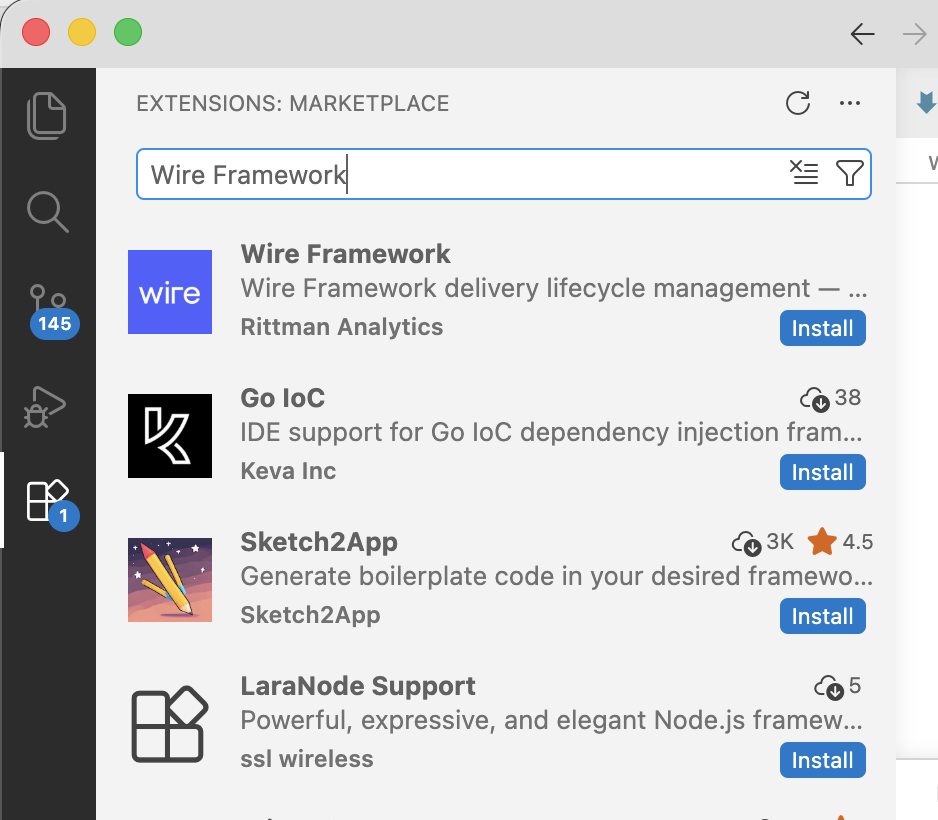

If this is your first install from Rittman Analytics, VS Code will show a **Trust Publisher & Install** dialog — click through to confirm.

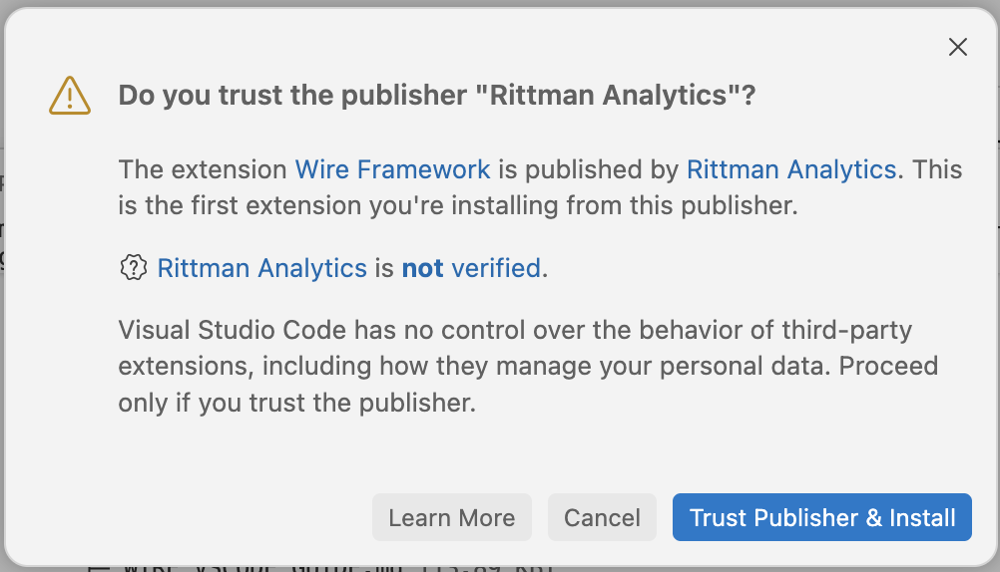

Once installed, click the **W** icon in the activity bar. For a new project with no `.wire/` folder you'll see a prompt to start a new engagement.

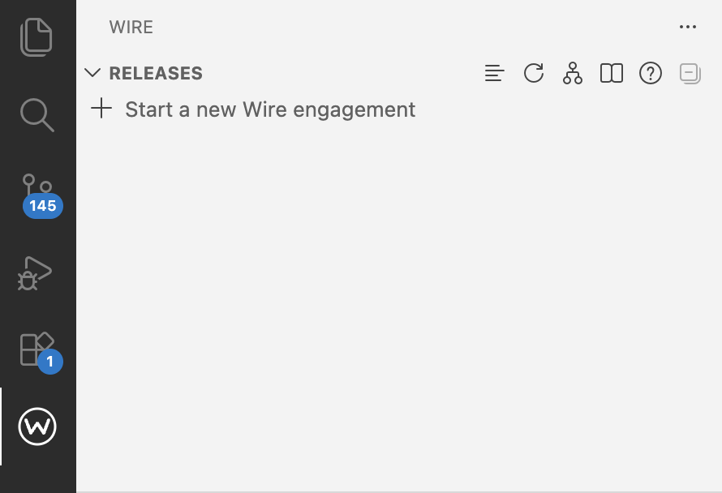

Run `/wire:new` in Claude Code to scaffold the engagement, create your first release, and configure MCP servers. Wire asks for the client name, project type, and scope before generating the structure.

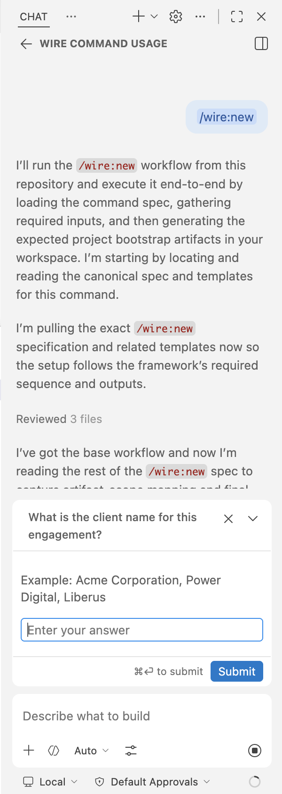

### Installing the Wire Plugin

The extension activates automatically in any workspace. Before running Wire commands you need the Wire Claude Code plugin installed. Open the **MCP Servers** panel in the Wire sidebar, click the cloud-download button in the title bar, and choose **Install from marketplace**. The picker sends `/plugin marketplace add rittmananalytics/wire-plugin` to Claude Code and copies the follow-up `/plugin install wire@rittman-analytics` command to your clipboard. After install completes, run `/reload-plugins` in Claude Code to activate the plugin in the current session.

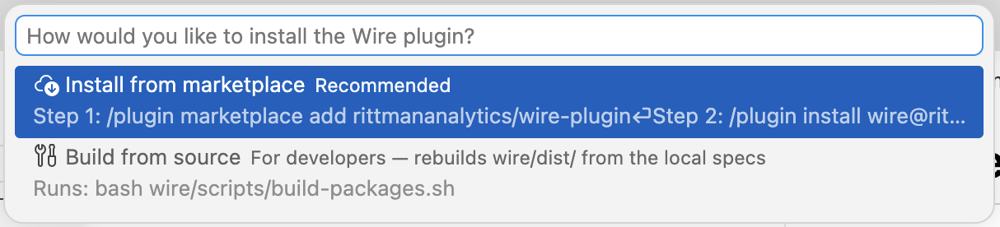

### The Releases Panel

The Releases panel is the primary navigation surface. Click the **W** icon in the activity bar to open it.

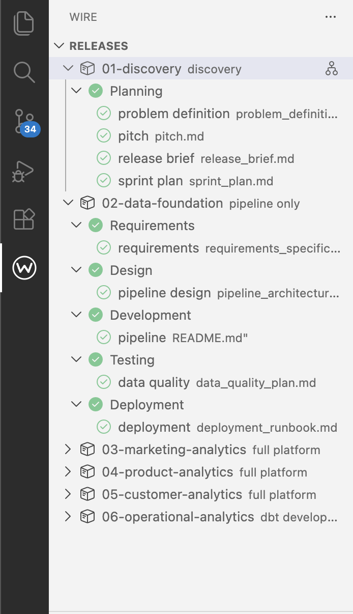

The panel reads `.wire/releases/*/status.md` and renders one collapsible section per release, organised by delivery phase. Green filled icons (✅) indicate all steps for that artifact are complete; yellow outlines show work in progress; grey outlines are not started. Clicking a completed artifact opens its generated file. Clicking an un-generated artifact triggers the generate command in Claude Code. Inline ✨ / ✓ / 💬 buttons appear on hover to generate, validate, or review without opening a menu.

### The Status Panel

The Status panel gives a compact at-a-glance view across all releases using a G (Generate) / V (Validate) / R (Review) dot grid.

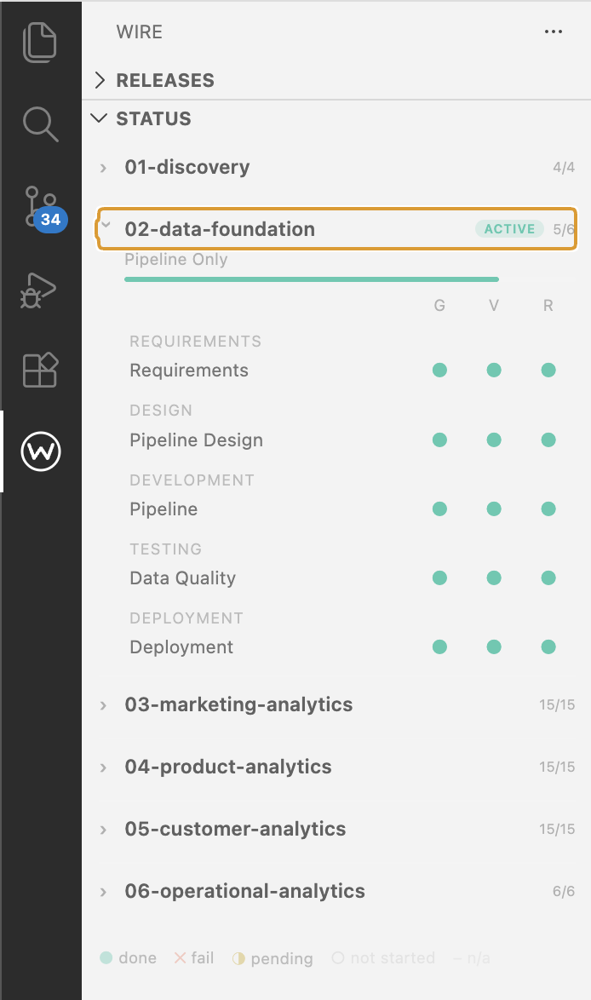

The most recently modified release shows an **ACTIVE** badge and expands by default. A teal progress bar shows overall completion. Teal dots are complete, yellow are in progress, grey are not started, and `–` means that step is not applicable to the artifact.

### The MCP Servers Panel

Wire uses MCP servers to give Claude Code access to Jira, Confluence, Fathom, Linear, and other external services. The MCP Servers panel reads all four config locations (`~/.claude.json`, `~/.claude/settings.json`, `.mcp.json`, `.claude/settings.json`) and shows a live status indicator for each server.

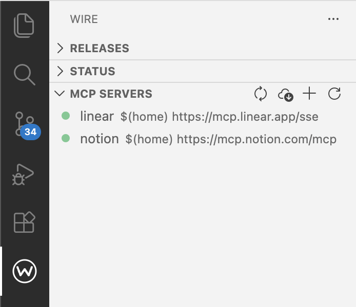

Green dots indicate the server URL is responding; red means unreachable; grey means not yet checked (stdio servers are never pinged). Use the `+` button in the panel title bar to add a new server to the project `.mcp.json`.

### The Workflow Graph

Right-click a release in the Releases tree and select **Show Workflow Graph** (or click the ⎇ icon in the title bar) to open a visual map of every artifact, arranged by phase with connecting arrows.

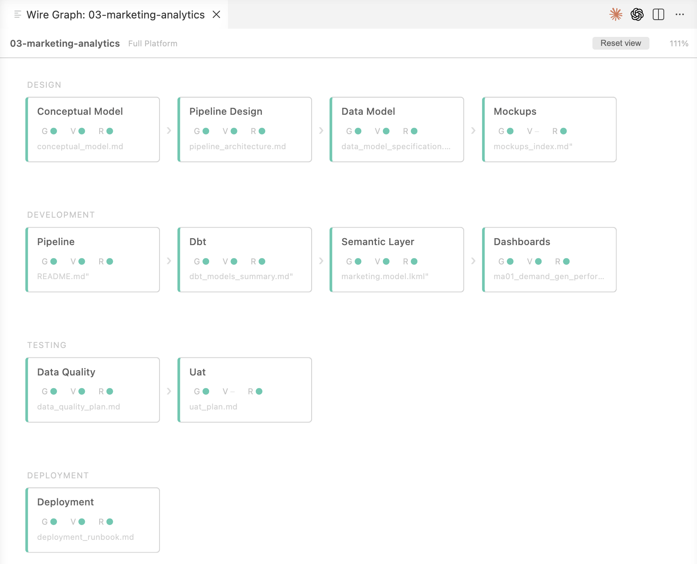

Each card shows the artifact name, G/V/R dot status, and the filename of the primary generated file. Drag the canvas to pan; scroll to zoom; click **Reset view** to return to 100%.

### Running Commands from the Graph

Right-click any artifact card to open its action menu.

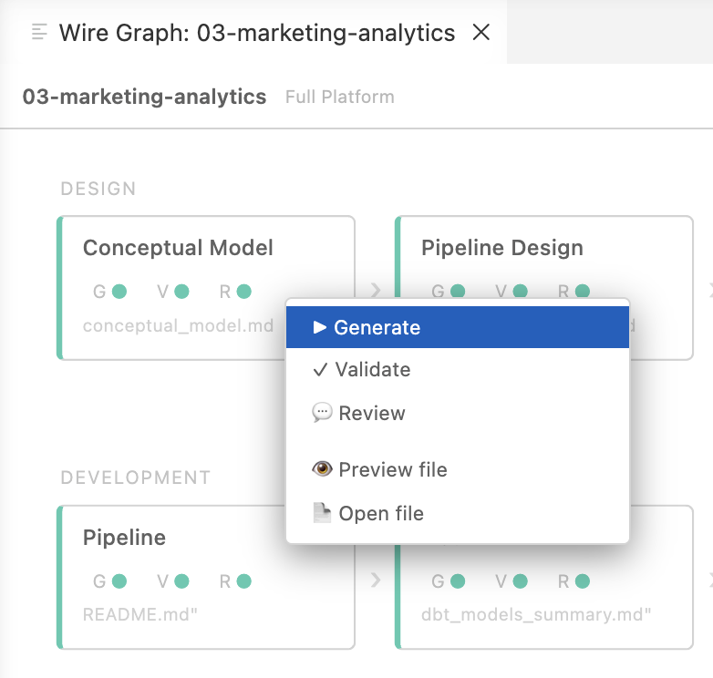

Choose **Generate**, **Validate**, or **Review** to send the corresponding `/wire:*` command to Claude Code. **Preview file** opens a rendered markdown view beside your editor:

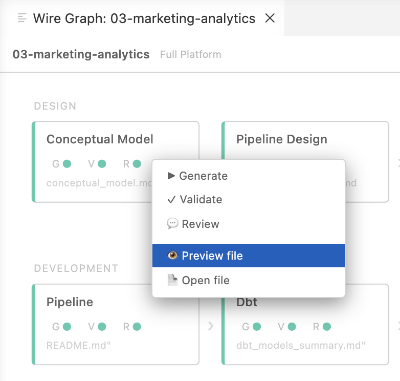

### Previewing Generated Artifacts

Selecting **Preview file** from any context menu opens the artifact in VS Code's built-in markdown renderer — formatted headings, tables, and code blocks exactly as a client would read it.

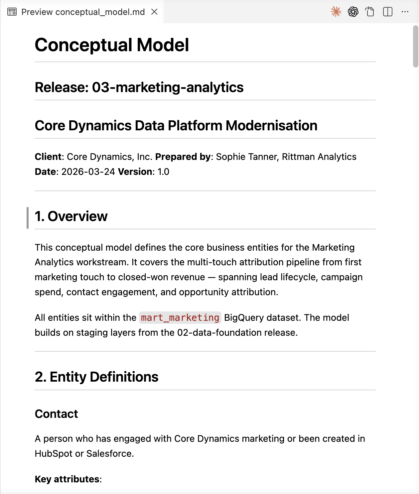

### How Commands Reach Claude Code

When you trigger any Wire action from the sidebar, the extension sends the `/wire:<artifact>-<action> <release>` command to Claude Code's chat panel and Claude Code begins execution immediately.

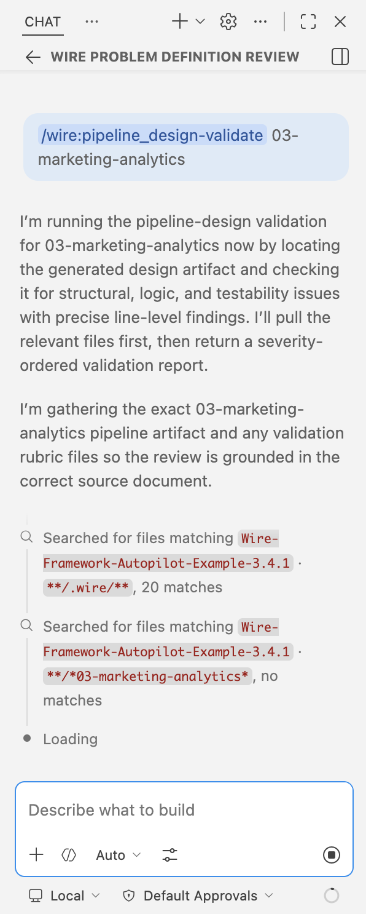

### The Command Picker

Press `⌘⇧W` (Mac) or `Ctrl⇧W` (Windows/Linux) to open the command picker from anywhere. A two-level flow lets you choose a release first (with a preview of the recommended next step), then select from scoped artifact commands, release utilities, or global session commands. The recommended next action is always surfaced at the top.

### Typical Workflow

1. Open the Wire sidebar and confirm MCP servers are online
2. Send any message — the engagement-context skill fires automatically and surfaces current release state
3. Click the recommended artifact action in the Releases panel or command picker
4. Monitor progress in the Status panel as dots move from grey → yellow → teal
5. Right-click completed artifacts to **Preview file** for review
6. Press `⌘⇧W` → **Global commands → Plan session** for an optional structured planning ritual (`/wire:plan`)

For the full guide including keyboard reference and troubleshooting, see [`wire-vscode/resources/WIRE_VSCODE_GUIDE.md`](wire-vscode/resources/WIRE_VSCODE_GUIDE.md).

---

## 24. Issue Tracking: Jira and Linear

Wire Framework supports both Jira and Linear as issue trackers. Both are optional — the framework works fully without either. When configured, issue tracking is automatic: generate, validate, and review commands sync artifact lifecycle steps to the chosen tracker without any manual action.

### Setting up issue tracking

When you run `/wire:new`, Step 9 asks which issue tracker to use:

| Choice | What happens |
|--------|-------------|
| **Jira** | Wire creates a Jira Epic for the engagement, one Task per artifact, and three Sub-tasks (generate, validate, review) per artifact. As lifecycle steps complete, Sub-tasks are transitioned to Done. |
| **Linear** | Wire creates a Linear Project for the engagement, one Issue per artifact, and three Sub-issues per artifact. As steps complete, Sub-issues transition through In Progress → Done. |
| **Both** | Both hierarchies are created and synced in parallel. A failure in one does not affect the other. |
| **None** | Track progress in `status.md` only — no external issue tracker. |

### Jira setup requirements

- Atlassian MCP must be connected and authenticated (it is included in the default MCP config)
- Provide a Jira project key (e.g. `DP`, `ACME`) when prompted during `/wire:new`
- Choose create (new Jira hierarchy) or link (map to existing Jira issues)

### Linear setup requirements

- Add the Linear MCP server with your API key:
  ```bash
  claude mcp add -s user -t sse linear https://mcp.linear.app/sse \
    -H "Authorization: Bearer <your-api-key>"
  ```
- Get your API key at linear.app → Settings → API
- When prompted during `/wire:new`, provide:
  1. Your Linear **team identifier** (e.g. `ENG`, `DATA`, `RIT`) — found in your Linear workspace URL or team settings
  2. Your preferred setup mode (see below)

### Linear setup modes

When you select Linear as an issue tracker, Wire asks how to set it up:

| Mode | What happens |
|------|-------------|
| **Create new project + new issues** | Wire creates a brand-new Linear project named `[Client Name] — [Project Name]`, then populates it with one Issue per artifact and Sub-issues for each lifecycle step. You can customise the project name before it is created. |
| **Use existing project + create new issues** | Paste a Linear project URL or ID. Wire verifies the project exists, then creates fresh Issues and Sub-issues inside it — no new project is created. Use this when the client already has a Linear project for the engagement. |
| **Link to existing project + existing issues** | Wire searches the Linear team for issues that match Wire artifact names and links them. Only unmatched artifacts get new issues created. Use this when the team has pre-existing issues you want to track against. |

**Tip**: "Use existing project + create new issues" is the most common choice for client engagements — it keeps Wire artifacts organised under a project you (or the client) already set up, while Wire handles all the issue and sub-issue creation automatically.

### How tracking works during delivery

Every generate, validate, and review command automatically calls `utils/jira_sync.md` and/or `utils/linear_sync.md` as its final step. You do not need to do anything manually — the sync happens as a natural part of the lifecycle.

`/wire:status` runs a full reconciliation (`utils/jira_status_sync.md` and/or `utils/linear_status_sync.md`) to bring the issue tracker fully in sync with the current `status.md` state. Run this if you suspect the tracker has drifted.

### Configuration in status.md

```yaml
jira:
  project_key: "DP"
  epic_key: "DP-10"
  artifacts:
    requirements:
      task_key: "DP-11"
      generate_key: "DP-12"
      validate_key: "DP-13"
      review_key: "DP-14"

linear:
  team_id: "abc-123"
  project_id: "def-456"
  artifacts:
    requirements:
      issue_id: "ghi-789"
      generate_id: "jkl-012"
      validate_id: "mno-345"
      review_id: "pqr-678"
```

---

## 25. Document Store: Confluence and Notion

The document store integration allows generated Wire artifacts to be replicated to Confluence or Notion, giving clients a familiar, annotatable view of deliverables. The Wire review command then retrieves client comments and any edits they have made, feeding them into the review as structured context.

### What it is for

On most engagements, the client does not have access to GitHub. Sending PDF exports or sharing screen is inefficient for document review. The document store integration solves this by:

1. Publishing each generated artifact to a Confluence page or Notion page that the client can access directly
2. Letting the client add comments and make minor edits in the document store
3. Surfacing those comments and edits automatically during the Wire review command, so the user has a complete picture of client feedback before the review meeting

### Setting up the document store

When you run `/wire:new`, Step 9.5 asks which document store to use:

| Choice | What happens |
|--------|-------------|
| **Confluence** | Wire creates a "Wire Documents" parent page in a Confluence space you specify. All artifact pages are created under it. Uses the existing Atlassian MCP. |
| **Notion** | Wire creates a "Wire Documents" parent page under a Notion page you specify. Uses the Notion MCP (OAuth). |
| **Both** | Creates parent pages in both stores. Artifacts are synced to both simultaneously. |
| **None** | No document store. Documents stay in GitHub only. |

You can also run `/wire:utils-docstore-setup <release>` directly to configure a store for an existing release.

### Confluence setup requirements

- Atlassian MCP must be connected (included in default MCP config)
- Provide your Confluence space key (e.g. `PROJ`, `DP`) when prompted
- Optionally provide a parent page — the "Wire Documents" folder will be created there

### Notion setup requirements

- Add the Notion MCP server:
  ```bash
  claude mcp add -s user -t http notion https://mcp.notion.com/mcp
  ```
- Complete the OAuth flow when prompted (first use only)
- Provide the URL or ID of the Notion page where Wire Documents should be created

### How it works during delivery

**On every generate command:**
- Wire generates the `.md` file to the repo as normal
- Then calls `utils/docstore_sync.md` to create or overwrite the document store page
- The page ID and URL are stored in `status.md` under the `docstore:` block
- If sync fails, the generate command continues — the failure is logged but does not block the workflow

**On every review command:**
- Wire calls `utils/docstore_fetch.md` to retrieve:
  - All comments on the document store page (inline and footer)
  - Any differences between the document store version and the canonical `.md` file
- This is surfaced as a "Document Store Context" block before the review:

```
## Document Store Context — Requirements Specification

### Reviewer Comments (2 total)
- Jane Smith (2026-03-28): "Section 3.2 — please add more detail on the CRM data source"
- Jane Smith (2026-03-28): "Timeline in Section 5 needs to move by 2 weeks"

### Document Edits Since Generation
Section 4.1 was edited: "Python 3.11" changed to "Python 3.12"

### Links
- Confluence: https://acme.atlassian.net/wiki/spaces/DP/pages/12345
```

**On review approval:**
- Wire re-syncs the canonical `.md` file to the document store, overwriting the page with the approved version

**On re-generate:**
- The existing page is overwritten in place (same page ID) — not duplicated

### Tips for working with clients

- Share the Confluence space or Notion parent page with the client during project kickoff
- Ask them to add comments rather than editing the document directly — this preserves the audit trail
- If they do edit the document directly, the Wire review command will flag the diff — you can decide whether to accept the change
- The document store is not the source of truth — the canonical `.md` file in GitHub is. The store is a collaboration layer.

---

## 26. Extending and Customising the Framework

The framework is designed to be extended. All delivery intelligence lives in plain markdown files. Adding a new capability means writing a new markdown file.

**As of v4.0.0**, `wire/release-types/*.yaml` and `wire/specs/**/*.md` are not edited directly in this repo — they're a synced, pinned mirror of a private, branch-protected `wire-process-registry` repo. See [The Process and Data Model Registries](#the-process-and-data-model-registries) below for why, and for how the (separate, optionally-used) `wire-data-model-registry` fits in.

### Adding a new release type

A release type is a YAML file conforming to `wire/schemas/release-type-schema.md`: a set of phases, each with an ordered list of artifacts (`id`, `command`, `depends_on`, `sequence`, `required`), plus the spec files those commands point to. Both the [precondition gate](#the-precondition-gate) and [Autopilot](#21-wire-autopilot-autonomous-execution) read this file at runtime, so it's not a documentation exercise — getting the `depends_on` graph wrong breaks a real engagement.

To add one for real:

1. **Open a PR against `wire-process-registry`** (not this repo). Add `release-types/<name>.yaml` there, following the schema.
2. **Write a spec file per artifact** in the same registry repo, at `specs/<domain>/<artifact>/generate.md` (plus `validate.md`/`review.md` where applicable), with `wire_schema` front-matter conforming to `wire/schemas/command-schema.md`.
3. **Get it reviewed and merged** — one approving review is required; branch protection enforces this even for admins.
4. **Sync it into this repo**: `wire/scripts/sync-process-registry.sh` mirrors both directories and records the resolved commit in `wire/process_registry/pinned_sha.txt`.
5. **Rebuild**: `bash wire/scripts/build-packages.sh` bundles the newly-synced YAML and inlines the specs into `commands/*.md`/`.toml`.

Once bundled, nothing else in the framework needs to know the new release type exists — the precondition gate and Autopilot both resolve it automatically from the YAML.

### The Process and Data Model Registries

Wire depends on two different kinds of specialised knowledge to do its job, and as of v4.0.0 both live outside this repo, in their own private GitHub repos.

The first is about *how Wire works*: the exact sequence a release type follows, and what each command actually does. The second is about *what Wire knows*: canonical data models built from RA's collective experience across real client engagements, that a new engagement can optionally draw on for a head start instead of starting from a blank page.

Those two can look alike from the outside — both are private repos, both get pulled into this repo as a local copy — but they exist for opposite reasons, which is exactly why they get treated so differently once they're here.

**[`wire-process-registry`](https://github.com/rittmananalytics/wire-process-registry)** (private repo — RA staff with GitHub org access) is the process knowledge — the source of truth for `wire/release-types/*.yaml` and `wire/specs/**/*.md`. Nothing about it is secret, but now that it can actually *enforce* a release's process rather than just describe it (see [The precondition gate](#the-precondition-gate)), a mistake in it doesn't just look wrong in a doc — it breaks a real engagement. So changing it now goes through a proper review: it's branch-protected (one required approval, admin enforcement on) and never fetched live, with `wire/scripts/sync-process-registry.sh` mirroring it into this repo and pinning the resolved commit in `wire/process_registry/pinned_sha.txt`. Because it's Wire's own public operating procedure — already visible to anyone reading the plugin's command files — this content is bundled straight into the public `wire-plugin`/`wire-extension` packages once synced.

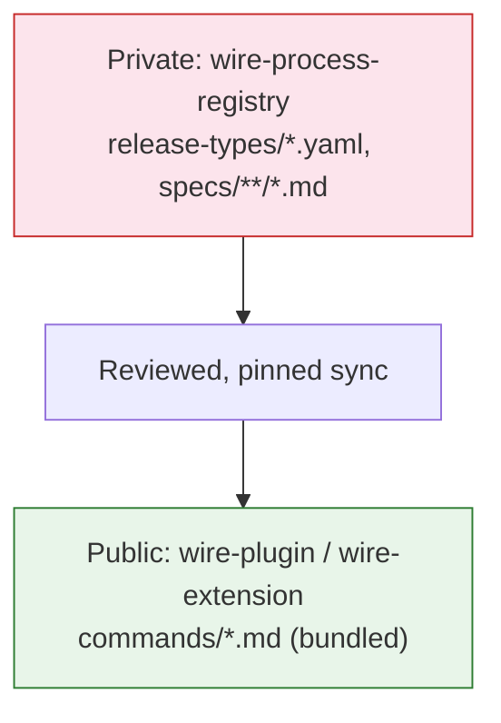
```mermaid
flowchart TB
    RT["Private: wire-process-registry<br/>release-types/*.yaml, specs/**/*.md"]
    SYNC["Reviewed, pinned sync"]
    CMDS["Public: wire-plugin / wire-extension<br/>commands/*.md (bundled)"]

    RT --> SYNC --> CMDS

    style RT fill:#fce4ec,stroke:#c62828
    style CMDS fill:#e8f5e9,stroke:#2e7d32
```

**What a release-type definition actually looks like** — `pipeline_only.yaml` in full, one of the smaller release types and real content from `wire-process-registry`, not illustrative:

```yaml
wire_schema: "1.0"
id: pipeline_only
name: "Pipeline Only"
description: "Data pipeline development only — ingestion architecture, pipeline implementation, and data quality testing, without a dbt/semantic-layer/BI build."
applicable_when:
  - "Client needs a data pipeline built but transformation/BI is out of scope or handled separately"
  - "Scope is limited to getting data reliably into the warehouse"

phases:
  - id: requirements
    name: "Requirements"
    required: true
    requires_phase: null
    artifacts:
      - id: requirements
        command: requirements
        required: true
        sequence: 1
        depends_on: []

  - id: design
    name: "Design"
    required: true
    requires_phase: requirements
    artifacts:
      - id: pipeline_design
        command: pipeline_design
        required: true
        sequence: 1
        depends_on:
          - artifact: requirements
            action: review
            outcome: approved

  - id: development
    name: "Development"
    required: true
    requires_phase: design
    artifacts:
      - id: pipeline
        command: pipeline
        required: true
        sequence: 1
        depends_on:
          - artifact: pipeline_design
            action: review
            outcome: approved

  - id: testing
    name: "Testing"
    required: true
    requires_phase: development
    artifacts:
      - id: data_quality
        command: data_quality
        required: true
        sequence: 1
        depends_on:
          - artifact: pipeline
            action: review
            outcome: approved

  - id: deployment
    name: "Deployment"
    required: true
    requires_phase: testing
    artifacts:
      - id: deployment
        command: deployment
        required: true
        sequence: 1
        depends_on:
          - artifact: data_quality
            action: validate
            outcome: PASS
```

| Element | Meaning |
|---|---|
| `wire_schema` | Which version of the schema this file conforms to — lets the contract evolve without breaking every existing release type at once. |
| `id` | The identifier used everywhere else — `status.md`'s `project_type`, `/wire:new`'s selector, and the lookup key both the precondition gate and Autopilot use (`wire/release-types/<id>.yaml`). |
| `name` / `description` | Human-readable label and summary, shown when choosing a release type. |
| `applicable_when` | Plain-language guidance on when this release type fits — documentation, not machine-enforced. |
| `phases[]` | The ordered top-level stages. Coarser than artifacts; mainly organisational. |
| `phases[].requires_phase` | Which phase must fully complete before this one starts — phase-level ordering. |
| `phases[].artifacts[]` | The actual deliverables in that phase — this is the part with real teeth. |
| `artifacts[].id` | The artifact's identifier, matching what appears in `status.md`. |
| `artifacts[].command` | Which command family handles it — resolves to `/wire:{command}-generate/-validate/-review`. |
| `artifacts[].required` | Whether this artifact must be completed for the release type to be considered done. Some artifacts elsewhere (e.g. `mockups` in `full_platform`) are `false` — optional. |
| `artifacts[].sequence` | Tie-breaker: when two artifacts in the same phase have no dependency between them, `sequence` decides order. |
| `artifacts[].depends_on[]` | **The actual dependency graph.** Each entry names an upstream artifact, the gate it must have passed (`action`), and the required state (`outcome`). `pipeline_design` can't start until `requirements`' review is `approved`; `deployment` can't start until `data_quality`'s validate is `PASS`. |

This `depends_on` graph is exactly what the precondition gate checks before letting a command run, and what Autopilot sorts to decide execution order.

**[`wire-data-model-registry`](https://github.com/rittmananalytics/wire-data-model-registry)** (private repo — RA staff with GitHub org access) is the data knowledge, and it's the opposite case. When RA builds a data model for a client in a familiar industry — SaaS, retail, insurance, manufacturing, education, subscription commerce — it's rarely the first time RA has solved this kind of problem: there's a good instinct for what a solid `Customer` entity looks like for a SaaS business, what a `Policy` and `Claim` model needs to capture for insurance, what grain makes sense for subscription revenue. None of that experience used to be available to Wire itself — every new engagement started from a blank page, even when the shape of the answer was already well understood.

This registry is where that experience now lives: a private library, organised by industry, of the entities RA typically expects to see, the structure and grain that's worked well before, and real worked examples of how a similar model was actually built — not code to copy and paste, but a reference to learn the pattern from. The value to a consultant: when you start a data model for a client in one of these industries, Wire recognises the fit and offers this as a starting point — a genuine head start instead of reasoning up the whole thing from nothing. You can take it, adapt it, or ignore it entirely; it's always a suggestion, never applied automatically. This isn't limited to an exact industry match, either — if nothing in the registry is a confident fit (there's no dedicated `saas` vertical yet, for instance), Wire proposes the closest available analogue, explicitly labelled as approximate, and separately checks for relevant cross-industry patterns (contact reconciliation across systems, revenue recognition, and so on) regardless of whether any industry matched at all. Once the model is built, Wire can also flag if something standard for that industry looks like it's missing.

Because this comes from real client work, it's genuinely confidential — part of what makes RA's delivery experience valuable, not something to publish for anyone who installs the Wire plugin. So it's kept out of the public plugin entirely and never bundled in.

**Setup is automatic — you shouldn't need to think about it.** `/wire:new` and Autopilot both attempt this on your behalf, silently, the first time you start an engagement whose release type would actually use it (`full_platform`, `dbt_development`, `dashboard_first`) — at most once per machine. If you have GitHub access, it just works from then on; if you don't, nothing happens and nothing changes about how Wire behaves for you. You can also run `/wire:utils-data-model-registry-setup` yourself any time.

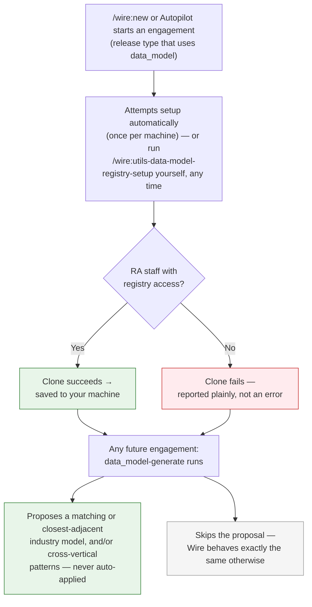
```mermaid
flowchart TB
    START["/wire:new or Autopilot starts an engagement\n(release type that uses data_model)"]
    AUTO["Attempts setup automatically\n(once per machine) — or run\n/wire:utils-data-model-registry-setup yourself, any time"]
    CHECK{"RA staff with<br/>registry access?"}
    YES["Clone succeeds →<br/>saved to your machine"]
    NO["Clone fails —<br/>reported plainly, not an error"]
    GEN["Any future engagement:<br/>data_model-generate runs"]
    PROPOSE["Proposes a matching or closest-adjacent<br/>industry model, and/or cross-vertical<br/>patterns — never auto-applied"]
    SKIP["Skips the proposal —<br/>Wire behaves exactly the same otherwise"]

    START --> AUTO --> CHECK
    CHECK -->|Yes| YES --> GEN --> PROPOSE
    CHECK -->|No| NO --> GEN --> SKIP

    style YES fill:#e8f5e9,stroke:#2e7d32
    style NO fill:#ffebee,stroke:#c62828
    style PROPOSE fill:#e8f5e9,stroke:#2e7d32
    style SKIP fill:#f5f5f5,stroke:#999
```

| | wire-process-registry | wire-data-model-registry |
|---|---|---|
| Content | Release-type YAML, command specs | Canonical entity/schema YAML, reference dbt SQL |
| Confidentiality | Public (Wire's own operating procedure) | Proprietary (real client engagement content) |
| Bundled into public plugin? | **Yes** | **No — never** |
| How you get it | Comes with the plugin | Automatic (via `/wire:new`/Autopilot) or `/wire:utils-data-model-registry-setup` yourself, using your own GitHub access |

### Adding a new command

**Step 1: Write the workflow spec**

Create a file at `wire/specs/<phase>/<artifact>/<action>.md`. Use the `wire_schema` frontmatter contract (`wire/schemas/command-schema.md`):

```markdown
---
wire_schema: "1.0"
command: generate               # generate | validate | review | utility | lifecycle
artifact: my_artifact
domain: my_domain
release_types:                  # which release types use this — [] for cross-cutting utilities
  - full_platform
action_type: artifact
logs_execution: true
preconditions:                  # static list, or the literal string "dynamic" if the correct
  - artifact: upstream_artifact  # precondition genuinely varies by release type
    action: review
    outcome: approved
description: Brief description of what this command does
argument-hint: <project-folder>
---

# [Artifact] [Action] Command

## Purpose
[What this command does and why]

## Prerequisites
- [What must be complete before this runs]
- [Example: requirements artifact must be review:approved]

## Workflow

### Step 1: Read Inputs
[Which files to read, in what order, using which tools]

### Step 2: Generate / Validate / Review
[The core logic — templates, checks, or review gathering]

### Step 3: Update Status
[How to update status.md after completion]
Example:
```yaml
artifacts:
  <artifact_name>:
    generate: complete
    file: <output_path>
    generated_date: <today>
```

### Step 4: Confirm and Suggest Next Steps
[Output message to the user, next recommended command]

## Edge Cases
[What to do if inputs are missing, incomplete, or conflicting]

## Output
[List of files created or updated]
```

**Step 2: Register in the build script**

Add the command to the `COMMANDS` array in `wire/scripts/build-packages.sh` following the existing pattern:

```bash
"<phase>/<artifact>/<action>|<spec_path>|Description|<argument-hint>|yes"
```

**Step 3: Rebuild packages**

```bash
bash wire/scripts/build-packages.sh
```

The new command will be embedded in the next plugin/extension build.

### Modifying an existing command

Edit the workflow spec file directly (`wire/specs/<path>.md`). No reinstallation needed — changes take effect immediately on the next invocation.

Common modifications:
- **Adding a new validation check**: add a check to the validate spec for that artifact
- **Changing a code template**: update the SQL/YAML/LookML template embedded in the generate spec
- **Adding a new required section to a document**: add it to the generate spec's document structure and the validate spec's completeness checklist

### Proactive development skills

In addition to `/wire:*` commands, the plugin includes **skills** — contextual guides that activate automatically when working outside of Wire commands. Skills do not require a slash command; Claude loads them based on keywords and file types.

| Skill | Activates when | What it provides |
|---|---|---|
| **Research Persistence** | Performing technical research (schema lookups, library docs, technology investigations) | Checks `.wire/research/sessions/` for prior findings before researching; saves summaries for future sessions |
| **dbt Development** | Working with `.sql` model files, `schema.yml`, or asking about dbt conventions | Naming rules, SQL style, testing requirements, multi-source framework |
| **LookML Content Authoring** | Creating or editing LookML views, explores, or dashboards | LookML patterns, validation against source DDL |
| **LookML Content Authoring (MCP)** | LookML work with a Looker MCP server connected | Live schema validation via Looker API |
| **Dagster** | Creating or modifying Dagster assets, schedules, sensors | `@dg.asset` patterns, dagster-dbt integration, CLI reference |
| **Dignified Python** | Writing or reviewing Python code | LBYL, 3.10+ type syntax, pathlib, Click patterns |
| **dbt Unit Testing** | Creating dbt unit tests or asking about transformation testing | Model-Inputs-Outputs pattern, format selection, BigQuery caveats |
| **dbt Troubleshooting** | Diagnosing dbt job failures or test errors | Systematic error classification, investigation steps |
| **dbt Semantic Layer** | Building MetricFlow semantic models, metrics, or dimensions | Semantic model YAML structure, 5 metric types, validation |
| **dbt Migration** | Migrating a dbt project between platforms (BigQuery, Snowflake, Databricks) | Dialect differences, pre/post-migration testing, iterative fix workflow |
| **dbt Fusion Migration** | Upgrading from dbt Core to dbt Fusion runtime | 4-category error triage, dbt-autofix workflow, Fusion-specific errors |
| **dbt MCP Server** | Setting up the dbt MCP server for Claude Code | Configuration templates, credential security, Wire `.mcp.json` integration |
| **dbt Analytics Q&A** | Answering business data questions against a dbt project | 4-level escalation: Semantic Layer → compiled SQL → model discovery → manifest |
| **dbt DAG Visualisation** | Visualising dbt model lineage or dependencies | Mermaid `graph LR` diagrams, Wire colour-coding conventions |

#### Adding a new skill

Create a file at `wire/skills/<skill-name>/SKILL.md` with this frontmatter:

```markdown
---
name: skill-name
description: One-line description of what this skill does and when it activates.
---

# Skill Name

## Purpose
[What this skill does]

## When This Skill Activates
### User-Triggered Activation
[Keywords and phrases that trigger this skill]

### Self-Triggered Activation (Proactive)
[Conditions under which you should load this skill without being asked]

---
## Core Patterns
[The conventions, rules, and examples the skill provides]
```

Skills are automatically copied into the plugin build by `build-packages.sh`. No registration step is needed — any `.md` file in `wire/skills/<name>/SKILL.md` is included automatically.

### Adding support for a new technology stack

The current framework targets BigQuery + dbt + LookML. Adapting for another stack (e.g. Snowflake + dbt + Tableau) involves:

1. **Update the dbt generate spec** (`specs/development/dbt_generate.md`): change BigQuery-specific SQL syntax (e.g. `current_timestamp()` → `current_timestamp`) and materialisation options
2. **Update the semantic layer spec** (`specs/development/semantic_layer/generate.md`): replace LookML templates with Tableau / Power BI DAX equivalents
3. **Update the pipeline design spec** (`specs/design/pipeline_design/generate.md`): update the replication tool and architecture descriptions

The non-technology artifacts (requirements, data_model, training, documentation) require no changes.

### Adjusting naming conventions

dbt naming conventions are embedded in the dbt generate and validate specs. To change them (e.g. to use `int__` prefix for integration models instead of no prefix):

1. Edit the naming section in `specs/development/dbt_generate.md`
2. Update the corresponding validation checks in `specs/development/dbt_validate.md`

The framework uses a 2-tier convention loading system. When generating or validating dbt models, it first checks for project-specific convention files (`.dbt-conventions.md`, `dbt_coding_conventions.md`, or `docs/dbt_conventions.md` in the project root). If found, those conventions take priority. If not found, the framework uses the comprehensive embedded conventions covering field naming, SQL style, CTE structure, testing requirements, and documentation standards.

---

## 27. FAQ

**Q: Do I need to run every command in order, or can I skip phases?**

The framework enforces phase dependencies through prerequisite checks in each workflow spec. You cannot generate dbt models before the data model is approved, for example — the generate command will check and block. That said, within a phase, some artifacts can be generated in parallel (pipeline_design and data_model; semantic_layer and dashboards). Use `/wire:status` to see exactly what is and isn't blocked.

---

**Q: A client has given feedback and wants to change the requirements after design has started. What do I do?**

Update the requirements document manually, then re-run validate and review to record the new approval. If the change affects the data model, re-run `data_model:generate` (the AI will read the updated requirements). Set the affected downstream artifacts back to `not_started` in `status.md` before regenerating. The framework will pick up from the updated state.

---

**Q: The dbt models generated don't compile. What should I check?**

1. Verify source table names in `_sources.yml` match exactly what is in the warehouse
2. Check that `ref()` calls in generated models point to models that exist
3. Run `/wire:dbt-validate` — it checks `ref()` targets and naming before you try to run
4. If the data model spec had incorrect column names (from a schema that changed), update the spec in `design/data_model_specification.md` and re-run `dbt:generate`

---

**Q: The AI generated something that doesn't match our client's specific conventions. How do I fix it?**

Two options:
1. **One-off fix**: Edit the generated file directly, then re-run validate and review
2. **Fix the root cause**: Edit the workflow spec template that produced the incorrect output (`wire/specs/<path>.md`), then re-run generate. This ensures future projects also get the correct output.

If a client has persistent conventions that differ from our standard templates (e.g. a different surrogate key pattern), update the template in the generate spec and note it in the release's `status.md` notes section.

---

**Q: Can I run multiple releases in the same repository?**

Yes. The `.wire/releases/` directory supports as many release folders as needed. `/wire:start` and `/wire:status` show all releases. Each release is isolated in its own folder with its own `status.md`. The generated code (dbt models, LookML) is shared in the repository root, so use clear naming conventions to avoid collisions between releases.

---

**Q: Where do I put source materials like the SOW, SQL examples, and meeting notes?**

- **SOW**: copy to `engagement/sow.md` (done automatically by `/wire:new`)
- **Meeting transcripts and call notes**: add to `engagement/calls/` (named by date, e.g. `2026-03-10-kickoff.md`)
- **SQL examples from the source database**: put in the release's `requirements/` folder — the AI reads this during requirements generation
- **Existing dbt project files or schema documentation**: put in `requirements/` for the relevant release
- **Org charts and stakeholder maps**: add to `engagement/org/`

The AI reads `engagement/` for background context and the release's `requirements/` folder for source materials at the start of each generate command.

---

**Q: How do I handle a project where the SOW is not a PDF?**

If the SOW is a Word document, export it as PDF, or copy the key sections (deliverables, timeline, technical outcomes, out-of-scope items) into `engagement/sow.md` as markdown. The AI can work with `.md` files directly. If it's in a Google Doc, copy the text into the file.

---

**Q: The client changed the data model after development started. Do I have to regenerate everything?**

Not necessarily. If the change is additive (new columns or new models), you can:
1. Update `design/data_model_specification.md` with the additions
2. Run `dbt:generate` again — the AI will read the updated spec and produce the new models, leaving existing models intact
3. Re-run `dbt:validate` and get approval

If the change is breaking (renamed columns, changed grain, removed models), treat it as a change request: update the spec, regenerate the affected models, update the semantic layer if column names changed, re-run tests, and record the change in `status.md` notes.

---

**Q: Can I use the framework with Gemini CLI instead of Claude Code?**

Yes. The framework supports both Claude Code and Gemini CLI. Install the `wire` extension (`gemini extensions install <repo-url>`) and all commands are available as `/dp *`. The workflow specs are identical across both runtimes — the only difference is the command format. Both runtimes produce the same project structure and artifacts.

---

**Q: Can I use the framework without Claude Code or Gemini CLI — e.g. in a web browser chat interface?**

The `/wire:*` command system requires a CLI-based AI coding agent (Claude Code or Gemini CLI), which is what discovers and runs the command wrappers. However, the workflow specification files (`wire/specs/*.md`) are plain markdown — you can read them and follow them manually in any AI interface, using the specs as structured instructions. You'll lose the automated status tracking and command discovery, but the methodology still works.

---

**Q: How do I know when a release is complete?**

Run `/wire:status <release-folder>`. When all in-scope artifacts show `review: approved` (or `not_applicable` for out-of-scope artifacts), the release is complete. Run `/wire:archive <release-folder>` to close it out. For a discovery release, completion means the sprint plan is approved and downstream releases have been spawned via `/wire:release:spawn`.

---

**Q: Why does `/wire:new` force me to create a branch?**

The framework requires all release work to happen on a feature branch, not directly on `main` or `master`. This is standard git hygiene — generated artifacts, dbt models, and LookML files should be reviewed via pull request before merging. If you're already on a feature branch when you run `/wire:new`, the check passes silently and you won't notice it. The suggested branch name is `feature/{engagement-name}` (e.g., `feature/acme-analytics`), but you can choose any name.

---

**Q: How do I upgrade the framework on a client repo that's mid-project?**

Plugin/extension users get updates automatically when a new version is published. Your project data (`.wire/`), generated code (dbt models, LookML), and `status.md` files are completely separate and not affected. Workflow specs are defensively compatible — they check for fields before using them, so an older `status.md` works with newer specs. Jira tracking continues automatically if already configured.

---

**Q: When should I use Dashboard-First instead of Full Platform?**

Use Dashboard-First when: (1) the SOW is well-defined enough to mock dashboards early, (2) you want stakeholder feedback before committing to a data model, or (3) client data access may be delayed. Use Full Platform when: the engagement requires a conceptual entity model and pipeline architecture decisions upfront, or when the data sources are complex enough that understanding them must precede any dashboard design.

---

**Q: Can I switch from Dashboard-First to Full Platform mid-project?**

Not automatically — the release type determines the artifact scope at creation time. However, you can manually edit `status.md` to add artifacts that were marked `not_applicable` (e.g. add `pipeline_design` if you later decide you need it). The workflow specs will work correctly with manually added artifacts.

---

**Q: When should I use Platform Migration instead of starting with a discovery release?**

Use Platform Migration when the decision to migrate has already been made and the scope boundary is confirmed in the SOW — you know *what* is being migrated and the client has agreed to proceed. If there is genuine uncertainty about whether migration is the right approach, run a `sop_discovery` or `discovery` release first. Migration is expensive to reverse once Fivetran connectors are cut over to the target.

---

**Q: The Fivetran MCP is not reachable for my client. What do I do?**

`ingestion-audit-generate` detects this automatically after a 10-second timeout and falls back to reading a CSV file at `audit/fivetran_connectors_input.csv`. Export your connector list from the Fivetran dashboard (Connectors → export) and populate the CSV. The template is at `wire/TEMPLATES/migration/fivetran_connectors_input.csv`. The audit output is identical whether data came from MCP or CSV — the CSV is a first-class input, not a degraded fallback.

---

**Q: How many equivalency loop iterations should I expect before cutover?**

Client C (1,500+ dbt models, BigQuery → Snowflake) ran two iterations: the first pass surfaced 783 failing checks, mostly from TIMESTAMP_DIFF argument order reversals and ARRAY_AGG ordering differences. The second pass after bulk fixes reduced failures to 35, all in high-complexity models needing per-model attention. Typical projects with <300 models and no ML or spatial features should reach zero failures in one or two iterations. High complexity models with extensive STRUCT/ARRAY logic or custom macros may need three or four.

---

**Q: What if the client's real data schema is very different from what the seed data assumed?**

The `data_refactor:generate` command handles this by comparing the seed schema against the real one and generating a refactoring plan. Significant differences (renamed tables, different grain, additional source systems) will produce a larger refactoring plan, but the command still works. In extreme cases, you may need to regenerate the data model specification and re-run dbt generation. The seed-based prototype is still valuable even if the refactor is substantial — it validated the dashboard design and business logic.

---

**Q: Do I need any external tools for dashboard-first projects?**

No. The mockups command for `dashboard_first` releases generates interactive HTML Looker mockups directly inside Claude Code — no external accounts, browser extensions, or subscriptions required. The HTML files are self-contained and can be opened in any browser or attached to emails.

---

**Q: What is Wire Autopilot and when should I use it?**

Wire Autopilot (`/wire:autopilot`) is an autonomous execution mode that takes a SOW and runs through the entire project lifecycle without further human input. It generates, validates, and self-reviews every artifact. Use it for rapid prototyping, standard engagements with well-defined SOWs, internal projects, or proof-of-concept work. For client-facing engagements requiring human approval at each gate, use the individual commands instead.

---

**Q: Can I resume Autopilot if it gets interrupted?**

Yes. Re-run `/wire:autopilot` on the same project. It reads `status.md` and `autopilot_checkpoint.md` to determine where it left off and continues from the next incomplete artifact. It will not re-generate already-completed and approved artifacts.

---

**Q: Can I mix Autopilot with manual commands?**

Yes. Autopilot and manual commands share the same state files (`status.md`, `execution_log.md`). You can start with Autopilot for the bulk of the work, then use manual commands for specific phases. Or fix a blocked artifact manually and re-run Autopilot to continue.

---

**Q: How does Autopilot handle dashboard-first mockups?**

For dashboard-first projects, Autopilot generates interactive HTML Looker mockups autonomously as part of its standard execution — no manual intervention required. The mockup generation step is fully automated and produces both the HTML files and the visualization catalog inputs in one pass.

---

**Q: What are safety gates and which phases trigger them?**

Safety gates are automatic pause points that prevent Autopilot from touching external systems without your explicit confirmation. Four artifacts are gated: `pipeline` (activates data connectors), `data_refactor` (runs dbt against real data), `data_quality` (executes SQL tests against a database), and `deployment` (deploys to live environments). All other phases — including dbt model generation, LookML, dashboards, and documentation — run fully autonomously since they only write files to the repository.

---

**Q: Do I need to run a discovery release before every engagement?**

No. Discovery is optional. Use it when: (1) the client is not sure what they need built, (2) scope needs to be negotiated before a SOW is signed, or (3) you want to formally validate the problem and shape the solution before committing. If you already have a well-scoped, signed SOW, go directly to the appropriate delivery release type.

---

**Q: What is Shape Up and why does the discovery release use it?**

Shape Up is a product development methodology (from Basecamp) that emphasises fixed-time variable-scope delivery: you commit to an *appetite* (how much time this is worth), shape a solution within that appetite, and cut scope to fit the time rather than extending the time to fit the scope. Wire's discovery release implements Shape Up because it prevents the most common planning failure on analytics engagements — committing to a fixed scope in a fixed time without validating the problem or shaping the solution first. The betting table review and appetite-driven sprint plan are both Shape Up concepts.

---

**Q: What is the `.wire/engagement/` folder for, and who populates it?**

`engagement/` holds context that belongs to the whole engagement rather than any specific release: the SOW, call transcripts, org charts, and current-state architecture notes. It is populated by the user, not by Wire commands. `/wire:new` creates `engagement/context.md` and copies the SOW to `engagement/sow.md` during setup. After that, transcripts and notes are added manually as the engagement progresses. All Wire commands — discovery and delivery alike — read from `engagement/` for background context.

---

**Q: What is the `research/` folder and should I manage it?**

`.wire/research/sessions/` is managed automatically by the research persistence skill. You do not need to create or edit these files manually. When the AI performs technical research during a session (looking up schemas, reading library docs, investigating a technology), it saves a structured summary there automatically. The engagement-context skill surfaces relevant prior research at the start of each conversation. Think of it as an automatically maintained research log — read it if you want to see what was investigated previously, but do not edit it.

---

**Q: Can I run a discovery release and a delivery release at the same time?**

Not recommended. The discovery release should be completed and delivery releases spawned via `release:spawn` before delivery work begins. Discovery is specifically about determining *what* to build — starting delivery before that is known creates rework risk. If you are joining an engagement mid-stream where discovery has already been done informally, create the delivery release directly without a discovery release.

---

**Q: Do I need to run a session:start command before I begin work?**

No. As of v3.4.20, the engagement-context skill fires automatically on the first message in any Wire repo — it reads `status.md`, checks for prior research, and outputs a brief context summary. You never need to remember to start a session. `/wire:session:start` and `/wire:session:end` are deprecated and show a migration notice if run.

If you want an optional structured planning ritual (entering Plan Mode and agreeing a 3–5 step plan before starting), run `/wire:plan`.

---

**Q: How is session progress tracked?**

Each Wire command appends a row to `execution_log.md` after it completes, and the engagement-context skill also logs its activation. `status.md` is updated automatically after each command. Together these provide a complete audit trail — no manual session history table required.

---

**Q: Can I have multiple engagements in the same repository?**

Yes, but it's unusual. The `.wire/` directory supports only one engagement (one `engagement/` folder). If you have two genuinely separate client engagements, they should be in separate repositories. However, a single engagement can have as many releases as needed — there is no limit on the number of release folders under `.wire/releases/`.

---

**Q: I have an existing project using the old layout (release folders directly under `.wire/`). How do I migrate to v3.4.0?**

Run `/wire:migrate` from the repository root. The command:

1. Detects old-style release folders directly under `.wire/` (any folder containing a `status.md`)
2. Proposes new names (`20260202_barton_peveril_live_pastoral` → `01-barton-peveril-live-pastoral`) and waits for your confirmation
3. Creates `.wire/engagement/`, `.wire/releases/`, `.wire/engagement/calls/`, `.wire/engagement/org/`, and `.wire/research/sessions/`
4. Moves each old folder to `.wire/releases/<new-name>/`
5. Finds SOW/proposal files and moves them to `.wire/engagement/`
6. Finds meeting notes and transcripts and moves them to `.wire/engagement/calls/`
7. Generates `.wire/engagement/context.md` from available metadata in the migrated `status.md` files
8. Produces a migration report listing every file moved

The command is safe to re-run — it skips anything already migrated. After running it, review `.wire/engagement/context.md` and fill in any missing engagement details.

---

## 28. Troubleshooting

**"Release not found"**
- Verify the release folder exists under `.wire/releases/`: `/wire:status`
- Check the folder name matches what you're passing to the command
- Ensure you're in the correct repository root directory

**"Artifact already exists"**
- Use `--force` flag to regenerate: `/wire:dbt-generate <release-folder> --force`
- Or manually review/update the existing artifact

**dbt tests failing**
- Review test output in the terminal
- Check data quality in BigQuery/warehouse directly
- Update dbt models to fix issues
- Re-run: `/wire:utils-run-dbt <release-folder>`

**Validation failing**
- Read the validation error messages carefully
- Check against the conventions and templates in the workflow spec
- Fix issues and re-run the validate command

**Missing context / poor generation quality**
- Ensure `engagement/sow.md` and `engagement/context.md` are populated
- Add more source materials (SQL examples, schema docs, sample data) to the release's `requirements/` folder
- For discovery releases: add call transcripts to `engagement/calls/`
- The engagement-context skill loads automatically and will surface any prior research findings on the topic

---

**Q: Someone left the release midway through. How does a new team member pick it up?**

Just send a message in the repo. The engagement-context skill fires automatically, reads `status.md`, surfaces prior research, and outputs a context summary showing the current release state — what's complete, what's in progress, and what comes next. Read `engagement/context.md` and the generated artifacts in `requirements/` and `design/` to get up to speed on the project context. The framework is designed so that anyone can resume from where it left off. For a structured planning session, run `/wire:plan <release-folder>` to enter Plan Mode and agree a focused work plan.

---

**Q: Where do I go if something goes wrong or a command doesn't work as expected?**

1. Check `execution_log.md` in the release folder — it shows the timestamped history of every command run and its result, which helps identify when and where things went wrong
2. Check `status.md` to see the current release state
3. Re-read the relevant workflow spec in `wire/specs/<path>.md` — it describes what the command should do in detail
4. Check `engagement/sow.md` and the release's `requirements/` folder to confirm source materials are present and readable
5. If the issue is a bug in a workflow spec, edit the spec and re-run the command
6. Raise with the team — include the release folder, the command you ran, and what the AI produced

---

## 29. Framework Management Commands

Wire includes several commands for managing the framework itself, rather than delivery work.

### `/wire:playbook-generate` — Delivery Playbook

Generates a step-by-step delivery playbook for any Wire release. The playbook has two parts: a BPMN-style Mermaid control-flow diagram showing the artifact sequence with gates and decision points, followed by a narrative step-by-step guide covering prerequisites, team, timeline, open questions, and risks.

```
/wire:playbook-generate <release-folder>
```

**Ideal run point**: after the first scope-setting artifact is complete (`engagement_brief` for `sop_discovery`, `problem_definition` for `discovery`, `requirements` for all delivery release types). Can also run immediately after `/wire:new` for a template-level playbook — the diagram and narrative will lack open questions, dates, and team names but serve as a planning scaffold.

The command reads every completed artifact in the release to extract open questions (OQ-N / DQ-N), named owners, target dates, team members, risks, and constraints. It produces:

- A `flowchart TD` Mermaid diagram with colour-coded nodes: teal for Wire commands, orange for offline activities, red for blocker OQ decision gates, blue for phase and review gates
- A narrative playbook in Markdown, written in a "recipe" style — numbered steps, who does what, what to read first, and how to handle the most common stumbling points for that release type

Output is written to `.wire/releases/<release-folder>/planning/<release_name>_playbook.md`. If Confluence is configured for the engagement, the playbook is also synced to the release page automatically.

This command is a planning utility — it does not create a tracked artifact in `status.md` and does not block any generate/validate/review gates.

### `/wire:mcp` — MCP Server Management

The Wire Framework connects to five MCP servers. `/wire:mcp` lets you inspect and manage these connections without editing JSON files:

```
/wire:mcp                        — Interactive menu
/wire:mcp list                   — Table of all servers: configured/not, URL, Wire purpose
/wire:mcp view <server>          — Full detail: transport type, auth method, which commands use it
/wire:mcp update <server>        — Change the server URL (e.g. point Atlassian at on-prem)
/wire:mcp auth <server>          — Guided re-authentication walkthrough
```

**Server keys**: `atlassian`, `linear`, `fathom`, `context7`, `notion`

All servers use OAuth2 managed by Claude Code. The `update` sub-command edits `.claude/settings.json` directly and shows a before/after diff. The `auth` sub-command prints the exact terminal commands (`claude mcp remove` + `claude mcp add`) to force a fresh OAuth2 flow.

### `/wire:help` — Command Reference

Man-page style documentation for any Wire command:

```
/wire:help                  — List all 142 commands grouped by phase
/wire:help <command>        — NAME, SYNOPSIS, DESCRIPTION, PREREQUISITES, STEPS, SEE ALSO
```

Supports alias forms (`/wire:help new`, `/wire:help wire:new`, `/wire:help /wire:new`), partial matching, and ambiguous-prefix disambiguation. The full command catalog is auto-generated from the build script on every release, so it is always current.

---

*This handbook is a living document. Update it when the framework changes, when new release types are added, or when new FAQs emerge from delivery experience.*

---

## 30. Tutorials

The Wire Framework documentation includes a full set of scenario-based tutorials, one per release type plus three supplementary guides covering installation, mid-release handovers, and release upgrades. They live in `docs-site/docs/tutorials/` and are published alongside the reference documentation at the project docs site.

Each tutorial traces a complete engagement from `/wire:new` through final artifact review, using a fictional client scenario designed to surface the parts of the release type most likely to be misread from the reference pages alone. They show realistic command output, agent delegation sequences, MCP integrations that activate at each gate, and the decision-making context that shapes what gets generated. The supplementary tutorials cover operational mechanics — how to install and keep the plugin current, how to recover state when joining a release you did not start, and how to upgrade an existing release folder after a new plugin version is installed.

| Tutorial | Release Type | Scenario | Page |
|---|---|---|---|
| Full Platform | `full_platform` | Eversholt Brewing Co — Shopify, BrewMan ERP, HubSpot into BigQuery + Looker | `tutorials/full-platform` |
| dbt Development | `dbt_development` | Vantage Financial Reporting — Stripe, Salesforce, PostgreSQL into Snowflake | `tutorials/dbt-development` |
| Pipeline and dbt | `pipeline_only` | Meridian Logistics Group — multi-source ingestion with bespoke SFTP connector | `tutorials/pipeline-dbt` |
| Discovery (Shape Up) | `discovery_shape_up` | Hallmark Property Partners — real estate go/no-go scoping, two days | `tutorials/discovery-shape-up` |
| Discovery (SOP) | `sop_discovery` | Thornfield Private Healthcare — four-clinic GDPR-sensitive assessment | `tutorials/discovery-sop` |
| Kickoff Deck | `kickoff_deck` | Pennant Advisory Partners — 10-week data platform onboarding | `tutorials/kickoff-deck` |
| Dashboard Extension | `dashboard_extension` | Foxwood Commerce Ltd — marketing dashboards on an existing Looker instance | `tutorials/dashboard-extension` |
| Dashboard First | `dashboard_first` | Claybrook Media Group — interactive HTML mockup before any data layer is committed | `tutorials/dashboard-first` |
| Enablement | `enablement` | Hargreave Insurance Ltd — platform enablement and technical handover | `tutorials/enablement` |
| Platform Migration | `platform_migration` | Gatwick Data Partners — Snowflake to BigQuery migration with equivalency validation | `tutorials/platform-migration` |
| Agentic Data Stack | `agentic_data_stack` | Boutique consultancy — canonical model audit before AI agent configuration | `tutorials/agentic-data-stack` |
| Droughty | `droughty` | Birchfield Capital Management — 240-table Snowflake warehouse, no dbt project | `tutorials/droughty` |
| Custom Release | `custom` | Summit Digital Media — content analytics advisory across BigQuery, Looker, and Vertex AI | `tutorials/custom` |
| Installing and Upgrading | — | Claude Code and Gemini CLI installation from scratch | `tutorials/installing-and-upgrading` |
| Joining Mid-Release | — | Aldgate Financial Services — consultant handover at Phase 3 | `tutorials/joining-mid-release` |
| Upgrading Your Release | — | Pennant Capital Management — dormant release resuming after a six-week pause | `tutorials/upgrading-your-release` |

The detailed content — command sequences, scenario background, deliverable tables, annotated output, and Mermaid process diagrams — is in the docs-site pages. This section is the index.

---

## 31. Release Notes

Recent release history for the Wire Framework. Full changelog from v3.0.0 onwards is in [CHANGELOG.md](CHANGELOG.md). Detailed per-release notes are in [RELEASE_NOTES.md](RELEASE_NOTES.md).

---

### v4.0.0 — Precondition gate, process/data-model registries, Autopilot rewrite (July 2026)

Wire's release types are process definitions — an ordered graph of artifacts, each depending on specific ones before it — that until this release existed only as prose an agent had to notice and honor on its own. Nothing shared actually checked it, and nothing stopped a step being skipped or a status file being hand-edited around a gate.

This release turns that graph into structured YAML per release type, then builds two things on top of it that weren't possible before: a shared precondition gate that enforces the graph deterministically (block by default, override only with a recorded name and reason), and an Autopilot that reads the same graph at runtime instead of maintaining its own hand-copied, driftable notion of execution order. Because the graph now has real behavioral consequences, it also moves out of this repo into a private, branch-protected registry. See [Section 6: The precondition gate](#the-precondition-gate), [Section 26: The Process and Data Model Registries](#the-process-and-data-model-registries), and [Section 21: Wire Autopilot](#21-wire-autopilot-autonomous-execution) for the full detail.

- **Precondition gate** — every `-generate`/`-validate`/`-review` command now auto-delegates to a shared `precondition_gate` utility that blocks by default on unmet preconditions and requires a recorded name + reason to override.
- **`wire-process-registry`** — release-type YAML and command specs externalised to a private, branch-protected repo, synced via a pinned-SHA mirror, never fetched live.
- **`wire-data-model-registry`** (optional, automatic) — canonical entity/schema library for 6 industry verticals; `data_model-generate` detects and proposes a match automatically, with no opt-in flag. Kept out of the public plugin/extension entirely (proprietary content) — RA staff get it via the new `/wire:utils-data-model-registry-setup`.
- **Autopilot rewrite** — resolves execution order dynamically from each release type's YAML instead of ~700 lines of hardcoded sequences (which had silently omitted `orchestration` from `full_platform`), and now runs the real `/wire:*` commands instead of a parallel copy of their logic.
- **`pipeline_only`, `dashboard_extension`, `enablement`** gain formal `wire/release-types/*.yaml` definitions, closing a gap where they were documented but not actually schema-backed.
- **Packaging fix** — `wire/release-types/*.yaml` is now bundled into the distributable plugin/extension; previously it wasn't, so the precondition gate and Autopilot's order resolution only worked inside the Wire source repo.
- **Data model registry fixes** (found via an Autopilot dry run on an RA staff member's own machine) — `/wire:new`/Autopilot now attempt the registry clone automatically (previously only ever checked for, never fetched, so even genuine GitHub access got silently skipped); `data_model-generate` now proposes an adjacent vertical match and independent cross-vertical patterns instead of giving up when no vertical is a confident industry fit (e.g. no dedicated `saas` vertical existed, so a SaaS client got nothing at all).
- **Detailed execution tracing (opt-in)** — `WIRE_TRACE=true` makes every command write a step-by-step, unlimited-detail trace to `.wire/releases/<release>/trace.jsonl`; off by default, local-only, applies uniformly across all ~260 commands via the same build-time injection mechanism Telemetry uses. See [Detailed execution tracing](#detailed-execution-tracing-opt-in).

---

### v3.10.4 — dbt audit hardening, migration batching, PII/equivalency fixes (July 2026)

A round of fixes and a new command trio, all traced back to specific consultant and client feedback on a live Snowflake → BigQuery migration.

- **`dbt-audit-generate` hard-fails on an unresolvable project** instead of silently substituting a prior release's catalogue — the exact failure mode that produced a stale, wrong audit undetected. It now resolves nested dbt projects one level down when the configured path itself has no `dbt_project.yml`, orders batches with a real topological sort over a parsed manifest (replacing a `ref_count` heuristic that produced hundreds of forward-reference violations), scans the macro layer for platform-specific SQL and classifies each hit macro as `translate` / `redesign` / `manual-review-out-of-scope`, and produces a tiered **batch-zero macro translation plan** as a first-class artifact. `dbt-audit-validate` gained a disk-reconciliation check that independently re-derives the catalogue rather than trusting generate's self-report — the backstop that should have caught the stale catalogue and didn't.
- **New `/wire:migration-batching-*` trio** — partitions the migration inventory into named domain batches (independently-schedulable, multi-layer slices — distinct from `dbt_audit`'s translation batches) checked against the real dependency graph, with a client adjudication gate and a validate step that catches a batch plan drifting out of sync with reality, the way a hand-drawn plan can once the true dependencies are known.
- **`dbt-migration-generate` resolves PII policy tags automatically** from a tag map (case-normalised lookup) instead of requiring manual per-column authoring, with unresolved policies flagged `MANUAL REVIEW REQUIRED` rather than silently dropped.
- **`equivalency-validate` pins the as-of instant for relative-date models even in live mode** (not just under the opt-in `--baseline` freeze), closing a false-divergence gap that cost a real investigation cycle on a pilot migration, and reports are now organised at the table level with explicit column-completeness and value-match lines per table.
- **Atlassian MCP endpoint updated** from the deprecated `/v1/sse` path to `/v1/mcp` across every config and doc reference.

---

### v3.10.0 — Platform-Migration Hardening (June 2026)

Hardening of the platform-migration commands ahead of a full Snowflake → BigQuery migration. All changes are additive and backward compatible.

- **Reverse-ETL topology** — the default is now additive PR-gated syncs in the existing GitHub-Sync repo, reusing destinations in place. GitHub Sync doesn't carry destinations, so a separate workspace would force re-authenticating every one. RA stages every change as a pull request the client merges; cutover is two client-merged PRs (disable source-origin, enable target-origin). Parallel-workspace and in-place re-point remain documented alternatives.
- **Decoy destination safety** — destination safety is a decoy ID-mapping table plus a scoped credential, not a "disabled" flag. Test syncs carry decoy destinations of the same type; production IDs are absent until cutover.
- **Drift-aware translation** — reads a per-release drift manifest and won't apply the generic `VARIANT → JSON` mapping to a column that lands as `STRING` under BigLake Iceberg.
- **Re-verified audit tags and scope gate** — `repoint` syncs are re-scanned for non-portable constructs (`::`, `FLATTEN`, `QUALIFY`, `IFF`, `NVL`, `CONVERT_TIMEZONE`, variant paths) and reclassified when found; syncs whose source model isn't built on target are deferred.
- **Reverse-ETL audit coverage** — `table` and `custom` model types now have their source objects resolved (previously ~37% of active syncs had none), with a source-resolution coverage metric and an explicit unresolved list.
- **dbt-migration transformation log** — a structured per-model record persists to a configurable BigQuery audit table (`migration.transformation_log_table`); the `.diff.md` output is unchanged.
- **New shared pre-flight gate** — `specs/utils/migration_preflight.md`, referenced by both migration generate commands, confirms a fresh per-batch dbt re-sync, source presence on target, target PII/setup readiness, and the decoy mapping before generating.

---

### v3.9.4 — Migration Generate Commands Auto-Delegate (June 2026)

All 16 migration `generate` commands now check for the `wire:migration-specialist` agent definition and dispatch to it automatically, rather than executing inline. Fixes the gap where `delegate.md` documented per-command auto-delegation but no individual migration spec implemented it.

**Key changes**:
- New shared utility spec `specs/utils/migration_agent_delegate.md` — 4-step delegation protocol with re-entrancy guard and inline fallback
- All 16 migration generate specs (`target-setup`, `dbt-migration`, `ingestion-migration`, `migration-strategy`, `cutover`, and 11 others) reference the shared protocol
- Compiled as `utils/migration-agent-delegate` in the plugin so installed instances can resolve the spec reference

---

### v3.9.2 — Wire Agents Phase 1: 12 Specialists + `/wire:delegate` (June 2026)

The agent taxonomy is expanded to 12 specialists covering every Wire release type, and the orchestration command is rewritten for local execution — no managed agents API required.

**New agents**: `discovery-analyst`, `data-designer`, `pipeline-engineer`, `dbt-developer`, `semantic-layer-developer`, `orchestration-engineer`, `data-quality-engineer`, `migration-specialist`, `delivery-lead`, `agentic-data-stack-developer`, `agentic-commerce-developer`, `qa-agent`

**Key changes**:
- `/wire:delegate` replaces `/wire:orchestrate` — dispatches pending release work to specialist subagents using Claude Code's native Agent tool on the user's own workstation, using their existing API key
- Each agent appends non-obvious decisions to `decisions.md`; downstream agents and reviewers use this as a lightweight audit trail
- Auto-delegation: individual generate/validate commands now delegate to the appropriate specialist automatically; review commands remain in the main session
- All 12 agent definitions bundled into the distributed plugin

---

### v3.8.6 — Wire Agents Phase 1: Initial Eight Agents (June 2026)

First cut of the specialist agent system: eight agents and the `/wire:orchestrate` command (later replaced by `/wire:delegate` in v3.9.2).

- Agents: `dbt-developer`, `lookml-developer`, `dashboard-prototyper`, `migration-auditor`, `qa-agent`, `data-quality-agent`, `stakeholder-interviewer`, `playbook-generator`
- `status.md` gains an agents block tracking mode, active sessions, and completed sessions
- `/wire:upgrade` surfaces `/wire:orchestrate` for releases created before v3.8.6

---

### v3.8.5 — Wire-Aware PR Template (June 2026)

- New `/wire:utils-pr-create` command auto-populates a pull request body from `execution_log.md` and `status.md`
- `/wire:new` Step 10.5 scaffolds `.github/pull_request_template.md` at engagement setup
- PR template covers: release folder, artifacts changed, commands run and next, issue tracker links

---

### v3.8.4 — dbt Migration Companion YAML Coverage (June 2026)

`dbt-migration-generate` and `-validate` now cover the companion schema/properties YAML alongside the model SQL.

- Explicit step to repoint `sources.yml` to the target namespace, translate source-dialect SQL inside singular tests and `where:` filters, and author `policy_tags`/`meta` into the YAML when column protection is dbt-managed
- New validate Check 7 enforces companion-YAML coverage — un-repointed `sources.yml`, untranslated test SQL, or dropped policy-tag config all fail the check

---

### v3.8.3 — Reverse ETL Parallel-Workspace Migration (June 2026)

Hightouch migration defaults changed to reduce production risk.

- Parallel-workspace topology: clone the Hightouch config repo into a new workspace pointed at the target warehouse, validate with syncs disabled, then enable — leaving the source-backed workspace untouched
- Validation is now preview-based against a frozen source baseline (syncs present but disabled) rather than live runs
- Per-sync transformation review step added: field mappings, computed fields, sync filters, match/identity-resolution rules

---

### v3.8.2 — `/wire:upgrade` and Wire Adoption Review (June 2026)

- New `/wire:upgrade [release-folder]` — brings an existing release `status.md` up to date with the current plugin version's schema. Adds missing YAML sections, stamps `wire_plugin_version` and `last_upgraded_at`, surfaces commands that weren't available when the release was created. Supports `--dry-run`. Safe to re-run.
- New `cowork-wire-adoption-review` skill (Wire Work plugin) — generates structured Wire and Claude Code adoption reports from BigQuery telemetry. Three report types: project-level, consultant-level, company-wide. Enriches from GitHub, Jira, and Fathom.

---

### v3.8.1 — Platform Migration Translation Improvements (June 2026)

- Two new platform-pair translation examples: array-membership joins (`FLATTEN` / `IN UNNEST` / `ARRAY_CONTAINS`) and `ARRAY_AGG` null and struct-array semantics
- New `dbt_neutral_translation.md`: macro-first hierarchy and equivalence-testing backbone for dual-target dbt projects
- New `snowflake_to_bigquery/translation_reference.md`: 25-item silent-behaviour-change checklist
- New `/wire:dbt-migration-lint` command: static offline equivalence lint before the live equivalency loop

---

### v3.8.0 — Droughty Integration (June 2026)

Integrates the [Droughty](https://github.com/rittmananalytics/droughty) schema-introspection toolkit as a first-class Wire release type.

Nine new `/wire:droughty-*` commands cover the full Droughty workflow:

| Command | What it does |
|---|---|
| `/wire:droughty-setup` | Install pinned Droughty, generate profile and project config |
| `/wire:droughty-introspect` | Schema inventory: tables, columns, PK/FK coverage |
| `/wire:droughty-dbml` | DBML entity-relationship diagram from live schema |
| `/wire:droughty-docs` | AI-generated field descriptions (requires OpenAI key) |
| `/wire:droughty-qa` | LangGraph data quality agent report (requires OpenAI key) |
| `/wire:droughty-stage` | dbt staging SQL + `sources.yml` (BigQuery only) |
| `/wire:droughty-dbt-tests` | Pattern-based `schema.yml` tests |
| `/wire:droughty-lookml` | Base LookML views from deployed dbt tables |
| `/wire:droughty-generate` | Full Droughty phase in sequence |

Droughty runs in two modes: **discovery/audit** (maps an existing warehouse, no dbt needed) and **post-dbt** (generates base layer from deployed dbt models, feeding into `/wire:semantic_layer-generate`). See [Section 18](#18-running-a-droughty-release) for a full walkthrough.

---

### Earlier releases

For release history before v3.8.0, see [CHANGELOG.md](CHANGELOG.md) or the [full release notes](RELEASE_NOTES.md). Notable milestones:

- **v3.7.7** (June 2026) — Snowflake support: full estate audit via Snowflake MCP, Hightouch reverse ETL audit as a sixth migration audit type
- **v3.7.5** (June 2026) — Interactive lineage visualisation: `/wire:lineage-generate` produces a self-contained HTML dependency explorer for `platform_migration` engagements
- **v3.7.3** (June 2026) — Agentic Data Stack release type: 41 new `ads_` commands across Audit, Design, Build, Validate, and Deploy phases
- **v3.7.0** (June 2026) — Platform Migration release type: full warehouse-to-warehouse migration lifecycle with six parallel audit tracks
- **v3.4.0** (March 2026) — Discovery SOP release type; Jira and Linear issue tracking integration
- **v3.3.0** (January 2026) — Confluence and Notion document store integration
- **v3.0.0** (October 2025) — Wire Framework initial release: six-phase lifecycle, 12 release types, Claude Code and Gemini CLI runtimes
