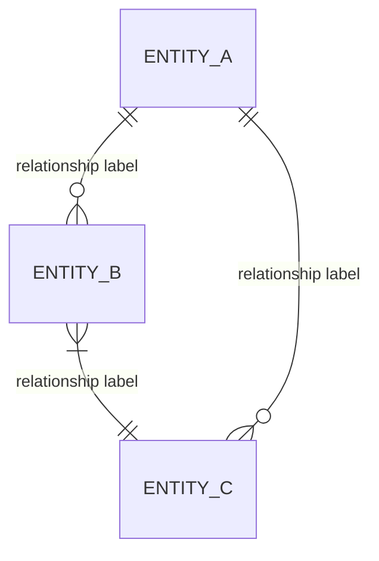

# Generate conceptual entity model from requirements

## User Input

```text
$ARGUMENTS
```

## Path Configuration

- **Projects**: `.wire` (project data and status files)

When following the workflow specification below, resolve paths as follows:
- `.wire/` in specs refers to the `.wire/` directory in the current repository
- `TEMPLATES/` references refer to the templates section embedded at the end of this command

## Tracing (opt-in, off by default)

# Tracing — Detailed, Opt-In, Step-Level Execution Trace

## Purpose

`execution_log.md` records one terse row per whole command (timestamp, command, result, a detail string capped at 120 characters). That's enough for a normal audit trail, but it can't answer "what actually happened inside that command, step by step" — which specific files it read, what it inferred, what it proposed, what a consultant decided, why. Tracing exists for engagements that want that depth: a complete, structured, append-only record of every step of every command, scoped to the release and release type it ran under.

**Off by default.** Tracing never runs unless `WIRE_TRACE=true` is set in the shell environment. If it isn't, skip this entire section — do nothing, check nothing further, proceed straight to the Workflow Specification exactly as if this section didn't exist. This is the common case and must add zero overhead.

## Where it writes

`.wire/releases/<release_folder>/trace.jsonl` — one JSON object per line (JSON Lines), append-only, alongside that release's `status.md` and `execution_log.md`.

For commands not scoped to a specific release (cross-cutting utilities with `release_types: []` in their own front-matter, or any command whose argument isn't a release folder), write to `.wire/trace.jsonl` at the engagement level instead, with `release` and `release_type` fields set to `null`.

This file is **local only** — nothing in it is ever sent anywhere, unlike the anonymous Segment telemetry event described elsewhere. It stays on the consultant's machine, inside the engagement's own repo, exactly like `execution_log.md`.

## What to log, and when

If `WIRE_TRACE=true`:

1. **Resolve context once, before anything else**: the release folder (from this command's own argument, if it has one) and `release_type` (read `.wire/releases/<release_folder>/status.md`'s `project_type` or `release_type` field). If this command has no release-folder argument, both are `null`.
2. **Emit a `command_start` event** before beginning the Workflow Specification below.
3. **As you work through the Workflow Specification's own numbered steps, emit a `step` event after completing each one** — and where a step itself has meaningfully distinct numbered sub-parts (e.g. "check location A, then location B, then infer a match, then propose it"), treat each of those as its own step event too rather than collapsing them into one. The `detail` field has no length limit and is not a summary — write what actually happened: values found, files read, decisions made and why, what was proposed and what the consultant chose. If this step involved the data model registry or any other external/optional resource, log it explicitly: whether it was reached, what was searched, what matched (or didn't, and why not), and whether/how the result was used downstream.
4. **Emit a `command_end` event** when the workflow finishes, with the same `result` value this command would write to `execution_log.md` (`complete`, `pass`, `fail`, `approved`, etc.).

## How to emit an event

Use this pattern for every event (adjust the heredoc body and the Python literals per call — this is a template, not a fixed script):

```bash
[ "${WIRE_TRACE:-false}" = "true" ] && {
  mkdir -p ".wire/releases/<release_folder>" 2>/dev/null
  cat > "/tmp/wire_trace_detail_$$.txt" << 'WIRE_TRACE_DETAIL_EOF'
<the full, untruncated detail text for this event — safe to include quotes,
newlines, code snippets, anything; this heredoc is not shell-interpreted>
WIRE_TRACE_DETAIL_EOF
  python3 -c "
import json, datetime
detail = open('/tmp/wire_trace_detail_$$.txt').read().rstrip('\n')
event = {
    'ts': datetime.datetime.utcnow().strftime('%Y-%m-%dT%H:%M:%SZ'),
    'release': '<release_folder_or_null>',
    'release_type': '<release_type_or_null>',
    'command': 'conceptual_model-generate',
    'event': '<command_start|step|command_end>',
    'step': '<step_number_or_null>',
    'step_name': '<step_heading_or_null>',
    'result': '<result_value_or_null>',
    'detail': detail,
}
with open('.wire/releases/<release_folder>/trace.jsonl', 'a') as f:
    f.write(json.dumps(event) + chr(10))
"
  rm -f "/tmp/wire_trace_detail_$$.txt"
}
```

- `<release_folder_or_null>` / `<release_type_or_null>`: from Step 1 above; write the literal JSON `null` (no quotes) if either doesn't apply, or a quoted string if it does.
- `event`: `command_start`, `step`, or `command_end`.
- `step` / `step_name`: `null` for `command_start`/`command_end`; the step's own number (e.g. `"1.5"`) and heading (e.g. `"Check for a Canonical Vertical Match"`) for a `step` event.
- `result`: `null` except on `command_end`.
- Adjust the file path in the final `open(...)` call to `.wire/trace.jsonl` for engagement-level (non-release-scoped) commands.

## Rules

1. **Never block or fail the workflow.** If a trace write fails for any reason (disk full, permissions), continue the workflow regardless — trace failures are never surfaced to the user and never stop anything.
2. **Append only** — never rewrite or delete existing lines in `trace.jsonl`.
3. **This is additive to `execution_log.md` and Telemetry, not a replacement for either.** All three continue exactly as documented elsewhere; tracing is a separate, optional, much finer-grained record for engagements that opt in.
4. **Don't summarize into brevity.** The entire point of this mechanism over `execution_log.md` is that it isn't limited to a 120-character line — write the real detail.

## Example

```json
{"ts":"2026-07-05T14:20:03Z","release":"20260705_acme","release_type":"full_platform","command":"data_model-generate","event":"command_start","step":null,"step_name":null,"result":null,"detail":"Invoked for release 20260705_acme (full_platform)"}
{"ts":"2026-07-05T14:20:11Z","release":"20260705_acme","release_type":"full_platform","command":"data_model-generate","event":"step","step":"1.5.1","step_name":"Resolve the registry location","result":null,"detail":"Checked wire/data-model-registry/ (not found — not the Wire source repo). Checked ~/.wire/data-model-registry/ (found — cloned via /wire:utils-data-model-registry-setup on 2026-07-01)."}
{"ts":"2026-07-05T14:20:19Z","release":"20260705_acme","release_type":"full_platform","command":"data_model-generate","event":"step","step":"1.5.2","step_name":"Resolve the vertical","result":null,"detail":"No confident vertical match for Acme (B2B SaaS, no dedicated saas vertical in the registry). Adjacent match found: subscription-commerce — entity shape (subscriber, subscription, subscription_event, monthly_retention, subscription_revenue) proposed as a structural analogue for Acme's MRR/NRR model."}
{"ts":"2026-07-05T14:20:34Z","release":"20260705_acme","release_type":"full_platform","command":"data_model-generate","event":"step","step":"1.5.3","step_name":"Check cross-vertical patterns","result":null,"detail":"crm_identity_resolution flagged as relevant — requirements FR-12 describes reconciling Salesforce and HubSpot contact records, a 12% mismatch rate noted in discovery. Proposed alongside the subscription-commerce adjacent match."}
{"ts":"2026-07-05T14:21:02Z","release":"20260705_acme","release_type":"full_platform","command":"data_model-generate","event":"step","step":"1.5.4","step_name":"Propose and record decision","result":null,"detail":"Presented both proposals. Consultant chose 'adapt' on subscription-commerce (kept subscriber/subscription/subscription_revenue, dropped monthly_retention as out of scope for this phase, renamed subscription_event to billing_event to match client terminology) and 'yes' on crm_identity_resolution as-is. Recorded data_model_registry.vertical: subscription-commerce and cross_vertical_schemas: [crm_identity_resolution] in .wire/engagement/context.md."}
{"ts":"2026-07-05T14:34:47Z","release":"20260705_acme","release_type":"full_platform","command":"data_model-generate","event":"step","step":"5","step_name":"Carry reference pointers forward","result":null,"detail":"account_dim mapped to subscription-commerce's subscriber entity — generation_constraints and reference_implementation pointer carried into data_model_specification.md. subscription_fct mapped to subscription entity, same treatment. contact_identity_map (new, from crm_identity_resolution) added as its own integration model with that pattern's reference_implementation pointer."}
{"ts":"2026-07-05T14:41:15Z","release":"20260705_acme","release_type":"full_platform","command":"data_model-generate","event":"command_end","step":null,"step_name":null,"result":"complete","detail":"Generated data_model_specification.md — 14 models (5 staging, 4 integration, 5 warehouse), including 2 informed by the accepted registry proposals above."}
```

## Workflow Specification

---
wire_schema: "1.0"
command: generate
artifact: conceptual_model
domain: design
release_types:
  - full_platform
  - dbt_development
  - dashboard_first
  - pipeline_only
  - dashboard_extension
  - enablement
action_type: artifact
logs_execution: true
inputs:
  required:
    - name: release_folder
      description: "Path to the release folder"
preconditions:
  - artifact: requirements
    action: review
    outcome: approved
delegates_to:
  - utils/precondition_gate
description: Generate conceptual entity model from requirements
argument-hint: <project-folder>

---

## Auto-Delegation

Follow `specs/utils/precondition_gate.md` before proceeding.

---

# Conceptual Model Generate Command

Follow `specs/utils/data_designer_delegate.md` before executing the workflow below.

## Purpose

Generate a business-level conceptual entity model showing the core domain entities, their high-level attributes, and their relationships — without implementation detail such as column names, data types, or dbt layering. This model is presented to business stakeholders for approval before pipeline architecture and detailed data modelling begins.

The conceptual model captures *what the business cares about*, not *how the database stores it*. Its primary purpose is to ensure consultant and client agree on the entity landscape before design decisions are made.

## Usage

```bash
/wire:conceptual_model-generate YYYYMMDD_project_name
```

## Prerequisites

- `requirements`: `review: approved` — the conceptual model is derived from approved requirements

## Workflow

### Step 1: Verify Prerequisites and Read Inputs

1. Read `.wire/<project_id>/status.md`
2. Check `requirements.review == approved`. If not:
   ```
   Error: Requirements must be approved before generating the conceptual model.
   Run: /wire:requirements-review <project_id>
   ```
3. Read `.wire/<project_id>/requirements/requirements_specification.md`
4. Use Glob to find all files in `.wire/<project_id>/artifacts/**/*`
5. Read any source schema examples, ERDs, domain glossaries, or data dictionaries found in `artifacts/`

### Step 2: Extract Business Entities

From the requirements specification and artifacts, identify all **business entities** — the things the business tracks, measures, or cares about. Look for:
- Nouns in functional requirements (FR-* sections)
- Data sources named in the pipeline scope
- Reporting subjects mentioned in deliverables
- Entities implied by relationships (e.g. if "a student is enrolled on a course", both `Student` and `Course` are entities)

For each entity record:
- **Name**: Singular noun, PascalCase (e.g. `Student`, `Enrolment`, `PastoralNote`, `Invoice`)
- **Description**: One sentence explaining what this entity represents in business terms
- **Key business attributes**: 3–6 high-level attributes described in business language (not column names)
- **Approximate volume**: Row count or transaction frequency if known from requirements

Group entities by domain if the project spans multiple subject areas (e.g. Academic, Finance, HR).

### Step 3: Define Relationships

For each pair of related entities, define:
- **Relationship label**: Verb phrase describing the relationship from Entity A's perspective (e.g. "enrolled in", "authors", "generates", "is subject of")
- **Cardinality**: Standard ERD notation:
  - `||--||` : exactly one to exactly one
  - `||--o{` : exactly one to zero or more
  - `}|--||` : one or more to exactly one
  - `}o--o{` : zero or more to zero or more

Flag any relationships that are ambiguous or require business clarification — add them to Section 5 (Open Questions) rather than silently resolving them.

### Step 4: Generate Conceptual Model Document

Write to `.wire/<project_id>/design/conceptual_model.md`:

```markdown
# Conceptual Entity Model: [Project Name]

**Client**: [Client Name]
**Project ID**: [Project ID]
**Generated**: [Date]
**Version**: 1.0
**Status**: Draft — awaiting business stakeholder review

## 1. Entity Inventory

### [Entity Name]
**Description**: [One sentence business description]
**Key attributes**: [attribute 1], [attribute 2], [attribute 3], [attribute 4]
**Approximate volume**: [e.g. ~4,000 students; ~500 transactions/day; updated daily]

[Repeat for each entity, grouped by domain if applicable]

## 2. Entity Relationship Diagram



**How to read this diagram**:
- `||` = exactly one
- `o{` = zero or more
- `}|` = one or more
- Labels describe the relationship from left entity's perspective

## 3. Relationship Narrative

**[Entity A] → [Entity B]** ("relationship label"): [One sentence explaining the business meaning of this relationship and why it matters to the engagement. Include any business rules that govern it.]

[Repeat for each significant relationship]

## 4. Entities Considered But Out of Scope

| Entity | Reason excluded |
|--------|----------------|
| [Entity name] | [e.g. "Out of scope per SOW Section 8.2"] |

## 5. Open Questions

| # | Question | Impact |
|---|----------|--------|
| OQ-1 | [Entity boundary or relationship that needs business clarification] | [What design decision this blocks] |

[Leave empty if no open questions]
```

### Step 5: Update Status

Read and update `.wire/<project_id>/status.md` YAML frontmatter:

```yaml
conceptual_model:
  generate: complete
  validate: not_started
  review: not_started
  file: design/conceptual_model.md
  generated_date: [today]
```

If `current_phase` is still `requirements`, update to `design`.

### Step 6: Sync to Jira (Optional)

Follow the Jira sync workflow in `specs/utils/jira_sync.md`:
- Artifact: `conceptual_model`
- Action: `generate`
- Status: the generate state just written to status.md

### Step 7: Sync to Document Store (Optional)

If a document store is configured for this project, follow the workflow in `specs/utils/docstore_sync.md`:
- `artifact_id`: `conceptual_model`
- `artifact_name`: `Conceptual Model`
- `file_path`: `.wire/releases/[release_folder]/design/conceptual_model.md`
- `project_id`: the release folder path (e.g. `releases/01-discovery`)

If docstore sync fails, log the error and continue — do not block the generate command.

### Step 8: Confirm and Suggest Next Steps

```
## Conceptual Model Generated

**File**: .wire/<project_id>/design/conceptual_model.md

**Entities identified**: [count]
**Relationships defined**: [count]
**Open questions**: [count — flag prominently if > 0]

### Next Steps

1. Validate the model:
   /wire:conceptual_model-validate <project_id>

2. After validation, review with business stakeholders:
   /wire:conceptual_model-review <project_id>

   NOTE: Review audience should include business stakeholders (not just technical
   leads) — the purpose is to confirm the entity landscape before design begins.
   Open questions must be resolved before the review can be approved.
```

## Edge Cases

### Ambiguous Entity Boundaries

If two concepts could reasonably be one entity or two (e.g. `Student` vs `Learner`; `Invoice` vs `Bill`; `Attendance` vs `AttendanceMark`):
- Use the client's own terminology from the SOW
- Document the ambiguity in Section 5 (Open Questions)
- Do not silently resolve — this is a business decision, not a technical one

### No Source Schema in Artifacts

If no schema examples are in `artifacts/`, generate entities from requirements alone and add:
```
Note: No source schema examples were found in artifacts/. Entities were derived
from requirements only. Adding source schema examples before review may reveal
additional entities or relationship corrections.
```

### Very Large Domain (20+ entities)

If the engagement spans a large domain:
1. Focus on entities that are **in scope** for this engagement
2. Show out-of-scope entities in Section 4 (greyed out in diagram if possible)
3. Consider grouping entities into subgraphs in the Mermaid diagram using `subgraph`

## Output

This command creates:
- `.wire/<project_id>/design/conceptual_model.md`
- Updates `.wire/<project_id>/status.md`

Execute the complete workflow as specified above.

## Execution Logging

After completing the workflow, append a log entry to the project's execution_log.md:

# Execution Log — Command and Skill Logging

## Purpose

After completing any generate, validate, or review workflow (or a project management command that changes state), append a single log entry to the project's execution log file. Skills also append an entry on activation, making the log a unified trace of all agent activity — both explicit commands and auto-activated skills.

## Log File Location

```
<DP_PROJECTS_PATH>/<project_folder>/execution_log.md
```

Where `<project_folder>` is the project directory passed as an argument (e.g., `20260222_acme_platform`).

## Format

If the file does not exist, create it with the header:

```markdown
# Execution Log

| Timestamp | Command | Result | Detail |
|-----------|---------|--------|--------|
```

Then append one row per execution:

```markdown
| YYYY-MM-DD HH:MM | /wire:<command> | <result> | <detail> |
```

### Field Definitions

- **Timestamp**: Current date and time in `YYYY-MM-DD HH:MM` format (24-hour, local time)
- **Command**: Either the `/wire:*` command invoked, or `skill` for a skill activation entry
- **Result / Skill name**: For commands, the outcome; for skills, the skill identifier. Use one of:
  - `complete` — generate command finished successfully
  - `pass` — validate command passed all checks
  - `fail` — validate command found failures
  - `approved` — review command: stakeholder approved
  - `changes_requested` — review command: stakeholder requested changes
  - `created` — `/wire:new` created a new project
  - `archived` — `/wire:archive` archived a project
  - `removed` — `/wire:remove` deleted a project
  - `activated` — a skill was auto-activated (used with `skill` in the Command column)
  - `override` — `specs/utils/precondition_gate.md` recorded a consultant overriding an unmet precondition
- **Detail**: A concise one-line summary of what happened. Include:
  - For generate: number of files created or key output filename
  - For validate: number of checks passed/failed
  - For review: reviewer name and brief feedback if changes requested
  - For new: project type and client name
  - For archive/remove: project name
  - For skill activations: brief description of what triggered the skill
  - For override: the unmet precondition, who overrode it, and their reason

## Skill Activation Entries

When a skill activates, it appends a row in the same format as commands, using `skill` in the Command column and the skill identifier in the Result column:

```markdown
| YYYY-MM-DD HH:MM | skill | <skill-identifier> | activated | <brief trigger description> |
```

Skill identifiers:

| Skill | Identifier |
|-------|-----------|
| Engagement Context | `engagement-context` |
| Research Persistence | `research-persistence` |
| dbt Development | `dbt-development` |
| LookML Content Authoring | `lookml-authoring` |
| dbt Analytics QA | `dbt-analytics-qa` |
| dbt Migration | `dbt-migration` |
| dbt Troubleshooting | `dbt-troubleshooting` |
| dbt Semantic Layer | `dbt-semantic-layer` |
| dbt Unit Testing | `dbt-unit-testing` |
| dbt DAG | `dbt-dag` |
| Dagster | `dagster` |
| Fivetran | `fivetran` |
| Project Review | `project-review` |
| Looker Dashboard Mockup | `looker-dashboard-mockup` |

This makes skill activations visible in the same log that captures command invocations, enabling full activity tracing across both explicit commands and automatic skill triggers.

## Rules

1. **Append only** — never modify or delete existing log entries
2. **One row per command execution** — even if a command is re-run, add a new row (this creates the revision history)
3. **Always log after status.md is updated** — the log entry should reflect the final state
4. **Pipe characters in detail** — if the detail text contains `|`, replace with `—` to preserve table formatting
5. **Keep detail under 120 characters** — be concise

## Example

```markdown
# Execution Log

| Timestamp | Command | Result | Detail |
|-----------|---------|--------|--------|
| 2026-02-22 14:30 | skill | engagement-context | activated | Context loaded for new conversation |
| 2026-02-22 14:35 | /wire:new | created | Project created (type: full_platform, client: Acme Corp) |
| 2026-02-22 14:40 | /wire:requirements-generate | complete | Generated requirements specification (3 files) |
| 2026-02-22 15:12 | /wire:requirements-validate | pass | 14 checks passed, 0 failed |
| 2026-02-22 16:00 | /wire:requirements-review | approved | Reviewed by Jane Smith |
| 2026-02-23 09:15 | /wire:conceptual_model-generate | complete | Generated entity model with 8 entities |
| 2026-02-23 10:30 | /wire:conceptual_model-validate | fail | 2 issues: missing relationship, orphaned entity |
| 2026-02-23 11:00 | /wire:conceptual_model-generate | complete | Regenerated entity model (fixed 2 issues, 8 entities) |
| 2026-02-23 11:15 | /wire:conceptual_model-validate | pass | 12 checks passed, 0 failed |
| 2026-02-23 14:00 | /wire:conceptual_model-review | changes_requested | Reviewed by John Doe — add Customer entity |
| 2026-02-23 15:30 | /wire:conceptual_model-generate | complete | Regenerated entity model (9 entities, added Customer) |
| 2026-02-23 15:45 | /wire:conceptual_model-validate | pass | 14 checks passed, 0 failed |
| 2026-02-23 16:00 | /wire:conceptual_model-review | approved | Reviewed by John Doe |
| 2026-02-24 09:05 | /wire:migration-strategy-generate | override | migration_inventory.review required approved, was not_started — overridden by Jane Smith: client demo tomorrow, inventory sign-off deferred to Monday |
```
