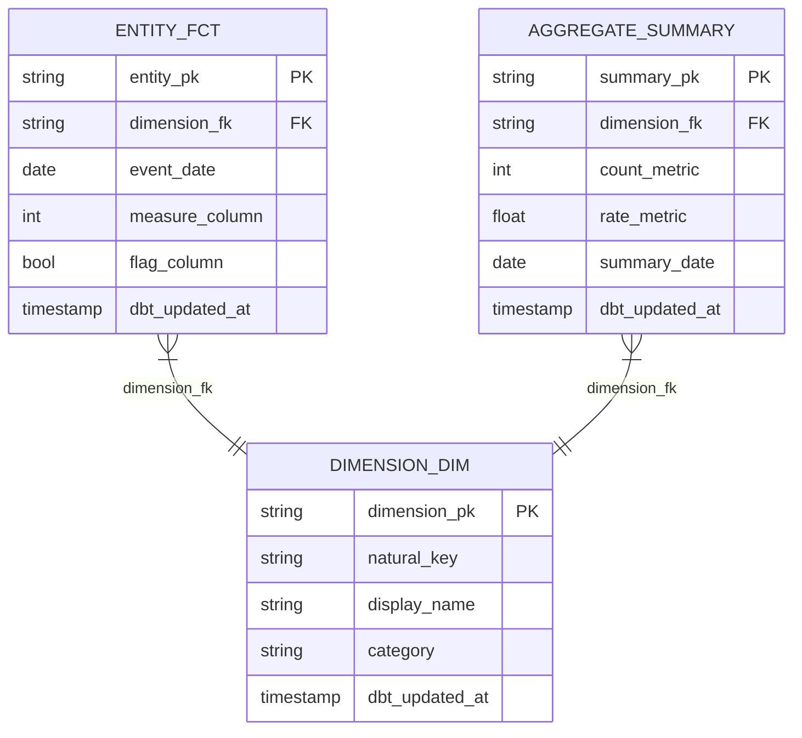

# Design dbt model structure

## User Input

```text
$ARGUMENTS
```

## Path Configuration

- **Projects**: `.wire` (project data and status files)

When following the workflow specification below, resolve paths as follows:
- `.wire/` in specs refers to the `.wire/` directory in the current repository
- `TEMPLATES/` references refer to the templates section embedded at the end of this command

## Tracing (opt-in, off by default)

# Tracing — Detailed, Opt-In, Step-Level Execution Trace

## Purpose

`execution_log.md` records one terse row per whole command (timestamp, command, result, a detail string capped at 120 characters). That's enough for a normal audit trail, but it can't answer "what actually happened inside that command, step by step" — which specific files it read, what it inferred, what it proposed, what a consultant decided, why. Tracing exists for engagements that want that depth: a complete, structured, append-only record of every step of every command, scoped to the release and release type it ran under.

**Off by default.** Tracing never runs unless `WIRE_TRACE=true` is set in the shell environment. If it isn't, skip this entire section — do nothing, check nothing further, proceed straight to the Workflow Specification exactly as if this section didn't exist. This is the common case and must add zero overhead.

## Where it writes

`.wire/releases/<release_folder>/trace.jsonl` — one JSON object per line (JSON Lines), append-only, alongside that release's `status.md` and `execution_log.md`.

For commands not scoped to a specific release (cross-cutting utilities with `release_types: []` in their own front-matter, or any command whose argument isn't a release folder), write to `.wire/trace.jsonl` at the engagement level instead, with `release` and `release_type` fields set to `null`.

This file is **local only** — nothing in it is ever sent anywhere, unlike the anonymous Segment telemetry event described elsewhere. It stays on the consultant's machine, inside the engagement's own repo, exactly like `execution_log.md`.

## What to log, and when

If `WIRE_TRACE=true`:

1. **Resolve context once, before anything else**: the release folder (from this command's own argument, if it has one) and `release_type` (read `.wire/releases/<release_folder>/status.md`'s `project_type` or `release_type` field). If this command has no release-folder argument, both are `null`.
2. **Emit a `command_start` event** before beginning the Workflow Specification below.
3. **As you work through the Workflow Specification's own numbered steps, emit a `step` event after completing each one** — and where a step itself has meaningfully distinct numbered sub-parts (e.g. "check location A, then location B, then infer a match, then propose it"), treat each of those as its own step event too rather than collapsing them into one. The `detail` field has no length limit and is not a summary — write what actually happened: values found, files read, decisions made and why, what was proposed and what the consultant chose. If this step involved the data model registry or any other external/optional resource, log it explicitly: whether it was reached, what was searched, what matched (or didn't, and why not), and whether/how the result was used downstream.
4. **Emit a `command_end` event** when the workflow finishes, with the same `result` value this command would write to `execution_log.md` (`complete`, `pass`, `fail`, `approved`, etc.).

## How to emit an event

Use this pattern for every event (adjust the heredoc body and the Python literals per call — this is a template, not a fixed script):

```bash
[ "${WIRE_TRACE:-false}" = "true" ] && {
  mkdir -p ".wire/releases/<release_folder>" 2>/dev/null
  cat > "/tmp/wire_trace_detail_$$.txt" << 'WIRE_TRACE_DETAIL_EOF'
<the full, untruncated detail text for this event — safe to include quotes,
newlines, code snippets, anything; this heredoc is not shell-interpreted>
WIRE_TRACE_DETAIL_EOF
  python3 -c "
import json, datetime
detail = open('/tmp/wire_trace_detail_$$.txt').read().rstrip('\n')
event = {
    'ts': datetime.datetime.utcnow().strftime('%Y-%m-%dT%H:%M:%SZ'),
    'release': '<release_folder_or_null>',
    'release_type': '<release_type_or_null>',
    'command': 'data_model-generate',
    'event': '<command_start|step|command_end>',
    'step': '<step_number_or_null>',
    'step_name': '<step_heading_or_null>',
    'result': '<result_value_or_null>',
    'detail': detail,
}
with open('.wire/releases/<release_folder>/trace.jsonl', 'a') as f:
    f.write(json.dumps(event) + chr(10))
"
  rm -f "/tmp/wire_trace_detail_$$.txt"
}
```

- `<release_folder_or_null>` / `<release_type_or_null>`: from Step 1 above; write the literal JSON `null` (no quotes) if either doesn't apply, or a quoted string if it does.
- `event`: `command_start`, `step`, or `command_end`.
- `step` / `step_name`: `null` for `command_start`/`command_end`; the step's own number (e.g. `"1.5"`) and heading (e.g. `"Check for a Canonical Vertical Match"`) for a `step` event.
- `result`: `null` except on `command_end`.
- Adjust the file path in the final `open(...)` call to `.wire/trace.jsonl` for engagement-level (non-release-scoped) commands.

## Rules

1. **Never block or fail the workflow.** If a trace write fails for any reason (disk full, permissions), continue the workflow regardless — trace failures are never surfaced to the user and never stop anything.
2. **Append only** — never rewrite or delete existing lines in `trace.jsonl`.
3. **This is additive to `execution_log.md` and Telemetry, not a replacement for either.** All three continue exactly as documented elsewhere; tracing is a separate, optional, much finer-grained record for engagements that opt in.
4. **Don't summarize into brevity.** The entire point of this mechanism over `execution_log.md` is that it isn't limited to a 120-character line — write the real detail.

## Example

```json
{"ts":"2026-07-05T14:20:03Z","release":"20260705_acme","release_type":"full_platform","command":"data_model-generate","event":"command_start","step":null,"step_name":null,"result":null,"detail":"Invoked for release 20260705_acme (full_platform)"}
{"ts":"2026-07-05T14:20:11Z","release":"20260705_acme","release_type":"full_platform","command":"data_model-generate","event":"step","step":"1.5.1","step_name":"Resolve the registry location","result":null,"detail":"Checked wire/data-model-registry/ (not found — not the Wire source repo). Checked ~/.wire/data-model-registry/ (found — cloned via /wire:utils-data-model-registry-setup on 2026-07-01)."}
{"ts":"2026-07-05T14:20:19Z","release":"20260705_acme","release_type":"full_platform","command":"data_model-generate","event":"step","step":"1.5.2","step_name":"Resolve the vertical","result":null,"detail":"No confident vertical match for Acme (B2B SaaS, no dedicated saas vertical in the registry). Adjacent match found: subscription-commerce — entity shape (subscriber, subscription, subscription_event, monthly_retention, subscription_revenue) proposed as a structural analogue for Acme's MRR/NRR model."}
{"ts":"2026-07-05T14:20:34Z","release":"20260705_acme","release_type":"full_platform","command":"data_model-generate","event":"step","step":"1.5.3","step_name":"Check cross-vertical patterns","result":null,"detail":"crm_identity_resolution flagged as relevant — requirements FR-12 describes reconciling Salesforce and HubSpot contact records, a 12% mismatch rate noted in discovery. Proposed alongside the subscription-commerce adjacent match."}
{"ts":"2026-07-05T14:21:02Z","release":"20260705_acme","release_type":"full_platform","command":"data_model-generate","event":"step","step":"1.5.4","step_name":"Propose and record decision","result":null,"detail":"Presented both proposals. Consultant chose 'adapt' on subscription-commerce (kept subscriber/subscription/subscription_revenue, dropped monthly_retention as out of scope for this phase, renamed subscription_event to billing_event to match client terminology) and 'yes' on crm_identity_resolution as-is. Recorded data_model_registry.vertical: subscription-commerce and cross_vertical_schemas: [crm_identity_resolution] in .wire/engagement/context.md."}
{"ts":"2026-07-05T14:34:47Z","release":"20260705_acme","release_type":"full_platform","command":"data_model-generate","event":"step","step":"5","step_name":"Carry reference pointers forward","result":null,"detail":"account_dim mapped to subscription-commerce's subscriber entity — generation_constraints and reference_implementation pointer carried into data_model_specification.md. subscription_fct mapped to subscription entity, same treatment. contact_identity_map (new, from crm_identity_resolution) added as its own integration model with that pattern's reference_implementation pointer."}
{"ts":"2026-07-05T14:41:15Z","release":"20260705_acme","release_type":"full_platform","command":"data_model-generate","event":"command_end","step":null,"step_name":null,"result":"complete","detail":"Generated data_model_specification.md — 14 models (5 staging, 4 integration, 5 warehouse), including 2 informed by the accepted registry proposals above."}
```

## Workflow Specification

---
wire_schema: "1.0"
command: generate
artifact: data_model
domain: design
release_types:
  - full_platform
  - dbt_development
  - dashboard_first
  - pipeline_only
  - dashboard_extension
  - enablement
action_type: artifact
logs_execution: true
inputs:
  required:
    - name: release_folder
      description: "Path to the release folder"
preconditions: dynamic
delegates_to:
  - utils/precondition_gate
description: Generate dbt data model specification and physical ERD
argument-hint: <project-folder>

---

## Auto-Delegation

Follow `specs/utils/precondition_gate.md` before proceeding.

---

# Data Model Generate Command

Follow `specs/utils/data_designer_delegate.md` before executing the workflow below.

## Purpose

Generate the full dbt-layer data model specification — covering staging, integration, and warehouse layers — together with a **Physical Entity-Relationship Diagram (ERD)** as a Mermaid erDiagram showing every model with its columns, primary keys, foreign keys, and relationships. This is the primary input for dbt code generation.

The data model specification narrows the LLM's generation space for the dbt phase: every model name, column name, join path, surrogate key composition, and test definition is determined here, not during code generation.

## Usage

```bash
/wire:data_model-generate YYYYMMDD_project_name
```

## Prerequisites

**Default** (all project types except `dashboard_first`):
- `requirements`: `review: approved`
- `conceptual_model`: `review: approved` — provides the entity framework
- `pipeline_design`: `review: approved` — provides source table names and replication details

**Dashboard-first** (`dashboard_first` project type):
- `requirements`: `review: approved`
- `viz_catalog`: `generate: complete` — provides the measures, dimensions, and dashboard structure

## Workflow

### Step 1: Verify Prerequisites and Read Inputs

1. Read `.wire/<project_id>/status.md`
2. Read `project_type` from frontmatter
3. **If `dashboard_first`**:
   - Verify `requirements.review` is `approved` and `viz_catalog.generate` is `complete`
   - Read the following in order:
     - `requirements/requirements_specification.md`
     - `design/visualization_catalog.md` (measures, dimensions, dashboard structure)
     - `design/dashboard_spec.md` (dashboard purpose and layout)
   - Also read `artifacts/` for SOW and domain context
4. **Otherwise (default)**:
   - Verify all three default prerequisites are met. For each that is not:
     ```
     Error: [artifact] must be approved before data model generation.
     Run: /wire:[artifact]:review <project_id>
     ```
   - Read the following in order:
     - `requirements/requirements_specification.md`
     - `design/conceptual_model.md` (entities, relationships)
     - `design/pipeline_architecture.md` (source tables, staging model names)
4. Use Glob to find all files in `.wire/<project_id>/artifacts/**/*`
5. Read any source schema examples, existing dbt models, or SQL files in `artifacts/`

### Step 1.5: Check for a Canonical Vertical Match (Automatic, Advisory)

This step runs automatically on every engagement — there's no opt-in flag to set. It has three possible outcomes: a proposal to the practitioner, a silent skip, or (if declined) no effect on anything downstream. It can never fail the command and never blocks Step 2.

1. **Resolve the registry location, dev mode first:**
   - Check for `wire/data-model-registry/` in the repo root (present only when developing Wire itself, from `wire/scripts/sync-data-model-registry.sh`).
   - If not found, check `~/.wire/data-model-registry/` (present only if this consultant has personally run `/wire:utils-data-model-registry-setup` and has access to the private `wire-data-model-registry` repo).
   - If neither exists, **skip silently to Step 2** — no message, no note in the output spec. Most engagements and most consultants will land here; this is expected, not a degraded path.

2. **Resolve the vertical, in two tiers — don't stop at "no exact match":**
   - Read `.wire/engagement/context.md`. If `data_model_registry.vertical` is already set to a non-null value (a consultant can set this by hand at any time), use it directly as a **confident match** and skip to Step 3.
   - Otherwise, list `<registry_root>/verticals/` to see what's actually there right now — **do not assume a fixed set of names**. The registry evolves independently of this spec and of Wire's own release cycle; it started with six verticals, has since had more added, and will likely keep growing. Treat whatever's in that directory at the moment this command runs as the real, current list, and read each one's own schema descriptions to judge fit rather than string-matching the industry name:
     - **Confident match**: the client's actual business is recognizably an instance of one of the verticals actually present — e.g. a retail e-commerce client against `retail`, or a B2B SaaS client against a `saas` vertical, if one exists in the registry at the time.
     - **Adjacent match**: no vertical currently in the registry is a confident fit, but one vertical's entity *shape* is still structurally close to what this client needs, even though that vertical was built from a different kind of business. A gap like "no vertical for this specific industry yet" is not a reason to propose nothing — e.g. if no vertical matches a B2B SaaS client confidently, `subscription-commerce`'s subscriber/subscription/subscription_event/monthly_retention/subscription_revenue entities may still be a structurally close analogue for an MRR/NRR model, even though that vertical's content was built from a different kind of subscription business. Propose an adjacent match explicitly labeled as approximate — don't silently withhold it just because it isn't a clean industry match.
   - If neither a confident nor an adjacent vertical exists, proceed to Step 3 with no vertical candidate at all — this remains a normal, common outcome, not a failure.

3. **Independently check cross-vertical patterns — this runs regardless of what Step 2 found.** Cross-vertical relevance is not conditional on having a vertical match; a client can need `crm_identity_resolution` (reconciling contacts/accounts across a CRM and marketing automation tool — a routine problem for any B2B business, `saas` vertical or not) whether or not any vertical matched at all.
   - Read `<registry_root>/cross-vertical/schemas/*.yml` and check each one against this client's actual sources, entities, and requirements — e.g. `crm_identity_resolution` for multi-system contact/account reconciliation, `ga4_ecommerce` if the client uses GA4, `multi_touch_attribution` for paid media across channels, `revenue_recognition` if ASC 606-style deferred revenue is in scope. Respect each schema's `depends_on_schemas` field for sequencing (e.g. `ga4_ecommerce` depends on `event_tracking_and_sessionization`).
   - If Step 2 found nothing and this step finds nothing either, **skip silently to Step 2 of the main workflow** (Define Source Definitions) — no message, no note. This remains the majority-case, expected outcome for most engagements.

4. **Propose whatever was found, tiered by confidence — never auto-adopt:**
   - **Confident vertical match**: present as a strong proposal:
     ```
     Wire found a canonical data model that may fit this engagement: [vertical] — [schema_name].
     Standard marts: [list from standard_marts]
     Entities: [list]

     Use this as the starting structure for the data model? (yes / adapt / no)
     ```
   - **Adjacent vertical match only**: present with the mismatch stated plainly, not hidden:
     ```
     No vertical in the registry is an exact industry match for [client's actual industry] — there's no
     [inferred missing vertical, e.g. "saas"] vertical yet. The closest available entity shape is
     [vertical] — built from [what that vertical's content actually covers], not [client's industry].
     Entities: [list]

     This may still be a reasonable starting point for [specific reason, e.g. "the MRR/NRR model"].
     Worth using loosely, or skip entirely? (yes / adapt / no)
     ```
   - **Cross-vertical pattern(s)** found in Step 3 — present alongside whichever vertical proposal exists above, or on their own if no vertical proposal exists at all:
     ```
     Also relevant regardless of industry fit: [cross-vertical schema name] — [one-line reason
     specific to this client's actual requirements/sources].
     Include this pattern too? (yes / adapt / no)
     ```
   - **yes** (any of the above) — use the proposed entity list, grain, and naming as a baseline for Steps 2–7, adjusted for this client's actual source systems and column names. For a vertical match (confident or adjacent), record `data_model_registry.vertical: <vertical>` in `.wire/engagement/context.md` if not already set. For accepted cross-vertical patterns, record them in `data_model_registry.cross_vertical_schemas: [<schema_name>, ...]` (append, don't overwrite).
   - **adapt** — ask which specific entities/marts to keep, drop, or rename; use the rest as-is. Record as above.
   - **no** — proceed with Step 2 onward exactly as if that specific match were never proposed. Do not write it to context.md — an explicit decline should not get treated as a manual override on the next run. Worth a one-line note in the spec that a match existed but wasn't used (useful signal for the registry's own maintainers), but no other effect. Each proposal (vertical, cross-vertical) is decided independently — declining one doesn't decline the other.

5. For every model in the final data model that maps to a canonical entity (whether from a confident match, an adjacent match, or an accepted cross-vertical pattern, adopted as-is or adapted), carry that entity's `generation_constraints` and `reference_implementation` pointer(s) forward into that model's spec entry in Step 5 (or Step 3 for staging). This is the only place the registry's worked-example SQL becomes reachable — `dbt-generate` reads `data_model_specification.md` as its primary input either way, so it inherits these pointers automatically; no changes to `dbt-generate` itself are needed. Treat `reference_implementation` strictly as a worked example to read and adapt, never to copy verbatim — the registry's own README is explicit that a specific `.sql` file is not reusable across clients, only the pattern it demonstrates is.

### Step 2: Define Source Definitions

For each source system in the pipeline design, produce a complete dbt `_sources.yml` specification:

```yaml
version: 2

sources:
  - name: <source_system>
    database: <bigquery_project>
    schema: <dataset_name>
    freshness:
      warn_after: {count: <N>, period: hour}
      error_after: {count: <N>, period: hour}
    tables:
      - name: <table_name>
        description: "<Table description>"
        loaded_at_field: <timestamp_column>
        columns:
          - name: <column_name>
            description: "<Column description>"
            tests:
              - not_null
              - unique   # only on PK columns
```

Freshness thresholds must be calibrated to the replication cadence from the pipeline design:
- Real-time / CDC sources: `warn_after: 30 minutes`, `error_after: 60 minutes`
- Daily batch sources: `warn_after: 25 hours`, `error_after: 49 hours`
- Manual/on-demand: no freshness check

Note any columns that are excluded for data governance reasons (e.g. free-text fields excluded for safeguarding). Document exclusions explicitly.

### Step 3: Define Staging Models

For each source table, define the staging model:

**Naming**: `stg_<source_system>__<entity_name>` (double underscore between source and entity)

**Materialisation**: `view`

**Tags**: `['staging', '<source_system>']`

For each staging model, specify:
- **Grain**: One row per what? (e.g. "one row per daily attendance mark per student per session")
- **Surrogate key**: `dbt_utils.generate_surrogate_key(['<id_columns>'])` → `<entity>_pk`
- **Column renames**: Source column name → standard column name (snake_case, business-meaningful)
- **Derived columns**: Any simple transformations applied at staging (e.g. `is_present = mark_code IN ('/', 'L')`)
- **Exclusions**: Any source columns excluded and why
- **Filters**: Any `WHERE` clause applied (e.g. `WHERE _fivetran_deleted = false`)
- **Tests**: `not_null` and `unique` on `<entity>_pk`; `not_null` on any non-nullable business keys

Use this template format:

```
### stg_<source>__<entity>
**Source**: `<source_system>.<table_name>`
**Grain**: One row per [description]
**Surrogate key**: `generate_surrogate_key(['<col1>', '<col2>'])` → `<entity>_pk`

| Source column | Staged column | Type | Notes |
|--------------|---------------|------|-------|
| <SourceCol> | <staged_name> | string/date/int/bool | |
| <SourceCol> | <staged_name> | timestamp | Renamed from Fivetran audit column |

**Derived columns**:
- `<derived_col>`: `<expression>`

**Filters**: `WHERE <condition>`

**Tests**: `not_null(entity_pk)`, `unique(entity_pk)`, `not_null(<business_key>)`

**Canonical entity** (only if sourced from the data model registry per Step 1.5): `<vertical>/<entity>` — constraints: [`generation_constraints` from the entity YAML] — reference: [`reference_implementation` path(s)]
```

### Step 4: Define Integration Models (if applicable)

For complex transformations that span multiple staging models but are not yet warehouse-level:

**Naming**: `int__<subject>__<description>` (e.g. `int__student__risk_signals`)

**Materialisation**: `view` (or `ephemeral` for simple pass-throughs)

Use integration models for:
- Cross-system joins (e.g. joining ProSolution student IDs to Focus student IDs)
- Business logic that derives flags or categorisations
- Pre-aggregations that feed multiple warehouse models

### Step 5: Define Warehouse Models

For each fact table, dimension table, and aggregate:

**Fact table naming**: `<entity>_fct` (e.g. `attendance_fct`, `pastoral_notes_fct`)
**Dimension table naming**: `<entity>_dim` (e.g. `student_dim`, `course_dim`)
**Aggregate naming**: `<subject>_<grain>` (e.g. `student_risk_summary`, `daily_attendance_summary`)

**Materialisation**: `table`

**Tags**: `['warehouse', 'fact']` or `['warehouse', 'dimension']`

For each warehouse model specify:
- **Grain**: One row per what?
- **Surrogate key**: composition and name (e.g. `attendance_pk`)
- **Foreign keys**: which dimension PKs are referenced (e.g. `student_fk → student_dim.student_pk`)
- **Measures**: numeric columns with business descriptions
- **Flags/indicators**: boolean derived columns with their logic
- **Audit columns**: `dbt_updated_at: current_timestamp()`
- **Canonical entity** (only if sourced from the data model registry per Step 1.5): `<vertical>/<entity>` — constraints: [`generation_constraints` from the entity YAML] — reference: [`reference_implementation` path(s)]

### Step 6: Define Seed Files

For any configurable business logic (thresholds, mappings, categorisations), specify seed files:

```
### seeds/<seed_name>.csv
**Purpose**: [What business rule this encodes]
**Columns**: [column names and types]
**Sample rows**: [3-5 representative rows]
**Used by**: [which models reference this seed]
```

Common seed patterns:
- Mark type mappings (e.g. attendance mark codes → present/absent/late)
- Risk score thresholds
- Category hierarchies
- Grade orderings

### Step 7: Generate Physical ERD

Produce a Mermaid `erDiagram` showing every warehouse model (and key staging models) with their columns, data types, primary keys, and foreign key relationships. Write this as a `## Physical Data Model` section within the data model specification document.

Use this template:

```
## Physical Data Model


```

**ERD conventions**:
- Include all warehouse models (facts, dims, aggregates)
- Include staging models only if they are directly referenced by semantic layer (unusual)
- Mark surrogate keys as `PK`, foreign keys as `FK`
- Use types: `string`, `int`, `float`, `bool`, `date`, `timestamp`
- All relationship lines must correspond to a FK → PK join defined in the model specs above
- Relationship label = the FK column name

### Step 8: Write Data Model Specification Document

Write to `.wire/<project_id>/design/data_model_specification.md`:

```markdown
# Data Model Specification: [Project Name]

**Client**: [Client Name]
**Project ID**: [Project ID]
**Generated**: [Date]
**Version**: 1.0

## 1. Source Definitions
[_sources.yml content for each source system]

## 2. Staging Models
[Per-model spec as defined in Step 3]

## 3. Integration Models
[Per-model spec as defined in Step 4, or "Not applicable"]

## 4. Warehouse Models
[Per-model spec as defined in Step 5]

## 5. Seed Files
[Per-seed spec as defined in Step 6, or "Not applicable"]

## 6. Cross-System Join Keys
[Table mapping natural keys across source systems, e.g.:]
| Left model | Column | Right model | Column | Notes |
|-----------|--------|------------|--------|-------|
| stg_focus__notes | enrolment_id | stg_prosolution__attendance | EnrolmentID | Case-sensitive match |

## 7. Physical Data Model

[Mermaid ERD as generated in Step 7]

## 8. dbt Test Coverage Plan
[Summary table: model → PK test → FK tests → custom tests]
```

### Step 9: Update Status

```yaml
data_model:
  generate: complete
  validate: not_started
  review: not_started
  file: design/data_model_specification.md
  generated_date: [today]
```

### Step 10: Sync to Jira (Optional)

Follow the Jira sync workflow in `specs/utils/jira_sync.md`:
- Artifact: `data_model`
- Action: `generate`
- Status: the generate state just written to status.md

### Step 11: Sync to Document Store (Optional)

If a document store is configured for this project, follow the workflow in `specs/utils/docstore_sync.md`:
- `artifact_id`: `data_model`
- `artifact_name`: `Data Model`
- `file_path`: `.wire/releases/[release_folder]/design/data_model.md`
- `project_id`: the release folder path (e.g. `releases/01-discovery`)

If docstore sync fails, log the error and continue — do not block the generate command.

### Step 12: Confirm and Suggest Next Steps

```
## Data Model Specification Generated

**File**: .wire/<project_id>/design/data_model_specification.md

**Staging models**: [count]
**Integration models**: [count]
**Warehouse models**: [count] ([fact count] facts, [dim count] dims, [agg count] aggregates)
**Seed files**: [count]
**Physical ERD**: included ([entity count] entities, [relationship count] relationships)
**Cross-system joins**: [count — flag if > 0, these are high-risk]
**Canonical vertical**: [vertical name and schema(s) used, or "None — no canonical match found or proposal declined" if Step 1.5 skipped or was declined]

### Next Steps

1. Validate the data model:
   /wire:data_model-validate <project_id>

2. After validation, review with analytics engineering lead:
   /wire:data_model-review <project_id>

NOTE: This is the most consequential review gate. Approving a model with
incorrect grain, wrong join keys, or missing entities is expensive to fix
after dbt code has been generated. Take time with this review.
```

## Edge Cases

### Source Column Names Unknown

If source schema examples are not in `artifacts/`, specify staging model columns at entity-attribute level from the conceptual model, and add:
```
NOTE: Column names are provisional — based on conceptual model attributes.
Actual source column names must be confirmed before dbt:generate.
Add source schema examples to artifacts/ and regenerate.
```

### Extending an Existing dbt Project

If the client has an existing dbt project:
1. Read existing staging models from `artifacts/` to understand current naming conventions
2. Follow those conventions for new models
3. Explicitly note which existing models are being extended vs which are net-new
4. Do not rename or restructure existing models — only add

### Complex Many-to-Many Relationships

If the conceptual model contains a many-to-many relationship, resolve it in the data model:
- Create a bridge/junction table (e.g. `student_course_bridge`)
- Name it clearly and document the resolution in Section 6

## Additional Output for `dashboard_first` Projects

When `project_type` is `dashboard_first`, additionally generate:

1. **`design/source_tables_ddl.sql`** — SQL DDL (CREATE TABLE statements) defining the expected source data schema, derived from the requirements, visualization catalog, and domain knowledge. Use the target warehouse dialect (e.g., BigQuery).

2. **`design/target_warehouse_ddl.sql`** — SQL DDL defining the target dimensional model (facts and dimensions) that will provide the measures and dimensions identified in the visualization catalog.

These DDL files serve as inputs for seed data generation (`/wire:seed_data-generate`) and the dbt project structure.

## Output

This command creates:
- `.wire/<project_id>/design/data_model_specification.md` (includes physical ERD)
- `.wire/<project_id>/design/source_tables_ddl.sql` (dashboard_first projects only)
- `.wire/<project_id>/design/target_warehouse_ddl.sql` (dashboard_first projects only)
- Updates `.wire/<project_id>/status.md`

Execute the complete workflow as specified above.

## Execution Logging

After completing the workflow, append a log entry to the project's execution_log.md:

# Execution Log — Command and Skill Logging

## Purpose

After completing any generate, validate, or review workflow (or a project management command that changes state), append a single log entry to the project's execution log file. Skills also append an entry on activation, making the log a unified trace of all agent activity — both explicit commands and auto-activated skills.

## Log File Location

```
<DP_PROJECTS_PATH>/<project_folder>/execution_log.md
```

Where `<project_folder>` is the project directory passed as an argument (e.g., `20260222_acme_platform`).

## Format

If the file does not exist, create it with the header:

```markdown
# Execution Log

| Timestamp | Command | Result | Detail |
|-----------|---------|--------|--------|
```

Then append one row per execution:

```markdown
| YYYY-MM-DD HH:MM | /wire:<command> | <result> | <detail> |
```

### Field Definitions

- **Timestamp**: Current date and time in `YYYY-MM-DD HH:MM` format (24-hour, local time)
- **Command**: Either the `/wire:*` command invoked, or `skill` for a skill activation entry
- **Result / Skill name**: For commands, the outcome; for skills, the skill identifier. Use one of:
  - `complete` — generate command finished successfully
  - `pass` — validate command passed all checks
  - `fail` — validate command found failures
  - `approved` — review command: stakeholder approved
  - `changes_requested` — review command: stakeholder requested changes
  - `created` — `/wire:new` created a new project
  - `archived` — `/wire:archive` archived a project
  - `removed` — `/wire:remove` deleted a project
  - `activated` — a skill was auto-activated (used with `skill` in the Command column)
  - `override` — `specs/utils/precondition_gate.md` recorded a consultant overriding an unmet precondition
- **Detail**: A concise one-line summary of what happened. Include:
  - For generate: number of files created or key output filename
  - For validate: number of checks passed/failed
  - For review: reviewer name and brief feedback if changes requested
  - For new: project type and client name
  - For archive/remove: project name
  - For skill activations: brief description of what triggered the skill
  - For override: the unmet precondition, who overrode it, and their reason

## Skill Activation Entries

When a skill activates, it appends a row in the same format as commands, using `skill` in the Command column and the skill identifier in the Result column:

```markdown
| YYYY-MM-DD HH:MM | skill | <skill-identifier> | activated | <brief trigger description> |
```

Skill identifiers:

| Skill | Identifier |
|-------|-----------|
| Engagement Context | `engagement-context` |
| Research Persistence | `research-persistence` |
| dbt Development | `dbt-development` |
| LookML Content Authoring | `lookml-authoring` |
| dbt Analytics QA | `dbt-analytics-qa` |
| dbt Migration | `dbt-migration` |
| dbt Troubleshooting | `dbt-troubleshooting` |
| dbt Semantic Layer | `dbt-semantic-layer` |
| dbt Unit Testing | `dbt-unit-testing` |
| dbt DAG | `dbt-dag` |
| Dagster | `dagster` |
| Fivetran | `fivetran` |
| Project Review | `project-review` |
| Looker Dashboard Mockup | `looker-dashboard-mockup` |

This makes skill activations visible in the same log that captures command invocations, enabling full activity tracing across both explicit commands and automatic skill triggers.

## Rules

1. **Append only** — never modify or delete existing log entries
2. **One row per command execution** — even if a command is re-run, add a new row (this creates the revision history)
3. **Always log after status.md is updated** — the log entry should reflect the final state
4. **Pipe characters in detail** — if the detail text contains `|`, replace with `—` to preserve table formatting
5. **Keep detail under 120 characters** — be concise

## Example

```markdown
# Execution Log

| Timestamp | Command | Result | Detail |
|-----------|---------|--------|--------|
| 2026-02-22 14:30 | skill | engagement-context | activated | Context loaded for new conversation |
| 2026-02-22 14:35 | /wire:new | created | Project created (type: full_platform, client: Acme Corp) |
| 2026-02-22 14:40 | /wire:requirements-generate | complete | Generated requirements specification (3 files) |
| 2026-02-22 15:12 | /wire:requirements-validate | pass | 14 checks passed, 0 failed |
| 2026-02-22 16:00 | /wire:requirements-review | approved | Reviewed by Jane Smith |
| 2026-02-23 09:15 | /wire:conceptual_model-generate | complete | Generated entity model with 8 entities |
| 2026-02-23 10:30 | /wire:conceptual_model-validate | fail | 2 issues: missing relationship, orphaned entity |
| 2026-02-23 11:00 | /wire:conceptual_model-generate | complete | Regenerated entity model (fixed 2 issues, 8 entities) |
| 2026-02-23 11:15 | /wire:conceptual_model-validate | pass | 12 checks passed, 0 failed |
| 2026-02-23 14:00 | /wire:conceptual_model-review | changes_requested | Reviewed by John Doe — add Customer entity |
| 2026-02-23 15:30 | /wire:conceptual_model-generate | complete | Regenerated entity model (9 entities, added Customer) |
| 2026-02-23 15:45 | /wire:conceptual_model-validate | pass | 14 checks passed, 0 failed |
| 2026-02-23 16:00 | /wire:conceptual_model-review | approved | Reviewed by John Doe |
| 2026-02-24 09:05 | /wire:migration-strategy-generate | override | migration_inventory.review required approved, was not_started — overridden by Jane Smith: client demo tomorrow, inventory sign-off deferred to Monday |
```
