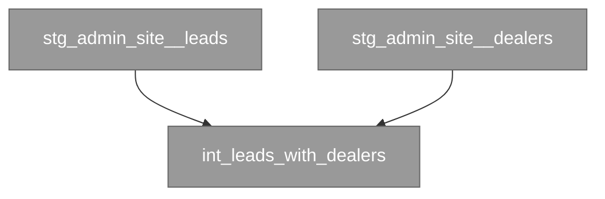

# Generate platform-pair translation guide, phasing, rollback, equivalency criteria

## User Input

```text
$ARGUMENTS
```

## Path Configuration

- **Projects**: `.wire` (project data and status files)

When following the workflow specification below, resolve paths as follows:
- `.wire/` in specs refers to the `.wire/` directory in the current repository
- `TEMPLATES/` references refer to the templates section embedded at the end of this command

## Workflow Specification

---
wire_schema: "1.0"
command: generate
artifact: migration_strategy
domain: migration
release_types:
  - platform_migration
action_type: artifact
logs_execution: true
inputs:
  required:
    - name: release_folder
      description: "Path to the release folder"
produces:
  - type: document
    path: "migration/migration_strategy.md"
    description: "Platform-pair translation guide, migration phases, rollback procedures, and equivalency success criteria"
  - type: document
    path: "artifacts/migration_strategy/dag_batch_{N}.md"
    description: "Per-batch model DAGs (one file per batch)"
preconditions:
  - artifact: migration_inventory
    action: review
    outcome: approved
valid_next:
  - validate
delegates_to:
  - utils/precondition_gate
  - utils/migration_agent_delegate
  - utils/stale_artifact_check
description: Generate platform-pair translation guide, phasing, rollback plan, and equivalency success criteria
---

## Auto-Delegation

Follow `specs/utils/precondition_gate.md` before proceeding.
Follow `specs/utils/migration_agent_delegate.md` before executing the workflow below.
Follow `specs/utils/stale_artifact_check.md` with `artifact_id: migration_strategy` and `artifact_file_path: migration/migration_strategy.md` before proceeding.

---

# Migration Strategy — Generate

## Purpose

Translates the approved migration inventory into an actionable execution strategy. Covers the platform-pair translation approach, migration phasing, rollback plan, and the equivalency criteria that will be used to confirm a successful migration before cutover.

## Prerequisites

- `migration/migration_inventory.md` with `review: approved`

## Inputs

- `.wire/releases/$ARGUMENTS/migration/migration_inventory.md`
- `.wire/releases/$ARGUMENTS/migration/migration_batching.md` (optional) — if present with `review: approved`, Step 5b's per-batch DAG generation should note the approved domain batches alongside the existing translation-batch (`dbt_audit.csv` `batch_number`) granularity. These are two different batch concepts — business-domain/cutover slices vs. translation-sequencing groups of ≤20 models — and the strategy doc must not conflate them. If `migration_batching` was never generated, proceed exactly as below with no behaviour change.
- `.wire/releases/$ARGUMENTS/status.md` — source_platform, target_platform
- Canonical platform pair files:
  - BigQuery → Snowflake: `wire/platform_pairs/bigquery_to_snowflake/translation_guide.md`
  - Snowflake → BigQuery: `wire/platform_pairs/snowflake_to_bigquery/translation_guide.md` (quick pattern table) and `translation_reference.md` (exhaustive reference — use its §11 gotcha checklist to scope the silent-behaviour-change risk classes the migration must validate for)
  - Shared: `wire/platform_pairs/dbt_neutral_translation.md` — the macro-first hierarchy and equivalence-testing backbone. Use it to set the per-layer translation approach: how far to push toward dbt-neutral macros (one maintainable project across both warehouses) versus a one-direction rewrite that decommissions the source. Record the decision in the strategy doc.
- **Engagement-level overrides (optional)**: `.wire/engagement/platform_pair_overrides/{pair}/translation_guide.md` — if present, layer on top of the canonical guide. Overrides let a team carry forward bespoke translations from one engagement to the next at the same client.

## Workflow

### Step 1: Load platform pair context

Read the canonical translation guide and type mapping for the active platform pair. Then, if `.wire/engagement/platform_pair_overrides/{pair}/` exists, layer its `translation_guide.md` on top — engagement overrides win where they cover the same construct, and supplement where they introduce new ones. Note any conflicts in the strategy doc under "Translation overrides applied" so the team can see exactly which decisions were taken from where.

These files define the default and engagement-specific translation decisions for all SQL constructs, data types, and configuration patterns.

### Step 2: Draft the translation approach

For each major category of migration work, document the chosen translation approach:

**Data type mapping**: Reference the type mapping file. Flag any types where lossless conversion is not guaranteed (e.g., BIGNUMERIC precision, GEOGRAPHY coordinate system differences).

**SQL dialect translation**: For each platform-specific feature detected in the db_object and dbt audits, document the translation pattern. Where the translation guide provides a macro-based approach, reference the macro. Where a bespoke approach is needed, describe it.

For **snowflake → bigquery** only, decide per layer whether to use the BigQuery Migration Service as an automated first pass before hand-finishing against the guide — see `wire/platform_pairs/snowflake_to_bigquery/bqms_first_pass.md`. It usually pays off for large, mechanical DDL sets and rarely for small or macro-heavy dbt projects. Record the decision here so the target_setup and dbt_migration steps know whether to invoke it.

**dbt configuration translation**:
- `adapter` profile changes
- `dispatch` macro overrides
- **Materialisation**: the default is **faithful preservation** — `dbt-migration-generate` carries each model's resolved materialisation across unchanged (incremental stays incremental with its strategy/partition/cluster, table stays table). Do not set a blanket materialisation default. If this engagement needs to *diverge* from the source — force a materialisation a model didn't have on the source — declare it as policy in a YAML file and point `migration.materialization_overrides_path` (in `status.md`) at it. The file's schema is `default: preserve` plus an `overrides` list of `select` / `exclude` / `force_materialized` rules (see the dbt-migration generate spec). Divergence is an opt-in optimisation, so it lives in engagement policy, never as a Wire default. Record each override rule and its rationale here. Client-specific rule *values* and the file live in the engagement (e.g. `.wire/engagement/<file>.yml`), not in the framework spec.
- Partition/cluster configuration equivalents

**Connector migration**: Whether Fivetran connectors will be cloned to new destinations or new connectors created from scratch on the target.

**Security migration**: How source roles/policies translate to target IAM/roles using the security audit's `translate` and `evaluate` objects.

For **tenant carve-out** (`migration.scope == tenant_carveout`), additionally define the tenant-scoped target IAM model from the security audit's `tenant_scoped` vs `shared` classification:

- **Two-project / tenant-scoped model**: place the extracted tenant's data in its own target project (BigQuery) or database (Snowflake), separated from shared/reference data. Shared roles are recreated platform-wide; `tenant_scoped` roles are granted only on the tenant's project/database.
- **RLS predicate**: for every in-scope table flagged with the tenant key, define the row-level security predicate on that key from `migration.tenant_predicate` (e.g. `tenant_id = 4815`). Record the exact predicate, the tenant-key column, and the IAM principals the policy grants to, so `target-setup-generate` can emit it directly.
- Reuse the platform pair's security mapping rather than inventing a mechanism. For snowflake → bigquery see `wire/platform_pairs/snowflake_to_bigquery/translation_reference.md` §16 — RLS via `CREATE ROW ACCESS POLICY ... FILTER USING`, column masking via Data Catalog policy tags (the same taxonomy used for PII).

When scope is absent or `full_migration`, this tenant block does not apply — security migration is unchanged.

### Step 3: Define migration phases

Divide the migration into sequential phases, each with a defined entry criterion, work items, and exit criterion:

1. **Target setup** — create target warehouse objects (DDL), roles, and permissions
2. **Parallel ingestion** — activate Fivetran connectors to target platform (source connectors remain active)
3. **dbt migration batches** — translate and validate dbt models batch by batch
4. **Orchestration migration** — recreate jobs pointing to target platform
5. **Equivalency validation** — run parallel equivalency checks until all pass
6. **Cutover rehearsal** — execute the full cutover sequence on staging at production scale; record step timings and prove the rollback works
7. **Cutover** — redirect production traffic, then keep source live through the rollback window (default 7–14 days) before a separate decommission step

For each phase, list:
- Dependencies (prior phases that must be complete)
- Estimated duration (from migration inventory effort estimates)
- Rollback procedure (what to do if this phase fails)

### Step 4: Define equivalency success criteria

For each in-scope table and dbt model, define the equivalency checks that must pass before cutover is approved:

- **Row count check**: source count ≈ target count (within tolerance defined per table — default ±0.1%)
- **Schema check**: column names, types, and nullability match
- **Value check**: statistical sampling — mean, min, max, null% for numeric columns; distinct count and null% for string columns
- **Freshness check**: target data is no more than 24 hours behind source (or within the connector sync frequency)
- **dbt tests**: all existing dbt tests pass on the target profile
- **Row-level checksum**: hashed row content matches over the same row set (catches drift that statistical sampling passes — see equivalency validate spec)
- **Business invariants**: define the engagement-specific control totals that must reconcile exactly (or near-exactly) — e.g. total revenue, active customer count, orders per key dimension. List each invariant with its query and tolerance here; the equivalency loop runs them against both platforms.

Specify the overall success threshold: cutover is unblocked when `checks_failing == 0` across all in-scope objects. Define how partial failures are handled (per-table hold vs full stop).

#### Define the frozen equivalency baseline

Equivalency must compare two *pinned* states, not two moving platforms — the source keeps ingesting and the target keeps loading, so a live-vs-live comparison surfaces timing differences, not translation differences. Define the baseline here; `dbt-migration-generate` builds against it and `equivalency-validate` compares against it (this is the "baseline defined in the migration strategy's equivalency section" that `reverse-etl-migration` and others reference).

Specify:

- **Baseline instant `T`** — a single cutoff timestamp (UTC). Both sides are pinned to `T`. Record how `T` is chosen (e.g. a quiet point after a completed Fivetran sync round).
- **Source pin (Snowflake)** — a **zero-copy clone at `T`**: `CREATE … CLONE … AT (TIMESTAMP => '<T>')` (or a time-travel read `AT (TIMESTAMP => '<T>')`) into a read-only `wire_baseline` schema. The clone is frozen, so continued source ingestion does not move the comparison. Record the clone location.
- **Target pin (BigQuery)** — a **Bronze watermark ≤ `T`**: for each Fivetran-landed table, the comparison includes only rows with `_fivetran_synced <= '<T>'` (or the equivalent loaded-at column), so the target reflects exactly what had landed by `T`. Record the per-connector watermark column.
- **Determinism** — both sides must be reproducible at `T`: no `CURRENT_TIMESTAMP`/`CURRENT_DATE`-relative logic, fixed sampling seeds. Models whose logic is time-relative are listed here so the deterministic-build switch can pin them.
- **Expected type-translation allow-list** — the cross-platform type changes that are *correct* and must not be flagged as value drift: e.g. `VARIANT → JSON`/`STRING`, `TIMESTAMP_NTZ → DATETIME`, `NUMBER`-scale rounding. List each with the normalisation applied before comparison.

`equivalency-validate` runs in **baseline-pin mode** against this definition. Record `T`, the clone location, the watermark columns, and the source repo commit so every equivalency result is reproducible.

### Step 5: Write the strategy document

**Output location**: `.wire/releases/$ARGUMENTS/migration/migration_strategy.md`

Use the template at `TEMPLATES/migration/migration_strategy.md`. Include:
- Platform pair summary
- Translation approach by category
- Phase plan with timelines and rollback procedures
- Equivalency success criteria
- Risk register (top 5 risks with likelihood, impact, mitigation)
- Go/no-go checklist for cutover

### Step 5b: Generate per-batch migration DAGs

For each batch defined in the migration phases (or from `audit/dbt_audit.csv` if available at this stage), generate a Mermaid batch DAG file.

**Output location per batch**: `.wire/releases/$ARGUMENTS/artifacts/migration_strategy/dag_batch_{N}.md`

Create the directory if it doesn't exist. One file per batch. Each file is a standalone Mermaid flowchart — it will be updated in-place by `/wire:dbt-migration-generate` as models progress through the translation and equivalency loop.

**DAG format**:

```markdown
# Migration Batch {N} — Model DAG

*Status last updated: {TODAY}*
*Legend: ⬜ not started · 🟠 translated · ✅ passed · ❌ failed*


```

**Building the DAG**:

1. Source the model list for each batch from `audit/dbt_audit.csv` (column `batch_number`). If the audit CSV is not yet available, use the batch groupings defined in the migration phases (Step 3 above) as a placeholder — one node per model listed in the phase work items.

2. Build edges from `ref()` dependencies:
   - **Preferred**: read `<migration.dbt_project_path>/target/manifest.json` — it contains `depends_on.nodes` edges for every model.
   - **Fallback**: scan each model `.sql` for `ref(...)` calls to derive edges.
   - Only show edges where both the parent and child are **in the same batch**. For cross-batch dependencies (parent in batch M, child in batch N > M), add a dashed edge from an external reference node:

     ```
     ext_batch_M_model_x([model_x · batch M]):::notStarted
     ext_batch_M_model_x -.-> model_y
     ```

3. Initial state for all nodes: `:::notStarted` (grey). Do not assign any other state at strategy time — states are updated by `/wire:dbt-migration-generate` as the migration runs.

4. Node labels: use the model name (without schema prefix). Sanitise for Mermaid: replace `__` with `_`, avoid parentheses in node IDs. Use `[label]` (rectangular) for standard models, `([label])` (stadium) for external reference nodes, `{label}` (diamond) for models flagged `low` confidence in the dbt audit.

**Update the strategy document** (`migration_strategy.md`) to include a reference section listing all batch DAG files:

```markdown
## Migration Batch DAGs

Visual progress tracker for each migration batch. Updated automatically by `/wire:dbt-migration-generate`.

| Batch | File | Models |
|-------|------|--------|
| 1 | `artifacts/migration_strategy/dag_batch_1.md` | N models |
| 2 | `artifacts/migration_strategy/dag_batch_2.md` | N models |
```

### Step 6: Update status

```yaml
artifacts:
  migration_strategy:
    generate: complete
    file: migration/migration_strategy.md
    generated_date: "{{TODAY}}"
```

### Step 7: Output next command

```
/wire:migration-strategy-validate $ARGUMENTS
```

## Output Files

- `.wire/releases/$ARGUMENTS/migration/migration_strategy.md`
- Updated `.wire/releases/$ARGUMENTS/status.md`


## Post-Execution Hooks

After updating `status.md`, run these in sequence:

1. **Execution log** — Append one row to `.wire/releases/$ARGUMENTS/execution_log.md` following `specs/utils/execution_log.md`.

2. **Jira sync** — Follow `specs/utils/jira_sync.md`. Pass `$ARGUMENTS` as project_folder, `migration_strategy` as artifact, `generate` as action.

3. **Document store** — Follow `specs/utils/docstore_sync.md`. Pass `$ARGUMENTS` as project_folder, `migration_strategy` as artifact_id, `Migration Strategy` as artifact_name, and the `file` value from `artifacts.migration_strategy` in status.md as file_path.

4. **Auto-commit** — Follow `specs/utils/commit.md`. Pass `$ARGUMENTS` as release_folder, `migration_strategy` as artifact, `generate` as action.

Execute the complete workflow as specified above.

## Execution Logging

After completing the workflow, append a log entry to the project's execution_log.md:

# Execution Log — Command and Skill Logging

## Purpose

After completing any generate, validate, or review workflow (or a project management command that changes state), append a single log entry to the project's execution log file. Skills also append an entry on activation, making the log a unified trace of all agent activity — both explicit commands and auto-activated skills.

## Log File Location

```
<DP_PROJECTS_PATH>/<project_folder>/execution_log.md
```

Where `<project_folder>` is the project directory passed as an argument (e.g., `20260222_acme_platform`).

## Format

If the file does not exist, create it with the header:

```markdown
# Execution Log

| Timestamp | Command | Result | Detail |
|-----------|---------|--------|--------|
```

Then append one row per execution:

```markdown
| YYYY-MM-DD HH:MM | /wire:<command> | <result> | <detail> |
```

### Field Definitions

- **Timestamp**: Current date and time in `YYYY-MM-DD HH:MM` format (24-hour, local time)
- **Command**: Either the `/wire:*` command invoked, or `skill` for a skill activation entry
- **Result / Skill name**: For commands, the outcome; for skills, the skill identifier. Use one of:
  - `complete` — generate command finished successfully
  - `pass` — validate command passed all checks
  - `fail` — validate command found failures
  - `approved` — review command: stakeholder approved
  - `changes_requested` — review command: stakeholder requested changes
  - `created` — `/wire:new` created a new project
  - `archived` — `/wire:archive` archived a project
  - `removed` — `/wire:remove` deleted a project
  - `activated` — a skill was auto-activated (used with `skill` in the Command column)
  - `override` — `specs/utils/precondition_gate.md` recorded a consultant overriding an unmet precondition
- **Detail**: A concise one-line summary of what happened. Include:
  - For generate: number of files created or key output filename
  - For validate: number of checks passed/failed
  - For review: reviewer name and brief feedback if changes requested
  - For new: project type and client name
  - For archive/remove: project name
  - For skill activations: brief description of what triggered the skill
  - For override: the unmet precondition, who overrode it, and their reason

## Skill Activation Entries

When a skill activates, it appends a row in the same format as commands, using `skill` in the Command column and the skill identifier in the Result column:

```markdown
| YYYY-MM-DD HH:MM | skill | <skill-identifier> | activated | <brief trigger description> |
```

Skill identifiers:

| Skill | Identifier |
|-------|-----------|
| Engagement Context | `engagement-context` |
| Research Persistence | `research-persistence` |
| dbt Development | `dbt-development` |
| LookML Content Authoring | `lookml-authoring` |
| dbt Analytics QA | `dbt-analytics-qa` |
| dbt Migration | `dbt-migration` |
| dbt Troubleshooting | `dbt-troubleshooting` |
| dbt Semantic Layer | `dbt-semantic-layer` |
| dbt Unit Testing | `dbt-unit-testing` |
| dbt DAG | `dbt-dag` |
| Dagster | `dagster` |
| Fivetran | `fivetran` |
| Project Review | `project-review` |
| Looker Dashboard Mockup | `looker-dashboard-mockup` |

This makes skill activations visible in the same log that captures command invocations, enabling full activity tracing across both explicit commands and automatic skill triggers.

## Rules

1. **Append only** — never modify or delete existing log entries
2. **One row per command execution** — even if a command is re-run, add a new row (this creates the revision history)
3. **Always log after status.md is updated** — the log entry should reflect the final state
4. **Pipe characters in detail** — if the detail text contains `|`, replace with `—` to preserve table formatting
5. **Keep detail under 120 characters** — be concise

## Example

```markdown
# Execution Log

| Timestamp | Command | Result | Detail |
|-----------|---------|--------|--------|
| 2026-02-22 14:30 | skill | engagement-context | activated | Context loaded for new conversation |
| 2026-02-22 14:35 | /wire:new | created | Project created (type: full_platform, client: Acme Corp) |
| 2026-02-22 14:40 | /wire:requirements-generate | complete | Generated requirements specification (3 files) |
| 2026-02-22 15:12 | /wire:requirements-validate | pass | 14 checks passed, 0 failed |
| 2026-02-22 16:00 | /wire:requirements-review | approved | Reviewed by Jane Smith |
| 2026-02-23 09:15 | /wire:conceptual_model-generate | complete | Generated entity model with 8 entities |
| 2026-02-23 10:30 | /wire:conceptual_model-validate | fail | 2 issues: missing relationship, orphaned entity |
| 2026-02-23 11:00 | /wire:conceptual_model-generate | complete | Regenerated entity model (fixed 2 issues, 8 entities) |
| 2026-02-23 11:15 | /wire:conceptual_model-validate | pass | 12 checks passed, 0 failed |
| 2026-02-23 14:00 | /wire:conceptual_model-review | changes_requested | Reviewed by John Doe — add Customer entity |
| 2026-02-23 15:30 | /wire:conceptual_model-generate | complete | Regenerated entity model (9 entities, added Customer) |
| 2026-02-23 15:45 | /wire:conceptual_model-validate | pass | 14 checks passed, 0 failed |
| 2026-02-23 16:00 | /wire:conceptual_model-review | approved | Reviewed by John Doe |
| 2026-02-24 09:05 | /wire:migration-strategy-generate | override | migration_inventory.review required approved, was not_started — overridden by Jane Smith: client demo tomorrow, inventory sign-off deferred to Monday |
```
