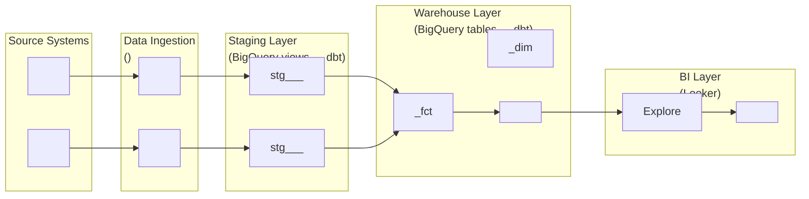

# Design data pipeline architecture and data flow diagram

## User Input

```text
$ARGUMENTS
```

## Path Configuration

- **Projects**: `.wire` (project data and status files)

When following the workflow specification below, resolve paths as follows:
- `.wire/` in specs refers to the `.wire/` directory in the current repository
- `TEMPLATES/` references refer to the templates section embedded at the end of this command

## Tracing (opt-in, off by default)

# Tracing — Detailed, Opt-In, Step-Level Execution Trace

## Purpose

`execution_log.md` records one terse row per whole command (timestamp, command, result, a detail string capped at 120 characters). That's enough for a normal audit trail, but it can't answer "what actually happened inside that command, step by step" — which specific files it read, what it inferred, what it proposed, what a consultant decided, why. Tracing exists for engagements that want that depth: a complete, structured, append-only record of every step of every command, scoped to the release and release type it ran under.

**Off by default.** Tracing never runs unless `WIRE_TRACE=true` is set in the shell environment. If it isn't, skip this entire section — do nothing, check nothing further, proceed straight to the Workflow Specification exactly as if this section didn't exist. This is the common case and must add zero overhead.

## Where it writes

`.wire/releases/<release_folder>/trace.jsonl` — one JSON object per line (JSON Lines), append-only, alongside that release's `status.md` and `execution_log.md`.

For commands not scoped to a specific release (cross-cutting utilities with `release_types: []` in their own front-matter, or any command whose argument isn't a release folder), write to `.wire/trace.jsonl` at the engagement level instead, with `release` and `release_type` fields set to `null`.

This file is **local only** — nothing in it is ever sent anywhere, unlike the anonymous Segment telemetry event described elsewhere. It stays on the consultant's machine, inside the engagement's own repo, exactly like `execution_log.md`.

## What to log, and when

If `WIRE_TRACE=true`:

1. **Resolve context once, before anything else**: the release folder (from this command's own argument, if it has one) and `release_type` (read `.wire/releases/<release_folder>/status.md`'s `project_type` or `release_type` field). If this command has no release-folder argument, both are `null`.
2. **Emit a `command_start` event** before beginning the Workflow Specification below.
3. **As you work through the Workflow Specification's own numbered steps, emit a `step` event after completing each one** — and where a step itself has meaningfully distinct numbered sub-parts (e.g. "check location A, then location B, then infer a match, then propose it"), treat each of those as its own step event too rather than collapsing them into one. The `detail` field has no length limit and is not a summary — write what actually happened: values found, files read, decisions made and why, what was proposed and what the consultant chose. If this step involved the data model registry or any other external/optional resource, log it explicitly: whether it was reached, what was searched, what matched (or didn't, and why not), and whether/how the result was used downstream.
4. **Emit a `command_end` event** when the workflow finishes, with the same `result` value this command would write to `execution_log.md` (`complete`, `pass`, `fail`, `approved`, etc.).

## How to emit an event

Use this pattern for every event (adjust the heredoc body and the Python literals per call — this is a template, not a fixed script):

```bash
[ "${WIRE_TRACE:-false}" = "true" ] && {
  mkdir -p ".wire/releases/<release_folder>" 2>/dev/null
  cat > "/tmp/wire_trace_detail_$$.txt" << 'WIRE_TRACE_DETAIL_EOF'
<the full, untruncated detail text for this event — safe to include quotes,
newlines, code snippets, anything; this heredoc is not shell-interpreted>
WIRE_TRACE_DETAIL_EOF
  python3 -c "
import json, datetime
detail = open('/tmp/wire_trace_detail_$$.txt').read().rstrip('\n')
event = {
    'ts': datetime.datetime.utcnow().strftime('%Y-%m-%dT%H:%M:%SZ'),
    'release': '<release_folder_or_null>',
    'release_type': '<release_type_or_null>',
    'command': 'pipeline_design-generate',
    'event': '<command_start|step|command_end>',
    'step': '<step_number_or_null>',
    'step_name': '<step_heading_or_null>',
    'result': '<result_value_or_null>',
    'detail': detail,
}
with open('.wire/releases/<release_folder>/trace.jsonl', 'a') as f:
    f.write(json.dumps(event) + chr(10))
"
  rm -f "/tmp/wire_trace_detail_$$.txt"
}
```

- `<release_folder_or_null>` / `<release_type_or_null>`: from Step 1 above; write the literal JSON `null` (no quotes) if either doesn't apply, or a quoted string if it does.
- `event`: `command_start`, `step`, or `command_end`.
- `step` / `step_name`: `null` for `command_start`/`command_end`; the step's own number (e.g. `"1.5"`) and heading (e.g. `"Check for a Canonical Vertical Match"`) for a `step` event.
- `result`: `null` except on `command_end`.
- Adjust the file path in the final `open(...)` call to `.wire/trace.jsonl` for engagement-level (non-release-scoped) commands.

## Rules

1. **Never block or fail the workflow.** If a trace write fails for any reason (disk full, permissions), continue the workflow regardless — trace failures are never surfaced to the user and never stop anything.
2. **Append only** — never rewrite or delete existing lines in `trace.jsonl`.
3. **This is additive to `execution_log.md` and Telemetry, not a replacement for either.** All three continue exactly as documented elsewhere; tracing is a separate, optional, much finer-grained record for engagements that opt in.
4. **Don't summarize into brevity.** The entire point of this mechanism over `execution_log.md` is that it isn't limited to a 120-character line — write the real detail.

## Example

```json
{"ts":"2026-07-05T14:20:03Z","release":"20260705_acme","release_type":"full_platform","command":"data_model-generate","event":"command_start","step":null,"step_name":null,"result":null,"detail":"Invoked for release 20260705_acme (full_platform)"}
{"ts":"2026-07-05T14:20:11Z","release":"20260705_acme","release_type":"full_platform","command":"data_model-generate","event":"step","step":"1.5.1","step_name":"Resolve the registry location","result":null,"detail":"Checked wire/data-model-registry/ (not found — not the Wire source repo). Checked ~/.wire/data-model-registry/ (found — cloned via /wire:utils-data-model-registry-setup on 2026-07-01)."}
{"ts":"2026-07-05T14:20:19Z","release":"20260705_acme","release_type":"full_platform","command":"data_model-generate","event":"step","step":"1.5.2","step_name":"Resolve the vertical","result":null,"detail":"No confident vertical match for Acme (B2B SaaS, no dedicated saas vertical in the registry). Adjacent match found: subscription-commerce — entity shape (subscriber, subscription, subscription_event, monthly_retention, subscription_revenue) proposed as a structural analogue for Acme's MRR/NRR model."}
{"ts":"2026-07-05T14:20:34Z","release":"20260705_acme","release_type":"full_platform","command":"data_model-generate","event":"step","step":"1.5.3","step_name":"Check cross-vertical patterns","result":null,"detail":"crm_identity_resolution flagged as relevant — requirements FR-12 describes reconciling Salesforce and HubSpot contact records, a 12% mismatch rate noted in discovery. Proposed alongside the subscription-commerce adjacent match."}
{"ts":"2026-07-05T14:21:02Z","release":"20260705_acme","release_type":"full_platform","command":"data_model-generate","event":"step","step":"1.5.4","step_name":"Propose and record decision","result":null,"detail":"Presented both proposals. Consultant chose 'adapt' on subscription-commerce (kept subscriber/subscription/subscription_revenue, dropped monthly_retention as out of scope for this phase, renamed subscription_event to billing_event to match client terminology) and 'yes' on crm_identity_resolution as-is. Recorded data_model_registry.vertical: subscription-commerce and cross_vertical_schemas: [crm_identity_resolution] in .wire/engagement/context.md."}
{"ts":"2026-07-05T14:34:47Z","release":"20260705_acme","release_type":"full_platform","command":"data_model-generate","event":"step","step":"5","step_name":"Carry reference pointers forward","result":null,"detail":"account_dim mapped to subscription-commerce's subscriber entity — generation_constraints and reference_implementation pointer carried into data_model_specification.md. subscription_fct mapped to subscription entity, same treatment. contact_identity_map (new, from crm_identity_resolution) added as its own integration model with that pattern's reference_implementation pointer."}
{"ts":"2026-07-05T14:41:15Z","release":"20260705_acme","release_type":"full_platform","command":"data_model-generate","event":"command_end","step":null,"step_name":null,"result":"complete","detail":"Generated data_model_specification.md — 14 models (5 staging, 4 integration, 5 warehouse), including 2 informed by the accepted registry proposals above."}
```

## Workflow Specification

---
wire_schema: "1.0"
command: generate
artifact: pipeline_design
domain: design
release_types:
  - full_platform
  - dbt_development
  - dashboard_first
  - pipeline_only
  - dashboard_extension
  - enablement
action_type: artifact
logs_execution: true
inputs:
  required:
    - name: release_folder
      description: "Path to the release folder"
preconditions: dynamic
delegates_to:
  - utils/precondition_gate
description: Design data pipeline architecture including data flow diagram
argument-hint: <project-folder>

---

## Auto-Delegation

Follow `specs/utils/precondition_gate.md` before proceeding.

---

# Pipeline Design Generate Command

Follow `specs/utils/data_designer_delegate.md` before executing the workflow below.

## Purpose

Generate a comprehensive data pipeline architecture document covering: source system analysis, replication strategy, data flow, error handling, scheduling, and monitoring approach. Also produces a **Data Flow Diagram (DFD)** as a Mermaid flowchart showing the end-to-end movement of data from source systems through to the BI layer.

## Usage

```bash
/wire:pipeline_design-generate YYYYMMDD_project_name
```

## Prerequisites

- `requirements`: `review: approved`
- `conceptual_model`: `review: approved` — the pipeline design uses approved entities as reference

## Workflow

### Step 1: Verify Prerequisites and Read Inputs

1. Read `.wire/<project_id>/status.md`
2. Verify `requirements.review == approved`. If not:
   ```
   Error: Requirements must be approved before pipeline design.
   Run: /wire:requirements-review <project_id>
   ```
3. Verify `conceptual_model.review == approved`. If not:
   ```
   Error: Conceptual model must be approved before pipeline design.
   The pipeline design maps source systems to the agreed business entities.
   Run: /wire:conceptual_model-review <project_id>
   ```
4. Read `.wire/<project_id>/requirements/requirements_specification.md`
5. Read `.wire/<project_id>/design/conceptual_model.md`
6. Use Glob to find all files in `.wire/<project_id>/artifacts/**/*`
7. Read any source schema examples, SQL files, API documentation, or existing pipeline code in `artifacts/`

### Step 2: Analyse Source Systems

For each source system identified in requirements:
- **Technology**: Database type (SQL Server, PostgreSQL, MySQL, API, flat files, etc.)
- **Schema**: Tables/endpoints relevant to the in-scope entities from the conceptual model
- **Volume**: Row counts, growth rate, transaction frequency
- **Availability**: Uptime, maintenance windows, access method
- **Sensitivity**: PII fields, data governance constraints

Cross-reference source tables/endpoints against the approved conceptual model entities. Flag any entities in the conceptual model that have no clear source system mapping — these are data gaps.

### Step 3: Choose Pipeline Replication Tool

Before defining the per-source replication strategy, the team must align on which tool will manage data replication. Present this as **Design Decision PD-1** (or the next available PD-N if earlier decisions exist):

```
**PD-1: Pipeline Replication Tool**
Context: The choice of replication tool affects connector coverage, cost model,
infrastructure footprint, and ongoing maintenance burden.

Options:

| Option | Best for | Cost model | Connectors | Infrastructure |
|--------|----------|-----------|------------|----------------|
| **Fivetran** | SaaS sources, minimal engineering, managed CDC | MAR-based (Monthly Active Rows) | 500+ pre-built | Fully managed, no infra |
| **dlt (data load tool)** | Python-native teams, custom APIs, cost-sensitive | Open-source / dlt Cloud | Community + custom | Python scripts, self-hosted or dlt Cloud |
| **Airbyte** | Mixed SaaS + custom sources, open-source preference | Open-source / Airbyte Cloud | 350+ connectors | Self-hosted (Docker/K8s) or Airbyte Cloud |
| **Custom / bespoke** | Highly specialised sources, full control required | Engineering time | N/A | Self-managed |

Recommendation: [Select based on source systems identified in Step 2 — SaaS-heavy projects
favour Fivetran; Python-heavy or cost-sensitive projects favour dlt]
Input required from: Data Team Lead / CTO
```

If the client has already expressed a tool preference (in requirements or workshops), note it here and skip the decision — but still confirm it is appropriate for all source systems.

**After tool selection: verify connector/source support**

Once the tool is chosen, verify that it can handle each source system identified in Step 2:

- **Fivetran**: Call `mcp__fivetran__list_metadata_connectors` and verify each source system has a matching connector. For any source where a connector is found, call `mcp__fivetran__get_metadata_connector_config` to confirm the required config fields (API keys, OAuth scopes, host/database params) — document these in the design so the implementation step is not blocked by missing credentials.
- **dlt**: Check `dlthub.com/docs/dlt-ecosystem/verified-sources` for verified sources; note which require custom REST source implementation.
- **Airbyte**: Check `docs.airbyte.com/integrations/sources` for connector availability and support tier (Generally Available / Beta / Alpha).
- **Custom**: Document the ingestion approach (Cloud Function, Cloud Run job, direct JDBC) per source.

Record the chosen tool in **Section 6 (Technology Stack)** and as `pipeline_tool` in status.md (Step 8).

### Step 4: Define Replication Strategy

For each source system, assess and recommend a replication approach using the chosen tool:

**Replication options** (select based on source capabilities and freshness requirements):
- **Full refresh**: Simple, high-cost at scale, suitable for small/slowly-changing tables
- **Incremental by timestamp**: Efficient, requires a reliable `updated_at` column
- **CDC (Change Data Capture)**: Real-time or near-real-time — supported by Fivetran (log-based), Airbyte (Debezium-based), or custom Debezium setup
- **API polling**: For SaaS sources without database access — all three tools support this
- **Batch extract**: Scheduled SQL exports or file drops — typically custom or dlt

For **Fivetran-based** sources, also include:
- Confirmed connector service slug (from `get_metadata_connector_config`)
- MAR (Monthly Active Rows) estimate and cost implication
- Whether server-side SQL views can reduce MAR by filtering rows at source

For **dlt-based** sources, also include:
- Whether a verified source exists or custom implementation is needed
- Incremental loading strategy (`append`, `merge`, or `replace`)

For **Airbyte-based** sources, also include:
- Connector support tier (GA / Beta / Alpha) and any known limitations
- Sync mode per stream (full refresh / incremental append / incremental deduped)

Present options as numbered scenarios (Scenario A, B, C) where trade-offs exist — do not silently choose. Flag decisions requiring client input as **Design Decision PD-N**.

### Step 5: Define Pipeline Architecture

Specify the end-to-end pipeline:

**Landing / Raw layer**:
- Where replicated data lands (dataset names, schema)
- Naming convention: `fivetran_<source>`, `raw_<source>`, etc.

**Staging layer**:
- dbt staging models that will be built from raw data
- Mapping: raw table → `stg_<source>__<entity>` model name
- Reference the approved conceptual model entities

**Warehouse layer**:
- Fact tables, dimension tables, aggregates
- Reference the data model specification (generated separately)

**Error handling**:
- How pipeline failures are detected and surfaced
- Retry logic
- Alerting approach (Slack, email, monitoring dashboard)

**Scheduling**:
- Refresh cadence per source (real-time, hourly, daily, etc.)
- dbt Cloud job schedules
- Dependencies between pipeline runs and dbt jobs

### Step 6: Document Design Decisions

For each decision requiring client input, create a numbered entry:

```
**PD-1: [Decision Title]**
Context: [Why this decision is needed]
Options:
  - Option A: [Description] — [pros/cons, cost implication]
  - Option B: [Description] — [pros/cons, cost implication]
Recommendation: [Preferred option and rationale]
Input required from: [Who needs to decide — DBA, Data Team Lead, CTO, etc.]
```

### Step 7: Generate Data Flow Diagram (DFD)

Produce a Mermaid `graph LR` flowchart showing the complete data flow from source systems to BI dashboards. Write this as a `## Data Flow Diagram` section within the pipeline architecture document.

Use this structure:

```
## Data Flow Diagram


```

Replace all `<placeholders>` with project-specific values from the requirements and conceptual model. Staging model names must match the naming convention (`stg_<source>__<entity>`). Warehouse model names must match the agreed naming convention (`<entity>_fct`, `<entity>_dim`).

### Step 8: Write Pipeline Architecture Document

Write to `.wire/<project_id>/design/pipeline_architecture.md`:

```markdown
# Pipeline Architecture: [Project Name]

**Client**: [Client Name]
**Project ID**: [Project ID]
**Generated**: [Date]
**Version**: 1.0

## 1. Source Systems

[Table: System | Technology | In-scope tables/endpoints | Replication method | Refresh cadence]

## 2. Replication Strategy

[Scenarios A/B/C with cost and trade-off analysis]

## 3. Pipeline Architecture

### 3.1 Landing / Raw Layer
[Dataset names, naming convention]

### 3.2 Staging Layer
[dbt staging models — mapping from raw → stg_]

### 3.3 Warehouse Layer
[Fact/dim tables — high level, detail in data_model spec]

### 3.4 Error Handling
[Failure detection, retry, alerting]

### 3.5 Scheduling
[Refresh cadences, dbt job config, dependencies]

## 4. Data Flow Diagram

[Mermaid DFD as generated in Step 6]

## 5. Design Decisions

[PD-1 through PD-N as generated in Step 5]

## 6. Technology Stack

| Layer | Technology | Version/Tier |
|-------|-----------|--------------|
| Replication | [Fivetran/Airbyte/custom] | [connector type] |
| Transformation | dbt Cloud | [dbt version] |
| Warehouse | BigQuery | [dataset location] |
| BI | Looker | [instance URL] |
| Orchestration | [dbt Cloud / Airflow / Cloud Scheduler] | |

## 7. Security and Data Governance

[PII handling, column exclusions, access controls, data residency]
```

### Step 9: Update Status

```yaml
pipeline_design:
  generate: complete
  validate: not_started
  review: not_started
  file: design/pipeline_architecture.md
  generated_date: [today]
pipeline:
  pipeline_tool: [fivetran | dlt | airbyte | custom]  # chosen in Step 3
```

Write `pipeline_tool` under `artifacts.pipeline` in status.md now, even though the pipeline artifact itself has not been generated yet. This records the design decision so downstream commands can route correctly without re-reading the design document.

### Step 10: Sync to Jira (Optional)

Follow the Jira sync workflow in `specs/utils/jira_sync.md`:
- Artifact: `pipeline_design`
- Action: `generate`
- Status: the generate state just written to status.md

### Step 11: Sync to Document Store (Optional)

If a document store is configured for this project, follow the workflow in `specs/utils/docstore_sync.md`:
- `artifact_id`: `pipeline_design`
- `artifact_name`: `Pipeline Design`
- `file_path`: `.wire/releases/[release_folder]/design/pipeline_design.md`
- `project_id`: the release folder path (e.g. `releases/01-discovery`)

If docstore sync fails, log the error and continue — do not block the generate command.

### Step 12: Confirm and Suggest Next Steps

```
## Pipeline Design Generated

**File**: .wire/<project_id>/design/pipeline_architecture.md

**Pipeline tool**: [fivetran | dlt | airbyte | custom]
**Source systems**: [count]
**Connectors verified**: [count — connectors confirmed to exist in the chosen tool]
**Design decisions requiring input**: [count — flag if > 0, include PD-1 tool choice if unresolved]
**Data flow diagram**: included

### Next Steps

1. Validate the pipeline design:
   /wire:pipeline_design-validate <project_id>

2. After validation, technical review:
   /wire:pipeline_design-review <project_id>

3. Once design is approved, create pipeline connections:
   /wire:pipeline-generate <project_id>

NOTE: If there are open design decisions (PD-N items) — especially PD-1 (tool choice) —
resolve these before or during the review session. The tool choice gates all
downstream pipeline commands.
```

## Edge Cases

### Multiple Viable Replication Scenarios

Always present options — never silently choose. The cost implication (MAR, compute, engineering time) belongs to the client, not the consultant.

### Source Schema Not Available in Artifacts

If source schema examples are absent:
1. Generate the architecture at the entity level (from the conceptual model)
2. Add a note: "Detailed table mapping requires source schema — add SQL schema dumps or query examples to artifacts/ before finalising"
3. List what schema information is needed and who should provide it

### Existing Pipeline in Place

If the client already has a pipeline (e.g. Fivetran partially configured):
1. Document the existing setup in Section 1
2. Design only the incremental additions (new connectors, new tables)
3. Note what must not be changed to avoid breaking existing flows

## Output

This command creates:
- `.wire/<project_id>/design/pipeline_architecture.md` (includes DFD)
- Updates `.wire/<project_id>/status.md`

Execute the complete workflow as specified above.

## Execution Logging

After completing the workflow, append a log entry to the project's execution_log.md:

# Execution Log — Command and Skill Logging

## Purpose

After completing any generate, validate, or review workflow (or a project management command that changes state), append a single log entry to the project's execution log file. Skills also append an entry on activation, making the log a unified trace of all agent activity — both explicit commands and auto-activated skills.

## Log File Location

```
<DP_PROJECTS_PATH>/<project_folder>/execution_log.md
```

Where `<project_folder>` is the project directory passed as an argument (e.g., `20260222_acme_platform`).

## Format

If the file does not exist, create it with the header:

```markdown
# Execution Log

| Timestamp | Command | Result | Detail |
|-----------|---------|--------|--------|
```

Then append one row per execution:

```markdown
| YYYY-MM-DD HH:MM | /wire:<command> | <result> | <detail> |
```

### Field Definitions

- **Timestamp**: Current date and time in `YYYY-MM-DD HH:MM` format (24-hour, local time)
- **Command**: Either the `/wire:*` command invoked, or `skill` for a skill activation entry
- **Result / Skill name**: For commands, the outcome; for skills, the skill identifier. Use one of:
  - `complete` — generate command finished successfully
  - `pass` — validate command passed all checks
  - `fail` — validate command found failures
  - `approved` — review command: stakeholder approved
  - `changes_requested` — review command: stakeholder requested changes
  - `created` — `/wire:new` created a new project
  - `archived` — `/wire:archive` archived a project
  - `removed` — `/wire:remove` deleted a project
  - `activated` — a skill was auto-activated (used with `skill` in the Command column)
  - `override` — `specs/utils/precondition_gate.md` recorded a consultant overriding an unmet precondition
- **Detail**: A concise one-line summary of what happened. Include:
  - For generate: number of files created or key output filename
  - For validate: number of checks passed/failed
  - For review: reviewer name and brief feedback if changes requested
  - For new: project type and client name
  - For archive/remove: project name
  - For skill activations: brief description of what triggered the skill
  - For override: the unmet precondition, who overrode it, and their reason

## Skill Activation Entries

When a skill activates, it appends a row in the same format as commands, using `skill` in the Command column and the skill identifier in the Result column:

```markdown
| YYYY-MM-DD HH:MM | skill | <skill-identifier> | activated | <brief trigger description> |
```

Skill identifiers:

| Skill | Identifier |
|-------|-----------|
| Engagement Context | `engagement-context` |
| Research Persistence | `research-persistence` |
| dbt Development | `dbt-development` |
| LookML Content Authoring | `lookml-authoring` |
| dbt Analytics QA | `dbt-analytics-qa` |
| dbt Migration | `dbt-migration` |
| dbt Troubleshooting | `dbt-troubleshooting` |
| dbt Semantic Layer | `dbt-semantic-layer` |
| dbt Unit Testing | `dbt-unit-testing` |
| dbt DAG | `dbt-dag` |
| Dagster | `dagster` |
| Fivetran | `fivetran` |
| Project Review | `project-review` |
| Looker Dashboard Mockup | `looker-dashboard-mockup` |

This makes skill activations visible in the same log that captures command invocations, enabling full activity tracing across both explicit commands and automatic skill triggers.

## Rules

1. **Append only** — never modify or delete existing log entries
2. **One row per command execution** — even if a command is re-run, add a new row (this creates the revision history)
3. **Always log after status.md is updated** — the log entry should reflect the final state
4. **Pipe characters in detail** — if the detail text contains `|`, replace with `—` to preserve table formatting
5. **Keep detail under 120 characters** — be concise

## Example

```markdown
# Execution Log

| Timestamp | Command | Result | Detail |
|-----------|---------|--------|--------|
| 2026-02-22 14:30 | skill | engagement-context | activated | Context loaded for new conversation |
| 2026-02-22 14:35 | /wire:new | created | Project created (type: full_platform, client: Acme Corp) |
| 2026-02-22 14:40 | /wire:requirements-generate | complete | Generated requirements specification (3 files) |
| 2026-02-22 15:12 | /wire:requirements-validate | pass | 14 checks passed, 0 failed |
| 2026-02-22 16:00 | /wire:requirements-review | approved | Reviewed by Jane Smith |
| 2026-02-23 09:15 | /wire:conceptual_model-generate | complete | Generated entity model with 8 entities |
| 2026-02-23 10:30 | /wire:conceptual_model-validate | fail | 2 issues: missing relationship, orphaned entity |
| 2026-02-23 11:00 | /wire:conceptual_model-generate | complete | Regenerated entity model (fixed 2 issues, 8 entities) |
| 2026-02-23 11:15 | /wire:conceptual_model-validate | pass | 12 checks passed, 0 failed |
| 2026-02-23 14:00 | /wire:conceptual_model-review | changes_requested | Reviewed by John Doe — add Customer entity |
| 2026-02-23 15:30 | /wire:conceptual_model-generate | complete | Regenerated entity model (9 entities, added Customer) |
| 2026-02-23 15:45 | /wire:conceptual_model-validate | pass | 14 checks passed, 0 failed |
| 2026-02-23 16:00 | /wire:conceptual_model-review | approved | Reviewed by John Doe |
| 2026-02-24 09:05 | /wire:migration-strategy-generate | override | migration_inventory.review required approved, was not_started — overridden by Jane Smith: client demo tomorrow, inventory sign-off deferred to Monday |
```
