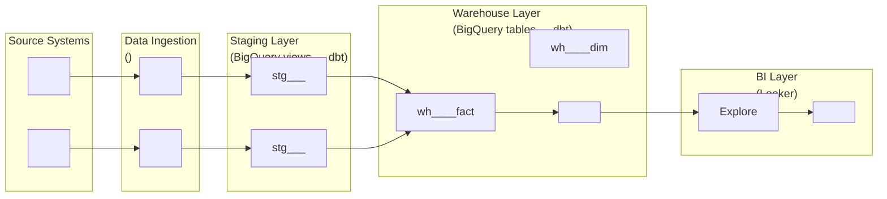

# Design data pipeline architecture and data flow diagram

## User Input

```text
$ARGUMENTS
```

## Path Configuration

- **Projects**: `.wire` (project data and status files)

When following the workflow specification below, resolve paths as follows:
- `.wire/` in specs refers to the `.wire/` directory in the current repository
- `TEMPLATES/` references refer to the templates section embedded at the end of this command
- `specs/<path>.md` references are shared workflow docs shipped with this plugin — read them from `${CLAUDE_PLUGIN_ROOT}/specs/<path>.md`. If the path matches a Wire command (e.g. `specs/requirements/generate.md`), it means that command (`/wire:requirements-generate`) and its spec is already embedded in the command file.

## Tracing (opt-in, off by default)

---
description: Internal utility — opt-in step-level execution tracing to .wire/releases/<release>/trace.jsonl when WIRE_TRACE=true
---

# Tracing — Detailed, Opt-In, Step-Level Execution Trace

## Purpose

`execution_log.md` records one terse row per whole command (timestamp, command, result, a detail string capped at 120 characters). That's enough for a normal audit trail, but it can't answer "what actually happened inside that command, step by step" — which specific files it read, what it inferred, what it proposed, what a consultant decided, why. Tracing exists for engagements that want that depth: a complete, structured, append-only record of every step of every command, scoped to the release and release type it ran under.

**Off by default.** Tracing never runs unless `WIRE_TRACE=true` is set in the shell environment. If it isn't, skip this entire section — do nothing, check nothing further, proceed straight to the Workflow Specification exactly as if this section didn't exist. This is the common case and must add zero overhead.

## Where it writes

`.wire/releases/<release_folder>/trace.jsonl` — one JSON object per line (JSON Lines), append-only, alongside that release's `status.md` and `execution_log.md`.

For commands not scoped to a specific release (cross-cutting utilities with `release_types: []` in their own front-matter, or any command whose argument isn't a release folder), write to `.wire/trace.jsonl` at the engagement level instead, with `release` and `release_type` fields set to `null`.

This file is **local only** — nothing in it is ever sent anywhere, unlike the anonymous Segment telemetry event described elsewhere. It stays on the consultant's machine, inside the engagement's own repo, exactly like `execution_log.md`.

## What to log, and when

If `WIRE_TRACE=true`:

1. **Resolve context once, before anything else**: the release folder (from this command's own argument, if it has one) and `release_type` (read `.wire/releases/<release_folder>/status.md`'s `project_type` or `release_type` field). If this command has no release-folder argument, both are `null`.
2. **Emit a `command_start` event** before beginning the Workflow Specification below.
3. **As you work through the Workflow Specification's own numbered steps, emit a `step` event after completing each one** — and where a step itself has meaningfully distinct numbered sub-parts (e.g. "check location A, then location B, then infer a match, then propose it"), treat each of those as its own step event too rather than collapsing them into one. The `detail` field has no length limit and is not a summary — write what actually happened: values found, files read, decisions made and why, what was proposed and what the consultant chose. If this step involved the data model registry or any other external/optional resource, log it explicitly: whether it was reached, what was searched, what matched (or didn't, and why not), and whether/how the result was used downstream.
4. **Emit a `command_end` event** when the workflow finishes, with the same `result` value this command would write to `execution_log.md` (`complete`, `pass`, `fail`, `approved`, etc.).

## How to emit an event

Use this pattern for every event (adjust the heredoc body and the Python literals per call — this is a template, not a fixed script):

```bash
[ "${WIRE_TRACE:-false}" = "true" ] && {
  mkdir -p ".wire/releases/<release_folder>" 2>/dev/null
  cat > "/tmp/wire_trace_detail_$$.txt" << 'WIRE_TRACE_DETAIL_EOF'
<the full, untruncated detail text for this event — safe to include quotes,
newlines, code snippets, anything; this heredoc is not shell-interpreted>
WIRE_TRACE_DETAIL_EOF
  python3 -c "
import json, datetime
detail = open('/tmp/wire_trace_detail_$$.txt').read().rstrip('\n')
event = {
    'ts': datetime.datetime.utcnow().strftime('%Y-%m-%dT%H:%M:%SZ'),
    'release': '<release_folder_or_null>',
    'release_type': '<release_type_or_null>',
    'command': 'pipeline_design-generate',
    'event': '<command_start|step|command_end>',
    'step': '<step_number_or_null>',
    'step_name': '<step_heading_or_null>',
    'result': '<result_value_or_null>',
    'detail': detail,
}
with open('.wire/releases/<release_folder>/trace.jsonl', 'a') as f:
    f.write(json.dumps(event) + chr(10))
"
  rm -f "/tmp/wire_trace_detail_$$.txt"
}
```

- `<release_folder_or_null>` / `<release_type_or_null>`: from Step 1 above; write the literal JSON `null` (no quotes) if either doesn't apply, or a quoted string if it does.
- `event`: `command_start`, `step`, or `command_end`.
- `step` / `step_name`: `null` for `command_start`/`command_end`; the step's own number (e.g. `"1.5"`) and heading (e.g. `"Check for a Canonical Vertical Match"`) for a `step` event.
- `result`: `null` except on `command_end`.
- Adjust the file path in the final `open(...)` call to `.wire/trace.jsonl` for engagement-level (non-release-scoped) commands.

## Rules

1. **Never block or fail the workflow.** If a trace write fails for any reason (disk full, permissions), continue the workflow regardless — trace failures are never surfaced to the user and never stop anything.
2. **Append only** — never rewrite or delete existing lines in `trace.jsonl`.
3. **This is additive to `execution_log.md` and Telemetry, not a replacement for either.** All three continue exactly as documented elsewhere; tracing is a separate, optional, much finer-grained record for engagements that opt in.
4. **Don't summarize into brevity.** The entire point of this mechanism over `execution_log.md` is that it isn't limited to a 120-character line — write the real detail.

## Example

```json
{"ts":"2026-07-05T14:20:03Z","release":"20260705_acme","release_type":"full_platform","command":"data_model-generate","event":"command_start","step":null,"step_name":null,"result":null,"detail":"Invoked for release 20260705_acme (full_platform)"}
{"ts":"2026-07-05T14:20:11Z","release":"20260705_acme","release_type":"full_platform","command":"data_model-generate","event":"step","step":"1.5.1","step_name":"Resolve the registry location","result":null,"detail":"Checked wire/data-model-registry/ (not found — not the Wire source repo). Checked ~/.wire/data-model-registry/ (found — cloned via /wire:utils-data-model-registry-setup on 2026-07-01)."}
{"ts":"2026-07-05T14:20:19Z","release":"20260705_acme","release_type":"full_platform","command":"data_model-generate","event":"step","step":"1.5.2","step_name":"Resolve the vertical","result":null,"detail":"No confident vertical match for Acme (B2B SaaS, no dedicated saas vertical in the registry). Adjacent match found: subscription-commerce — entity shape (subscriber, subscription, subscription_event, monthly_retention, subscription_revenue) proposed as a structural analogue for Acme's MRR/NRR model."}
{"ts":"2026-07-05T14:20:34Z","release":"20260705_acme","release_type":"full_platform","command":"data_model-generate","event":"step","step":"1.5.3","step_name":"Check cross-vertical patterns","result":null,"detail":"crm_identity_resolution flagged as relevant — requirements FR-12 describes reconciling Salesforce and HubSpot contact records, a 12% mismatch rate noted in discovery. Proposed alongside the subscription-commerce adjacent match."}
{"ts":"2026-07-05T14:21:02Z","release":"20260705_acme","release_type":"full_platform","command":"data_model-generate","event":"step","step":"1.5.4","step_name":"Propose and record decision","result":null,"detail":"Presented both proposals. Consultant chose 'adapt' on subscription-commerce (kept subscriber/subscription/subscription_revenue, dropped monthly_retention as out of scope for this phase, renamed subscription_event to billing_event to match client terminology) and 'yes' on crm_identity_resolution as-is. Recorded data_model_registry.vertical: subscription-commerce and cross_vertical_schemas: [crm_identity_resolution] in .wire/engagement/context.md."}
{"ts":"2026-07-05T14:34:47Z","release":"20260705_acme","release_type":"full_platform","command":"data_model-generate","event":"step","step":"5","step_name":"Carry reference pointers forward","result":null,"detail":"account_dim mapped to subscription-commerce's subscriber entity — generation_constraints and reference_implementation pointer carried into data_model_specification.md. subscription_fct mapped to subscription entity, same treatment. contact_identity_map (new, from crm_identity_resolution) added as its own integration model with that pattern's reference_implementation pointer."}
{"ts":"2026-07-05T14:41:15Z","release":"20260705_acme","release_type":"full_platform","command":"data_model-generate","event":"command_end","step":null,"step_name":null,"result":"complete","detail":"Generated data_model_specification.md — 14 models (5 staging, 4 integration, 5 warehouse), including 2 informed by the accepted registry proposals above."}
```

## Automatic Validation (on by default)

---
description: Internal utility — injected auto-validate section so generate commands run their matching validate step automatically and fold the result into their output
---

Every `generate` command that has a matching `validate` command for the
same artifact runs that validate step automatically as part of generate —
by default, with no separate command to remember. This section only appears
on commands where that applies; artifacts with no separate validate step at
all (e.g. mockups, workshops, UAT) never carry this section.

## Step: Check `auto_validate`

Read this command's own `auto_validate` front-matter field, in the Workflow
Specification below. Two states:

- **Absent, or `true`** (the default — most artifacts): auto-validate runs.
- **`false`**: this artifact's validate step is expensive — it runs real
  code, queries a live warehouse or BI tool, or otherwise does IO beyond
  re-reading local files — so it does not run automatically. Skip to
  "If `auto_validate: false`" below.

## If `auto_validate` is absent or `true`: run validate automatically

Once this command finishes writing its artifact, before ending:

1. Run this artifact's own `/wire:<artifact-with-dashes>-validate` workflow
   in full, exactly as if the consultant had typed it themselves — same
   inputs, same `status.md` write to `artifacts.<artifact>.validate`, same
   report. This is not optional or an extra step layered on top; it is the
   default behavior for this artifact.
2. Fold the result into this command's own closing output rather than
   presenting it as a separate command run:
   - **PASS** — add a single closing line: `✅ Auto-validated — PASS`. The
     full report already went to `status.md`/`execution_log.md`, exactly as
     it would from a standalone validate run — no need to repeat it here.
   - **FAIL** — surface the validate command's own failure report in full,
     exactly as running validate standalone would show it, so the
     consultant sees what's wrong immediately without running anything
     else themselves.
3. This never blocks or undoes generate itself — the artifact is written
   either way, and its content is never rolled back because validate
   failed. Auto-validation only means validate has already run and its
   result is already on record by the time generate finishes, instead of
   waiting for the consultant to remember to run it separately.

## If `auto_validate` is `false`: state this plainly, don't run it

Do not run validate. End with a line naming why, as specifically as this
spec's own context makes possible (e.g. "runs `dbt run`/`dbt test`",
"queries the live target warehouse", "calls the Looker API directly") —
fall back to "performs live checks against an external system" only if no
more specific reason is evident from context:

```
⚠ This artifact's validate step [reason] and does not run automatically.
Run /wire:<artifact-with-dashes>-validate <release_folder> before
requesting review — review is blocked until it passes.
```

## Why this is always safe either way

`review` already requires `validate: PASS` for this same artifact as one of
its own declared preconditions (see `specs/utils/precondition_gate.md`) —
this is existing, independent enforcement, not something added by this
section. So an `auto_validate: false` opt-out never lets an artifact reach
review unvalidated; it only decides *when* the consultant pays validate's
cost — automatically on every draft (the default), or once, on their own
schedule, before requesting review (the opt-out). Auto-validation is a
convenience that closes the "forgot to run it" gap for the common case; the
gate that actually prevents unvalidated work from being reviewed was already
there.

## Workflow Specification

---
wire_schema: "1.0"
command: generate
artifact: pipeline_design
domain: design
release_types:
  - full_platform
  - dbt_development
  - dashboard_first
  - pipeline_only
  - dashboard_extension
  - enablement
  - sop_discovery
action_type: artifact
logs_execution: true
inputs:
  optional:
    - name: depth
      description: "--depth discovery limits the document to sources, stages, landing entities and the target platform architecture, omitting error handling, scheduling and monitoring. Default full."
  required:
    - name: release_folder
      description: "Path to the release folder"
preconditions: dynamic
delegates_to:
  - utils/precondition_gate
  - utils/mml_import
description: Design data pipeline architecture including data flow diagram
argument-hint: <project-folder> [--depth discovery|full]
---

## Auto-Delegation

Follow `specs/utils/precondition_gate.md` before proceeding.

---

# Pipeline Design Generate Command

Follow `specs/utils/data_designer_delegate.md` before executing the workflow below.

## Purpose

Generate a comprehensive data pipeline architecture document covering: source system analysis, replication strategy, data flow, error handling, scheduling, and monitoring approach. Also produces a **Data Flow Diagram (DFD)** as a Mermaid flowchart showing the end-to-end movement of data from source systems through to the BI layer.

## Usage

```bash
/wire:pipeline_design-generate YYYYMMDD_project_name
```

## Prerequisites

- `requirements`: `review: approved`
- `conceptual_model`: `review: approved` — the pipeline design uses approved entities as reference

## Workflow

### Step 1: Verify Prerequisites and Read Inputs

1. Read `.wire/<project_id>/status.md`
2. Verify `requirements.review == approved`. If not:
   ```
   Error: Requirements must be approved before pipeline design.
   Run: /wire:requirements-review <project_id>
   ```
3. Verify `conceptual_model.review == approved`. If not:
   ```
   Error: Conceptual model must be approved before pipeline design.
   The pipeline design maps source systems to the agreed business entities.
   Run: /wire:conceptual_model-review <project_id>
   ```
4. Read `.wire/<project_id>/requirements/requirements_specification.md`
5. Read `.wire/<project_id>/design/conceptual_model.md`
6. Use Glob to find all files in `.wire/<project_id>/artifacts/**/*`
7. Read any source schema examples, SQL files, API documentation, or existing pipeline code in `artifacts/`

### Step 2: Analyse Source Systems

For each source system identified in requirements:
- **Technology**: Database type (SQL Server, PostgreSQL, MySQL, API, flat files, etc.)
- **Schema**: Tables/endpoints relevant to the in-scope entities from the conceptual model
- **Volume**: Row counts, growth rate, transaction frequency
- **Availability**: Uptime, maintenance windows, access method
- **Sensitivity**: PII fields, data governance constraints

Cross-reference source tables/endpoints against the approved conceptual model entities. Flag any entities in the conceptual model that have no clear source system mapping — these are data gaps.

### Step 3: Choose Pipeline Replication Tool

Before defining the per-source replication strategy, the team must align on which tool will manage data replication. Present this as **Design Decision PD-1** (or the next available PD-N if earlier decisions exist):

```
**PD-1: Pipeline Replication Tool**
Context: The choice of replication tool affects connector coverage, cost model,
infrastructure footprint, and ongoing maintenance burden.

Options:

| Option | Best for | Cost model | Connectors | Infrastructure |
|--------|----------|-----------|------------|----------------|
| **Fivetran** | SaaS sources, minimal engineering, managed CDC | MAR-based (Monthly Active Rows) | 500+ pre-built | Fully managed, no infra |
| **dlt (data load tool)** | Python-native teams, custom APIs, cost-sensitive | Open-source / dlt Cloud | Community + custom | Python scripts, self-hosted or dlt Cloud |
| **Airbyte** | Mixed SaaS + custom sources, open-source preference | Open-source / Airbyte Cloud | 350+ connectors | Self-hosted (Docker/K8s) or Airbyte Cloud |
| **Custom / bespoke** | Highly specialised sources, full control required | Engineering time | N/A | Self-managed |

Recommendation: [Select based on source systems identified in Step 2 — SaaS-heavy projects
favour Fivetran; Python-heavy or cost-sensitive projects favour dlt]
Input required from: Data Team Lead / CTO
```

If the client has already expressed a tool preference (in requirements or workshops), note it here and skip the decision — but still confirm it is appropriate for all source systems.

**After tool selection: verify connector/source support**

Once the tool is chosen, verify that it can handle each source system identified in Step 2:

- **Fivetran**: Call `mcp__fivetran__list_metadata_connectors` and verify each source system has a matching connector. For any source where a connector is found, call `mcp__fivetran__get_metadata_connector_config` to confirm the required config fields (API keys, OAuth scopes, host/database params) — document these in the design so the implementation step is not blocked by missing credentials.
- **dlt**: Check `dlthub.com/docs/dlt-ecosystem/verified-sources` for verified sources; note which require custom REST source implementation.
- **Airbyte**: Check `docs.airbyte.com/integrations/sources` for connector availability and support tier (Generally Available / Beta / Alpha).
- **Custom**: Document the ingestion approach (Cloud Function, Cloud Run job, direct JDBC) per source.

Record the chosen tool in **Section 6 (Technology Stack)** and as `pipeline_tool` in status.md (Step 8).

### Step 4: Define Replication Strategy

For each source system, assess and recommend a replication approach using the chosen tool:

**Replication options** (select based on source capabilities and freshness requirements):
- **Full refresh**: Simple, high-cost at scale, suitable for small/slowly-changing tables
- **Incremental by timestamp**: Efficient, requires a reliable `updated_at` column
- **CDC (Change Data Capture)**: Real-time or near-real-time — supported by Fivetran (log-based), Airbyte (Debezium-based), or custom Debezium setup
- **API polling**: For SaaS sources without database access — all three tools support this
- **Batch extract**: Scheduled SQL exports or file drops — typically custom or dlt

For **Fivetran-based** sources, also include:
- Confirmed connector service slug (from `get_metadata_connector_config`)
- MAR (Monthly Active Rows) estimate and cost implication
- Whether server-side SQL views can reduce MAR by filtering rows at source

For **dlt-based** sources, also include:
- Whether a verified source exists or custom implementation is needed
- Incremental loading strategy (`append`, `merge`, or `replace`)

For **Airbyte-based** sources, also include:
- Connector support tier (GA / Beta / Alpha) and any known limitations
- Sync mode per stream (full refresh / incremental append / incremental deduped)

Present options as numbered scenarios (Scenario A, B, C) where trade-offs exist — do not silently choose. Flag decisions requiring client input as **Design Decision PD-N**.

### Step 5: Define Pipeline Architecture

Specify the end-to-end pipeline:

**Landing / Raw layer**:
- Where replicated data lands (dataset names, schema)
- Naming convention: `fivetran_<source>`, `raw_<source>`, etc.

**Staging layer**:
- dbt staging models that will be built from raw data
- Mapping: raw table → `stg_<source>__<entity>` model name
- Reference the approved conceptual model entities

**Warehouse layer**:
- Fact tables, dimension tables, aggregates
- Reference the data model specification (generated separately)

**Error handling**:
- How pipeline failures are detected and surfaced
- Retry logic
- Alerting approach (Slack, email, monitoring dashboard)

**Scheduling**:
- Refresh cadence per source (real-time, hourly, daily, etc.)
- dbt Cloud job schedules
- Dependencies between pipeline runs and dbt jobs

### Step 6: Document Design Decisions

Apply the reference-legibility convention (`specs/utils/reference_legibility.md`): the bold title line of each decision record (`**PD-N: [Decision Title]**`) is the code's minting site, so any later mention of a PD code in the document resolves against it. Codes cited from other artifacts (e.g. FR-n from the requirements specification) get a first-mention expansion or a Reference key row.

For each decision requiring client input, create a numbered entry:

```
**PD-1: [Decision Title]**
Context: [Why this decision is needed]
Options:
  - Option A: [Description] — [pros/cons, cost implication]
  - Option B: [Description] — [pros/cons, cost implication]
Recommendation: [Preferred option and rationale]
Input required from: [Who needs to decide — DBA, Data Team Lead, CTO, etc.]
```

### Step 7: Generate Data Flow Diagram (DFD)

Produce a Mermaid `graph LR` flowchart showing the complete data flow from source systems to BI dashboards. Write this as a `## Data Flow Diagram` section within the pipeline architecture document.

Use this structure:

```
## Data Flow Diagram


```mermaid
graph LR
    subgraph src["Source Systems"]
        SRC1["<System Name>\n<Technology>"]
        SRC2["<System Name>\n<Technology>"]
    end

    subgraph ingest["Data Ingestion\n(<Tool e.g. Fivetran CDC>)"]
        ING1["<connector_name>\n<tables/endpoints>"]
        ING2["<connector_name>\n<tables/endpoints>"]
    end

    subgraph staging["Staging Layer\n(BigQuery views — dbt)"]
        STG1["stg_<source>__<entity>"]
        STG2["stg_<source>__<entity>"]
    end

    subgraph warehouse["Warehouse Layer\n(BigQuery tables — dbt)"]
        FCT1["wh_<group>__<entity>_fact"]
        DIM1["wh_<group>__<entity>_dim"]
        AGG1["<aggregate_model>"]
    end

    subgraph bi["BI Layer\n(Looker)"]
        EX["<explore_name> Explore"]
        DB["<Dashboard Name>"]
    end

    SRC1 --> ING1
    SRC2 --> ING2
    ING1 --> STG1
    ING2 --> STG2
    STG1 --> FCT1
    STG2 --> FCT1
    FCT1 --> AGG1
    AGG1 --> EX
    EX --> DB
```
```

Replace all `<placeholders>` with project-specific values from the requirements and conceptual model. Staging model names must match the naming convention (`stg_<source>__<entity>`). Warehouse model names must match the agreed naming convention (`wh_<group>__<entity>_fact`, `wh_<group>__<entity>_dim`).

### Step 8: Write Pipeline Architecture Document

Write to `.wire/<project_id>/design/pipeline_architecture.md`:

```markdown
# Pipeline Architecture: [Project Name]

**Client**: [Client Name]
**Project ID**: [Project ID]
**Generated**: [Date]
**Version**: 1.0

## 1. Source Systems

[Table: System | Technology | In-scope tables/endpoints | Replication method | Refresh cadence]

## 2. Replication Strategy

[Scenarios A/B/C with cost and trade-off analysis]

## 3. Pipeline Architecture

### 3.1 Landing / Raw Layer
[Dataset names, naming convention]

### 3.2 Staging Layer
[dbt staging models — mapping from raw → stg_]

### 3.3 Warehouse Layer
[Fact/dim tables — high level, detail in data_model spec]

### 3.4 Error Handling
[Failure detection, retry, alerting]

### 3.5 Scheduling
[Refresh cadences, dbt job config, dependencies]

## 4. Data Flow Diagram

[Mermaid DFD as generated in Step 6]

## 5. Design Decisions

[PD-1 through PD-N as generated in Step 5]

## 6. Technology Stack

| Layer | Technology | Version/Tier |
|-------|-----------|--------------|
| Replication | [Fivetran/Airbyte/custom] | [connector type] |
| Transformation | dbt Cloud | [dbt version] |
| Warehouse | BigQuery | [dataset location] |
| BI | Looker | [instance URL] |
| Orchestration | [dbt Cloud / Airflow / Cloud Scheduler] | |

## 7. Security and Data Governance

[PII handling, column exclusions, access controls, data residency]
```

### Step 9: Update Status

```yaml
pipeline_design:
  generate: complete
  validate: not_started
  review: not_started
  file: design/pipeline_architecture.md
  generated_date: [today]
pipeline:
  pipeline_tool: [fivetran | dlt | airbyte | custom]  # chosen in Step 3
```

Write `pipeline_tool` under `artifacts.pipeline` in status.md now, even though the pipeline artifact itself has not been generated yet. This records the design decision so downstream commands can route correctly without re-reading the design document.

### Step 10: Sync to Jira (Optional)

Follow the Jira sync workflow in `specs/utils/jira_sync.md`:
- Artifact: `pipeline_design`
- Action: `generate`
- Status: the generate state just written to status.md

### Step 11: Sync to Document Store (Optional)

If a document store is configured for this project, follow the workflow in `specs/utils/docstore_sync.md`:
- `artifact_id`: `pipeline_design`
- `artifact_name`: `Pipeline Design`
- `file_path`: `.wire/releases/[release_folder]/design/pipeline_architecture.md`
- `project_id`: the release folder path (e.g. `releases/01-discovery`)

If docstore sync fails, log the error and continue — do not block the generate command.

### Step 12: Confirm and Suggest Next Steps

```
## Pipeline Design Generated

**File**: .wire/<project_id>/design/pipeline_architecture.md

**Pipeline tool**: [fivetran | dlt | airbyte | custom]
**Source systems**: [count]
**Connectors verified**: [count — connectors confirmed to exist in the chosen tool]
**Design decisions requiring input**: [count — flag if > 0, include PD-1 tool choice if unresolved]
**Data flow diagram**: included

### Next Steps

1. Validate the pipeline design:
   /wire:pipeline_design-validate <project_id>

2. After validation, technical review:
   /wire:pipeline_design-review <project_id>

3. Once design is approved, create pipeline connections:
   /wire:pipeline-generate <project_id>

NOTE: If there are open design decisions (PD-N items) — especially PD-1 (tool choice) —
resolve these before or during the review session. The tool choice gates all
downstream pipeline commands.
```

## Edge Cases

### Multiple Viable Replication Scenarios

Always present options — never silently choose. The cost implication (MAR, compute, engineering time) belongs to the client, not the consultant.

### Source Schema Not Available in Artifacts

If source schema examples are absent:
1. Generate the architecture at the entity level (from the conceptual model)
2. Add a note: "Detailed table mapping requires source schema — add SQL schema dumps or query examples to artifacts/ before finalising"
3. List what schema information is needed and who should provide it

### Existing Pipeline in Place

If the client already has a pipeline (e.g. Fivetran partially configured):
1. Document the existing setup in Section 1
2. Design only the incremental additions (new connectors, new tables)
3. Note what must not be changed to avoid breaking existing flows

## Output

This command creates:
- `.wire/<project_id>/design/pipeline_architecture.md` (includes DFD)
- Updates `.wire/<project_id>/status.md`


---

## Depth: `discovery` versus `full`

`--depth full` (the default) is the standing behaviour: the complete pipeline
architecture, including error handling, retry policy, scheduling, alerting and
monitoring.

`--depth discovery` produces a lighter document for a discovery engagement, where
the deliverable is the shape of the platform rather than its operational detail.
It emits:

- Section 1, sources and their landing entities
- The data flow diagram
- Section A below, the target platform architecture

and omits error handling, retry policy, scheduling, alerting and monitoring. Those
sections are stubbed with one line naming the release that will produce them, so a
reader knows they are deliberately absent rather than forgotten.

A `sop_discovery` release under the `modelling_led` profile runs at
`--depth discovery`. Running `--depth full` there is allowed and produces a
document the discovery has not gathered the inputs for, so it warns first.

## Section A: Target platform architecture

The one place Wire writes down *what we propose the platform should be*. In the
`diagnostic` profile this lives in the Solution Initiatives section of
`discovery_analyses`, and the `modelling_led` profile switches that document off,
so it needs a home here.

Not a vendor shortlist and not a cost model. One subsection per layer, each
stating the proposed approach, the reason, and what it rules out:

| Layer | What the subsection settles |
|---|---|
| Ingestion | Managed connectors, code-first, or both, and which sources go which way |
| Storage | Warehouse or lakehouse, and the region and residency constraint that drives it |
| Transformation | The modelling tool and the layering convention it will follow |
| Orchestration | What triggers what, and where dependency and failure are handled |
| Semantic layer | Whether metrics are defined once centrally, in the BI tool, or both, and who owns them |
| Agentic analytics | Whether conversational or agent access is in scope, and what would have to be true first |
| Access and governance | How access is granted, by role or by row, and who administers it |

Each subsection carries a `Constrained by` line naming the appraisal finding
(`CS-n`) or requirement that constrains it, and a `Ruled out` line naming what the
choice forecloses. A layer with no constraint and nothing ruled out has not been
decided, it has been described, and `validate` reports it as
`undecided_layer`.

Where the client has already committed to a component, record it as a given with
who committed and when, rather than presenting it as a choice.


---

## `model_source: modality`

When `status.md` has `model_source: modality`, read the client's existing Modality
model as the input to the sections named below.

What this command takes from the model: Section 1's source list and per-entity landing tables from `sources.mml`. Replication tool and schedule are not in MML and are still asked for. Follow
`specs/utils/mml_import.md` first: it carries the block grammar, the two
vocabularies the specification and the application disagree on, and the
cardinality resolution order.

The model does not replace the requirements. Both are read, and the difference
between them is itself a finding:

- An entity in the model and not in the requirements goes in the excluded list
  with the reason "in the Modality model, not in requirements scope". It is not
  silently carried into scope.
- An entity in the requirements and not in the model goes in the open questions.
  It is not silently added to the model's entity set.

Every value taken from the model cites the `.mml` file it came from. A reader
comparing the Wire document against the model needs to know which claims came from
where, and a later write-back needs to know which claims are new.

`validate` runs the `modality_coverage` check in both directions. Its rules,
including the ones about what absence means, are in `specs/utils/mml_import.md`.

Execute the complete workflow as specified above.

## Execution Logging

After completing the workflow, append a log entry to the project's execution_log.md:

---
description: Internal utility — appends a log entry to the project's execution log after any generate/validate/review workflow or skill activation
---

# Execution Log — Command and Skill Logging

## Purpose

After completing any generate, validate, or review workflow (or a project management command that changes state), append a single log entry to the project's execution log file. Skills also append an entry on activation, making the log a unified trace of all agent activity — both explicit commands and auto-activated skills.

## Log File Location

```
<DP_PROJECTS_PATH>/<project_folder>/execution_log.md
```

Where `<project_folder>` is the project directory passed as an argument (e.g., `20260222_acme_platform`).

## Format

If the file does not exist, create it with the header:

```markdown
# Execution Log

| Timestamp | Command | Result | Detail | By | Session |
|-----------|---------|--------|--------|----|---------|
```

Then append one row per execution:

```markdown
| YYYY-MM-DD HH:MM | /wire:<command> | <result> | <detail> | <by> | <session> |
```

### Field Definitions

- **Timestamp**: Current date and time in `YYYY-MM-DD HH:MM` format (24-hour, local time)
- **Command**: Either the `/wire:*` command invoked, or `skill` for a skill activation entry
- **Result / Skill name**: For commands, the outcome; for skills, the skill identifier. Use one of:
  - `complete` — generate command finished successfully
  - `pass` — validate command passed all checks
  - `fail` — validate command found failures
  - `approved` — review command: stakeholder approved
  - `changes_requested` — review command: stakeholder requested changes
  - `created` — `/wire:new` created a new project
  - `archived` — `/wire:archive` archived a project
  - `removed` — `/wire:remove` deleted a project
  - `activated` — a skill was auto-activated (used with `skill` in the Command column)
  - `override` — `specs/utils/precondition_gate.md` recorded a consultant overriding an unmet precondition, or an advisory gate satisfied by a director's ruling
  - `mode` — the director handed control over or took it back ("you drive" / "I'll drive"), per `specs/utils/director_operating_model.md`
- **Detail**: A concise one-line summary of what happened. Include:
  - For generate: number of files created or key output filename
  - For validate: number of checks passed/failed
  - For review: reviewer name and brief feedback if changes requested
  - For new: project type and client name
  - For archive/remove: project name
  - For skill activations: brief description of what triggered the skill
  - For override: the unmet precondition, who overrode it, and their reason
  - For a ruling-satisfied advisory gate: the precondition and the ruling id
- **By**: the git user (`git config user.name`), or `unknown` if git has no
  user configured. Who the run is attributable to, regardless of what typed it.
- **Session**: what invoked the run. One of:
  - `typed` — a person typed the command
  - `orchestrator` — the orchestrating session dispatched it, followed by its
    session id in brackets where one is available: `orchestrator [a1b2c3]`
  - a lane label — the lane that ran it, e.g. `dbt-developer [staging 1/2]`
  - `autopilot` — `/wire:autopilot` ran it

  This is the same value the `invoked_by` telemetry property carries
  (`specs/utils/telemetry.md`), read from `WIRE_INVOKED_BY` and defaulting to
  `typed`. The log records it per row so the record on disk answers the same
  question telemetry answers in aggregate.

## Skill Activation Entries

When a skill activates, it appends a row in the same format as commands, using `skill` in the Command column and the skill identifier in the Result column:

```markdown
| YYYY-MM-DD HH:MM | skill | <skill-identifier> | activated | <brief trigger description> | <by> | <session> |
```

Skill identifiers:

| Skill | Identifier |
|-------|-----------|
| Engagement Context | `engagement-context` |
| Research Persistence | `research-persistence` |
| dbt Development | `dbt-development` |
| LookML Content Authoring | `lookml-authoring` |
| dbt Analytics QA | `dbt-analytics-qa` |
| dbt Migration | `dbt-migration` |
| dbt Troubleshooting | `dbt-troubleshooting` |
| dbt Semantic Layer | `dbt-semantic-layer` |
| dbt Unit Testing | `dbt-unit-testing` |
| dbt DAG | `dbt-dag` |
| Dagster | `dagster` |
| Fivetran | `fivetran` |
| Project Review | `project-review` |
| Looker Dashboard Mockup | `looker-dashboard-mockup` |

This makes skill activations visible in the same log that captures command invocations, enabling full activity tracing across both explicit commands and automatic skill triggers.

## Stale Status Check

Immediately after appending a **command** row (this does not apply to skill activation entries), perform a quick freshness check against the project's `status.md`. This is additive to the logging behavior above — it never blocks the calling command and never modifies `status.md`.

**Process**:
1. Derive `artifact_id` from the command just logged: strip the `/wire:` prefix and the trailing `-generate`, `-validate`, or `-review` suffix (e.g. `/wire:migration-inventory-generate` → `migration_inventory`). If the command doesn't map to a recognizable artifact (e.g. `/wire:new`, `/wire:status`, `/wire:archive`), skip this check entirely.
2. Read the artifact's own block in `status.md`: `artifacts.<artifact_id>`.
3. Check whether that artifact has already passed its review/approval gate — its `review` field (or equivalent approval field) shows `pass`, `approved`, or `complete`.
4. If the gate has passed, scan every field in the `artifacts.<artifact_id>` block for a value that is still the literal string `TBD`, or an empty list (`[]`) / `null` where the artifact's own template expects a populated value (i.e. the field is not legitimately optional).
5. For each stale field found, emit a one-line warning in the command's output:
   ```
   ⚠ status.md still shows `<field>: TBD` for `<artifact_id>` despite review: pass — status may be stale
   ```
   Emit one warning per stale field — do not suppress after the first.
6. After the last warning (only when at least one was emitted), add one closing line offering the repair path:
   ```
   Run /wire:status-sync <release-folder> to reconcile the record (see specs/utils/status_sync.md).
   ```
   The offer is informational only — never block the calling command and never run the sync automatically.
7. If no stale fields are found, the review/approval gate has not yet passed, or `artifact_id` could not be derived: no output, proceed silently.

This check is self-contained within this utility, so every caller gets it automatically without any caller-side changes.

## Rules

1. **Append only** — never modify or delete existing log entries, and never
   re-order them. A row is appended at the bottom, always. Rewriting the file
   to insert a row in timestamp order is a modification, not an append.
2. **One row per command execution** — even if a command is re-run, add a new row (this creates the revision history)
3. **Always log after status.md is updated** — the log entry should reflect the final state
4. **Pipe characters in detail** — if the detail text contains `|`, replace with `—` to preserve table formatting
5. **Keep detail under 120 characters** — be concise
6. **Timestamps must not go backwards.** Because rows are appended in the order
   things happened, each row's timestamp is greater than or equal to the row
   above it. A row whose timestamp precedes its predecessor's means either the
   clock moved or a row was inserted out of order; both are record defects.
   `/wire:status-sync` flags them, naming both rows. This does not block any
   command — the log is written either way, and the flag is a repair prompt.
7. **Single writer in orchestrated mode.** When
   `specs/utils/director_operating_model.md`'s operating model is in force,
   only the orchestrating session appends to this file. Lanes write their own
   state files and the orchestrator writes the log rows from them (rule 6 of
   the operating model). Outside orchestrated mode, every command writes its
   own row as it always has.

## Legacy five-column rows

Logs written before the `By` and `Session` columns existed have four data
columns. They stay valid and are never rewritten:

- A reader parses columns positionally and treats a missing `By` or `Session`
  as unknown. It does not treat a five-column row as malformed and does not
  backfill it.
- The two columns are added on the next write. A file whose header still has
  four columns gets the new header written once, at the point the first
  six-column row is appended; existing rows are left as they are, so a log can
  legitimately hold both shapes.
- Nothing derives meaning from the absence of the columns. An old row is not
  "typed"; it is unknown.

## Example

```markdown
# Execution Log

| Timestamp | Command | Result | Detail | By | Session |
|-----------|---------|--------|--------|----|---------|
| 2026-02-22 14:30 | skill | engagement-context | activated | Context loaded for new conversation | Jane Smith | typed |
| 2026-02-22 14:35 | /wire:new | created | Project created (type: full_platform, client: Acme Corp) | Jane Smith | typed |
| 2026-02-22 14:40 | /wire:requirements-generate | complete | Generated requirements specification (3 files) | Jane Smith | orchestrator [a1b2c3] |
| 2026-02-22 15:12 | /wire:requirements-validate | pass | 14 checks passed, 0 failed | Jane Smith | orchestrator [a1b2c3] |
| 2026-02-22 16:00 | /wire:requirements-review | approved | Reviewed by Jane Smith | Jane Smith | typed |
| 2026-02-23 09:15 | /wire:conceptual_model-generate | complete | Generated entity model with 8 entities | Jane Smith | data-designer |
| 2026-02-23 10:30 | /wire:conceptual_model-validate | fail | 2 issues: missing relationship, orphaned entity | Jane Smith | data-designer |
| 2026-02-23 11:00 | /wire:conceptual_model-generate | complete | Regenerated entity model (fixed 2 issues, 8 entities) | Jane Smith | data-designer |
| 2026-02-23 11:15 | /wire:conceptual_model-validate | pass | 12 checks passed, 0 failed | Jane Smith | data-designer |
| 2026-02-23 14:00 | /wire:conceptual_model-review | changes_requested | Reviewed by John Doe — add Customer entity | Jane Smith | typed |
| 2026-02-23 15:30 | /wire:conceptual_model-generate | complete | Regenerated entity model (9 entities, added Customer) | Jane Smith | data-designer |
| 2026-02-23 15:45 | /wire:conceptual_model-validate | pass | 14 checks passed, 0 failed | Jane Smith | data-designer |
| 2026-02-23 16:00 | /wire:conceptual_model-review | approved | Reviewed by John Doe | Jane Smith | typed |
| 2026-02-24 09:05 | /wire:migration-strategy-generate | override | migration_inventory.review required approved, was not_started — overridden by Jane Smith: client demo tomorrow, inventory sign-off deferred to Monday | Jane Smith | typed |
| 2026-02-24 10:20 | /wire:conceptual_model-generate | override | business_rules.review required approved, was not_started — ruling R-1 (Jane Smith): agree definitions at kickoff | Jane Smith | orchestrator [a1b2c3] |
```
