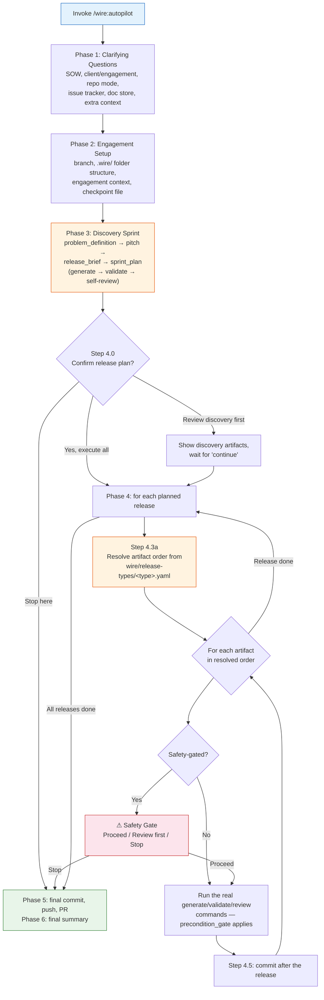

# Wire Autopilot

**Rewritten**: v4.0.0 — Autopilot now runs the same real `/wire:*` commands a person would type, in an order it resolves dynamically from each release type's `wire/release-types/*.yaml`, instead of a separate hardcoded copy of the process. This page describes the current behavior.

Wire Autopilot takes a Statement of Work (or proposal document) and any supporting materials, asks a small set of clarifying questions, then autonomously executes the entire engagement lifecycle — a discovery sprint (problem definition → pitch → release brief → sprint plan), followed by every delivery release that discovery identifies, end to end.

For each artifact, Autopilot generates it, validates it, and **self-reviews** it — there is no human review gate mid-run. **Safety gates** still pause execution before anything that could touch a live external system (activating data connectors, running SQL against a real database, deploying). Autopilot shares the same state files as manual commands (`status.md`, `execution_log.md`, plus its own `autopilot_checkpoint.md`) — you can switch between Autopilot and running commands by hand at any point, in either direction.

## Starting Autopilot

```
/wire:autopilot path/to/SOW.pdf
```

Or with no argument — Autopilot asks for the SOW path as its first question:

```
/wire:autopilot
```

There is no `--phase`, `--resume`, or `--dry-run` flag. Re-invoking the same command on an engagement that already has work in progress resumes automatically — see [Resuming](#resuming) below.

## How it works



### Phase 1: Clarifying questions

Asked in chat, one at a time, before anything is written to disk:

1. **SOW file path** (unless given as the command argument)
2. **Client name, engagement name, engagement lead**
3. **Repo mode** — combined (default, `.wire/` inside the client's code repo) or a dedicated delivery repo
4. **Issue tracker** — Jira, Linear, both, or none, with the same follow-up questions `/wire:new` asks (project key/mode, team identifier, etc.)
5. **Document store** — Confluence, Notion, both, or none, with the same space-key/parent-page follow-ups
6. **Additional supporting documents and context** — org charts, transcripts, architecture notes, technology/naming preferences

Autopilot then enters Plan Mode, presents the full execution plan (configuration, phase sequence, safety gates, shell operations it needs pre-authorized), and waits for your approval before going autonomous.

### Phase 2: Engagement setup

Creates the feature branch (if you're on `main`/`master`), the two-tier `.wire/engagement/` + `.wire/releases/01-discovery/` structure, copies the SOW and supporting docs in, sets up issue tracker and document store integrations if configured, and writes `.wire/autopilot_checkpoint.md` — a running, human-readable summary of engagement context and progress that Autopilot (and you) can read back later.

### Phase 3: Discovery sprint

Runs `discovery_shape_up`'s four artifacts — problem definition → pitch → release brief → sprint plan — using the exact same order-resolution and self-review mechanism Phase 4 uses (see below). Where a generate spec would normally pause for a human to fill something in (a `pitch`'s appetite call, a `sprint_plan`'s velocity assumption), Autopilot infers it from the SOW rather than waiting: appetite from the stated timeline, points from a 5-points-per-consultant-day assumption with a 20% buffer, and so on — always sourced from what the spec itself asks for, never a separately maintained shadow copy of that logic.

The sprint plan's "Downstream Releases" table is the canonical list of what Phase 4 executes. After discovery is approved, Autopilot confirms the plan with you once — `AskUserQuestion` with three options: proceed with all releases, review the discovery artifacts first, or stop here entirely.

### Phase 4: Delivery release execution

For each planned release, Autopilot creates the release folder and `status.md`, then resolves the artifact order and runs it:

**Order resolution isn't hardcoded anywhere in `autopilot.md`.** It reads `status.md`'s `project_type`, loads that release type's `wire/release-types/<type>.yaml`, flattens every phase's artifacts into one list, and topologically sorts by `depends_on` (tie-broken by `sequence`). This is the same file the [precondition gate](../getting-started/core-concepts#the-precondition-gate) reads at runtime for every artifact regardless of whether Autopilot or a person is driving — so if a release type's YAML changes via a `wire-process-registry` PR, Autopilot's execution order picks it up automatically, with nothing in `autopilot.md` itself needing an update. See [The Process and Data Model Registries](./registries) for how that YAML gets to this repo.

For each artifact in the resolved order, Autopilot runs the actual `/wire:{command}-generate`, `/wire:{command}-validate` (where one exists — `mockups`, `uat`, and `workshops` don't have a validate step), and `/wire:{command}-review` commands — not a paraphrase of their logic, the real command files, with their own Auto-Delegation and Post-Execution Hooks running unchanged.

**Illustrative resolved order** for the release types currently defined:

| Type | Resolved order (from its `wire/release-types/*.yaml`) |
|------|--------|
| `full_platform` | requirements → conceptual_model → pipeline_design → data_model → mockups → pipeline → dbt → semantic_layer → dashboards → **orchestration** → data_quality → uat → deployment → training → documentation |
| `pipeline_only` | requirements → pipeline_design → pipeline → data_quality → deployment |
| `dbt_development` | requirements → data_model → dbt → semantic_layer → data_quality → deployment |
| `dashboard_extension` | requirements → mockups → dashboards → training |
| `dashboard_first` | requirements → conceptual_model → mockups → viz_catalog → data_model → seed_data → dashboards → data_refactor → dbt → semantic_layer → data_quality → uat → deployment |
| `enablement` | training → documentation |
| `platform_migration` | ingestion_audit → db_object_audit → security_audit → dbt_audit → orchestration_audit → migration_inventory → migration_strategy → target_setup → ingestion_migration → dbt_migration → orchestration_migration → equivalency_validation → cutover → migration_report |

Treat this table as a snapshot, not a contract — the YAML is the source of truth and can change independently of this page.

### Self-review, not human review

Every artifact's real `*-review.md` spec is written for a live human — it calls `AskUserQuestion` and waits. Autopilot can't wait, but it also doesn't maintain a separate copy of "what good looks like" per artifact. Instead it reads the real review spec in full, follows every non-interactive step exactly as written, and at the one or two points where the spec would ask a person a question, evaluates the spec's own stated criteria against the artifact itself and decides. It writes `status.md` exactly as a human approval would, except `reviewed_by: "Wire Autopilot (self-review)"`. If it decides `changes_requested`, it regenerates and re-reviews — up to two cycles before logging the artifact as blocked rather than looping.

Because self-review reads the real spec every time, a review's criteria changing later (via a `wire-process-registry` PR) changes what self-review checks for automatically.

### Safety gates

Autopilot pauses before any artifact that could touch a live external system:

| Gated artifact | Risk |
|----------------|------|
| `pipeline` | Activates real data connectors (Fivetran, Airbyte) that begin replicating from production sources |
| `data_refactor` | Switches dbt models from seed data to real client data sources |
| `data_quality` | Runs SQL-based tests against a real database |
| `deployment` | Generates deployment scripts that, if executed, affect a live environment |
| *(platform_migration only)* `target_setup`, `ingestion_migration`, `orchestration_migration`, `cutover` | Provisions or cuts over a real target platform |

At each gate, Autopilot presents everything completed so far and a risk-specific warning, then asks: **Proceed**, **Review first** (show all generated files, then wait for "continue"), or **Stop here** (commit progress, produce the final summary, exit). This list is Autopilot's own policy about which steps are risky enough to pause for — it's independent of the release-type YAML.

### If a precondition gate blocks anyway

If order resolution worked correctly, every artifact's [precondition gate](../getting-started/core-concepts#the-precondition-gate) should pass silently by the time Autopilot reaches it — a correct topological sort guarantees that. If one blocks anyway, that's a real structural problem (a resolution bug, a manually-edited `status.md` that regressed something), not routine friction. Autopilot does **not** self-override — the gate's override contract requires a real person's name and reason, which Autopilot cannot supply on someone else's behalf. It pauses with the same three-option pattern as a safety gate (override now / let me investigate / stop here) and logs the block for later diagnosis.

## Resuming

Re-run the exact same command in the same repo — no flag needed:

```
/wire:autopilot
```

Autopilot checks `.wire/engagement/context.md`, `.wire/autopilot_checkpoint.md`, and each release's `status.md`, skips discovery if all four artifacts are already approved, and resumes from the first incomplete artifact in the first incomplete release. It never re-generates an artifact that's already `generate: complete` / `review: approved`.

**By default it does not stop after one release.** Left alone, it keeps going through every planned release in sequence. If you only want it to attempt the next release and then stop, say so explicitly when you invoke it (e.g. "only execute release 03, then stop and report before touching 04") — there's no built-in single-release flag.

## Phase 5–6: Wrap-up

Once every planned release is processed (or Autopilot stops early), it stages and commits any remaining changes, pushes the branch, and — if `gh` is available — opens a pull request summarizing every release and artifact. It then prints a final summary: overall statistics, any blocked artifacts with resolution steps, and concrete next steps (review the PR, share discovery artifacts for client sign-off, run `dbt run` against real data, and so on).

## What Autopilot cannot do

- Approve its own review artifacts on anyone else's behalf in a way that bypasses the precondition gate's override contract — a block that shouldn't have happened always pauses for a real person
- Execute destructive or irreversible steps without pausing — safety gates apply regardless of how far into a run Autopilot is
- Invent an artifact order for a release type with no `wire/release-types/<type>.yaml` — it stops and tells you which type has no process definition rather than guessing
