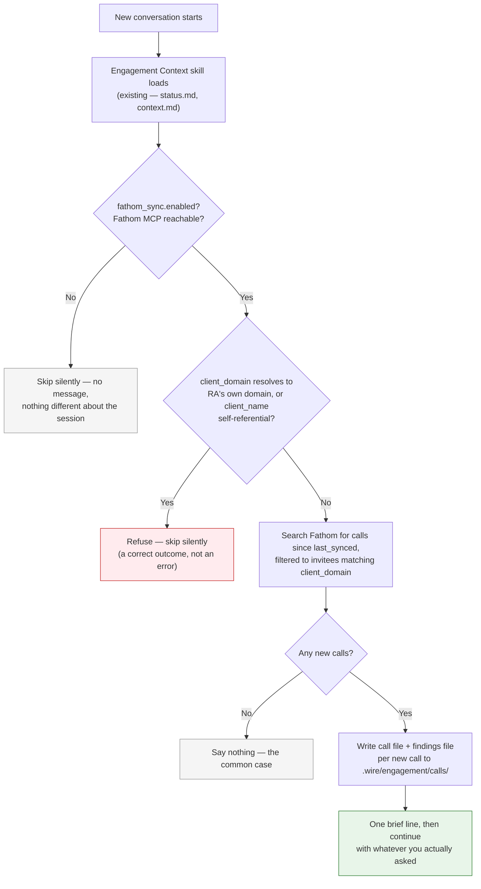

# Fathom Call Sync

**Introduced**: v4.0.0

Wire pulls new Fathom call transcripts for the engagement's client into `.wire/engagement/calls/` automatically, once per session, with a genuine analytical findings write-up per call — no need to remember to run anything, and no separate opt-in question.

This is different from `/wire:utils-meeting-context`, which review commands already call for a live, ad-hoc Fathom search scoped to whichever artifact is under review. That search never persists anything. Fathom Call Sync persists every new call as a durable, committed file, once, so the whole team has it later — and `utils-meeting-context`'s own searches can find it locally too, without re-querying Fathom.

## On by default, once it's safe to be

`/wire:new` asks for the client's email domain as a normal part of setting up the engagement, alongside the client name. Giving one turns this on automatically:

```yaml
# .wire/engagement/context.md
fathom_sync:
  enabled: true
  client_domain: "acme.com"   # required — matches calendar invitees on each call
  last_synced: null           # updated automatically after each sync
```

Leave the domain blank and it stays off. There's deliberately no fallback to searching by `client_name` as free text — a text search on a company name can't reliably tell "this specific client" apart from any other meeting that happens to mention the same words, and being on by default only makes sense because the domain filter is narrow enough to trust.

### Safeguard against internal RA engagements

If the domain given resolves to Rittman Analytics' own domain (`rittmananalytics.com`), or the client name looks self-referential ("Rittman Analytics", "RA"), Wire **refuses to enable Fathom Sync**, with a clear explanation, regardless of what was typed. RA's own domain is on every meeting RA has — internal or client-facing — so it can't narrow anything, and enabling it anyway would pull unrelated (potentially confidential) internal meetings into a repo, including a client-facing one under `repo_mode: combined`.

This check isn't only at setup — `specs/utils/fathom_sync.md`'s Step 2 re-runs it on every invocation, automatic or manual, so a later hand-edit to `context.md` reintroducing an RA domain gets caught too.

## What happens each session



The **Fathom Sync skill** activates once per new conversation, right after the existing Engagement Context skill loads (same "once per session" mechanism, kept as a separate skill deliberately — Engagement Context is meant to stay fast, and a Fathom sync with a real analytical findings pass can be genuinely slow).

:::note Claude Code only
Skills are a Claude Code plugin mechanism with no Gemini CLI equivalent. Gemini users get this via the manual command below instead of the automatic per-session pull.
:::

## Running it manually

```bash
/wire:utils-fathom-sync [--after YYYY-MM-DD] [--before YYYY-MM-DD] [--limit N] [--dry-run] [--no-findings]
```

Always runs when explicitly invoked, regardless of `fathom_sync.enabled` — running the command is itself the consent. The internal-RA-domain safeguard still applies unconditionally, though: even a manual, explicit invocation is refused if `client_domain` resolves to Rittman Analytics' own domain. Useful for a wider backfill than the automatic per-session pull's incremental window, or as the primary path for Gemini CLI users.

| Flag | Default | Use it for |
|------|---------|------------|
| `--after` | `last_synced`, or engagement start date | Pull further back than the automatic incremental window |
| `--before` | today | Bound the window on the other end |
| `--limit` | 50 | Cap results per search page |
| `--dry-run` | off | Preview what would be fetched without writing anything |
| `--no-findings` | off | Pull raw call files only, skip the analytical write-up |

## What gets written

Per new call, two files land in `.wire/engagement/calls/`:

- **`YYYY-MM-DD_<title>.md`** — front-matter (recording ID, URL, attendees) plus summary, action items, and full transcript.
- **`YYYY-MM-DD_<title>_findings.md`** — a genuine analytical pass, not a mechanical extraction. Before writing, it reads 2–3 of the most recent existing findings files to match voice, depth, and structure, then synthesises what changed, what was decided, and what it means for downstream artifacts — connecting to prior sessions where the conversation builds on or reverts earlier decisions, attributing key quotes, and skipping small talk.

Existing files are never overwritten — a call already on disk is skipped on every subsequent sync.

See [`wire/specs/utils/fathom_sync.md`](https://github.com/rittmananalytics/wire/blob/main/wire/specs/utils/fathom_sync.md) for the exact workflow, and [`wire/skills/fathom-sync/SKILL.md`](https://github.com/rittmananalytics/wire/blob/main/wire/skills/fathom-sync/SKILL.md) for the activation trigger.
