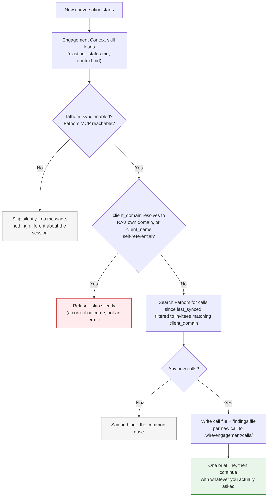

# Fathom Call Sync

**Introduced**: v4.0.0

Most engagements produce a steady run of recorded client calls, and the decisions taken on them have a way of living only in the memory of whoever was on the call, so that a colleague joining the release a month later has no record of why the scope changed or who agreed to it. Wire therefore pulls new Fathom call transcripts for the engagement's client into `.wire/engagement/calls/` automatically, once per session, together with a genuine analytical findings write-up for each call, and there is no need to remember to run anything and no separate opt-in question.

How does this differ from `/wire:utils-meeting-context`? That utility is what review commands already call for a live, ad-hoc Fathom search scoped to whichever artifact is under review, and that search never persists anything. Fathom Call Sync, by contrast, persists every new call as a durable, committed file, once, so that the whole team has it later, and `utils-meeting-context`'s own searches can find it locally too, without re-querying Fathom. In this page we will look at how the sync is switched on, the safeguard that stops it running against RA's own domain, what happens at the start of each session, how you run it manually and what it writes.

## On by default, once it's safe to be

`/wire:new` asks for the client's email domain as a normal part of setting up the engagement, alongside the client name, and giving one turns this on automatically:

```yaml
# .wire/engagement/context.md
fathom_sync:
  enabled: true
  client_domain: "acme.com"   # required - matches calendar invitees on each call
  last_synced: null           # updated automatically after each sync
```

Leave the domain blank and it stays off. There is deliberately no fallback to searching by `client_name` as free text, because a text search on a company name cannot reliably tell "this specific client" apart from any other meeting that happens to mention the same words, and being on by default only makes sense because the domain filter is narrow enough to trust.

### Safeguard against internal RA engagements

What if the domain given is Rittman Analytics' own? If the domain resolves to `rittmananalytics.com`, or the client name looks self-referential ("Rittman Analytics", "RA"), Wire **refuses to enable Fathom Sync**, with a clear explanation, regardless of what was typed. RA's own domain is on every meeting RA has, internal or client-facing, so it cannot narrow anything, and enabling it anyway would pull unrelated (potentially confidential) internal meetings into a repo, including a client-facing one under `repo_mode: combined`.

This check is not only at setup, either: Step 2 of `specs/utils/fathom_sync.md` re-runs it on every invocation, automatic or manual, so that a later hand-edit to `context.md` reintroducing an RA domain gets caught too.

## What happens each session


```mermaid
flowchart TB
    START["New conversation starts"]
    EC["Engagement Context skill loads\n(existing - status.md, context.md)"]
    CHECK{"fathom_sync.enabled?\nFathom MCP reachable?"}
    SKIP["Skip silently - no message,\nnothing different about the session"]
    SAFE{"client_domain resolves to\nRA's own domain, or client_name\nself-referential?"}
    REFUSE["Refuse - skip silently\n(a correct outcome, not an error)"]
    SEARCH["Search Fathom for calls since last_synced,\nfiltered to invitees matching client_domain"]
    NONE{"Any new calls?"}
    NOTHING["Say nothing - the common case"]
    WRITE["Write call file + findings file\nper new call to .wire/engagement/calls/"]
    REPORT["One brief line, then continue\nwith whatever you actually asked"]

    START --> EC --> CHECK
    CHECK -->|No| SKIP
    CHECK -->|Yes| SAFE
    SAFE -->|Yes| REFUSE
    SAFE -->|No| SEARCH --> NONE
    NONE -->|No| NOTHING
    NONE -->|Yes| WRITE --> REPORT

    style SKIP fill:#f5f5f5,stroke:#999
    style REFUSE fill:#ffebee,stroke:#c62828
    style NOTHING fill:#f5f5f5,stroke:#999
    style REPORT fill:#e8f5e9,stroke:#2e7d32
```

The **Fathom Sync skill** activates once per new conversation, right after the existing Engagement Context skill loads. It uses the same "once per session" mechanism but is kept as a separate skill deliberately, because Engagement Context is meant to stay fast, and a Fathom sync with a real analytical findings pass can be genuinely slow.

:::note Claude Code only
Skills are a Claude Code plugin mechanism with no Gemini CLI equivalent. Gemini users get this via the manual command below instead of the automatic per-session pull.
:::

## Running it manually

```bash
/wire:utils-fathom-sync [--after YYYY-MM-DD] [--before YYYY-MM-DD] [--limit N] [--dry-run] [--no-findings]
```

The command always runs when explicitly invoked, regardless of `fathom_sync.enabled`, because running the command is itself the consent. The internal-RA-domain safeguard still applies unconditionally, though: even a manual, explicit invocation is refused if `client_domain` resolves to Rittman Analytics' own domain. You will find the manual command useful for a wider backfill than the automatic per-session pull's incremental window, or as the primary path if you are a Gemini CLI user.

| Flag | Default | Use it for |
|------|---------|------------|
| `--after` | `last_synced`, or engagement start date | Pull further back than the automatic incremental window |
| `--before` | today | Bound the window on the other end |
| `--limit` | 50 | Cap results per search page |
| `--dry-run` | off | Preview what would be fetched without writing anything |
| `--no-findings` | off | Pull raw call files only, skip the analytical write-up |

## What gets written

For each new call, two files land in `.wire/engagement/calls/`:

- **`YYYY-MM-DD_<title>.md`**: front-matter (recording ID, URL, attendees) plus summary, action items and full transcript.
- **`YYYY-MM-DD_<title>_findings.md`**: a genuine analytical pass, not a mechanical extraction. Before writing, it reads two or three of the most recent existing findings files to match voice, depth and structure, then synthesises what changed, what was decided and what it means for downstream artifacts, connecting to prior sessions where the conversation builds on or reverts earlier decisions, attributing key quotes and skipping small talk.

Existing files are never overwritten, and a call already on disk is skipped on every subsequent sync.

See [`wire/specs/utils/fathom_sync.md`](https://github.com/rittmananalytics/wire/blob/main/wire/specs/utils/fathom_sync.md) for the exact workflow, and [`wire/skills/fathom-sync/SKILL.md`](https://github.com/rittmananalytics/wire/blob/main/wire/skills/fathom-sync/SKILL.md) for the activation trigger.
