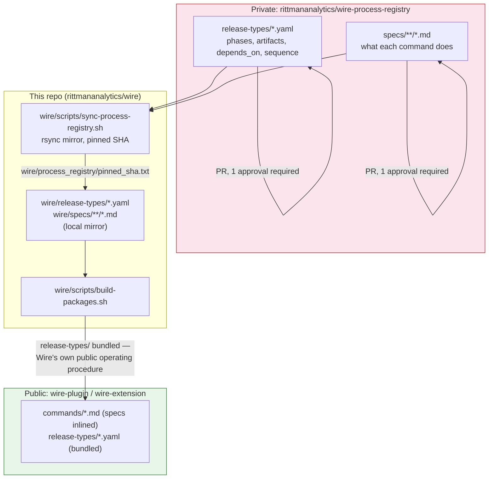
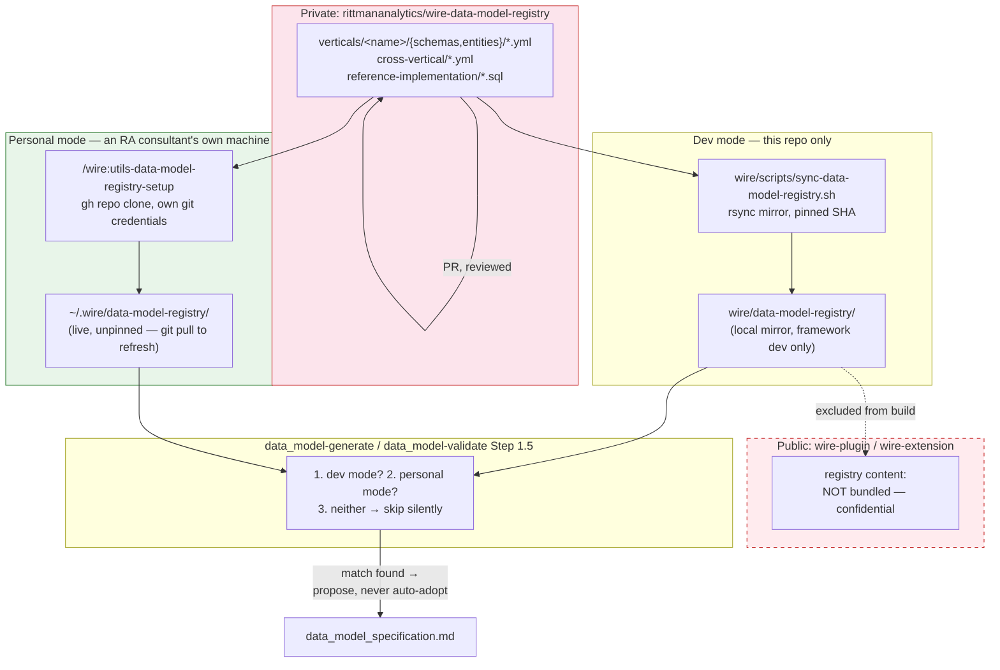

# The Process and Data Model Registries

**Introduced**: v4.0.0

Two things that look similar from the outside — both are private GitHub repos, both get synced into this repo as pinned local mirrors, both feed into what a Wire command does at runtime — but exist for opposite reasons and get distributed in opposite ways. This page explains both and how they relate.

## wire-process-registry: how Wire defines itself

Before v4.0.0, release-type sequencing (`full_platform` runs artifacts in this order, `dashboard_extension` in that order) and the command specs themselves lived directly inside this repo's `wire/release-types/` and `wire/specs/` directories, edited in place, built straight into the plugin.

As of v4.0.0, both directories are a **synced, pinned mirror** of the private `rittmananalytics/wire-process-registry` repo — the single source of truth for what a release type's phases and dependency graph look like, and for what each command actually does. Editing happens there, via a branch-protected PR (one required approval, admin enforcement on), not directly in this repo.

**Why externalize it at all?** Two reasons. First, release-type YAML and command specs are the actual mechanism now — the [precondition gate](../getting-started/core-concepts#the-precondition-gate) reads `wire/release-types/<type>.yaml` at runtime to know what an artifact depends on, and [Autopilot](./autopilot) reads the same file to resolve execution order. Getting this wrong is no longer a documentation slip, it's a broken engagement. A branch-protected repo with mandatory review is a stronger guarantee than "someone remembers to be careful editing YAML in the main repo." Second, it separates *what Wire's process is* from *how Wire is packaged and distributed* — the same release-type definition should produce identical behavior whether you're running the framework's own dev copy or an installed plugin three versions behind.

**Never fetched live.** `wire/scripts/sync-process-registry.sh` is the only sync point — it mirrors both directories via `rsync --delete` and records the resolved commit SHA in `wire/process_registry/pinned_sha.txt`. Every build works offline against whatever was last explicitly synced and committed. There's no risk of a Wire command silently changing behavior because someone merged a PR in the registry repo five minutes ago — it has zero effect until the next sync.

**Fully public once bundled.** Unlike the data model registry below, there's no confidentiality concern here — release-type sequencing and command instructions are Wire's own public operating procedure, already visible to anyone reading the plugin's `commands/*.md` files. `build-packages.sh` bundles `wire/release-types/*.yaml` straight into both the Claude Code plugin and the Gemini CLI extension.

See [`wire/schemas/release-type-schema.md`](https://github.com/rittmananalytics/wire/blob/main/wire/schemas/release-type-schema.md) and [`wire/schemas/command-schema.md`](https://github.com/rittmananalytics/wire/blob/main/wire/schemas/command-schema.md) for the exact contract each file follows.

## wire-data-model-registry: optional canonical data models

`rittmananalytics/wire-data-model-registry` is a different kind of private repo — not process definitions, but a library of canonical entity/schema YAML and worked-example dbt SQL for six industry verticals (`education`, `insurance`, `manufacturing`, `marketplace`, `retail`, `subscription-commerce`) plus cross-vertical patterns (web event tracking, GA4 ecommerce, marketing attribution, CRM identity resolution, revenue recognition). Its content is generalized from real RA client engagements — genuinely confidential business IP, not something to hand to just anyone who installs the plugin.

`data_model-generate` and `data_model-validate` check for it automatically — no opt-in flag — and if a mirror is present and the engagement's requirements plausibly match a vertical, `data_model-generate` proposes the canonical entity list as a starting baseline (never auto-adopted; always a yes/adapt/no decision) and `data_model-validate` diffs the result against it advisorily (never a hard gate). If neither location exists, or nothing plausibly matches, both commands skip silently — the default, expected outcome for most engagements and for anyone outside RA.

### Why this one is distributed completely differently

`wire-plugin` and its extension counterpart are **public** repos — anyone can install them. Bundling `wire/data-model-registry/` into the distributable package the same way `release-types/` is bundled would hand this confidential content to every installer, RA staff or not, with no way to gate access after the fact. That's a real leak, not a graceful-degradation edge case — which is why the two registries, despite looking structurally similar, are handled oppositely once synced:

| | wire-process-registry | wire-data-model-registry |
|---|---|---|
| Content | Release-type YAML, command specs | Canonical entity/schema YAML, reference dbt SQL |
| Confidentiality | Public (Wire's own operating procedure) | Proprietary (real client engagement content) |
| Sync into this repo | `wire/release-types/`, `wire/specs/` (pinned) | `wire/data-model-registry/` (pinned, dev mode only) |
| Bundled into public plugin? | **Yes** | **No — never** |
| How an end user gets it | Comes with the plugin | `/wire:utils-data-model-registry-setup` — a separate, live `gh repo clone` gated by the consultant's own GitHub access |
| Update mechanism | Pinned SHA, explicit re-sync | Dev mirror: pinned SHA. Personal copy: live `git pull`, whenever the consultant wants |

The personal-mode path deliberately breaks Wire's usual "never fetch live" discipline (see above) — `/wire:utils-data-model-registry-setup` runs a real, unpinned `gh repo clone`/`git pull` against the private repo. That's fine here because it's an individual, one-person operation gated by that person's own GitHub org membership, not a framework-wide sync that everyone inherits at once. If the clone fails, the command reports it plainly as an access issue, not a bug — most people running Wire, and even most RA staff without registry access, will see this outcome and it changes nothing else about how the framework behaves.

See [`wire/schemas/data-model-registry.md`](https://github.com/rittmananalytics/wire/blob/main/wire/schemas/data-model-registry.md) for the exact detection and proposal logic, and [`wire/specs/design/data_model/generate.md`](https://github.com/rittmananalytics/wire/blob/main/wire/specs/design/data_model/generate.md) Step 1.5 for how a match is proposed and carried into the generated model spec.

## The one thing they share

Both follow the same "pin, don't fetch live" philosophy for the copies that live inside this repo — a sync script, a pinned commit SHA, and an explicit re-run whenever the maintainers want to pull in changes. The difference is entirely about what happens *after* that: one gets compiled straight into a public package, the other stops at a private mirror and reaches an end user, if at all, through a completely separate, individually-gated path.
