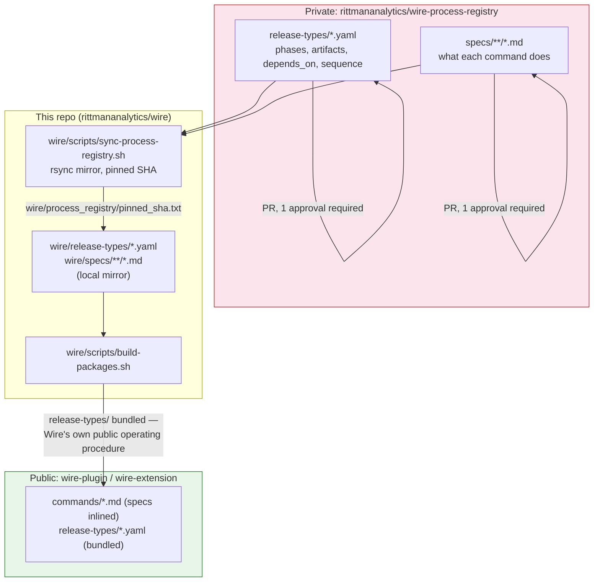
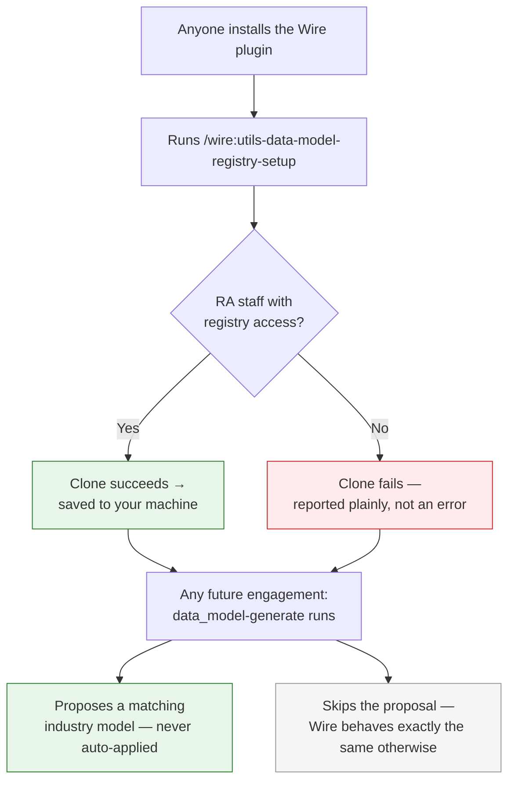

# The Process and Data Model Registries

**Introduced**: v4.0.0

Wire depends on two different kinds of specialised knowledge to do its job, and as of v4.0.0 both live outside this repo, in their own private GitHub repos.

The first is about *how Wire works*: the exact sequence a release type follows, and what each command actually does. The second is about *what Wire knows*: canonical data models built from RA's collective experience across real client engagements, that a new engagement can optionally draw on for a head start instead of starting from a blank page.

Those two can look alike from the outside — both are private repos, both get pulled into this repo as a local copy — but they exist for opposite reasons, which is exactly why they get treated so differently once they're here. The process knowledge is Wire's own operating procedure. Nothing about it is secret, but now that it can actually *enforce* a release's process rather than just describe it (see the [precondition gate](../getting-started/core-concepts#the-precondition-gate)), a mistake in it doesn't just look wrong in a doc — it breaks a real engagement. So changing it now goes through a proper review, in a repo dedicated to exactly that. The data model knowledge is the opposite case: it's built from real client work, so it's genuinely confidential, and handing it to anyone who installs the public Wire plugin would be a real leak, not a rounding error. So it never ships inside the plugin at all — only RA staff can pull it, and only onto their own machine, using their own GitHub access.

The rest of this page covers both in detail.

## wire-process-registry: how Wire defines itself

Before v4.0.0, release-type sequencing (`full_platform` runs artifacts in this order, `dashboard_extension` in that order) and the command specs themselves lived directly inside this repo's `wire/release-types/` and `wire/specs/` directories, edited in place, built straight into the plugin.

As of v4.0.0, both directories are a **synced, pinned mirror** of the private [`rittmananalytics/wire-process-registry`](https://github.com/rittmananalytics/wire-process-registry) repo — the single source of truth for what a release type's phases and dependency graph look like, and for what each command actually does. Editing happens there, via a branch-protected PR (one required approval, admin enforcement on), not directly in this repo. (Private repo — accessible to RA staff with GitHub org access; the link is here for reference even if you can't open it.)



### What a release-type definition actually looks like

Here's `pipeline_only.yaml` in full — one of the smaller release types, which makes it a good example. This is real content from `wire-process-registry`, not illustrative:

```yaml
wire_schema: "1.0"
id: pipeline_only
name: "Pipeline Only"
description: "Data pipeline development only — ingestion architecture, pipeline implementation, and data quality testing, without a dbt/semantic-layer/BI build."
applicable_when:
  - "Client needs a data pipeline built but transformation/BI is out of scope or handled separately"
  - "Scope is limited to getting data reliably into the warehouse"

phases:
  - id: requirements
    name: "Requirements"
    description: "Capture and sign off the requirements specification from the SoW and stakeholder input"
    required: true
    requires_phase: null
    artifacts:
      - id: requirements
        command: requirements
        required: true
        sequence: 1
        depends_on: []

  - id: design
    name: "Design"
    description: "Design the pipeline architecture"
    required: true
    requires_phase: requirements
    artifacts:
      - id: pipeline_design
        command: pipeline_design
        required: true
        sequence: 1
        depends_on:
          - artifact: requirements
            action: review
            outcome: approved

  - id: development
    name: "Development"
    description: "Implement the pipeline"
    required: true
    requires_phase: design
    artifacts:
      - id: pipeline
        command: pipeline
        required: true
        sequence: 1
        depends_on:
          - artifact: pipeline_design
            action: review
            outcome: approved

  - id: testing
    name: "Testing"
    description: "Data quality tests on the pipeline output"
    required: true
    requires_phase: development
    artifacts:
      - id: data_quality
        command: data_quality
        required: true
        sequence: 1
        depends_on:
          - artifact: pipeline
            action: review
            outcome: approved

  - id: deployment
    name: "Deployment"
    description: "Deploy the pipeline to production and sign off"
    required: true
    requires_phase: testing
    artifacts:
      - id: deployment
        command: deployment
        required: true
        sequence: 1
        depends_on:
          - artifact: data_quality
            action: validate
            outcome: PASS
```

What each element is for:

| Element | Meaning |
|---|---|
| `wire_schema` | Which version of `release-type-schema.md` this file conforms to — lets the schema itself evolve without breaking every existing release type at once. |
| `id` | The machine-readable identifier used everywhere else in Wire — `status.md`'s `project_type` field, `/wire:new`'s release-type selector, the precondition gate's and Autopilot's lookup key (`wire/release-types/<id>.yaml`). |
| `name` / `description` | Human-readable label and one-line summary, shown when a consultant is choosing a release type in `/wire:new`. |
| `applicable_when` | Plain-language guidance on when this release type fits — not machine-enforced, just documentation baked into the same file rather than living separately. |
| `phases[]` | The ordered top-level stages — Requirements → Design → Development → Testing → Deployment here. Coarser-grained than artifacts; mainly organisational. |
| `phases[].requires_phase` | Which phase must fully complete before this one can start — phase-level ordering, one level up from the artifact-level dependencies below. |
| `phases[].artifacts[]` | The actual deliverables produced in that phase — this is the part with real teeth. |
| `artifacts[].id` | The artifact's identifier, matching what appears in `status.md` (e.g. `pipeline_design`, `data_quality`). |
| `artifacts[].command` | Which command family handles this artifact — resolves to `/wire:{command}-generate`, `-validate`, `-review`. |
| `artifacts[].required` | Whether this artifact must be completed for the release type to be considered done. (Some artifacts elsewhere, like `mockups` in `full_platform`, are `false` — optional.) |
| `artifacts[].sequence` | A tie-breaker: when two artifacts in the same phase have no dependency relationship between them, `sequence` decides which runs first. |
| `artifacts[].depends_on[]` | **The actual dependency graph.** Each entry names an upstream `artifact`, the gate (`action`: `generate`/`validate`/`review`) it must have passed, and the required `outcome` (`complete`/`PASS`/`approved`). `pipeline_design` here can't start until `requirements`' review is `approved`; `deployment` can't start until `data_quality`'s validate is `PASS`. |

This `depends_on` graph is precisely what the [precondition gate](../getting-started/core-concepts#the-precondition-gate) checks before letting a command run, and what [Autopilot](./autopilot) topologically sorts to decide execution order. Nothing else in Wire needs a separate copy of "what comes after what" — it's all right here.

**Why externalize it at all?** Two reasons. First, release-type YAML and command specs are the actual mechanism now — the [precondition gate](../getting-started/core-concepts#the-precondition-gate) reads `wire/release-types/<type>.yaml` at runtime to know what an artifact depends on, and [Autopilot](./autopilot) reads the same file to resolve execution order. Getting this wrong is no longer a documentation slip, it's a broken engagement. A branch-protected repo with mandatory review is a stronger guarantee than "someone remembers to be careful editing YAML in the main repo." Second, it separates *what Wire's process is* from *how Wire is packaged and distributed* — the same release-type definition should produce identical behavior whether you're running the framework's own dev copy or an installed plugin three versions behind.

**Never fetched live.** `wire/scripts/sync-process-registry.sh` is the only sync point — it mirrors both directories via `rsync --delete` and records the resolved commit SHA in `wire/process_registry/pinned_sha.txt`. Every build works offline against whatever was last explicitly synced and committed. There's no risk of a Wire command silently changing behavior because someone merged a PR in the registry repo five minutes ago — it has zero effect until the next sync.

**Fully public once bundled.** Unlike the data model registry below, there's no confidentiality concern here — release-type sequencing and command instructions are Wire's own public operating procedure, already visible to anyone reading the plugin's `commands/*.md` files. `build-packages.sh` bundles `wire/release-types/*.yaml` straight into both the Claude Code plugin and the Gemini CLI extension.

See [`wire/schemas/release-type-schema.md`](https://github.com/rittmananalytics/wire/blob/main/wire/schemas/release-type-schema.md) and [`wire/schemas/command-schema.md`](https://github.com/rittmananalytics/wire/blob/main/wire/schemas/command-schema.md) for the exact contract each file follows.

## wire-data-model-registry: what RA has learned, made available to every engagement

When RA builds a data model for a client in a familiar industry — SaaS, retail, insurance, manufacturing, education, subscription commerce — it's rarely the first time RA has solved this kind of problem. There's a good instinct for what a solid `Customer` entity looks like for a SaaS business, what a `Policy` and `Claim` model needs to capture for insurance, what grain makes sense for subscription revenue. None of that experience has been available to Wire itself, though — every new engagement started from a blank page, even when the shape of the answer was already well understood.

[`wire-data-model-registry`](https://github.com/rittmananalytics/wire-data-model-registry) is where that experience now lives: a private library, organised by industry, of the entities RA typically expects to see, the kind of structure and grain that's worked well before, and real worked examples of how a similar model was actually built — not code to copy and paste, but a reference to learn the pattern from. (Private repo — accessible to RA staff with GitHub org access.)

**The value to a consultant**: when you start a data model for a client in one of these industries, Wire recognises the fit and offers this as a starting point — a genuine head start instead of reasoning up the whole thing from nothing. You can take it, adapt it, or ignore it entirely; it's always a suggestion, never something applied automatically. And once the model is built, Wire can also flag if something standard for that industry looks like it's missing — the way a colleague glancing over your shoulder might say "don't you normally need something for that in this kind of business?"

Because this comes from real client work, it's genuinely confidential — it's part of what makes RA's delivery experience valuable, not something to publish for anyone who installs the Wire plugin. So it's kept out of the public plugin entirely: it's never bundled in, and instead each RA consultant fetches it themselves, once, onto their own machine.

**Setup, once**: run `/wire:utils-data-model-registry-setup`. It clones the private registry to your machine using your own GitHub access — if you're not an RA staff member with access to it, this command simply isn't for you, and Wire behaves exactly the same either way. After that one-time setup, Wire finds it automatically on every future engagement — no need to opt in again, and no need to re-run the command unless you want to pull in updates.



### Why it isn't just part of the plugin

`wire-plugin` and its extension counterpart are **public** repos — anyone can install them. Bundling this registry into the plugin the way Wire's own process definitions are bundled (see above) would hand confidential, client-derived content to every installer, RA staff or not, with no way to gate access after the fact. That's a real leak, not an edge case — hence the separate, one-time setup step instead.

If the setup command fails, that's normal, not a bug — it just means you don't have access to the private repo, and Wire continues to work exactly as it does for anyone else without it.

## The one thing they share

Both follow the same "pin, don't fetch live" philosophy for the copies that live inside this repo — a sync script, a pinned commit SHA, and an explicit re-run whenever the maintainers want to pull in changes. The difference is entirely about what happens *after* that: one gets compiled straight into a public package, the other stops at a private mirror and reaches an end user, if at all, through a completely separate, individually-gated path.
