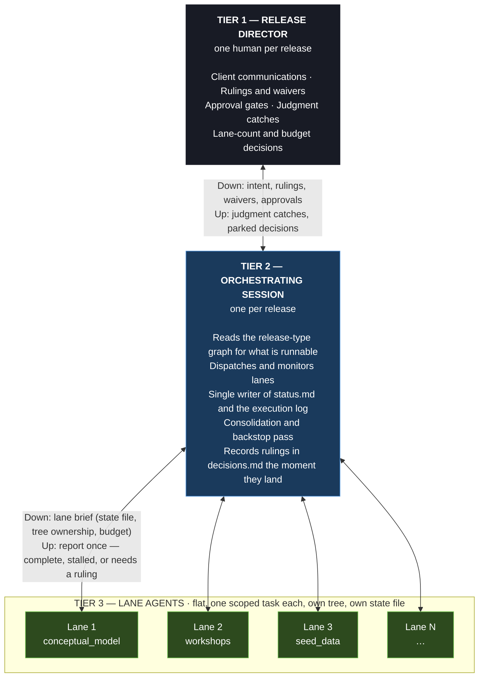

# The Release Director Model

**Introduced**: v4.0.0

If most of what you type into Wire is `start` and `status`, to find out where a release stands before you do anything to it, you are not alone. Wire ships 334 commands, and two usage reviews found that it is the command surface, not the method, that stops people using it:

| Observation | Where |
|---|---|
| Orientation commands (`start` 35 runs, `status` 19) were a third of all 182 executions | Migration engagement review, §3 |
| 969 of 1,646 free-form prompts were conversation, not commands | Second engagement review, §9 |
| Two client-side developers made 34 commits touching Wire artifacts and ran zero `/wire:` commands | Second engagement review, §9 |
| One client-side user ran `session-plan` 11 times and nothing else, on work `data_model-generate` and the `dbt-*` commands cover | Second engagement review, §8 |

On the migration engagement, the pattern that worked was not more commands. One consultant directed in prose while an agent ran the commands, and typed `/wire:` prompts fell from 4.98% to 0.91% of all prompts while Wire executions per typed prompt rose from 1.10 to 2.56. It follows, therefore, that the thing to change was who types, and from v4.0.0 that is how Wire works by default on Claude Code, on every release type.

This page sets the model out in full. We will look first at what changes and what does not, then at the three tiers and a worked session, then at how Wire decides what is runnable and how reviews, parked decisions, rulings and the budget work, before finishing with the lane contract, the release claim, how to turn the model off and how typed work is told apart from dispatched work in the record.

## What actually changes

**Nothing about the record.** Every step still runs the real Wire command, so
`status.md`, `execution_log.md`, the precondition gate, auto-validate, telemetry
and the artifacts on disk are identical whether a command was typed or
dispatched. What changes is who types, and the rest of this page is about the three parties who now share that job.

## The three tiers



Three tiers, then, and each has one job:

| Tier | Who | Duties |
|---|---|---|
| **Release director** | One human per release | States intent, makes rulings, approves at gates, sets the budget. Decides; does not execute. |
| **Orchestrating session** | One session per release | Computes what is runnable, dispatches lanes, single writer of `status.md` and `execution_log.md`, runs the consolidation pass, records rulings the moment they land. |
| **Lane agents** | 1 to 12 concurrent, flat | One scoped task each, in its own tree, with its own state file. Report once. |

The rules are specified in `specs/utils/director_operating_model.md`. The
`platform_migration` fleet model (`specs/utils/migration_fleet.md`) is now the
migration profile of it, and migration behaviour is unchanged.

## A worked session: `dashboard_first` from an empty repo

So what does this look like in practice? Here is what the director said, and what Wire ran, on a `dashboard_first` release started from an empty repo.

| You say | Wire does |
|---|---|
| "New engagement for Northwind Retail, store performance dashboards. SOW in `docs/sow.pdf`. No warehouse access for two weeks. Two lanes max, nothing against a warehouse, stop at decisions." | Reads the SOW, proposes `dashboard_first` / `seeded` **with the reason**, shows one confirmation block, asks the one open question. Runs `/wire:new`. Writes the budget block. |
| "Confirm. Skip business rules, agree at kickoff." | Writes ruling R-1 to `decisions.md`. |
| *(nothing, Wire continues)* | `requirements-generate` runs; auto-validate follows. One report: 14 requirements, PASS, 2 clarification markers, plus the client call that covers them. Frames the gate: approve now, or park. |
| "Approve internally, carry the markers to kickoff, prepare a workshop pack." | `requirements-review` records the approval. `workshops-generate` dispatched as a lane. |
| *(nothing)* | Requirements approval releases two: `conceptual_model` as a lane (its advisory business-rules gate satisfied by R-1, recorded), `mockups` in the foreground with you, because it needs your input. |
| "Approved." | `mockups-review`, then `viz_catalog-generate`. Lane report: conceptual model, 7 entities, PASS. |
| "Go. Report when done." | `data_model` and `seed_data` as two lanes, within budget. The data model lane parks on the registry proposal (PD-1). |
| "Adapt, inventory out of scope." | Records the ruling, clears PD-1. |

**Session close.** 14 Wire runs in the execution log, no typed commands and nine
director messages, seven of them decisions a consultant makes anyway. Two parked
decisions open the next session.

## What is runnable

How did Wire know, in that session, that the conceptual model and the mockups could start together but the data model had to wait? `specs/utils/runnable_set.md` reads the release-type YAML, the active profile,
`status.md` and `decisions.md`, and returns one state per artifact:

| State | Meaning |
|---|---|
| `runnable: generate` | The generate command can run now. |
| `runnable: validate` | Only where the generate command carries `auto_validate: false`. Otherwise validate already ran with generate, so a non-pass means re-generate. |
| `parked: needs ruling` | A director decision is needed. Every review edge is here. |
| `blocked: <unmet precondition>` | A blocking `depends_on` entry is unmet, named with its actual recorded value. |
| `not applicable` | Not part of this release under the active profile. |
| `complete` | Every present lifecycle step is done. |

`/wire:start`, `/wire:delegate`, `/wire:autopilot` and the orchestrating session
all read the same computation, so they cannot disagree about what comes next. This matters more than it might seem:
Autopilot used to keep its own copy, which is how its `full_platform` sequence
silently lost the `orchestration` artifact.

**Parallelism comes from the graph, not from item counts.** Two runnable
artifacts with no dependency between them are two lanes, up to
`budget.lanes_max`. An **interactive** artifact, one whose generate spec waits
on you, like `mockups` in `dashboard_first`, runs in the foreground, never as a
lane.

## Reviews are never run without a ruling

A review edge is never `runnable`, however far the work has got. At a review the orchestrator presents the
artifact summary, the validate result and the meeting or document-store context
the review spec already gathers, then asks for one of three answers:

| Answer | What runs | What is recorded |
|---|---|---|
| **Approve now** | `/wire:<artifact>-review` | Approval under your name, through the review spec's normal path |
| **Changes** | `generate` again | The change list in `decisions.md`, then the re-generate |
| **Park for client sign-off** | Nothing | A `parked_decisions` entry naming who is expected to sign off. No review row is written. |

## Parked decisions

A release can be waiting on more than one thing at once, which is why `status.md` carries a list rather than a single `paused_at` value:

```yaml
parked_decisions:
  - id: PD-1
    artifact: data_model
    kind: review
    question: "Approve now, or park for client sign-off?"
    parked_at: "2026-09-02 16:02"
    awaiting: "Retail ops lead"
```

`kind` is one of `review`, `ruling`, `registry_proposal`, `budget` or
`safety_gate`. **The first line of every session is the count of these and their
questions**, so that nothing waits unnoticed.

## Rulings

A decision goes into `decisions.md` **the moment it is given**, not when it is
used, and in a form the precondition gate reads:

```markdown
## R-3 | 2026-09-02 14:12 | Mark Rittman | skip business_rules
Applies to: conceptual_model.depends_on.business_rules (advisory)
Ruling: skip. Reason: agree metric definitions at kickoff, 2026-09-09.
```

An **advisory** gate whose ruling names both this artifact and this dependency
is satisfied without asking again, and the override log row cites the ruling id.

There are, however, three things a ruling cannot do:

- **Satisfy a blocking gate.** Ever. The recorded override in
  [the precondition gate](../getting-started/core-concepts#the-precondition-gate),
  a person's name and reason given at the time, is the only way past one.
- **Cover a different artifact's gate.** A decision to skip `business_rules`
  before `conceptual_model` says nothing about skipping it before `data_model`.
- **Waive by saying "wait".** A ruling that says to wait is a decision to stop.

A ruling in the file survives the session that gave it, whereas one held in conversation
memory does not, which is why it is written down first and used afterwards.

## Budget

The budget is optional and lives in `status.md`. You set it in prose, and Wire writes the block:

```yaml
budget:
  lanes_max: 2                 # concurrent lanes; default 4
  model_tier: default          # default | economy
  warehouse_spend: none        # none | estimate_required | cap:<amount>
  stop_at: decisions           # decisions | phase_end | never
  set_by: "Mark Rittman"
  set_at: "2026-09-02"
```

| Setting | Effect |
|---|---|
| `lanes_max` | `/wire:delegate` refuses to dispatch beyond it. Work queues in the runnable set's order. |
| `model_tier: economy` | Lanes dispatch on a lower-tier model. The consolidation pass runs regardless: the model choice changes how much it finds, not whether it runs. Independent of per-command [workload routing](./model-routing). |
| `warehouse_spend: none` | Refuses any lane whose command queries a warehouse, and says which and why. It never silently drops them. |
| `warehouse_spend: estimate_required` | The dry-run bound is the authorisation figure; overruns are disclosed in the lane's report. |
| `stop_at` | Where to stop: at the first parked decision, at the end of the phase or not at all. |

An absent block means the defaults, not a budget of zero. Token and API spend
are not observable in-session, so the budget cannot gate on them; measured
per-command token and cost figures land in the execution log after each turn
(see [the execution log](../getting-started/core-concepts#the-execution-log))
and inform the next budget, not the current dispatch.

## The lane contract

Every dispatch carries the lane contract, and every agent definition restates it. Each of its five rules exists because of something that went wrong on a real engagement, which is why the table gives the failure alongside the rule:

| Rule | Why (the observed failure) |
|---|---|
| Write progress to your state file after **each** completed item | Two hard usage-limit outages resumed with near-zero loss only because every lane had incremental state |
| Write only inside the directories the brief names; commit exactly those files | A broad commit from one lane swept up another's half-written state file and corrupted both resume points |
| **Do not write `status.md` or `execution_log.md`** | 46 commits in 24 hours across four people; one merge silently discarded 54 models of completed work |
| Do not spawn sub-agents below yourself | Nested fan-out caused two hard usage-limit outages in one day |
| Report once: complete, stalled or needs a ruling | Polling chatter burned context and tokens while the state files already held the answer |

The third rule is the change for linear release types. Outside orchestrated
mode, a delegated subagent still updates `status.md` itself, exactly as in 3.x.

**The consolidation pass is mandatory.** Before the orchestrator reports a
lane's artifact as ready for a ruling, it checks that the files exist, that validate ran
and its result matches the lane's claim, that `status.md` was not written by the
lane and that warehouse results have been re-checked against the warehouse rather than taken on the
lane's word.

## The release claim

What happens when two people open the same release? `status.md` records who is driving it:

```yaml
agents:
  mode: orchestrated
  coordinator_session:
    user: "Mark Rittman"
    session_id: "<claude session id>"
    branch: "feat/03-store-dashboards"
    claimed_at: "2026-09-02 14:05"
    last_write: "2026-09-02 15:40"
```

| Claim state | What a second session does |
|---|---|
| None | Claims it and proceeds |
| Yours, this session or an older one | Resumes. One person cannot contend with themselves. |
| Another user, written within 30 minutes | **Does not dispatch.** Offers join as reviewer, or move to another release. |
| Another user, no write for over 30 minutes | **Does not dispatch.** Offers take-over, join or move. |

A person typing a single command is a different case: they get a warning naming
the holder, and proceed. The claim stops agents colliding, not people working.

**One driver per release.** More than one person works at the engagement level, on
different releases and different branches. A second person on the same release is a
reviewer, or a **human lane**: they own a named tree, work in "you drive" mode
scoped to it, and their work returns through a pull request that the coordinating
session merges and records.

**Sessions end.** No long-running session is assumed. Lanes die with the session
that spawned them, and the resume contract makes that cost at most the in-flight
item. Work that must run unattended is a scheduled routine or a CI job, not a
lane.

## Which release you are working on

With two releases in flight, the old rule (most recently modified) silently
picked whichever was touched last. The order is now explicit:

1. A release named in your message or the command argument.
2. The release matching the current git worktree or branch.
3. The only release with a `status.md` write in the last seven days.
4. Otherwise **ask**, listing the candidates. Never guess between two.

Our recommendation is one git worktree and one session per active release, so that switching
context is switching terminal.

## Turning it off, per session or per engagement

What if you would rather type? There is no global switch, but there are four controls, resolving highest first:

| Level | Control | Effect |
|---|---|---|
| Runtime | Gemini CLI has no skills or agents | Resolves to `manual`, whatever anything else says |
| Conversation | Say **"you drive"** | `manual` for the rest of this session. "I'll drive", or any directive, hands it back. Both recorded as a `mode` row in the log. |
| Engagement | `orchestration.mode: manual` in `.wire/engagement/context.md` | Restores pre-4.0 behaviour exactly, including `/wire:start` printing the next action rather than offering to run it |
| Default | (none) | `orchestrated` on Claude Code |

Typing any `/wire:` command mid-session always works. The orchestrator re-reads
state afterwards and continues from it. **Every report ends with a line naming
the commands that ran**, and the reply itself leads with the outcome in plain
words, so a consultant who has never typed a command still learns what the thing
they approved is called without the command names becoming the headline.

## Attribution: telling typed from dispatched

This model drives typed-command counts down by design, and typed-prompt counts
were the adoption measure, so two changes keep the record readable.

`execution_log.md` rows gain two columns:

```markdown
| Timestamp | Command | Result | Detail | By | Session |
```

`By` is the git user. `Session` is `typed`, `orchestrator [id]`, a lane label
(`dbt-developer [staging 1/2]`) or `autopilot`. Rows written before v4.0.0 have
four data columns; they stay valid and are never rewritten, and an old row is
recorded as unknown rather than assumed to be typed.

Telemetry replaces the old hardcoded `autopilot: "false"` property with
`invoked_by`, carrying the same four values, read from the `WIRE_INVOKED_BY`
environment variable and defaulting to `typed`.

## What existing engagements get

`/wire:upgrade` adds `parked_decisions`, the expanded `agents` block and
`orchestration.mode` with defaults, and writes the profile field explicitly
where a release type has one and the release has been running on the default
implicitly. It deliberately does **not** write a `budget` block: an absent block
means no budget was set, and writing one would claim a decision nobody made.

Nothing changes for an existing engagement until a director gives a directive.

## Where the rules live

| Rule | Spec |
|---|---|
| Operating model, lane contract, claim, budget, parked decisions, co-existence | `specs/utils/director_operating_model.md` |
| What is runnable, and what runs in parallel | `specs/utils/runnable_set.md` |
| Rulings against advisory gates | `specs/utils/precondition_gate.md` Step 2a |
| Log columns, ordering, legacy rows | `specs/utils/execution_log.md` |
| `platform_migration` lane roster and stage ladder | `specs/utils/migration_fleet.md` |
| The orchestrating session in Claude Code | `wire/skills/release-director/SKILL.md` |

Each of the first four has a behavioural test; see [Testing](../reference/testing).

## See also

- [Tutorial: Looker to Omni Migration](../tutorials/looker-to-omni-migration): a batched release type run under this model, with every command Wire runs named
- [Wire Agents](./wire-agents): the thirteen specialists that run as lanes
- [Wire Autopilot](./autopilot): the fully autonomous end of the range
- [Core Concepts](../getting-started/core-concepts): the precondition gate, auto-validate, profiles
