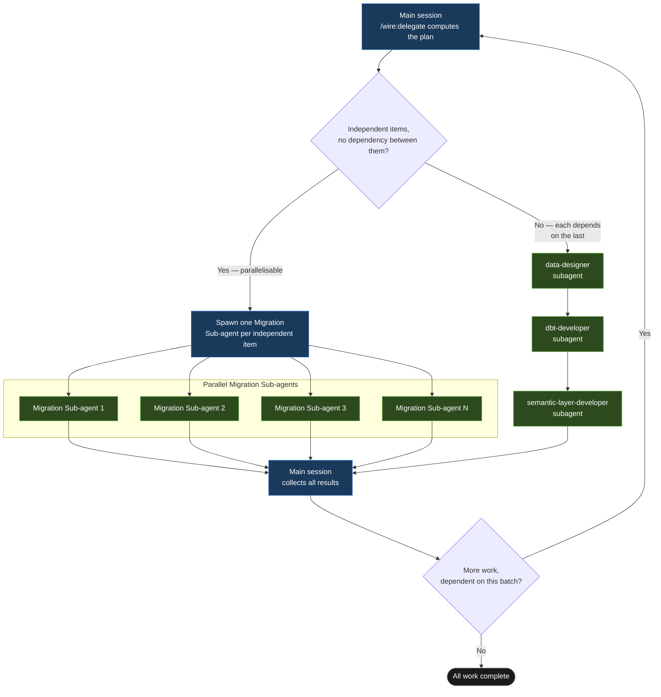

# Wire Agents: Specialist Subagents

**Introduced**: v3.8.6 (orchestrate command) → v3.9.2 (12 specialists + `/wire:delegate`) → v3.9.2 (14 specialists, adds `dashboard-mock-developer` and `mock-data-developer`) → v3.9.3 (migration generate commands auto-delegate to `migration-specialist`) → v3.9.5 (all 44 non-migration generate commands auto-delegate) → v3.9.6 (intra-batch parallelism for dbt migration — groups of ~5 models per agent) → v3.9.7 (post-execution hooks, stale artifact detection, Data Safety blocks on all migration specs)

Wire Agents replaces the single-agent pattern with thirteen named specialist agents, each with a focused skill set, dispatched by the `/wire:delegate` command.

**Since v4.0.0** these same agents are the third tier of
[the release director model](./release-director): one human directs, one session
orchestrates, and the specialists run as **lanes**. Everything on this page still
applies; the lane contract below is what changes when a lane is dispatched by an
orchestrating session rather than by a command you typed.

The core insight: a single Claude Code agent doing requirements, dbt development, LookML authoring, data quality, and migration audits across a full engagement dilutes context and produces generic output. A specialist with a narrow brief — "your job is dbt models and nothing else" — operates with a much cleaner context and makes better decisions within its domain.

Two delegation patterns cover everything Wire does: a sequential chain when each step's specialist needs the previous one's output, and a parallel fan-out when a batch of work splits into independent items with no relationship to each other.



The sequential branch is the ordinary case across a release: `data-designer` produces the data model before `dbt-developer` can generate anything against it, and `dbt-developer`'s models have to exist before `semantic-layer-developer` can build LookML on top of them — each a different specialist, run in strict order. The parallel branch is `migration-specialist` fanning out across a batch of independently-migratable items (see [Platform Migration](../release-types/platform-migration)) — every sub-agent in the batch runs at once, and the main session only moves on once all of them have returned. The same fan-out shape governs large dbt model sets too, covered next.

## The thirteen agents

| Agent | Domain |
|---|---|
| `discovery-analyst` | Requirements, workshops, all SOP discovery artifacts |
| `data-designer` | Conceptual model, pipeline design, standard-mode mockups and viz catalog |
| `dashboard-mock-developer` | Interactive HTML mockups for `dashboard_first` — iterates with user until approved, derives viz catalog and data model requirements |
| `mock-data-developer` | CSV seed data from approved viz catalog; manages data refactor from seeds to real client data |
| `pipeline-engineer` | Fivetran, Airbyte, dlt connector configuration |
| `dbt-developer` | Staging → integration → warehouse model generation |
| `semantic-layer-developer` | LookML views, explores, dashboards, ads/semantic_layer |
| `orchestration-engineer` | DAG authoring, scheduling, orchestration migration |
| `data-quality-engineer` | Schema tests, Droughty QA, field docs, UAT |
| `migration-specialist` | Full migration lifecycle — audits, inventory, strategy, cutover |
| `delivery-lead` | Deployment guides, training, kickoff, enablement |
| `agentic-data-stack-developer` | Canonical models, knowledge skills, agent configs, eval suites |
| `qa-agent` | Pure validator across all release types — no generation |

The `qa-agent` has no generation responsibility. It validates outputs from other agents and reports pass/fail with specific remediation actions.

### dashboard-mock-developer and mock-data-developer

These two agents activate exclusively for `dashboard_first` releases.

`dashboard-mock-developer` runs an explicit iteration loop — it generates the first HTML mock immediately from requirements, then invites changes (tiles, chart types, layout, new pages, filter dimensions) until you confirm approval. It then derives three artifacts the rest of the chain depends on: the viz catalog CSV, a data-content dashboard spec, and `data_model_requirements.md` (the distinct measures and dimensions with grain and calculation definitions).

`mock-data-developer` has two time-separated phases: seed data (CSV files with referential integrity and domain-realistic values, enabling `dbt seed && dbt run` without any client data) and data refactor (repoints staging models from seeds to real client sources once access is available, producing a written plan before touching any code).

## Auto-delegation on individual commands

Nothing changes for individual commands. When you run `/wire:dbt-generate` (or any generate/validate command), the main session automatically delegates to the appropriate specialist subagent. You see a brief "→ delegating to dbt-developer agent" message. The subagent executes and the result appears in the usual artifact location.

Review commands (`*-review`) always stay in the main session — they require your direct input.

## Batch delegation with `/wire:delegate`

```
/wire:delegate <release-folder>
```

Wire reads `status.md`, identifies all pending artifact work, groups it by agent type, computes a parallel/sequential execution plan, and presents it for your approval before spawning any subagents. A typical full-platform plan:

```
Step 1 (sequential):
  discovery-analyst → requirements-generate, workshops-generate

Step 2 (parallel, starts after step 1):
  2a  data-designer    → conceptual_model-generate, pipeline_design-generate
  2b  pipeline-engineer → pipeline-generate

Step 3 (multi-wave fan-out, starts after step 2):
  dbt-developer → data_model-generate, dbt-generate  [fan-out — see below]

Step 4 (parallel, starts after step 3):
  4a  semantic-layer-developer → semantic_layer-generate, dashboards-generate
  4b  data-quality-engineer    → data_quality-generate

Step 5 (sequential, starts after step 4):
  qa-agent → validate all artifacts from steps 1–4

Step 6 (sequential, starts after step 5):
  delivery-lead → deployment-generate, training-generate
```

The plan respects Wire's artifact dependency graph — requirements must be approved before any technical agent starts; dbt and dashboard work can proceed concurrently once design is done.

## Fan-out parallelism for large model sets

When any dbt layer has more than 5 models, `/wire:delegate` splits that layer's models into batches of 5 and runs one `dbt-developer` agent per batch in parallel. Layers are still sequential: all staging agents complete before integration starts, which completes before warehouse starts. Within each layer, every agent runs in parallel.

A release with 11 staging models and 9 warehouse models produces this fan-out for Step 3:

```
Wave 3a — Staging layer  (3 parallel agents):
  dbt-developer [staging 1/3]  →  stg_shopify__orders, stg_shopify__customers, ...
  dbt-developer [staging 2/3]  →  stg_netsuite__transactions, stg_netsuite__items, ...
  dbt-developer [staging 3/3]  →  stg_klaviyo__events, stg_klaviyo__campaigns, ...

Wave 3b — Integration layer  (1 agent, starts after Wave 3a):
  dbt-developer [integration 1/1]  →  int__customer_unified, int__order_financial, ...

Wave 3c — Warehouse layer  (2 parallel agents, starts after Wave 3b):
  dbt-developer [warehouse 1/2]  →  customer_dim, product_dim, orders_fct, ...
  dbt-developer [warehouse 2/2]  →  daily_revenue_fct, marketing_spend_fct, ...

Total dbt-developer agents: 6  (3 + 1 + 2)
```

Each agent receives a `task_scope` list — the specific models it should generate. It reads the same upstream artifacts as every other dbt agent but writes only the files in its scope. The orchestrating session merges `decisions.md` entries from all agents after each wave completes.

## Review gates remain human-in-the-loop

Delegation pauses before every `*-review` step:

```
[Release] Delegation paused at review gate.

Artifact: data_model
Status:   PASS WITH WARNINGS
Location: .wire/releases/[release]/artifacts/data_model/

Run /wire:data_model-review [release_folder] to conduct the stakeholder review.
Once approved, re-run /wire:delegate [release_folder] to continue.
```

Run the review manually, then re-run `/wire:delegate` to resume.

## The lane contract

When a specialist runs as a lane under the director model, the dispatch carries
a brief and five rules apply. Outside orchestrated mode — a single command
auto-delegating, or an engagement set to `orchestration.mode: manual` —
behaviour is unchanged and none of this applies.

| Rule | Why (the failure it comes from) |
|---|---|
| Write progress to your own state file after **each** completed item | Two hard usage-limit outages resumed with near-zero loss only because every lane had incremental state |
| Write only inside the directories the brief names, and commit exactly those files | A broad commit from one lane swept up another's half-written state file and corrupted both resume points |
| **Do not write `status.md` or `execution_log.md`** | 46 commits in 24 hours across four people; one merge silently discarded 54 models of completed work |
| Do not spawn sub-agents below yourself — lanes are flat | Nested fan-out caused two hard usage-limit outages in one day |
| Report once: complete, stalled, or needs a ruling | Polling chatter burned context and tokens while the state files already held the answer |

The third rule is the change for ordinary release types. The orchestrating
session is the single writer of `status.md` and the execution log: it reads the
lane's state file and writes the record. Its **consolidation pass** then checks
the artifact files exist, that validate ran and its result matches what the lane
claimed, that the lane did not write `status.md`, and — for warehouse work —
re-checks results against the warehouse rather than the lane's word.

`decisions.md` is still the lane's to append to.

## The decisions.md convention

Each subagent appends non-obvious choices and rationale to `.wire/releases/{release}/decisions.md` as it works — grain choices, tool selections, modelling trade-offs. Downstream agents read it; so do human reviewers at the review gates. This creates a lightweight audit trail of architectural decisions that wouldn't otherwise be captured in the artifacts themselves.

## Local execution — no additional infrastructure

Wire Agents runs entirely on your workstation. Subagents are spawned using Claude Code's built-in Agent tool. They use your existing Claude Code API key — no additional keys, accounts, or managed agent services required.

## Autopilot and agents

`/wire:autopilot` calls `/wire:delegate` internally. When you run Autopilot, you are already using Wire Agents — the batch delegation and specialist routing happen automatically. Run `/wire:delegate` directly when you want to review and confirm the delegation plan before agents start.

## From roadmap to shipped

The 3.9 roadmap proposed a ticket-driven pull model, then agent-to-agent
coordination, then named persistent agents. v4.0.0 ships something different and
simpler, because the evidence pointed elsewhere: the barrier was never agent
autonomy, it was command discovery. A human directs in prose, one session
orchestrates, and the agents stay exactly as they are — flat, scoped, and
stopping at every human gate.

| Was proposed | What shipped in v4.0.0 |
|---|---|
| Agents watch Jira/Linear for `ready_for_agent` issues and execute autonomously | A human directs in plain language; the orchestrating session dispatches. Issue trackers stay a sync target, not a work queue. |
| Agent-to-agent coordination via child tickets | Lanes stay flat and never coordinate with each other. Nested fan-out is the rule they are forbidden to break, for a recorded reason. |
| A `delivery-coordinator` that takes a SoW and generates the whole plan | The orchestrating session reads a SOW and proposes the release type with its reason — as **one confirmation block**, never as an autonomous plan. |

See [The Release Director Model](./release-director) for the whole picture.
