# Worked Example: Barton Peveril Live Pastoral Analytics

This walkthrough traces a complete Wire engagement from initial kick-off through delivery handover, using a real-world further education client. It covers every command in the canonical sequence and shows two Wire Agents features in practice: auto-delegation during the design phase, and batch dispatch via `/wire:delegate` at the start of development.

The engagement is a `full_platform` release using BigQuery, dbt, Looker, and dbt Cloud for orchestration.

## Engagement overview

| | |
|-|-|
| **Client** | Barton Peveril Sixth Form College, Hampshire |
| **Engagement** | Live Pastoral Analytics (SOW 2) |
| **Duration** | 2 weeks (Feb 2–13, 2026) |
| **Release type** | `full_platform` |
| **Orchestration** | dbt Cloud (scheduled jobs + CI/PR job) |

**SOW deliverables**: Live pastoral pipeline (ProSolution + Focus → BigQuery), Looker semantic layer, SPA Operational Dashboard, data team and end-user training, technical documentation.

## Phase 1: Requirements (Day 1)

### Engagement setup

```
/wire:new
→ Client: Barton Peveril Sixth Form College
→ Engagement name: barton_peveril
→ Release type: full_platform
→ Release ID: 01-barton-peveril-live-pastoral
→ Branch: feature/barton-peveril-live-pastoral
→ .wire/releases/01-barton-peveril-live-pastoral/status.md created
  16 artifacts across 6 phases, all at not_started
```

After `/wire:new`, copy the SOW PDF and ProSolution SQL schema examples into `releases/01-barton-peveril-live-pastoral/requirements/`.

### Requirements — auto-delegated to `discovery-analyst`

```
/wire:requirements-generate 01-barton-peveril-live-pastoral
→ [auto-delegated to discovery-analyst agent]
```

The agent reads the SOW and SQL examples and produces a 13-section requirements specification: FR-1 through FR-9 with acceptance criteria, NFR-1 through NFR-7 (performance, security, freshness SLAs), and a deliverable-to-artifact mapping. It appends two entries to `decisions.md`:

- Modelled attendance at daily-snapshot grain, not register-level — register-level would require 6× the Fivetran MAR volume
- Excluded `student_notes.body` from replication scope — free-text pastoral records create a GDPR data minimisation risk

```
/wire:requirements-validate 01-barton-peveril-live-pastoral
→ [auto-delegated to discovery-analyst agent]
→ PASS

/wire:requirements-review 01-barton-peveril-live-pastoral
→ [main session — review gates stay with the consultant]
→ Fathom context: pre-engagement call transcript pulled
→ Approved by Head of MIS, 2026-02-03
```

### Delivery playbook

Before moving into design, generate a playbook for the full release:

```
/wire:playbook-generate 01-barton-peveril-live-pastoral
```

The command reads the approved requirements, SOW timeline, and `status.md` and produces a Mermaid control-flow diagram plus a narrative step guide at `planning/live_pastoral_analytics_playbook.md`. The ✅ and 🔄 markers on phase headings update each time you regenerate — the version below was produced mid-engagement after design was complete.

```mermaid
flowchart TD

START([Sprint Start]):::event

subgraph REQ["Phase 1 — Requirements ✅ COMPLETE"]
    R1["/wire:requirements-generate"]:::wireCmd
    R2["/wire:requirements-validate<br/>/wire:requirements-review"]:::wireCmd
    RGATE{"Requirements\napproved?"}:::decision
    RCHASE["Chase MIS team\n— requirements sign-off"]:::offline
end

subgraph DESIGN["Phase 2 — Design ✅ COMPLETE"]
    PD1["/wire:pipeline_design-generate"]:::wireCmd
    PD2["/wire:pipeline_design-validate<br/>/wire:pipeline_design-review"]:::wireCmd
    PDGATE{"Pipeline design\napproved?"}:::decision
    PDCHASE["Chase systems engineer\n— pipeline design review"]:::offline
    DM1["/wire:data_model-generate"]:::wireCmd
    DM2["/wire:data_model-validate<br/>/wire:data_model-review"]:::wireCmd
    DMGATE{"Data model\napproved?"}:::decision
    DMCHASE["Chase data team lead\n— data model review"]:::offline
    MK1["/wire:mockups-generate"]:::wireCmd
    MK2["/wire:mockups-review"]:::wireCmd
    MKGATE{"Mockups\napproved?"}:::decision
    MKCHASE["Chase MIS manager\n— mockups review"]:::offline
end

subgraph DEV["Phase 3 — Development 🔄 IN PROGRESS"]
    PIP1["/wire:pipeline-generate"]:::wireCmd
    PIP2["/wire:pipeline-validate<br/>/wire:pipeline-review"]:::wireCmd
    PIPGATE{"Pipeline impl.\napproved?"}:::decision
    PIPCHASE["Chase systems engineer\n— pipeline implementation review"]:::offline
    OQ_PD2{"PD-2: note_type_id 31\nconfirmed?"}:::decision
    OQ_PD2_CHASE["Chase systems engineer\n— confirm role of note type 31"]:::offline
    DBT1["/wire:dbt-generate"]:::wireCmd
    DBT2["/wire:dbt-validate<br/>/wire:dbt-review"]:::wireCmd
    DBTGATE{"dbt models\napproved?"}:::decision
    DBTCHASE["Address findings\n(ref() in CTEs, s_ prefixes)\nthen re-validate"]:::offline
    SL1["/wire:semantic_layer-generate"]:::wireCmd
    SL2["/wire:semantic_layer-validate<br/>/wire:semantic_layer-review"]:::wireCmd
    SLGATE{"Semantic layer\napproved?"}:::decision
    SLCHASE["Chase data team lead\n— semantic layer review"]:::offline
end

subgraph TEST["Phase 4 — Testing"]
    DASH1["/wire:dashboards-generate"]:::wireCmd
    DASH2["/wire:dashboards-validate<br/>/wire:dashboards-review"]:::wireCmd
    DASHGATE{"Dashboards\napproved?"}:::decision
    DASHCHASE["Chase MIS manager\n— dashboard review"]:::offline
    OQ_PD11{"PD-11: FSA Stage 2/3\nsnapshot data available?"}:::decision
    OQ_PD11_CHASE["Chase MIS team\n— FSA snapshot availability"]:::offline
    DQ1["/wire:data_quality-generate"]:::wireCmd
    DQ2["/wire:data_quality-validate<br/>/wire:data_quality-review"]:::wireCmd
    DQGATE{"Data quality\napproved?"}:::decision
    DQCHASE["Chase systems engineer\n— data quality review"]:::offline
    UAT1["/wire:uat-generate"]:::wireCmd
    UAT2["[Offline] UAT sessions\n— SPAs, tutors, pastoral leads"]:::offline
    UAT3["/wire:uat-review"]:::wireCmd
    UATGATE{"UAT passed?"}:::decision
    UATCHASE["Fix defects raised in UAT\nthen reschedule sessions"]:::offline
end

subgraph DEPLOY["Phase 5 — Deployment"]
    DEP0["[Offline] Confirm production env,\naccess controls, rollback plan"]:::offline
    DEP1["/wire:deployment-generate"]:::wireCmd
    DEP2["/wire:deployment-validate<br/>/wire:deployment-review"]:::wireCmd
    DEPGATE{"Deployment\napproved?"}:::decision
    DEPCHASE["Chase client sponsor\n— deployment sign-off"]:::offline
end

subgraph ENABLE["Phase 6 — Enablement"]
    TRN1["/wire:training-generate"]:::wireCmd
    TRN2["/wire:training-validate<br/>/wire:training-review"]:::wireCmd
    TRNGATE{"Training content\napproved?"}:::decision
    TRNCHASE["Chase MIS manager\n— training content review"]:::offline
    TRN3["[Offline] Data team enablement session"]:::offline
    TRN4["[Offline] End-user training session\n(SPAs / tutors / pastoral leads)"]:::offline
    DOC1["/wire:documentation-generate"]:::wireCmd
    DOC2["/wire:documentation-validate<br/>/wire:documentation-review"]:::wireCmd
    DOCGATE{"Documentation\napproved?"}:::decision
    DOCCHASE["Chase client sponsor\n— documentation sign-off"]:::offline
end

END([Sprint Complete — Platform Go-Live]):::event

START --> R1
R1 --> R2
R2 --> RGATE
RGATE -->|No| RCHASE
RCHASE --> R2
RGATE -->|Yes| PD1
PD1 --> PD2
PD2 --> PDGATE
PDGATE -->|No| PDCHASE
PDCHASE --> PD1
PDGATE -->|Yes| DM1
DM1 --> DM2
DM2 --> DMGATE
DMGATE -->|No| DMCHASE
DMCHASE --> DM1
DMGATE -->|Yes| MK1
MK1 --> MK2
MK2 --> MKGATE
MKGATE -->|No| MKCHASE
MKCHASE --> MK2
MKGATE -->|Yes| PIP1
PIP1 --> PIP2
PIP2 --> PIPGATE
PIPGATE -->|No| PIPCHASE
PIPCHASE --> PIP1
PIPGATE -->|Yes| OQ_PD2
OQ_PD2 -->|Not yet| OQ_PD2_CHASE
OQ_PD2_CHASE --> OQ_PD2
OQ_PD2 -->|Confirmed| DBT1
DBT1 --> DBT2
DBT2 --> DBTGATE
DBTGATE -->|No| DBTCHASE
DBTCHASE --> DBT1
DBTGATE -->|Yes| SL1
SL1 --> SL2
SL2 --> SLGATE
SLGATE -->|No| SLCHASE
SLCHASE --> SL1
SLGATE -->|Yes| DASH1
DASH1 --> DASH2
DASH2 --> DASHGATE
DASHGATE -->|No| DASHCHASE
DASHCHASE --> DASH1
DASHGATE -->|Yes| OQ_PD11
OQ_PD11 -->|Not yet| OQ_PD11_CHASE
OQ_PD11_CHASE --> OQ_PD11
OQ_PD11 -->|Available or deferred| DQ1
DQ1 --> DQ2
DQ2 --> DQGATE
DQGATE -->|No| DQCHASE
DQCHASE --> DQ1
DQGATE -->|Yes| UAT1
UAT1 --> UAT2
UAT2 --> UAT3
UAT3 --> UATGATE
UATGATE -->|No| UATCHASE
UATCHASE --> UAT2
UATGATE -->|Yes| DEP0
DEP0 --> DEP1
DEP1 --> DEP2
DEP2 --> DEPGATE
DEPGATE -->|No| DEPCHASE
DEPCHASE --> DEP1
DEPGATE -->|Yes| TRN1
TRN1 --> TRN2
TRN2 --> TRNGATE
TRNGATE -->|No| TRNCHASE
TRNCHASE --> TRN1
TRNGATE -->|Yes| TRN3
TRN3 --> TRN4
TRN4 --> DOC1
DOC1 --> DOC2
DOC2 --> DOCGATE
DOCGATE -->|No| DOCCHASE
DOCCHASE --> DOC1
DOCGATE -->|Yes| END

classDef wireCmd fill:#1a3a5c,stroke:#4a90d9,color:#fff
classDef offline fill:#2d4a1e,stroke:#6abf4b,color:#fff
classDef decision fill:#5c3a00,stroke:#d98c1a,color:#fff
classDef event fill:#1a1a1a,stroke:#888,color:#fff
```



The narrative guide covers prerequisites, open questions, and offline activities for each step. Two open questions surface at generation time: **PD-2** (confirm the role of `note_type_id = 31` in Focus before the dbt review is approved) and **PD-11** (FSA Stage 2/3 snapshot data — may need to defer to Phase 2 scope).

> **What Wire does and does not do.** Wire writes the artifacts: requirements, pipeline design, data model, dbt SQL models, LookML, UAT scripts, deployment runbooks, training plans, and documentation. It also runs all mechanical validations. Wire does not take decisions on the team's behalf — every `-generate` is followed by a `-validate` and a `-review`, and the review is the human gate where a named stakeholder approves the artifact before the next phase begins.

Each session should start with `/wire:status` to confirm the current artifact state, then scope to advancing one artifact through one gate. For development artifacts, generate + validate typically fit in one session. When a review returns `changes_requested`, re-generate and re-validate before going back to the reviewer. Log open questions immediately with a named owner.

This is a planning utility — it creates no tracked artifact and blocks nothing. Regenerate after any significant scope change to refresh the ✅ markers.

## Phase 2: Design (Days 2–4)

### Conceptual model — auto-delegated to `data-designer`

```
/wire:conceptual_model-generate 01-barton-peveril-live-pastoral
→ [auto-delegated to data-designer agent]
```

Produces a business-level entity model: five domain entities (`Student`, `Attendance`, `PastoralNote`, `SPAAlert`, `Assignment`) with a Mermaid `erDiagram` showing cardinalities.

```
/wire:conceptual_model-validate 01-barton-peveril-live-pastoral
→ [auto-delegated to data-designer agent] → PASS

/wire:conceptual_model-review 01-barton-peveril-live-pastoral
→ [main session]
→ Approved by Head of MIS + Head of Student Services, 2026-02-04
→ Decision: SPAAlert is a first-class entity, not a flag on PastoralNote
```

### Pipeline design — auto-delegated to `pipeline-engineer`

```
/wire:pipeline_design-generate 01-barton-peveril-live-pastoral
→ [auto-delegated to pipeline-engineer agent]
```

Produces the full pipeline architecture document: ProSolution source schema analysis, three Fivetran connectors (ProSolution SQL Server CDC, Focus CDC, MIS Applications for risk weights), and 12 design decisions. The design went through five versions before approval. Key decisions: attendance percentage calculated dynamically in Looker (CR-1, never stored); risk scoring from live `Looker_Risk_Score` table via Fivetran rather than a static seed (CR-3); `focus.users` removed from CDC scope (CR-5). Open question **PD-2** carried forward: confirm the role of `note_type_id = 31` before the dbt review is approved.

```
/wire:pipeline_design-validate 01-barton-peveril-live-pastoral → PASS
/wire:pipeline_design-review 01-barton-peveril-live-pastoral
→ Approved v5.0, 2026-02-25 — five rounds incorporating CR-1 through CR-6
```

### Data model — auto-delegated to `data-designer`

```
/wire:data_model-generate 01-barton-peveril-live-pastoral
→ [auto-delegated to data-designer agent]
```

Produces `_sources.yml` for all three Fivetran connectors, a physical ERD, and a full model inventory across six versions:
- 9 staging models, 1 integration model (`int__student_xref` — cross-system student identity resolution), 7 warehouse models: `attendance_fct`, `pastoral_notes_fct`, `spa_alerts_fct`, `assignment_marks_fct`, `student_risk_score_fct`, `student_risk_summary`, `student_risk_history`
- 3 seeds: `grade_ordering.csv`, `focus_note_type_mapping.csv`, `tracked_assignment_titles.csv`
- All facts use incremental (`merge`) materialisation

```
/wire:data_model-validate 01-barton-peveril-live-pastoral → PASS
/wire:data_model-review 01-barton-peveril-live-pastoral
→ Approved v6.0, 2026-02-25 — six rounds
→ student_risk_history added in v5 to accumulate snapshots over time
```

### Mockups

```
/wire:mockups-generate 01-barton-peveril-live-pastoral
→ [main session — no specialist agent for wireframes]
```

```
Dashboard Mockups Generated

  File: design/mockups/spa-operational-dashboard.html — open in any browser

  What's in it:

  - Daily Caseload — 4 KPI tiles (Active Risk 12, Monitoring 8, Unanswered
    Alerts 3, No Concerns 45), 6-week at-risk trend line, caseload doughnut,
    8-row student priority table with risk signals. Click any row to drill
    to Student Detail.
  - Student Detail — example student; KPIs for attendance (76%), open alerts,
    notes, CAP below target; stacked attendance bar (8 weeks), horizontal bar
    grades vs MEG, pastoral notes table, SPA alerts table with wellbeing flag
    footer.
  - Note Volume Monitor — college-wide note volumes by department, stacked
    horizontal bar (4 note types × 7 departments), breakdown table with WoW
    % change.
  - High-Risk Cohort — dual-risk cohort (wellbeing + att<90%), unanswered
    alerts, risk score ranking bar chart, alert age chart, two tables for the
    two cohort cuts.

  All charts are Chart.js 4.4.1, fully interactive. Sidebar collapses, tabs
  switch without page load, filter pills are styled correctly.
```

A self-contained interactive HTML prototype — no build step, no server. SPAs and pastoral leads review it in a browser before any Looker work begins.


```
/wire:mockups-review 01-barton-peveril-live-pastoral
→ Approved 2026-02-06
→ Change request: add "days since last SPA contact" column
```

### End of Week 1 — close the session

All four design artifacts approved. Before switching off:

```
/wire:session:end 01-barton-peveril-live-pastoral
```

Wire summarises: 6 artifacts completed, two open items (OQ-2 still open), next session focus is Phase 3 Development, recommends starting with `/wire:delegate`.

## Phase 3: Development (Days 5–8)

### Day 5 morning — resume and plan

New session, two days later:

```
/wire:start
→ Select: 01-barton-peveril-live-pastoral
→ Choose: Plan session
```

Wire shows the release state (6/16 artifacts done), lists the next four at `not_started`, surfaces the two open items, and recommends `/wire:delegate`.

### Batch dispatch with `/wire:delegate`

```
/wire:delegate 01-barton-peveril-live-pastoral
```

Wire inspects `status.md`, identifies all development artifacts at `not_started`, and presents the delegation plan. With 9 staging models and 7 warehouse models in scope, the dbt step fans out across parallel agents per layer:

```
Delegation plan — Barton Peveril Live Pastoral Analytics / 01-barton-peveril-live-pastoral
───────────────────────────────────────────────────────────────────────────────────────────

Step 1 (sequential):
  pipeline-engineer  →  pipeline-generate
                        (ProSolution SQL Server CDC + Focus REST API connectors)

Step 2 (multi-wave fan-out, starts after Step 1):

  Wave 2a — Staging layer  (2 parallel agents):
    dbt-developer [staging 1/2]  →  stg_prosolution__students, stg_prosolution__courses,
                                     stg_prosolution__enrolments, stg_prosolution__attendance,
                                     stg_prosolution__targets  (+3 seeds)
    dbt-developer [staging 2/2]  →  stg_focus__attendance_observations,
                                     stg_mis__timetable_slots,
                                     stg_mis__staff_absence,
                                     stg_mis__exam_results

  Wave 2b — Integration layer  (1 agent, starts after Wave 2a):
    dbt-developer [integration 1/1]  →  int__student_unified_profile

  Wave 2c — Warehouse layer  (2 parallel agents, starts after Wave 2b):
    dbt-developer [warehouse 1/2]  →  student_dim, course_dim,
                                       attendance_summary_fct, exam_performance_fct
    dbt-developer [warehouse 2/2]  →  student_risk_scores_fct, student_risk_summary,
                                       student_risk_history

  Total dbt-developer agents: 5  (2 + 1 + 2)

Step 3 (parallel, starts after Step 2):
  3a  orchestration-engineer    →  orchestration-generate  (dbt Cloud job config)
  3b  semantic-layer-developer  →  semantic_layer-generate  (LookML views + explores)

Total: 8 specialist agents across 4 execution stages. Review commands stay in this session.
```

### What the agents produce

**`pipeline-engineer`** — Fivetran connector config for ProSolution (SQL Server CDC) and Focus (REST API), plus a Cloud Function for Focus auth token refresh. Error handling: dead-letter queue to `pipeline_errors` BigQuery table, Slack alerting on consecutive failures.

**`dbt-developer`** — 5 agents ran across 3 sequential waves. Wave 2a (2 staging agents in parallel) ran concurrently with each other. Wave 2b ran the single integration model. Wave 2c ran 2 warehouse agents in parallel. Total: 19 SQL models (9 staging, 1 integration, 7 warehouse, 2 utility) plus 3 seeds and 34 static-analysis tests. Surrogate keys via `dbt_utils.generate_surrogate_key()`; all facts incremental with `merge` strategy. Static analysis PASS with two findings the team must fix before requesting review: `ref()` calls inside transformation CTEs in two models (must move to source CTEs at the top of the file); missing `s_` prefixes on source CTEs across several warehouse models. Both corrected before the review is requested. Adds to `decisions.md`:

- `student_risk_summary` materialised as table with `full_refresh=false` — model accumulates historical snapshots; incremental would require a unique_key that changes the grain

**`orchestration-engineer`** — Generates the dbt Cloud job configuration (`dbt_cloud_config.md`):

```markdown
## Jobs

### barton_peveril_scheduled_run
- Environment: Production (bp-analytics, target: prod)
- Schedule: every 30 minutes (matches NFR-3 freshness SLA)
- Commands:
    dbt run --select staging+ warehouse+
    dbt test --select staging+ warehouse+
- On failure: Slack → #pastoral-data-alerts

### barton_peveril_ci
- Trigger: pull request against main
- Commands: dbt build --select state:modified+
- On completion: GitHub PR status check
```

Adds to `decisions.md`: scheduled job runs on cadence regardless of source readiness — downstream freshness tests surface stale data via Slack alert, which is simpler than sensor-based gating at this data volume. CI job uses `state:modified+` to keep PR feedback fast; production job uses full selector to prevent silent exclusions after a merge.

**`semantic-layer-developer`** — LookML views for all 7 warehouse models and 5 explores: `student_risk_summary`, `pastoral_notes`, `attendance`, `assignment_marks`, `student_risk_score`. `attendance_percentage` calculated dynamically as `SUM(sessions_present) / (SUM(sessions_present) + SUM(sessions_absent))` — never stored (CR-1). Risk signal measures: `attendance_deterioration_flag`, `pastoral_note_spike_flag`, `unanswered_alert_flag`, `days_since_last_spa_contact`.

### Development reviews (Days 6–8)

Review gates stay in the main session:

```
/wire:pipeline-review 01-barton-peveril-live-pastoral → Approved 2026-02-11
/wire:dbt-review 01-barton-peveril-live-pastoral → Approved 2026-02-11
/wire:orchestration-review 01-barton-peveril-live-pastoral
→ data engineering lead (dbt Cloud admin)
→ Job selectors verified, 30-minute schedule confirmed against NFR-3
→ Approved 2026-02-11
/wire:semantic_layer-review 01-barton-peveril-live-pastoral → Approved 2026-02-12
```

With semantic_layer approved, generate the dashboard:

```
/wire:dashboards-generate 01-barton-peveril-live-pastoral
/wire:dashboards-validate 01-barton-peveril-live-pastoral → PASS
/wire:dashboards-review 01-barton-peveril-live-pastoral → Approved 2026-02-12
```

## Phase 4: Testing (Days 9–10)

```
/wire:data_quality-generate 01-barton-peveril-live-pastoral
→ [auto-delegated to data-quality-engineer agent]
```

Adds: 30-minute freshness Slack alert, row count reconciliation (ProSolution vs `attendance_fct`, ±2% tolerance), null rate monitoring, FK hit rate check.

```
/wire:data_quality-validate 01-barton-peveril-live-pastoral → PASS
/wire:data_quality-review 01-barton-peveril-live-pastoral → Approved 2026-02-13
```

UAT with SPAs and pastoral leads:

```
/wire:uat-generate 01-barton-peveril-live-pastoral
```

UAT plan mapped to FR-1 through FR-9. One iteration: "days since last SPA contact" needed rounding to whole days.

```
/wire:uat-review 01-barton-peveril-live-pastoral
→ Approved by Head of Student Services, 2026-02-13
```

## Phase 5: Deployment (Day 11)

```
/wire:deployment-generate 01-barton-peveril-live-pastoral
```

Generates: step-by-step deployment runbook (Fivetran → BigQuery datasets → dbt Cloud environment + jobs → Looker publish), monitoring setup, rollback procedures.

```
/wire:deployment-validate 01-barton-peveril-live-pastoral → PASS

/wire:utils-deploy-to-dev 01-barton-peveril-live-pastoral
→ All models built, all tests passing in dbt Cloud dev environment,
  dashboards visible in Looker dev

/wire:deployment-review 01-barton-peveril-live-pastoral
→ data engineering lead + analytics engineering lead
→ Dev results presented, runbook walked through
→ Approved 2026-02-13

/wire:utils-deploy-to-prod 01-barton-peveril-live-pastoral
→ Fivetran connectors activated
→ dbt Cloud production environment configured and tested
→ Scheduled job (30-minute cadence) and CI/PR job activated
→ Dashboards published to Looker production
→ Monitoring alerts live
```

## Phase 6: Enablement (Days 12–13)

```
/wire:training-generate 01-barton-peveril-live-pastoral
```

**Data Team Enablement** (Day 12 morning): pipeline architecture, dbt model structure, dbt Cloud job operation, LookML extension, hands-on trace of a data point from ProSolution to Looker.

**End User Training** (Day 12 afternoon): dashboard navigation, interpreting risk signals, data freshness expectations, how to raise a data quality issue.

```
/wire:training-validate 01-barton-peveril-live-pastoral → PASS
/wire:training-review 01-barton-peveril-live-pastoral → Approved 2026-02-14
```

```
/wire:documentation-generate 01-barton-peveril-live-pastoral
→ [delivery-lead agent reads all approved artifacts and decisions.md]
```

Produces: architecture overview, dbt model reference, dbt Cloud job reference (selectors, cadence, how to change), LookML field catalogue, operational runbook.

```
/wire:documentation-validate 01-barton-peveril-live-pastoral → PASS
/wire:documentation-review 01-barton-peveril-live-pastoral → Approved 2026-02-14
```

### Archive

```
/wire:archive 01-barton-peveril-live-pastoral
→ 16 artifacts, 48 generate/validate/review actions, 11 decisions.md entries
→ Jira Epic BP-1 closed
```

## What the engagement produced

| Artifact | Format |
|---|---|
| Requirements specification | `.wire/releases/.../requirements.md` |
| Delivery playbook | `.wire/releases/.../planning/barton_peveril_playbook.md` |
| Conceptual entity model | `.wire/releases/.../conceptual_model.md` |
| Pipeline design | `.wire/releases/.../pipeline_design.md` |
| Physical data model | `.wire/releases/.../data_model.md` |
| Dashboard wireframes | `.wire/releases/.../mockups.md` |
| dbt project | 19 SQL models, 3 seeds, 34 tests |
| dbt Cloud config | `dbt_cloud_config.md` — scheduled run + CI/PR job |
| LookML | 5 explores, SPA Operational Dashboard |
| Technical documentation | Architecture, dbt Cloud job reference, field catalogue, ops runbook |
| Training materials | Data team session + end-user session |
| `decisions.md` | 11 agent decisions recorded across the engagement |
