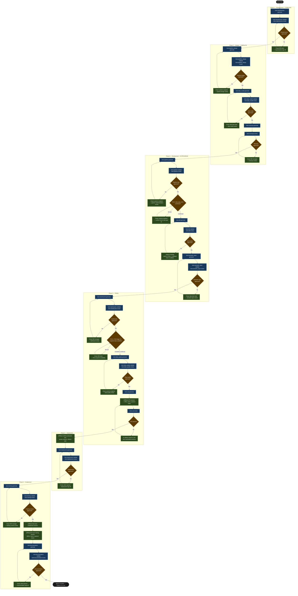

# Worked Example: Barton Peveril Live Pastoral Analytics

Reading about commands, gates and agents one page at a time tells you what each piece does, but it does not tell you what a fortnight of real delivery looks like when they are all in play at once: which commands you run on which day, where the specialist agents take the work off your hands, where everything stops for a named person to approve it and what is on disk when you finish. This walkthrough answers that by tracing a complete Wire engagement from initial kick-off through to delivery handover, using a real-world further education client. It covers every command in the canonical sequence and shows two Wire Agents features in practice: auto-delegation during the design phase, and batch dispatch via `/wire:delegate` at the start of development.

The engagement is a `full_platform` release using BigQuery, dbt and Looker, together with dbt Cloud for orchestration. We will work through it phase by phase, in the order the release ran, and where an agent did the work rather than the consultant we will say so as we go.

## Engagement overview

| | |
|-|-|
| **Client** | Barton Peveril Sixth Form College, Hampshire |
| **Engagement** | Live Pastoral Analytics (SOW 2) |
| **Duration** | 2 weeks (Feb 2–13, 2026) |
| **Release type** | `full_platform` |
| **Orchestration** | dbt Cloud (scheduled jobs + CI/PR job) |

**SOW deliverables**: Live pastoral pipeline (ProSolution + Focus → BigQuery), Looker semantic layer, SPA Operational Dashboard, data team and end-user training, technical documentation.

## Phase 1: Requirements (Day 1)

### Engagement setup

Every engagement starts with `/wire:new`, which records the client, engagement name, release type and release id, then creates the branch and the `status.md` file that will track all 16 artifacts from here on:

```
/wire:new
→ Client: Barton Peveril Sixth Form College
→ Engagement name: barton_peveril
→ Release type: full_platform
→ Release ID: 01-barton-peveril-live-pastoral
→ Branch: feature/barton-peveril-live-pastoral
→ .wire/releases/01-barton-peveril-live-pastoral/status.md created
  16 artifacts across 6 phases, all at not_started
```

Once `/wire:new` has finished, copy the SOW PDF and the ProSolution SQL schema examples into `releases/01-barton-peveril-live-pastoral/requirements/`, as these are the source materials the requirements step reads.

### Requirements — auto-delegated to `discovery-analyst`

The first artifact is also the first place you will see auto-delegation at work: rather than drafting the requirements itself, the main session hands the command to the `discovery-analyst` agent.

```
/wire:requirements-generate 01-barton-peveril-live-pastoral
→ [auto-delegated to discovery-analyst agent]
```

The agent reads the SOW and the SQL examples and produces a 13-section requirements specification: FR-1 through FR-9 with acceptance criteria, NFR-1 through NFR-7 (performance, security and freshness SLAs) and a deliverable-to-artifact mapping. Along the way it appends two entries to `decisions.md`, which is where each agent records the non-obvious choices it makes:

- Modelled attendance at daily-snapshot grain, not register-level, because register-level would require six times the Fivetran MAR volume
- Excluded `student_notes.body` from replication scope, because free-text pastoral records create a GDPR data minimisation risk

Validation goes to the same agent, but the review does not, because review gates always stay with the consultant in the main session:

```
/wire:requirements-validate 01-barton-peveril-live-pastoral
→ [auto-delegated to discovery-analyst agent]
→ PASS

/wire:requirements-review 01-barton-peveril-live-pastoral
→ [main session — review gates stay with the consultant]
→ Fathom context: pre-engagement call transcript pulled
→ Approved by Head of MIS, 2026-02-03
```

### Delivery playbook

Before moving into design, generate a playbook for the full release, so that everyone shares one view of what comes next and who approves what:

```
/wire:playbook-generate 01-barton-peveril-live-pastoral
```

The command reads the approved requirements, the SOW timeline and `status.md`, and produces a Mermaid control-flow diagram together with a narrative step guide at `planning/live_pastoral_analytics_playbook.md`. The ✅ and 🔄 markers on the phase headings update each time you regenerate it, so the version below, which was produced mid-engagement after design was complete, shows the first two phases done and development in progress.


```mermaid
flowchart TD

START([Sprint Start]):::event

subgraph REQ["Phase 1 — Requirements ✅ COMPLETE"]
    R1["/wire:requirements-generate"]:::wireCmd
    R2["/wire:requirements-validate<br/>/wire:requirements-review"]:::wireCmd
    RGATE{"Requirements\napproved?"}:::decision
    RCHASE["Chase MIS team\n— requirements sign-off"]:::offline
end

subgraph DESIGN["Phase 2 — Design ✅ COMPLETE"]
    PD1["/wire:pipeline_design-generate"]:::wireCmd
    PD2["/wire:pipeline_design-validate<br/>/wire:pipeline_design-review"]:::wireCmd
    PDGATE{"Pipeline design\napproved?"}:::decision
    PDCHASE["Chase systems engineer\n— pipeline design review"]:::offline
    DM1["/wire:data_model-generate"]:::wireCmd
    DM2["/wire:data_model-validate<br/>/wire:data_model-review"]:::wireCmd
    DMGATE{"Data model\napproved?"}:::decision
    DMCHASE["Chase data team lead\n— data model review"]:::offline
    MK1["/wire:mockups-generate"]:::wireCmd
    MK2["/wire:mockups-review"]:::wireCmd
    MKGATE{"Mockups\napproved?"}:::decision
    MKCHASE["Chase MIS manager\n— mockups review"]:::offline
end

subgraph DEV["Phase 3 — Development 🔄 IN PROGRESS"]
    PIP1["/wire:pipeline-generate"]:::wireCmd
    PIP2["/wire:pipeline-validate<br/>/wire:pipeline-review"]:::wireCmd
    PIPGATE{"Pipeline impl.\napproved?"}:::decision
    PIPCHASE["Chase systems engineer\n— pipeline implementation review"]:::offline
    OQ_PD2{"PD-2: note_type_id 31\nconfirmed?"}:::decision
    OQ_PD2_CHASE["Chase systems engineer\n— confirm role of note type 31"]:::offline
    DBT1["/wire:dbt-generate"]:::wireCmd
    DBT2["/wire:dbt-validate<br/>/wire:dbt-review"]:::wireCmd
    DBTGATE{"dbt models\napproved?"}:::decision
    DBTCHASE["Address findings\n(ref() in CTEs, s_ prefixes)\nthen re-validate"]:::offline
    SL1["/wire:semantic_layer-generate"]:::wireCmd
    SL2["/wire:semantic_layer-validate<br/>/wire:semantic_layer-review"]:::wireCmd
    SLGATE{"Semantic layer\napproved?"}:::decision
    SLCHASE["Chase data team lead\n— semantic layer review"]:::offline
end

subgraph TEST["Phase 4 — Testing"]
    DASH1["/wire:dashboards-generate"]:::wireCmd
    DASH2["/wire:dashboards-validate<br/>/wire:dashboards-review"]:::wireCmd
    DASHGATE{"Dashboards\napproved?"}:::decision
    DASHCHASE["Chase MIS manager\n— dashboard review"]:::offline
    OQ_PD11{"PD-11: FSA Stage 2/3\nsnapshot data available?"}:::decision
    OQ_PD11_CHASE["Chase MIS team\n— FSA snapshot availability"]:::offline
    DQ1["/wire:data_quality-generate"]:::wireCmd
    DQ2["/wire:data_quality-validate<br/>/wire:data_quality-review"]:::wireCmd
    DQGATE{"Data quality\napproved?"}:::decision
    DQCHASE["Chase systems engineer\n— data quality review"]:::offline
    UAT1["/wire:uat-generate"]:::wireCmd
    UAT2["[Offline] UAT sessions\n— SPAs, tutors, pastoral leads"]:::offline
    UAT3["/wire:uat-review"]:::wireCmd
    UATGATE{"UAT passed?"}:::decision
    UATCHASE["Fix defects raised in UAT\nthen reschedule sessions"]:::offline
end

subgraph DEPLOY["Phase 5 — Deployment"]
    DEP0["[Offline] Confirm production env,\naccess controls, rollback plan"]:::offline
    DEP1["/wire:deployment-generate"]:::wireCmd
    DEP2["/wire:deployment-validate<br/>/wire:deployment-review"]:::wireCmd
    DEPGATE{"Deployment\napproved?"}:::decision
    DEPCHASE["Chase client sponsor\n— deployment sign-off"]:::offline
end

subgraph ENABLE["Phase 6 — Enablement"]
    TRN1["/wire:training-generate"]:::wireCmd
    TRN2["/wire:training-validate<br/>/wire:training-review"]:::wireCmd
    TRNGATE{"Training content\napproved?"}:::decision
    TRNCHASE["Chase MIS manager\n— training content review"]:::offline
    TRN3["[Offline] Data team enablement session"]:::offline
    TRN4["[Offline] End-user training session\n(SPAs / tutors / pastoral leads)"]:::offline
    DOC1["/wire:documentation-generate"]:::wireCmd
    DOC2["/wire:documentation-validate<br/>/wire:documentation-review"]:::wireCmd
    DOCGATE{"Documentation\napproved?"}:::decision
    DOCCHASE["Chase client sponsor\n— documentation sign-off"]:::offline
end

END([Sprint Complete — Platform Go-Live]):::event

START --> R1
R1 --> R2
R2 --> RGATE
RGATE -->|No| RCHASE
RCHASE --> R2
RGATE -->|Yes| PD1
PD1 --> PD2
PD2 --> PDGATE
PDGATE -->|No| PDCHASE
PDCHASE --> PD1
PDGATE -->|Yes| DM1
DM1 --> DM2
DM2 --> DMGATE
DMGATE -->|No| DMCHASE
DMCHASE --> DM1
DMGATE -->|Yes| MK1
MK1 --> MK2
MK2 --> MKGATE
MKGATE -->|No| MKCHASE
MKCHASE --> MK2
MKGATE -->|Yes| PIP1
PIP1 --> PIP2
PIP2 --> PIPGATE
PIPGATE -->|No| PIPCHASE
PIPCHASE --> PIP1
PIPGATE -->|Yes| OQ_PD2
OQ_PD2 -->|Not yet| OQ_PD2_CHASE
OQ_PD2_CHASE --> OQ_PD2
OQ_PD2 -->|Confirmed| DBT1
DBT1 --> DBT2
DBT2 --> DBTGATE
DBTGATE -->|No| DBTCHASE
DBTCHASE --> DBT1
DBTGATE -->|Yes| SL1
SL1 --> SL2
SL2 --> SLGATE
SLGATE -->|No| SLCHASE
SLCHASE --> SL1
SLGATE -->|Yes| DASH1
DASH1 --> DASH2
DASH2 --> DASHGATE
DASHGATE -->|No| DASHCHASE
DASHCHASE --> DASH1
DASHGATE -->|Yes| OQ_PD11
OQ_PD11 -->|Not yet| OQ_PD11_CHASE
OQ_PD11_CHASE --> OQ_PD11
OQ_PD11 -->|Available or deferred| DQ1
DQ1 --> DQ2
DQ2 --> DQGATE
DQGATE -->|No| DQCHASE
DQCHASE --> DQ1
DQGATE -->|Yes| UAT1
UAT1 --> UAT2
UAT2 --> UAT3
UAT3 --> UATGATE
UATGATE -->|No| UATCHASE
UATCHASE --> UAT2
UATGATE -->|Yes| DEP0
DEP0 --> DEP1
DEP1 --> DEP2
DEP2 --> DEPGATE
DEPGATE -->|No| DEPCHASE
DEPCHASE --> DEP1
DEPGATE -->|Yes| TRN1
TRN1 --> TRN2
TRN2 --> TRNGATE
TRNGATE -->|No| TRNCHASE
TRNCHASE --> TRN1
TRNGATE -->|Yes| TRN3
TRN3 --> TRN4
TRN4 --> DOC1
DOC1 --> DOC2
DOC2 --> DOCGATE
DOCGATE -->|No| DOCCHASE
DOCCHASE --> DOC1
DOCGATE -->|Yes| END

classDef wireCmd fill:#1a3a5c,stroke:#4a90d9,color:#fff
classDef offline fill:#2d4a1e,stroke:#6abf4b,color:#fff
classDef decision fill:#5c3a00,stroke:#d98c1a,color:#fff
classDef event fill:#1a1a1a,stroke:#888,color:#fff
```

The narrative guide covers the prerequisites, open questions and offline activities for each step. Two open questions surface at generation time: **PD-2**, which asks you to confirm the role of `note_type_id = 31` in Focus before the dbt review is approved, and **PD-11**, which concerns FSA Stage 2/3 snapshot data and may need to be deferred to Phase 2 scope.

> **What Wire does and does not do.** Wire writes the artifacts: requirements, pipeline design, data model, dbt SQL models, LookML, UAT scripts, deployment runbooks, training plans and documentation. It also runs all of the mechanical validations. What Wire does not do is take decisions on the team's behalf: every `-generate` is followed by a `-validate` and a `-review`, and the review is the human gate at which a named stakeholder approves the artifact before the next phase begins.

How should you pace the work? Each session should start with `/wire:status` to confirm the current artifact state, and then scope itself to advancing one artifact through one gate. For development artifacts, generate and validate typically fit in one session. When a review returns `changes_requested`, re-generate and re-validate before going back to the reviewer, and log open questions immediately with a named owner.

The playbook is a planning utility, which is to say that it creates no tracked artifact and blocks nothing, so regenerate it after any significant scope change to refresh the ✅ markers.

## Phase 2: Design (Days 2–4)

With the requirements approved, the design phase produces four artifacts, three of them through auto-delegation and one, the mockups, in the main session. Let's take them in the order they ran.

### Conceptual model — auto-delegated to `data-designer`

```
/wire:conceptual_model-generate 01-barton-peveril-live-pastoral
→ [auto-delegated to data-designer agent]
```

This produces a business-level entity model with five domain entities (`Student`, `Attendance`, `PastoralNote`, `SPAAlert` and `Assignment`) and a Mermaid `erDiagram` showing the cardinalities between them. The review records a joint approval together with a modelling decision:

```
/wire:conceptual_model-validate 01-barton-peveril-live-pastoral
→ [auto-delegated to data-designer agent] → PASS

/wire:conceptual_model-review 01-barton-peveril-live-pastoral
→ [main session]
→ Approved by Head of MIS + Head of Student Services, 2026-02-04
→ Decision: SPAAlert is a first-class entity, not a flag on PastoralNote
```

### Pipeline design — auto-delegated to `pipeline-engineer`

```
/wire:pipeline_design-generate 01-barton-peveril-live-pastoral
→ [auto-delegated to pipeline-engineer agent]
```

This produces the full pipeline architecture document: an analysis of the ProSolution source schema, three Fivetran connectors (ProSolution SQL Server CDC, Focus CDC and MIS Applications for risk weights) and 12 design decisions. The design went through five versions before approval, and the key decisions were that the attendance percentage is calculated dynamically in Looker and never stored (CR-1), that risk scoring comes from the live `Looker_Risk_Score` table via Fivetran rather than from a static seed (CR-3) and that `focus.users` is removed from CDC scope (CR-5). Open question **PD-2** is carried forward: the role of `note_type_id = 31` has to be confirmed before the dbt review is approved.

```
/wire:pipeline_design-validate 01-barton-peveril-live-pastoral → PASS
/wire:pipeline_design-review 01-barton-peveril-live-pastoral
→ Approved v5.0, 2026-02-25 — five rounds incorporating CR-1 through CR-6
```

### Data model — auto-delegated to `data-designer`

```
/wire:data_model-generate 01-barton-peveril-live-pastoral
→ [auto-delegated to data-designer agent]
```

This produces `_sources.yml` for all three Fivetran connectors, a physical ERD and a full model inventory, arrived at over six versions:

- nine staging models, one integration model (`int__student_xref`, which resolves student identity across the source systems) and seven warehouse models: `attendance_fct`, `pastoral_notes_fct`, `spa_alerts_fct`, `assignment_marks_fct`, `student_risk_score_fct`, `student_risk_summary` and `student_risk_history`
- three seeds: `grade_ordering.csv`, `focus_note_type_mapping.csv` and `tracked_assignment_titles.csv`
- all facts use incremental (`merge`) materialisation

```
/wire:data_model-validate 01-barton-peveril-live-pastoral → PASS
/wire:data_model-review 01-barton-peveril-live-pastoral
→ Approved v6.0, 2026-02-25 — six rounds
→ student_risk_history added in v5 to accumulate snapshots over time
```

### Mockups

The mockups are the one design artifact that stays in the main session:

```
/wire:mockups-generate 01-barton-peveril-live-pastoral
→ [main session — no specialist agent for wireframes]
```

```
Dashboard Mockups Generated

  File: design/mockups/spa-operational-dashboard.html — open in any browser

  What's in it:

  - Daily Caseload — 4 KPI tiles (Active Risk 12, Monitoring 8, Unanswered
    Alerts 3, No Concerns 45), 6-week at-risk trend line, caseload doughnut,
    8-row student priority table with risk signals. Click any row to drill
    to Student Detail.
  - Student Detail — example student; KPIs for attendance (76%), open alerts,
    notes, CAP below target; stacked attendance bar (8 weeks), horizontal bar
    grades vs MEG, pastoral notes table, SPA alerts table with wellbeing flag
    footer.
  - Note Volume Monitor — college-wide note volumes by department, stacked
    horizontal bar (4 note types × 7 departments), breakdown table with WoW
    % change.
  - High-Risk Cohort — dual-risk cohort (wellbeing + att<90%), unanswered
    alerts, risk score ranking bar chart, alert age chart, two tables for the
    two cohort cuts.

  All charts are Chart.js 4.4.1, fully interactive. Sidebar collapses, tabs
  switch without page load, filter pills are styled correctly.
```

What you get is a self-contained interactive HTML prototype, with no build step and no server, which means the SPAs and pastoral leads can review it in a browser before any Looker work begins.


```
/wire:mockups-review 01-barton-peveril-live-pastoral
→ Approved 2026-02-06
→ Change request: add "days since last SPA contact" column
```

### End of Week 1 — close the session

All four design artifacts are approved. Before switching off, close the session so that the next one opens with an accurate picture:

```
/wire:session:end 01-barton-peveril-live-pastoral
```

Wire summarises the position: six artifacts completed, two open items (OQ-2 still open) and a next session focused on Phase 3 Development, for which it recommends starting with `/wire:delegate`.

## Phase 3: Development (Days 5–8)

Development is where the second Wire Agents feature comes in. Rather than running each generate command in turn and waiting for its agent, you can hand the whole phase to `/wire:delegate`, which plans the work and fans it out across specialists while the review gates stay with you.

### Day 5 morning — resume and plan

The new session opens two days later, and `/wire:start` is the way back in:

```
/wire:start
→ Select: 01-barton-peveril-live-pastoral
→ Choose: Plan session
```

Wire shows the release state (6/16 artifacts done), lists the next four artifacts at `not_started`, surfaces the two open items and recommends `/wire:delegate`.

### Batch dispatch with `/wire:delegate`

```
/wire:delegate 01-barton-peveril-live-pastoral
```

Wire inspects `status.md`, identifies every development artifact at `not_started` and presents the delegation plan. With nine staging models and seven warehouse models in scope, the dbt step fans out across parallel agents, one layer at a time:

```
Delegation plan — Barton Peveril Live Pastoral Analytics / 01-barton-peveril-live-pastoral
───────────────────────────────────────────────────────────────────────────────────────────

Step 1 (sequential):
  pipeline-engineer  →  pipeline-generate
                        (ProSolution SQL Server CDC + Focus REST API connectors)

Step 2 (multi-wave fan-out, starts after Step 1):

  Wave 2a — Staging layer  (2 parallel agents):
    dbt-developer [staging 1/2]  →  stg_prosolution__students, stg_prosolution__courses,
                                     stg_prosolution__enrolments, stg_prosolution__attendance,
                                     stg_prosolution__targets  (+3 seeds)
    dbt-developer [staging 2/2]  →  stg_focus__attendance_observations,
                                     stg_mis__timetable_slots,
                                     stg_mis__staff_absence,
                                     stg_mis__exam_results

  Wave 2b — Integration layer  (1 agent, starts after Wave 2a):
    dbt-developer [integration 1/1]  →  int__student_unified_profile

  Wave 2c — Warehouse layer  (2 parallel agents, starts after Wave 2b):
    dbt-developer [warehouse 1/2]  →  student_dim, course_dim,
                                       attendance_summary_fct, exam_performance_fct
    dbt-developer [warehouse 2/2]  →  student_risk_scores_fct, student_risk_summary,
                                       student_risk_history

  Total dbt-developer agents: 5  (2 + 1 + 2)

Step 3 (parallel, starts after Step 2):
  3a  orchestration-engineer    →  orchestration-generate  (dbt Cloud job config)
  3b  semantic-layer-developer  →  semantic_layer-generate  (LookML views + explores)

Total: 8 specialist agents across 4 execution stages. Review commands stay in this session.
```

### What the agents produce

So what came back from each specialist? Taking them in the order the plan ran them:

**`pipeline-engineer`** produces the Fivetran connector configuration for ProSolution (SQL Server CDC) and Focus (REST API), together with a Cloud Function for Focus auth token refresh. For error handling it adds a dead-letter queue to a `pipeline_errors` BigQuery table and Slack alerting on consecutive failures.

**`dbt-developer`** ran as five agents across three sequential waves. Wave 2a ran two staging agents concurrently with each other, Wave 2b ran the single integration model and Wave 2c ran two warehouse agents in parallel. The total is 19 SQL models (nine staging, one integration, seven warehouse and two utility) plus three seeds and 34 static-analysis tests. Surrogate keys come from `dbt_utils.generate_surrogate_key()`, and all facts are incremental with the `merge` strategy. Static analysis returned PASS with two findings the team must fix before requesting review: `ref()` calls inside transformation CTEs in two models, which must move to source CTEs at the top of the file, and missing `s_` prefixes on source CTEs across several warehouse models. Both were corrected before the review was requested. The agents add to `decisions.md`:

- `student_risk_summary` materialised as a table with `full_refresh=false`, because the model accumulates historical snapshots and an incremental materialisation would require a unique_key that changes the grain

**`orchestration-engineer`** generates the dbt Cloud job configuration (`dbt_cloud_config.md`):

```markdown
## Jobs

### barton_peveril_scheduled_run
- Environment: Production (bp-analytics, target: prod)
- Schedule: every 30 minutes (matches NFR-3 freshness SLA)
- Commands:
    dbt run --select staging+ warehouse+
    dbt test --select staging+ warehouse+
- On failure: Slack → #pastoral-data-alerts

### barton_peveril_ci
- Trigger: pull request against main
- Commands: dbt build --select state:modified+
- On completion: GitHub PR status check
```

It adds to `decisions.md` that the scheduled job runs on cadence regardless of source readiness, since downstream freshness tests surface stale data via a Slack alert, which is simpler than sensor-based gating at this data volume, and that the CI job uses `state:modified+` to keep PR feedback fast while the production job uses the full selector to prevent silent exclusions after a merge.

**`semantic-layer-developer`** produces LookML views for all seven warehouse models and five explores: `student_risk_summary`, `pastoral_notes`, `attendance`, `assignment_marks` and `student_risk_score`. `attendance_percentage` is calculated dynamically as `SUM(sessions_present) / (SUM(sessions_present) + SUM(sessions_absent))` and never stored, in line with CR-1. The risk signal measures are `attendance_deterioration_flag`, `pastoral_note_spike_flag`, `unanswered_alert_flag` and `days_since_last_spa_contact`.

### Development reviews (Days 6–8)

The review gates stay in the main session, and each records who approved and what they checked:

```
/wire:pipeline-review 01-barton-peveril-live-pastoral → Approved 2026-02-11
/wire:dbt-review 01-barton-peveril-live-pastoral → Approved 2026-02-11
/wire:orchestration-review 01-barton-peveril-live-pastoral
→ data engineering lead (dbt Cloud admin)
→ Job selectors verified, 30-minute schedule confirmed against NFR-3
→ Approved 2026-02-11
/wire:semantic_layer-review 01-barton-peveril-live-pastoral → Approved 2026-02-12
```

With the semantic layer approved, the dashboard can be generated, validated and reviewed:

```
/wire:dashboards-generate 01-barton-peveril-live-pastoral
/wire:dashboards-validate 01-barton-peveril-live-pastoral → PASS
/wire:dashboards-review 01-barton-peveril-live-pastoral → Approved 2026-02-12
```

## Phase 4: Testing (Days 9–10)

Testing has two artifacts. The data quality artifact is auto-delegated, and the UAT artifact is where the SPAs and pastoral leads get to try the dashboard for themselves.

```
/wire:data_quality-generate 01-barton-peveril-live-pastoral
→ [auto-delegated to data-quality-engineer agent]
```

This adds a 30-minute freshness Slack alert, row count reconciliation between ProSolution and `attendance_fct` with a ±2% tolerance, null rate monitoring and an FK hit rate check.

```
/wire:data_quality-validate 01-barton-peveril-live-pastoral → PASS
/wire:data_quality-review 01-barton-peveril-live-pastoral → Approved 2026-02-13
```

UAT with the SPAs and pastoral leads follows:

```
/wire:uat-generate 01-barton-peveril-live-pastoral
```

The UAT plan is mapped to FR-1 through FR-9, and it took one iteration: "days since last SPA contact" needed rounding to whole days.

```
/wire:uat-review 01-barton-peveril-live-pastoral
→ Approved by Head of Student Services, 2026-02-13
```

## Phase 5: Deployment (Day 11)

Deployment is where the work leaves the development environment, so the runbook is validated and proved in dev before anything goes to production.

```
/wire:deployment-generate 01-barton-peveril-live-pastoral
```

This generates a step-by-step deployment runbook (Fivetran → BigQuery datasets → dbt Cloud environment and jobs → Looker publish), the monitoring setup and the rollback procedures.

```
/wire:deployment-validate 01-barton-peveril-live-pastoral → PASS

/wire:utils-deploy-to-dev 01-barton-peveril-live-pastoral
→ All models built, all tests passing in dbt Cloud dev environment,
  dashboards visible in Looker dev

/wire:deployment-review 01-barton-peveril-live-pastoral
→ data engineering lead + analytics engineering lead
→ Dev results presented, runbook walked through
→ Approved 2026-02-13

/wire:utils-deploy-to-prod 01-barton-peveril-live-pastoral
→ Fivetran connectors activated
→ dbt Cloud production environment configured and tested
→ Scheduled job (30-minute cadence) and CI/PR job activated
→ Dashboards published to Looker production
→ Monitoring alerts live
```

## Phase 6: Enablement (Days 12–13)

The last phase hands the platform over to the people who will run it and the people who will use it, with a session for each audience.

```
/wire:training-generate 01-barton-peveril-live-pastoral
```

**Data Team Enablement** (Day 12 morning) covers the pipeline architecture, the dbt model structure, dbt Cloud job operation, LookML extension and a hands-on trace of a data point from ProSolution to Looker.

**End User Training** (Day 12 afternoon) covers dashboard navigation, interpreting risk signals, data freshness expectations and how to raise a data quality issue.

```
/wire:training-validate 01-barton-peveril-live-pastoral → PASS
/wire:training-review 01-barton-peveril-live-pastoral → Approved 2026-02-14
```

Documentation is the last artifact, and the `delivery-lead` agent writes it from everything that has been approved so far:

```
/wire:documentation-generate 01-barton-peveril-live-pastoral
→ [delivery-lead agent reads all approved artifacts and decisions.md]
```

This produces an architecture overview, a dbt model reference, a dbt Cloud job reference (selectors, cadence and how to change them), a LookML field catalogue and an operational runbook.

```
/wire:documentation-validate 01-barton-peveril-live-pastoral → PASS
/wire:documentation-review 01-barton-peveril-live-pastoral → Approved 2026-02-14
```

### Archive

Finally, archiving the release closes it out in Wire and in Jira:

```
/wire:archive 01-barton-peveril-live-pastoral
→ 16 artifacts, 48 generate/validate/review actions, 11 decisions.md entries
→ Jira Epic BP-1 closed
```

## What the engagement produced

Here, for reference, is what the two weeks produced and where each item lives:

| Artifact | Format |
|---|---|
| Requirements specification | `.wire/releases/.../requirements.md` |
| Delivery playbook | `.wire/releases/.../planning/barton_peveril_playbook.md` |
| Conceptual entity model | `.wire/releases/.../conceptual_model.md` |
| Pipeline design | `.wire/releases/.../pipeline_design.md` |
| Physical data model | `.wire/releases/.../data_model.md` |
| Dashboard wireframes | `.wire/releases/.../mockups.md` |
| dbt project | 19 SQL models, 3 seeds, 34 tests |
| dbt Cloud config | `dbt_cloud_config.md`: scheduled run + CI/PR job |
| LookML | 5 explores, SPA Operational Dashboard |
| Technical documentation | Architecture, dbt Cloud job reference, field catalogue, ops runbook |
| Training materials | Data team session + end-user session |
| `decisions.md` | 11 agent decisions recorded across the engagement |
