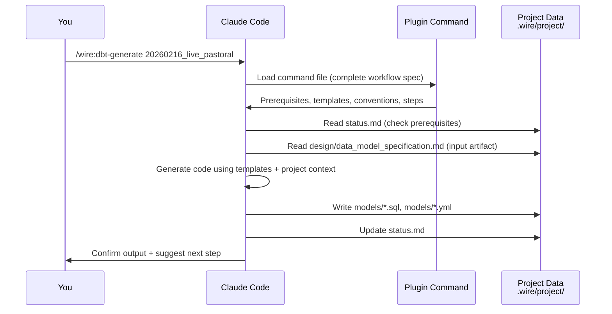
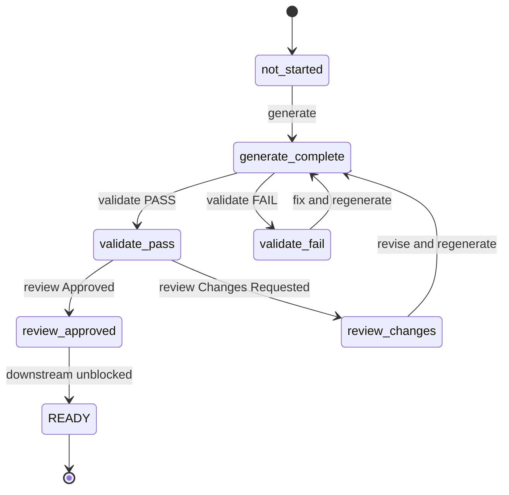
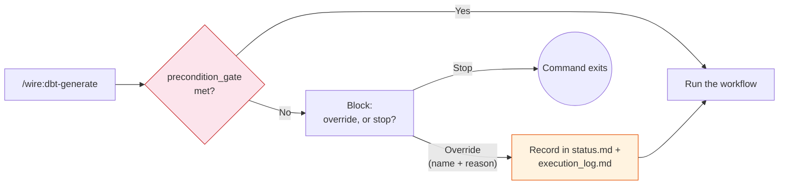

# Core Concepts

> **Command notation:** Commands in this guide are shown in Claude Code format (`/wire:*`). If you are using Gemini CLI, drop the `/wire:` prefix and replace colons with spaces — e.g., `/wire:requirements-generate my_project` becomes `/dp requirements generate my_project`.

## Self-contained command architecture

Every `/wire:*` command is a single, self-contained file — the command file *is* the complete workflow specification. There is no separation between a discovery layer and a logic layer. In Claude Code, these are `.md` files distributed as a plugin; in Gemini CLI, `.toml` files distributed as an extension.



Each command file contains the full workflow inline — from 100 lines for a simple review command to over 1,500 lines for dbt generation.

## The artifact lifecycle

Every artifact produced by the framework follows three gates:

- **Generate**: AI produces the artifact from upstream inputs and templates
- **Validate**: Automated checks run (naming, test coverage, completeness, etc.)
- **Review**: You or the client approves the artifact



An artifact should not progress until all three gates are passed. Downstream artifacts check upstream readiness before they generate.

## The precondition gate

**Since v4.0.0.** Every `-generate`/`-validate`/`-review` command auto-delegates to a shared utility, [`precondition_gate.md`](https://github.com/rittmananalytics/wire/blob/main/wire/specs/utils/precondition_gate.md), before doing anything else. It reads the command's declared `preconditions` from its own front-matter — a static list (e.g. "`data_model.review` must be `approved`"), or the `dynamic` sentinel for the handful of artifacts (`mockups`, `pipeline_design`, `data_model`, `data_quality`, `dashboards`, `deployment`, `training`, `documentation`) whose correct precondition genuinely differs by release type. A `dynamic` precondition resolves at runtime from the current release's `wire/release-types/<type>.yaml` — the same file [Autopilot](../advanced/autopilot) reads to resolve execution order.

If the precondition isn't met, the command **blocks by default**. You can override it, but only explicitly — the gate asks for your name and a reason, and records both in `status.md`'s `precondition_overrides` and in `execution_log.md` as an `override` result. This makes "I skipped a step on purpose" a visible, attributable decision rather than something that just silently happened.



## Git branching

`/wire:new` enforces a mandatory branch check. If you run it while on `main` or `master`, the framework will stop and ask you to create a feature branch before any project files are created. It suggests `feature/{folder_name}` but you can choose your own name.

This ensures all release work lives on a branch that can be reviewed via pull request before merging.

## The status file

Each release has a `status.md` file at `.wire/releases/<release-folder>/status.md`. This is the running instance of the delivery process — created by `/wire:new` when you select a release type, and updated by every subsequent command. It has two roles:

1. **Human-readable**: release overview, notes, blockers, and session history
2. **Machine-readable YAML frontmatter**: the instantiated process definition — which artifacts are in scope, which gates have been passed, and what comes next

The framework updates `status.md` automatically after each command.

## The execution log

Each project maintains an `execution_log.md` file that records a timestamped entry for every command that changes state:

```markdown
| Timestamp | Command | Result | Detail |
|-----------|---------|--------|--------|
| 2026-02-22 14:40 | /wire:requirements-generate | complete | Generated requirements spec (3 files) |
| 2026-02-22 15:12 | /wire:requirements-validate | pass | 14 checks passed, 0 failed |
| 2026-02-22 16:00 | /wire:requirements-review | approved | Reviewed by Jane Smith |
```

## The chain of derivation

Each artifact constrains the next. By the time the AI generates LookML, the dimension names, measure definitions, and join paths are fully determined by upstream artifacts — there is no room for improvisation.

```mermaid
graph LR
    SOW["SOW PDF<br/><i>Client scope</i>"]
    REQ["Requirements<br/><i>FR-1..FR-N, NFR-1..NFR-N</i>"]
    CM["Conceptual Model<br/><i>Business entities<br/>+ relationships</i>"]
    DM["Data Model<br/><i>Tables, columns,<br/>joins, seeds + ERD</i>"]
    DBT["dbt Code<br/><i>SQL models,<br/>YAML tests</i>"]
    LML["LookML<br/><i>Views, explores,<br/>measures</i>"]
    DASH["Dashboards<br/><i>Tiles, filters,<br/>layouts</i>"]

    SOW -->|"extract"| REQ
    REQ -->|"model"| CM
    CM -->|"informs"| DM
    DM -->|"generates"| DBT
    DBT -->|"generates"| LML
    LML -->|"generates"| DASH
```



## Specialist agents

As of v3.9.4, Wire commands auto-delegate to one of fourteen specialist subagents — a `dbt-developer` agent that only knows dbt conventions, a `qa-agent` that is a pure critic with no generation responsibility, and so on. This happens transparently when you run individual commands. To batch-delegate all pending work across an entire release, use `/wire:delegate <release-folder>`.

See [Wire Agents](../advanced/wire-agents) for the full agent roster and how delegation works.

## Research persistence

When the AI performs technical research during a session, it automatically saves structured summaries to `.wire/research/sessions/YYYY-MM-DD-HHMM/summary.md`. The engagement-context skill checks these saved summaries when loading context — if a relevant prior finding exists, it is surfaced rather than re-running the same research.

This means:
- **Cross-release knowledge carries over**: research done during the discovery release is available when working on the delivery release
- **Re-starting a session doesn't lose context**: prior technical findings are always available
- **Less AI context consumed**: the AI reads a condensed summary instead of re-running the same web searches
