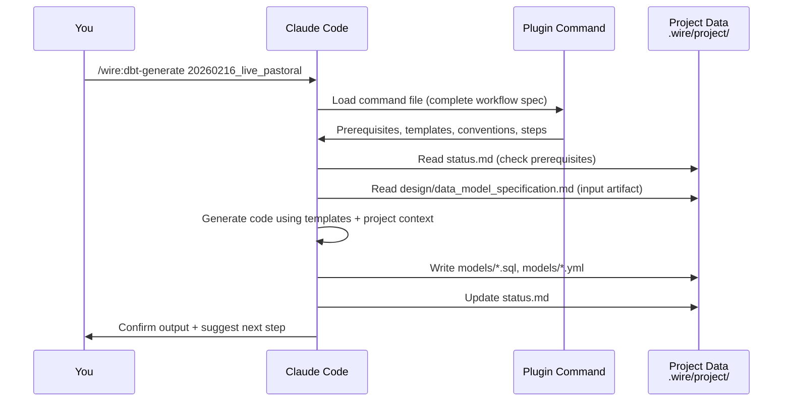
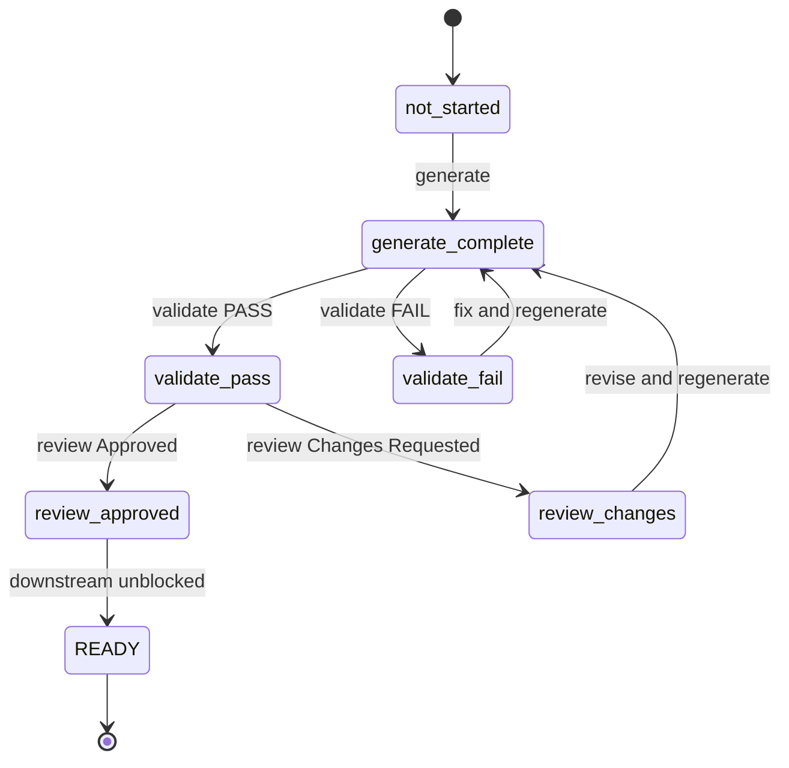
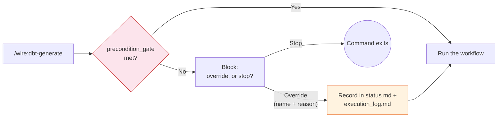
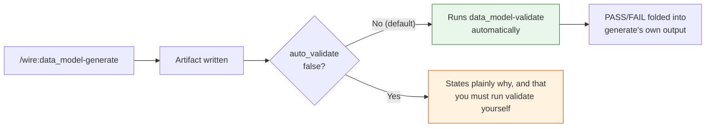

# Core Concepts

> **Command notation:** Commands in this guide are shown in Claude Code format (`/wire:*`). If you are using Gemini CLI, drop the `/wire:` prefix and replace colons with spaces — e.g., `/wire:requirements-generate my_project` becomes `/dp requirements generate my_project`.

## Self-contained command architecture

Every `/wire:*` command is a single, self-contained file — the command file *is* the complete workflow specification. There is no separation between a discovery layer and a logic layer. In Claude Code, these are `.md` files distributed as a plugin; in Gemini CLI, `.toml` files distributed as an extension.


```mermaid
sequenceDiagram
    participant U as You
    participant CC as Claude Code
    participant CMD as Plugin Command
    participant P as Project Data<br/>.wire/project/

    U->>CC: /wire:dbt-generate 20260216_live_pastoral
    CC->>CMD: Load command file (complete workflow spec)
    CMD->>CC: Prerequisites, templates, conventions, steps
    CC->>P: Read status.md (check prerequisites)
    CC->>P: Read design/data_model_specification.md (input artifact)
    CC->>CC: Generate code using templates + project context
    CC->>P: Write models/*.sql, models/*.yml
    CC->>P: Update status.md
    CC->>U: Confirm output + suggest next step
```

Each command file contains the full workflow inline — from 100 lines for a simple review command to over 1,500 lines for dbt generation.

## The artifact lifecycle

Every artifact produced by the framework follows three gates:

- **Generate**: AI produces the artifact from upstream inputs and templates
- **Validate**: Automated checks run (naming, test coverage, completeness, etc.)
- **Review**: You or the client approves the artifact


```mermaid
stateDiagram-v2
    [*] --> not_started
    not_started --> generate_complete : generate
    generate_complete --> validate_pass : validate PASS
    generate_complete --> validate_fail : validate FAIL
    validate_fail --> generate_complete : fix and regenerate
    validate_pass --> review_approved : review Approved
    validate_pass --> review_changes : review Changes Requested
    review_changes --> generate_complete : revise and regenerate
    review_approved --> READY : downstream unblocked
    READY --> [*]
```

An artifact should not progress until all three gates are passed. Downstream artifacts check upstream readiness before they generate.

## Directing rather than typing

**Since v4.0.0, on Claude Code.** You do not have to know which of 313 commands
comes next. Say what you want done and Wire computes the answer from the
release-type definition, names the command, runs it, and stops where a decision
is yours.

Three tiers do the work:

| Tier | Who | Duties |
|---|---|---|
| **Release director** | One human per release | States intent, makes rulings, approves at gates, sets the budget |
| **Orchestrating session** | One session per release | Computes what is runnable, dispatches lanes, writes `status.md` and the execution log, runs the consolidation pass |
| **Lane agents** | 1 to 12, flat | One scoped task each, own tree, own state file, report once |

Everything below in this page still applies unchanged. Every step runs the real
Wire command, so the artifact lifecycle, the precondition gate, auto-validate,
the status file and the execution log behave identically to typing it yourself.
The three things that change:

- **What runs next** is computed from the release-type graph rather than
  remembered, by one shared procedure `/wire:start`, `/wire:delegate`, Autopilot
  and the orchestrating session all read.
- **A review is never run without your decision.** At every review gate Wire
  asks for one of approve now, request changes, or park for client sign-off.
  Parked decisions accumulate in `status.md` and are the first line of every
  session.
- **A release carries a claim**, so a second session working the same release
  offers to join as reviewer rather than dispatching into it.

Typing any `/wire:` command yourself always works, and the command name is
printed before every run so you learn it. To turn it off for a whole engagement,
set `orchestration.mode: manual` in `.wire/engagement/context.md`. Gemini CLI
stays command-driven: it has no skills or agents.

See [The Release Director Model](../advanced/release-director) for the full
rules, the worked session and the lane contract.

## The precondition gate

**Since v4.0.0.** Every `-generate`/`-validate`/`-review` command auto-delegates to a shared utility, [`precondition_gate.md`](https://github.com/rittmananalytics/wire/blob/main/wire/specs/utils/precondition_gate.md), before doing anything else. It reads the command's declared `preconditions` from its own front-matter — a static list (e.g. "`data_model.review` must be `approved`"), or the `dynamic` sentinel for the handful of artifacts (`mockups`, `pipeline_design`, `data_model`, `data_quality`, `dashboards`, `deployment`, `training`, `documentation`) whose correct precondition genuinely differs by release type. A `dynamic` precondition resolves at runtime from the current release's `wire/release-types/<type>.yaml` — the same file [Autopilot](../advanced/autopilot) reads to resolve execution order.

If the precondition isn't met, the command **blocks by default**. You can override it, but only explicitly — the gate asks for your name and a reason, and records both in `status.md`'s `precondition_overrides` and in `execution_log.md` as an `override` result. This makes "I skipped a step on purpose" a visible, attributable decision rather than something that just silently happened.

A precondition may instead be marked `enforcement: advisory`, where running without it is a real choice a consultant may legitimately make — `business_rules` is the case that introduced it. An advisory gate warns, takes a one-line reason, and records an `advisory_skip` rather than blocking. **Since v4.0.0** a director's ruling recorded in `decisions.md` satisfies a matching advisory gate without asking again, and the log row cites the ruling id. A **blocking** precondition is never satisfied by a ruling: the recorded override below is the only way past one.


```mermaid
flowchart LR
    CMD["/wire:dbt-generate"] --> GATE{"precondition_gate\nmet?"}
    GATE -->|Yes| RUN["Run the workflow"]
    GATE -->|No| ASK["Block:\noverride, or stop?"]
    ASK -->|"Override\n(name + reason)"| LOG["Record in status.md +\nexecution_log.md"]
    LOG --> RUN
    ASK -->|Stop| END(("Command exits"))

    style GATE fill:#fce4ec,stroke:#c62828
    style LOG fill:#fff3e0,stroke:#e65100
```

## Automatic validation

**Since v4.0.0.** Validate used to be a separate step a consultant had to remember to run between generate and review. It no longer is: every `generate` command that has a matching `validate` command for the same artifact now runs that validate step automatically once it finishes writing the artifact, and folds the PASS/FAIL result straight into generate's own output — no separate command, nothing to remember.


```mermaid
flowchart LR
    GEN["/wire:data_model-generate"] --> WRITE["Artifact written"]
    WRITE --> AUTO{"auto_validate\nfalse?"}
    AUTO -->|"No (default)"| RUN["Runs data_model-validate\nautomatically"]
    RUN --> RESULT["PASS/FAIL folded into\ngenerate's own output"]
    AUTO -->|Yes| SKIP["States plainly why, and that\nyou must run validate yourself"]

    style RUN fill:#e8f5e9,stroke:#2e7d32
    style SKIP fill:#fff3e0,stroke:#e65100
```

A handful of validate steps are expensive because they do real work beyond re-reading local files — `dbt-validate` runs an actual `dbt run`/`dbt test`, some migration and semantic-layer validates query a live warehouse or BI tool directly. Those generate commands declare `auto_validate: false` in front-matter (see [command schema](https://github.com/rittmananalytics/wire/blob/main/wire/schemas/command-schema.md#auto_validate-generate-commands-only)) and skip the automatic run, stating plainly why and that you need to trigger `validate` yourself once you're ready to pay that cost — rather than paying it on every draft iteration of generate.

Either way, nothing changes about the actual gate that matters: `review` already requires `validate: PASS` for its own artifact as one of its declared preconditions (see below), enforced by the precondition gate regardless of whether validation happened automatically or manually. An `auto_validate: false` artifact can never reach review unvalidated — the opt-out only changes *when* validate runs, never *whether* it's required. A handful of artifacts have no separate validate step at all (`mockups`, `workshops`, `uat`, `viz_catalog`, `playbook`, Droughty's own umbrella `generate`) and this section doesn't apply to them either way.

## Git branching

`/wire:new` enforces a mandatory branch check. If you run it while on `main` or `master`, the framework will stop and ask you to create a feature branch before any project files are created. It suggests `feature/{folder_name}` but you can choose your own name.

This ensures all release work lives on a branch that can be reviewed via pull request before merging.

## The status file

Each release has a `status.md` file at `.wire/releases/<release-folder>/status.md`. This is the running instance of the delivery process — created by `/wire:new` when you select a release type, and updated by every subsequent command. It has two roles:

1. **Human-readable**: release overview, notes, blockers, and session history
2. **Machine-readable YAML frontmatter**: the instantiated process definition — which artifacts are in scope, which gates have been passed, and what comes next

The framework updates `status.md` automatically after each command.

**Since v4.0.0** it also carries three blocks for the director model: `budget`
(concurrent lanes, warehouse spend, where to stop — absent means the defaults),
`parked_decisions` (a list of decisions waiting on you, replacing the single
`paused_at` value), and `agents.coordinator_session` (the release claim: who is
driving, on which branch, and when they last wrote). Where a release type
declares profiles, the release also records which profile it is running.

## The execution log

Each project maintains an `execution_log.md` file that records a timestamped entry for every command that changes state:

```markdown
| Timestamp | Command | Result | Detail | By | Session |
|-----------|---------|--------|--------|----|---------|
| 2026-02-22 14:40 | /wire:requirements-generate | complete | Generated requirements spec (3 files) | Jane Smith | orchestrator [a1b2c3] |
| 2026-02-22 15:12 | /wire:requirements-validate | pass | 14 checks passed, 0 failed | Jane Smith | orchestrator [a1b2c3] |
| 2026-02-22 16:00 | /wire:requirements-review | approved | Reviewed by Jane Smith | Jane Smith | typed |
```

**Since v4.0.0** the log carries two more columns. `By` is the git user. `Session` says what invoked the run: `typed`, `orchestrator [id]`, a lane label such as `dbt-developer [staging 1/2]`, or `autopilot`. Rows written before 4.0.0 have four data columns; they stay valid, are never rewritten, and an old row is treated as unknown rather than assumed to be typed. Rows are append-only and never re-sorted — `/wire:status-sync` reports a row whose timestamp precedes the one above it rather than repairing it, because re-ordering an append-only log destroys the evidence of what happened in what order.

## The chain of derivation

Each artifact constrains the next. By the time the AI generates LookML, the dimension names, measure definitions, and join paths are fully determined by upstream artifacts — there is no room for improvisation.


```mermaid
graph LR
    SOW["SOW PDF<br/><i>Client scope</i>"]
    REQ["Requirements<br/><i>FR-1..FR-N, NFR-1..NFR-N</i>"]
    CM["Conceptual Model<br/><i>Business entities<br/>+ relationships</i>"]
    DM["Data Model<br/><i>Tables, columns,<br/>joins, seeds + ERD</i>"]
    DBT["dbt Code<br/><i>SQL models,<br/>YAML tests</i>"]
    LML["LookML<br/><i>Views, explores,<br/>measures</i>"]
    DASH["Dashboards<br/><i>Tiles, filters,<br/>layouts</i>"]

    SOW -->|"extract"| REQ
    REQ -->|"model"| CM
    CM -->|"informs"| DM
    DM -->|"generates"| DBT
    DBT -->|"generates"| LML
    LML -->|"generates"| DASH
```

## Specialist agents

As of v3.9.4, Wire commands auto-delegate to one of thirteen specialist subagents — a `dbt-developer` agent that only knows dbt conventions, a `qa-agent` that is a pure critic with no generation responsibility, and so on. This happens transparently when you run individual commands. To batch-delegate all pending work across an entire release, use `/wire:delegate <release-folder>`.

**Since v4.0.0** those same agents run as **lanes** under the director model. A
lane writes its own artifact tree and its own state file, rewritten after each
completed item so a lost session costs at most the item in flight, and it does
**not** write `status.md` or the execution log — the orchestrating session is
the single writer of both, and its consolidation pass fails a lane that wrote
the record itself. Outside orchestrated mode, delegation behaves exactly as it
did in 3.x.

See [Wire Agents](../advanced/wire-agents) for the full agent roster and how
delegation works, and [The Release Director Model](../advanced/release-director)
for the lane contract.

## Research persistence

When the AI performs technical research during a session, it automatically saves structured summaries to `.wire/research/sessions/YYYY-MM-DD-HHMM/summary.md`. The engagement-context skill checks these saved summaries when loading context — if a relevant prior finding exists, it is surfaced rather than re-running the same research.

This means:
- **Cross-release knowledge carries over**: research done during the discovery release is available when working on the delivery release
- **Re-starting a session doesn't lose context**: prior technical findings are always available
- **Less AI context consumed**: the AI reads a condensed summary instead of re-running the same web searches
