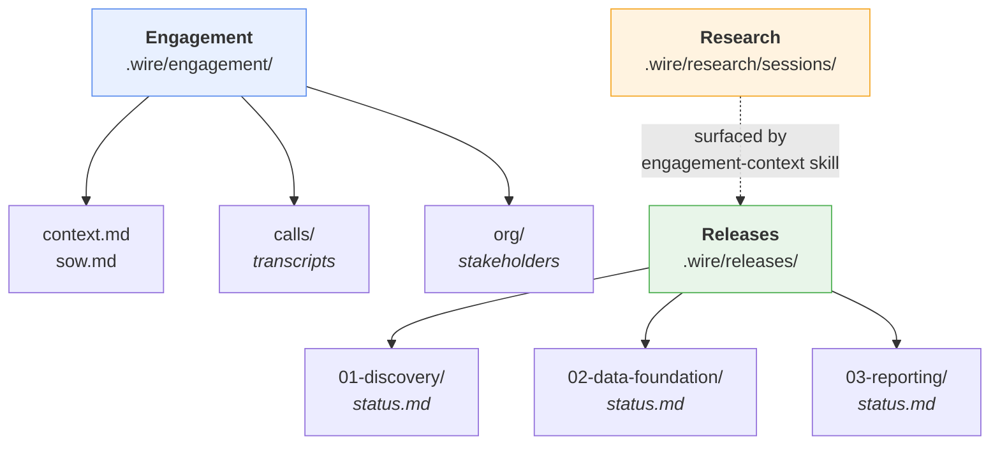
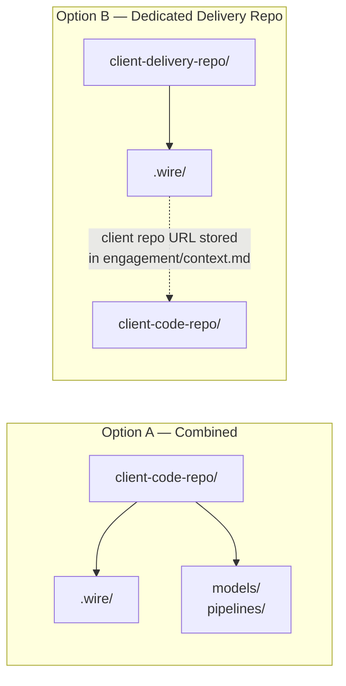

# Engagements and Releases

Wire uses a two-tier structure with precise terminology. Understanding these two concepts is essential before using the framework.

**Engagement** — a complete client engagement from start to finish. The engagement holds all context that spans the whole relationship with that client: the Statement of Work, call transcripts and meeting notes, org charts, stakeholder lists, and the current-state architecture of their systems.

**Release** — a scoped, time-boxed unit of delivery within an engagement. Every piece of work the team does for a client is a release. Releases have a type (discovery, full_platform, pipeline_only, etc.), a defined scope, a planned start and end date, and their own `status.md` tracking file.

An engagement typically contains several releases in sequence:

```
01-discovery       ← Shape Up planning: what do we build and why?
02-data-foundation ← Pipeline + dbt: get data into the warehouse
03-reporting       ← Dashboard extension: client-facing dashboards
04-enablement      ← Training and documentation
```

## The two-tier folder structure

Every Wire engagement uses this structure in the `.wire/` directory:

```
.wire/
  engagement/
    context.md          ← engagement overview, objectives, key stakeholders
    sow.md              ← statement of work (copied at engagement setup)
    calls/              ← call transcripts and meeting notes
    org/                ← org charts and roles/responsibilities
  releases/
    01-discovery/       ← discovery release type
      status.md
      planning/
        problem_definition.md
        pitch.md
        release_brief.md
        sprint_plan.md
    02-data-foundation/  ← delivery release type (e.g. pipeline_only)
      status.md
      requirements/
      design/
      dev/
      test/
      deploy/
      enablement/
  research/
    sessions/            ← persisted technical research (auto-populated)
```



## Setting up a new engagement

Run `/wire:new`. The framework asks:

1. **Client and engagement name** — for folder naming and status files
2. **Repo mode**:
   - *Combined* (default): `.wire/` lives directly in the client's code repo
   - *Dedicated delivery repo*: this repo is exclusively for Wire artifacts; client code lives in a separate repo
3. **First release type** — usually `discovery` for a new engagement, or a delivery type if joining mid-stream
4. **SOW path** — optional; copied to `engagement/sow.md`

To add a subsequent release to an existing engagement, run `/wire:new` again. The framework detects the existing engagement context and skips directly to asking for the new release type.

## Repo mode: combined vs dedicated delivery



**Option A** is the default. Wire artifacts live in the same repo as the client's code.

**Option B** is for engagements where adding files directly to the client's code repo is not acceptable (regulated industries, multi-stakeholder repos) or where the client has several code repos. The delivery repo is typically named `<client_name>-delivery`.

## Session lifecycle

As of v3.4.20, session state is managed automatically — no explicit session commands required.

The **engagement-context skill** fires automatically on the first message in any Wire repo. It locates the active release, reads `status.md`, and outputs a 4–6 line context summary before any work begins.

After each command completes, the framework writes its result to `status.md` and appends a row to `execution_log.md`.

For an optional structured planning ritual, use:

```
/wire:session-plan [release-folder]
```

> **Note**: `/wire:session:start` and `/wire:session:end` have been deprecated as of v3.4.20.
