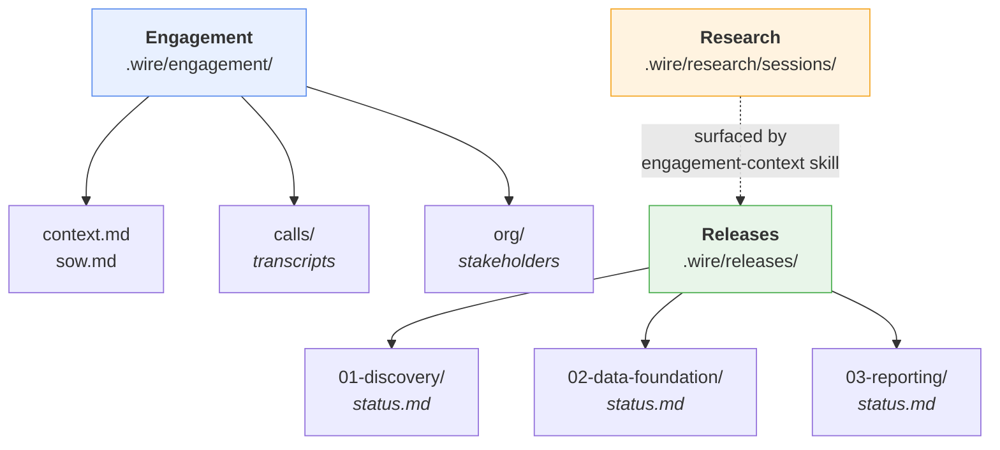
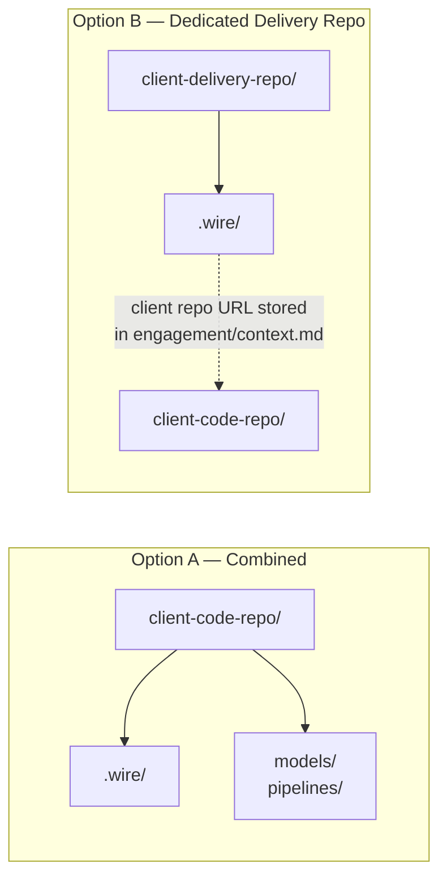

# Engagements and Releases

A client relationship rarely consists of a single piece of work. A discovery phase leads to a data foundation, which leads to reporting and then to training, and along the way the team gathers a Statement of Work, call transcripts, org charts and a picture of the client's current systems that every later piece of work needs to see. Wire therefore uses a two-tier structure, with precise terminology, to keep the two apart: the engagement holds what spans the whole relationship, and each release holds one scoped piece of delivery inside it. Understanding these two concepts is essential before using the framework, so we will define them first, then look at the folder structure they produce, at how you set one up and at what happens when a session starts.

**Engagement** An engagement is a complete client engagement from start to finish, and it holds all the context that spans the whole relationship with that client: the Statement of Work, call transcripts and meeting notes, org charts, stakeholder lists and the current-state architecture of their systems.

**Release** A release is a scoped, time-boxed unit of delivery within an engagement, and every piece of work the team does for a client is a release. Releases have a type (discovery, full_platform, pipeline_only, etc.), a defined scope, a planned start and end date and their own `status.md` tracking file.

An engagement typically contains several releases in sequence, as in this example:

```
01-discovery       ← Shape Up planning: what do we build and why?
02-data-foundation ← Pipeline + dbt: get data into the warehouse
03-reporting       ← Dashboard extension: client-facing dashboards
04-enablement      ← Training and documentation
```

## The two-tier folder structure

So where does all of this live? Every Wire engagement uses this structure in the `.wire/` directory, with the engagement-wide context at the top, one folder per release beneath it and a research area alongside:

```
.wire/
  engagement/
    context.md          ← engagement overview, objectives, key stakeholders
    sow.md              ← statement of work (copied at engagement setup)
    calls/              ← call transcripts and meeting notes
    org/                ← org charts and roles/responsibilities
  releases/
    01-discovery/       ← discovery release type
      status.md
      planning/
        problem_definition.md
        pitch.md
        release_brief.md
        sprint_plan.md
    02-data-foundation/  ← delivery release type (e.g. pipeline_only)
      status.md
      requirements/
      design/
      dev/
      test/
      deploy/
      enablement/
  research/
    sessions/            ← persisted technical research (auto-populated)
```


```mermaid
graph TD
    ENG["<b>Engagement</b><br/>.wire/engagement/"]
    SOW["context.md<br/>sow.md"]
    CALLS["calls/<br/><i>transcripts</i>"]
    ORG["org/<br/><i>stakeholders</i>"]
    RESEARCH["<b>Research</b><br/>.wire/research/sessions/"]
    RELEASES["<b>Releases</b><br/>.wire/releases/"]
    R1["01-discovery/<br/><i>status.md</i>"]
    R2["02-data-foundation/<br/><i>status.md</i>"]
    R3["03-reporting/<br/><i>status.md</i>"]

    ENG --> SOW
    ENG --> CALLS
    ENG --> ORG
    RESEARCH -.->|"surfaced by<br/>engagement-context skill"| RELEASES
    RELEASES --> R1
    RELEASES --> R2
    RELEASES --> R3

    style ENG fill:#e8f0ff,stroke:#5b8dee
    style RESEARCH fill:#fff3e0,stroke:#f5a623
    style RELEASES fill:#e8f5e9,stroke:#4caf50
```

## Setting up a new engagement

Setting up a new engagement is a single command, `/wire:new`, and the framework asks you four things:

1. **Client and engagement name**: for folder naming and status files
2. **Repo mode**:
   - *Combined* (default): `.wire/` lives directly in the client's code repo
   - *Dedicated delivery repo*: this repo is exclusively for Wire artifacts; client code lives in a separate repo
3. **First release type**: usually `discovery` for a new engagement, or a delivery type if joining mid-stream
4. **SOW path**: optional; copied to `engagement/sow.md`

To add a subsequent release to an existing engagement, run `/wire:new` again, and the framework detects the existing engagement context and skips directly to asking for the new release type.

## Repo mode: combined vs dedicated delivery

The second of those questions deserves a closer look, because the answer decides where the `.wire/` directory sits in relation to the client's own code.


```mermaid
graph LR
    subgraph combined["Option A — Combined"]
        CCR["client-code-repo/"]
        CWire[".wire/"]
        CModels["models/<br/>pipelines/"]
        CCR --> CWire
        CCR --> CModels
    end

    subgraph dedicated["Option B — Dedicated Delivery Repo"]
        DDR["client-delivery-repo/"]
        DWire[".wire/"]
        DDR --> DWire
        DWire -.->|"client repo URL stored<br/>in engagement/context.md"| ClientRepo["client-code-repo/"]
    end
```

**Option A** is the default, and Wire artifacts live in the same repo as the client's code.

**Option B** is for engagements where adding files directly to the client's code repo is not acceptable (regulated industries, multi-stakeholder repos) or where the client has several code repos, and in that case the delivery repo is typically named `<client_name>-delivery`.

## Session lifecycle

What happens when you open a session? As of v3.4.20, session state is managed automatically, so there are no explicit session commands to run.

The **engagement-context skill** fires automatically on the first message in any Wire repo. It locates the active release, reads `status.md` and outputs a 4–6 line context summary before any work begins, so that you start each session knowing where the release stands.

After each command completes, the framework writes its result to `status.md` and appends a row to `execution_log.md`.

For an optional structured planning ritual, use:

```
/wire:session-plan [release-folder]
```

> **Note**: `/wire:session:start` and `/wire:session:end` have been deprecated as of v3.4.20.
