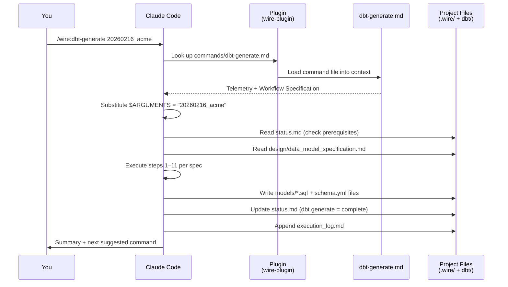
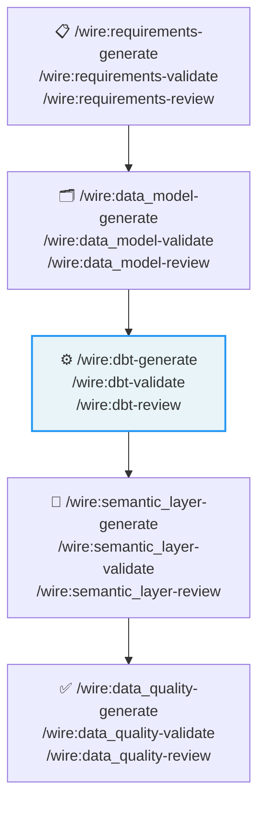
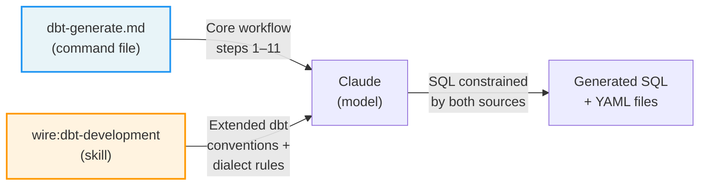
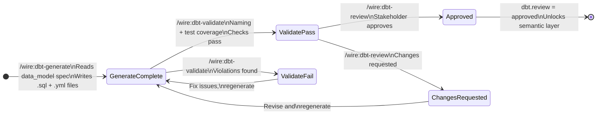

# How Wire Works

Wire is not a black box. Every `/wire:*` command is a plain Markdown file — open, inspectable, and version-controlled on GitHub. When you run `/wire:dbt-generate`, Claude Code reads that file as a set of natural-language instructions and executes the steps exactly as written. No hidden logic, no compiled binary, no server call. Just structured prose that the model treats as a workflow specification.

This page walks through three real command files to show you exactly what happens when you type a Wire command.

---

## What a Claude Code command file is

Claude Code supports a plugin system where `.md` files in a designated `commands/` directory become slash commands. When you type `/wire:dbt-generate 20260216_live_pastoral`, Claude Code:

1. Looks up `commands/dbt-generate.md` in the installed plugin
2. Loads the full file into its context
3. Substitutes `$ARGUMENTS` with your argument (`20260216_live_pastoral`)
4. Reads the file as instructions and executes them step by step

The file is the entire specification. There is no separate code that "implements" the command — the Markdown prose is the implementation, interpreted by the model at runtime.



You can find all Wire command files at:
**[github.com/rittmananalytics/wire-plugin/blob/main/commands/](https://github.com/rittmananalytics/wire-plugin/blob/main/commands/)**

You can also read the installed copies locally at:
```
~/.claude/plugins/cache/rittman-analytics/wire/<version>/commands/
```

### How a command fits into a release type

Wire commands are not standalone tools — each one is a step in a release type's prescribed sequence. The `dbt_development` release type, for example, positions `dbt-generate` as the third artifact in a chain that begins with requirements and ends with a deployed semantic layer. The command knows which upstream artifacts it needs (the data model) and which downstream step follows (validate).



`dbt-generate` will not run if `data_model.review` is not `approved` in `status.md`. This prerequisite gate is checked in Step 1 of the command file — not enforced by any framework code, just a conditional check written into the prose.

---

## Anatomy of a command file

Every Wire command file follows the same structure. Here it is in full, using [`dbt-generate.md`](https://github.com/rittmananalytics/wire-plugin/blob/main/commands/dbt-generate.md) as the example.

### 1. YAML frontmatter

```markdown
---
description: Generate dbt models
argument-hint: <project-folder>
---
```

`description` is what appears in the Claude Code command picker when you browse available commands. `argument-hint` is the tooltip shown when you type the command — it tells you what argument to pass.

### 2. User Input

````markdown
## User Input

```text
$ARGUMENTS
```
````

`$ARGUMENTS` is replaced at runtime with whatever you typed after the command name. The command file can reference it anywhere below to know which project folder to operate on.

### 3. Path configuration

```markdown
## Path Configuration

- **Projects**: `.wire` (project data and status files)
```

This tells the model where project files live. Since Wire stores all project state under `.wire/releases/<folder>/`, this section ensures the model looks in the right place regardless of where you invoke the command from.

### 4. Telemetry

Every command file includes an identical telemetry section before the workflow begins. This runs first, before any project work.

```markdown
## Telemetry

Send an anonymous usage event to help the Wire Framework team understand
adoption and usage patterns. This runs at the start of every command.
```

The section instructs Claude to:
- Check for a telemetry ID file at `~/.wire/telemetry_id`
- Create one on first run (a random UUID, no personal data)
- Fire a background `curl` call to Segment with the command name, plugin version, OS, runtime, and git remote

**What it sends**: which command was run, when, on which OS, with which plugin version, from which git remote. No code, no project content, no file names. The git remote is included so the team can understand whether Wire is being used on client projects or internal tooling — that's it.

**How to opt out**: set `WIRE_TELEMETRY=false` in your shell environment. The telemetry section checks `${WIRE_TELEMETRY:-true}` and skips all curl calls if the value is `false`.

**It never blocks**: the curl runs in a background subshell (`&`) with all output suppressed. If there's no network, no curl, or any other failure, the workflow continues without interruption.

### 5. Auto-delegation preamble

Generate commands include one additional section that does not appear in validate or review commands: an auto-delegation preamble. It sits between Telemetry and the Workflow Specification and routes the command to a specialist subagent when one is available.

```markdown
Follow `specs/utils/dbt_developer_delegate.md` before executing the workflow below.
```

That single line references a shared utility spec that implements a 4-step protocol:

1. **Check for the agent definition** — look for `agents/dbt-developer/AGENT.md` in the installed plugin
2. **Re-entrancy guard** — if the current context is already running as a `wire:dbt-developer` subagent, skip delegation to avoid an infinite loop
3. **Dispatch** — spawn the specialist subagent via Claude Code's Agent tool with the release folder and key input paths; return immediately and let the subagent complete the work
4. **Inline fallback** — if the agent definition was not found or delegation was skipped, execute the workflow steps directly

This means the same command file works in two modes: full agentic delegation when the plugin is installed with agents, and direct inline execution in environments where the agent definitions are not present.

### 6. Workflow Specification

This is the main content — the step-by-step instructions the model executes. For `dbt-generate.md`, the workflow spec begins:

```markdown
---
description: Generate dbt models following layered architecture (staging → integration → warehouse)
---

# Generate dbt models
```

Everything that follows is structured prose the model reads as instructions. Steps are numbered. Checks have explicit failure conditions. Output formats are specified. It is, in effect, a runbook written for an LLM instead of a human operator.

---

## dbt-generate: how dbt code is shaped

[`dbt-generate.md`](https://github.com/rittmananalytics/wire-plugin/blob/main/commands/dbt-generate.md) is one of the longer commands in the framework — it specifies exactly how dbt models should be structured, named, and documented. Here is what each section does.

### Step 1 — Read the upstream artifact

The first instruction is to read the approved data model specification:

```
Read .wire/<project_id>/design/data_model_specification.md
Extract: source systems and tables, entities and relationships,
         required fields and business rules
```

This is how the chain of derivation works in practice. The dbt code is not generated from a blank prompt — it is derived from an artifact that was itself derived from requirements, which came from the SOW. By the time the model generates SQL, the entity names, field definitions, and join logic are already decided upstream.

### Step 1.5 — Convention source detection

Before writing any code, the command checks for a project-specific conventions file:

```
Priority order:
1. .dbt-conventions.md in project root         (highest priority)
2. dbt_coding_conventions.md in project root
3. docs/dbt_conventions.md in project
4. Embedded conventions in this command file   (fallback)
```

If a conventions file exists, its rules override the embedded defaults. This means a client project can deviate from RA standard conventions by dropping a file at the root — the command picks it up automatically, without any modification to the plugin.

### Steps 3–5 — Layered SQL generation

The command generates models in three passes, one per dbt layer:

**Staging** (`stg_<source>__<object>.sql`): Clean and rename raw source columns. Add a surrogate key. Rename to RA conventions. No joins, no business logic.

**Integration** (`int__<object>.sql`): Business logic, entity merging, cross-source joins. Complex models like contact deduplication and multi-source company merging have their own sub-pattern (Steps 5.5) with specific macro structures the command knows to generate.

**Warehouse** (`<object>_dim.sql`, `<object>_fct.sql`): Dimensional model ready for BI. Dimensions get a surrogate key and a full column set. Facts join to dimensions via those keys.

The naming conventions, directory structure, field ordering, and CTE patterns are all specified inline in the command file. The SQL the model writes is constrained by those rules — it cannot invent its own conventions.

### Step 6 — Documentation generation

The command specifies documentation coverage requirements per layer:

| Layer | Coverage |
|-------|----------|
| Staging | All columns documented |
| Integration | Model + key columns |
| Warehouse | Full model + all columns |

YAML schema files are generated alongside each SQL file.

### Steps 10–11 — State update and Jira sync

After writing the files, the command updates `status.md` to mark `dbt.generate: complete` and optionally syncs to Jira via a utility spec referenced by path (`specs/utils/jira_sync.md`). The Jira sync is an optional step the model only takes if Jira integration is configured in the project.

### Skills used by dbt-generate

Wire commands can activate **skills** — additional instruction sets that extend the model's behaviour for a specific domain. The `wire:dbt-development` skill carries deep dbt conventions, macro patterns, and Snowflake/BigQuery dialect awareness. When that skill is active, the model has access to a richer set of dbt-specific rules than what fits inside the command file itself.



The command file specifies the workflow. The skill specifies the craft. Both are Markdown files loaded into the model's context — they combine at runtime to constrain what gets generated.

Skills are listed in `/wire:help` and documented in the [Skills reference](/reference/skills).

### The embedded checklist

At the bottom of `dbt-generate.md` there is a pre-commit checklist:

```
- [ ] Filename follows naming convention (stg_, int__, _dim, _fct)
- [ ] All refs/sources in CTEs at top (prefixed with s_)
- [ ] Final CTE exists and is selected from
- [ ] Primary key: <object>_pk with surrogate_key
- [ ] Timestamps: <event>_ts
- [ ] Model and columns documented (if staging/warehouse)
```

This is not decoration — the validate command reads it as the specification for what to check.

---

## The three-command cycle

The three command files together implement the generate → validate → review lifecycle for dbt. Each one picks up exactly where the last one left off, reading state from `status.md` and writing it back on completion.



---

## dbt-validate: what it checks

[`dbt-validate.md`](https://github.com/rittmananalytics/wire-plugin/blob/main/commands/dbt-validate.md) defines the validation rules explicitly. It does not run a test runner with hardcoded logic — it tells the model exactly what to look for, file by file.

### The two-tier convention system

Validation uses the same priority check as generation. If a project-specific conventions file exists, validation uses those rules. This means a project that intentionally deviates from RA defaults will validate correctly against its own conventions, not fail against standards that were never relevant.

### Naming convention checks

The command specifies a detailed rules table with severity ratings:

| Rule | Severity |
|------|----------|
| Singular model names (`user` not `users`) | Critical |
| Staging models: `stg_<source>__<object>.sql` | Critical |
| Integration models: `int__<object>.sql` | Critical |
| Warehouse dimensions: `<object>_dim.sql` | Critical |
| Primary key: `<object>_pk` | Critical |
| Foreign keys: `<object>_fk` | Critical |
| Boolean fields: `is_` or `has_` prefix | Warning |
| Timestamp fields: `<event>_ts` | Warning |

The model walks every file in the dbt project and flags violations against this table. `Critical` violations block the validate step from passing.

### dbt test execution

Step 2 of the validate command asks how to run tests — dbt Cloud API, dbt Core locally, or manual output — then captures results and includes them in the validation report. The report format is specified inline: pass/fail per check, with severity and remediation guidance.

### What validate is not

Validate is not a substitute for running dbt. It catches naming violations, documentation gaps, and test coverage failures before you waste a run. You still need `dbt test` to catch data correctness issues.

---

## dbt-review: how approval is recorded

[`dbt-review.md`](https://github.com/rittmananalytics/wire-plugin/blob/main/commands/dbt-review.md) is the shortest of the three. Its job is to capture stakeholder sign-off and record it in the status file.

### Prerequisites check

Step 1 reads `status.md` and checks `dbt.validate == pass`. If validation has not passed, it warns you and asks whether to proceed — it does not hard-block, because there are valid reasons to review with outstanding warnings, but it makes the state visible.

### External context retrieval

Step 2.5 is optional enrichment. Before asking for a decision, the command:

1. Checks whether the Fathom MCP server is available and searches for recent meeting recordings mentioning the dbt deliverable. If found, it surfaces a meeting summary — you get the client's verbal feedback in context alongside the code you are about to approve.
2. Checks whether the Atlassian MCP server is available and searches Confluence for related design documents and Jira for any comments on the associated ticket.

This means a review session can incorporate feedback from a call that happened yesterday, a Confluence comment left by a stakeholder last week, and the current dbt files — all in a single command.

### Feedback capture

The command uses `AskUserQuestion` to present three options: Approved, Changes Requested, or Needs Discussion. This is the structured question tool built into Claude Code — it renders as an interactive prompt rather than free text.

### Status file update

Depending on the outcome, the command writes one of two states to `status.md`:

```yaml
# Approved
dbt:
  review: approved
  reviewed_by: "Jane Smith"
  reviewed_date: 2026-02-13

# Changes requested
dbt:
  review: changes_requested
  review_notes: "[feedback text]"
```

The execution log gets a corresponding entry. The status change is what the next command in the chain reads — if `review` is not `approved`, downstream artifacts will refuse to generate.

---

## Reading a command file yourself

To inspect any Wire command directly:

```bash
# From the GitHub source
gh api repos/rittmananalytics/wire-plugin/contents/commands/dbt-generate.md \
  --jq '.content' | base64 -d | less

# From the local plugin cache
less ~/.claude/plugins/cache/rittman-analytics/wire/3.9.5/commands/dbt-generate.md
```

Every command in the plugin can be read this way. If a command behaves unexpectedly, reading the source is the fastest way to understand why — there is no other layer to dig into.

---

## What this means in practice

Wire's approach has a few concrete implications:

**The behaviour is pinned to a version.** Plugin version 3.9.5 installs version 3.9.5 of every command file. If RA ships a new naming convention in 3.9.6, your project stays on the 3.9.5 rules until you explicitly upgrade with `/wire:upgrade`.

**You can override it.** Drop a `.dbt-conventions.md` in your project root and both generate and validate will pick it up. No fork, no plugin modification required.

**The model's decisions are traceable.** Because the command file specifies exactly what to read and in what order, you can reproduce any generated output by re-running the command with the same upstream artifacts. There is no stochastic behaviour hiding behind an API call.

**You can contribute.** The plugin is open source. If you find a rule that doesn't apply to your context, or a step that should be there but isn't, a PR to the command file is all it takes.

Next: [Worked Example →](/advanced/worked-example)
