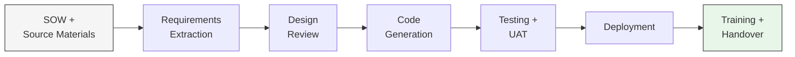

# The Wire Framework

**Rittman Analytics** | Version 3.10.2

The Wire Framework is Rittman Analytics' AI-accelerated delivery system for data platform engagements. It uses an AI coding agent — either **Claude Code** (Anthropic) or **Gemini CLI** (Google) — as its runtime, and encodes 20+ years of analytics engineering methodology as structured, executable workflow specifications.

In practical terms: instead of a practitioner manually writing dbt models, LookML, pipeline code, training materials, and documentation over several weeks, the framework directs the AI to produce all of these artifacts in a fraction of the time — with embedded quality gates ensuring the output meets our standards.

**The framework does not replace practitioners.** It gives them an AI that works at machine speed and never forgets a naming convention, freeing the practitioner to focus on client relationships, design decisions, and the creative problem-solving that AI cannot do.

## What it looks like in practice

You open Claude Code in a git repository where the framework is installed. You type `/wire:new` and answer a few questions about the client and project. You copy the SOW PDF into a folder. Then you work through a sequence of `/wire:*` commands — generating requirements, then designs, then code, then tests, then a deployment runbook, then training materials. At each step the framework validates the output and asks you or the client to approve it before moving on. Alternatively, you can use `/wire:autopilot` to have the AI run through the entire lifecycle autonomously.

At the end, you have: a production-ready dbt project, a LookML semantic layer, deployed Looker dashboards, data quality tests, a deployment runbook, and training materials — all version-controlled in git with a complete audit trail.

## The Problem It Solves

### The methodology gap

Naive AI code generation tools can produce syntactically valid SQL. What they fail at is *methodology*:

- Consistent naming conventions across 15+ models (`stg_focus__student_notes`, not `staging_notes` or `stg_notes`)
- Correct surrogate key patterns and grain management
- Relationship test coverage on every foreign key
- Traceability from business requirements to warehouse columns
- Cross-system join integrity
- Requirements-driven design rather than improvised structure

These failures are not knowledge failures — the models know the conventions. They are *context and control* failures. Without a structured methodology constraining the generation process, LLMs improvise, and the accumulated inconsistencies across a project erode the value proposition entirely.

### How the Wire Framework closes the gap

The framework encodes the methodology itself as workflow specifications that the AI reads before generating anything. Each specification tells the AI:

- Which upstream artifacts to read as inputs
- What templates to follow for naming, structure, and testing
- What validation checks to apply before presenting output for review
- How to update the project state tracker

The AI fills in the blanks within a tightly constrained template rather than inventing structure from scratch. The result looks like it was written by a senior analytics engineer who has been on the project for months — because it was generated by an AI that read every design decision and requirement that a senior analytics engineer would have absorbed.

:::info[About Wire and Rittman Analytics]

Wire is designed primarily for Rittman Analytics team members and our clients' data teams — providing an AI-augmented way to develop data analytics platforms, projects, and platform migrations. The integrations, processes, and workflows embedded in Wire reflect current best practices at Rittman Analytics.

The plugin code and documentation are made publicly available under the [Functional Source License 1.1](https://fsl.software) — you're free to use them within those terms. If you'd like more information about Wire or our consulting services, get in touch at [info@rittmananalytics.com](mailto:info@rittmananalytics.com).

:::
