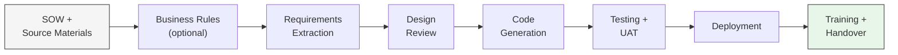

# The Wire Framework

**Rittman Analytics** | Version 4.0.0

If you have ever spent the first week of a data platform engagement rebuilding the same scaffolding from memory, you will recognise the problem the Wire Framework was built to solve. The Wire Framework is Rittman Analytics' AI-accelerated delivery system for data platform engagements. It uses an AI coding agent, either **Claude Code** (Anthropic) or **Gemini CLI** (Google), as its runtime, and it encodes more than 20 years of analytics engineering methodology as structured, executable workflow specifications that the agent reads and follows rather than improvises around.

In practical terms, instead of a practitioner writing dbt models, LookML, pipeline code, training materials and documentation by hand over several weeks, the framework directs the AI to produce all of these artifacts in a fraction of the time, with embedded quality gates that check the output against our standards before anyone reviews it.

**The framework does not replace practitioners.** It gives them an AI that works at machine speed and never forgets a naming convention, which frees the practitioner to concentrate on client relationships, design decisions and the creative problem-solving that AI cannot do.

## New in 4.0

Wire 4.0 changes two things. The rules for how a delivery engagement runs stopped being prose inside Wire's own source and became data the framework reads and enforces, and because those rules are now data, you no longer have to know which of 334 commands comes next.

**You direct; Wire runs the commands.** Say what you want done and Wire works out which command that is from the release-type definition, runs it, tells you what it did in plain words and stops where a decision is yours, naming the commands that ran in the closing line of each report so that you learn them as you go. Two usage reviews found that the command surface, not the method, was what stopped people using Wire: on one engagement, orientation commands were a third of all runs, and on another, two client-side developers made 34 commits touching Wire artifacts and ran zero Wire commands. Every step still runs the real command, so the record on disk is identical to typing it yourself. Typing commands still works, always, and one setting restores the old behaviour for a whole engagement. [Part 1 of this guide](./using-wire/what-is-wire) shows the new way of working through four releases, and [The release director model](./advanced/release-director) has the rules.

**The process is written down.** Every release type now has a machine-readable definition: its phases, the documents each produces and what depends on what. A shared gate reads it and stops a command whose prerequisites are not met. Overriding is allowed, but it takes your name and a reason, and both are recorded. Autopilot reads the same definition rather than keeping its own copy, which had drifted.

**Agree what the numbers mean before building.** [Business rules discovery](./advanced/business-rules) is an optional first step that records, per business domain, every competing definition of a metric together with the file it came from, what they disagree on, the decision and who approved it. A rule nobody has decided is recorded rather than left out, and each disputed rule generates a reconciliation query that runs immediately instead of surfacing as a mismatch during testing.

**Start from a model that already exists.** Where a client models their data in [Modality](./advanced/modality-models), Wire reads the entities, sources and relationships from it rather than deriving them again. The requirements are still read, and the difference between the two is raised as a finding.

**Discovery that produces a model.** [SOP discovery](./release-types/discovery-sop) now has two routes. The default diagnoses. The modelling-led route replaces the three analyses with a current-state appraisal and a signed-off conceptual and logical model, and produces the roadmap before the playback, because the roadmap is one of the things the sponsor signs off.

**A library of industry data models.** When designing a data model, Wire looks for a plausible match in a library covering six industries plus cross-industry patterns, and proposes it as a starting point. It is always a proposal, never adopted automatically.

Full detail is in the [release notes](./reference/release-notes).

## What it looks like in practice

You open Claude Code in a git repository where the framework is installed, point Wire at the SOW and say what you want: "new engagement for this client, dashboards for store performance, two lanes max, stop at decisions." Wire proposes the release type with its reason, you confirm once, and it runs `/wire:new`. From there you direct in plain language ("run what's next", "approve it", "park that for the client") and Wire runs the right command each time, reporting what it did and naming the command at the end. It generates requirements, then designs, then code, then tests, then a deployment runbook, then training materials. At each step it checks the output automatically, and it stops at every approval gate for your decision. If a step's prerequisite is not ready, it says so rather than proceeding.

You can also type every command yourself, exactly as in 3.x, since the commands are unchanged and the record is identical either way. Or use `/wire:autopilot` at the other end of the range, where the AI answers its own review gates and runs the entire lifecycle unattended.

At the end, you have a production-ready dbt project, a LookML semantic layer, deployed Looker dashboards, data quality tests, a deployment runbook and training materials, all version-controlled in git with a complete audit trail.

```mermaid
graph LR
    A["SOW +<br/>Source Materials"] --> A2["Business Rules<br/>(optional)"]
    A2 --> B["Requirements<br/>Extraction"]
    B --> C["Design<br/>Review"]
    C --> D["Code<br/>Generation"]
    D --> E["Testing +<br/>UAT"]
    E --> F["Deployment"]
    F --> G["Training +<br/>Handover"]

    style A fill:#f5f5f5,stroke:#333
    style G fill:#e8f5e9,stroke:#333
```

## The Problem It Solves

### The methodology gap

So why not simply use a general-purpose coding assistant? Naive AI code generation tools can produce syntactically valid SQL, and they do so quickly. What they fail at is *methodology*:

- Consistent naming conventions across 15 or more models (`stg_focus__student_notes`, not `staging_notes` or `stg_notes`)
- Correct surrogate key patterns and grain management
- Relationship test coverage on every foreign key
- Traceability from business requirements to warehouse columns
- Cross-system join integrity
- Requirements-driven design rather than improvised structure

These failures are not knowledge failures, since the models know the conventions perfectly well. They are *context and control* failures. Without a structured methodology constraining the generation process, LLMs improvise, and the accumulated inconsistencies across a project erode the value proposition entirely.

### How the Wire Framework closes the gap

The framework encodes the methodology itself as workflow specifications that the AI reads before generating anything. Each specification tells the AI which upstream artifacts to read as inputs, what templates to follow for naming, structure and testing, what validation checks to apply before presenting output for review, and how to update the project state tracker.

It follows that the AI fills in the blanks within a tightly constrained template rather than inventing structure from scratch. The result looks as though it was written by a senior analytics engineer who has been on the project for months, because it was generated by an AI that read every design decision and requirement that a senior analytics engineer would have absorbed.

:::info[About Wire and Rittman Analytics]

Wire is designed primarily for Rittman Analytics team members and our clients' data teams, providing an AI-augmented way to develop data analytics platforms, projects and platform migrations. The integrations, processes and workflows embedded in Wire reflect current best practices at Rittman Analytics.

The plugin code and documentation are made publicly available under the [Functional Source License 1.1](https://fsl.software), and you are free to use them within those terms. If you would like more information about Wire or our consulting services, get in touch at [info@rittmananalytics.com](mailto:info@rittmananalytics.com).

:::
