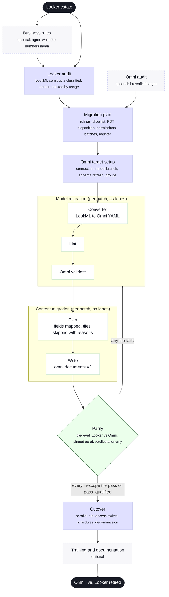

# BI Tool Migration Release

:::tip[You do not have to type these commands]

Since v4.0.0, on Claude Code, you can direct this release in plain language
instead: say what you want done and Wire works out which command that is from
this release type's definition, names it before it runs, runs it, and stops at
every review gate for your decision. The commands, the artifacts and the record
on disk are identical either way, and typing them still works. See
[The Release Director Model](../advanced/release-director). This release type
was built for that model: model batches, content batches and parity sweeps run
as lanes, and the rulings (parity or redesign, what to drop, PDT disposition,
cutover) are yours. The
[Looker to Omni Migration tutorial](../tutorials/looker-to-omni-migration) runs
a full release this way and names the command Wire runs at each step.

:::

The BI Tool Migration release type moves a reporting layer from one BI tool to another while the warehouse and dbt layer stay where they are. The first and, in 4.0.0, only pair is **Looker to Omni**: LookML views and explores become Omni views and topics on a model branch, Looker dashboards and Looks become Omni dashboards, every migrated tile is proven equivalent before users are switched, and Looker is decommissioned after a parallel run.

It is not the same as migrating an Omni estate between warehouses. That is `platform_migration` with `migration.reporting_tool: omni`, where the pivot is the Omni connection. Here the pivot is the semantic model itself.

**Supported pairs**: `looker_to_omni`

## Phases and commands

| Phase | Artifact | Commands | What it produces |
|---|---|---|---|
| Business Rules (optional) | `business_rules` | `/wire:business-rules-*` | The register of metric definitions. LookML measures are its input. |
| Audit | `looker_audit` | `/wire:looker-audit-generate`, `-validate`, `-review` | `audit/looker_audit.md` plus two catalogs: every LookML construct with a translation class (`mechanical`, `assisted`, `redesign`) and every dashboard, Look, tile and schedule with usage. |
| Audit (optional) | `omni_audit` | `/wire:omni-audit-*` | Only when the client already has Omni content. |
| Plan | `bi_migration_plan` | `/wire:bi-migration-plan-generate`, `-validate`, `-review` | Usage-ranked inventory, the director's rulings, model and content batches, the migration register bootstrapped with one row per in-scope object. |
| Target | `omni_target_setup` | `/wire:omni-target-setup-generate`, `-validate`, `-review` | Connection check, model branch, schema refresh, groups and user attributes. |
| Model | `omni_model` | `/wire:omni-model-generate --batch N`, `-lint`, `-validate`, `-review` | Omni views, topics and relationships on the branch, written by the deterministic converter; `needs_human.json` for what it could not translate. |
| Content | `omni_content` | `/wire:omni-content-generate --batch N`, `-validate`, `-review` | A plan per dashboard (fields mapped, controls, layout, skipped tiles with reasons), then documents created through the Omni v2 document API. |
| Parity | `bi_equivalency` | `/wire:bi-equivalency-validate` | Tile-level comparison of Looker and Omni results under a pinned as-of, verdicts in the migration taxonomy. The cutover gate. |
| Cutover | `cutover` | `/wire:cutover-*` | Parallel-run window, group-by-group access switch, schedules and alerts recreated, Looker read-only then decommissioned, rollback by re-enabling Looker. |
| Enablement (optional) | `training`, `documentation` | `/wire:training-*`, `/wire:documentation-*` | |

## The converter

`scripts/lookml_to_omni.py` is the deterministic core of the model phase. It reads the LookML project and writes an Omni model directory: `<SCHEMA>/<view>.view`, `<explore>.topic`, `relationships.yaml`, plus `needs_human.json` and a conversion summary. Same input, identical output, no AI call. The agent's job is what the script cannot decide: topic design, naming and each `needs_human` item.

Three classes decide what happens to each LookML construct:

| Class | Converter | Agent |
|---|---|---|
| `mechanical` | Emits it | Nothing |
| `assisted` | Emits a best effort with a note, or withholds it where a wrong emission would silently change a number | Confirms or writes it by hand before validate |
| `redesign` | Emits nothing, records the Omni alternative | Applies the plan's ruling or parks a decision |

Liquid, parameters, filter-only fields, persistent derived tables, `html` and running totals are `redesign`. The pair files at `bi_pairs/looker_to_omni/` hold the full table and six worked examples, and the test suite checks the examples against the converter on every run.

## Under the release director

- **Rulings**, each a parked decision: parity or redesign per dashboard tier, the drop list (default: no views in 90 days and last viewed over 180 days ago), PDT disposition (dbt model or Omni query view), permission mapping, topic architecture, batch order, parallel-run window, cutover date.
- **Lanes**: model slices (one batch of views and explores), content batches (one batch of dashboards), parity sweeps (one batch's tiles), and a permissions lane. Flat, tree-owned per batch folder, single writer of the record.
- **Budget**: parity runs query the same warehouse from both tools. The plan's `parity_scope` limits comparison to prioritised dashboards, and the operating model's cost rules apply.
- **Consolidation**: before a batch is reported ready, the orchestrator re-runs the Omni validator on the branch and re-reads verdicts from the register, not from the lane's report.

## Keeping the repos in sync

The same three mechanisms `platform_migration` uses, adapted to a BI migration:

| Direction | Command | What it does |
|---|---|---|
| Upstream LookML into the delivery repo | `/wire:migration-source-register <release> lookml <github url>`, `/wire:migration-source-refresh <release> lookml` | Snapshots the client's LookML repo under `migration/source_snapshot/lookml/` and records the commit. The audit, the converter and the drift gate read the snapshot, never the live repo, and every catalog and register row carries the commit it came from. |
| Upstream drift | `/wire:migration-drift-generate` (optional artifact, on a schedule or a client-watch trigger) | Diffs the refreshed LookML against each row's `last_migrated_commit`: `modified` (re-classified; blocking when a mechanical view gained Liquid), `removed`, `renamed`, `impacted` topics, new files with no row. Content drift: a dashboard edited in Looker after its batch is `content_drifted`. |
| Downstream Omni model back into the delivery repo | `/wire:omni-model-reverse-port` | Reads what client modellers changed in Omni (from the git-connected model repo registered as `omni_model`, or live with `yaml-get`) and classifies every emitted file: `identical`, `client_ahead` (ported), `delivery_ahead` (left), `conflict` (reported, never written). Run before each new batch and before parity. |

`/wire:new` asks for both repo URLs. Without a LookML git URL the audit still runs from a local checkout, but drift detection is not available.

## What stays manual

Text and markdown tiles, styling and colour themes, table calculations that reference runtime values, and anything written in Liquid. Each is listed by the content batch for hand finishing, and each skipped tile appears in the parity report as `not_compared`.

## Prerequisites

- The LookML repo cloned locally, and Looker API credentials with System Activity access for usage.
- The Omni CLI configured, an API key that can create a model branch and documents, and the `omni-analytics` agent skills installed (`/plugin marketplace add exploreomni/omni-agent-skills`, `/plugin install omni-analytics@omni-analytics`).
- `/wire:new` with release type "BI tool migration (Looker to Omni)". It asks for the LookML path, the Looker and Omni URLs, the Omni model id and the parallel-run length.

## See also

- [Tutorial: Looker to Omni Migration](../tutorials/looker-to-omni-migration): a complete release, directed in prose, with every command Wire runs named
- [The Release Director Model](../advanced/release-director)
- [Platform Migration](./platform-migration): the same register and drift mechanisms applied to a warehouse move
