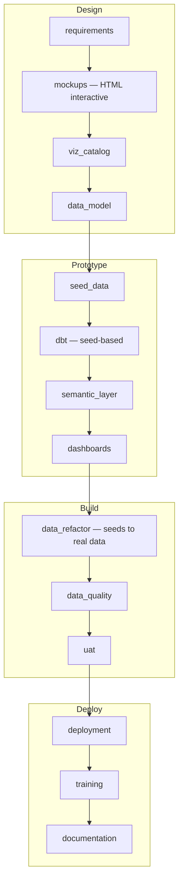

# Dashboard-First Rapid Development Release

Use this when you want early stakeholder feedback via interactive dashboard mocks before building the data layer. This approach is especially effective when the SOW is well-defined but client data access may be delayed — you can have a working prototype with seed data before the client provides database credentials.

**In-scope artifacts**: `requirements`, `mockups`, `viz_catalog`, `data_model`, `seed_data`, `dbt`, `semantic_layer`, `dashboards`, `data_refactor`, `data_quality`, `uat`, `deployment`, `training`, `documentation`



## Workflow

```
/wire:new                                               # release_type: dashboard_first

# Phase 1: Requirements (Day 1)
/wire:requirements-generate <release-folder>
/wire:requirements-validate <release-folder>
/wire:requirements-review <release-folder>

# Phase 2: Interactive Dashboard Mocks (Day 1–2)
/wire:mockups-generate <release-folder>                 # HTML interactive mockups
/wire:mockups-review <release-folder>

# Phase 3: Visualization Catalog (Day 2)
/wire:viz_catalog-generate <release-folder>             # Generate-only, no validate/review

# Phase 4: Data Model (Day 2–3)
/wire:data_model-generate <release-folder>
/wire:data_model-validate <release-folder>
/wire:data_model-review <release-folder>

# Phase 5: Seed Data (Day 3)
/wire:seed_data-generate <release-folder>               # CSV files with referential integrity
/wire:seed_data-validate <release-folder>
/wire:seed_data-review <release-folder>

# Phase 6: Development — seed-based (Days 3–5)
/wire:dbt-generate <release-folder>                     # Uses ref() to seeds, not source()
/wire:dbt-validate <release-folder>
/wire:utils-run-dbt <release-folder>                    # dbt seed && dbt run && dbt test
/wire:dbt-review <release-folder>

/wire:semantic_layer-generate <release-folder>
/wire:semantic_layer-validate <release-folder>
/wire:semantic_layer-review <release-folder>

/wire:dashboards-generate <release-folder>
/wire:dashboards-validate <release-folder>
/wire:dashboards-review <release-folder>

# Phase 7: Data Refactor — seeds → real data (when client data available)
/wire:data_refactor-generate <release-folder>
/wire:data_refactor-validate <release-folder>
/wire:data_refactor-review <release-folder>

# Phase 8: Testing
/wire:data_quality-generate <release-folder>
/wire:data_quality-validate <release-folder>
/wire:data_quality-review <release-folder>

/wire:uat-generate <release-folder>
/wire:uat-review <release-folder>

# Phase 9: Deployment + Enablement
/wire:deployment-generate <release-folder>
/wire:deployment-validate <release-folder>
/wire:deployment-review <release-folder>
/wire:utils-deploy-to-prod <release-folder>

/wire:training-generate <release-folder>
/wire:training-validate <release-folder>
/wire:training-review <release-folder>

/wire:documentation-generate <release-folder>
/wire:documentation-validate <release-folder>
/wire:documentation-review <release-folder>

/wire:archive <release-folder>
```

:::info[Tutorial available]

A worked example of a Dashboard First engagement — using a fictional client scenario with realistic command output, agent delegation, and reviewer decisions — is available in the [Tutorial: Dashboard First](../tutorials/dashboard-first).

:::


## Phase 2: Interactive Dashboard Mockups

This is the key differentiator. The mockups command for `dashboard_first` projects generates **pixel-accurate, interactive HTML Looker mockups** directly inside Claude Code — no external tools required.

The framework:
1. Reads the approved requirements and plans the dashboard structure — pages, KPI tiles, charts, tables, and filters
2. Reads the Looker design system reference (teal sidebar, Google Sans, Chart.js charts)
3. Generates one or more **self-contained HTML files** that faithfully reproduce the Looker UI
4. Simultaneously produces `design/dashboard_visualization_catalog.csv` and `design/dashboard_spec.md`

Open the HTML file in a browser — the charts respond to hover and the tabs switch. Iterate on the mockups by asking Claude to modify specific tiles before running `viz_catalog:generate`.

## Phase 7: Data Refactor

Once the client provides access to their actual data sources:
1. Compares the seed-based source schema against the real one
2. Generates a refactoring plan documenting every change needed
3. Executes the changes: updates source definitions, staging model SQL, and dbt configuration

The transition from `ref('customers_seed')` to `source('salesforce', 'accounts')` is a mechanical operation guided by the schema comparison.

## Specialist agents for dashboard_first

Two Wire agents activate exclusively for this release type. They are not used in any other release.

**`dashboard-mock-developer`** owns the interactive mockup phase — Phases 2 and 3 in the workflow above. It runs an explicit iteration loop: generates the first HTML mock from requirements, then invites changes (tiles, chart types, layout, new pages, filter dimensions) until you confirm approval. Only after approval does it produce three derived artifacts atomically: `dashboard_visualization_catalog.csv`, `dashboard_spec.md`, and `data_model_requirements.md`. That last file is the primary input for both `data-designer` and `mock-data-developer`. The agent uses the `looker-dashboard-mockup` skill for consistent visual output.

**`mock-data-developer`** owns seed data and data refactor — Phases 5 and 7. It has two time-separated responsibilities. In Phase 5, it reads `data_model_requirements.md` and the target warehouse DDL, then generates CSV seed files with referential integrity and domain-realistic values — no generic placeholders. In Phase 7, it manages the transition from seeds to real client sources, writing a refactor plan before touching any code and verifying `dbt compile` succeeds after repointing.

### `/wire:delegate` plan for a dashboard_first release

When you run `/wire:delegate` on a dashboard_first project, the delegation plan reflects the inverted flow:

```
Step 1 (sequential):
  discovery-analyst → requirements-generate, requirements-validate

Step 2 (sequential, starts after step 1):
  dashboard-mock-developer → mockups-generate (interactive HTML iteration until approved),
                             viz_catalog-generate, derives data_model_requirements.md

Step 3 (sequential, starts after step 2):
  data-designer → data_model-generate, data_model-validate

Step 4 (sequential, starts after step 3):
  mock-data-developer → seed_data-generate, seed_data-validate

Step 5 (multi-wave fan-out, starts after step 4):
  dbt-developer → dbt-generate (models referencing seeds)

Step 6 (parallel, starts after step 5):
  6a  semantic-layer-developer → semantic_layer-generate, dashboards-generate
  6b  data-quality-engineer    → data_quality-generate (partial — schema tests against seeds)

Step 7 (sequential, after stakeholder prototype approval):
  mock-data-developer → data_refactor-generate, data_refactor-validate

Step 8 (sequential, starts after step 7):
  qa-agent → validate all artifacts

Step 9 (sequential, starts after step 8):
  delivery-lead → deployment-generate, training-generate, documentation-generate
```

Step 7 is separated in time from the rest — it only runs after client data access is confirmed and the prototype is approved by stakeholders.

## Tips

- **Start mocking early**: You can run `/wire:mockups-generate` during the SOW preparation phase
- **Don't delay the refactor**: Once client data is available, run the data refactor promptly
- **The prototype is disposable**: The seed-based dbt project exists to validate the design

> **Tip**: Run `/wire:playbook-generate <release-folder>` after mockups are approved.
