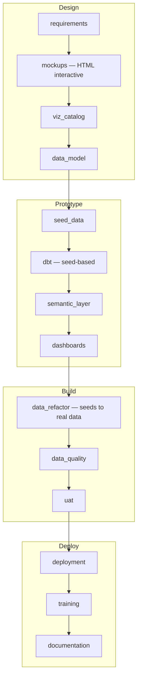

# Dashboard-First Rapid Development Release

Use this when you want early stakeholder feedback via interactive dashboard mocks before building the data layer. This approach is especially effective when the SOW is well-defined but client data access may be delayed — you can have a working prototype with seed data before the client provides database credentials.

**In-scope artifacts**: `requirements`, `mockups`, `viz_catalog`, `data_model`, `seed_data`, `dbt`, `semantic_layer`, `dashboards`, `data_refactor`, `data_quality`, `uat`, `deployment`, `training`, `documentation`


```mermaid
flowchart TB
    subgraph s1["Design"]
        REQ["requirements"]
        MK["mockups — HTML interactive"]
        VIZ["viz_catalog"]
        DM["data_model"]
    end
    subgraph s2["Prototype"]
        SD["seed_data"]
        DBT["dbt — seed-based"]
        SL["semantic_layer"]
        DASH["dashboards"]
    end
    subgraph s3["Build"]
        DR["data_refactor — seeds to real data"]
        DQ["data_quality"]
        UAT["uat"]
    end
    subgraph s4["Deploy"]
        DEP["deployment"]
        TR["training"]
        DOC["documentation"]
    end
    REQ --> MK --> VIZ --> DM
    DM --> SD --> DBT --> SL --> DASH
    DASH --> DR --> DQ --> UAT
    UAT --> DEP --> TR --> DOC
```

## Two profiles: do you need seed data?

One question decides it: **can you query the source tables the dashboard needs, today?**

**Since v4.0.0 `/wire:new` asks the question** and writes `build_profile` to
`status.md`. `seeded` is still the default, but it is now a decision you made
rather than one that happened. Until 4.0.0 nothing asked, the field was left
unwritten, and `live_data` was reachable only by hand-editing `status.md` after
creation — a route nobody found, on a choice that changes which phases exist.

| | `seeded` | `live_data` |
|---|---|---|
| Use it when | client data access is delayed, or you want a dress rehearsal with no warehouse spend and a reusable CI fixture | you can already query the source tables |
| `seed_development` phase | on: `seed_data` generates CSV seeds | **off** |
| `data_refactor` phase | on: staging repointed from seeds to live sources | **off**, there is nothing to refactor |
| `dbt` released by | `seed_data` review approved | `data_model` review approved |
| Everything after `dbt` | unchanged: semantic layer, then dashboards | unchanged: semantic layer, then dashboards |

Under `live_data` the two phases are **disabled, not skipped**. That distinction matters:
`specs/utils/precondition_gate.md` refuses to run an artifact in a disabled phase and reports it
as not part of the active profile, and `/wire:status` shows it as **not applicable** rather than
not started. You take no precondition overrides, and nothing sits unexplained in the status file.

Before profiles existed, skipping the spine meant two recorded overrides (`dashboards` and `dbt`
were both gated on `seed_data`) and two artifacts stuck at `not_started` for the life of the
release, which read as incomplete delivery rather than a scope decision.

The mockup still drives the design under both profiles. `live_data` removes the seed data, not
the prototype-first approach.

## Directing this release rather than typing it

Since v4.0.0 you can run the whole sequence below by saying what you want. The
commands are the same and the record is identical; you just do not have to
remember which comes next.

| You say | Wire runs |
|---|---|
| "New engagement for this client, store performance dashboards. SOW is in `docs/sow.pdf`. Two lanes max, nothing against a warehouse, stop at decisions." | Reads the SOW, proposes `dashboard_first` / `seeded` with the reason and asks the profile question. One confirmation block, then `/wire:new` and the budget block. |
| "Confirm. Skip business rules, agree at kickoff." | Records ruling R-1 in `decisions.md`, which satisfies `conceptual_model`'s advisory business-rules gate later without asking again. |
| *(nothing)* | `requirements-generate`, auto-validating. One report: requirement count, PASS/FAIL, clarification markers, and the client call that covers them. |
| "Approve internally, carry the markers to kickoff." | `requirements-review`. |
| *(nothing)* | Approval releases two: `conceptual_model` as a lane, `mockups` in the foreground with you — it is interactive, so it never runs as a lane. |
| "Approved." | `mockups-review`, then `viz_catalog-generate`. |
| "Go. Report when done." | `data_model` and `seed_data` as two lanes, within the budget. |

Every review still stops for your decision: approve now, request changes, or park
for client sign-off. See [The Release Director Model](../advanced/release-director).

## Workflow

```
/wire:new                                               # release_type: dashboard_first

# Phase 1: Requirements (Day 1)
/wire:business-rules-generate <release-folder>           # Optional, new in 4.0
/wire:business-rules-validate <release-folder>
/wire:business-rules-review <release-folder>

/wire:requirements-generate <release-folder>
/wire:requirements-validate <release-folder>
/wire:requirements-review <release-folder>

# Phase 2: Interactive Dashboard Mocks (Day 1–2)
/wire:mockups-generate <release-folder>                 # HTML interactive mockups
/wire:mockups-review <release-folder>

# Phase 3: Visualization Catalog (Day 2)
/wire:viz_catalog-generate <release-folder>             # Generate-only. Do not skip: sole writer of
                                                        # design/visualization_catalog.md, which
                                                        # seed_data-generate requires

# Phase 4: Data Model (Day 2–3)
/wire:data_model-generate <release-folder>
/wire:data_model-validate <release-folder>
/wire:data_model-review <release-folder>

# Phase 5: Seed Data (Day 3)
/wire:seed_data-generate <release-folder>               # CSV files with referential integrity
/wire:seed_data-validate <release-folder>
/wire:seed_data-review <release-folder>

# Phase 6: Development — seed-based (Days 3–5)
/wire:dbt-generate <release-folder>                     # Uses ref() to seeds, not source()
/wire:dbt-validate <release-folder>
/wire:utils-run-dbt <release-folder>                    # dbt seed && dbt run && dbt test
/wire:dbt-review <release-folder>

/wire:semantic_layer-generate <release-folder>
/wire:semantic_layer-validate <release-folder>
/wire:semantic_layer-review <release-folder>

/wire:dashboards-generate <release-folder>              # One tile per catalog row; stops rather
                                                        # than guess a model or output path
/wire:dashboards-validate <release-folder>              # 9 checks against the approved mockup
/wire:dashboards-review <release-folder>

# Phase 7: Data Refactor — seeds → real data (when client data available)
/wire:data_refactor-generate <release-folder>
/wire:data_refactor-validate <release-folder>
/wire:data_refactor-review <release-folder>

# Phase 8: Testing
/wire:data_quality-generate <release-folder>
/wire:data_quality-validate <release-folder>
/wire:data_quality-review <release-folder>

/wire:uat-generate <release-folder>
/wire:uat-review <release-folder>

# Phase 9: Deployment + Enablement
/wire:deployment-generate <release-folder>
/wire:deployment-validate <release-folder>
/wire:deployment-review <release-folder>
/wire:utils-deploy-to-prod <release-folder>

/wire:training-generate <release-folder>
/wire:training-validate <release-folder>
/wire:training-review <release-folder>

/wire:documentation-generate <release-folder>
/wire:documentation-validate <release-folder>
/wire:documentation-review <release-folder>

/wire:archive <release-folder>
```

:::info[Tutorial available]

A worked example of a Dashboard First engagement — using a fictional client scenario with realistic command output, agent delegation, and reviewer decisions — is available in the [Tutorial: Dashboard First](../tutorials/dashboard-first).

:::


## Phase 2: Interactive Dashboard Mockups

This is the key differentiator. The mockups command for `dashboard_first` projects generates **pixel-accurate, interactive HTML Looker mockups** directly inside Claude Code — no external tools required.

The framework:
1. Reads the approved requirements and plans the dashboard structure — pages, KPI tiles, charts, tables, and filters
2. Reads the Looker design system reference (teal sidebar, Google Sans, Chart.js charts)
3. Generates one or more **self-contained HTML files** that faithfully reproduce the Looker UI
4. Simultaneously produces `design/dashboard_visualization_catalog.csv` and `design/dashboard_spec.md`

Open the HTML file in a browser — the charts respond to hover and the tabs switch. Iterate on the mockups by asking Claude to modify specific tiles before running `/wire:viz_catalog-generate`.

**The output is one self-contained file.** The logo mark, toolbar icons and Create button are inline SVG, so there are no image assets to copy and the mockup renders correctly wherever it is opened, including as an email attachment. Builds before `4.0.0-preview+83314053` referenced three PNGs by filename from the skill folder, so every delivered mockup showed three broken images; if you are on an older build, copy `skills/looker-dashboard-mockup/references/*.png` next to the HTML.

## Phase 6a: Dashboards

`dashboards-generate` turns the approved catalog into real dashboard files. Five steps, in order:

1. **Resolve the target.** The BI tool, the semantic layer project, model and explore, and the output path, from `status.md` or the approved artifacts. If any cannot be resolved it stops and asks. A dashboard written against a guessed model into a guessed directory has to be found and deleted by hand.
2. **Resolve the tile list.** On `dashboard_first` and `dashboard_extension` the tile source is `design/dashboard_visualization_catalog.csv`, one tile per row, and nothing else. Substituting the requirements document would deliver a tile list the stakeholder never approved.
3. **Map each row's `chart_type`** to the BI tool's visualization type from a fixed table, matched case-insensitively and ignoring whitespace and hyphens, so two people generating from the same catalog produce the same dashboard.
4. **Generate one file per dashboard page**, fields referenced by semantic layer field name, filters taken from `dashboard_spec.md`, each tile commented with the catalog row it came from.
5. **Cross-check against the approved mockup** (tile count, titles, filters, fields) before writing status.

Two counts are recorded in `status.md` and printed in the summary:

| Count | Meaning |
|---|---|
| `unmapped_tiles` | a `chart_type` the mapping table does not recognise. The tile renders as a table, which shows the underlying values, and is reported. It is never guessed at |
| `unresolved_fields` | a measure or dimension with no matching semantic layer field. The field is not invented as LookML |

`dashboards-validate` runs nine checks against the approved mockup chain rather than the dashboard's own claims, and fails while either count is above zero. So the table fallback cannot quietly become the delivered dashboard.

## Phase 7: Data Refactor

Once the client provides access to their actual data sources:
1. Compares the seed-based source schema against the real one
2. Generates a refactoring plan documenting every change needed
3. Executes the changes: updates source definitions, staging model SQL, and dbt configuration

The transition from `ref('customers_seed')` to `source('salesforce', 'accounts')` is a mechanical operation guided by the schema comparison.

The refactor stops at the staging boundary. Warehouse models, the explore and the dashboard are unchanged, which is what the three-layer architecture is for: the staging layer absorbs the entire difference between invented data and a real client warehouse.

## Specialist agents for dashboard_first

Two Wire agents activate exclusively for this release type. They are not used in any other release.

**`dashboard-mock-developer`** owns the interactive mockup phase — Phases 2 and 3 in the workflow above. It runs an explicit iteration loop: generates the first HTML mock from requirements, then invites changes (tiles, chart types, layout, new pages, filter dimensions) until you confirm approval. Only after approval does it produce three derived artifacts atomically: `dashboard_visualization_catalog.csv`, `dashboard_spec.md`, and `data_model_requirements.md`. That last file is the primary input for both `data-designer` and `mock-data-developer`. The agent uses the `looker-dashboard-mockup` skill for consistent visual output.

**`mock-data-developer`** owns seed data and data refactor — Phases 5 and 7. It has two time-separated responsibilities. In Phase 5, it reads `data_model_requirements.md` and the target warehouse DDL, then generates CSV seed files with referential integrity and domain-realistic values — no generic placeholders. In Phase 7, it manages the transition from seeds to real client sources, writing a refactor plan before touching any code and verifying `dbt compile` succeeds after repointing.

### `/wire:delegate` plan for a dashboard_first release

When you run `/wire:delegate` on a dashboard_first project, the delegation plan reflects the inverted flow:

```
Step 1 (sequential):
  discovery-analyst → requirements-generate, requirements-validate

Step 2 (sequential, starts after step 1):
  dashboard-mock-developer → mockups-generate (interactive HTML iteration until approved),
                             viz_catalog-generate, derives data_model_requirements.md

Step 3 (sequential, starts after step 2):
  data-designer → data_model-generate, data_model-validate

Step 4 (sequential, starts after step 3):
  mock-data-developer → seed_data-generate, seed_data-validate

Step 5 (multi-wave fan-out, starts after step 4):
  dbt-developer → dbt-generate (models referencing seeds)

Step 6 (parallel, starts after step 5):
  6a  semantic-layer-developer → semantic_layer-generate, dashboards-generate
  6b  data-quality-engineer    → data_quality-generate (partial — schema tests against seeds)

Step 7 (sequential, after stakeholder prototype approval):
  mock-data-developer → data_refactor-generate, data_refactor-validate

Step 8 (sequential, starts after step 7):
  qa-agent → validate all artifacts

Step 9 (sequential, starts after step 8):
  delivery-lead → deployment-generate, training-generate, documentation-generate
```

Step 7 is separated in time from the rest — it only runs after client data access is confirmed and the prototype is approved by stakeholders.

## Tips

- **Start mocking early**: You can run `/wire:mockups-generate` during the SOW preparation phase
- **Don't delay the refactor**: Once client data is available, run the data refactor promptly
- **The prototype is disposable**: The seed-based dbt project exists to validate the design

> **Tip**: Run `/wire:playbook-generate <release-folder>` after mockups are approved.

## Business rules discovery (optional first phase)

New in 4.0. `/wire:business-rules-generate` runs before design and establishes what
the numbers mean, one business domain at a time.

It reads the definitions that already exist — in dbt, in LookML, and through
`--import` from systems Wire cannot read such as SAP BW, Hana or SAC — then asks
the people who own the numbers to settle the ones that disagree. The output is a
register: one entry per rule, holding every competing definition with the file it
came from, what they disagree on, the decision, the named approver, and a
reconciliation query that runs at generate time rather than in QA.

A rule nobody has decided is recorded with status `unknown`, which passes
validate. That is the point of it: a register has to be able to say "nobody has
agreed whether in-store orders are in this figure", because that sentence is what
stops the number being wrong nine months later.

**The gate is advisory.** ``conceptual_model-generate`` warns when the register has not been
reviewed, asks for a one-line reason, records it as an `advisory_skip`, and
proceeds. Skipping is a real choice; what matters is that the choice is visible.

Worth running here when the mockup replaces a legacy dashboard: the register is
where the old and new definitions of each tile's number get compared before the
build rather than after it.

Full reference: [Business rules discovery](../advanced/business-rules.md).

## Reading an existing Modality model

New in 4.0. Where the client already models their data in Modality,
`/wire:utils-modality-link <release-folder>` points the release at it and sets
`model_source: modality`. `conceptual_model-generate` then read entities, sources and cardinality from
the `.mml` files rather than deriving them.

The requirements are still read. An entity in the model but not the requirements
is excluded with a reason; one in the requirements but not the model becomes an
open question. Every value taken from the model cites the file it came from, and
the matching validate commands gain a two-direction `modality_coverage` check.

Full reference: [Modality models as an input](../advanced/modality-models.md).
