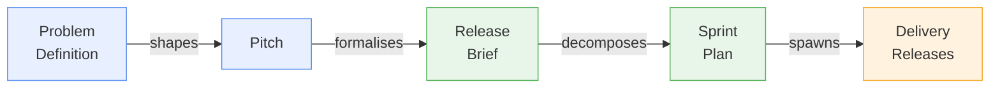

# Discovery Release — Shape Up Planning

A discovery release is the scoping and planning phase for a new engagement. It answers the question: *what do we build and why?* The output is a release brief and sprint plan — the formal inputs to a delivery release.

Discovery uses the **Shape Up** methodology: fixed time, variable scope. You work within an *appetite* (how much time this is worth) and produce a shaped solution — specific enough to build from, but leaving room for implementation decisions.

## When to start with Discovery

- The client is not sure exactly what they need built
- The scope needs to be negotiated before a fixed SOW is signed
- The team wants to formally validate the problem before committing to a delivery estimate
- There are multiple competing priorities that need to be shaped into a coherent release brief

If you already have a signed, well-scoped SOW, you may not need a discovery release — go straight to the appropriate delivery type.

## Discovery artifact flow



## Workflow

```
/wire:new                                          # release_type: discovery

# Step 1: Problem Definition
/wire:problem-definition-generate 01-discovery
/wire:problem-definition-validate 01-discovery
/wire:problem-definition-review 01-discovery

# Step 2: Pitch
/wire:pitch-generate 01-discovery
/wire:pitch-validate 01-discovery
/wire:pitch-review 01-discovery                    # betting table review

# Step 3: Release Brief
/wire:release-brief-generate 01-discovery
/wire:release-brief-validate 01-discovery
/wire:release-brief-review 01-discovery            # client sign-off

# Step 4: Sprint Plan
/wire:sprint-plan-generate 01-discovery
/wire:sprint-plan-validate 01-discovery
/wire:sprint-plan-review 01-discovery              # team approval

# Spawn the downstream delivery releases:
/wire:release:spawn 01-discovery
```

:::info[Tutorial available]

A worked example of a Discovery (Shape Up) engagement — using a fictional client scenario with realistic command output, agent delegation, and reviewer decisions — is available in the [Tutorial: Discovery (Shape Up)](../tutorials/discovery-shape-up).

:::


## Step 1: Problem Definition

```
/wire:problem-definition-generate 01-discovery
```

The AI reads the engagement context and any call transcripts, and produces a structured problem framing with six components:
- **Who has the problem**: the specific role or team experiencing the friction
- **What they are trying to do**: the goal or job to be done
- **What the current friction is**: the specific obstacle or pain
- **Why it matters**: business impact if not addressed
- **Current workarounds**: what people are doing instead
- **Constraints**: time, budget, technology, regulatory

Validation checks that the problem is specific (not vague), measurable (impact is quantifiable), and framed as a problem (not a solution).

## Step 2: Pitch

```
/wire:pitch-generate 01-discovery
```

Produces a 10-section Shape Up pitch:
1. **Problem** — the approved problem statement
2. **Appetite** — how much time this is worth (1–2 weeks small batch, or 6 weeks big batch)
3. **Solution sketch** — a fat-marker description
4. **Rabbit holes** — known implementation traps to avoid
5. **No-gos** — scope items explicitly excluded
6. **Risks** — technical or business risks
7. **Success criteria** — how we'll know this release succeeded
8. **Downstream releases** — delivery releases this pitch would spawn
9. **Timeline** — proposed start date, end date, and key milestones
10. **The bet** — the decision to commit

**The betting table review.** This is where the pitch is presented to decision-makers — typically the engagement lead and client sponsor. The outcome is recorded: bet approved, modified, or deferred.

## Step 3: Release Brief

```
/wire:release-brief-generate 01-discovery
```

Formalises the approved pitch as a client-facing release brief — a commitment document. Includes: the approved problem statement, solution description, deliverables list, constraints and assumptions, dependencies, downstream releases, timeline with milestones, and a sign-off section.

**Client sign-off.** Once signed off, it becomes the authorising document for the downstream delivery releases.

## Step 4: Sprint Plan

```
/wire:sprint-plan-generate 01-discovery
```

Decomposes the approved release brief into a sprint plan: epics, stories, and tasks with Fibonacci point estimates (1, 2, 3, 5, 8 — no 13-point stories; anything larger must be broken down). The total points are checked against the appetite budget.

## Spawning delivery releases

```
/wire:release:spawn 01-discovery
```

Reads the approved release brief to identify the planned downstream delivery releases, then creates the folder structure and `status.md` for each one. The spawned releases are ready to start immediately.

> **Tip**: Run `/wire:playbook-generate 01-discovery` after the problem definition is approved to generate a BPMN-style visual delivery plan for this release.
