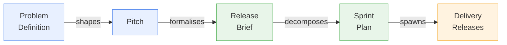

# Discovery Release — Shape Up Planning

:::tip[You do not have to type these commands]

Since v4.0.0, on Claude Code, you can direct this release in plain language
instead: say what you want done and Wire works out which command that is from
this release type's definition, runs it, tells you what it did and stops at
every review gate for your decision. The commands, the artifacts and the record
on disk are identical either way, and typing them still works. See
[The Release Director Model](../advanced/release-director).

:::


Not every engagement arrives with a scope you can build from. The client may know that something is wrong without being sure what they need built, or the scope may still be under negotiation before a fixed statement of work (SOW) can be signed. There may also be several competing priorities that nobody has yet shaped into a single plan. Wouldn't it be better to settle what we are building, and why, before anyone commits to a delivery estimate?

That is what a discovery release is for. It is the scoping and planning phase for a new engagement, and it answers one question: *what do we build and why?* Its output is a release brief and a sprint plan, which together are the formal inputs to a delivery release.

Discovery uses the **Shape Up** methodology, which fixes the time and lets the scope vary. You work within an *appetite* (how much time the problem is worth) and produce a "shaped" solution, one that is specific enough to build from but leaves room for implementation decisions along the way.

## When to start with Discovery

Four situations point to starting with discovery rather than going straight to delivery:

- The client is not sure exactly what they need built
- The scope needs to be negotiated before a fixed SOW is signed
- The team wants to formally validate the problem before committing to a delivery estimate
- There are multiple competing priorities that need to be shaped into a coherent release brief

If, on the other hand, you already have a signed and well-scoped SOW, you may not need a discovery release at all, and you can go straight to the appropriate delivery type.

## Discovery artifact flow

The four artifacts build on one another in a fixed order, each one shaping or formalising the one before it, and the last of them spawns the delivery releases that follow:


```mermaid
graph LR
    PD["Problem\nDefinition"]
    PI["Pitch"]
    RB["Release\nBrief"]
    SP["Sprint\nPlan"]
    DR["Delivery\nReleases"]

    PD -->|"shapes"| PI
    PI -->|"formalises"| RB
    RB -->|"decomposes"| SP
    SP -->|"spawns"| DR

    style PD fill:#e8f0ff,stroke:#5b8dee
    style PI fill:#e8f0ff,stroke:#5b8dee
    style RB fill:#e8f5e9,stroke:#4caf50
    style SP fill:#e8f5e9,stroke:#4caf50
    style DR fill:#fff3e0,stroke:#f5a623
```

## Workflow

At a high level, the four steps and the commands that run them are as follows, and we will look at each step in more detail below:

```
/wire:new                                          # release_type: discovery

# Step 1: Problem Definition
/wire:problem-definition-generate 01-discovery
/wire:problem-definition-validate 01-discovery
/wire:problem-definition-review 01-discovery

# Step 2: Pitch
/wire:pitch-generate 01-discovery
/wire:pitch-validate 01-discovery
/wire:pitch-review 01-discovery                    # betting table review

# Step 3: Release Brief
/wire:release-brief-generate 01-discovery
/wire:release-brief-validate 01-discovery
/wire:release-brief-review 01-discovery            # client sign-off

# Step 4: Sprint Plan
/wire:sprint-plan-generate 01-discovery
/wire:sprint-plan-validate 01-discovery
/wire:sprint-plan-review 01-discovery              # team approval

# Spawn the downstream delivery releases:
/wire:release-spawn 01-discovery
```

:::info[Tutorial available]

A worked example of a Discovery (Shape Up) engagement, using a fictional client scenario with realistic command output, agent delegation and reviewer decisions, is available in the [Tutorial: Discovery (Shape Up)](../tutorials/discovery-shape-up).

:::


## Step 1: Problem Definition

```
/wire:problem-definition-generate 01-discovery
```

Your first step is to pin down the problem itself, before anyone proposes a solution to it. The AI reads the engagement context and any call transcripts, and produces a structured problem framing with six components:
- **Who has the problem**: the specific role or team experiencing the friction
- **What they are trying to do**: the goal or job to be done
- **What the current friction is**: the specific obstacle or pain
- **Why it matters**: the business impact if it is not addressed
- **Current workarounds**: what people are doing instead
- **Constraints**: time, budget, technology, regulatory

Validation then checks that the problem is specific (not vague), measurable (the impact is quantifiable) and framed as a problem rather than as a solution.

## Step 2: Pitch

```
/wire:pitch-generate 01-discovery
```

With the problem approved, the pitch is where we shape the answer to it. The command produces a ten-section Shape Up pitch:
1. **Problem**: the approved problem statement
2. **Appetite**: how much time this is worth (one to two weeks for a small batch, or six weeks for a big batch)
3. **Solution sketch**: a "fat-marker" description
4. **Rabbit holes**: known implementation traps to avoid
5. **No-gos**: scope items explicitly excluded
6. **Risks**: technical or business risks
7. **Success criteria**: how we will know this release succeeded
8. **Downstream releases**: the delivery releases this pitch would spawn
9. **Timeline**: proposed start date, end date and key milestones
10. **The bet**: the decision to commit

**The betting table review.** This is where the pitch is presented to the decision-makers, typically the engagement lead and the client sponsor, and the outcome is recorded as one of three: bet approved, modified or deferred.

## Step 3: Release Brief

```
/wire:release-brief-generate 01-discovery
```

Once the bet is placed, the approved pitch needs to become something the client can sign. The command formalises it as a client-facing release brief, which is a commitment document, and includes the approved problem statement, the solution description, a deliverables list, constraints and assumptions, dependencies, downstream releases, a timeline with milestones and a sign-off section.

**Client sign-off.** Once signed off, the release brief becomes the authorising document for the downstream delivery releases, which is why the review at this step belongs to the client rather than to the team.

## Step 4: Sprint Plan

```
/wire:sprint-plan-generate 01-discovery
```

The sprint plan is where the brief is broken down into work the team can estimate. The command decomposes the approved release brief into epics, stories and tasks with Fibonacci point estimates (1, 2, 3, 5 and 8; there are no 13-point stories, and anything larger must be broken down), and the total points are then checked against the appetite budget, so that the plan stays within the time the pitch said the problem was worth.

## Spawning delivery releases

```
/wire:release-spawn 01-discovery
```

The final step turns the plan into releases. The command reads the approved release brief to identify the planned downstream delivery releases, then creates the folder structure and `status.md` for each one, and the spawned releases are ready to start immediately.

> **Tip**: Run `/wire:playbook-generate 01-discovery` after the problem definition is approved to generate a BPMN-style visual delivery plan for this release.
