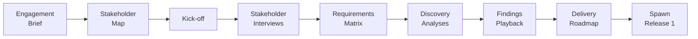

# Discovery Release — SOP / Canonical

The SOP / Canonical discovery release (`release_type: sop_discovery`) is for engagements where the scope is genuinely unknown at SOW signature. It models the Canonical Discovery Playbook (RA Standard).

Use this release type when:
- Scope is unknown or stakeholder alignment is low at the start of the engagement
- This is the first analytics engagement at the client
- The SOW describes a discovery phase rather than a fixed scope
- Multiple competing priorities exist and a structured hierarchy-of-needs analysis is needed

## SOP discovery artifact flow



## The exit gate: Findings Playback and Sponsor Validation Checklist

The canonical exit deliverable is the **Findings Playback slide deck**, presented to the sponsor in a live session. The release moves to `approved` only when all seven items on the **Sponsor Validation Checklist** are confirmed true:

1. Maturity Curve pin agreed
2. Hierarchy of Needs diagnosis accepted
3. PPT (People / Process / Technology) diagnosis accepted
4. Vision Statement validated
5. Solution Initiatives accepted
6. Preferred Delivery Option selected
7. Any conflicts between stakeholder priorities resolved

`/wire:release-spawn` refuses to chain forward until the checklist is all-true.

## The mandatory four-tag rule

Every theme bullet on every stakeholder interview write-up carries one tag from each of four closed sets: `#<domain>`, `#<type>`, `#<hierarchy>`, `#<ppt>`. `/wire:stakeholder-interview-validate` enforces this with a parser check, not LLM judgement. The three discovery analyses cannot run without complete tag coverage across all interviews.

## Command sequence

```
/wire:new                                          # release_type: sop_discovery

# Phase 0 — Pre-Discovery (1–3 days)
/wire:engagement-brief-generate 01-discovery       # from SoW + HubSpot deal record
/wire:engagement-brief-validate 01-discovery
/wire:engagement-brief-review 01-discovery         # internal RA (Head of Delivery)

/wire:stakeholder-map-generate 01-discovery
/wire:stakeholder-map-validate 01-discovery
/wire:stakeholder-map-review 01-discovery          # sponsor confirms list and bookings

# Phase 1 — Kick-off (1 session)
/wire:kickoff-generate 01-discovery
/wire:kickoff-review 01-discovery

# Phase 2 — Interviews (1–2 weeks)
/wire:stakeholder-interview-generate 01-discovery --stakeholder maud-bakker
/wire:stakeholder-interview-validate 01-discovery --stakeholder maud-bakker
/wire:stakeholder-interview-review 01-discovery --stakeholder maud-bakker
# ... repeat for each P0/P1 stakeholder
/wire:stakeholder-interview-validate 01-discovery --all   # tag-completeness coverage

# Phase 3 — Consolidation (3–5 days)
/wire:requirements-matrix-generate 01-discovery
/wire:requirements-matrix-validate 01-discovery
/wire:requirements-matrix-review 01-discovery       # internal RA

/wire:discovery-analyses-generate 01-discovery      # the three analyses
/wire:discovery-analyses-validate 01-discovery
/wire:discovery-analyses-review 01-discovery

# Phase 4 — Findings Playback (3–5 days prep; 1 sponsor session)
/wire:findings-playback-generate 01-discovery
/wire:findings-playback-validate 01-discovery
/wire:findings-playback-review 01-discovery         # the sponsor playback

# Phase 5 — Roadmap & Exit
/wire:delivery-roadmap-generate 01-discovery
/wire:delivery-roadmap-validate 01-discovery
/wire:delivery-roadmap-review 01-discovery          # sponsor sign-off on Release 1 scope

# Spawn Release 1 (or close as no-go):
/wire:release-spawn 01-discovery
```

:::info[Tutorial available]

A worked example of a Discovery (SOP) engagement — using a fictional client scenario with realistic command output, agent delegation, and reviewer decisions — is available in the [Tutorial: Discovery (SOP)](../tutorials/discovery-sop).

:::


> **Tip**: Run `/wire:playbook-generate 01-discovery` after the engagement brief is approved to generate a BPMN-style diagram of the full SOP discovery flow.
