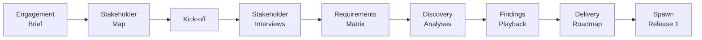
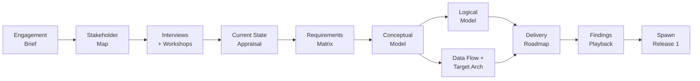

# Discovery Release — SOP / Canonical

The SOP / Canonical discovery release (`release_type: sop_discovery`) is for engagements where the scope is genuinely unknown at SOW signature. It models the Canonical Discovery Playbook (RA Standard).

Use this release type when:
- Scope is unknown or stakeholder alignment is low at the start of the engagement
- This is the first analytics engagement at the client
- The SOW describes a discovery phase rather than a fixed scope
- Multiple competing priorities exist and a structured hierarchy-of-needs analysis is needed

## Two profiles

The release type offers two routes through the same three pillars: map the current state, map the target state, agree the roadmap. Set `discovery_profile` in `status.md`; `diagnostic` is the default.

| | `diagnostic` | `modelling_led` |
|---|---|---|
| Current state from | The Hierarchy of Needs and People–Process–Technology analyses, which diagnose what is wrong | `current_state_appraisal`, a factual account of what exists |
| Target state from | Vision Statement and Solution Initiatives in the analyses document | A signed-off conceptual model, logical model, and the target platform architecture on `pipeline_design` |
| Roadmap | Produced **after** the playback | Produced **before** the playback, because it is one of the things the sponsor signs off |
| Sign-off checklist | Seven canonical items (maturity pin, hierarchy, PPT, vision, initiatives) | Five items in the deliverables' own terms |
| Deck | `decks/findings_playback/` | `decks/findings_playback_modelling_led/` |

Pick `modelling_led` when the client is buying a data model rather than a diagnosis: they know their problems and want an enterprise model, a platform design and a costed roadmap.

The ordering difference is enforced, not advisory. The release type declares the override in `wire/release-types/sop_discovery.yaml`, and `specs/utils/precondition_gate.md` applies it, so under `modelling_led` the playback refuses to run until the roadmap is approved.

## SOP discovery artifact flow


```mermaid
graph LR
    EB["Engagement\nBrief"]
    SM["Stakeholder\nMap"]
    KO["Kick-off"]
    SI["Stakeholder\nInterviews"]
    RM["Requirements\nMatrix"]
    DA["Discovery\nAnalyses"]
    FP["Findings\nPlayback"]
    DR["Delivery\nRoadmap"]
    RS["Spawn\nRelease 1"]

    EB --> SM --> KO --> SI --> RM --> DA --> FP --> DR --> RS
```

Under `modelling_led` the analyses drop out, the appraisal and the model come in, and the roadmap moves ahead of the playback:


```mermaid
graph LR
    EB["Engagement\nBrief"]
    SM["Stakeholder\nMap"]
    SI["Interviews\n+ Workshops"]
    CSA["Current State\nAppraisal"]
    RM["Requirements\nMatrix"]
    CM["Conceptual\nModel"]
    LM["Logical\nModel"]
    PD["Data Flow +\nTarget Arch"]
    DR["Delivery\nRoadmap"]
    FP["Findings\nPlayback"]
    RS["Spawn\nRelease 1"]

    EB --> SM --> SI --> CSA --> RM --> CM --> LM --> DR --> FP --> RS
    CM --> PD --> DR
```

## The exit gate: Findings Playback and Sponsor Validation Checklist

The canonical exit deliverable is the **Findings Playback slide deck**, presented to the sponsor in a live session. The release moves to `approved` only when all seven items on the **Sponsor Validation Checklist** are confirmed true:

1. Maturity Curve pin agreed
2. Hierarchy of Needs diagnosis accepted
3. PPT (People / Process / Technology) diagnosis accepted
4. Vision Statement validated
5. Solution Initiatives accepted
6. Preferred Delivery Option selected
7. Any conflicts between stakeholder priorities resolved

`/wire:release-spawn` refuses to chain forward until the checklist is all-true.

## The mandatory four-tag rule

Every theme bullet on every stakeholder interview write-up carries one tag from each of four closed sets: `#<domain>`, `#<type>`, `#<hierarchy>`, `#<ppt>`. `/wire:stakeholder-interview-validate` enforces this with a parser check, not LLM judgement. The three discovery analyses cannot run without complete tag coverage across all interviews.

## Command sequence

```
/wire:new                                          # release_type: sop_discovery

# Phase 0 — Pre-Discovery (1–3 days)
/wire:engagement-brief-generate 01-discovery       # from SoW + HubSpot deal record
/wire:engagement-brief-validate 01-discovery
/wire:engagement-brief-review 01-discovery         # internal RA (Head of Delivery)

/wire:stakeholder-map-generate 01-discovery
/wire:stakeholder-map-validate 01-discovery
/wire:stakeholder-map-review 01-discovery          # sponsor confirms list and bookings

# Phase 1 — Kick-off (1 session)
/wire:kickoff-generate 01-discovery
/wire:kickoff-review 01-discovery

# Phase 2 — Interviews (1–2 weeks)
/wire:stakeholder-interview-generate 01-discovery --stakeholder maud-bakker
/wire:stakeholder-interview-validate 01-discovery --stakeholder maud-bakker
/wire:stakeholder-interview-review 01-discovery --stakeholder maud-bakker
# ... repeat for each P0/P1 stakeholder
/wire:stakeholder-interview-validate 01-discovery --all   # tag-completeness coverage

# Phase 3 — Consolidation (3–5 days)
/wire:requirements-matrix-generate 01-discovery
/wire:requirements-matrix-validate 01-discovery
/wire:requirements-matrix-review 01-discovery       # internal RA

/wire:discovery-analyses-generate 01-discovery      # the three analyses
/wire:discovery-analyses-validate 01-discovery
/wire:discovery-analyses-review 01-discovery

# Phase 4 — Findings Playback (3–5 days prep; 1 sponsor session)
/wire:findings-playback-generate 01-discovery
/wire:findings-playback-validate 01-discovery
/wire:findings-playback-review 01-discovery         # the sponsor playback

# Phase 5 — Roadmap & Exit
/wire:delivery-roadmap-generate 01-discovery
/wire:delivery-roadmap-validate 01-discovery
/wire:delivery-roadmap-review 01-discovery          # sponsor sign-off on Release 1 scope

# Spawn Release 1 (or close as no-go):
/wire:release-spawn 01-discovery
```

:::info[Tutorial available]

A worked example of a Discovery (SOP) engagement — using a fictional client scenario with realistic command output, agent delegation, and reviewer decisions — is available in the [Tutorial: Discovery (SOP)](../tutorials/discovery-sop).

:::


> **Tip**: Run `/wire:playbook-generate 01-discovery` after the engagement brief is approved to generate a BPMN-style diagram of the full SOP discovery flow.


## Artifacts added by the `modelling_led` profile

### `current_state_appraisal`

A factual account of what exists: platform components, sources and their owners, replication, transformation, consumption, documentation, governance today, personal data, and data quality as the team experiences it. Then a Gaps and Contradictions section.

Written from documentation and interviews, not system access. Every row carries an `Evidence` value naming where it came from and a `Confidence` value of `confirmed`, `reported` or `unknown`.

`validate` fails a document where every row reads `confirmed`. Without system access, a document claiming everything is verified has not separated what it was told from what it checked, and that separation is the document's main value. It also fails an empty Gaps list that carries no statement of why nothing is outstanding.

Engagement-specific material (sizing a migration, an acquisition integration programme) goes in a free section added with `--section "<title>"` rather than being a named part of the artifact.

### `logical_model`

The step between the conceptual model and the physical dbt design, which Wire previously skipped. Per-entity sources and grain, keys with their reasoning, cardinality and the foreign keys carrying it, identity resolution with attributed precedence, normalisation per entity group, attribution rules with their remainder handling, and who owns each entity definition going forward.

These decisions were being made implicitly inside `data_model-generate`, which meant they arrived already expressed as dbt models and were hard to review as decisions. Now they are reviewable on their own, before anything is built.

Also available, optional, in `full_platform`. Worth running there when identity resolution or attribution is contested.

Source definitions (grain, keys, fields, owner) live here rather than in their own artifact: grain and key are one decision seen from two ends, and splitting them produces two documents that disagree.

## Other changes for both profiles

- `requirements_matrix` can carry optional `business_value` and `roi_measure` columns, and a `#question` tag for business questions, which are none of the four mandatory tags.
- `delivery_roadmap` carries owner and priority per deliverable, plus an optional leadership `now` / `next` / `later` view and an optional data team recommendation.
- `stakeholder-interview-generate --workshop <slug>` writes up a group session, with attendee attribution and explicit Agreed and Unresolved sections. A write-up with neither fails validate.
- `pipeline_design-generate --depth discovery` produces the data flow and the target platform architecture without the operational detail a discovery has not gathered.

## Reading an existing Modality model

New in 4.0. Where the client already models their data in Modality,
`/wire:utils-modality-link <release-folder>` points the release at it and sets
`model_source: modality`. `conceptual_model-generate`, `logical_model-generate` and `pipeline_design-generate` then read entities, sources and cardinality from
the `.mml` files rather than deriving them.

The requirements are still read. An entity in the model but not the requirements
is excluded with a reason; one in the requirements but not the model becomes an
open question. Every value taken from the model cites the file it came from, and
the matching validate commands gain a two-direction `modality_coverage` check.

Full reference: [Modality models as an input](../advanced/modality-models.md).

Under the `modelling_led` profile this is the common case: the client has a model
and wants it turned into a platform, so the conceptual and logical models are read
rather than rebuilt.
