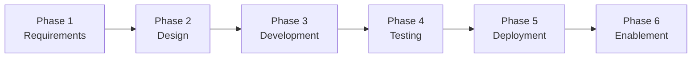

# Full Platform Release

Use this for releases that go from SOW to production dashboards and trained users. All 15 artifact types are in scope.



## Workflow

```
/wire:new                                          # release_type: full_platform

# Phase 1: Requirements
/wire:requirements-generate <release-folder>
/wire:requirements-validate <release-folder>
/wire:requirements-review <release-folder>

# Phase 2: Design
/wire:conceptual_model-generate <release-folder>
/wire:conceptual_model-validate <release-folder>
/wire:conceptual_model-review <release-folder>

/wire:pipeline_design-generate <release-folder>
/wire:pipeline_design-validate <release-folder>
/wire:pipeline_design-review <release-folder>

/wire:data_model-generate <release-folder>
/wire:data_model-validate <release-folder>
/wire:data_model-review <release-folder>

/wire:mockups-generate <release-folder>
/wire:mockups-review <release-folder>

# Phase 3: Development
/wire:pipeline-generate <release-folder>
/wire:pipeline-validate <release-folder>
/wire:pipeline-review <release-folder>

/wire:dbt-generate <release-folder>
/wire:dbt-validate <release-folder>
/wire:utils-run-dbt <release-folder>
/wire:dbt-review <release-folder>

/wire:orchestration-generate <release-folder>    # choose Dagster or dbt Cloud
/wire:orchestration-validate <release-folder>
/wire:orchestration-review <release-folder>

/wire:semantic_layer-generate <release-folder>
/wire:semantic_layer-validate <release-folder>
/wire:semantic_layer-review <release-folder>

/wire:dashboards-generate <release-folder>
/wire:dashboards-validate <release-folder>
/wire:dashboards-review <release-folder>

# Phase 4: Testing
/wire:data_quality-generate <release-folder>
/wire:data_quality-validate <release-folder>
/wire:data_quality-review <release-folder>

/wire:uat-generate <release-folder>
/wire:uat-review <release-folder>

# Phase 5: Deployment
/wire:deployment-generate <release-folder>
/wire:deployment-validate <release-folder>
/wire:deployment-review <release-folder>
/wire:utils-deploy-to-dev <release-folder>
/wire:utils-deploy-to-prod <release-folder>

# Phase 6: Enablement
/wire:training-generate <release-folder>
/wire:training-validate <release-folder>
/wire:training-review <release-folder>

/wire:documentation-generate <release-folder>
/wire:documentation-validate <release-folder>
/wire:documentation-review <release-folder>

/wire:archive <release-folder>
```

:::info[Tutorial available]

A worked example of a Full Platform engagement — using a fictional client scenario with realistic command output, agent delegation, and reviewer decisions — is available in the [Tutorial: Full Platform](../tutorials/full-platform).

:::


## Phase 1: Requirements (Day 1)

After `/wire:new` completes, copy the SOW PDF and any source materials into the release's `requirements/` directory. Ensure `engagement/sow.md` and `engagement/context.md` are populated.

`/wire:requirements-generate` reads the SOW and engagement context, extracts structured requirements (functional, non-functional, data, technical, user), maps each SOW deliverable to the framework artifacts that will produce it, and writes `requirements/requirements_specification.md`.

**Ready criteria**: requirements artifact is `review: approved`.

## Phase 2: Design (Days 2–4)

The design phase follows a defined sequence. The conceptual model gates everything else.

### Step 1: Conceptual entity model

`/wire:conceptual_model-generate` produces a business-level entity model: an inventory of domain entities, a Mermaid `erDiagram` (entity names and relationships, no columns), and a relationship narrative.

> **Review audience: business stakeholders, not just the technical team.** Approving entities here constrains everything that follows.

### Step 2: Pipeline design + data flow diagram

`/wire:pipeline_design-generate` produces the full pipeline architecture document — source system analysis, replication scenarios with cost analysis, scheduling, error handling, design decisions requiring client input — **plus an embedded Data Flow Diagram (DFD)**.

### Step 3: Data model specification + physical ERD

`/wire:data_model-generate` produces the complete dbt-layer data model specification — source definitions, staging models, integration models, warehouse models with surrogate keys and FK paths, seed files — **plus an embedded Physical ERD**.

> **This is the most important review gate in the full-platform workflow.** Approving a model with incorrect grain, wrong join keys, or missing entities is expensive to fix after dbt code is generated.

### Step 4: Dashboard mockups

`/wire:mockups-generate` produces dashboard wireframes. Review with end users, not the technical stakeholder.

**Ready criteria**: all four design artifacts are `review: approved`.

## Phase 3: Development (Days 5–8)

`/wire:dbt-generate` generates all dbt models from the approved data model specification. The generation embeds comprehensive analytics engineering conventions: field naming rules (`_pk`, `_fk`, `_ts`, `is_`/`has_` prefixes), field ordering, SQL style rules, and multi-source framework support. Includes YAML documentation files and automated tests (not_null + unique on every PK, relationships on every FK — typically 40–50 tests for a mid-sized engagement).

`/wire:orchestration-generate` prompts you to choose between **Dagster** (Python-native, assets-first) and **dbt Cloud** (managed scheduling).

`/wire:semantic_layer-generate` generates LookML views, explores, measures, and dimension definitions from the approved dbt models.

**Ready criteria**: all four development artifacts are `review: approved` and dbt tests passing.

## Phase 4: Testing (Days 9–10)

`/wire:data_quality-generate` generates additional data quality tests beyond the embedded dbt tests: freshness checks, row count reconciliation, cross-system validation, custom business rules.

`/wire:uat-generate` generates a UAT plan mapped to the functional requirements. Do not proceed to deployment without UAT sign-off.

## Phase 5: Deployment (Day 11)

`/wire:deployment-generate` generates the deployment runbook, CI/CD pipeline configuration, monitoring and alerting setup, and rollback procedures.

## Phase 6: Enablement (Days 12–13)

`/wire:training-generate` generates two training packages:
- **Data team enablement**: technical session plan (2 hours)
- **End user training**: dashboard usage session (90 minutes)

## Utility commands available at any phase

- **`/wire:utils-run-dbt`** — Runs the generated dbt models in dbt Cloud or locally
- **`/wire:utils-deploy-to-dev`** — Deploys to the development environment
- **`/wire:utils-deploy-to-prod`** — Deploys to the production environment
- **`/wire:utils-meeting-context`** — Retrieves Fathom meeting transcripts for context
- **`/wire:utils-jira-sync`** — Syncs artifact status to Jira issues
- **`/wire:utils-atlassian-search`** — Searches Confluence for documentation

> **Tip**: Run `/wire:playbook-generate <release-folder>` after requirements are approved to get a visual end-to-end plan for this release.
