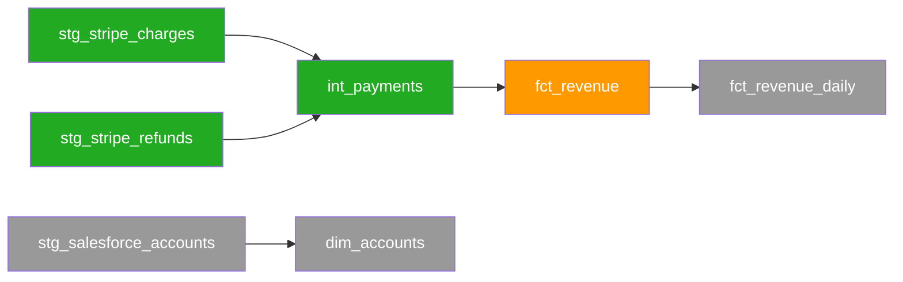

# Platform Migration Release

The Platform Migration release type covers the full lifecycle of migrating a data platform from one warehouse stack to another. It supports bidirectional BigQuery ↔ Snowflake migrations and introduces two structural features: a two-zone artifact model and an iterative equivalency loop.

**Supported platform pairs**: `bigquery_to_snowflake`, `snowflake_to_bigquery`

## Artifact zones

**Pre-audit utilities** — run these before starting the audit zone to register and snapshot the source dbt repository.

| Command | Purpose |
|---|---|
| `/wire:migration-source-register <release>` | Register the source dbt git repo (URL or local path, branch, models path) in `status.md` |
| `/wire:migration-source-refresh <release>` | Refresh or create the local snapshot; updates `migration_source.last_refreshed` |

`dbt-migration-generate` checks `migration_source.last_refreshed` at startup and warns if the snapshot is more than 24 hours old.

**Audit zone** — read-only analysis of the source platform. No writes to any external system.

| Artifact | Command | Purpose |
|---|---|---|
| `ingestion_audit` | `/wire:ingestion-audit-*` | Catalog all Fivetran connectors, sync configs, column selections |
| `db_object_audit` | `/wire:db-object-audit-*` | Enumerate databases, schemas, tables, views, procedures |
| `security_audit` | `/wire:security-audit-*` | Catalog roles, permissions, users, service accounts |
| `dbt_audit` | `/wire:dbt-audit-*` | Catalog dbt models, classify by migration complexity |
| `orchestration_audit` | `/wire:orchestration-audit-*` | Catalog orchestration jobs, schedules, and dependencies |
| `migration_inventory` | `/wire:migration-inventory-*` | Synthesise all five audits into a unified catalogue |

**Migration zone** — writes to the target platform. Safety-gated commands require explicit confirmation.

| Artifact | Safety gate | Purpose |
|---|---|---|
| `migration_batching` | No | Partition the approved inventory into named domain batches, checked against the real dependency graph; `-review` is the client sign-off on composition and schedule |
| `migration_strategy` | No | Platform-pair translation decisions, phasing, rollback; generates per-batch Mermaid DAG files |
| `target_setup` | **Yes** | Target warehouse config, schemas, roles, service accounts |
| `ingestion_migration` | **Yes** | Migrate connectors to target platform via MCP (creates new connectors + connect cards); runbook fallback if MCP unavailable |
| `dbt_migration` | No | Translate dbt models batch by batch; inline translate→compile→run→equivalency loop per model (up to 5 iterations) |
| `orchestration_migration` | **Yes** | Recreate orchestration jobs on target platform |
| `equivalency_validation` | No (loop) | Iterative row-count, schema, value, freshness comparison |
| `cutover` | **Yes** | Go-live runbook — point of no return |
| `migration_report` | No | Post-migration record |

## Setting up a Platform Migration release

Run `/wire:new` and select **Platform Migration**. You will be asked a set of additional questions:

1. **Source platform** — BigQuery or Snowflake
2. **Target platform** — must differ from source
3. **dbt project path** — relative to repo root
4. **Orchestration tool** — Dagster, dbt Cloud, Airflow, or None
5. **Ingestion tool** — Fivetran, RudderStack, Coupler.io, Segment, Airbyte, or Other
6. **Reporting / BI tool** — Looker, Metabase, Omni, OAC, None, or Other. `metabase` enables the Metabase reporting-layer commands; `omni` enables the Omni reporting-layer commands; `oac` enables the OAC reporting-layer commands.
7. **Reverse ETL tool** — Hightouch, None, or Other. `hightouch` enables `reverse-etl-audit` and `reverse-etl-migration` as a sixth audit alongside the five core ones; `none` (the default) skips it entirely.
8. **Connectivity** — public endpoint or private network requiring an MCP tunnel
9. **Target project / account** and any **production project IDs** to treat as off-limits for writes
10. **Migration scope** — full migration (default) or a **tenant carve-out**. Choosing carve-out captures a `migration.tenant_predicate` and turns on the carve-out flow described below.

## MCP server connections

The audit and migration commands connect directly to your source and target systems via MCP servers and APIs. Configure these before running any audit commands — not before `/wire:new`.

### Warehouse access (source and target)

Both warehouse platforms are accessed via the claude.ai MCP servers, available when running Wire in Claude Code with an Anthropic account.

| Platform | MCP server | What it's used for |
|---|---|---|
| Snowflake | `claude_ai_Snowflake` | `db-object-audit`, `security-audit`, `target-setup`, `equivalency-validate` |
| BigQuery | `claude_ai_BigQuery_MCP` | `db-object-audit`, `security-audit`, `target-setup`, `equivalency-validate` |

Authenticate via the claude.ai interface before starting the audit zone. Run `/wire:mcp list` to confirm both platforms are reachable.

### Ingestion tool connections

Wire auto-detects which ingestion tool you are using and connects via MCP or API fallback:

| Tool | Connection | Fallback |
|---|---|---|
| Fivetran | claude.ai Fivetran MCP server | Pre-exported CSV at `audit/fivetran_connectors_input.csv` |
| RudderStack | MCP server at `mcp.rudderstack.com` (OAuth) | None — authenticate via `/wire:mcp auth rudderstack` |
| Coupler.io | MCP server at `app.coupler.io/mcp` (personal access token) | CSV at `audit/coupler_dataflows_input.csv` |
| Segment | Public API token (`SEGMENT_TOKEN` env var) | None — no MCP server available |
| Airbyte | Airbyte API token (`AIRBYTE_TOKEN` env var, `api.airbyte.com/v1` or self-hosted) | Optional: Agent MCP at `mcp.airbyte.ai/mcp` |

`ingestion-audit-generate` probes each MCP endpoint with a 10-second timeout and falls back automatically where a CSV fallback exists. For large Fivetran estates (100+ connectors), prepare the CSV from the Fivetran dashboard before running the audit zone — the template is at `wire/TEMPLATES/migration/fivetran_connectors_input.csv`.

### Reverse ETL connections

If the source platform includes reverse ETL syncs, Wire audits them via the Hightouch REST API (`https://api.hightouch.com/api/v1`) using a read-only API key set in the `HIGHTOUCH_TOKEN` env var, or from a copy of the client's Hightouch Git config directory at `audit/hightouch_git/`.

The audit resolves the source warehouse object behind every sync — not just `rawSql` models, but `table` models (the configured source table) and `custom` models (best-effort from their definition) — and reports source-resolution coverage. Any sync whose source can't be resolved is listed explicitly rather than dropped, so its layer and drift exposure stay visible.

The reverse-ETL migration command (v3.10.0+) defaults to an additive topology: when Hightouch is managed by GitHub Sync, it adds a new batch of target-warehouse syncs alongside the existing source-warehouse ones in the same config repo and reuses the existing destination definitions in place, rather than spinning up a parallel workspace. GitHub Sync carries models and syncs but not destinations, so a separate workspace would force re-authenticating every destination. Every change is staged as a pull request the client reviews and merges — RA never enables/disables syncs directly — and cutover is two client-merged PRs (disable source-origin, enable target-origin). Destination safety during validation is a decoy ID-mapping table plus a scoped credential, so test syncs can only ever write to decoy targets; production destination IDs are absent until the cutover PR swaps them back. Translation is type-drift aware: it reads a per-release drift manifest and won't apply the generic `VARIANT → JSON` mapping to a column that lands as `STRING` under BigLake Iceberg.

### Private network access

If either warehouse is behind a VPC and not publicly reachable, deploy an MCP server tunnel inside the client's network and register it in Claude Console → Settings → MCP Tunnels. Wire outputs the exact tunnel deployment steps during `/wire:new` setup — do not proceed to the audit zone until the tunnel is confirmed active.

## Audit zone: parallel by default

```
/wire:migration-audit-all <release-folder>
```

This fans out five subagents simultaneously. Before launching, you will see a token cost confirmation with options to run in parallel or sequentially.

## dbt audit and complexity classification

`dbt-audit-generate` resolves the dbt project first — a single project at `migration.dbt_project_path`, or every nested project one level down if that path itself has no `dbt_project.yml`. **If neither resolves, the command hard-fails** rather than substituting a prior artifact or another release's catalogue.

It parses each resolved project to a manifest (`dbt parse`, no warehouse connection, run against a scratch directory so package installs never touch the client's working tree) and walks the filesystem for the model/source/test/macro/seed/snapshot inventory. Each model is tagged with platform-specific SQL constructs and assigned a complexity rating:

| Rating | Criteria |
|---|---|
| Simple | ≤100 lines, 0 feature tags, ≤3 upstream refs, no window functions or recursive CTEs |
| Moderate | 101–300 lines, OR 1–3 feature tags, OR 4–10 upstream refs, OR window functions without nested STRUCT/ARRAY |
| Complex | >300 lines, OR >3 feature tags, OR >10 upstream refs, OR UNNEST/STRUCT/FLATTEN/LATERAL/ML functions/GEOGRAPHY |

**Batch ordering is a topological sort over the parsed manifest**, not a depth-then-pack heuristic — every model's real dependencies land in an earlier-or-equal batch. Models with `enabled: false` are catalogued with a null `batch_number` and excluded from batching.

**The macro layer is scanned too.** Macros needing Snowflake→BigQuery translation are classified `translate` / `redesign` (no direct equivalent — surfaced at the review gate) / `manual-review-out-of-scope` (session/catalog operations, not model-build SQL). Each model's `platform_macros` column records which macros it uses, direct or transitive. The audit produces a **batch-zero macro translation plan** (`audit/batch_zero_plan.json` + `.md`) — the macros needing translation, tiered by dependency, meant to land before model batch 1.

`dbt-audit-validate` independently re-walks the filesystem and re-parses the manifest rather than trusting generate's self-report — reconciling the catalogue against disk, re-verifying batch order against the real dependency graph, and confirming every macro needing translation is classified.

## Migration batching: domain batches vs translation batches

`dbt_audit`'s `batch_number` is a **translation batch** — a group of ≤20 models ordered for `dbt-migration-generate`. A **domain batch** is a different concept: a named, business-scoped slice spanning every layer it touches (ingestion, warehouse objects, dbt models, orchestration, reverse ETL), delivered as its own release or sprint. A domain-batch schedule drawn up before the real dependency graph is known can claim batches build independently in parallel when the graph, once generated, shows they can't.

`/wire:migration-batching-generate` partitions the approved inventory's dependency graph into named domain batches once it's known, states plainly which batches have zero dependency edges between them (genuinely parallel-safe), and folds in the batch-zero macro dependency for any batch containing a flagged model. Like `region-tagging-generate`, it produces **candidates, not decisions** — `/wire:migration-batching-review` is the client adjudication gate (a change that would violate a real dependency must be withdrawn or explicitly risk-accepted, never silently overridden), and `/wire:migration-batching-validate` re-derives the graph independently so a plan drifting out of sync with reality gets caught automatically. Pass a hand-drafted plan as a seed (`--seed <path>`) to reconcile it against the graph rather than starting from scratch.

## Ingestion migration: MCP-driven execution

When the relevant ingestion tool's MCP server is reachable, `ingestion-migration-generate` executes the migration directly rather than writing a runbook:

1. Probes the MCP server for the ingestion tool in the audit (Fivetran, Airbyte, etc.)
2. Creates a **new connector** on the target destination for each in-scope connector — the source connector stays active throughout the parallel-run window
3. Generates a **connect card** (or equivalent setup URL) per connector and presents it immediately for credential entry
4. Polls connector state and reports which connectors have reached `connected` status

Wire never edits or re-points an existing source connector. If the MCP server is unavailable, Wire falls back to a step-by-step runbook — which also describes new connector creation only. The validate step adapts: MCP path verifies connector state via API; runbook path checks document completeness.

## Source repository management

Before running any audit or migration commands, register the source dbt project so Wire knows where to find model SQL files and the manifest.

```
/wire:migration-source-register <release>
/wire:migration-source-refresh <release>
```

`migration-source-register` records the source repository location — a remote git URL or a local path, the branch, and the models directory — in `status.md` under `migration_source`. `migration-source-refresh` checks out or pulls the snapshot and writes the current timestamp to `migration_source.last_refreshed`.

`dbt-migration-generate` reads `last_refreshed` at startup. If it is more than 24 hours old, translation is blocked with a warning until you run `migration-source-refresh` again. This prevents silent drift between the snapshotted SQL and whatever is live in the source warehouse.

## dbt migration: parallel agents, batches, and folder structure

```
/wire:dbt-migration-generate <release-folder>                      # all pending batches
/wire:dbt-migration-generate <release-folder> --batch 3            # specific batch
/wire:dbt-migration-generate <release-folder> --model stg_x        # single model
/wire:dbt-migration-generate <release-folder> --models stg_x,stg_y # named subset
```

### Scoping translation with node selectors

`--select` scopes the translation set by graph relationship using dbt's node-selection grammar, with `--exclude` as its companion. Both are resolved by Wire over the source project's dependency graph — **no dbt binary is required**. Wire reads the graph from the source project's `target/manifest.json` (a plain JSON artifact; no warehouse connection), and falls back to parsing `ref()`/`source()` and YAML config when no manifest is present.

```
/wire:dbt-migration-generate <release-folder> --select +vehicles            # vehicles and all upstream models
/wire:dbt-migration-generate <release-folder> --select vehicles+            # vehicles and all downstream models
/wire:dbt-migration-generate <release-folder> --select "+vehicles+"         # full subgraph
/wire:dbt-migration-generate <release-folder> --select "vehicles customers" # union — both subgraphs
/wire:dbt-migration-generate <release-folder> --select "+vehicles+" --exclude "tag:deprecated"
```

| Pattern | Meaning |
| :---- | :---- |
| `vehicles` | That model only (same as `--model vehicles`) |
| `+vehicles` / `vehicles+` | Plus all ancestors / all descendants |
| `2+vehicles` / `vehicles+1` | Ancestors up to 2 degrees / descendants down to 1 |
| `@vehicles` | Model, descendants, and ancestors of those descendants |
| `a b` (space) | Union — match either |
| `tag:x,config.materialized:y` (comma) | Intersection — match all |
| `tag:pilot`, `path:models/staging` | Set selectors by tag, config, or path |

A bare `--select vehicles` is identical to `--model vehicles`. `--select` cannot be combined with `--batch`, `--model`, or `--models`. Before translating, Wire prints the resolved model list and aborts if the selector matches nothing.

Wire splits each batch into groups of ~5 models and spawns one `wire:migration-specialist` agent per group simultaneously — a 20-model batch runs as 4 parallel agents; 3 batches of 20 launches 12 agents at once.

Translated models preserve the source project's folder structure. A model at `models/staging/stripe/stg_stripe_charges.sql` produces `migration/dbt/staging/stripe/stg_stripe_charges.sql` in the release folder. Companion YAML files follow the same structure.

**PII policy tags resolve automatically.** For a column with `meta.masking_policy`, `dbt-migration-generate` looks up a PII tag map (`migration.pii_tag_map_path`, default `migration/tag_map.json`) with a case-normalised lookup and authors the resolved `policy_tags` into the column YAML — an unresolved policy is flagged `MANUAL REVIEW REQUIRED`, never silently dropped. No map falls back to manual authoring.

**Materialisation is preserved by default**, with two layers of safety: an optional engagement override hook (`materialization_overrides_path`) forces a specific materialisation only where explicitly declared, and `dbt-migration-lint`'s `MATERIALIZATION_DRIFT` rule is the after-the-fact backstop for anything the hook can't reach — a hand-edited model, or a wrong materialisation despite preservation. Both are intentionally kept.

Each model gets one of three translation treatments:
- **auto-translate**: Mechanical syntax substitution applied with high confidence
- **guided-translate**: Non-trivial dialect difference — translated then flagged with `-- WIRE:REVIEW`
- **rewrite**: Logic tightly coupled to source platform features — flagged with `-- WIRE:REWRITE`

### Iterative translation and equivalency loop

Starting in v3.9.9, `dbt-migration-generate` embeds a per-model loop directly inside each translation agent. No manual intervention between iterations. Both the source and target platform MCP servers must be reachable before the command starts — it aborts with a clear error if either is missing.

For each model, the agent runs up to five iterations:

1. Translate source SQL to the target warehouse dialect
2. Compile-check against the target platform — `LIMIT 0` query, no data read
3. Run the model on the target test project
4. Three equivalency checks in sequence: row count (±0.5% tolerance), schema match, 1 000-row column value sampling
5. If any check fails, auto-fix the translated SQL and repeat from step 2

A model exits the loop as soon as all four checks pass. After five failed iterations it is marked `failed` and the batch continues — no mid-loop prompt to the user. Failures are surfaced in the acceptance pack once the batch completes.

A shared pre-flight gate (v3.10.0+) runs before the batch starts translating: it confirms the source dbt project was freshly re-synced for this batch, every source object the batch depends on exists and has data on target, and the target environment is prepared (PII policy tags and `target_setup` applied — not a playground). Any failure stops the command before generating.

### Per-model transformation log

Starting in v3.10.0, `dbt-migration-generate` can persist a structured record per migrated object to a BigQuery audit table — object name, batch, source → target dialect changes, manual-review flags, and confidence — set `migration.transformation_log_table` in `status.md` to the table (e.g. `<target-project>.wire_audit.dbt_transformation_log`). This gives a queryable per-model audit trail across the whole migration. It is additive: the per-model `.diff.md` files and batch summary are still written, and logging is skipped cleanly when the table isn't configured.

The per-model loop runs inside the same parallel agent structure — a 20-model batch still spawns four agents simultaneously; each agent handles its own loop for the ~5 models assigned to it.

## Batch DAG visualisation

`/wire:migration-strategy-generate` generates a Mermaid DAG file per batch at `artifacts/migration_strategy/dag_batch_N.md`. Each node represents one model; state is colour-coded and updated in-place as `dbt-migration-generate` runs.

| Colour | State |
|---|---|
| Grey (`#999`) | Not started |
| Orange (`#f90`) | Translated / in progress |
| Green (`#2a2`) | Equivalency passed |
| Red (`#c00`) | Failed after 5 iterations |

Example batch DAG:



Open the DAG file in any Mermaid-capable viewer — GitHub renders it natively in the PR diff.

## Migration acceptance packs

Once all models in a batch reach a terminal state (passed or failed after 5 iterations), `dbt-migration-generate` automatically writes `artifacts/dbt_migration/acceptance_pack_batch_N.md`. The pack contains a per-model results table — translation treatment, iteration count, equivalency check results, and any `-- WIRE:REVIEW` or `-- WIRE:REWRITE` flags — followed by a sign-off block.

Use the review command to present the pack to stakeholders:

```
/wire:migration-acceptance-pack-review <release> [--batch N]
```

Omit `--batch` to review the most recently completed batch. The reviewer chooses one of three outcomes:

- **Approve** — batch is accepted; Wire unblocks the next batch
- **Reject** — batch is sent back; `dbt-migration-generate` re-runs failed models
- **Hold** — batch is paused pending an external decision; noted in `status.md`

`cutover-generate` remains blocked until all batches are approved.

### What an acceptance pack looks like

`acceptance_pack_batch_1.md` is a structured markdown document written directly to `.wire/releases/<release>/migration/dbt/`. Here is a realistic example for a Snowflake → BigQuery migration batch with 8 models, 6 passed and 2 failed:

```markdown
# Migration Batch 1 — Acceptance Pack

**Generated**: 2026-05-14
**Release**: 01-gdp-snowflake-to-bq
**Batch**: 1
**Models in batch**: 8
**Status**: 6 passed · 2 failed

## Results Table

| Model | Iterations | Compile | Run | Row Count | Schema | Value Sample | Status |
|---|---|---|---|---|---|---|---|
| stg_salesforce__accounts | 1 | ✅ | ✅ | ✅ | ✅ | ✅ | **PASSED** |
| stg_salesforce__opportunities | 2 | ✅ | ✅ | ✅ | ✅ | ✅ | **PASSED** |
| stg_salesforce__contacts | 1 | ✅ | ✅ | ✅ | ✅ | ✅ | **PASSED** |
| stg_netsuite__transactions | 3 | ✅ | ✅ | ✅ | ✅ | ✅ | **PASSED** |
| stg_netsuite__customers | 1 | ✅ | ✅ | ✅ | ✅ | ✅ | **PASSED** |
| stg_netsuite__revenue_lines | 2 | ✅ | ✅ | ✅ | ✅ | ✅ | **PASSED** |
| stg_intercom__event_attributes | 5 | ✅ | ✅ | ✅ | ✅ | ❌ | **FAILED** |
| stg_intercom__session_metadata | 5 | ✅ | ✅ | ❌ | ✅ | ✅ | **FAILED** |

## Confirmation Statements

- All 8 models in batch 1 have been processed through the translation and equivalency loop
- Models marked PASSED have satisfied: row count ±0.5%, schema match, column value sampling ±1%/±2%
- Models marked FAILED exhausted 5 iterations without passing all equivalency checks
- No writes were made to the source platform (Snowflake) during this batch
- The following models require manual remediation:
  - `stg_intercom__event_attributes` — WIRE:REWRITE; VARIANT positional access has no direct BigQuery equivalent; value sample check failed on `prop_key` / `prop_value`
  - `stg_intercom__session_metadata` — row count delta exceeded ±0.5% after 5 iterations; QUALIFY window tie-breaking behaviour differs between Snowflake and BigQuery

## Batch 1 DAG

graph TD
  stg_salesforce__accounts:::complete
  stg_salesforce__opportunities:::complete
  stg_salesforce__contacts:::complete
  stg_netsuite__transactions:::complete
  stg_netsuite__customers:::complete
  stg_netsuite__revenue_lines:::complete
  stg_intercom__event_attributes:::failed
  stg_intercom__session_metadata:::failed

  classDef complete fill:#2a2,color:#fff
  classDef failed fill:#c00,color:#fff

## Sign-off

*Pending review by `/wire:migration-acceptance-pack-review 01-gdp-snowflake-to-bq --batch 1`*
```

After the review command runs and the reviewer decides to hold, the sign-off block is appended to the same file:

```markdown
## Sign-off

| Field | Value |
|---|---|
| Decision | HOLD |
| Reviewer | Alex Caldwell |
| Date | 2026-05-14 |
| Notes | Two Intercom models require manual rewrite. Scheduled for a follow-up batch 1b. Proceeding with batch 2 for remaining model layers. |
```

## Equivalency validation loop

Once data is flowing into both platforms:

```
/wire:equivalency-validate <release-folder>
```

Each run performs up to seven check types: row count, schema, value sampling, freshness, dbt tests, row-level checksum, and business invariants (release-level control totals). `--batch N` scopes a run to one migration batch.

**Relative-date models are pinned even in live mode.** A model referencing `CURRENT_DATE()`/`NOW()`-style functions evaluates "today" at whatever instant its side of the check runs, which can produce a false divergence near the live edge purely from timing skew. Wire detects these models, resolves a single as-of instant at the start of the run, and substitutes it into both sides' checks — recorded per model in the report. This is the always-on, lightweight counterpart to the baseline-pin mode below, which fixes the whole run at `T` when it's active.

**Reports are organised at the table level.** For every table in scope: a row-count result, an explicit "all columns present: yes/no" line naming any missing/extra columns, an explicit "sampled column values match: yes/no" line naming any mismatching columns, and one line per remaining applicable check — required for passing tables too.

When a check fails:

```
/wire:equivalency-investigate <release-folder> --object sales.fct_orders
/wire:equivalency-fix <release-folder> --object sales.fct_orders --approach "Update TIMESTAMP_DIFF translation"
```

`cutover-generate` is blocked until `checks_failing: 0`.

### Deterministic, frozen-baseline equivalency

Live-to-live comparison surfaces timing differences, not translation differences. `migration-strategy` defines a **frozen equivalency baseline** — an instant `T`, a Snowflake zero-copy clone at `T`, a BigQuery Bronze watermark (`_fivetran_synced <= T`), and an allow-list of expected type translations (`VARIANT→JSON/STRING`, `TIMESTAMP_NTZ→DATETIME`, `NUMBER`-scale rounding). Set it per freeze in `migration.equivalency_baseline`, then:

```
/wire:equivalency-validate <release-folder> --baseline --batch 3
```

Baseline mode reads the clone and watermark instead of live tables, fixes `CURRENT_TIMESTAMP`/`CURRENT_DATE`-relative logic and sampling (the deterministic-build switch), and runs a **tier-3 value-level comparator** — per-column fingerprints plus a normalised cross-platform row hash, with the allow-list applied so a correct type translation isn't flagged as drift. Every run records its mode, batch, `T`, watermarks, clone location, and source commit.

## Faithful materialisation

`dbt-migration-generate` preserves each model's resolved materialisation by default — incremental stays incremental with its `incremental_strategy`/`partition_by`/`cluster_by`; table stays table. To diverge (force a materialisation the source didn't use), point `migration.materialization_overrides_path` at an engagement YAML:

```yaml
default: preserve
overrides:
  - select: "path:models/business"   # path glob / path: / tag:
    exclude: "*/stg/*"                 # parameterised staging exception
    force_materialized: table
```

The framework ships no path, no layer names, and no rules — divergence is opt-in engagement policy.

## Keeping migrated models in sync — register and drift gate

A long migration runs against a moving source. Two commands keep migrated models honest:

- **`/wire:migration-register-generate`** maintains `migration_register.csv` — one row per model: source path, last-migrated commit, BigQuery target, state, and last equivalence result + `T`. `dbt-migration` and `equivalency-validate` keep it current.
- **`/wire:migration-drift-generate`** is a scheduled gate: it diffs the live source against each model's last-migrated commit (`dbt ls --select state:modified`), classifies new/modified/removed, flags the downstream Hightouch syncs a re-migrated/removed model feeds (with a config diff), and triggers a policy-tag regeneration when a source `meta.masking_policy` changes.

Deploy the bundled CI templates (`TEMPLATES/migration/ci/`) to run the tiered sweep on any change to a migrated model and the drift gate on a cron.

## Safety gates

Four commands require explicit confirmation before proceeding:
- **`target-setup-review`** — confirms DDL scripts have been reviewed, target environment is isolated, client has approved in writing
- **`ingestion-migration-review`** — confirms target landing schemas are ready, parallel running window is agreed
- **`orchestration-migration-review`** — confirms all orchestration jobs have been reviewed
- **`cutover-review`** — the point of no return. Requires all equivalency checks passing, written client sign-off, rollback window agreed

## Tenant carve-out variant

A platform migration runs in one of two scopes, set by `migration.scope` in `status.md`:

- **`full_migration`** (default) — migrate the whole platform. The flow above is unchanged. When `scope` is absent or `full_migration`, every migration command behaves exactly as before.
- **`tenant_carveout`** — extract a single tenant's data into the target. `/wire:new` asks whether this is a carve-out and captures a `migration.tenant_predicate` (the WHERE clause or tenant key, e.g. `tenant_id = 1042`) that scopes the extraction.

The carve-out is a variant on this release type, not a new one — it reuses the whole command set and adds tenant scoping where it matters. Equivalency threads the predicate through the existing checks on both source and target (no new check types — min/max already lives in value sampling, checksum and aggregate totals already exist; schema stays structural). The security chain narrows with it: the security audit classifies roles/grants as tenant-scoped vs shared and flags the tenant key per table, the strategy maps these to a two-project / tenant-scoped IAM model with a row-level security predicate, and `target_setup` emits tenant-scoped GRANTs and the RLS policy into `04_security.sql`, reusing the existing PII policy-tag taxonomy.

Four commands are specific to the carve-out flow:

| Command | Phase | Purpose |
|---|---|---|
| `/wire:region-tagging-*` | After audits | Classify every in-scope item into confident-region / shared-row-level / global-deferred buckets. Produces **candidates** for adjudication — never a binary include/exclude, never auto-removal. Region is a parameter (`--region <code>`). `-review` is the human adjudication gate. |
| `/wire:data-residency-assessment-*` | Alongside strategy | The GDPR and data-residency assessment, including the legal review of the historical data window being migrated. RA prepares it as data processor and flags every point needing the client's DPO/legal determination — lawful basis and retention ruling above all. `-review` is the client DPO/legal sign-off gate. |
| `/wire:bulk-copy-migration-*` | Migration | Snowflake→BigQuery bulk historical copy (BigQuery Data Transfer Service / GCS-staged) **in place of re-ingestion**. Two-stage copy with an equivalency gate between pilot partition and remainder, run under a scoped service account with a tenant guard. `-review` is a safety gate before the first copy. |
| `/wire:logical-access-uat-*` | Before cutover | Region-scoped logical-access UAT proving users in the tenant's project reach only that project. Positive and negative tests per role; `-validate` requires at least one negative test per IAM boundary in `04_security.sql`; `-review` is the isolation-proof sign-off gate. |

A worked example of the carve-out flow is in the [Tutorial: Tenant Carve-out](../tutorials/platform-migration-tenant-carveout).

## Metabase reporting-layer migration

Wire's reporting-layer support was Looker-only. Metabase is now a recognised reporting tool, set via `migration.reporting_tool: metabase` in `status.md` (asked at `/wire:new`). It is a general capability — it applies to any migration where the client uses Metabase, full migration or carve-out alike, and is **not gated by `migration.scope`**.

| Command | Purpose |
|---|---|
| `/wire:metabase-audit-*` | Catalogue collections, dashboards, cards (with SQL), database connections, and permission groups; map each card's warehouse dependencies. The reporting-layer counterpart to the reverse-ETL audit. |
| `/wire:metabase-migration-*` | Translate card SQL to BigQuery dialect, remap permission groups, validate on a throwaway decoy collection / non-production connection, then repoint the Metabase database connection from Snowflake to BigQuery in two stages with per-stage rollback. Requires a client-supplied query inventory — it will not proceed without one. |

Both build on the imported Metabase agent skills (`skills/metabase/SKILL.md`, wrapping the upstream `metabase/agent-skills`).

## Omni reporting-layer migration

Set via `migration.reporting_tool: omni` in `status.md` (asked at `/wire:new`), same general, scope-independent role as the Metabase support above.

| Command | Purpose |
|---|---|
| `/wire:omni-audit-*` | Catalogue connections, the semantic model (topics, views, dimensions, measures, relationships), and folders/workbooks/tiles; resolve each model view's warehouse dependencies. Dialect-specific SQL concentrates in the model's view definitions, not scattered per-tile the way Metabase's cards are — so views, not tiles, get the primary migration-approach classification. |
| `/wire:omni-migration-*` | Add the target connection, translate model view SQL by approach, validate on an **Omni model branch** (Omni's native branch-based model development — dashboards query through topics, so once the branch is promoted they inherit the new connection without individual repointing), then cut over the primary connection in two stages with rollback. |

Both build on the `omni` skill (`skills/omni/SKILL.md`), which references the official [exploreomni/omni-agent-skills](https://github.com/exploreomni/omni-agent-skills) — install via `/plugin marketplace add exploreomni/omni-agent-skills` then `/plugin install omni-analytics@omni-analytics`.

## OAC reporting-layer migration

Set via `migration.reporting_tool: oac` in `status.md` (asked at `/wire:new`), same general, scope-independent role as the Metabase support above. OAC's dialect-specific SQL concentrates in the **physical layer** of its SMML semantic model (physical table connections, raw physical join expressions) — the logical and presentation layers sit on top as a dialect-neutral star schema referencing physical columns by FQN, so they carry over unchanged.

| Command | Purpose |
|---|---|
| `/wire:oac-audit-*` | Catalogue the SMML semantic model — physical tables/connections/joins, logical tables/joins/hierarchies/measures, presentation subject areas — from the semantic-model Git repo; run `validate_smml.py` as part of cataloguing structural health. |
| `/wire:oac-migration-*` | Add the target physical connection, translate and re-validate physical joins against the new warehouse dialect, validate on a non-production copy of the semantic-model repo, then cut over the physical connection in two stages with rollback. Logical and presentation layers are not touched. |

Both build on the `smml-semantic-modeling` and `dbt-to-smml` skills (`wire/skills/smml-semantic-modeling/SKILL.md`, `wire/skills/dbt-to-smml/SKILL.md`).

## Full command sequence

```
/wire:new                                            # release_type: platform_migration

# ── SOURCE REPOSITORY ───────────────────────────────────────────
/wire:migration-source-register <release>            # register source dbt repo URL/path, branch, models path
/wire:migration-source-refresh <release>             # snapshot the repo; updates last_refreshed

# ── AUDIT ZONE (read-only) ──────────────────────────────────────
/wire:migration-audit-all <release>

# Per-audit validate + review gates
/wire:ingestion-audit-validate <release>
/wire:ingestion-audit-review <release>
/wire:db-object-audit-validate <release>
/wire:db-object-audit-review <release>
/wire:security-audit-validate <release>
/wire:security-audit-review <release>
/wire:dbt-audit-validate <release>
/wire:dbt-audit-review <release>
/wire:orchestration-audit-validate <release>
/wire:orchestration-audit-review <release>

# Synthesis — requires all five audits approved
/wire:migration-inventory-generate <release>
/wire:migration-inventory-validate <release>
/wire:migration-inventory-review <release>

# Optional — domain-batch scheduling (independently-implementable slices, not translation batches)
/wire:migration-batching-generate <release>          # or --seed <path> to reconcile a hand-drafted plan
/wire:migration-batching-validate <release>
/wire:migration-batching-review <release>            # client sign-off on batch composition and schedule

# ── MIGRATION ZONE ──────────────────────────────────────────────
/wire:migration-strategy-generate <release>          # also writes dag_batch_N.md per batch
/wire:migration-strategy-validate <release>
/wire:migration-strategy-review <release>

# ⚠ SAFETY GATE
/wire:target-setup-generate <release>
/wire:target-setup-validate <release>
/wire:target-setup-review <release>

# ⚠ SAFETY GATE
/wire:ingestion-migration-generate <release>
/wire:ingestion-migration-validate <release>
/wire:ingestion-migration-review <release>

# dbt migration — batched; repeat for each batch
# each batch runs an inline translate→compile→run→equivalency loop per model (up to 5 iterations)
# after each batch completes, an acceptance pack is auto-generated
/wire:dbt-migration-generate <release>
/wire:dbt-migration-validate <release>
/wire:dbt-migration-review <release>
/wire:migration-acceptance-pack-review <release> --batch N

# ⚠ SAFETY GATE
/wire:orchestration-migration-generate <release>
/wire:orchestration-migration-validate <release>
/wire:orchestration-migration-review <release>

# Equivalency loop — repeat until checks_failing == 0
/wire:equivalency-validate <release>
/wire:equivalency-investigate <release> --object <table_or_model>
/wire:equivalency-fix <release> --object <table_or_model>

# ⚠ SAFETY GATE — point of no return
/wire:cutover-generate <release>
/wire:cutover-validate <release>
/wire:cutover-review <release>

/wire:migration-report-generate <release>
/wire:migration-report-validate <release>
/wire:migration-report-review <release>

/wire:archive <release>
```

### Carve-out and reporting-layer additions

For a `tenant_carveout` release, these slot into the sequence: region tagging after the audits, the data-residency assessment alongside strategy, the bulk copy in place of ingestion migration, and logical-access UAT before cutover. Metabase commands run for any migration where `reporting_tool: metabase`; Omni commands run where `reporting_tool: omni`; OAC commands run where `reporting_tool: oac`.

```
# ── after audits, before inventory ──────────────────────────────
/wire:region-tagging-generate <release> [--region <code>]
/wire:region-tagging-validate <release>
/wire:region-tagging-review <release>                # human adjudication gate

# ── alongside strategy (Stage 1 deliverable) ────────────────────
/wire:data-residency-assessment-generate <release>
/wire:data-residency-assessment-validate <release>
/wire:data-residency-assessment-review <release>     # client DPO/legal sign-off

# ── reporting layer (reporting_tool: metabase) ──────────────────
/wire:metabase-audit-generate <release>              # …-validate / …-review
/wire:metabase-migration-generate <release>          # …-validate / …-review

# ── reporting layer (reporting_tool: omni) ──────────────────────
/wire:omni-audit-generate <release>                  # …-validate / …-review
/wire:omni-migration-generate <release>              # …-validate / …-review

# ── reporting layer (reporting_tool: oac) ────────────────────────
/wire:oac-audit-generate <release>                   # …-validate / …-review
/wire:oac-migration-generate <release>               # …-validate / …-review

# ⚠ SAFETY GATE — in place of ingestion-migration for a carve-out
/wire:bulk-copy-migration-generate <release>
/wire:bulk-copy-migration-validate <release>
/wire:bulk-copy-migration-review <release>           # safety gate before first copy

# ⚠ before cutover — proves tenant isolation
/wire:logical-access-uat-generate <release> [--region <code>]
/wire:logical-access-uat-validate <release>          # ≥1 negative test per IAM boundary
/wire:logical-access-uat-review <release>            # isolation-proof sign-off
```

:::info[Tutorial available]

A worked example of a Platform Migration engagement — using a fictional client scenario with realistic command output, agent delegation, and reviewer decisions — is available in the [Tutorial: Platform Migration](../tutorials/platform-migration).

:::

