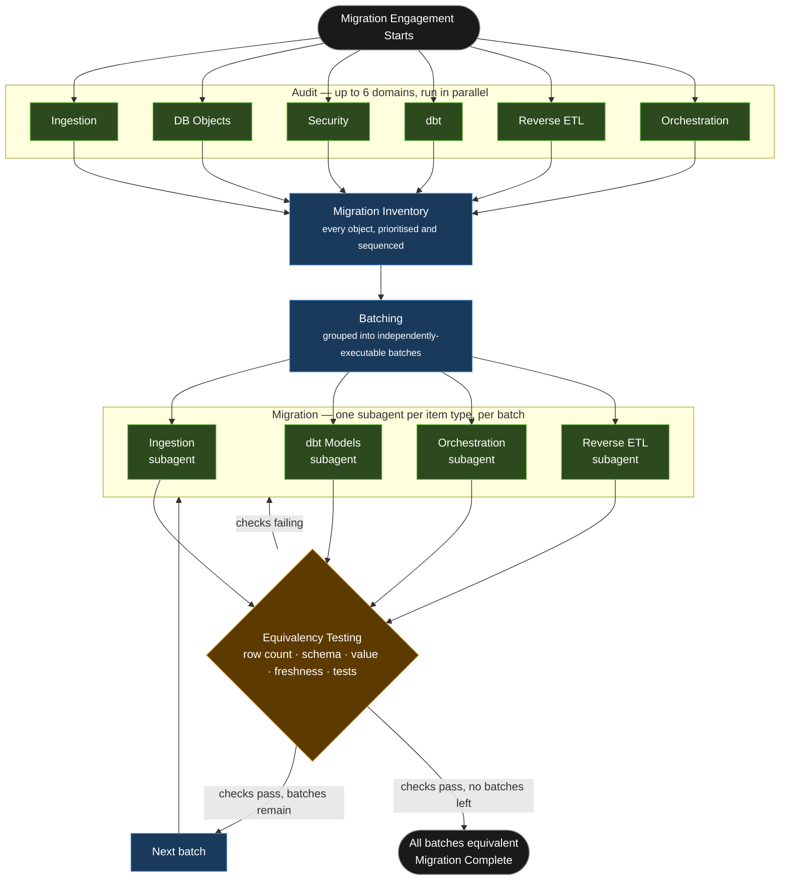
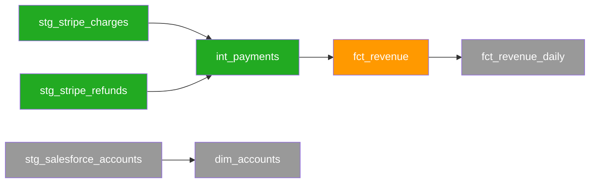

# Platform Migration Release

:::tip[You do not have to type these commands]

Since v4.0.0, on Claude Code, you can direct this release in plain language
instead: say what you want done and Wire works out which command that is from
this release type's definition, runs it, tells you what it did and stops at
every review gate for your decision. The commands, the artifacts and the record
on disk are identical either way, and typing them still works. See
[The Release Director Model](../advanced/release-director). The fleet operating
model this release type has used since v3.11 is now the migration profile of
that general model, and the lane roster, the stage ladder and the carve-out lane
additions are unchanged.

:::


If you have ever been asked to move a working data platform from one warehouse to another, you will know that the warehouse itself is the smallest part of the job. The connectors that land the data, the roles and grants that protect it, the dbt project that shapes it, the jobs that schedule it and the reverse ETL syncs that carry it back out into the business all have to arrive on the other side and produce the same numbers as before, and they have to do so while the source platform carries on changing underneath you. Wouldn't it be useful if every one of those moving parts was audited, sequenced, translated and proven equivalent by the same method, with a record of every decision along the way?

The Platform Migration release type is Wire's answer to that question, and it covers the full lifecycle of migrating a data platform from one warehouse stack to another. It supports bidirectional BigQuery ↔ Snowflake migrations and introduces two structural features that we will return to throughout this page: a "two-zone" artifact model, which separates read-only analysis of the source from writes to the target, and an iterative equivalency loop, which keeps translating and re-testing each model until it produces the same rows as the original.

**Supported platform pairs**: `bigquery_to_snowflake`, `snowflake_to_bigquery`


```mermaid
flowchart TD
    START([Migration Engagement Starts]):::event

    subgraph AUDIT["Audit — up to 6 domains, run in parallel"]
        direction LR
        A1[Ingestion]:::sub
        A2[DB Objects]:::sub
        A3[Security]:::sub
        A4[dbt]:::sub
        A5[Reverse ETL]:::sub
        A6[Orchestration]:::sub
    end

    INV[Migration Inventory<br/><small>every object, prioritised and sequenced</small>]:::stage
    BATCH[Batching<br/><small>grouped into independently-executable batches</small>]:::stage

    subgraph MIGRATE["Migration — one subagent per item type, per batch"]
        direction LR
        M1[Ingestion<br/>subagent]:::sub
        M2[dbt Models<br/>subagent]:::sub
        M3[Orchestration<br/>subagent]:::sub
        M4[Reverse ETL<br/>subagent]:::sub
    end

    EQ{Equivalency Testing<br/>row count · schema · value · freshness · tests}:::gate
    NEXT[Next batch]:::stage
    DONE([All batches equivalent<br/>Migration Complete]):::event

    START --> A1 & A2 & A3 & A4 & A5 & A6
    A1 & A2 & A3 & A4 & A5 & A6 --> INV
    INV --> BATCH --> M1 & M2 & M3 & M4
    M1 & M2 & M3 & M4 --> EQ
    EQ -->|checks failing| MIGRATE
    EQ -->|checks pass, batches remain| NEXT --> MIGRATE
    EQ -->|checks pass, no batches left| DONE

    classDef event fill:#1a1a1a,stroke:#888,color:#fff
    classDef stage fill:#1a3a5c,stroke:#4a90d9,color:#fff
    classDef sub fill:#2d4a1e,stroke:#6abf4b,color:#fff
    classDef gate fill:#5c3a00,stroke:#d98c1a,color:#fff
```

This is the release type at its simplest. Six audits run concurrently (five core ones, plus Reverse ETL if a reverse ETL tool is configured, as we will see below) and feed one migration inventory; the inventory is then partitioned into independently-executable batches; each batch dispatches one `migration-specialist` sub-agent per item type in parallel; and every batch is equivalency-tested before the next one starts, so that the migration finishes only once every batch has passed. A real engagement also has safety gates, target setup and a cutover sign-off sitting inside this flow, and we cover each of them in detail below.

We will start with the two artifact zones and the questions `/wire:new` asks when you set the release up, then work through the audit zone, batching, ingestion and dbt migration, the equivalency loop and the commands that carry a model from "migrated" to production-verified, before finishing with the tenant carve-out variant, the reporting-layer migrations and the full command sequence. Let's start though with the artifacts themselves.

## Artifact zones

**Pre-audit utilities** Run these before you start the audit zone, so that the source dbt repository is registered and snapshotted before anything reads from it.

| Command | Purpose |
|---|---|
| `/wire:migration-source-register <release>` | Register the source dbt git repo (URL or local path, branch, models path) in `status.md` |
| `/wire:migration-source-refresh <release>` | Refresh or create the local snapshot; updates `migration_source.last_refreshed` |

`dbt-migration-generate` checks `migration_source.last_refreshed` at startup and warns if the snapshot is more than 24 hours old.

**Audit zone** The audit zone is read-only analysis of the source platform, and nothing in it writes to any external system, which is what makes it safe to run all of them in parallel.

| Artifact | Command | Purpose |
|---|---|---|
| `ingestion_audit` | `/wire:ingestion-audit-*` | Catalogue all Fivetran connectors, sync configs and column selections |
| `db_object_audit` | `/wire:db-object-audit-*` | Enumerate databases, schemas, tables, views and procedures |
| `security_audit` | `/wire:security-audit-*` | Catalogue roles, permissions, users and service accounts |
| `dbt_audit` | `/wire:dbt-audit-*` | Catalogue dbt models, classify by migration complexity |
| `orchestration_audit` | `/wire:orchestration-audit-*` | Catalogue orchestration jobs, schedules and dependencies |
| `migration_inventory` | `/wire:migration-inventory-*` | Synthesise all five audits into a unified catalogue |

**Migration zone** The migration zone is where Wire writes to the target platform. As such, the commands that could do harm are safety-gated and require your explicit confirmation before they proceed.

| Artifact | Safety gate | Purpose |
|---|---|---|
| `migration_batching` | No | Partition the approved inventory into named domain batches, checked against the real dependency graph; `-review` is the client sign-off on composition and schedule |
| `migration_strategy` | No | Platform-pair translation decisions, phasing, rollback; generates per-batch Mermaid DAG files |
| `target_setup` | **Yes** | Target warehouse config, schemas, roles, service accounts |
| `ingestion_migration` | **Yes** | Migrate connectors to target platform via MCP (creates new connectors + connect cards); runbook fallback if MCP unavailable |
| `dbt_migration` | No | Translate dbt models batch by batch; inline translate→compile→run→equivalency loop per model (up to 5 iterations) |
| `orchestration_migration` | **Yes** | Recreate orchestration jobs on target platform |
| `equivalency_validation` | No (loop) | Iterative row-count, schema, value, freshness comparison |
| `cutover` | **Yes** | Go-live runbook: the point of no return |
| `migration_report` | No | Post-migration record |

## Setting up a Platform Migration release

Run `/wire:new` and select **Platform Migration**. Because a migration has more moving parts than a greenfield build, you will be asked a set of additional questions, and several of the answers switch optional command families on or off for the rest of the release:

1. **Source platform**: BigQuery or Snowflake
2. **Target platform**: must differ from source
3. **dbt project path**: relative to repo root
4. **Orchestration tool**: Dagster, dbt Cloud, Airflow or None
5. **Ingestion tool**: Fivetran, RudderStack, Coupler.io, Segment, Airbyte or Other
6. **Reporting / BI tool**: Looker, Metabase, Omni, OAC, None or Other. `metabase` enables the Metabase reporting-layer commands; `omni` enables the Omni reporting-layer commands; `oac` enables the OAC reporting-layer commands.
7. **Reverse ETL tool**: Hightouch, None or Other. `hightouch` enables `reverse-etl-audit` and `reverse-etl-migration` as a sixth audit alongside the five core ones; `none` (the default) skips it entirely.
8. **Connectivity**: public endpoint or private network requiring an MCP tunnel
9. **Target project / account** and any **production project IDs** to treat as off-limits for writes
10. **Migration scope**: full migration (default) or a **tenant carve-out**. Choosing carve-out captures a `migration.tenant_predicate` and turns on the carve-out flow described below.


## Business rules discovery (optional first phase)

Before any of the audits run there is a question worth asking of the estate you are about to move: does everyone agree what the numbers mean? New in 4.0, `/wire:business-rules-generate` runs before design and establishes exactly that, one business domain at a time.

It reads the definitions that already exist (in dbt, in LookML and, through
`--import`, in systems Wire cannot read such as SAP BW, Hana or SAC) and then asks
the people who own the numbers to settle the ones that disagree. The output is a
register with one entry per rule, holding every competing definition together with the file it
came from, what they disagree on, the decision, the named approver and a
reconciliation query that runs at generate time rather than in QA.

A rule nobody has decided is recorded with status `unknown`, which passes
validate. That is the point of it: a register has to be able to say "nobody has
agreed whether in-store orders are in this figure", because that sentence is what
stops the number being wrong nine months later.

**The gate is advisory.** ``migration-inventory-generate`` warns when the register has not been
reviewed, asks for a one-line reason, records it as an `advisory_skip` and
proceeds. Skipping is a real choice; what matters is that the choice is visible.

On a migration the register earns its place differently from a greenfield build, because the legacy system *is* the
reference. It follows, therefore, that every rule with a legacy variant gets a reconciliation query, and
those queries are the same comparisons equivalency validation would run later.
Running them before the batches start turns a definition dispute from a cutover
blocker into a day-one finding.

Full reference: [Business rules discovery](../advanced/business-rules.md).

## MCP server connections

The audit and migration commands connect directly to your source and target systems via MCP servers and APIs, which is how they read the real estate rather than a description of it. Configure these before you run any audit command; you do not need them in place before `/wire:new`.

### Warehouse access (source and target)

Both warehouse platforms are accessed via the claude.ai MCP servers, which are available when you run Wire in Claude Code with an Anthropic account.

| Platform | MCP server | What it's used for |
|---|---|---|
| Snowflake | `claude_ai_Snowflake` | `db-object-audit`, `security-audit`, `target-setup`, `equivalency-validate` |
| BigQuery | `claude_ai_BigQuery_MCP` | `db-object-audit`, `security-audit`, `target-setup`, `equivalency-validate` |

Authenticate via the claude.ai interface before starting the audit zone, and run `/wire:mcp list` to confirm both platforms are reachable.

### Ingestion tool connections

Wire auto-detects which ingestion tool you are using and connects via MCP, falling back to an API or a pre-exported file where it has to:

| Tool | Connection | Fallback |
|---|---|---|
| Fivetran | claude.ai Fivetran MCP server | Pre-exported CSV at `audit/fivetran_connectors_input.csv` |
| RudderStack | MCP server at `mcp.rudderstack.com` (OAuth) | None; authenticate via `/wire:mcp auth rudderstack` |
| Coupler.io | MCP server at `app.coupler.io/mcp` (personal access token) | CSV at `audit/coupler_dataflows_input.csv` |
| Segment | Public API token (`SEGMENT_TOKEN` env var) | None; no MCP server available |
| Airbyte | Airbyte API token (`AIRBYTE_TOKEN` env var, `api.airbyte.com/v1` or self-hosted) | Optional: Agent MCP at `mcp.airbyte.ai/mcp` |

`ingestion-audit-generate` probes each MCP endpoint with a 10-second timeout and falls back automatically where a CSV fallback exists. For large Fivetran estates (100+ connectors), prepare the CSV from the Fivetran dashboard before running the audit zone; the template is at `wire/TEMPLATES/migration/fivetran_connectors_input.csv`.

### Reverse ETL connections

If the source platform includes reverse ETL syncs, Wire audits them via the Hightouch REST API (`https://api.hightouch.com/api/v1`) using a read-only API key set in the `HIGHTOUCH_TOKEN` env var, or from a copy of the client's Hightouch Git config directory at `audit/hightouch_git/`.

The audit resolves the source warehouse object behind every sync, and not just for `rawSql` models: `table` models resolve to the configured source table and `custom` models are resolved best-effort from their definition, and the audit reports its source-resolution coverage. Any sync whose source can't be resolved is listed explicitly rather than dropped, so its layer and drift exposure stay visible.

The reverse-ETL migration command (v3.10.0+) defaults to an "additive" topology. When Hightouch is managed by GitHub Sync, it adds a new batch of target-warehouse syncs alongside the existing source-warehouse ones in the same config repo and reuses the existing destination definitions in place, rather than spinning up a parallel workspace, because GitHub Sync carries models and syncs but not destinations, so a separate workspace would force re-authenticating every destination. Every change is staged as a pull request the client reviews and merges (RA never enables or disables syncs directly), and cutover is two client-merged PRs, one to disable the source-origin syncs and one to enable the target-origin ones. Destination safety during validation is a decoy ID-mapping table plus a scoped credential, so test syncs can only ever write to decoy targets, and production destination IDs are absent until the cutover PR swaps them back. Translation is type-drift aware: it reads a per-release drift manifest and won't apply the generic `VARIANT → JSON` mapping to a column that lands as `STRING` under BigLake Iceberg. A fourth topology, `additive_dedicated_destination`, covers the carve-out shape where every new destination is already provisioned and never shared with an existing sync (proven per destination against the destination set Check 14 builds): there are no decoys, and cutover collapses to one client-merged PR that adds the new paused syncs and disables the old together.

### Private network access

If either warehouse is behind a VPC and not publicly reachable, deploy an MCP server tunnel inside the client's network and register it in Claude Console → Settings → MCP Tunnels. Wire outputs the exact tunnel deployment steps during `/wire:new` setup. Do not proceed to the audit zone until the tunnel is confirmed active, as the audit commands have nothing to read until it is.

## Audit zone: parallel by default

```
/wire:migration-audit-all <release-folder>
```

With the connections in place, one command runs the whole audit zone. It fans out five subagents simultaneously, and before launching you will see a token cost confirmation with options to run in parallel or sequentially.

## dbt audit and complexity classification

Of the five audits, the dbt audit is the one that shapes everything downstream, because its output decides how the models are batched and how hard each one will be to translate. `dbt-audit-generate` resolves the dbt project first: a single project at `migration.dbt_project_path`, or every nested project one level down if that path itself has no `dbt_project.yml`. **If neither resolves, the command hard-fails** rather than substituting a prior artifact or another release's catalogue.

It parses each resolved project to a manifest (`dbt parse`, no warehouse connection, run against a scratch directory so package installs never touch the client's working tree) and walks the filesystem for the model/source/test/macro/seed/snapshot inventory. Each model is tagged with platform-specific SQL constructs and assigned a complexity rating:

| Rating | Criteria |
|---|---|
| Simple | ≤100 lines, 0 feature tags, ≤3 upstream refs, no window functions or recursive CTEs |
| Moderate | 101–300 lines, OR 1–3 feature tags, OR 4–10 upstream refs, OR window functions without nested STRUCT/ARRAY |
| Complex | >300 lines, OR >3 feature tags, OR >10 upstream refs, OR UNNEST/STRUCT/FLATTEN/LATERAL/ML functions/GEOGRAPHY |

**Batch ordering is a topological sort over the parsed manifest**, not a depth-then-pack heuristic, so every model's real dependencies land in an earlier-or-equal batch. Models with `enabled: false` are catalogued with a null `batch_number` and excluded from batching.

**The macro layer is scanned too.** Macros needing Snowflake→BigQuery translation are classified `translate` / `redesign` (no direct equivalent, so surfaced at the review gate) / `manual-review-out-of-scope` (session/catalogue operations, not model-build SQL). Each model's `platform_macros` column records which macros it uses, direct or transitive. The audit produces a **batch-zero macro translation plan** (`audit/batch_zero_plan.json` + `.md`) listing the macros needing translation, tiered by dependency, which is meant to land before model batch 1.

Each plan entry also carries a **`layer`** that routes it to one of two lifecycles: `layer: macro` (Jinja / dispatched SQL-dialect macros) is translated by `/wire:dbt-migration-generate --macros`, whereas `layer: udf` (`create_udfs` and `fn_*` → `CREATE FUNCTION` objects) is deployed to the target by `/wire:target-setup-generate` as `05_udfs.sql`. See [Batch-zero pass: macros and UDFs](#batch-zero-pass-macros-and-udfs) below.

`dbt-audit-validate` independently re-walks the filesystem and re-parses the manifest rather than trusting generate's self-report, reconciling the catalogue against disk, re-verifying batch order against the real dependency graph and confirming every macro needing translation is classified.

## Migration batching: domain batches vs translation batches

Two things on this page are called a "batch", and it pays to keep them apart. `dbt_audit`'s `batch_number` is a **translation batch**, a group of ≤20 models ordered for `dbt-migration-generate`. A **domain batch** is a different concept: a named, business-scoped slice spanning every layer it touches (ingestion, warehouse objects, dbt models, orchestration, reverse ETL), delivered as its own release or sprint. The trouble with domain batches is that a schedule drawn up before the real dependency graph is known can claim batches build independently in parallel when the graph, once generated, shows they can't.

`/wire:migration-batching-generate` partitions the approved inventory's dependency graph into named domain batches once it's known, states plainly which batches have zero dependency edges between them (and are therefore genuinely parallel-safe), and folds in the batch-zero macro dependency for any batch containing a flagged model. Like `region-tagging-generate`, it produces **candidates, not decisions**: `/wire:migration-batching-review` is the client adjudication gate (a change that would violate a real dependency must be withdrawn or explicitly risk-accepted, never silently overridden), and `/wire:migration-batching-validate` re-derives the graph independently so a plan drifting out of sync with reality gets caught automatically. If you already have a hand-drafted plan, pass it as a seed (`--seed <path>`) to reconcile it against the graph rather than starting from scratch.

**Single-SCC estates fall back to build-ordered waves.** Some estates cross-reference in every direction, so that the domains form one strongly-connected component and no domain grouping can be both acyclic *and* declare every cross-batch edge (validate's C2 and C3 become mutually exclusive). On a real Snowflake→BigQuery migration (client anonymised) of 1,731 models, 3,467 objects and one SCC, the seed 13-domain partition reported 1,108 of 1,542 cross-batch edges undeclared and could not pass. When `migration-batching-generate` detects this, it switches `partition_mode` to `build_ordered_waves`: it topologically sorts the model graph, cuts it into `--target-batches N` waves (default: the domain-group count) and sets each wave to depend on the full prefix of earlier waves. That is trivially acyclic and declares every edge, so it validates 7/7, and it reproduces from the command instead of a hand-rolled script. The domain tag stays on every row for client/milestone rollup even when it can't be the build order, and the fallback is recorded in the narrative and in `status.md` (`scc_fallback: true`) so it's explicit *why* the output isn't domain-grouped.

## Ingestion migration: MCP-driven execution

Where the relevant ingestion tool's MCP server is reachable, `ingestion-migration-generate` does the work itself rather than writing a runbook for you to follow:

1. Probes the MCP server for the ingestion tool in the audit (Fivetran, Airbyte, etc.)
2. Creates a **new connector** on the target destination for each in-scope connector, while the source connector stays active throughout the parallel-run window
3. Generates a **connect card** (or equivalent setup URL) per connector and presents it immediately for credential entry
4. Polls connector state and reports which connectors have reached `connected` status

Wire never edits or re-points an existing source connector. If the MCP server is unavailable, Wire falls back to a step-by-step runbook, which also describes new connector creation only. The validate step adapts to whichever path ran: the MCP path verifies connector state via API, and the runbook path checks document completeness.

## Source repository management

Before running any audit or migration commands, register the source dbt project so that Wire knows where to find the model SQL files and the manifest.

```
/wire:migration-source-register <release>
/wire:migration-source-refresh <release>
```

`migration-source-register` records the source repository location (a remote git URL or a local path, the branch and the models directory) in `status.md` under `migration_source`. `migration-source-refresh` checks out or pulls the snapshot and writes the current timestamp to `migration_source.last_refreshed`.

`dbt-migration-generate` reads `last_refreshed` at startup. If it is more than 24 hours old, translation is blocked with a warning until you run `migration-source-refresh` again, which prevents silent drift between the snapshotted SQL and whatever is live in the source warehouse.

## dbt migration: parallel agents, batches, and folder structure

```
/wire:dbt-migration-generate <release-folder>                      # all pending batches
/wire:dbt-migration-generate <release-folder> --batch 3            # specific batch
/wire:dbt-migration-generate <release-folder> --model stg_x        # single model
/wire:dbt-migration-generate <release-folder> --models stg_x,stg_y # named subset
```

### Scoping translation with node selectors

Batches are the default unit of work, but you will often want to translate one part of the graph, such as everything a single model depends on. `--select` scopes the translation set by graph relationship using dbt's node-selection grammar, with `--exclude` as its companion. Both are resolved by Wire over the source project's dependency graph, so **no dbt binary is required**: Wire reads the graph from the source project's `target/manifest.json` (a plain JSON artifact; no warehouse connection), and falls back to parsing `ref()`/`source()` and YAML config when no manifest is present.

```
/wire:dbt-migration-generate <release-folder> --select +vehicles            # vehicles and all upstream models
/wire:dbt-migration-generate <release-folder> --select vehicles+            # vehicles and all downstream models
/wire:dbt-migration-generate <release-folder> --select "+vehicles+"         # full subgraph
/wire:dbt-migration-generate <release-folder> --select "vehicles customers" # union — both subgraphs
/wire:dbt-migration-generate <release-folder> --select "+vehicles+" --exclude "tag:deprecated"
```

| Pattern | Meaning |
| :---- | :---- |
| `vehicles` | That model only (same as `--model vehicles`) |
| `+vehicles` / `vehicles+` | Plus all ancestors / all descendants |
| `2+vehicles` / `vehicles+1` | Ancestors up to 2 degrees / descendants down to 1 |
| `@vehicles` | Model, descendants and ancestors of those descendants |
| `a b` (space) | Union: match either |
| `tag:x,config.materialized:y` (comma) | Intersection: match all |
| `tag:pilot`, `path:models/staging` | Set selectors by tag, config or path |

A bare `--select vehicles` is identical to `--model vehicles`. `--select` cannot be combined with `--batch`, `--model` or `--models`. Before translating, Wire prints the resolved model list and aborts if the selector matches nothing.

### Batch-zero pass: macros and UDFs

Why can't the macros simply travel with the models that use them? Because the macros and UDFs a model expands have to exist in translated form *before* the model that calls them can compile, and a widely-used macro reaches models scattered across every batch, so it can't sit "in" any one model batch. That is the "batch-zero" pass, and `dbt-audit` already produces its plan (`audit/batch_zero_plan.json`). Two commands consume it, one per `layer`:

```
/wire:dbt-migration-generate <release-folder> --macros   # translate the layer:macro Jinja/dispatched macros
/wire:target-setup-generate  <release-folder>            # deploy the layer:udf CREATE FUNCTION objects (05_udfs.sql)
```

`--macros` is its own scope mode (it can't be combined with `--batch`/`--model`/`--models`/`--select`). It translates the shared macro *definition* files in tier order (tier 0 first, then tier 1, and so on), reusing the same platform-pair guides and macro-first strategy as model translation, and writes them to `migration/dbt/macros/` mirroring the source tree. There's no row-equivalency loop here, since a macro is validated when the models that expand it compile. `dbt-migration-validate --macros` checks the pass: every macro-layer entry translated, tier order respected and no source-dialect functions left.

The **UDF layer** (`create_udfs`, `fn_*`) is warehouse DDL rather than Jinja, so it deploys with the other target objects. `target-setup-generate` translates each `action: translate` UDF into a target `CREATE FUNCTION` and writes them tier-ordered (`create_udfs` last) to `05_udfs.sql`, executed as target-setup Phase 1 after the review gate. UDFs with no direct target equivalent (`action: redesign`, such as Snowpark Python or JS VARIANT handling) are **not** mechanically translated; they surface in the MANIFEST's *UDF redesign decisions* section as an architecture choice (BigQuery ML / Vertex AI / remote UDF / in-model rewrite) that the `target-setup-review` safety gate must sign off before the affected models are translated.

Run order: `dbt-audit` → `dbt-migration-generate --macros` → `target-setup-generate` (deploy UDFs) → `dbt-migration-generate --batch 1`.

Wire splits each batch into groups of about five models and spawns one `wire:migration-specialist` agent per group simultaneously, so a 20-model batch runs as four parallel agents, and three batches of 20 launch 12 agents at once.

Translated models preserve the source project's folder structure. A model at `models/staging/stripe/stg_stripe_charges.sql` produces `migration/dbt/staging/stripe/stg_stripe_charges.sql` in the release folder, and companion YAML files follow the same structure.

**PII policy tags resolve automatically.** For a column with `meta.masking_policy`, `dbt-migration-generate` looks up a PII tag map (`migration.pii_tag_map_path`, default `migration/tag_map.json`) with a case-normalised lookup and authors the resolved `policy_tags` into the column YAML. An unresolved policy is flagged `MANUAL REVIEW REQUIRED`, never silently dropped, and having no map at all falls back to manual authoring.

**Materialisation is preserved by default**, with two layers of safety. An optional engagement override hook (`materialization_overrides_path`) forces a specific materialisation only where explicitly declared, and `dbt-migration-lint`'s `MATERIALIZATION_DRIFT` rule is the after-the-fact backstop for anything the hook can't reach, such as a hand-edited model or a wrong materialisation despite preservation. Both are intentionally kept.

**`cluster_by` plus a trailing `ORDER BY` is a BigQuery DDL error, not just a no-op.** A model with `cluster_by` set that also ends its outermost query in a top-level `ORDER BY` fails its `CREATE TABLE ... CLUSTER BY (...) AS (...)` outright (`Result of ORDER BY queries cannot be clustered`), both on `materialized: table` directly and on `incremental`'s first-run/full-refresh path, which issues the same CTAS shape. `dbt-migration-lint`'s `CLUSTER_BY_ORDER_BY_CONFLICT` rule catches this statically, before any materialisation is attempted, and because it tracks parenthesis depth over the compiled SQL rather than grepping for the keyword it doesn't misfire on an `ORDER BY` that's legitimately nested inside a window function, `QUALIFY` or an ordered aggregate like `ARRAY_AGG(x ORDER BY y)`.

Each model gets one of three translation treatments:
- **auto-translate**: Mechanical syntax substitution applied with high confidence
- **guided-translate**: Non-trivial dialect difference, translated then flagged with `-- WIRE:REVIEW`
- **rewrite**: Logic tightly coupled to source platform features, flagged with `-- WIRE:REWRITE`

### Iterative translation and equivalency loop

Translating a model is only useful if you can prove it still produces the same rows, and so, starting in v3.9.9, `dbt-migration-generate` embeds a per-model loop directly inside each translation agent, with no manual intervention between iterations. Both the source and target platform MCP servers must be reachable before the command starts, and it aborts with a clear error if either is missing.

For each model, the agent runs up to five iterations:

1. Translate source SQL to the target warehouse dialect
2. Compile-check against the target platform (a `LIMIT 0` query, so no data is read)
3. Run the model on the target test project
4. Three equivalency checks in sequence: row count (±0.5% tolerance), schema match, 1 000-row column value sampling
5. If any check fails, auto-fix the translated SQL and repeat from step 2

A model exits the loop as soon as all four checks pass. After five failed iterations it is marked `failed` and the batch continues, with no mid-loop prompt to the user, and the failures are surfaced in the acceptance pack once the batch completes.

A shared pre-flight gate (v3.10.0+) runs before the batch starts translating. It confirms that the source dbt project was freshly re-synced for this batch, that every source object the batch depends on exists and has data on target, and that the target environment is prepared (PII policy tags and `target_setup` applied, so not a playground). Any failure stops the command before generating.

### Widening the equivalency gate to match the deployment surface (v3.10.12+)

The equivalency loop proves that the same rows come out, for the sampled data, on one default code path, in the validation warehouse. Deployment, however, fails on the surfaces that loop never exercises. Four checks, added in v3.10.12 and all driven by the active platform pair, close that gap so a model Wire reports as equivalent also deploys cleanly, and the later additions in the same list build on them:

- **`dbt-migration-validate` exercises every rendered code path**, not just one default-target full-refresh compile. It compiles each model under every target profile the project defines (discovered from `profiles.yml`, never hardcoded), builds incremental models twice so the `is_incremental()` branch actually renders, and runs `dbt build` rather than `dbt run` so generic and singular tests execute. A per-model coverage report shows what was exercised, and a dev-only branch, an incremental-only predicate or an unported test is failed before a PR is opened.
- **A deployment-warehouse type pre-flight** (`specs/utils/deployment_type_preflight.md`), shared by `dbt-migration-generate` and `equivalency-validate`, reads the *real deployment* warehouse's column types, not the scratch or sample warehouse a model was validated against, and flags the pair's type-divergence patterns: a `TIMESTAMP()` wrap on an already-typed column, a JSON function on a STRING-versus-JSON mismatch, a string function on a non-string column such as a bare `TRIM()` on an `INT64` id, or an implicit cross-type join coercion. It warns explicitly whenever the validation and deployment warehouses differ.
- **A column governance equivalence check** (`equivalency-validate` check type 8), separate from row-level equivalency. Row-level checks compare data and cannot see column-level security, so a column masked at source but unprotected at target produces identical rows. This check compares each column's protection at target against the source masking policy and fails when protection was dropped.
- **`dbt-migration-pre-pr-review`** is a faithfulness review over the translated diff, run before a PR is opened. It composes the three checks above together with the pair's edge-case runtime patterns (an uncast blank-string-to-numeric, an unguarded JSON accessor, an unanchored regex and, from v3.10.15, a `DIV0`/`DIV0NULL` translated as bare `SAFE_DIVIDE` or an `IFNULL`/`COALESCE(SAFE_DIVIDE(…), 0)` wrapper instead of the faithful `IF(...)` form, a silent NULL-coercion divergence graded `error`) into a structured findings list with severity, `file:line` and a suggested fix. Run it with `--format json --severity error` to gate CI, so defects are resolved locally instead of in the client's PR queue.
- **`dbt-migration-fix`** (v3.10.14) is the mutation counterpart to the read-only review. It ingests the review findings, classifies each as `auto` / `propose` / `decision`, auto-applies the deterministic-and-safe fixes (looping, capped, re-running the deterministic gate each pass) and escalates only the findings that need a human decision, so that the consultant adjudicates the residue instead of hand-fixing the mechanical volume. The auto/propose/decision mapping lives in the platform pair and engagement overrides, and `--dry-run` shows the plan without editing.
- **Column-order parity and the `SELECT *` ban** (v3.10.16) rest on the principle that a lift-and-shift's output schema is a contract: column set *and* ordinal order must match the source. `dbt-migration-lint`'s `UNPINNED_SELECT_STAR` rule fails any model whose final output projection is `SELECT *`, `SELECT <alias>.*` or `SELECT * EXCEPT(...)` (import/staging CTEs may `SELECT *` internally; only the depth-0 output projection is checked). The schema-equivalence check now compares columns `ORDER BY ordinal_position`, as sequences and not just sets, and fails `column_order_drift` on a reorder, allowing a pair-declared tail allow-list (audit columns, then region/surrogate globalise keys) and a per-model `column_order_waived` reason for a signed-off reorder. `dbt-migration-pre-pr-review` surfaces both before a PR is opened.
- **Shift-left: fix deterministic defects at translation time, and chain the gates** (v3.10.19). The gate above got the *checks* existing; this is about catching defects as early and as automatically as possible. `dbt-migration-generate`'s per-model loop now proactively applies the pair's full deterministic rule set *during translation* and auto-rewrites the deterministic-and-safe patterns inline, not only when equivalency fails, so a `DIV0` NULL-coercion, a bare `PARSE_JSON`, an unpinned `SELECT *` or a dropped policy tag comes out already fixed. Semantic, intent-dependent patterns stay flagged, never auto-rewritten. Four residual rules join the set: `MODEL_NOT_REGISTERED_FOR_DEPLOYMENT` (a new model missing from the deployment orchestrator's selection manifest, read via a configurable pointer, and a documented no-op rather than a false pass when unconfigured), `HARDCODED_TARGET_DATABASE_XPROJECT`, `CDC_SOURCE_NO_SOFT_DELETE_FILTER` and `STALE_NULL_PAD_BRONZE_PRESENT` (in `migration-drift`, flag-for-restore). Furthermore, `generate` now chains `validate → lint → fix → pre-pr-review` by default (`--no-chain` opts out; `--macros`/`--snapshots` never chain), so a run leaves the full gate applied instead of stopping at "recommended next steps".

### Defect-provenance report (v3.10.19)

`dbt-migration-generate` catching more, earlier, is only half the story, because you also want to know whether it's working. `migration-report-generate --lens defects` reads the structured findings every gate already emits (`dbt-migration-lint`, `dbt-migration-validate` Check 5 coverage, `equivalency-validate`, `dbt-migration-pre-pr-review` and the `dbt-migration-fix` applied-fix summaries) and produces, per wave: a **stage-of-capture** breakdown (the earliest gate that caught each defect, by pattern id), an **auto-fixed vs escalated** split, a **client-caught** count (findings recorded after our gates passed, reported explicitly as `"not tracked"` when the optional client-review input is absent, never as a silent zero) and a **wave-over-wave trend** so that the leftward shift, or a regression, is visible at a glance. A defect class that keeps reaching the client is surfaced as a rule *candidate*; deciding to encode it stays a human call, since the report is the evidence and not the decision.

### Per-model transformation log

Starting in v3.10.0, `dbt-migration-generate` can persist a structured record per migrated object to a BigQuery audit table, giving you a queryable per-model audit trail across the whole migration: object name, batch, source → target dialect changes, manual-review flags and confidence. Set `migration.transformation_log_table` in `status.md` to the table (e.g. `<target-project>.wire_audit.dbt_transformation_log`). It is additive, in that the per-model `.diff.md` files and batch summary are still written, and logging is skipped cleanly when the table isn't configured.

The per-model loop runs inside the same parallel agent structure, so a 20-model batch still spawns four agents simultaneously and each agent handles its own loop for the five or so models assigned to it.

## dbt snapshots (SCD-2 history)

A dbt snapshot is not a model; it is an SCD-2 history table whose rows accrete over time. Re-running `dbt snapshot` from empty against the target rebuilds only the *current* state and loses every closed version, so a snapshot needs different handling from a model: its built history must be physically moved, not recomputed. From v3.10.18, snapshots are a first-class migration object type across both the `platform_migration` and `tenant_carveout` release types, and they are catalogued, strategy-assigned, history-copied, translated, continued, tested and ordered like any other object.

**How a snapshot flows through the migration:**

1. **Catalogue.** `dbt-audit-generate` scans snapshot-paths (`` blocks + the `snapshots/` dir) and records each snapshot as its own object type, with its `strategy` (timestamp/check), `unique_key`, `updated_at`/`check_cols`, `invalidate_hard_deletes`, `target_schema`, upstream ref/source and downstream dependents, into `audit/dbt_snapshots.csv`. `migration-inventory-generate` adds `snapshot` nodes and the upstream→snapshot / snapshot→dependent edges to the dependency graph.
2. **Strategy.** `migration-strategy-generate` and the migration register assign each snapshot `copy_and_continue` (the default, which preserves history) or `rebuild_from_T` (start fresh at the baseline; this requires a recorded data-owner sign-off, or it falls back to `copy_and_continue`).
3. **History copy.** For `copy_and_continue`, `bulk-copy-migration-generate` copies the built snapshot table to the exact `target_schema` relation, preserving the four dbt meta columns (`dbt_scd_id`, `dbt_updated_at`, `dbt_valid_from`, `dbt_valid_to`) and their ordinal order, with types translated via the pair's `type_mapping`. The source snapshot is frozen at the strategy's baseline `T` first, and under a tenant carve-out the copy is filtered to the in-scope tenant's history.
4. **Translate + continue.** `dbt-migration-generate` translates the inner `SELECT` and repoints `ref`/`source`, but keeps the snapshot **config byte-identical**: `strategy`, `unique_key`, `updated_at`/`check_cols` and `invalidate_hard_deletes`. This matters because dbt derives `dbt_scd_id` by hashing those inputs, so any change to them re-hashes every row and orphans the copied history. After the copy lands, dbt runs `dbt snapshot --select <snap>` once to adopt the copied relation and continue it, appending only genuinely new versions.
5. **Test.** A snapshot-specific three-layer gate in `dbt-migration-validate` / `equivalency-validate` replaces plain row-equivalence (which cannot see SCD-2 continuity): (a) copy-parity at `T` (schema incl. meta columns + order, row count, checksum); (b) continuation behaviour (unchanged rows unchanged, a changed row opens exactly one new version, hard-deletes invalidated, idempotent second run); (c) SCD integrity (unique `dbt_scd_id`, not-null key + `dbt_valid_from`, no overlapping open versions). A SELECT-only row-equivalence is never a snapshot's pass criterion.
6. **Ordering.** `migration-batching-generate` sorts each snapshot as a first-class build node, after its upstream ref model and before its dependents, so that no downstream model is deferred just because its snapshot upstream was skipped.

The whole flow is dialect-agnostic: the SCD meta-column types and the `dbt_scd_id` hash computation are declared per platform pair (`translation_guide.md` → "Snapshot SCD mechanisms"), never hardcoded in a command.

### The `--snapshots` scope

`--snapshots` is a standalone scope (modelled on `--macros`) that processes snapshot object-type nodes on their own, skipping models. It works on the four snapshot-processing commands, `dbt-migration-generate`, `dbt-migration-validate`, `equivalency-validate` and `bulk-copy-migration-generate`. Bare `--snapshots` selects every snapshot, and `--snapshots name1,name2` narrows to named ones. It cannot be combined with `--batch`/`--wave`/`--model`/`--models`/`--select`/`--exclude`/`--macros`, since a normal `--wave`/`--batch` run already processes its in-scope snapshots inline; `--snapshots` exists for the targeted and retrofit cases below.

### Retrofitting snapshots onto an already-migrated project

What if you migrated the regular dbt models wave-by-wave *before* snapshot support existed? In that case the snapshots were never catalogued, because they fell through the model-only commands. Cataloguing is independent of translation, however, so you can go back and add them without disturbing the models you already migrated:

1. **Re-catalogue**: re-run `/wire:dbt-audit-generate` and `/wire:migration-inventory-generate`. This is additive: it writes `dbt_snapshots.csv` and adds the snapshot nodes/edges to the graph; it does not re-translate the models.
2. **Strategy + register**: re-run `/wire:migration-strategy-generate`. It adds the snapshot section and assigns each snapshot a strategy, and the register gains its `object_type = snapshot` rows.
3. **Re-batch**: re-run `/wire:migration-batching-generate` so snapshots slot into the schedule as topo nodes. The model ordering is deterministic, so the models don't shuffle; the snapshots just take their place after upstream and before dependents.
4. **Migrate the snapshots only**: use the `--snapshots` scope so you don't re-run the models that are already done:
   ```
   /wire:bulk-copy-migration-generate <release> --snapshots        # copy history to target_schema (see note)
   /wire:dbt-migration-generate       <release> --snapshots        # translate inner SELECT + dbt snapshot once to continue
   /wire:dbt-migration-validate       <release> --snapshots        # three-layer snapshot gate
   ```

Without `--snapshots` you would have to run the whole wave a snapshot landed in, which re-processes the already-migrated models in that wave and wastes the work. `--snapshots` is the lever that keeps the retrofit surgical.

**Full-migration note on the history copy.** The snapshot history copy (`bulk-copy-migration-generate --snapshots`) runs in **both** release types. Under a tenant carve-out it is tenant-filtered like every other extract, whereas in a full migration it copies the whole history unfiltered. The raw-table/connector copy path of `bulk-copy` remains carve-out-only, because in a full migration raw tables re-land via `/wire:ingestion-migration-generate`; snapshot history has no such path (repointing a connector never reconstructs built SCD-2 history), which is why the snapshot-history copy is allowed in any scope. `rebuild_from_T` snapshots are skipped by the copy, as they start fresh at `T`.

## Batch DAG visualisation

It helps to be able to see a batch progressing rather than read about it, and so `/wire:migration-strategy-generate` generates a Mermaid DAG file per batch at `artifacts/migration_strategy/dag_batch_N.md`. Each node represents one model, and its state is colour-coded and updated in place as `dbt-migration-generate` runs.

| Colour | State |
|---|---|
| Grey (`#999`) | Not started |
| Orange (`#f90`) | Translated / in progress |
| Green (`#2a2`) | Equivalency passed |
| Red (`#c00`) | Failed after 5 iterations |

Example batch DAG:


```mermaid
graph LR
    stg_stripe_charges:::done --> int_payments:::done
    stg_stripe_refunds:::done --> int_payments
    int_payments --> fct_revenue:::inprogress
    stg_salesforce_accounts:::notstarted --> dim_accounts:::notstarted
    fct_revenue --> fct_revenue_daily:::notstarted

    classDef notstarted fill:#999,color:#fff
    classDef inprogress fill:#f90,color:#fff
    classDef done fill:#2a2,color:#fff
    classDef failed fill:#c00,color:#fff
```

Open the DAG file in any Mermaid-capable viewer; GitHub renders it natively in the PR diff.

## Migration acceptance packs

Once all models in a batch reach a terminal state (passed, or failed after 5 iterations), `dbt-migration-generate` automatically writes `artifacts/dbt_migration/acceptance_pack_batch_N.md`, which is the document you take to the client. The pack contains a per-model results table (translation treatment, iteration count, equivalency check results and any `-- WIRE:REVIEW` or `-- WIRE:REWRITE` flags) followed by a sign-off block.

Use the review command to present the pack to stakeholders:

```
/wire:migration-acceptance-pack-review <release> [--batch N]
```

Omit `--batch` to review the most recently completed batch. The reviewer chooses one of three outcomes:

- **Approve**: the batch is accepted and Wire unblocks the next batch
- **Reject**: the batch is sent back and `dbt-migration-generate` re-runs failed models
- **Hold**: the batch is paused pending an external decision, and the hold is noted in `status.md`

`cutover-generate` remains blocked until all batches are approved.

### What an acceptance pack looks like

`acceptance_pack_batch_1.md` is a structured markdown document written directly to `.wire/releases/<release>/migration/dbt/`. Here is a realistic example for a Snowflake → BigQuery migration batch with eight models, six passed and two failed:

```markdown
# Migration Batch 1 — Acceptance Pack

**Generated**: 2026-05-14
**Release**: 01-gdp-snowflake-to-bq
**Batch**: 1
**Models in batch**: 8
**Status**: 6 passed · 2 failed

## Results Table

| Model | Iterations | Compile | Run | Row Count | Schema | Value Sample | Status |
|---|---|---|---|---|---|---|---|
| stg_salesforce__accounts | 1 | ✅ | ✅ | ✅ | ✅ | ✅ | **PASSED** |
| stg_salesforce__opportunities | 2 | ✅ | ✅ | ✅ | ✅ | ✅ | **PASSED** |
| stg_salesforce__contacts | 1 | ✅ | ✅ | ✅ | ✅ | ✅ | **PASSED** |
| stg_netsuite__transactions | 3 | ✅ | ✅ | ✅ | ✅ | ✅ | **PASSED** |
| stg_netsuite__customers | 1 | ✅ | ✅ | ✅ | ✅ | ✅ | **PASSED** |
| stg_netsuite__revenue_lines | 2 | ✅ | ✅ | ✅ | ✅ | ✅ | **PASSED** |
| stg_intercom__event_attributes | 5 | ✅ | ✅ | ✅ | ✅ | ❌ | **FAILED** |
| stg_intercom__session_metadata | 5 | ✅ | ✅ | ❌ | ✅ | ✅ | **FAILED** |

## Confirmation Statements

- All 8 models in batch 1 have been processed through the translation and equivalency loop
- Models marked PASSED have satisfied: row count ±0.5%, schema match, column value sampling ±1%/±2%
- Models marked FAILED exhausted 5 iterations without passing all equivalency checks
- No writes were made to the source platform (Snowflake) during this batch
- The following models require manual remediation:
  - `stg_intercom__event_attributes` — WIRE:REWRITE; VARIANT positional access has no direct BigQuery equivalent; value sample check failed on `prop_key` / `prop_value`
  - `stg_intercom__session_metadata` — row count delta exceeded ±0.5% after 5 iterations; QUALIFY window tie-breaking behaviour differs between Snowflake and BigQuery

## Batch 1 DAG

graph TD
  stg_salesforce__accounts:::complete
  stg_salesforce__opportunities:::complete
  stg_salesforce__contacts:::complete
  stg_netsuite__transactions:::complete
  stg_netsuite__customers:::complete
  stg_netsuite__revenue_lines:::complete
  stg_intercom__event_attributes:::failed
  stg_intercom__session_metadata:::failed

  classDef complete fill:#2a2,color:#fff
  classDef failed fill:#c00,color:#fff

## Sign-off

*Pending review by `/wire:migration-acceptance-pack-review 01-gdp-snowflake-to-bq --batch 1`*
```

After the review command runs and the reviewer decides to hold, the sign-off block is appended to the same file:

```markdown
## Sign-off

| Field | Value |
|---|---|
| Decision | HOLD |
| Reviewer | Alex Caldwell |
| Date | 2026-05-14 |
| Notes | Two Intercom models require manual rewrite. Scheduled for a follow-up batch 1b. Proceeding with batch 2 for remaining model layers. |
```

## Equivalency validation loop

The per-model loop inside `dbt-migration-generate` proves each model as it is translated, but you also need to keep proving the estate as a whole once data is flowing into both platforms, and that is what the release-level equivalency loop is for:

```
/wire:equivalency-validate <release-folder>
```

Each run performs up to seven check types: row count, schema, value sampling, freshness, dbt tests, row-level checksum and business invariants (release-level control totals). `--batch N` scopes a run to one migration batch (`dbt_audit.csv`'s topological scheme), whereas `--wave <id>` scopes it to one execution wave instead (`migration_batching.csv`'s authoritative schedule), and unlike `--batch` a wave's scope spans every object type in it (connectors, warehouse objects, dbt models, orchestration jobs, reverse-ETL syncs), not just dbt models. The two are mutually exclusive.

**Relative-date models are pinned even in live mode.** A model referencing `CURRENT_DATE()`/`NOW()`-style functions evaluates "today" at whatever instant its side of the check runs, which can produce a false divergence near the live edge purely from timing skew. Wire detects these models, resolves a single as-of instant at the start of the run and substitutes it into both sides' checks, recording the instant per model in the report. This is the always-on, lightweight counterpart to the baseline-pin mode below, which fixes the whole run at `T` when it's active.

**Reports are organised at the table level.** For every table in scope you get a row-count result, an explicit "all columns present: yes/no" line naming any missing/extra columns, an explicit "sampled column values match: yes/no" line naming any mismatching columns and one line per remaining applicable check, and these lines are required for passing tables too.

When a check fails:

```
/wire:equivalency-investigate <release-folder> --object sales.fct_orders
/wire:equivalency-fix <release-folder> --object sales.fct_orders --approach "Update TIMESTAMP_DIFF translation"
```

`cutover-generate` is blocked until `checks_failing: 0`.

### Deterministic, frozen-baseline equivalency

Live-to-live comparison surfaces timing differences, not translation differences. To take timing out of the picture, `migration-strategy` defines a **frozen equivalency baseline**: an instant `T`, a Snowflake zero-copy clone at `T`, a BigQuery Bronze watermark (`_fivetran_synced <= T`) and an allow-list of expected type translations (`VARIANT→JSON/STRING`, `TIMESTAMP_NTZ→DATETIME`, `NUMBER`-scale rounding). Set it per freeze in `migration.equivalency_baseline`, then:

```
/wire:equivalency-validate <release-folder> --baseline --batch 3
```

Baseline mode reads the clone and watermark instead of live tables, fixes `CURRENT_TIMESTAMP`/`CURRENT_DATE`-relative logic and sampling (the deterministic-build switch) and runs a **tier-3 value-level comparator**, which computes per-column fingerprints plus a normalised cross-platform row hash, with the allow-list applied so that a correct type translation isn't flagged as drift. Every run records its mode, batch, `T`, watermarks, clone location and source commit.

### Declared windows and known differences (v3.11.4)

Not every divergence is a defect, and two structured qualifiers close the gap between "diverged" and "wrong", so that a real difference with a proven benign cause stops being re-argued in prose on every PR:

- **Declared windows.** A target that holds less history than the source (young Bronze connectors, bounded bring-ins) reads 90 to 99% short on a full-table check for a reason that is availability, not translation. Where an object carries a declared window (floor auto-derived from target Bronze `MIN(loaded_at)` or partition metadata, or declared in `migration.declared_windows` with reasoned exclusions; cap at the run's pinned as-of), the verdict binds to it: `diff_availability` with mechanism `declared_window_availability` and the floor/cap/exclusions as structured fields on the verdict row. It is claimable only when the in-window comparison passes exactly, and an in-window divergence is never availability. `batch-raise` renders the window fields in the PR body.
- **Connector-emission known differences.** Some divergences are a connector behaviour class, not a defect: one platform's connector emits zero-metric filler rows the other's does not. `migration/known_differences.yaml` records each proven class once (connector, table pattern, direction, detection query, provenance), and a divergence classifies `pass_qualified` with the entry cited only when the detection query accounts for the entire delta. A partial match leaves an unexplained residual and fails, and an unregistered surplus still fails.

## Estate-wide defect-class sweeps (v3.11.4)

`equivalency-investigate`/`-fix` handle one model, but a root-caused defect usually sits in every model sharing the same shape. `/wire:equivalency-sweep <release> --pattern <rule-id>` enumerates one pattern across the delivery tree, the client main (live read) and open PRs, then classifies each site: **CORRECT** (no hit, or a harmless hit), **DEFECT-FREE-MODEL** (fixed in the tree now, standing verdict superseded, re-verify owed), **DEFECT-MERGED** (a quantified SELECT probe measures the real impact, then a fix-forward batch via `batch-raise` carries the figures) or **NOT-TRANSLATED-YET** (a note for the translation guide). A sweep that does not end with the pattern encoded as an error-severity lint rule is incomplete, because the rule is what blocks the class prospectively.

## The reverse-ETL lifecycle: authoring, safety, retirement (v3.11.6)

Until v3.11.6 the reverse-ETL commands covered the middle of the process (audit, plan, equivalence, PR) and stopped at both ends, leaving the authoring of the new syncs and the retirement of the old ones as hand work.

**`/wire:reverse-etl-twin-generate`** authors the target-warehouse "twin" config per in-scope sync. `reverse-etl-migration-generate` produces the plan; this writes the copies, which used to be hand work (575 of 643 on one engagement, one file at a time). Each twin is a **new** file alongside the existing sync, which is never opened for writing and stays the rollback path until cutover; it is authored **paused**, points at the **same-type decoy** from the plan's mapping and carries the model translation the runbook already recorded. It never enables a sync, because that is the client's decision by design. Where the safe answer is unavailable it declines rather than improvises: a missing or wrong-type decoy, a Customer Studio `rebuild` approach, an unresolved tenant predicate or a `primaryKey` that will not resolve against the target's columns each produce a recorded `not_authored` reason instead of a guess. The manifest keys on the **normalised sync id** (extension and trailing `-bq`/`-bigquery` marker stripped, lower-cased), and the difference this makes is not small: a raw-string join matched six of 609 twins to the audit on one engagement where the normalised join matched 575 of 643. Under the `additive_dedicated_destination` topology, a dedicated-mode sync's twin points at its confirmed dedicated destination id instead of a decoy (a destination the plan's gate proved no existing sync writes to) and the missing-decoy reason does not apply, though it is still authored paused.

**Two checks on what was actually authored** live in `reverse-etl-migration-validate` (`--twins-only` for the tight loop). Both read the config files on the branch, so they cover hand-authored twins as well:

| Check | Rule |
|---|---|
| 13 | `REVERSE_ETL_PRIMARY_KEY_CASE`, **error** severity: any upper-case character in a BigQuery-source sync's `primaryKey`. The sync runs green and sends nothing, a failure mode indistinguishable from success. Names the file and the key |
| 14 | Destination safety as a **set comparison**: build the complete destination set of every source-warehouse sync on the client default branch once, then test each twin against it. No destination type is named anywhere in the check. An unreadable branch is `unverified`, never `pass`. Shared destinations between twins are reported as information |

Check 13 exists because the rule existed and nothing evaluated it: it was written at error severity in a rule file `dbt-migration-lint` loads, which has no reverse-ETL path and so never opened a sync config, and a later hand sweep of 621 twins found 22 violations. The general fix ships with it: engagement rules declare `applies_to`, and lint reports every rule outside its own scope with the command that does evaluate it, raising `RULE_HAS_NO_EVALUATOR` for one that names none. Check 14 is a set rather than a list because the inspection-derived rule is wrong: a fixed list of Google Sheets destination ids was right for 151 of 776 syncs and silently passed the 625 going to Google Ads customer match, DV360, Salesforce, Facebook custom audiences, Slack and Iterable.

**`/wire:reverse-etl-retire-generate`** closes the other end. After switchover both the old sync and its copy exist, and nothing removed the old one or tracked what was owed retirement. Eligibility is deterministic: a sync is classified `decommission` in the audit (the closed approach vocabulary in `specs/utils/reverse_etl_approach.md` has no `retire` value), or it is superseded by a twin that is `production_verified`, carries a latest verdict of exactly `pass` and has run cleanly for at least `--min-clean-days` (default 7). `pass_qualified` is not sufficient, because a sync's output leaves the warehouse. Clean running comes from the sync-run history, so a replacement that has never run is not clean whatever its verdict. Order is classified-first then longest-clean-first, grouped so all of a destination's syncs retire together or none do, and where the source warehouse is already decommissioned the runbook states per sync that there is no rollback. Execution stays a client action: the command disables and deletes nothing.

## Sync-level equivalence (v3.11.4)

Model equivalency proves the warehouse tables match, but nothing proved that a repointed sync writes the same rows to its destination. `/wire:reverse-etl-equivalency-validate` closes that gap: tier 1 runs the old sync's model query on the source warehouse and the twin's on the target and compares at the sync grain (row set by primary key plus changed-field hashes over the sync's field mapping, pinned vintage, differing keys named), and tier 2 diffs against decoy destinations where a read-back path exists. Verdicts land in the verdict log (`object_type: reverse_etl_sync`) and the register, and sync promotion requires an exact tier-1 `pass`, since a sync's output leaves the warehouse and `pass_qualified` is therefore not sufficient. Until v3.11.8 the register row those verdicts expected did not exist (`migration-register-generate` could not create it and `migration-register-validate` rejected it as an orphan); the register now seeds and validates sync rows, so the verdict path is reachable end to end (#191).

## The migration status view (v3.11.4)

So where are we? `/wire:migration-status <release> [waves | item <name> | blocking <name> | blocked-syncs | exceptions] [--json]` is the operational answer to that question, derived live from the dbt manifest, the register and a fresh read of the client repos, never from a committed rollup. The waves table gives per-wave **exclusive** model stages (to-do / translated / eqv-ok / in-PR / merged / prod-verified; drift is a partition, not a stage) and sync stages including **authored-on-branch** (twins on unmerged branches or draft PRs, which a main-only count misreads as not started). Every invocation prints a provenance header (manifest engine and parse time, snapshot commit, repo fetch instants), and merged state always comes from the live repo read. From v3.11.6 syncs also carry a **`blocked`** partition, for a sync whose model reads a warehouse object short of `merged` and so cannot be worked at all, and the `blocked-syncs` subcommand names every blocked sync with its blocking objects, grouped by the blocking object so that one unmerged table shows everything waiting on it. `--json` feeds report and chart generation.

## Client-communication utilities (v3.11.4)

Two commands productise the client-facing tail that otherwise runs as session-local practice:

- `/wire:utils-client-watch` is one headless tick, designed for a scheduler: it reads the client channel for replies to tracked posts (a ruling is recorded in the answers ledger, dated, with the client's words quoted verbatim), and reads the client repos for merged PRs (the register advances and the configured post-merge action fires, by default `equivalency-post-merge-verify`).
- `/wire:utils-ask-list-generate` drafts the top-N client asks from the register's blocker taxonomy, capped at `client_comms.ask_list_max` (default 5), with a mechanical **re-ask guard**: any candidate matching an answers-ledger entry is refused a slot and the recorded answer applied instead. The output is a draft the consultant sends; it is never auto-posted.

Configuration lives in the `client_comms` block in status.md. The answers ledger (default `decisions.md`) is a gate, not an archive, and anything about to surface a client question checks it first.

## History bring-ins (v3.11.4)

Some history exists only on the source platform, in tables with no re-ingestion path such as ML outputs or event archives whose upstream is gone. For these, `bulk-copy-migration-generate --mode bring-in` runs in **any** scope: a read-only sizing pass, then a per-table classification against `migration.bring_in.copy_gate` (defaults 10M rows / 3 GB) into **COPYABLE** (a chunked copy with a per-table ledger, deterministic load-job ids so re-runs are idempotent, a pinned vintage and an exact verification battery, resumable mid-table), **EXPORT** (a client-run `COPY INTO` execute-pack, as RA never runs writes on the source platform) or **CONNECTOR-ONLY** (still served by a live connector, so no copy step). Register rows carry the vintage pin and the production-promotion route. `--dry-run` sizes and classifies without writing anything.

## Faithful materialisation

`dbt-migration-generate` preserves each model's resolved materialisation by default: incremental stays incremental with its `incremental_strategy`/`partition_by`/`cluster_by`, and table stays table. To diverge (that is, to force a materialisation the source didn't use), point `migration.materialization_overrides_path` at an engagement YAML:

```yaml
default: preserve
overrides:
  - select: "path:models/business"   # path glob / path: / tag:
    exclude: "*/stg/*"                 # parameterised staging exception
    force_materialized: table
```

The framework ships no path, no layer names and no rules; divergence is opt-in engagement policy.

## Keeping migrated models in sync — register, drift gate, reverse port

A long migration runs against a moving source, and a model that was equivalent when it was translated may no longer match what the client has since changed. Two commands keep migrated models in step with the source, and a third, added in v3.11.7, sweeps in the opposite direction:

- **`/wire:migration-register-generate`** maintains `migration_register.csv`, with one row per model: source path, last-migrated commit, BigQuery target, state and last equivalence result + `T`. `dbt-migration` and `equivalency-validate` keep it current. From v3.11.4 it also bootstraps: `--from region-tagging` seeds a carve-out register from the adjudicated carve-in set, and `--ingest-merge-state` backfills `delivery_stage`/`pr_url` from live `gh` state (which always beats the folder's stale status) and ingests PR-body verdicts as dated, re-verify-owed evidence rows in the verdict log. From v3.11.8 two long-standing gaps close. First, the register also seeds one `object_type: reverse_etl_sync` row per reverse-ETL audit row, keyed on the normalised sync id, so that sync verdicts have a row to land on instead of living in keyed side files (#191). Second, `bq_target` is the fully qualified physical path (`project.dataset.table`) resolved from the manifest's schema + alias, not the dbt-relative name; on one wave-1 run a wrong-dataset guess produced a 70,229-row false divergence before a manual trace found the exact match (#201). Consumers that cannot resolve a target exactly report `unresolved_target` rather than guessing, and `/wire:upgrade` Step 6c backfills legacy registers.
- **`/wire:migration-drift-generate`** is a scheduled gate. It diffs the live source against each model's last-migrated commit (`dbt ls --select state:modified`), classifies new/modified/removed, flags the downstream Hightouch syncs a re-migrated/removed model feeds (with a config diff) and triggers a policy-tag regeneration when a source `meta.masking_policy` changes.

- **`/wire:dbt-migration-reverse-port`** (v3.11.7) sweeps the opposite direction. After a PR merges, it compares the client default branch against the delivery tree per merged model and classifies four ways: `in_sync`, `client_ahead` (ported into the delivery tree), `delivery_ahead` (flagged, never written, no override flag) and `diverged` (flagged as a conflict). A register row at `merged` with no file on the client branch is `merge_state_stale` and skipped rather than classified. A port blanks the model's standing equivalence verdict and emits the re-verify as owed, because that verdict was bound to the file version the port replaced. The register gains `last_reverse_ported_commit`, and `migration-status exceptions` lists merged models never swept. This is a different axis from the drift gate: that compares the live source against `last_migrated_commit`, whereas this compares what shipped against what was authored.

Deploy the bundled CI templates (`TEMPLATES/migration/ci/`) to run the tiered sweep on any change to a migrated model and the drift gate on a cron.

## Ship and verify: from migrated to production-verified (v3.11.0)

Before v3.11.0 the framework's pipeline ended at "migrated" in the register, and everything between a passing verdict and code on the client's main (raising the PR, keeping it current, verifying the production build) was free-form prompting. v3.11.0 productises that tail, and with it the **fleet operating model** the first at-scale migration engagement proved, in which the consultant directing the release types almost no Wire commands. The director speaks in intents and rulings ("ship everything that's ready", "carry on and update me when the lanes finish"); the orchestrating agent invokes the commands below, dispatches fleets of lane agents and merges what they report back. `specs/utils/migration_fleet.md` codifies the model: one director, one orchestrating session, six to 12 "flat" lanes, each writing incremental state with a resume contract, plus a mandatory consolidation/backstop pass over lane output before anything ships.

### The delivery stage ladder

The register gains two columns, orthogonal to `state`: `delivery_stage` (blank → `in_pr` → `merged` → `production_verified`) and `pr_url`. A merged model that later drifts keeps its delivery progress and gains a health flag, so the two dimensions are never forced into one column. Work is pull-based over the stage ladder (translate, validate+lint, build, equivalence, PR): a model advances whenever its inputs allow, whatever its wave, and waves stay what they are good at, which is client-facing reporting labels.

### Verdict taxonomy and the append-only verdict log

`equivalency-validate` now returns one of six verdicts per object: `pass`, `pass_qualified` (divergence on the pair's benign allow-list), `diff_vintage`, `diff_availability`, `diff_schema_type` (each requiring the divergence drilled to a **named mechanism**) or `fail`. Explanations qualify a fail; they never upgrade it to a pass. Verdicts bind to the exact file version, and every verdict at every run point appends a row to `migration/migration_verdict_log.csv`, so that the register stays current-state and the log is the dated history, and throughput reporting no longer loses July to a last-write-wins overwrite. Lanes write per-lane verdict JSON files (one contract for every lane: `specs/migration/equivalency/verdict_schema.md`) and a single writer merges them deterministically.

### The four commands

- **`/wire:dbt-migration-defer-build`** runs sandbox builds with the three guards that ended the engagement's highest-cost failure mode: refs defer to prod state (building one model never rebuilds its ancestry), writes land only in the scratch dataset and selectors are exact model names, with graph operators refused without `--allow-graph` because `+model` silently defeats defer and multiplies scan cost. Every build is dry-run cost-screened against `migration.cost_controls` budgets, and a per-project build-slot lock enforces one build per project at a time.
- **`/wire:dbt-migration-batch-raise`** is the PR pipeline. Candidates derive from the register through a deterministic eligibility table: gates clean, verdict sufficient for the release's `migration.gate_policy` (`equivalence_before_pr` by default; `ship_then_verify` only by recorded client ruling), and models whose output leaves the warehouse always requiring an exact `pass`. The batch is copied into a client-repo branch, smoke-built from that branch's own checkout, compared pre-raise (`--run-point pre_raise`) and raised with an evidence-first body. Defective models are dropped individually, never the batch. From v3.11.2 batches also do not **stack**: cutting a batch branch from a branch that has not merged yet is refused (`stack_depth_exceeded`, with the base chain printed), overridable with `--allow-stack-depth N` on condition that the chain's merge order is published in the PR body and to the client. Two engagements lost late weeks to deep dependent-PR chains that deadlocked review, and independent batches plus drop-on-defect is the replacement.
- **`/wire:utils-ci-parity`** detects the client repo's CI system by file presence (CircleCI, GitHub Actions, GitLab, Jenkins, Azure, Bitbucket), replicates its locally-runnable checks with the client's own config, and is batch-raise's final pre-raise gate. Of six raises after this gate was introduced on the proving engagement, five were first-time green. From v3.11.8 the replication is environment-faithful, not just config-faithful (#202): each check runs in a clean environment carrying only the variables the pipeline config sets plus `CI=true` (never the operator's), with the repo's own toolchain pins and the config's own working directory and iteration scope, because operator-env `dbt parse` and CI-env `dbt --warn-error parse` over every project dir are different checks. A check that passes with a recorded deviation reports `pass_with_env_deltas`, and a bare `pass` now asserts faithful replication. The PR body carries the results as a per-check stage table.
- **`/wire:equivalency-post-merge-verify`** runs after the client merges. It waits for their pipeline to materialise the models (polling target table metadata, with no scheduler API assumed), then compares production tables at the full verdict bar via `--run-point post_merge_prod` and advances the register to `production_verified`. This is the assurance state that `merged` deliberately is not.

### Configuration

Three status keys drive the pipeline: `migration.gate_policy`, `migration.client_repos` (one entry per repo the migration ships into: role, url, base branch) and `migration.cost_controls` (unit, per-run and daily budgets, scratch dataset). Existing releases pick everything up through `/wire:upgrade`, as new register columns and status keys arrive with defaults and legacy `pass`/`fail` verdicts stay valid.

## Safety gates

Four commands require explicit confirmation before proceeding, and each one asks you to confirm a specific set of facts:
- **`target-setup-review`**: confirms DDL scripts have been reviewed, the target environment is isolated and the client has approved in writing
- **`ingestion-migration-review`**: confirms target landing schemas are ready and the parallel running window is agreed
- **`orchestration-migration-review`**: confirms all orchestration jobs have been reviewed
- **`cutover-review`**: the point of no return. Requires all equivalency checks passing, written client sign-off and a rollback window agreed

## Tenant carve-out variant

What if you only need to move one tenant's data rather than the whole platform? A platform migration runs in one of two scopes, set by `migration.scope` in `status.md`:

- **`full_migration`** (default): migrate the whole platform. The flow above is unchanged, and when `scope` is absent or `full_migration` every migration command behaves exactly as before.
- **`tenant_carveout`**: extract a single tenant's data into the target. `/wire:new` asks whether this is a carve-out and captures a `migration.tenant_predicate` (the WHERE clause or tenant key, e.g. `tenant_id = 1042`) that scopes the extraction.

The carve-out is a variant on this release type, not a new one: it reuses the whole command set and adds tenant scoping where it matters. Equivalency threads the predicate through the existing checks on both source and target, with no new check types, since min/max already lives in value sampling, checksum and aggregate totals already exist and schema stays structural. The security chain narrows with it: the security audit classifies roles/grants as tenant-scoped vs shared and flags the tenant key per table, the strategy maps these to a two-project / tenant-scoped IAM model with a row-level security predicate, and `target_setup` emits tenant-scoped GRANTs and the RLS policy into `04_security.sql`, reusing the existing PII policy-tag taxonomy.

Four commands are specific to the carve-out flow, plus a fifth that only applies when the carve-out is staged after its parent migration has already landed:

| Command | Phase | Purpose |
|---|---|---|
| `/wire:region-tagging-*` | After audits | Classify every in-scope item into confident-region / shared-row-level / global-deferred buckets. Produces **candidates** for adjudication: never a binary include/exclude, never auto-removal. Region is a parameter (`--region <code>`). `-review` is the human adjudication gate, and it emits `region_tags_adjudicated.csv` (`adjudicated_ruling`: `carve_in`/`split`/`defer`/`reassign`) as the real, checked input every downstream carve-out command consumes. |
| `/wire:data-residency-assessment-*` | Alongside strategy | The GDPR and data-residency assessment, including the legal review of the historical data window being migrated. RA prepares it as data processor and flags every point needing the client's DPO/legal determination, lawful basis and retention ruling above all. `-review` is the client DPO/legal sign-off gate. |
| `/wire:bulk-copy-migration-*` | Migration | Snowflake→BigQuery bulk historical copy (BigQuery Data Transfer Service / GCS-staged) **in place of re-ingestion**. Two-stage copy with an equivalency gate between pilot partition and remainder, run under a scoped service account with a tenant guard. `-review` is a safety gate before the first copy. |
| `/wire:dbt-carveout-relocate-*` | Migration (**only when the carve-out is staged after the parent migration has already landed**) | Relocates already-translated, already-correct target-dialect dbt SQL into the carve-out's own dbt project **in place of re-translation** (`dbt-migration`'s relocation-only counterpart, the same relationship `bulk-copy-migration` has to `ingestion-migration`). Copies tenant-exclusive (`confident-region`) models unchanged; injects each shared (`shared-row-level`) model's filter, resolved per model from the tenant predicate registry, at the point the v3.11.3 resolution ladder identifies, flagging only what the ladder cannot resolve as `manual_review_required`. `-validate` re-derives every claim from the adjudicated CSV and the relocated files on disk, never from the manifest's own report. `-review` blocks on any unresolved `manual_review_required` model and on any unruled probe proposal. |
| `/wire:logical-access-uat-*` | Before cutover | Region-scoped logical-access UAT proving users in the tenant's project reach only that project. Positive and negative tests per role; `-validate` requires at least one negative test per IAM boundary in `04_security.sql`; `-review` is the isolation-proof sign-off gate. |

The carve-out has its own full reference page, [Tenant Carve-out](./tenant-carveout), covering the command sequence grouped by cadence (run-once, per-wave loop, run-once at the end), the key data stores (the tenant predicate registry, the adjudicated region tags, the register and verdict log), the files that support fully-agentic delivery of the per-wave loop, how to enable the agent fleet and the carve-out branching strategy. A worked example, including both the concurrent-with-parent-migration case (`dbt-migration`) and the staged-after-parent-migration case (`dbt-carveout-relocate`), is in the [Tutorial: Tenant Carve-out](../tutorials/platform-migration-tenant-carveout).

## Metabase reporting-layer migration

A warehouse migration is not finished while the reports still point at the old platform, and for a long time Wire's reporting-layer support was Looker-only. Metabase is now a recognised reporting tool, set via `migration.reporting_tool: metabase` in `status.md` (asked at `/wire:new`). It is a general capability, in that it applies to any migration where the client uses Metabase, full migration or carve-out alike, and it is **not gated by `migration.scope`**.

| Command | Purpose |
|---|---|
| `/wire:metabase-audit-*` | The first member of the **BI-tool audit category**: catalogue collections, dashboards, cards (SQL, template tags, snippets, card references), database connections, permission groups and sandboxing, plus the card-to-dashboards **reverse index**, via the Metabase MCP server where available, with REST/serialization fallback. |
| `/wire:metabase-migration-*` | Translate native cards across all five surfaces (query, connection id, template-tag field remaps, snippets, card references, in dependency order), MBQL cards split out as repoint-only, every write gated by the signed-off **card manifest**; validate on a decoy collection, then repoint the connection in two stages with per-stage rollback, Stage 2 gated on card-level equivalence. Requires a client-supplied query inventory. |
| `/wire:metabase-carveout-*` | Tenant carve-out of the report estate (carve-out scope only): per card set, choose the scoping layer (data sandboxing, a warehouse-layer tenant view, a dashboard parameter or, as a last resort, a card edit with the filter resolved from the tenant predicate registry); prune dashcards for no-tenant-data cards (the card stays in its collection); manifest-gated like the migration. |
| `/wire:metabase-carveout-transport-*` | Where the tenant's target is a **separately-hosted** Metabase deployment: plan every rewrite that does not survive an instance boundary (database id, template-tag field ids, snippet and card references, collection, plus SQL-text project references) as a dry-run artifact, validate it by re-deriving the scan from each card's own SQL, then create the objects on the target instance: source read-only, target additive-only, idempotent by recorded target id. |
| `/wire:metabase-carveout-repoint-*` | The same-instance sibling, where the tenant's target is a separate warehouse project reachable from the **same** Metabase instance: plan the write mode per warehouse-layer card (duplicate into a target collection, or repoint the existing card in place keeping its id and dependents), the database and field-filter remaps and the SQL-text rewrites; validate; then write, in two halves for anything in place (stage into a restricted collection, prove equivalency, promote), with the pre-change query recorded as a rollback baseline. Mutually exclusive with transport by design. |
| `/wire:metabase-equivalency-validate` | Card-level equivalence in the model verdict taxonomy: full migration compares the source-dialect query on the source connection against the translated query on the target; a carve-out compares the parent connection (registry-filtered) against the tenant connection. Gates the connection cutover: every in-scope card must hold `pass`/`pass_qualified`. |

Metabase cards and dashboards are first-class migration objects (#184), which means they appear in the migration inventory (with model→card edges), the register (`object_type: metabase_card` for native cards), the verdict log, region tagging (carve-out adjudication), the wave schedule (cards order after the models they read) and `migration-status`.

Both build on the imported Metabase agent skills (`skills/metabase/SKILL.md`, wrapping the upstream `metabase/agent-skills`).

## Omni reporting-layer migration

Omni support is set via `migration.reporting_tool: omni` in `status.md` (asked at `/wire:new`) and plays the same general, scope-independent role as the Metabase support above.

| Command | Purpose |
|---|---|
| `/wire:omni-audit-*` | Catalogue connections, the semantic model (topics, views, dimensions, measures, relationships) and folders/workbooks/tiles; resolve each model view's warehouse dependencies. Dialect-specific SQL concentrates in the model's view definitions rather than being scattered per tile the way Metabase's cards are, so views, not tiles, get the primary migration-approach classification. |
| `/wire:omni-migration-*` | Add the target connection, translate model view SQL by approach, validate on an **Omni model branch** (Omni's native branch-based model development; dashboards query through topics, so once the branch is promoted they inherit the new connection without individual repointing), then cut over the primary connection in two stages with rollback. |

Both build on the `omni` skill (`skills/omni/SKILL.md`), which references the official [exploreomni/omni-agent-skills](https://github.com/exploreomni/omni-agent-skills). Install it via `/plugin marketplace add exploreomni/omni-agent-skills` then `/plugin install omni-analytics@omni-analytics`.

## OAC reporting-layer migration

OAC support is set via `migration.reporting_tool: oac` in `status.md` (asked at `/wire:new`) and plays the same general, scope-independent role as the Metabase support above. OAC's dialect-specific SQL concentrates in the **physical layer** of its SMML semantic model (physical table connections, raw physical join expressions), while the logical and presentation layers sit on top as a dialect-neutral star schema referencing physical columns by FQN, so they carry over unchanged.

| Command | Purpose |
|---|---|
| `/wire:oac-audit-*` | Catalogue the SMML semantic model (physical tables/connections/joins, logical tables/joins/hierarchies/measures, presentation subject areas) from the semantic-model Git repo; run `validate_smml.py` as part of cataloguing structural health. |
| `/wire:oac-migration-*` | Add the target physical connection, translate and re-validate physical joins against the new warehouse dialect, validate on a non-production copy of the semantic-model repo, then cut over the physical connection in two stages with rollback. Logical and presentation layers are not touched. |

Both build on the `smml-semantic-modeling` and `dbt-to-smml` skills (`wire/skills/smml-semantic-modeling/SKILL.md`, `wire/skills/dbt-to-smml/SKILL.md`).

## Full command sequence

Having looked at each stage in turn, here is the whole release as the sequence of commands that runs behind it, whether you type them or direct Wire to run them:

```
/wire:new                                            # release_type: platform_migration

# ── SOURCE REPOSITORY ───────────────────────────────────────────
/wire:migration-source-register <release>            # register source dbt repo URL/path, branch, models path
/wire:migration-source-refresh <release>             # snapshot the repo; updates last_refreshed

# ── AUDIT ZONE (read-only) ──────────────────────────────────────
/wire:migration-audit-all <release>

# Per-audit validate + review gates
/wire:ingestion-audit-validate <release>
/wire:ingestion-audit-review <release>
/wire:db-object-audit-validate <release>
/wire:db-object-audit-review <release>
/wire:security-audit-validate <release>
/wire:security-audit-review <release>
/wire:dbt-audit-validate <release>
/wire:dbt-audit-review <release>
/wire:orchestration-audit-validate <release>
/wire:orchestration-audit-review <release>

# Synthesis — requires all five audits approved
/wire:migration-inventory-generate <release>
/wire:migration-inventory-validate <release>
/wire:migration-inventory-review <release>

# Optional — domain-batch scheduling (independently-implementable slices, not translation batches)
/wire:migration-batching-generate <release>          # or --seed <path> to reconcile a hand-drafted plan
/wire:migration-batching-validate <release>
/wire:migration-batching-review <release>            # client sign-off on batch composition and schedule

# ── MIGRATION ZONE ──────────────────────────────────────────────
/wire:migration-strategy-generate <release>          # also writes dag_batch_N.md per batch
/wire:migration-strategy-validate <release>
/wire:migration-strategy-review <release>

# ⚠ SAFETY GATE
/wire:target-setup-generate <release>
/wire:target-setup-validate <release>
/wire:target-setup-review <release>

# ⚠ SAFETY GATE — all support --wave <id> to scope a run to one execution wave
/wire:ingestion-migration-generate <release>
/wire:ingestion-migration-validate <release>
/wire:ingestion-migration-review <release>

# dbt migration — batched; repeat for each batch (--batch N) or wave (--wave <id>)
# each batch/wave runs an inline translate→compile→run→equivalency loop per model (up to 5 iterations)
# after each batch/wave completes, an acceptance pack is auto-generated
/wire:dbt-migration-generate <release>
/wire:dbt-migration-validate <release>
/wire:dbt-migration-review <release>
/wire:migration-acceptance-pack-review <release> --batch N   # or --wave <id>

# ⚠ SAFETY GATE — supports --wave <id> (with the wave's dbt models approved, not the whole estate)
/wire:orchestration-migration-generate <release>
/wire:orchestration-migration-validate <release>
/wire:orchestration-migration-review <release>

# Equivalency loop — repeat until checks_failing == 0
/wire:equivalency-validate <release>
/wire:equivalency-investigate <release> --object <table_or_model>
/wire:equivalency-fix <release> --object <table_or_model>
/wire:equivalency-sweep <release> --pattern <rule-id>      # estate-wide defect-class sweep, closes with a lint rule
/wire:reverse-etl-twin-generate <release> --wave <id>      # author the target-warehouse twins (paused, decoy-pointed)
/wire:reverse-etl-migration-validate <release> --twins-only # primaryKey casing + destination-set safety
/wire:reverse-etl-equivalency-validate <release>           # sync-level equivalence (reverse ETL in scope)
/wire:reverse-etl-retire-generate <release>                # retirement runbook, after twins are production-verified
/wire:migration-status <release> blocked-syncs             # syncs waiting on an unmerged upstream table
/wire:migration-status <release> waves                     # live per-wave stage view, any time

# ⚠ SAFETY GATE — point of no return
/wire:cutover-generate <release>
/wire:cutover-validate <release>
/wire:cutover-review <release>

/wire:migration-report-generate <release>
/wire:migration-report-validate <release>
/wire:migration-report-review <release>

/wire:archive <release>
```

### Carve-out and reporting-layer additions

For a `tenant_carveout` release, five command families slot into the sequence: region tagging after the audits, the data-residency assessment alongside strategy, the bulk copy in place of ingestion migration, `dbt-carveout-relocate` in place of `dbt-migration` when the carve-out is staged after its parent migration has already landed, and logical-access UAT before cutover. The full carve-out sequence, grouped by cadence, is on the [Tenant Carve-out](./tenant-carveout) page.

Metabase commands run for any migration where `reporting_tool: metabase`; Omni commands run where `reporting_tool: omni`; OAC commands run where `reporting_tool: oac`, full migration or carve-out alike.

```
# ── reporting layer (reporting_tool: metabase) ──────────────────
/wire:metabase-audit-generate <release>              # …-validate / …-review
/wire:metabase-migration-generate <release>          # …-validate / …-review

# ── reporting layer (reporting_tool: omni) ──────────────────────
/wire:omni-audit-generate <release>                  # …-validate / …-review
/wire:omni-migration-generate <release>              # …-validate / …-review

# ── reporting layer (reporting_tool: oac) ────────────────────────
/wire:oac-audit-generate <release>                   # …-validate / …-review
/wire:oac-migration-generate <release>               # …-validate / …-review
```

:::info[Tutorial available]

A worked example of a Platform Migration engagement, using a fictional client scenario with realistic command output, agent delegation and reviewer decisions, is available in the [Tutorial: Platform Migration](../tutorials/platform-migration).

:::
