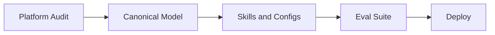
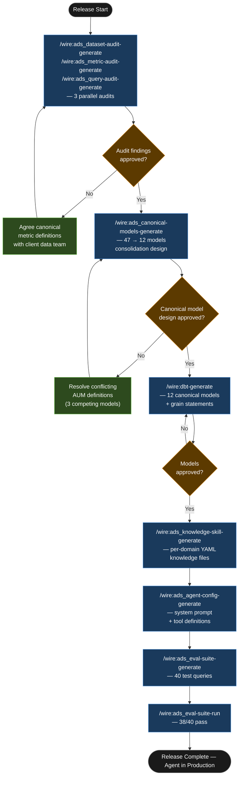

# Tutorial: Agentic Data Stack

This walkthrough traces an `agentic_data_stack` release for a boutique analytics consultancy with an existing, well-built dbt platform. The problem is not the platform — it is the size of the semantic layer, and what that does to an AI agent's ability to answer questions accurately.

## Statement of Work

```
**Rittman Analytics × Croftmere Analytics Ltd**  
**Engagement**: Canonical model design and AI agent knowledge layer  
**Date**: June 2026  
**Type**: Time & materials

### Engagement overview

Croftmere Analytics Ltd has a functioning dbt + BigQuery platform with 47 warehouse models and a Looker semantic layer spanning 312 dimensions and 94 measures. The platform is well-built; the problem is breadth. Financial services metrics such as AUM and period return have multiple conflicting definitions across the model graph, making the platform unreliable for LLM navigation. Rittman Analytics will audit the existing model layer, design a canonical consolidation, build and test 12 replacement models, author knowledge skill YAML files for three primary domains, configure a Claude agent, and run a 40-query eval suite to verify accuracy before handover.

### In scope

- Data audit report: model sprawl analysis across all 47 warehouse models, query pattern analysis from BigQuery query history (90 days) and Looker usage logs, canonical model recommendations
- 12 canonical model designs consolidating the 47 warehouse models, resolving conflicting metric definitions (including three competing AUM definitions and two period return definitions)
- 12 dbt canonical models (SQL + YAML), each with a grain statement and authoritative measure definitions, passing all dbt schema tests
- 3 knowledge skill YAML files: `fund_performance`, `portfolio_attribution`, and `client_retention` — each with grain statement, canonical measures, and 3 example queries
- Claude agent configuration: system prompt, tool definitions, financial services guardrails (source citation, domain boundary enforcement)
- Eval suite: 40 test queries with expected results and tolerance definitions, plus CI runner script wired to dbt Cloud PR job
- Eval run report: pass rate, failure analysis, documented remediation for any failures

### Out of scope

- Changes to existing warehouse models — canonical models are additive; no existing models are modified or retired as part of this engagement
- Looker dashboard development or LookML changes
- Real-time or streaming data infrastructure
- Any client-facing AI product or interface — the knowledge layer and agent configuration are internal tooling

### Timeline

| Days | Work |
|------|------|
| Days 1–3 | Data audit: dataset audit, metric audit, query audit (3 parallel agents); audit review with client data engineering lead |
| Days 4–6 | Canonical model design (47 → 12 consolidation); design review with data engineering lead and head of analytics |
| Days 7–9 | dbt canonical model build (12 models + YAML); knowledge skill YAML files for 3 domains |
| Day 10 | Agent configuration (system prompt, tool definitions, guardrails); eval suite generation (40 queries) |
| Days 11–12 | Eval suite run; failure analysis and remediation; handover documentation |

### Key assumptions

- BigQuery query history is available and accessible for at least the preceding 90 days
- Looker usage analytics are accessible to Rittman Analytics during the audit phase
- Croftmere's lead analytics engineer is available for a minimum 2-hour working session during the canonical model design review (Days 4–6)
- Anthropic API key is provided by client before Day 10
- Client accepts that up to 2 failing eval queries at delivery is within acceptable tolerance, provided root causes are documented and remediation is specified

### Acceptance criteria

- All 12 canonical dbt models pass dbt schema tests on first submission to the client's dbt Cloud environment
- Eval suite achieves a minimum pass rate of 38/40 (95%) on the final run
- All 3 knowledge skill YAML files reviewed and approved by the client's lead analytics engineer before handover
- Agent configuration produces correct, cited output for all 5 acceptance test queries agreed with the client at engagement start
```


## What is an Agentic Data Stack release?

Accuracy failures in AI analytics agents almost always have the same root cause: model sprawl and conflicting metric definitions. When a warehouse has 47 models with 3 different implementations of the same metric — "assets under management", say, computed slightly differently in three places for three historical reasons — a language model has no reliable way to know which to use. It will pick one. Sometimes it picks correctly. Often it does not, and the error is invisible unless someone checks the SQL by hand.

The agentic_data_stack release type addresses this directly. It does not start with the agent configuration. It starts with an audit: which models are overlapping, which metrics conflict, which explores are actually used. From that audit comes a canonical model design — typically 10 to 15 models replacing the previous sprawl — with single ownership, documented grain, and authoritative metric definitions. Only then are knowledge skills written, the agent configured, and an eval suite run.

The eval suite is the most important artifact in the release. Every domain gets a YAML question-answer file — minimum ten questions each — and a CI runner script that checks accuracy against every schema change. Anthropic documented accuracy falling from 95% to 65% within a month without active eval maintenance. The eval suite, wired into CI, is what prevents that slide. The audit and design phases are auto-delegated to the `agentic-data-stack-developer` specialist agent. Review commands stay in the main session.

### High-Level Process



## Engagement overview

| | |
|-|-|
| **Client** | Croftmere Analytics Ltd |
| **Engagement** | Natural language querying for financial services analytics platform |
| **Staff** | 10 analysts + data engineers |
| **Stack** | BigQuery, dbt Cloud, Looker, Claude (Anthropic API) |
| **Release type** | `agentic_data_stack` |
| **Release ID** | `01-croftmere-ads` |

Croftmere's financial services clients are asking for natural language querying across fund performance, client sector analysis, and churn metrics. The existing platform is solid: 47 warehouse models, Looker semantic layer with 312 dimensions and 94 measures. The problem is precisely that breadth. A language model navigating 312 dimensions without guidance will hallucinate metric definitions — particularly in financial services, where "AUM" or "period return" can mean different things depending on which model you land in. The goal is not to replace the platform. It is to make a focused, governed subset of it reliably queryable by a language model.

## Deliverables

| Deliverable | Format |
|---|---|
| Dataset audit report | Overlap analysis across all 47 models, query usage data from Looker |
| Canonical model design | Consolidation from 47 to 12 models, single-owner metric definitions |
| dbt canonical models | 12 SQL models with grain statements and YAML descriptions |
| Knowledge skill YAML files | Per-domain reference files colocated in the dbt project |
| Agent configuration | System prompt, tool definitions, guardrails |
| Eval suite | 40 test queries, expected results, CI runner script |

## Tutorial Playbook

The diagram below is the delivery playbook for this tutorial's scenario. In a live engagement, [`/wire:playbook-generate`](../reference/commands#session-and-management-commands) generates this as a Mermaid-format delivery plan — dependency order, team assignments, and target dates tailored to the specific release.



## Walkthrough

### Engagement setup

:::info[First release in this repository?]

If this is the first release created in a git repository, `/wire:new` will first take you through the steps to set up the overall client engagement — naming the client, setting the engagement context, and configuring any integrations — before scaffolding the release itself. See [Setting up a new engagement](https://docs.rittmananalytics.com/en/latest/docs/getting-started/engagements-releases#setting-up-a-new-engagement) for further details.

:::

```
/wire:new
→ Client: Croftmere Analytics Ltd
→ Engagement name: croftmere-ads
→ Release type: agentic_data_stack
→ Release ID: 01-croftmere-ads
→ .wire/releases/01-croftmere-ads/status.md created
  6 artifact groups across 5 phases, all at not_started
```

:::info[Issue tracking and document sync]

Wire can sync artifact progress to [Jira](../advanced/issue-tracking#jira-integration) or [Linear](../advanced/issue-tracking#linear-integration) as each generate, validate, and review step completes. With the Jira integration, you can choose between one sub-task per lifecycle step (each moving through its own workflow states) or one ticket per artifact that transitions between issue statuses. Wire can create the Epic and issue hierarchy for you when you run `/wire:new`, or link to an existing one you have already set up.

Generated artifacts can also be replicated to [Confluence](../advanced/document-store#confluence) or [Notion](../advanced/document-store#notion) for client review — review commands pull comments and edits made in the document store back as context before gathering sign-off.

Both integrations are optional. Configure the [Atlassian](../reference/mcp-servers#atlassian), [Linear](../reference/mcp-servers#linear), or [Notion](../reference/mcp-servers#notion) MCP servers in `.claude/settings.json` to enable them.

:::


### Phase 1 — Audit

```
/wire:ads-audit-all 01-croftmere-ads
→ [auto-delegated to agentic-data-stack-developer — 3 parallel audit agents]
```

:::info[Auto-delegation]

When you see `-> [auto-delegated to X agent]`, the main session has routed that command to a [specialist subagent](../advanced/wire-agents#auto-delegation-on-individual-commands) automatically — no extra steps needed. The specialist runs with a focused brief rather than the full engagement context, which typically produces sharper domain-specific output. Review commands (`*-review`) always stay in the main session and require your direct input.

:::

The command dispatches three concurrent audit agents: dataset audit, metric audit, and query audit. Each reads the BigQuery information schema, the dbt manifest JSON, and Looker query history for the preceding 90 days. The combined findings surface a clear picture of the platform's governance state.

```
Dataset audit — 47 warehouse models analysed

  Overlap findings:
    14 models contain overlapping metric definitions
    3 separate definitions of "AUM" across:
      - fund_aum_fct           (market value, end-of-day)
      - client_portfolio_fct   (book cost + unrealised gain, mid-day)
      - total_assets_view      (regulatory definition, monthly snapshot)
    2 separate definitions of "period_return":
      - fund_performance_fct   (time-weighted, benchmark-adjusted)
      - client_returns_dim     (simple return, not benchmark-adjusted)

  Usage findings:
    8 models have 0 queries in the last 90 days (Looker history)
    6 explores account for 91% of all Looker queries
    Top explore: fund_performance (38% of queries)

  Recommendation:
    Consolidate to 12 canonical models covering the 6 primary explore patterns.
    Retire 8 unused models. Agree single canonical AUM definition with data team.
```

```
/wire:ads_dataset-audit-validate 01-croftmere-ads → PASS
/wire:ads_dataset-audit-review 01-croftmere-ads
→ Approved by Croftmere data engineering lead, 2026-06-08
→ Decision: canonical AUM = market value, end-of-day (regulatory reporting standard)
→ Decision: period_return = time-weighted, benchmark-adjusted (fund_performance_fct definition)
```

### Phase 2 — Canonical model design

```
/wire:ads_canonical-models-generate 01-croftmere-ads
→ [auto-delegated to agentic-data-stack-developer]
```

The agent designs the consolidation: 47 models reducing to 12, grouped by the six primary explore patterns. The consolidation logic is explicit in the design document — each canonical model lists the source models it replaces, the agreed grain, and the authoritative metric definitions.

The most significant consolidation: `fund_performance_fct` replaces three overlapping models. It adopts the time-weighted, benchmark-adjusted return definition (agreed in the audit review) and adds a `calculation_method` metadata column so downstream users can see which regulatory standard was applied to a given row.

```
Canonical model consolidation — 47 → 12

  fund_performance_fct       replaces: fund_aum_fct, fund_performance_fct (v1), 
                                        fund_benchmark_comparison
  client_portfolio_fct       replaces: client_portfolio_fct (v1), client_returns_dim,
                                        client_aum_daily
  sector_exposure_fct        replaces: sector_exposure_v2, sector_weights_fct
  client_churn_fct           replaces: client_churn_v1, client_churn_v2_pilot
  ...
  
  8 models retired (0 query usage, no downstream dependencies confirmed)
  Grain statements agreed for all 12 canonical models.
```

```
/wire:ads_canonical-models-validate 01-croftmere-ads → PASS
/wire:ads_canonical-models-review 01-croftmere-ads
→ Approved by data engineering lead + head of analytics, 2026-06-10
→ Decision: client_churn_fct uses 180-day inactivity window (not 90-day)
```

### Phase 3 — Build

```
/wire:dbt-generate 01-croftmere-ads
→ [auto-delegated to dbt-developer]
```

The `dbt-developer` agent generates all 12 canonical models. Each has a YAML description that includes a grain statement — precisely one sentence describing what a row represents — and the canonical measure definitions. This is not documentation for humans alone. The grain statements feed directly into the knowledge skill YAML files in the next phase.

A typical model YAML entry:

```yaml
models:
  - name: fund_performance_fct
    description: >
      One row per fund per business day. Grain: fund_id × date_day.
      Canonical measures: total_aum (market value, end-of-day, GBP),
      period_return_pct (time-weighted, gross of fees, benchmark-adjusted),
      benchmark_delta_bps (period_return_pct minus benchmark_return_pct, in basis points).
      Source of truth for all fund performance reporting. Replaces fund_aum_fct,
      fund_performance_fct_v1, and fund_benchmark_comparison.
    config:
      materialized: incremental
      unique_key: fund_performance_pk
```

```
/wire:dbt-validate 01-croftmere-ads → PASS
/wire:dbt-review 01-croftmere-ads → Approved 2026-06-12
```

#### Knowledge skills

```
/wire:ads_knowledge-skill-generate 01-croftmere-ads
→ [auto-delegated to agentic-data-stack-developer]
```

The agent generates one YAML knowledge file per domain, written directly into the dbt project alongside the mart models. A representative excerpt from `fund_performance.yaml`:

```yaml
domain: fund_performance
canonical_model: fund_performance_fct
grain: fund_id × date_day
description: >
  Fund-level performance data at daily grain. Use this domain for questions about
  AUM levels, period returns, and benchmark comparison. Do not use client_portfolio_fct
  for fund-level aggregations — it is scoped to client holdings, not fund totals.
measures:
  total_aum:
    definition: Market value of all assets in the fund, end-of-day, GBP
    sql: SUM(market_value_gbp)
  period_return_pct:
    definition: Time-weighted return, gross of fees, benchmark-adjusted
    sql: AVG(period_return_pct)
  benchmark_delta_bps:
    definition: period_return_pct minus benchmark_return_pct, in basis points
    sql: AVG(benchmark_delta_bps)
example_queries:
  - question: "What was the total AUM across all funds at end of Q1 2026?"
    sql: >
      SELECT SUM(total_aum) FROM fund_performance_fct
      WHERE date_day = '2026-03-31'
  - question: "Which funds outperformed their benchmark last quarter?"
    sql: >
      SELECT fund_name, AVG(benchmark_delta_bps) AS avg_delta
      FROM fund_performance_fct
      WHERE date_day BETWEEN '2026-01-01' AND '2026-03-31'
      GROUP BY fund_name HAVING avg_delta > 0
      ORDER BY avg_delta DESC
```

#### Agent configuration

```
/wire:ads_agent-config-generate 01-croftmere-ads
→ [auto-delegated to agentic-data-stack-developer]
```

The agent produces the Claude configuration file: system prompt, one tool definition per knowledge skill domain (6 tools in total), and explicit guardrails. The guardrails are non-negotiable in a financial services context: the agent must cite the knowledge skill it used for every answer, must never access raw source tables directly, and must refuse requests that require combining domains in ways not covered by the example queries without flagging the limitation.

### Phase 4 — Validation

```
/wire:ads_eval-suite-generate 01-croftmere-ads
→ [auto-delegated to agentic-data-stack-developer]
```

40 test queries across 6 domains, with expected results and tolerance definitions. Three representative entries:

```yaml
- id: FP-01
  domain: fund_performance
  question: "What was total AUM across all funds on 31 March 2026?"
  expected_value: 2847000000
  tolerance_pct: 0.1
  expected_knowledge_skill: fund_performance

- id: SA-07
  domain: sector_exposure
  question: "Which client sectors had the highest churn rate in H1 2025?"
  expected_top_sector: financial_services
  tolerance: exact_rank_1
  expected_knowledge_skill: client_churn

- id: FP-14
  domain: fund_performance
  question: "What was the average benchmark delta in basis points across all equity funds in Q4 2025?"
  expected_value: 47
  tolerance_bps: 5
  expected_knowledge_skill: fund_performance
```

```
/wire:ads_eval-suite-run 01-croftmere-ads

  Results: 38/40 PASS  (95%)

  Failures:
    FP-09  FAIL — date range edge case: "last financial year" interpreted as
                   calendar year 2025, not UK tax year (Apr 2024 – Mar 2025).
                   Remediation: add financial_year_start clarification to
                   fund_performance knowledge skill.

    CP-03  FAIL — currency normalisation: USD-denominated holdings not
                   converted to GBP before aggregation. fund_performance_fct
                   stores market_value_gbp; client_portfolio_fct stores
                   market_value in original currency.
                   Remediation: add currency normalisation note and example
                   query to client_portfolio knowledge skill.

  Both failures documented. Remediation estimated at 2 hours.
  CI runner script configured — eval runs on every dbt model PR.
```

Both failures are informative rather than systemic. The date range edge case surfaces a UK financial year convention that needs one additional example query in the knowledge skill YAML. The currency normalisation issue reveals a schema inconsistency between two models that the audit did not flag — the canonical model design assumed USD-denominated holdings were already converted, which they are not in `client_portfolio_fct`. Both are documented with named owners and estimated remediation time before the launch gate review.

## What was produced

| Artifact | Detail |
|---|---|
| Dataset audit report | 47 models analysed, 14 overlap findings, 8 unused models identified |
| Canonical model design | Consolidation plan: 47 → 12 models, agreed metric definitions |
| dbt canonical models | 12 SQL models, each with grain statement and YAML descriptions |
| Knowledge skill files | 6 domain YAML files colocated in the dbt project alongside mart models |
| Agent configuration | System prompt, 6 tool definitions, financial services guardrails |
| Eval suite | 40 test queries, 38/40 pass, CI runner wired to dbt Cloud PR job |
| `decisions.md` | 9 entries: canonical AUM definition, period_return method, churn window, currency normalisation flag |
