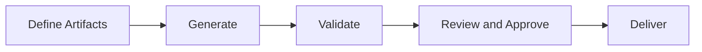
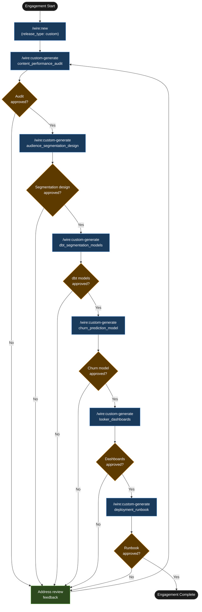

# Tutorial: Custom Release — Summit Digital Media Content Analytics

## Statement of Work

```
**Rittman Analytics × Summit Digital Media**
**Engagement**: Content Analytics, Audience Segmentation, and Churn Prediction
**Date**: June 2026
**Type**: Fixed price

### Engagement overview
Summit Digital Media operates a subscription VOD service with 150,000 active subscribers. Monthly churn has risen from 2.1% to 3.4% over two quarters, and the business has no analytics on which content drives retention — audience segmentation is done manually in spreadsheets each month. Rittman Analytics is engaged to deliver a content performance audit, an RFM-based audience segmentation model, a Vertex AI churn prediction model with Braze CRM integration, and Looker dashboards covering content performance and subscriber health. The work spans advisory analysis, dbt development, and ML model deployment — no single Wire release type covers the full scope, so this engagement uses the `custom` release type.

### In scope
- Content performance audit: analysis of title-level watch completion, retention correlation, and churn drivers from BigQuery event data; findings report with top 5 actionable recommendations
- Audience segmentation model: RFM-based framework with 5 named segments (Champions, Loyal, At-Risk, Hibernating, Lost); dbt models `stg_subscriptions__events`, `subscriber_rfm_fct`, `subscriber_segment_current` in the client's existing dbt Cloud project
- Churn prediction model: Vertex AI AutoML tabular model trained on 90-day subscriber behaviour; daily batch scoring writing `churn_probability_score` to BigQuery; Braze "Win-Back" segment populated via REST API for subscribers with `churn_probability_score > 0.70`
- Looker dashboards: Content Performance dashboard and Churn Risk Monitor dashboard
- Deployment runbook covering BigQuery, dbt Cloud, Vertex AI pipeline, and Braze segment sync

### Out of scope
- Email campaign creation or management in Braze — the integration delivers subscribers into the Win-Back segment; campaign content is the client's responsibility
- A/B testing framework for content or campaign variants
- Content recommendation engine — this requires separate ML infrastructure and is explicitly deferred
- Real-time or near-real-time streaming — daily batch scoring is the agreed model for the churn use case

### Timeline
**Week 1** — Content performance audit (generate, validate, review with Head of Content and VP Engineering); audience segmentation design (generate, validate, review); dbt segmentation models (`stg_subscriptions__events`, `subscriber_rfm_fct`, `subscriber_segment_current`) generated, tested, and approved.

**Week 2** — Churn prediction model: Vertex AI AutoML training dataset view, model training, evaluation against held-out test set (AUC target ≥ 0.78); Braze integration spec and Cloud Scheduler pipeline; model review with VP Engineering and Head of Data.

**Week 3** — Looker dashboards (Content Performance, Churn Risk Monitor); deployment runbook; UAT with product analyst; handover.

### Key assumptions
- BigQuery viewing history is available for a minimum of 12 months — shorter history will reduce churn model feature quality and may affect AUC
- Braze API access (REST API key with `/users/track` write permission) is confirmed before Week 2 begins
- Vertex AI APIs are enabled on Summit's GCP project; Rittman Analytics has sufficient IAM permissions to create and train AutoML tabular models
- Summit's product analyst is available for a 2-hour content audit review in Week 1 and a final UAT session in Week 3
- The churn probability threshold of 0.70 for Braze Win-Back targeting is agreed upfront; it can be adjusted post-delivery but reconfiguring the Cloud Scheduler pipeline after handover is out of scope
- Client accepts that ML model performance (AUC ≥ 0.78 on test set) is reported at handover; ongoing model degradation monitoring is not in scope

### Acceptance criteria
- Content audit findings reviewed and accepted by commercial director, with the top 5 recommendations explicitly acknowledged
- Segmentation model produces the expected 5-segment distribution on a holdout dataset, with no subscribers assigned to "Unclassified" above 2% of the active subscriber base
- Churn model AUC ≥ 0.78 on the held-out test set (threshold agreed upfront; result reported at handover)
- Braze Win-Back segment populated with the correct subscriber cohort and confirmed by a Braze admin
- All Looker dashboards reviewed and approved by the product analyst with no outstanding data accuracy issues
```


## What is a Custom release?

Most Wire engagements map cleanly to a standard release type: `full_platform` for end-to-end data platform builds, `dbt_development` for transformation-only work, `droughty` for schema-first audits. Some do not. When the SoW defines a specific set of deliverables that cuts across those categories — or where the deliverables are fundamentally advisory rather than structural — the `custom` release type gives you the Wire infrastructure without forcing the work into the wrong shape. You define the artifacts. Wire provides status tracking, the `decisions.md` log, agent delegation, Jira/Linear integration, and the standard generate/validate/review lifecycle for each artifact you name.

Every custom artifact passes through the same three-gate sequence as any standard Wire release. A generate step produces the artifact, a validate step runs automated checks against it, and a review step surfaces it to a named stakeholder for approval before work continues downstream. The discipline holds regardless of how bespoke the deliverable is.

### High-Level Process



## Engagement overview

| | |
|-|-|
| **Client** | Summit Digital Media |
| **Industry** | UK independent streaming platform, subscription VOD, ~150k subscribers |
| **Stack** | BigQuery, dbt Cloud, Looker, Vertex AI, Braze CRM |
| **Problem** | Subscriber churn increasing; no content performance analytics; audience segmentation done manually in spreadsheets |
| **Release type** | `custom` |
| **Release ID** | `01-summit-content-analytics` |

Summit operates a subscription VOD service with 150,000 active subscribers. Over the past two quarters, monthly churn has crept from 2.1% to 3.4% — meaningful at their scale, and accelerating. The data team has BigQuery and a working dbt Cloud project, but no analytics on which content actually drives retention. Audience segmentation is done manually each month by a BI analyst exporting to Google Sheets. The engagement scope does not fit any single Wire release type: it spans a content audit (closer to `discovery`), a segmentation model design (closer to `data_model`), dbt development, a Vertex AI model, and Looker dashboards. The custom release type is the right vehicle.

## Deliverables

| Deliverable | Description |
|---|---|
| `content_performance_audit` | Analysis of which titles drive watch completion, retention, and churn — sourced from BigQuery event data and Looker usage logs |
| `audience_segmentation_design` | RFM-style segmentation design: segment definitions, assignment logic, and acceptance criteria |
| `dbt_segmentation_models` | Three dbt models implementing the segmentation design |
| `churn_prediction_model` | Vertex AI AutoML tabular model trained on 90-day subscriber behaviour, with Braze integration |
| `looker_dashboards` | Content performance and subscriber health dashboards |
| `deployment_runbook` | Step-by-step runbook for the full stack: BigQuery, dbt Cloud, Vertex AI pipeline, Braze segment sync |

## Tutorial Playbook

The diagram below is the delivery playbook for this tutorial's scenario. In a live engagement, [`/wire:playbook-generate`](../reference/commands#session-and-management-commands) generates this as a Mermaid-format delivery plan — dependency order, team assignments, and target dates tailored to the specific release.



## Walkthrough

### Step 1 — Create the release

:::info[First release in this repository?]

If this is the first release created in a git repository, `/wire:new` will first take you through the steps to set up the overall client engagement — naming the client, setting the engagement context, and configuring any integrations — before scaffolding the release itself. See [Setting up a new engagement](https://docs.rittmananalytics.com/en/latest/docs/getting-started/engagements-releases#setting-up-a-new-engagement) for further details.

:::

```
/wire:new
→ Client: Summit Digital Media
→ Engagement name: summit_content_analytics
→ Release type: custom
→ Release ID: 01-summit-content-analytics
→ Branch: feature/summit-content-analytics
→ Invoking /wire:custom-release-define...
→ Reading source documents: SoW_Summit_Digital_Media.pdf, kickoff_notes.md
→ Extracting deliverables...
```

:::info[Issue tracking and document sync]

Wire can sync artifact progress to [Jira](../advanced/issue-tracking#jira-integration) or [Linear](../advanced/issue-tracking#linear-integration) as each generate, validate, and review step completes. With the Jira integration, you can choose between one sub-task per lifecycle step (each moving through its own workflow states) or one ticket per artifact that transitions between issue statuses. Wire can create the Epic and issue hierarchy for you when you run `/wire:new`, or link to an existing one you have already set up.

Generated artifacts can also be replicated to [Confluence](../advanced/document-store#confluence) or [Notion](../advanced/document-store#notion) for client review — review commands pull comments and edits made in the document store back as context before gathering sign-off.

Both integrations are optional. Configure the [Atlassian](../reference/mcp-servers#atlassian), [Linear](../reference/mcp-servers#linear), or [Notion](../reference/mcp-servers#notion) MCP servers in `.claude/settings.json` to enable them.

:::


With `release_type: custom`, [`/wire:new`](../reference/commands#session-and-management-commands) immediately invokes `/wire:custom-release-define`. Wire reads the SoW and kick-off notes, extracts six deliverables, and presents a proposal table before writing anything:

```
Custom release proposal — 01-summit-content-analytics
──────────────────────────────────────────────────────────────────────────────
Deliverable                   Handling    Command
content_performance_audit     Custom 🔧   /wire:custom-generate content_performance_audit
audience_segmentation_design  Custom 🔧   /wire:custom-generate audience_segmentation_design
dbt_segmentation_models       Custom 🔧   /wire:custom-generate dbt_segmentation_models
churn_prediction_model        Custom 🔧   /wire:custom-generate churn_prediction_model
looker_dashboards             Custom 🔧   /wire:custom-generate looker_dashboards
deployment_runbook            Custom 🔧   /wire:custom-generate deployment_runbook

Accept this proposal? [Y/n]
```

After acceptance, Wire writes fully-specified generate/validate/review workflow specs for each deliverable into `.wire/releases/01-summit-content-analytics/custom-commands/` and scaffolds `status.md` with all six artifacts at `not_started`.

```
/wire:start
→ Select: 01-summit-content-analytics

Release: 01-summit-content-analytics (custom)
Client:  Summit Digital Media

Artifacts — 6 total, 6 at not_started
  [ ] content_performance_audit       not_started
  [ ] audience_segmentation_design    not_started
  [ ] dbt_segmentation_models         not_started
  [ ] churn_prediction_model          not_started
  [ ] looker_dashboards               not_started
  [ ] deployment_runbook              not_started
```

### Step 2 — Content performance audit

```
/wire:custom-generate content_performance_audit 01-summit-content-analytics
→ [auto-delegated to data-quality-engineer agent]
→ Analysing BigQuery event data, Looker usage logs, dbt test results
→ content_performance_audit.md written
```

:::info[Auto-delegation]

When you see `-> [auto-delegated to X agent]`, the main session has routed that command to a [specialist subagent](../advanced/wire-agents#auto-delegation-on-individual-commands) automatically — no extra steps needed. The specialist runs with a focused brief rather than the full engagement context, which typically produces sharper domain-specific output. Review commands (`*-review`) always stay in the main session and require your direct input.

:::

The `data-quality-engineer` agent is the best fit for an audit task — its remit covers data investigation, metric validation, and surface-level statistical analysis. It queries the BigQuery events table for watch completion rates, cross-references Looker usage data for dashboard query patterns, and produces a structured audit report.

Key findings: 18 titles account for 73% of total watch time across the catalogue. 12 titles have never been completed by more than 2% of viewers who started them — half of those were licensed acquisitions purchased in the last six months. The correlation between completion rate and 30-day subscriber retention is 0.71. Subscribers who complete at least one title in their first seven days have a 14-percentage-point lower 90-day churn rate than those who do not.

```
/wire:custom-validate content_performance_audit 01-summit-content-analytics → PASS
/wire:custom-review content_performance_audit 01-summit-content-analytics
→ Reviewed by Head of Content and VP Engineering
→ Approved — findings align with anecdotal observations from content team
→ Decision: onboarding completion flow to be treated as a priority dependency
```

### Step 3 — Audience segmentation design

```
/wire:custom-generate audience_segmentation_design 01-summit-content-analytics
→ [auto-delegated to data-designer agent]
→ audience_segmentation_design.md written
```

The `data-designer` agent produces an RFM-style segmentation framework adapted for subscription VOD. The three axes: **Recency** (days since last stream event), **Frequency** (stream events per 30-day rolling window), and **Monetary** (subscription tier multiplied by tenure in months — a proxy for lifetime value accrued to date). Five segments are defined:

| Segment | Recency | Frequency | Monetary proxy |
|---|---|---|---|
| Champions | < 7 days | ≥ 8 streams/month | High |
| Loyal | < 14 days | 4–7 streams/month | Medium-High |
| At-Risk | 15–45 days | 1–3 streams/month | Any |
| Hibernating | 46–90 days | < 1 stream/month | Any |
| Lost | > 90 days | 0 | Any |

Segment boundaries are configurable via dbt project variables — the design spec includes a rationale section explaining why hard-coding them into SQL would make tuning painful after the first model run.

```
/wire:custom-validate audience_segmentation_design 01-summit-content-analytics → PASS
/wire:custom-review audience_segmentation_design 01-summit-content-analytics
→ Approved by Head of Data and VP Engineering, with one change:
→ Decision: "Lost" segment capped at 180 days — beyond that, subscribers are
   excluded from campaign targeting entirely and tracked separately as churned
```

### Step 4 — dbt segmentation models

```
/wire:custom-generate dbt_segmentation_models 01-summit-content-analytics
→ [auto-delegated to dbt-developer agent]
→ 3 models generated, schema.yml written
```

Three models in the `models/subscriber_segments/` directory. The segment assignment logic in `subscriber_segment_current.sql`:

```sql
with rfm_scored as (
    select
        subscriber_id,
        days_since_last_stream                          as recency_days,
        stream_events_last_30d                          as frequency_score,
        subscription_tier_value * tenure_months         as monetary_proxy,

        case
            when days_since_last_stream <= 7
             and stream_events_last_30d >= 8
             and (subscription_tier_value * tenure_months) >= {{ var('monetary_high_threshold') }}
                then 'Champions'
            when days_since_last_stream <= 14
             and stream_events_last_30d between 4 and 7
                then 'Loyal'
            when days_since_last_stream between 15 and 45
             and stream_events_last_30d between 1 and 3
                then 'At-Risk'
            when days_since_last_stream between 46 and 180
             and stream_events_last_30d < 1
                then 'Hibernating'
            when days_since_last_stream > 180
                then 'Lost'
            else 'Unclassified'
        end                                             as subscriber_segment
    from {{ ref('subscriber_rfm_fct') }}
)

select * from rfm_scored
```

```
/wire:custom-validate dbt_segmentation_models 01-summit-content-analytics → PASS
/wire:custom-review dbt_segmentation_models 01-summit-content-analytics
→ Approved by Head of Data, 2026-06-09
```

### Step 5 — Churn prediction model

```
/wire:custom-generate churn_prediction_model 01-summit-content-analytics
→ [auto-delegated to agentic-data-stack-developer agent]
→ churn_prediction_model.md written (Vertex AI config + Braze integration spec)
```

The `agentic-data-stack-developer` agent is the closest fit for a Vertex AI integration — its remit covers model configurations, evaluation suites, and agent-adjacent data stack components. It produces the Vertex AI AutoML tabular model specification: a training dataset view pulling 90-day subscriber behaviour features from the existing dbt warehouse models, a daily batch scoring pipeline writing `churn_probability_score` back to a BigQuery output table, and a Braze integration spec.

The Braze connection: subscribers with `churn_probability_score > 0.70` are added to a "Win-Back" Braze segment via the Braze API each morning after the scoring pipeline completes. The integration uses Braze's REST API `/users/track` endpoint with a daily Cloud Scheduler trigger. The spec includes the feature set used for scoring (17 features, including title completion rate, days since first stream, segment transitions over 60 days, and subscription tier change history) and a model evaluation plan with a held-out test set.

```
/wire:custom-validate churn_prediction_model 01-summit-content-analytics → PASS
/wire:custom-review churn_prediction_model 01-summit-content-analytics
→ Approved by VP Engineering and Head of Data
→ Decision: churn_probability threshold for Braze trigger set at 0.70
   (reviewed against false-positive rate at multiple thresholds; 0.70 was
   the lowest threshold that kept campaign send volume within budget)
```

### Step 6 — Status check mid-engagement

With five of six artifacts in progress, [`/wire:status`](../reference/commands#session-and-management-commands) gives a clean picture of where the engagement stands:

```
/wire:status 01-summit-content-analytics

Release: 01-summit-content-analytics (custom)
Client:  Summit Digital Media

Artifacts
  [x] content_performance_audit       approved    2026-06-04
  [x] audience_segmentation_design    approved    2026-06-06
  [x] dbt_segmentation_models         approved    2026-06-09
  [x] churn_prediction_model          approved    2026-06-10
  [ ] looker_dashboards               in_progress
  [ ] deployment_runbook              not_started

Open decisions: 3
  D-1: Onboarding completion flow treated as priority dependency
  D-2: Lost segment capped at 180 days
  D-3: Braze trigger threshold at churn_probability 0.70

Next action: complete looker_dashboards generate → validate → review, then
             generate deployment_runbook
```

## What was produced

| Artefact | Format |
|---|---|
| Content performance audit | `artifacts/content_performance_audit.md` — catalogue analysis, retention correlations |
| Audience segmentation design | `artifacts/audience_segmentation_design.md` — RFM framework, 5 segment definitions |
| dbt segmentation models | 3 SQL models: `stg_subscriptions__events`, `subscriber_rfm_fct`, `subscriber_segment_current` |
| Churn prediction model spec | `artifacts/churn_prediction_model.md` — Vertex AI config, feature set, Braze integration |
| Looker dashboards | Content performance dashboard + subscriber health dashboard |
| Deployment runbook | Step-by-step runbook: BigQuery, dbt Cloud, Vertex AI pipeline, Braze sync |
| `decisions.md` | 3 decisions recorded — onboarding priority, segment boundary, Braze threshold |

The custom release type produced a coherent, tracked engagement from a set of deliverables that spans four different technical domains. Wire's infrastructure — status tracking, the decisions log, agent routing, and the review gates — held regardless of how bespoke the artifacts were. The SoW defined the shape of the work; Wire managed the lifecycle.
