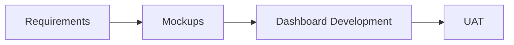
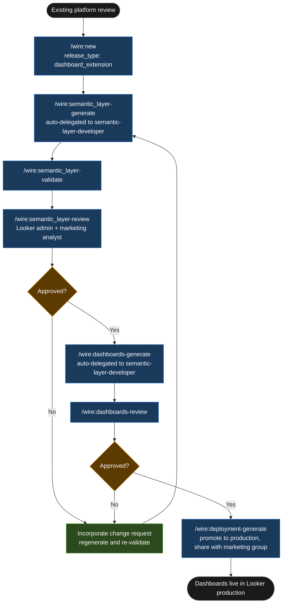

# Tutorial: Dashboard Extension

## Statement of Work

```
**Rittman Analytics × Foxwood Commerce Ltd**
**Engagement**: Marketing Dashboard Expansion
**Date**: May 2026
**Type**: Time and materials

### Engagement overview

Foxwood Commerce Ltd has a functioning BigQuery + dbt + Looker platform, with Fivetran connectors for Google Ads, Meta Ads, Klaviyo, and GA4 running for over a year. The marketing team currently reconciles performance data from each platform separately in spreadsheets. Rittman Analytics is engaged to build three new LookML explores and corresponding Looker dashboards — paid acquisition, email performance, and organic channel performance — over data already in the warehouse. No new connectors or dbt models are required.

### In scope

- Three new LookML explores:
  - `paid_acquisition` — unified Google Ads and Meta Ads spend data, including a `cross_channel_roas` measure
  - `email_performance` — Klaviyo campaigns and flows: `open_rate`, `click_rate`, `revenue_per_email`, `unsubscribe_rate`
  - `organic_performance` — GA4 sessions and engagement: `count_sessions`, `engagement_rate`, `sum_goal_completions` by channel grouping
- LookML views for each underlying dbt model referenced by the three explores
- Three Looker dashboard definition files (one per explore), in LookML dashboard format
- Deployment runbook: promotion to the Looker production branch and share settings for the marketing group
- All new LookML consistent with naming conventions detected in the existing Looker project

### Out of scope

- New Fivetran connectors of any kind
- Changes to existing dbt staging, integration, or warehouse models
- Looker administration setup (groups, user provisioning, permission settings)
- Historical data backfill beyond what is already in BigQuery

### Timeline

| Day | Activity |
|-----|----------|
| Day 1 | Review existing LookML project; generate and validate three new explores ([`/wire:semantic_layer-generate`](../reference/commands#development--semantic-layer-and-orchestration), [`/wire:semantic_layer-validate`](../reference/commands#development--semantic-layer-and-orchestration)) |
| Day 2 | Generate three dashboard definitions; review session with marketing analyst ([`/wire:dashboards-generate`](../reference/commands#development--semantic-layer-and-orchestration), [`/wire:dashboards-review`](../reference/commands#development--semantic-layer-and-orchestration)) |
| Day 3 | Incorporate review feedback; promote to Looker production branch; share dashboards with marketing group |

### Key assumptions

- Existing Looker instance is on Looker 23.x or later; LookML validation runs cleanly against the current production branch before work starts
- Existing LookML uses standard naming conventions with no custom framework; any deviations will be flagged at the start of Day 1
- Marketing analyst (Dani Okafor) is available for a 1-hour review session on Day 2
- Google Ads, Meta Ads, Klaviyo, and GA4 Fivetran connectors are confirmed running with at least 90 days of history in BigQuery

### Acceptance criteria

- All three explores pass `/wire:semantic_layer-validate` with no errors (zero findings across field naming, measure completeness, `${TABLE}.column` references, `value_format_name` usage, and `drill_fields` on count measures)
- The `cross_channel_roas` measure is verified against a known test period by the marketing analyst before production deployment
- All three dashboards are visible in Looker production and shared with the `marketing_team` Looker group

---
```


## What is a Dashboard Extension release?

The `dashboard_extension` release type augments an existing Looker instance with new LookML explores and dashboards. No pipeline connectors, no dbt models, no warehouse changes — the semantic layer and dashboards are the entire scope. The `semantic-layer-developer` agent reads the existing LookML project before generating anything new, establishing what naming conventions, explore patterns, and measure definitions are already in use. New work must be consistent with what is there.

Use this release type when the client already has a functioning platform but needs new dashboard coverage over data that has already landed in the warehouse. The existing dbt models are deployed, the Fivetran connectors are running, and the only gap is LookML and the dashboards on top of it. Starting from `semantic_layer-generate` rather than `requirements-generate` reflects that scope precisely.

### High-Level Process



## Engagement overview

| | |
|-|-|
| **Client** | Foxwood Commerce Ltd |
| **Engagement** | Marketing Dashboard Expansion |
| **Stack** | BigQuery, dbt Cloud, Looker, Fivetran |
| **Release type** | `dashboard_extension` |
| **Release ID** | `01-foxwood-marketing-dashboards` |
| **Sources in scope** | Google Ads, Meta Ads, Klaviyo, GA4 (all existing Fivetran connectors) |

Foxwood Commerce is a UK direct-to-consumer fashion brand with online-only retail at roughly £15m annual revenue. The analytics team built product and order dashboards in Looker 18 months ago, backed by a dbt + BigQuery stack. Fivetran connectors for Google Ads, Meta Ads, Klaviyo, and GA4 have been running for over a year. The marketing team has been downloading raw reports from each platform separately and reconciling them in spreadsheets. The brief: three new dashboards — paid acquisition performance, email marketing performance, and organic channel performance. No new connectors. No new dbt models. The warehouse data is already there.

## Deliverables

| Artefact | Format | Location |
|---|---|---|
| New LookML views | `.view` files (one per source model) | `lookml/views/` |
| New LookML explores | 3 explores across 2 `.model` file additions | `lookml/models/` |
| Dashboard definitions | LookML dashboard format (3 files) | `lookml/dashboards/` |
| Deployment runbook | Promotion to production branch, share settings | `.wire/releases/01-foxwood-marketing-dashboards/deployment.md` |

dbt models are not in scope. Fivetran connector configuration is not in scope. The release touches only the Looker layer.

## Tutorial Playbook

The diagram below is the delivery playbook for this tutorial's scenario. In a live engagement, [`/wire:playbook-generate`](../reference/commands#session-and-management-commands) generates this as a Mermaid-format delivery plan — dependency order, team assignments, and target dates tailored to the specific release.



## Walkthrough

### Step 1 — Engagement setup

:::info[First release in this repository?]

If this is the first release created in a git repository, `/wire:new` will first take you through the steps to set up the overall client engagement — naming the client, setting the engagement context, and configuring any integrations — before scaffolding the release itself. See [Setting up a new engagement](https://docs.rittmananalytics.com/en/latest/docs/getting-started/engagements-releases#setting-up-a-new-engagement) for further details.

:::

```
/wire:new
→ Client: Foxwood Commerce Ltd
→ Engagement name: foxwood-marketing-dashboards
→ Release type: dashboard_extension
→ Release ID: 01-foxwood-marketing-dashboards
→ .wire/releases/01-foxwood-marketing-dashboards/status.md created
  Artifacts: semantic_layer, dashboards, deployment
  No requirements or data model phase for dashboard_extension releases.
  Start with /wire:semantic_layer-generate.
```

:::info[Issue tracking and document sync]

Wire can sync artifact progress to [Jira](../advanced/issue-tracking#jira-integration) or [Linear](../advanced/issue-tracking#linear-integration) as each generate, validate, and review step completes. With the Jira integration, you can choose between one sub-task per lifecycle step (each moving through its own workflow states) or one ticket per artifact that transitions between issue statuses. Wire can create the Epic and issue hierarchy for you when you run `/wire:new`, or link to an existing one you have already set up.

Generated artifacts can also be replicated to [Confluence](../advanced/document-store#confluence) or [Notion](../advanced/document-store#notion) for client review — review commands pull comments and edits made in the document store back as context before gathering sign-off.

Both integrations are optional. Configure the [Atlassian](../reference/mcp-servers#atlassian), [Linear](../reference/mcp-servers#linear), or [Notion](../reference/mcp-servers#notion) MCP servers in `.claude/settings.json` to enable them.

:::


Copy the client's existing LookML view and model files into `.wire/releases/01-foxwood-marketing-dashboards/requirements/` before generating. The agent needs these to establish naming conventions and avoid clashing with existing explores. A BigQuery schema export for the four new source datasets is also useful here — it confirms column names before the agent writes any `${TABLE}.column` references.

### Step 2 — Generate the semantic layer

```
/wire:semantic_layer-generate 01-foxwood-marketing-dashboards
→ [auto-delegated to semantic-layer-developer agent]
→ Reading existing LookML project...
→ Conventions detected:
    - Explore naming: snake_case, no suffix (e.g. orders, products, customers)
    - Dimension naming: snake_case with type suffix for dates (e.g. order_date)
    - Measure naming: verb_noun pattern (e.g. count_orders, sum_revenue)
    - All monetary measures: type: sum with value_format_name: gbp_0
    - Drill fields defined on all count measures
    - All explores define a label: and description:
→ Generating 3 new explores...
→ semantic_layer artifacts written to .wire/releases/01-foxwood-marketing-dashboards/semantic_layer/
```

:::info[Auto-delegation]

When you see `-> [auto-delegated to X agent]`, the main session has routed that command to a [specialist subagent](../advanced/wire-agents#auto-delegation-on-individual-commands) automatically — no extra steps needed. The specialist runs with a focused brief rather than the full engagement context, which typically produces sharper domain-specific output. Review commands (`*-review`) always stay in the main session and require your direct input.

:::

The agent's first action is to read the existing LookML, not to write anything. Naming conventions extracted from the existing project are applied to all new work. This is what keeps a dashboard extension coherent with the platform the client already has — a new explore that uses different naming patterns or misses a `value_format_name` stands out immediately in Looker's field picker and creates maintenance confusion downstream.

The three explores generated:

**`paid_acquisition`** — joins Google Ads and Meta Ads spend data into a unified cross-channel view. Key measures include `sum_spend`, `sum_clicks`, `sum_impressions`, `sum_conversions`, and `cross_channel_roas`. The ROAS measure:

```lookml
measure: cross_channel_roas {
  label: "Cross-Channel ROAS"
  description: "Total revenue attributed to paid channels divided by total ad spend,
                across Google Ads and Meta Ads combined."
  type: number
  sql: ${sum_attributed_revenue} / NULLIF(${sum_spend}, 0) ;;
  value_format_name: decimal_2
  drill_fields: [campaign_name, channel, sum_spend, sum_attributed_revenue]
}
```

The `NULLIF` guard is applied to every division-based measure — a convention the agent picks up from the existing LookML before writing a single line. The `drill_fields` reference uses the explore's own field list, not a hardcoded string array.

A representative date dimension from the same explore:

```lookml
dimension_group: ad_date {
  label: "Ad Date"
  type: time
  timeframes: [date, week, month, quarter, year]
  datatype: date
  sql: ${TABLE}.ad_date ;;
  drill_fields: [channel, campaign_name, ad_group_name]
}
```

**`email_performance`** — Klaviyo campaigns and flows. Measures: `open_rate`, `click_rate`, `revenue_per_email`, `unsubscribe_rate`. `revenue_per_email` defined as `sum_attributed_revenue / NULLIF(count_delivered, 0)` with `value_format_name: gbp_2`.

**`organic_performance`** — GA4 sessions and engagement. Measures: `count_sessions`, `engagement_rate`, `sum_goal_completions`. A `channel_grouping` dimension uses a `case` expression to bucket GA4 source/medium combinations into `Organic Search`, `Direct`, `Referral`, `Social`, and `Other`.

```
/wire:semantic_layer-validate 01-foxwood-marketing-dashboards
→ [auto-delegated to qa-agent]

  Checking field naming conventions...        PASS
  Checking for orphaned explores...           PASS
  Checking measure definition completeness... PASS
  Checking ${TABLE}.column references...      PASS
  Checking value_format_name usage...         PASS
  Checking drill_fields on count measures...  PASS

→ PASS — 3 explores, 47 dimensions, 31 measures. No findings.
```

### Step 3 — Semantic layer review

```
/wire:semantic_layer-review 01-foxwood-marketing-dashboards
→ [main session]
→ Reviewer 1: Alex Pemberton (Looker admin)
→ Reviewer 2: Dani Okafor (marketing analyst)
→ Feedback from Dani Okafor:
    paid_acquisition explore is missing impression share — we track this in Google Ads
    and it is one of the key metrics the team monitors weekly.
→ Change request: add impression_share dimension and impression_share_lost_rank
  and impression_share_lost_budget measures to paid_acquisition explore.
```

The review surfaces one substantive addition — impression share metrics the marketing analyst uses regularly that were not mentioned in the brief. The agent regenerates the `paid_acquisition` explore with the three new fields, validate reruns cleanly, and the reviewer approves the second pass.

```
→ Regenerating paid_acquisition explore with impression share fields...
/wire:semantic_layer-validate 01-foxwood-marketing-dashboards → PASS
→ Approved by Alex Pemberton and Dani Okafor, 2026-05-08
```

### Step 4 — Generate dashboards

```
/wire:dashboards-generate 01-foxwood-marketing-dashboards
→ [auto-delegated to semantic-layer-developer agent]
→ Generating 3 LookML dashboard definitions...
→ dashboards written to .wire/releases/01-foxwood-marketing-dashboards/dashboards/
```

Three dashboard definition files — one per explore. Each contains four to six tiles covering the primary measures, a date filter wired to the explore's `ad_date` or equivalent date dimension, and a channel or campaign filter. Tile references use the explore name and field path, not hardcoded SQL. This means the dashboards travel cleanly with the LookML when promoted to production.

```
/wire:dashboards-review 01-foxwood-marketing-dashboards
→ Reviewer: Dani Okafor (marketing analyst)
→ Approved 2026-05-09
```

### Step 5 — Deploy to Looker production

```
/wire:deployment-generate 01-foxwood-marketing-dashboards
→ Deployment runbook written.

  Steps:
  1. Create PR from feature/foxwood-marketing-dashboards to production branch
  2. Looker admin reviews LookML validation in Looker IDE
  3. Merge PR — Looker auto-deploys on production branch commit
  4. Share dashboards with marketing_team Looker group
  5. Verify dashboard load times in production (paid_acquisition has a 3-table join —
     confirm BigQuery BI Engine reservation covers the new explores)

/wire:deployment-review 01-foxwood-marketing-dashboards
→ Approved by Alex Pemberton, 2026-05-09
```

## What was produced

| Artefact | Count | Notes |
|---|---|---|
| New LookML explores | 3 | paid_acquisition, email_performance, organic_performance |
| New LookML views | 6 | One per underlying dbt model referenced |
| New measures | 31 | Including cross_channel_roas and revenue_per_email |
| New dimensions | 47 | Including impression share fields added post-review |
| Dashboard definitions | 3 | LookML format, 4–6 tiles each |
| Deployment runbook | 1 | Production branch promotion + share settings |

No dbt models were written. No Fivetran connectors were created or modified. The entire scope was LookML — 84 new fields across three explores, three dashboards, and a deployment runbook. All field naming is consistent with the existing Looker project conventions detected at the start of the `semantic_layer-generate` step.
