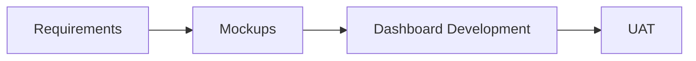
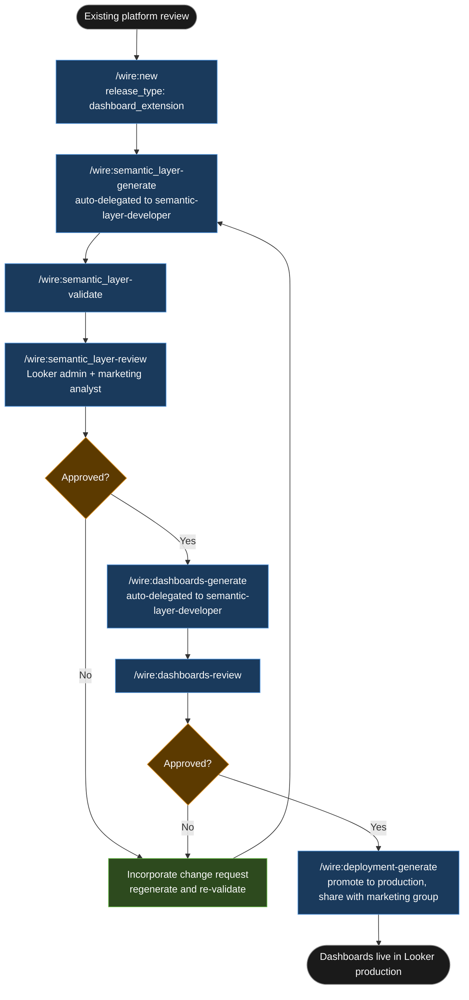

# Tutorial: Dashboard Extension

In this tutorial we follow a three-day engagement for Foxwood Commerce Ltd, a UK direct-to-consumer fashion brand whose BigQuery, dbt and Looker platform has been in place for 18 months and whose marketing team still downloads reports from Google Ads, Meta Ads, Klaviyo and GA4 separately and reconciles them in spreadsheets. The whole of the work is three new explores, three dashboards and a runbook over data that is already in the warehouse. We start with the statement of work, then look at what the release type is for before walking through the five steps in turn.

## Statement of Work

```
**Rittman Analytics × Foxwood Commerce Ltd**
**Engagement**: Marketing Dashboard Expansion
**Date**: May 2026
**Type**: Time and materials

### Engagement overview

Foxwood Commerce Ltd has a functioning BigQuery + dbt + Looker platform, with Fivetran connectors for Google Ads, Meta Ads, Klaviyo, and GA4 running for over a year. The marketing team currently reconciles performance data from each platform separately in spreadsheets. Rittman Analytics is engaged to build three new LookML explores and corresponding Looker dashboards — paid acquisition, email performance, and organic channel performance — over data already in the warehouse. No new connectors or dbt models are required.

### In scope

- Three new LookML explores:
  - `paid_acquisition` — unified Google Ads and Meta Ads spend data, including a `cross_channel_roas` measure
  - `email_performance` — Klaviyo campaigns and flows: `open_rate`, `click_rate`, `revenue_per_email`, `unsubscribe_rate`
  - `organic_performance` — GA4 sessions and engagement: `count_sessions`, `engagement_rate`, `sum_goal_completions` by channel grouping
- LookML views for each underlying dbt model referenced by the three explores
- Three Looker dashboard definition files (one per explore), in LookML dashboard format
- Deployment runbook: promotion to the Looker production branch and share settings for the marketing group
- All new LookML consistent with naming conventions detected in the existing Looker project

### Out of scope

- New Fivetran connectors of any kind
- Changes to existing dbt staging, integration, or warehouse models
- Looker administration setup (groups, user provisioning, permission settings)
- Historical data backfill beyond what is already in BigQuery

### Timeline

| Day | Activity |
|-----|----------|
| Day 1 | Review existing LookML project; generate and validate three new explores ([`/wire:semantic_layer-generate`](../reference/commands#development--semantic-layer-and-orchestration), [`/wire:semantic_layer-validate`](../reference/commands#development--semantic-layer-and-orchestration)) |
| Day 2 | Generate three dashboard definitions; review session with marketing analyst ([`/wire:dashboards-generate`](../reference/commands#development--semantic-layer-and-orchestration), [`/wire:dashboards-review`](../reference/commands#development--semantic-layer-and-orchestration)) |
| Day 3 | Incorporate review feedback; promote to Looker production branch; share dashboards with marketing group |

### Key assumptions

- Existing Looker instance is on Looker 23.x or later; LookML validation runs cleanly against the current production branch before work starts
- Existing LookML uses standard naming conventions with no custom framework; any deviations will be flagged at the start of Day 1
- Marketing analyst (Dani Okafor) is available for a 1-hour review session on Day 2
- Google Ads, Meta Ads, Klaviyo, and GA4 Fivetran connectors are confirmed running with at least 90 days of history in BigQuery

### Acceptance criteria

- All three explores pass `/wire:semantic_layer-validate` with no errors (zero findings across field naming, measure completeness, `${TABLE}.column` references, `value_format_name` usage, and `drill_fields` on count measures)
- The `cross_channel_roas` measure is verified against a known test period by the marketing analyst before production deployment
- All three dashboards are visible in Looker production and shared with the `marketing_team` Looker group

---
```


## What is a Dashboard Extension release?

Suppose the client already has a functioning platform. The dbt models are deployed, the Fivetran connectors are running and the data the business wants to see has already landed in the warehouse, but there is no dashboard coverage over it, and the only gap is LookML and the dashboards on top of it. For that situation the `dashboard_extension` release type augments an existing Looker instance with new LookML explores and dashboards: no pipeline connectors, no dbt models and no warehouse changes, because the semantic layer and dashboards are the entire scope.

The `semantic-layer-developer` agent reads the existing LookML project before generating anything new, establishing what naming conventions, explore patterns and measure definitions are already in use, and new work must be consistent with what is there. Starting from `semantic_layer-generate` rather than `requirements-generate` reflects that scope precisely, as we will see when the release is set up in Step 1.

### High-Level Process


```mermaid
graph LR
    REQ["Requirements"] --> MK["Mockups"] --> DASH["Dashboard Development"] --> UAT["UAT"]
```


:::info New in 4.0: business rules discovery

This walkthrough does not use it, so the sequence below still reads correctly, but
you should know that it exists.

`/wire:business-rules-generate` is an optional first phase that establishes what
the numbers mean before design bakes a definition in: one register per domain,
holding every competing definition found in dbt, LookML or an `--import` from a
system Wire cannot read, what they disagree on, the decision and who approved it.
A rule nobody has decided is recorded as `unknown` rather than left out.

The gate on `mockups-generate` is advisory: it warns, takes a reason, records the skip and
proceeds.

Reference: [Business rules discovery](../advanced/business-rules.md).
:::

## Engagement overview

| | |
|-|-|
| **Client** | Foxwood Commerce Ltd |
| **Engagement** | Marketing Dashboard Expansion |
| **Stack** | BigQuery, dbt Cloud, Looker, Fivetran |
| **Release type** | `dashboard_extension` |
| **Release ID** | `01-foxwood-marketing-dashboards` |
| **Sources in scope** | Google Ads, Meta Ads, Klaviyo, GA4 (all existing Fivetran connectors) |

Foxwood Commerce is a UK direct-to-consumer fashion brand with online-only retail at roughly £15m annual revenue. The analytics team built product and order dashboards in Looker 18 months ago, backed by a dbt + BigQuery stack, and Fivetran connectors for Google Ads, Meta Ads, Klaviyo and GA4 have been running for over a year. The marketing team, however, has been downloading raw reports from each platform separately and reconciling them in spreadsheets. The brief is for three new dashboards (paid acquisition performance, email marketing performance and organic channel performance), with no new connectors and no new dbt models, because the warehouse data is already there.

## Deliverables

| Artefact | Format | Location |
|---|---|---|
| New LookML views | `.view` files (one per source model) | `lookml/views/` |
| New LookML explores | 3 explores across 2 `.model` file additions | `lookml/models/` |
| Dashboard definitions | LookML dashboard format (3 files) | `lookml/dashboards/` |
| Deployment runbook | Promotion to production branch, share settings | `.wire/releases/01-foxwood-marketing-dashboards/deployment.md` |

Neither dbt models nor Fivetran connector configuration are in scope, and the release touches only the Looker layer.

## Tutorial Playbook

The diagram below is the delivery playbook for this tutorial's scenario. In a live engagement, [`/wire:playbook-generate`](../reference/commands#session-and-management-commands) generates this for you as a Mermaid-format delivery plan, with the dependency order, team assignments and target dates tailored to the specific release.


```mermaid
flowchart TD

START([Existing platform review]):::event

SETUP["/wire:new\nrelease_type: dashboard_extension"]:::wireCmd
SLGEN["/wire:semantic_layer-generate\nauto-delegated to semantic-layer-developer"]:::wireCmd
SLVAL["/wire:semantic_layer-validate"]:::wireCmd
SLREV["/wire:semantic_layer-review\nLooker admin + marketing analyst"]:::wireCmd
SLGATE{"Approved?"}:::decision
SLAMEND["Incorporate change request\nregenerate and re-validate"]:::offline
DASHGEN["/wire:dashboards-generate\nauto-delegated to semantic-layer-developer"]:::wireCmd
DASHREV["/wire:dashboards-review"]:::wireCmd
DASHGATE{"Approved?"}:::decision
DEPLOY["/wire:deployment-generate\npromote to production, share with marketing group"]:::wireCmd

END([Dashboards live in Looker production]):::event

START --> SETUP
SETUP --> SLGEN
SLGEN --> SLVAL
SLVAL --> SLREV
SLREV --> SLGATE
SLGATE -->|No| SLAMEND
SLAMEND --> SLGEN
SLGATE -->|Yes| DASHGEN
DASHGEN --> DASHREV
DASHREV --> DASHGATE
DASHGATE -->|No| SLAMEND
DASHGATE -->|Yes| DEPLOY
DEPLOY --> END

classDef wireCmd fill:#1a3a5c,stroke:#4a90d9,color:#fff
classDef offline fill:#2d4a1e,stroke:#6abf4b,color:#fff
classDef decision fill:#5c3a00,stroke:#d98c1a,color:#fff
classDef event fill:#1a1a1a,stroke:#888,color:#fff
```

## Walkthrough

### Step 1 — Engagement setup

:::info[First release in this repository?]

If this is the first release created in a git repository, `/wire:new` will first take you through the steps to set up the overall client engagement (naming the client, setting the engagement context and configuring any integrations) before scaffolding the release itself. See [Setting up a new engagement](https://docs.rittmananalytics.com/en/latest/docs/getting-started/engagements-releases#setting-up-a-new-engagement) for further details.

:::

```
/wire:new
→ Client: Foxwood Commerce Ltd
→ Engagement name: foxwood-marketing-dashboards
→ Release type: dashboard_extension
→ Release ID: 01-foxwood-marketing-dashboards
→ .wire/releases/01-foxwood-marketing-dashboards/status.md created
  Artifacts: semantic_layer, dashboards, deployment
  No requirements or data model phase for dashboard_extension releases.
  Start with /wire:semantic_layer-generate.
```

:::info[Issue tracking and document sync]

Wire can sync artifact progress to [Jira](../advanced/issue-tracking#jira-integration) or [Linear](../advanced/issue-tracking#linear-integration) as each generate, validate and review step completes. With the Jira integration you can choose between one sub-task per lifecycle step, each moving through its own workflow states, or one ticket per artifact that transitions between issue statuses, and Wire can either create the Epic and issue hierarchy for you when you run `/wire:new` or link to an existing one you have already set up.

Generated artifacts can also be replicated to [Confluence](../advanced/document-store#confluence) or [Notion](../advanced/document-store#notion) for client review, in which case review commands pull the comments and edits made in the document store back in as context before gathering sign-off.

Both integrations are optional. Configure the [Atlassian](../reference/mcp-servers#atlassian), [Linear](../reference/mcp-servers#linear) or [Notion](../reference/mcp-servers#notion) MCP servers in `.claude/settings.json` to enable them.

:::


Before you generate anything, copy the client's existing LookML view and model files into `.wire/releases/01-foxwood-marketing-dashboards/requirements/`, because the agent needs them to establish the naming conventions and to avoid clashing with existing explores. A BigQuery schema export for the four new source datasets is also useful here, since it confirms column names before the agent writes any `${TABLE}.column` references.

### Step 2 — Generate the semantic layer

```
/wire:semantic_layer-generate 01-foxwood-marketing-dashboards
→ [auto-delegated to semantic-layer-developer agent]
→ Reading existing LookML project...
→ Conventions detected:
    - Explore naming: snake_case, no suffix (e.g. orders, products, customers)
    - Dimension naming: snake_case with type suffix for dates (e.g. order_date)
    - Measure naming: verb_noun pattern (e.g. count_orders, sum_revenue)
    - All monetary measures: type: sum with value_format_name: gbp_0
    - Drill fields defined on all count measures
    - All explores define a label: and description:
→ Generating 3 new explores...
→ semantic_layer artifacts written to .wire/releases/01-foxwood-marketing-dashboards/semantic_layer/
```

:::info[Auto-delegation]

When you see `-> [auto-delegated to X agent]`, the main session has routed that command to a [specialist subagent](../advanced/wire-agents#auto-delegation-on-individual-commands) automatically, with no extra steps needed on your part. The specialist runs with a focused brief rather than the full engagement context, which typically produces sharper domain-specific output. Review commands (`*-review`), however, always stay in the main session and require your direct input.

:::

Notice that the agent's first action is to read the existing LookML, not to write anything. The naming conventions it extracts from the existing project are applied to all new work, and this is what keeps a dashboard extension coherent with the platform the client already has: a new explore that uses different naming patterns or misses a `value_format_name` stands out immediately in Looker's field picker and creates maintenance confusion downstream.

Let's now take a look at the three explores it generated.

**`paid_acquisition`** joins Google Ads and Meta Ads spend data into a unified cross-channel view, with key measures including `sum_spend`, `sum_clicks`, `sum_impressions`, `sum_conversions` and `cross_channel_roas`. The ROAS measure is defined as follows:

```lookml
measure: cross_channel_roas {
  label: "Cross-Channel ROAS"
  description: "Total revenue attributed to paid channels divided by total ad spend,
                across Google Ads and Meta Ads combined."
  type: number
  sql: ${sum_attributed_revenue} / NULLIF(${sum_spend}, 0) ;;
  value_format_name: decimal_2
  drill_fields: [campaign_name, channel, sum_spend, sum_attributed_revenue]
}
```

The `NULLIF` guard is applied to every division-based measure, a convention the agent picks up from the existing LookML before writing a single line, and the `drill_fields` reference uses the explore's own field list rather than a hardcoded string array.

Here is a representative date dimension from the same explore:

```lookml
dimension_group: ad_date {
  label: "Ad Date"
  type: time
  timeframes: [date, week, month, quarter, year]
  datatype: date
  sql: ${TABLE}.ad_date ;;
  drill_fields: [channel, campaign_name, ad_group_name]
}
```

**`email_performance`** covers Klaviyo campaigns and flows, with the measures `open_rate`, `click_rate`, `revenue_per_email` and `unsubscribe_rate`, of which `revenue_per_email` is defined as `sum_attributed_revenue / NULLIF(count_delivered, 0)` with `value_format_name: gbp_2`.

**`organic_performance`** covers GA4 sessions and engagement, with the measures `count_sessions`, `engagement_rate` and `sum_goal_completions`, together with a `channel_grouping` dimension that uses a `case` expression to bucket GA4 source/medium combinations into `Organic Search`, `Direct`, `Referral`, `Social` and `Other`.

With the three explores written, validation runs the six convention checks against them:

```
/wire:semantic_layer-validate 01-foxwood-marketing-dashboards
→ [auto-delegated to qa-agent]

  Checking field naming conventions...        PASS
  Checking for orphaned explores...           PASS
  Checking measure definition completeness... PASS
  Checking ${TABLE}.column references...      PASS
  Checking value_format_name usage...         PASS
  Checking drill_fields on count measures...  PASS

→ PASS — 3 explores, 47 dimensions, 31 measures. No findings.
```

### Step 3 — Semantic layer review

```
/wire:semantic_layer-review 01-foxwood-marketing-dashboards
→ [main session]
→ Reviewer 1: Alex Pemberton (Looker admin)
→ Reviewer 2: Dani Okafor (marketing analyst)
→ Feedback from Dani Okafor:
    paid_acquisition explore is missing impression share — we track this in Google Ads
    and it is one of the key metrics the team monitors weekly.
→ Change request: add impression_share dimension and impression_share_lost_rank
  and impression_share_lost_budget measures to paid_acquisition explore.
```

The review surfaces one substantive addition: impression share metrics that the marketing analyst uses regularly but that were not mentioned in the brief. The agent regenerates the `paid_acquisition` explore with the three new fields, validate reruns cleanly and both reviewers approve the second pass.

```
→ Regenerating paid_acquisition explore with impression share fields...
/wire:semantic_layer-validate 01-foxwood-marketing-dashboards → PASS
→ Approved by Alex Pemberton and Dani Okafor, 2026-05-08
```

### Step 4 — Generate dashboards

```
/wire:dashboards-generate 01-foxwood-marketing-dashboards
→ [auto-delegated to semantic-layer-developer agent]
→ Generating 3 LookML dashboard definitions...
→ dashboards written to .wire/releases/01-foxwood-marketing-dashboards/dashboards/
```

This gives us three dashboard definition files, one per explore. Each contains four to six tiles covering the primary measures, a date filter wired to the explore's `ad_date` or equivalent date dimension and a channel or campaign filter, and because tile references use the explore name and field path rather than hardcoded SQL, the dashboards travel cleanly with the LookML when promoted to production.

```
/wire:dashboards-review 01-foxwood-marketing-dashboards
→ Reviewer: Dani Okafor (marketing analyst)
→ Approved 2026-05-09
```

### Step 5 — Deploy to Looker production

Finally, the deployment runbook sets out the promotion to the Looker production branch and the share settings for the marketing group:

```
/wire:deployment-generate 01-foxwood-marketing-dashboards
→ Deployment runbook written.

  Steps:
  1. Create PR from feature/foxwood-marketing-dashboards to production branch
  2. Looker admin reviews LookML validation in Looker IDE
  3. Merge PR — Looker auto-deploys on production branch commit
  4. Share dashboards with marketing_team Looker group
  5. Verify dashboard load times in production (paid_acquisition has a 3-table join —
     confirm BigQuery BI Engine reservation covers the new explores)

/wire:deployment-review 01-foxwood-marketing-dashboards
→ Approved by Alex Pemberton, 2026-05-09
```

## What was produced

| Artefact | Count | Notes |
|---|---|---|
| New LookML explores | 3 | paid_acquisition, email_performance, organic_performance |
| New LookML views | 6 | One per underlying dbt model referenced |
| New measures | 31 | Including cross_channel_roas and revenue_per_email |
| New dimensions | 47 | Including impression share fields added post-review |
| Dashboard definitions | 3 | LookML format, 4–6 tiles each |
| Deployment runbook | 1 | Production branch promotion + share settings |

No dbt models were written and no Fivetran connectors were created or modified: the entire scope was LookML, 78 new fields across three explores, three dashboards and a deployment runbook, with all field naming consistent with the existing Looker project conventions detected at the start of the `semantic_layer-generate` step. Once the pull request merges, the one check left is the last step of the runbook, confirming dashboard load times in production.
