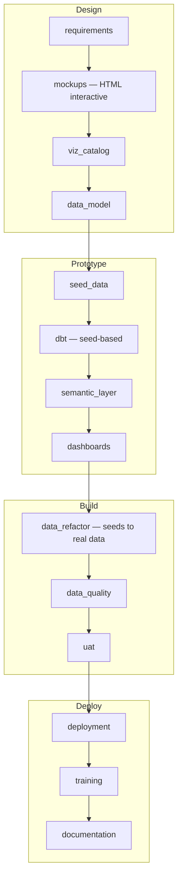
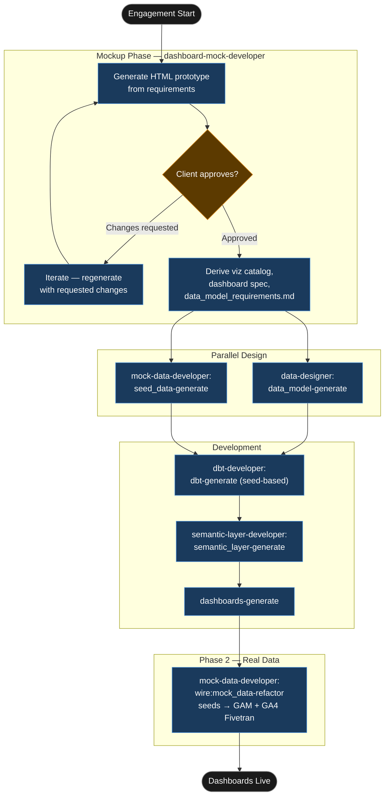

# Tutorial: Dashboard First

## Statement of Work

```
**Rittman Analytics × Claybrook Media Group**
**Engagement**: Campaign Performance and Audience Engagement Dashboards — Phase 1
**Date**: June 2026
**Type**: Time and materials

### Engagement overview

Claybrook Media Group requires campaign performance and audience engagement dashboards for its advertising sales team. No data platform currently exists. This engagement delivers a working Looker instance powered by seed data, with all dashboard designs approved by the commercial director before any technical build work begins. Phase 2 (a separate SOW) will migrate the seed layer to live GAM and GA4 data via Fivetran once connector access is confirmed.

### In scope

- Interactive HTML dashboard mockups generated by the `dashboard-mock-developer` agent, iterated until approved in writing by the commercial director
- Viz catalog CSV (`dashboard_visualization_catalog.csv`) derived atomically from the approved mockup
- Dashboard spec (`dashboard_spec.md`) and data model requirements document (`data_model_requirements.md`)
- Four CSV seed files with referential integrity: `campaign.csv`, `campaign_performance.csv`, `article.csv`, `page_engagement.csv`
- dbt project with seed-based staging models (`stg_campaign_performance`, `stg_page_engagement`) and five warehouse models (`campaign_dim`, `content_dim`, `date_dim`, `campaign_performance_fct`, `page_engagement_fct`)
- LookML semantic layer: 5 views, 2 explores (`campaign_performance`, `page_engagement`), dynamic calculated measures (`fill_rate_pct`, `cpm_gbp`)
- Looker dashboards published to production, matching the approved HTML mockups tile-for-tile
- Phase 2 refactor plan (`data_refactor_plan.md`) documenting the seed-to-source column mapping for GAM and GA4

### Out of scope

- Fivetran connector setup for Google Ad Manager or Google Analytics 4
- Any work against live GAM or GA4 data (deferred to Phase 2)
- End-user training and documentation (deferred to Phase 2 or a standalone enablement engagement)
- Integration with Claybrook's CMS or editorial systems

### Timeline

| Days | Activity |
|---|---|
| Days 1–3 | Mockup iteration and commercial director approval (up to 3 review rounds) |
| Days 4–5 | Viz catalog, dashboard spec, data model requirements, seed data generation |
| Days 6–9 | dbt models, LookML semantic layer, Looker dashboards |
| Day 10 | Review, handover, and Phase 2 scope agreement |

### Key assumptions

- Commercial director is available for mockup review sessions with turnaround within one business day per round; up to three rounds are included
- A Looker instance is already provisioned and accessible before Day 6
- A BigQuery project and dbt Cloud account are available and configured before Day 6
- Claybrook confirms that GAM and GA4 Fivetran credentials will be provided within 4 weeks of Phase 1 delivery, enabling Phase 2 to proceed without delay
- The commercial director has authority to give written approval on behalf of the business; no further sign-off chain is required

### Acceptance criteria

- Mockups approved in writing by the commercial director before any dbt or LookML work begins
- `dbt seed && dbt run` completes with zero errors and all 18 dbt tests pass
- All Looker dashboards render correctly with seed data and match the approved mockup structure
- Phase 2 scope and timeline agreed and documented before Phase 1 engagement closes
```


## What is a Dashboard First release?

Most data platform engagements build the data layer first — source connectors, staging models, warehouse models — and produce dashboards at the end of the build phase. The risk is obvious in retrospect: the client only discovers that the dashboard layout is wrong, or that they wanted a completely different metric, at the point when changing direction is expensive. A `dashboard_first` release inverts that sequence. Stakeholder approval of the interactive dashboard mockup comes before schema design, before dbt models, before LookML. Nothing in the data layer is written until the visual design is locked.

The mechanism that makes this practical is the `dashboard-mock-developer` agent. Rather than producing static wireframes or a Figma prototype, the agent generates a self-contained, interactive HTML file — Chart.js charts, tab navigation, filter pills, the full Looker visual language — that runs directly in a browser without a build step or a server. The client clicks through it, requests changes, and the agent regenerates. Once the mockup is approved, the agent derives three downstream artifacts atomically: a viz catalog CSV (the machine-readable chart inventory), a dashboard spec, and `data_model_requirements.md`. That last file defines the precise grain, measures, and dimensions the data layer must produce. It is what both the `data-designer` and the `mock-data-developer` agents read.

The second specialist, `mock-data-developer`, takes `data_model_requirements.md` and generates CSV seed files with referential integrity and domain-realistic values. Those seeds power a working dbt project — `dbt seed && dbt run` succeeds — before the client has provided a single database credential. Real source data arrives later. When it does, `/wire:mock_data-refactor` (handled by the same agent) rewrites the staging layer from `ref('seed')` calls to `source()` calls, producing a written migration plan before touching any code. The seed-based prototype is disposable; it exists to validate the design, not to become the production model.

### High-Level Process



## Scenario

| | |
|---|---|
| **Client** | Claybrook Media Group |
| **Description** | UK digital publisher, four lifestyle and news titles, approximately two million monthly readers |
| **Engagement** | Campaign Performance and Audience Engagement Dashboards |
| **Release ID** | `01-claybrook-media-dashboards` |
| **Release type** | `dashboard_first` |
| **Stack** | BigQuery, dbt Cloud, Looker, Google Ad Manager (GAM), GA4 |
| **Duration** | 10 days |

Claybrook's commercial director wants campaign performance and audience engagement dashboards for the advertising sales team — specifically, a view of revenue by campaign, fill rate by format, and page engagement by title. The problem: there is no existing data team. A junior analyst has recently joined but the platform does not exist. The commercial director needs to see and approve the dashboards before the business will authorise the engineering effort. She cannot assess a data model document or a schema diagram. She can assess a browser-based prototype with real-looking numbers.

Rather than building speculatively, the engagement begins with interactive mockups. The data layer — sources, staging, warehouse — is designed from the approved mockup, not from assumptions about what the business might want.

## Deliverables

| Deliverable | Format |
|---|---|
| Interactive dashboard mockups | Self-contained HTML files, Chart.js |
| Viz catalog | `design/dashboard_visualization_catalog.csv` |
| Dashboard spec | `design/dashboard_spec.md` |
| Data model requirements | `design/data_model_requirements.md` |
| CSV seeds | `seeds/` — four files with referential integrity |
| dbt models | Seed-based staging and warehouse models |
| LookML | Views, explores, Looker dashboards |
| Looker dashboards | Published to production |
| Phase 2 refactor plan | `data_refactor_plan.md` — seeds to GAM + GA4 Fivetran sources |

## Tutorial Playbook

The diagram below is the delivery playbook for this tutorial's scenario. In a live engagement, [`/wire:playbook-generate`](../reference/commands#session-and-management-commands) generates this as a Mermaid-format delivery plan — dependency order, team assignments, and target dates tailored to the specific release.



## Walkthrough

### Engagement setup

:::info[First release in this repository?]

If this is the first release created in a git repository, `/wire:new` will first take you through the steps to set up the overall client engagement — naming the client, setting the engagement context, and configuring any integrations — before scaffolding the release itself. See [Setting up a new engagement](https://docs.rittmananalytics.com/en/latest/docs/getting-started/engagements-releases#setting-up-a-new-engagement) for further details.

:::

```
/wire:new
→ Client: Claybrook Media Group
→ Engagement name: claybrook_media
→ Release type: dashboard_first
→ Release ID: 01-claybrook-media-dashboards
→ Branch: feature/claybrook-media-dashboards
→ .wire/releases/01-claybrook-media-dashboards/status.md created
  12 artifacts across 4 phases, all at not_started
```

:::info[Issue tracking and document sync]

Wire can sync artifact progress to [Jira](../advanced/issue-tracking#jira-integration) or [Linear](../advanced/issue-tracking#linear-integration) as each generate, validate, and review step completes. With the Jira integration, you can choose between one sub-task per lifecycle step (each moving through its own workflow states) or one ticket per artifact that transitions between issue statuses. Wire can create the Epic and issue hierarchy for you when you run `/wire:new`, or link to an existing one you have already set up.

Generated artifacts can also be replicated to [Confluence](../advanced/document-store#confluence) or [Notion](../advanced/document-store#notion) for client review — review commands pull comments and edits made in the document store back as context before gathering sign-off.

Both integrations are optional. Configure the [Atlassian](../reference/mcp-servers#atlassian), [Linear](../reference/mcp-servers#linear), or [Notion](../reference/mcp-servers#notion) MCP servers in `.claude/settings.json` to enable them.

:::


### Generating the interactive prototype

```
/wire:mockups-generate 01-claybrook-media-dashboards
→ [auto-delegated to dashboard-mock-developer agent]
```

:::info[Auto-delegation]

When you see `-> [auto-delegated to X agent]`, the main session has routed that command to a [specialist subagent](../advanced/wire-agents#auto-delegation-on-individual-commands) automatically — no extra steps needed. The specialist runs with a focused brief rather than the full engagement context, which typically produces sharper domain-specific output. Review commands (`*-review`) always stay in the main session and require your direct input.

:::

The agent reads the requirements and produces an interactive HTML file — `design/mockups/claybrook-campaign-dashboard.html` — on the first pass. No iteration prompt needed to get a working prototype; the first version is complete and navigable.

```
Dashboard prototype generated — open design/mockups/claybrook-campaign-dashboard.html in any browser

  Structure: 4 sections, 7 chart types, 3 filter dimensions (date range, title, format)

  Section 1 — Campaign Revenue Overview
    KPI tiles: Total Revenue (£284,600), Total Impressions (18.4M),
               Average CPM (£15.47), Fill Rate (82.3%)
    Line chart: revenue by week, 13 weeks trailing, split by direct vs programmatic
    Bar chart: revenue by ad format (display, video, native, sponsorship)

  Section 2 — Campaign Performance Table
    Sortable table: 14 campaigns, columns — Campaign Name, Advertiser, Format,
                   Start/End, Impressions, Revenue, CPM, Fill Rate, Pacing
    All values realistic (e.g. "Audi Q5 Display — Publicis UK — £38,200 — 97% pacing")

  Section 3 — Audience Engagement by Title
    Stacked bar chart: page views + average engagement time per article,
                       split by four Claybrook titles
    KPI tiles: total page views, average session duration, bounce rate, return visitor rate

  Section 4 — Top Performing Formats
    Pie chart: revenue share by format
    Table: format × metric matrix with WoW % change

  All charts are Chart.js 4.4.1, fully interactive.
  Tabs switch without page load. Filter pills styled to Looker spec.
```


The commercial director and two members of the advertising sales team review the prototype. Two change requests come back.

- Add a date range filter that applies across all four sections simultaneously
- Split the Campaign Performance table into two tabs: direct-sold and programmatic

```
/wire:mockups-generate 01-claybrook-media-dashboards
→ [dashboard-mock-developer iterates — second pass]
→ Date range filter added: date picker, applies globally across all sections
→ Campaign Performance table split: Direct-Sold tab (8 campaigns) / Programmatic tab (6 campaigns)
→ Regenerated: design/mockups/claybrook-campaign-dashboard-v2.html
```

Second version approved by the commercial director.

### Deriving the downstream artifacts

Approval triggers the agent to produce three artifacts atomically:

```
/wire:viz_catalog-generate 01-claybrook-media-dashboards
→ [derived from approved mock by dashboard-mock-developer]
→ design/dashboard_visualization_catalog.csv — 11 rows
```

Sample rows from the viz catalog:

| chart_id | chart_type | section | explore | measures | dimensions | filters |
|---|---|---|---|---|---|---|
| VIZ-001 | kpi_tile | Campaign Revenue Overview | campaign_performance | total_revenue_gbp | — | date_range, title, format |
| VIZ-004 | line_chart | Campaign Revenue Overview | campaign_performance | weekly_revenue_gbp | week, deal_type | date_range, title |
| VIZ-007 | stacked_bar | Audience Engagement by Title | page_engagement | total_page_views, avg_engagement_time_seconds | title | date_range |

```
/wire:data_model_requirements-generate 01-claybrook-media-dashboards
→ [derived from approved mock by dashboard-mock-developer]
→ design/data_model_requirements.md
```

The generated requirements specify two fact tables and three dimensions:

- `campaign_performance_fct` at campaign-day grain — measures: `impressions`, `revenue_gbp`, `fill_rate_pct`, `cpm_gbp`, `clicks`; dimensions: `campaign_dim`, `date_dim`; source: GAM
- `page_engagement_fct` at article-session grain — measures: `page_views`, `engagement_time_seconds`, `is_bounce`, `is_return_visitor`; dimensions: `content_dim`, `date_dim`; source: GA4
- `campaign_dim` — campaign name, advertiser, format, deal type (direct/programmatic), start date, end date
- `content_dim` — article title, section, publishing title (one of the four Claybrook brands), author
- `date_dim` — standard date spine, fiscal week flag

### Generating seed data

```
/wire:mock_data-generate 01-claybrook-media-dashboards
→ [auto-delegated to mock-data-developer agent]
```

The agent reads `data_model_requirements.md` and the warehouse DDL, then generates four seed files with domain-realistic values and maintained referential integrity across all foreign keys.

```
Seed data generated

  seeds/campaign.csv          —  48 rows
    Advertisers: Audi UK, Sainsbury's, Sky, EDF Energy, B&Q, and 12 others
    Formats: display (24), video (12), native (8), sponsorship (4)
    Deal types: direct-sold (30), programmatic (18)

  seeds/campaign_performance.csv  —  1,344 rows
    Grain: campaign × day, 28-day window
    Revenue range: £180 – £4,200 per campaign-day
    Fill rate: normally distributed, mean 81%, SD 9%
    CPM: varies by format (video highest at ~£22, display ~£14)

  seeds/article.csv           —  312 rows
    Titles distributed across four Claybrook brands (78 per title)
    Sections: News, Lifestyle, Opinion, Sport, Technology
    Authors: 24 distinct bylines with realistic names

  seeds/page_engagement.csv   —  8,736 rows
    Grain: article × session, 28-day window
    Page views per article-day: Poisson-distributed, mean 14
    Engagement time: log-normal, median 94 seconds
    Bounce rate: 42%, return visitor rate: 28%

  Referential integrity confirmed: all campaign_performance.campaign_id values
  present in campaign.id; all page_engagement.article_id values present in article.id

  dbt seed && dbt run: PASS — all models materialised successfully
```

### dbt models and LookML

With the seeds running cleanly, the build continues:

```
/wire:dbt-generate 01-claybrook-media-dashboards
→ [auto-delegated to dbt-developer agent]
→ 2 staging models (stg_campaign_performance, stg_page_engagement)
→ 5 warehouse models (campaign_dim, content_dim, date_dim,
                       campaign_performance_fct, page_engagement_fct)
→ All models use ref() to seeds, not source()
→ dbt test: 18 tests, PASS

/wire:semantic_layer-generate 01-claybrook-media-dashboards
→ [auto-delegated to semantic-layer-developer agent]
→ 5 LookML views, 2 explores (campaign_performance, page_engagement)
→ fill_rate_pct calculated dynamically: filled_impressions / total_impressions
→ cpm_gbp calculated dynamically: revenue_gbp / (impressions / 1000)

/wire:dashboards-generate 01-claybrook-media-dashboards
→ Claybrook Campaign Performance dashboard — 4 tiles published
→ Looker dashboard matches approved HTML prototype tile-for-tile
```

### Phase 2: real data migration

Once GAM and GA4 Fivetran connectors are provisioned and access is confirmed, the data refactor replaces the seeds with real sources.

```
/wire:mock_data-refactor 01-claybrook-media-dashboards
→ [mock-data-developer agent]
→ Schema comparison: seed schema vs GAM Fivetran connector schema
→ 3 column renames identified in campaign_performance source
→ data_refactor_plan.md written before any code changes
→ stg_campaign_performance.sql: ref('campaign_performance') → source('gam', 'line_items_daily')
→ stg_page_engagement.sql: ref('page_engagement') → source('ga4', 'events')
→ dbt compile: PASS
```

## What was produced

| Artifact | Detail |
|---|---|
| Interactive HTML mockup | 4 sections, 7 chart types, 3 filter dimensions — approved after two iterations |
| Viz catalog | 11 chart definitions in `dashboard_visualization_catalog.csv` |
| Dashboard spec | `dashboard_spec.md` — section structure, chart types, filter behaviour |
| Data model requirements | 2 facts, 3 dimensions, all measures with grain and calculation notes |
| CSV seeds | 4 files, 10,440 total rows, referential integrity confirmed |
| dbt project | 7 models (2 staging, 5 warehouse), 18 tests — all PASS on seed data |
| LookML | 5 views, 2 explores, 2 dashboards |
| Phase 2 refactor plan | `data_refactor_plan.md` — seeds to GAM + GA4 Fivetran, column mapping documented |
