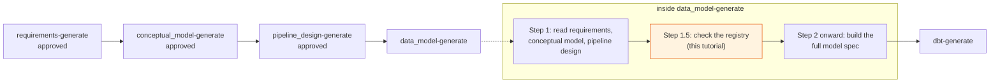
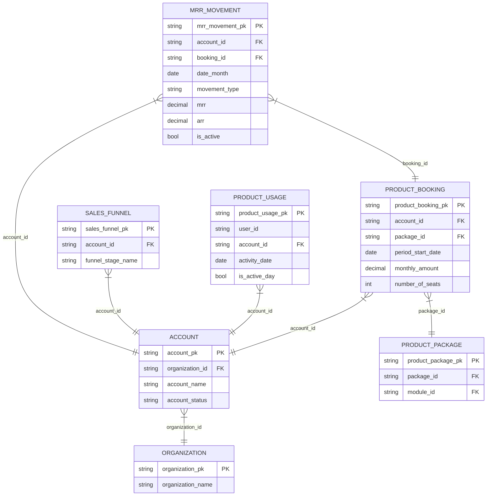
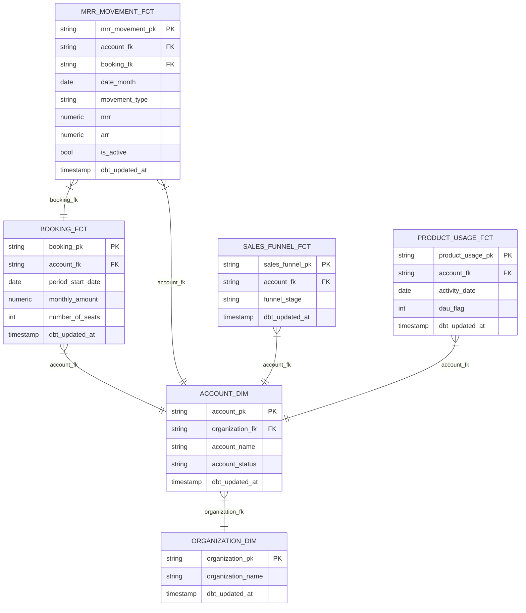

# Tutorial: Using the Data Model Registry

## What this tutorial covers

This tutorial shows the data model registry in action, inside an ordinary `full_platform` release. It picks up right where the [Full Platform](./full-platform) tutorial leaves the design phase, at the point where `/wire:data_model-generate` runs — and shows what happens differently, step by step, when a canonical vertical and a cross-vertical pattern both exist in the registry for this client.

For the full mechanism reference — how the registry is structured, how it's synced, what dev mode versus personal mode means — see [Advanced → The Process and Data Model Registries](../advanced/registries). This tutorial is the narrative version: one release, one client, the actual commands and output.

## Scenario

| | |
|-|-|
| **Client** | Core Dynamics, Inc. |
| **Sector** | B2B SaaS — facility management (CoreFM product) |
| **Size** | $38.4M ARR, 312 accounts |
| **Release** | `02-foundation-platform` |
| **Release type** | `full_platform` |
| **Stack** | BigQuery, dbt, Looker |
| **Board target** | Net revenue retention 104% → 115% |

Core Dynamics sells CoreFM, a seat-and-contract-priced B2B SaaS product. The most important requirement in the release is an accurate MRR waterfall — new business, renewals, upgrades, downgrades, churn, and reactivation broken out by month — so the board can track progress toward the NRR target. A second, smaller requirement (FR-02) asks Wire to reconcile CRM identity: Core Dynamics runs both Salesforce and HubSpot, and discovery found a confirmed 12% contact mismatch between the two (risk register R-01).

By the time this tutorial picks up, `requirements-generate`, `conceptual_model-generate`, and `pipeline_design-generate` have all run and been approved for this release, in the usual order. The next command is `/wire:data_model-generate`.

## Where this fits in the release

`data_model-generate` is one step in the design phase of a normal `full_platform` release — nothing about the surrounding sequence changes because a registry match exists. The registry check is Step 1.5 of that command, sitting between reading the release's own requirements and building the model spec:



Step 1.5 runs automatically, on every engagement, whether or not the registry is even reachable. If the consultant has no access to the private registry repo, or nothing in it matches, this step produces no output at all and the command proceeds exactly as it always has — there's no separate "registry mode" to opt into.

## Running it

```
$ cd core-dynamics-platform
$ WIRE_TRACE=true claude
> /wire:data_model-generate 02-foundation-platform
```

By this point Wire has already read and approved `requirements_specification.md` and `design/conceptual_model.md` for this release — that happens in Step 1, before it ever checks the registry. So when the proposal comes back a few seconds later, the consultant isn't judging it cold: they're comparing a generic registry entity list against requirements they already know. That's what turns "yes / adapt / no" from a guess into a real decision.

### The vertical match

Wire checks the registry's `verticals/` directory, finds a `saas` entry, and proposes it:

```
Wire found a canonical data model that may fit this engagement: saas —
subscription_revenue_analytics.
Standard marts: dim_account, dim_organization, fct_booking, fct_mrr_movement,
fct_sales_funnel, fct_product_usage, dim_package, dim_module, fct_package_module
Entities: account, organization, product_booking, mrr_movement, sales_funnel,
product_usage, product_package

Use this as the starting structure for the data model? (yes / adapt / no)
> adapt

Which entities should I keep, drop, or rename?
> keep account, organization, product_booking, mrr_movement, sales_funnel,
> product_usage as-is. Drop product_package/dim_package/dim_module —
> CoreFM has flat per-seat pricing, no packages or modules.
```

`product_package` is the one entity in the registry's SaaS schema with nothing to match it in Core Dynamics' actual business. The SOW and requirements are explicit that CoreFM prices flat per seat, with no packages or add-on modules. That's a fact the consultant already knows going in — Wire doesn't point it out. The proposal just lists the registry's standard shape; spotting the one entity that doesn't apply is the consultant's job, using requirements they read before this command ever ran.

### The cross-vertical pattern

Independently of that vertical match, Wire checks six cross-industry patterns that aren't tied to any one vertical. Five get ruled out on their merits: no GA4, no paid media, no timesheet-billing model at Core Dynamics, and one usage-tracking pattern is redundant with what the `saas` vertical already covers. The sixth is `crm_identity_resolution`:

```
Also relevant regardless of industry fit: crm_identity_resolution — Salesforce/HubSpot
contact identity needs reconciling (12% confirmed mismatch, FR-02), and downstream marts
(including the saas vertical's own account/organization entities) depend on a clean
canonical key.

Include this pattern? (yes / adapt / no)
> yes
```

This one's worth pausing on. `crm_identity_resolution`'s own YAML description frames it as being for "a consultancy's or agency's own CRM operations" — and Core Dynamics isn't an agency. Wire doesn't treat that framing as a boundary on who can use the pattern. It looks past who the schema says it was built for and asks whether the underlying technique — union multiple CRM sources, resolve identity by email or domain match, produce one canonical contact record — is still the same problem this client actually has. It is: Core Dynamics has a confirmed 12% Salesforce/HubSpot contact mismatch. So the pattern gets proposed on the strength of that match, not the wording of its origin story.

### What gets recorded

Both decisions get written straight back into the engagement's own record, `.wire/engagement/context.md`, so the next person — or the next command — can see exactly what was decided and why:

```yaml
data_model_registry:
  vertical: saas  # Confident match. Core Dynamics sells CoreFM, a seat/contract-based
                  # B2B SaaS product (ARR $38.4M, 312 accounts) -- direct fit for the
                  # "saas" vertical. Consultant chose "adapt": kept account, organization,
                  # product_booking, mrr_movement, sales_funnel, product_usage; declined
                  # product_package/dim_package/dim_module as out of scope.
  cross_vertical_schemas: [crm_identity_resolution]  # Accepted "yes". FR-02 requires
                  # reconciling CRM identity against billing accounts; discovery findings
                  # document a confirmed 12% Salesforce/HubSpot contact mismatch (risk R-01).
                  # Same technique the schema describes (union CRM sources, resolve identity
                  # by email/domain match, produce one canonical key) applies directly,
                  # regardless of the schema's own agency-focused framing.
```

Both fields are read back on every later command in this engagement — nothing about this decision needs re-litigating in the next release, or if a different consultant picks up the work.

## What the SaaS vertical actually offered

Here's the registry's own diagram of the SaaS schema, simplified to the key columns:



`MRR_MOVEMENT` is the entity the registry calls its flagship, and it comes with specific rules for getting it right — not just column names. Here's one, straight from the registry's YAML:

```yaml
generation_constraints:
  - >
    Synthesize an explicit churn row for the month immediately after an
    account-booking's last active month (mrr = 0, is_active = false,
    previous_month_is_active = true), and union it into the spine — do not
    rely on the absence of a row to represent churn implicitly.
```

In plain terms: don't treat a missing row as "no change." If a booking just stops appearing, that's a cancellation, and if the model doesn't say so explicitly, cancellations get silently under-counted — the kind of mistake that only shows up months later when finance tries to reconcile the board-facing number by hand.

The registry backs that rule with real, tested dbt code showing how to actually do it. Here's the core of it — the part that decides whether a given month is new business, a renewal, an upgrade, a downgrade, a cancellation, or a comeback:

```sql
case
    when is_first_month then
        case when previous_month_is_active then
            case when mrr_change > 0 then 'upgrade'
                 when mrr_change < 0 then 'downgrade'
                 else 'renewal' end
        else 'new' end
    when not(is_active) and previous_month_is_active then 'churn'
    when is_active and not(previous_month_is_active) then 'reactivation'
end as movement_type
```

That's not a template to copy in — it's a worked example the AI (or a person) reads to understand the technique before writing the version that fits Core Dynamics' actual source data, per the registry's own README.

## What the cross-vertical pattern actually added

The effect of accepting `crm_identity_resolution` isn't just a note in `context.md` — it's a real model. Wire's generated spec adds a new integration-layer model, `int__crm__contact_identity_map`, with a definition carried straight from the registry's own generation rules:

```
### int__crm__contact_identity_map

Canonical entity (data model registry, cross-vertical, accepted as-is):
cross-vertical/crm_identity_resolution.

generation_constraints: union stg_crm__contact and stg_hubspot__contact; resolve
identity primarily by exact email match, falling back to company_domain <-> Salesforce
account-domain matching for contacts that don't match on email; emit one row per
resolved identity with a match_method and match_confidence rather than silently
dropping unmatched contacts.
```

## The final model

The consultant accepted six of the seven suggested SaaS entities as-is; the seventh, `product_package`, was declined. Here's the actual diagram Wire generated for the final data model, after adapting the registry's entities to Core Dynamics' own naming conventions:



Same shape as the registry offered, minus the packages entity, renamed to Wire's standard `_dim`/`_fct` convention, and trimmed to the columns this engagement actually needs.

`int__crm__contact_identity_map` doesn't appear in this diagram — it stays at the integration layer this release rather than getting promoted to a warehouse dimension, since the contact-level marts that would consume it belong to a separate, later workstream. It still exists, still runs, and still resolves the 12% mismatch; it's just not part of the layer this diagram shows.

```
/wire:data_model-validate 02-foundation-platform → PASS
/wire:data_model-review 02-foundation-platform → Approved
```

From here the release continues exactly as any `full_platform` release would: `/wire:dbt-generate` reads this same `data_model_specification.md` and builds the actual dbt models, including `int__crm__contact_identity_map`, with no additional registry-specific step of its own.

## Key lesson

The registry check is a normal step inside a command you'd run anyway, not a separate workflow to learn. It never blocks, never auto-adopts anything, and produces no output at all for an engagement with no registry access or no match — the majority case, and one you'd never notice from the outside. When it does have something relevant, it's proposed on its substance: whether the entities and technique fit this client's actual requirements, not whether the vertical name or the schema's own framing happens to match. The consultant's requirements knowledge, already read by Wire earlier in the same command, is what makes each `yes` / `adapt` / `no` decision a real one rather than a coin flip.
