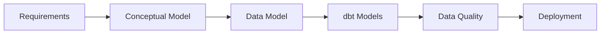
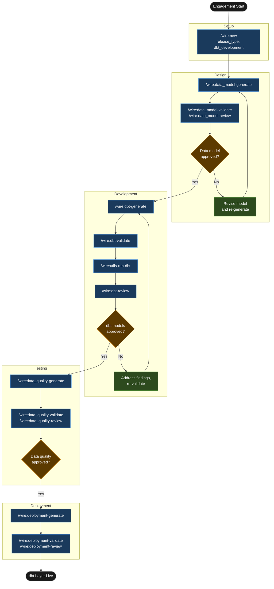

# Tutorial: dbt Development

## Statement of Work

```
**Rittman Analytics × Vantage Financial Reporting Ltd**
**Engagement**: `01-vantage-dbt-foundation`
**Date**: June 2026
**Type**: Time and materials

### Engagement overview

Vantage Financial Reporting Ltd has three data sources landing in Snowflake via Fivetran — Stripe payments, Salesforce CRM, and a PostgreSQL product database — but no transformation layer. The analytics team writes ad-hoc SQL directly against raw tables, with no agreed grain, no tests, and no shared customer definition across systems. Rittman Analytics is engaged to deliver the dbt staging, integration, and warehouse models that resolve these issues and provide a tested, documented foundation for downstream Looker development.

### In scope

- `_sources.yml` source definitions for `stripe_raw`, `salesforce_raw`, and `product_raw` Snowflake schemas
- Six staging models: `stg_stripe__charges`, `stg_stripe__customers`, `stg_stripe__refunds`, `stg_salesforce__accounts`, `stg_salesforce__opportunities`, `stg_product__users`
- One integration model: `int__customer_unified` — cross-system customer identity resolution via email matching with surrogate fallback
- Four warehouse models: `customer_dim`, `opportunity_fct`, `charge_fct`, `subscription_mrr_fct`
- 38 dbt schema tests covering `not_null`, `unique`, `relationships`, and accepted values across all models
- Documentation YAML (`description:` fields) for every model and column
- dbt Cloud production job (`vantage_daily_run`) — daily at 04:00 UTC, running `dbt run` then `dbt test`
- dbt Cloud CI/PR job (`vantage_ci`) — triggers on pull request, runs `dbt build --select state:modified+`
- `decisions.md` recording grain choices and modelling trade-offs made during the engagement

### Out of scope

- Fivetran connector changes or new source connections — existing connectors are assumed to be running correctly
- LookML authoring or any work within the existing Looker instance
- Dashboard creation or any BI layer deliverables
- End-user or data team training — Vantage's data team is self-sufficient on dbt

### Timeline

| Day(s) | Activity |
|--------|----------|
| Days 1–2 | Data model design: raw schema review, model inventory, `_sources.yml`, review and approval |
| Days 3–4 | dbt model generation: all 11 SQL files, 38 schema tests, documentation YAML, dbt run and validation |
| Day 5 | Data quality checks, freshness configuration, dbt Cloud job setup, deployment runbook, handover |

### Key assumptions

- Fivetran connectors for Stripe, Salesforce, and the product PostgreSQL database are active and tables are available in the Snowflake raw schema before Day 1
- Vantage's analytics engineering lead is available to review and approve the data model spec within 24 hours of delivery (end of Day 2)
- A dbt Cloud account is already provisioned and the project repository is accessible
- Vantage provides Snowflake service account credentials and information schema exports for the three raw schemas before engagement start
- The `subscription_mrr_fct` model will be built at monthly snapshot grain — intra-month MRR movement is out of scope unless the finance team raises a specific requirement during the data model review

### Acceptance criteria

- All 38 dbt schema tests pass in the production Snowflake environment with zero failures
- `subscription_mrr_fct` grain confirmed correct by the finance team (monthly snapshot per customer) before sign-off
- `vantage_daily_run` dbt Cloud job completes without errors for three consecutive days prior to handover
- All 11 models have `description:` fields populated in schema YAML — `dbt docs generate` produces a complete project documentation site
```


## What is a dbt Development release?

A `dbt_development` release covers the transformation layer only. Data is already landing in the warehouse — via Fivetran, Stitch, a manual load process, or a pipeline that was delivered in an earlier engagement — and the work is building the dbt staging, integration, and warehouse models that turn raw tables into reliable, tested, documented facts and dimensions.

Choose this release type when the ingestion problem is already solved and the BI team is blocked on clean models. You skip the pipeline design, pipeline implementation, semantic layer, and dashboard phases entirely. The result is a full dbt project — staging models, warehouse models, schema tests, and documentation YAML — that a downstream LookML or Tableau developer can build against with confidence. If you also need to wire up new connectors or author LookML, use a `full_platform` release instead.

### High-Level Process



## Scenario

| | |
|-|-|
| **Client** | Vantage Financial Reporting Ltd |
| **Sector** | UK FinTech — business expense management SaaS |
| **Size** | ~60 employees |
| **Release** | `01-vantage-dbt-foundation` |
| **Release type** | `dbt_development` |
| **Stack** | Snowflake, dbt Cloud, Looker (existing, out of scope) |

Vantage has three data sources landing in Snowflake via Fivetran: Stripe (payments and refunds), Salesforce (accounts and opportunities), and their product PostgreSQL database (users and subscription events). The pipelines run daily and the raw data is there. The problem is that the analytics team writes ad-hoc SQL directly against raw tables — `stripe.charges`, `salesforce.account`, `product_db.users` — with no agreed grain, no tests, and no shared understanding of how a "customer" is defined across systems. The BI team wants to build Looker dashboards on subscription MRR, opportunity conversion, and charge volume, but cannot do so reliably until a transformation layer exists. LookML authoring is out of scope for this release.

## Deliverables

| Deliverable | Description |
|---|---|
| Source definitions | `_sources.yml` for Stripe, Salesforce, and product database raw schemas |
| Staging models (6) | One model per raw entity — field normalisation, type casting, renamed columns |
| Integration model (1) | `int__customer_unified` — cross-system customer identity resolution |
| Warehouse models (4) | `customer_dim`, `opportunity_fct`, `charge_fct`, `subscription_mrr_fct` |
| Schema tests | 38 tests across all models: `not_null`, `unique`, `relationships`, accepted values |
| Documentation YAML | `description:` fields for every model and column |
| `decisions.md` | Agent-recorded grain choices, modelling trade-offs, and rationale |

## Tutorial Playbook

The diagram below is the delivery playbook for this tutorial's scenario. In a live engagement, [`/wire:playbook-generate`](../reference/commands#session-and-management-commands) generates this as a Mermaid-format delivery plan — dependency order, team assignments, and target dates tailored to the specific release.



## Walkthrough

### Engagement setup

:::info[First release in this repository?]

If this is the first release created in a git repository, `/wire:new` will first take you through the steps to set up the overall client engagement — naming the client, setting the engagement context, and configuring any integrations — before scaffolding the release itself. See [Setting up a new engagement](https://docs.rittmananalytics.com/en/latest/docs/getting-started/engagements-releases#setting-up-a-new-engagement) for further details.

:::

```
/wire:new
→ Client: Vantage Financial Reporting Ltd
→ Engagement name: vantage
→ Release type: dbt_development
→ Release ID: 01-vantage-dbt-foundation
→ Branch: feature/vantage-dbt-foundation
→ .wire/releases/01-vantage-dbt-foundation/status.md created
  8 artifacts across 4 phases, all at not_started
```

:::info[Issue tracking and document sync]

Wire can sync artifact progress to [Jira](../advanced/issue-tracking#jira-integration) or [Linear](../advanced/issue-tracking#linear-integration) as each generate, validate, and review step completes. With the Jira integration, you can choose between one sub-task per lifecycle step (each moving through its own workflow states) or one ticket per artifact that transitions between issue statuses. Wire can create the Epic and issue hierarchy for you when you run `/wire:new`, or link to an existing one you have already set up.

Generated artifacts can also be replicated to [Confluence](../advanced/document-store#confluence) or [Notion](../advanced/document-store#notion) for client review — review commands pull comments and edits made in the document store back as context before gathering sign-off.

Both integrations are optional. Configure the [Atlassian](../reference/mcp-servers#atlassian), [Linear](../reference/mcp-servers#linear), or [Notion](../reference/mcp-servers#notion) MCP servers in `.claude/settings.json` to enable them.

:::


Before running any generate commands, drop the Snowflake information schema exports for the three raw schemas — `stripe_raw`, `salesforce_raw`, `product_raw` — into `releases/01-vantage-dbt-foundation/requirements/`. The `data-designer` agent reads these to understand actual column names and types before proposing any model structure.

### Data model design — auto-delegated to `data-designer`

```
/wire:data_model-generate 01-vantage-dbt-foundation
→ [auto-delegated to data-designer agent]
```

:::info[Auto-delegation]

When you see `-> [auto-delegated to X agent]`, the main session has routed that command to a [specialist subagent](../advanced/wire-agents#auto-delegation-on-individual-commands) automatically — no extra steps needed. The specialist runs with a focused brief rather than the full engagement context, which typically produces sharper domain-specific output. Review commands (`*-review`) always stay in the main session and require your direct input.

:::

The agent reads the raw schema exports and the SOW, then produces a full model inventory and `_sources.yml`. Six staging models, one integration model, and four warehouse models:

- `stg_stripe__charges`, `stg_stripe__customers`, `stg_stripe__refunds`
- `stg_salesforce__accounts`, `stg_salesforce__opportunities`
- `stg_product__users`
- `int__customer_unified` — joins Stripe customer email to Salesforce account and product user via a deterministic email match, with a fallback surrogate for unmatched records
- `customer_dim`, `opportunity_fct`, `charge_fct`, `subscription_mrr_fct`

The agent appends to `decisions.md`: `subscription_mrr_fct` modelled at monthly snapshot grain per customer (not at individual subscription-event grain) — event grain would require twelve times the row count for the same analytical value, and no current requirement calls for intra-month MRR movement.

```
/wire:data_model-validate 01-vantage-dbt-foundation
→ [auto-delegated to data-designer agent]
→ PASS

/wire:data_model-review 01-vantage-dbt-foundation
→ [main session]
→ Approved by analytics engineering lead, 2026-06-17
→ Decision: add net_mrr_movement column to subscription_mrr_fct for churn analysis
```

### dbt model generation — auto-delegated to `dbt-developer`

```
/wire:dbt-generate 01-vantage-dbt-foundation
→ [auto-delegated to dbt-developer agent]
→ 11 models generated, 38 tests written
```

The agent writes all SQL files and schema YAML. A representative staging model:

```sql
-- models/staging/stripe/stg_stripe__charges.sql
with source as (
    select * from {{ source('stripe_raw', 'charges') }}
),

renamed as (
    select
        id                                          as charge_id,
        customer                                    as stripe_customer_id,
        amount / 100.0                              as amount_gbp,
        currency,
        status                                      as charge_status,
        paid                                        as is_paid,
        refunded                                    as is_refunded,
        to_timestamp(created)                       as created_at,
        to_timestamp(coalesce(updated, created))    as updated_at

    from source
    where _fivetran_deleted = false
)

select * from renamed
```

The schema entry for this model:

```yaml
- name: stg_stripe__charges
  description: >
    One row per Stripe charge. Amounts converted from pence to GBP.
    Soft-deleted rows (Fivetran _fivetran_deleted) are excluded.
  columns:
    - name: charge_id
      description: Stripe charge identifier (ch_...)
      tests:
        - not_null
        - unique
    - name: amount_gbp
      description: Charge amount in GBP, converted from Stripe's integer pence value
      tests:
        - not_null
    - name: charge_status
      description: Stripe charge status at time of last sync
      tests:
        - accepted_values:
            values: ['succeeded', 'pending', 'failed']
```

The agent also records in `decisions.md`: `subscription_mrr_fct` uses `dbt_utils.generate_surrogate_key(['customer_id', 'snapshot_month'])` as its primary key — the combination of customer and month is the natural grain and provides a stable key for incremental merges without requiring a sequence or UUID from any source system.

### Validation and dbt run

```
/wire:dbt-validate 01-vantage-dbt-foundation
→ [auto-delegated to qa-agent]
→ Checking ref() usage in all CTEs ... PASS
→ Checking source() calls in staging models only ... PASS
→ Checking surrogate key presence on all fact models ... PASS
→ Checking schema.yml coverage (all models documented) ... PASS
→ PASS — no blocking findings

/wire:utils-run-dbt 01-vantage-dbt-foundation
→ dbt run: 11 models built (0 errors, 0 warnings)
→ dbt test: 38 tests passed, 0 failed
```

```
/wire:dbt-review 01-vantage-dbt-foundation
→ [main session]
→ Approved by analytics engineering lead, 2026-06-18
```

### Data quality — auto-delegated to `data-quality-engineer`

```
/wire:data_quality-generate 01-vantage-dbt-foundation
→ [auto-delegated to data-quality-engineer agent]
```

The agent adds freshness checks on all three sources — Stripe (6h), Salesforce (24h), product database (6h) — and a row count reconciliation between `stg_stripe__charges` and the raw `stripe_raw.charges` table with a ±1% tolerance. Any staleness or count mismatch triggers a Slack alert to `#data-alerts`.

```
/wire:data_quality-validate 01-vantage-dbt-foundation → PASS
/wire:data_quality-review 01-vantage-dbt-foundation → Approved 2026-06-18
```

### Deployment

```
/wire:deployment-generate 01-vantage-dbt-foundation
```

The deployment runbook covers two dbt Cloud jobs:

- **Production scheduled job** (`vantage_daily_run`): daily at 04:00 UTC, commands `dbt run --select staging+ warehouse+` then `dbt test --select staging+ warehouse+`. On failure: Slack alert to `#data-alerts`.
- **CI/PR job** (`vantage_ci`): triggers on pull request against `main`, runs `dbt build --select state:modified+`. Posts a pass/fail status check back to the GitHub PR.

```
/wire:deployment-validate 01-vantage-dbt-foundation → PASS
/wire:deployment-review 01-vantage-dbt-foundation → Approved 2026-06-19
```

## What was produced

| Artifact | Detail |
|---|---|
| Source definitions | `_sources.yml` — Stripe, Salesforce, product database raw schemas |
| Staging models | 6 SQL files with field normalisation and type casting |
| Integration model | `int__customer_unified` — cross-system identity resolution |
| Warehouse models | `customer_dim`, `opportunity_fct`, `charge_fct`, `subscription_mrr_fct` |
| Schema tests | 38 tests: `not_null`, `unique`, `relationships`, accepted values |
| Documentation YAML | Description fields for all 11 models and every column |
| Data quality checks | Source freshness + row count reconciliation, Slack alerting |
| dbt Cloud config | Daily production job + CI/PR job |
| `decisions.md` | 3 agent decisions: MRR grain, surrogate key approach, freshness thresholds |

If you also need to configure new ingestion connectors or author LookML for an existing Looker instance, use a `full_platform` release instead.
