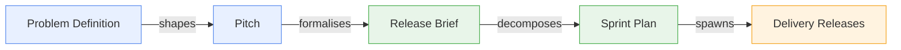
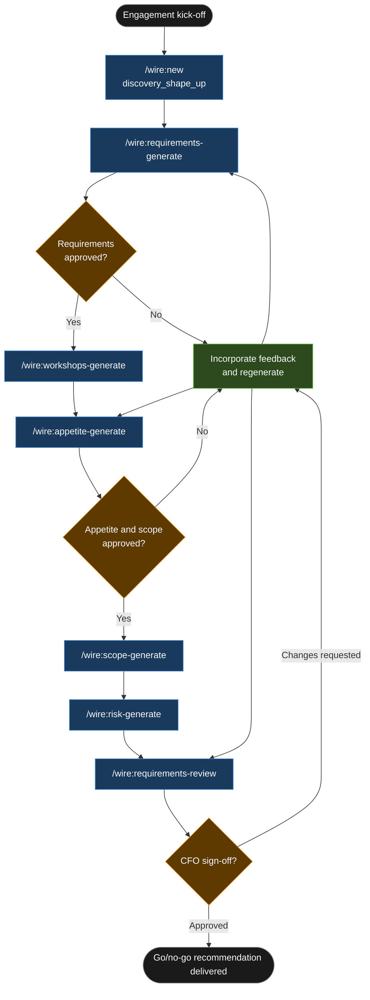

# Tutorial: Discovery (Shape Up)

## Discovery Engagement Brief

```
**Rittman Analytics × Hallmark Property Partners**  
**Engagement**: Hallmark Shape Up Discovery Sprint  
**Date**: June 2026  
**Type**: Time & materials

### Engagement overview

Hallmark Property Partners is engaging Rittman Analytics for a two-day AI-assisted discovery sprint ahead of any decision to build a data platform. The CFO requires a structured go/no-go recommendation — covering what Phase 1 should contain, what should be deferred, and what the key risks are — before committing budget to a build engagement. This brief defines the deliverables, timeline, and acceptance criteria for that sprint.

### In scope

- Stakeholder interview guide covering 4 named stakeholders (CFO, Investment Team Lead, Data Administrator, IT Manager)
- Requirements brief drawing functional and non-functional requirements from pre-engagement Fathom call recordings
- Appetite document presenting a recommended Phase 1 scope with time-and-materials estimate and explicit Phase 2 deferrals
- Scope story map covering 3 swim lanes (Data Ingestion, Data Modelling, Dashboards) and up to 20 Phase 1 user stories
- Risk catalogue with severity ratings and proposed mitigations for all identified risks

### Out of scope

- Any technical build work — no connectors, dbt models, or dashboards will be produced during this sprint
- Data access or schema analysis of Hallmark's CRM systems or Excel workbooks
- Tool procurement or vendor evaluation (BI tooling, data warehouse, pipeline tooling)
- Legal or data governance review

### Timeline

**Day 1 — Requirements and interview preparation**  
Generate requirements brief from Fathom discovery call transcripts. Run [`/wire:requirements-generate`](../reference/commands#discovery--sop--canonical) to extract functional and non-functional requirements. Generate stakeholder interview guides for all 4 stakeholders using [`/wire:workshops-generate`](../reference/commands#discovery--sop--canonical).

**Day 2 — Appetite, scope, risk, and sign-off**  
Generate appetite document with Phase 1 recommendation and Phase 2 deferrals using `/wire:appetite-generate`. Generate scope story map using `/wire:scope-generate`. Generate risk catalogue using `/wire:risk-generate`. Present outputs for CFO review and sign-off via `/wire:requirements-review`. Incorporate feedback and close.

### Key assumptions

- Client provides access to at least 2 pre-engagement discovery call recordings in Fathom prior to Day 1
- 4 named stakeholders are confirmed available for 30–45 minute interviews following delivery of the interview guides
- No existing data systems documentation is required prior to the sprint start; source material is the Fathom recordings only
- Output from this sprint is advisory only and does not constitute a committed delivery plan or contractual specification
- This sprint feeds directly into an SOW for a subsequent build engagement; no build work begins until that SOW is separately agreed

### Acceptance criteria

- Requirements brief approved by CFO, with all functional and non-functional requirements confirmed or amended
- Appetite document presents at least 2 distinct phasing options (Phase 1 recommendation and at least one alternative deferral scenario) with effort estimates for each
- Risk catalogue reviewed and accepted by IT Manager, with severity ratings confirmed for all items

---
```


## What is a Shape Up discovery release?

A Shape Up discovery release is a structured, time-boxed scoping exercise — typically one to two days of consultant time — that answers a single question before any build commitment is made: what is this engagement actually worth, and what should Phase 1 contain? The output is not code. It is a set of documents: a requirements brief drawn from stakeholder interviews, an appetite and scope recommendation, a risk catalogue, and a clear go/no-go framing that the client sponsor can sign off on. Wire automates the generation of each of these artifacts and surfaces relevant meeting context from Fathom automatically, so the consultant spends their time on judgement rather than document structure.

The appetite document is the centrepiece. Shape Up uses the concept of an appetite — how much time a problem is *worth*, not how long it will *take* — to drive scope decisions rather than letting scope drive time. Wire's `/wire:appetite-generate` command produces a structured recommendation that separates Phase 1 scope from deferred work, tied to a time-and-materials estimate the client can accept or challenge. Everything produced in this release feeds directly into the SOW for a subsequent build engagement: the requirements brief becomes the functional specification, the scope story map becomes the delivery backlog, and the risk catalogue becomes the assumptions and exclusions register.

### High-Level Process



## Engagement overview

| | |
|---|---|
| **Client** | Hallmark Property Partners |
| **Sector** | UK real estate investment, ~£50m AUM, 12 staff |
| **Release type** | `discovery_shape_up` |
| **Release ID** | `01-hallmark-shape-up-discovery` |
| **Duration** | 2 days |
| **CFO framing** | Structured go/no-go recommendation before committing to a platform build |

Hallmark's investment team tracks deal pipeline, asset performance, and portfolio risk across 14 Excel workbooks and two legacy CRM systems. The data exists — it is just fragmented, manually maintained, and impossible to consolidate quickly enough for investment committee meetings. The CFO is not asking for a platform. She is asking whether building one makes sense, what it would contain, and what the risks are. This release answers those three questions.

## Deliverables

| Artifact | Description |
|---|---|
| Stakeholder interview guide | Question sets and objectives for 4 stakeholder sessions |
| Requirements brief | Functional and non-functional requirements drawn from interview transcripts |
| Appetite document | Phase 1 scope recommendation with time-and-materials estimate; Phase 2 deferrals |
| Scope story map | 3 swim lanes, 14 user stories across Phase 1 |
| Risk catalogue | Identified risks with severity ratings and mitigations |

## Tutorial Playbook

The diagram below is the delivery playbook for this tutorial's scenario. In a live engagement, [`/wire:playbook-generate`](../reference/commands#session-and-management-commands) generates this as a Mermaid-format delivery plan — dependency order, team assignments, and target dates tailored to the specific release.



## Walkthrough

### Engagement setup

:::info[First release in this repository?]

If this is the first release created in a git repository, `/wire:new` will first take you through the steps to set up the overall client engagement — naming the client, setting the engagement context, and configuring any integrations — before scaffolding the release itself. See [Setting up a new engagement](https://docs.rittmananalytics.com/en/latest/docs/getting-started/engagements-releases#setting-up-a-new-engagement) for further details.

:::

```
/wire:new
→ Client: Hallmark Property Partners
→ Engagement name: hallmark-shape-up
→ Release type: discovery_shape_up
→ Release ID: 01-hallmark-shape-up-discovery
→ Branch: feature/hallmark-shape-up-discovery
→ .wire/releases/01-hallmark-shape-up-discovery/status.md created
  5 artifacts, all at not_started
```

:::info[Issue tracking and document sync]

Wire can sync artifact progress to [Jira](../advanced/issue-tracking#jira-integration) or [Linear](../advanced/issue-tracking#linear-integration) as each generate, validate, and review step completes. With the Jira integration, you can choose between one sub-task per lifecycle step (each moving through its own workflow states) or one ticket per artifact that transitions between issue statuses. Wire can create the Epic and issue hierarchy for you when you run `/wire:new`, or link to an existing one you have already set up.

Generated artifacts can also be replicated to [Confluence](../advanced/document-store#confluence) or [Notion](../advanced/document-store#notion) for client review — review commands pull comments and edits made in the document store back as context before gathering sign-off.

Both integrations are optional. Configure the [Atlassian](../reference/mcp-servers#atlassian), [Linear](../reference/mcp-servers#linear), or [Notion](../reference/mcp-servers#notion) MCP servers in `.claude/settings.json` to enable them.

:::


Drop any existing materials into `releases/01-hallmark-shape-up-discovery/requirements/` before running the first generate command — SOW draft, any existing Excel workbook samples, or notes from an initial call.

### Requirements — auto-delegated to `discovery-analyst`

```
/wire:requirements-generate 01-hallmark-shape-up-discovery
→ [auto-delegated to discovery-analyst agent]
→ Fathom context: 2 stakeholder recordings found

  CFO call (2026-06-03, 47 min): investment committee reporting, Excel dependency,
  data consolidation before fund close
  Investment team lead call (2026-06-05, 38 min): deal pipeline tracking, asset
  valuation updates, portfolio risk views

→ Extracting requirements from transcripts...

  Functional requirements identified:
    FR-1  Deal pipeline view aggregated across both CRM systems, filterable by
          deal stage and investment manager
    FR-2  Asset-level performance dashboard: yield, capital growth, occupancy rate
    FR-3  Portfolio risk summary: concentration by sector, geography, and tenant type
    FR-4  Fund-level performance tracking: IRR, TVPI, DPI per fund vehicle
          [flagged by CFO as essential — currently calculated manually in Excel]

  Non-functional requirements identified:
    NFR-1  Data freshness: pipeline view must reflect same-day CRM updates
    NFR-2  Access control: fund-level financials restricted to CFO and partners only
    NFR-3  No dependency on IT team for ongoing report updates

→ Requirements brief written to:
  .wire/releases/01-hallmark-shape-up-discovery/artifacts/requirements/requirements.md
```

:::info[Auto-delegation]

When you see `-> [auto-delegated to X agent]`, the main session has routed that command to a [specialist subagent](../advanced/wire-agents#auto-delegation-on-individual-commands) automatically — no extra steps needed. The specialist runs with a focused brief rather than the full engagement context, which typically produces sharper domain-specific output. Review commands (`*-review`) always stay in the main session and require your direct input.

:::

The agent surfaces four functional and three non-functional requirements directly from the Fathom transcripts, without the consultant having to manually review and extract them. FR-4 — fund-level performance tracking — emerges from the CFO call as a strong constraint: it is the number one pain point and must appear in Phase 1 scope.

### Interview guides — workshops-generate

```
/wire:workshops-generate 01-hallmark-shape-up-discovery
→ Interview guides generated for 4 stakeholders

  Guide 1 — CFO (45 min)
    Objectives: validate requirements, confirm appetite for Phase 1 scope,
                surface any regulatory or compliance constraints
    Questions: 12 structured questions across data access, reporting cadence,
               stakeholder expectations at fund close
    Timebox: 10 min context-setting / 25 min requirements deep-dive / 10 min wrap

  Guide 2 — Investment Team Lead (45 min)
    Objectives: deal pipeline data model, CRM field coverage, integration complexity
    Questions: 9 questions focused on CRM workflows, data quality, daily reporting needs
    Timebox: 10 / 25 / 10

  Guide 3 — Data Administrator (30 min)
    Objectives: current workbook maintenance process, data ownership, update frequency
    Questions: 7 questions on Excel structure, update cadence, error handling
    Timebox: 5 / 20 / 5

  Guide 4 — IT Manager (30 min)
    Objectives: CRM API access, infrastructure constraints, security requirements
    Questions: 8 questions on CRM vendor, API availability, data residency

→ Written to: .wire/releases/01-hallmark-shape-up-discovery/artifacts/workshops/
```

### Appetite — appetite-generate

```
/wire:appetite-generate 01-hallmark-shape-up-discovery
→ [auto-delegated to discovery-analyst agent]
→ Reading: requirements.md, workshop transcripts, engagement context

  PHASE 1 SCOPE (recommended)
  ──────────────────────────
  Portfolio dashboard: fund-level and asset-level performance views (FR-2, FR-4)
  Deal pipeline tracker: unified view across both CRM systems (FR-1)
  Access control layer: fund-level data restrictions per NFR-2

  Appetite: 6 weeks at T&M
  Rationale: CRM data extraction from two legacy systems carries integration risk;
  6 weeks allows one iteration cycle if the first CRM connector requires rework.

  DEFERRED TO PHASE 2
  ────────────────────
  Predictive valuation model: requires clean historical transaction data not
  currently available in either CRM system. Deferral reduces Phase 1 risk
  significantly.
  Automated report distribution: low-complexity feature; defer until Phase 1
  dashboards are stable and user adoption is confirmed.

→ Appetite document written to:
  .wire/releases/01-hallmark-shape-up-discovery/artifacts/appetite/appetite.md
```

The appetite document makes the Phase 2 deferrals explicit and explains the reasoning — this is what the CFO will use to decide whether to commission the build.

### Story map — scope-generate

```
/wire:scope-generate 01-hallmark-shape-up-discovery
→ [auto-delegated to discovery-analyst agent]

  Story map generated: 3 swim lanes, 14 Phase 1 stories

  Lane 1 — Data Ingestion (5 stories)
    SI-1  Extract deal records from CRM system A via REST API
    SI-2  Extract deal records from CRM system B via direct SQL connection
    SI-3  Deduplicate and merge deal records on common identifier
    SI-4  Extract asset performance data from Excel workbook upload
    SI-5  Schedule daily refresh for CRM connectors

  Lane 2 — Data Modelling (5 stories)
    SM-1  Staging models for both CRM sources
    SM-2  Integration model: unified deal pipeline with cross-CRM deduplication
    SM-3  Fund-level performance fact table: IRR, TVPI, DPI
    SM-4  Asset performance fact table: yield, growth, occupancy
    SM-5  Portfolio concentration dimensions: sector, geography, tenant

  Lane 3 — Dashboards (4 stories)
    SD-1  Deal pipeline view with stage funnel and manager breakdown
    SD-2  Asset performance dashboard with tile navigation
    SD-3  Fund-level performance summary with IRR and distribution metrics
    SD-4  Portfolio risk heatmap: concentration by 3 dimensions

→ Written to: .wire/releases/01-hallmark-shape-up-discovery/artifacts/scope/scope.md
```

### Risk catalogue — risk-generate

```
/wire:risk-generate 01-hallmark-shape-up-discovery
→ [auto-delegated to discovery-analyst agent]

  Risk catalogue: 3 items

  RISK-1  Data quality in legacy CRM systems                              HIGH
  ──────────────────────────────────────────────────────────────────────
  Description: Both CRM systems rely on manual data entry with no validation rules.
  Deal stage fields are inconsistently populated; some records have no close date.
  Impact: Deduplication and integration models may require significant cleansing
  logic. Pipeline view accuracy cannot be guaranteed without a data quality pass.
  Mitigation: Conduct a data quality audit in Week 1 of the build engagement
  before committing to the integration model design.

  RISK-2  Access to property valuation API                                MEDIUM
  ──────────────────────────────────────────────────────────────────────
  Description: Phase 2 predictive valuation model depends on a third-party
  property valuation API. Licensing terms and data coverage for Hallmark's
  portfolio geographies are currently unconfirmed.
  Impact: Phase 2 may require a different data source or manual override approach.
  Mitigation: Deferred to Phase 2 scope. No dependency on Phase 1 delivery.

  RISK-3  Investment team availability during build                       LOW
  ──────────────────────────────────────────────────────────────────────
  Description: Investment team is active through a fund close period in
  Week 3–4 of the proposed build window. UAT sessions may be delayed.
  Impact: Minor schedule risk — dashboard UAT may slip by up to one week.
  Mitigation: Schedule UAT sessions in Weeks 1–2 where possible; defer
  fund-level dashboard UAT until after the fund close completes.

→ Written to: .wire/releases/01-hallmark-shape-up-discovery/artifacts/risks/risk_catalogue.md
```

### CFO review — requirements-review

```
/wire:requirements-review 01-hallmark-shape-up-discovery
→ [main session — review gates stay with the consultant]
→ Fathom context: follow-up call with CFO (2026-06-09, 22 min) pulled

  CFO approved requirements with one change:
  FR-4 scope expanded — fund-level performance tracking must include
  all three fund vehicles (Fund I, Fund II, Fund III), not just the
  current active fund as currently drafted.

→ requirements.md updated: FR-4 revised to reflect three-fund scope
→ Approved by CFO: 2026-06-09
→ Status updated: requirements → approved
```

The Fathom context surfaces the follow-up call automatically, and the single scope change — widening FR-4 to cover all three fund vehicles — is incorporated before the requirements document is marked approved. The consultant does not need to search for the transcript or manually extract the feedback.

## What was produced

| Artifact | Location | Status |
|---|---|---|
| Requirements brief | `.wire/releases/01-hallmark-shape-up-discovery/artifacts/requirements/requirements.md` | Approved by CFO |
| Stakeholder interview guides | `.wire/releases/01-hallmark-shape-up-discovery/artifacts/workshops/` | 4 guides, 4 stakeholders |
| Appetite document | `.wire/releases/01-hallmark-shape-up-discovery/artifacts/appetite/appetite.md` | Phase 1: 6 weeks T&M |
| Scope story map | `.wire/releases/01-hallmark-shape-up-discovery/artifacts/scope/scope.md` | 3 lanes, 14 stories |
| Risk catalogue | `.wire/releases/01-hallmark-shape-up-discovery/artifacts/risks/risk_catalogue.md` | 3 risks catalogued |

## Next steps

The outputs from this release feed directly into [`/wire:new`](../reference/commands#session-and-management-commands) for a `full_platform` or `dbt_development` engagement. Copy the approved requirements brief and appetite document into the new release's `requirements/` folder — the requirements generate command in the build engagement will read them automatically as upstream context. The appetite document doubles as the SOW template: the Phase 1 scope recommendation, the six-week estimate, and the Phase 2 deferrals map directly onto the commercial structure of a standard Rittman Analytics T&M statement of work. The risk catalogue becomes the assumptions and exclusions register, which is the section of an SOW that saves the most time when a client later asks "why wasn't X included?"
