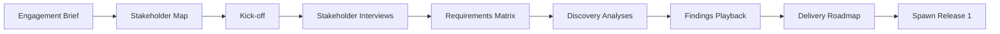
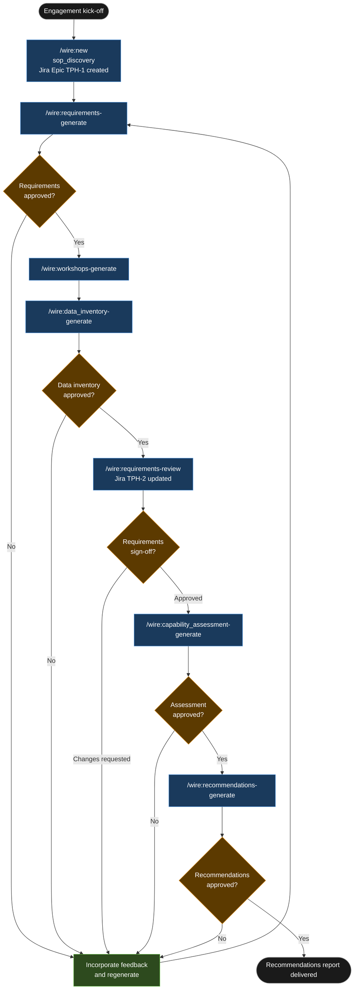

# Tutorial: Discovery (SOP)

## Statement of Work

```
**Rittman Analytics × Thornfield Private Healthcare**  
**Engagement**: Thornfield SOP Discovery  
**Date**: June 2026  
**Type**: Time & materials

### Engagement overview

Thornfield Private Healthcare is engaging Rittman Analytics for a formal five-day discovery engagement following the Rittman Analytics standard operating procedure. Thornfield operates across three systems — Cliniko, Stripe, and HubSpot — with no analytics layer and no cross-system reporting. This engagement produces a full consulting deliverable: structured stakeholder interviews, a MoSCoW-categorised requirements specification, a data inventory of all three source systems, a capability assessment, and a prioritised recommendations report.

### In scope

- Stakeholder interview guide covering 6 named stakeholders (Clinical Operations Director, 2 Clinic Managers, Billing Administrator, IT Manager, Data Administrator)
- Requirements specification with MoSCoW categorisation, minimum 12 MUST requirements, and all GDPR constraints formally recorded
- Data inventory covering all tables in Cliniko, Stripe, and HubSpot — with row-count estimates, data freshness characteristics, and all cross-system integration points identified
- Capability assessment mapping current vs target state across 5 dimensions: Data Ingestion, Data Transformation, Reporting and Dashboards, Data Governance, Team Capability
- Recommendations report with prioritised recommendations, rationale, effort estimates, and dependencies

### Out of scope

- Any technical build work — no connectors, dbt models, LookML, or dashboards will be produced during this engagement
- Data modelling or schema design for the analytics layer
- GDPR legal review — a separate Data Processing Agreement engagement is recommended prior to build; this discovery engagement records the GDPR constraint but does not constitute legal advice
- System integration or API testing against live Cliniko, Stripe, or HubSpot environments

### Timeline

**Days 1–2 — Requirements and interview preparation**  
Generate requirements specification from Fathom briefing call transcript via [`/wire:requirements-generate`](../reference/commands#discovery--sop--canonical). GDPR constraint CON-1 (pseudonymised patient identifiers, Cliniko as master) recorded automatically. Generate interview guides for all 6 stakeholders via [`/wire:workshops-generate`](../reference/commands#discovery--sop--canonical). Conduct data inventory across Cliniko, Stripe, and HubSpot via `/wire:data_inventory-generate`.

**Day 3 — Stakeholder interviews (offline)**  
Consultant conducts the 6 interviews using the generated guides. Fathom records sessions for transcript analysis in Day 4.

**Day 4 — Capability assessment**  
Generate capability assessment from requirements specification, data inventory, and interview transcripts via `/wire:capability_assessment-generate`. Gap analysis across all 5 dimensions produced and reviewed internally.

**Day 5 — Recommendations, review, and sign-off**  
Generate recommendations report via `/wire:recommendations-generate`. Present for client review and sign-off via `/wire:requirements-review`. Incorporate feedback and close the engagement. Jira Epic TPH-1 and all Task issues updated to reflect final status.

### Key assumptions

- 6 stakeholders are confirmed and available for 45-minute interviews on Day 3 of the engagement
- Admin-level API credentials for Cliniko, Stripe, and HubSpot are made available to Rittman Analytics prior to the data inventory steps on Days 1–2
- The GDPR constraint — no patient identifiers (NHS number, full name, date of birth) in the analytics layer — is confirmed as a hard constraint by the client prior to the engagement start
- Initial briefing call recording is available in Fathom before Day 1; additional call recordings from Days 3–4 interviews are made available within 24 hours of each session
- Output from this engagement feeds into an SOW for a subsequent build engagement; no build work begins until that SOW is separately agreed

### Acceptance criteria

- MoSCoW requirements specification approved by the Clinical Operations Director, with all MUST requirements confirmed or amended
- Data inventory covers all tables across all 3 systems (Cliniko, Stripe, HubSpot) with at least row-count estimates and freshness characteristics for each
- Recommendations report accepted by the CEO within 3 working days of delivery, with all 3 primary recommendations either accepted, modified, or formally deferred with stated rationale

---
```


## What is a Discovery (SOP) release?

The SOP discovery release is the formal alternative to Shape Up. Where Shape Up focuses on appetite and scope, the SOP produces a full consulting deliverable: structured stakeholder interviews with MoSCoW requirements categorisation, a data inventory of every source system, a capability assessment mapping current state to target state, and a written recommendations report the client can use to commission a build engagement or present internally. It takes longer — typically one to two weeks — and produces more artefacts. Use it when the client is buying a consulting engagement, not just a build scoping; when GDPR or other regulatory considerations need to be formally surfaced and documented; or when the scope of the problem is genuinely unknown and multiple competing priorities need to be structured before any technical recommendations can be made.

Wire's Atlassian MCP integration runs automatically during [`/wire:new`](../reference/commands#session-and-management-commands) for SOP discovery releases. It creates a Jira Epic and one Task issue per planned artifact — so from the moment the release is set up, the delivery team and client stakeholders can track progress against a structured issue hierarchy without any manual Jira configuration. Review commands sync artifact status back to Jira as each gate is passed, giving the engagement sponsor a real-time view of what has been completed and what is pending their input.

### High-Level Process



## Engagement overview

| | |
|---|---|
| **Client** | Thornfield Private Healthcare |
| **Sector** | UK private healthcare, 4 clinics, ~800 patients/month |
| **Release type** | `sop_discovery` |
| **Release ID** | `01-thornfield-sop-discovery` |
| **Duration** | 10 days |
| **Key constraint** | GDPR — patient identifiers must not appear in the analytics layer |

Thornfield's clinical operations director wants to understand data flows, reporting gaps, and integration opportunities across three systems — Cliniko for clinic management, Stripe for billing, and HubSpot for patient CRM — before commissioning a data platform. Each system holds a different slice of the patient journey, and none of them currently talk to each other. The analytics layer does not exist. This discovery engagement maps what is there, identifies the integration points, assesses current capability, and produces a concrete set of recommendations the clinical ops director can take to the board.

## Deliverables

| Artifact | Description |
|---|---|
| Stakeholder interview notes | Write-ups for 6 stakeholders with MoSCoW-tagged requirements |
| Requirements specification | Full MoSCoW-categorised requirements with GDPR constraints noted |
| Data inventory | 3 systems, 47 tables, volume and freshness characteristics, 8 integration points |
| Capability assessment | Current vs target state gap analysis across 5 dimensions |
| Recommendations report | Prioritised recommendations with rationale and proposed sequencing |

## Tutorial Playbook

The diagram below is the delivery playbook for this tutorial's scenario. In a live engagement, [`/wire:playbook-generate`](../reference/commands#session-and-management-commands) generates this as a Mermaid-format delivery plan — dependency order, team assignments, and target dates tailored to the specific release.



## Walkthrough

### Engagement setup

:::info[First release in this repository?]

If this is the first release created in a git repository, `/wire:new` will first take you through the steps to set up the overall client engagement — naming the client, setting the engagement context, and configuring any integrations — before scaffolding the release itself. See [Setting up a new engagement](https://docs.rittmananalytics.com/en/latest/docs/getting-started/engagements-releases#setting-up-a-new-engagement) for further details.

:::

```
/wire:new
→ Client: Thornfield Private Healthcare
→ Engagement name: thornfield-sop-discovery
→ Release type: sop_discovery
→ Release ID: 01-thornfield-sop-discovery
→ Branch: feature/thornfield-sop-discovery
→ .wire/releases/01-thornfield-sop-discovery/status.md created
  5 artifacts across 2 phases, all at not_started

→ Atlassian MCP: creating Jira issue hierarchy...
  Epic TPH-1  Thornfield SOP Discovery — created
  Task TPH-2  Requirements specification — created
  Task TPH-3  Data inventory — created
  Task TPH-4  Capability assessment — created
  Task TPH-5  Stakeholder interviews (6 sessions) — created
  Task TPH-6  Recommendations report — created
```

:::info[Issue tracking and document sync]

Wire can sync artifact progress to [Jira](../advanced/issue-tracking#jira-integration) or [Linear](../advanced/issue-tracking#linear-integration) as each generate, validate, and review step completes. With the Jira integration, you can choose between one sub-task per lifecycle step (each moving through its own workflow states) or one ticket per artifact that transitions between issue statuses. Wire can create the Epic and issue hierarchy for you when you run `/wire:new`, or link to an existing one you have already set up.

Generated artifacts can also be replicated to [Confluence](../advanced/document-store#confluence) or [Notion](../advanced/document-store#notion) for client review — review commands pull comments and edits made in the document store back as context before gathering sign-off.

Both integrations are optional. Configure the [Atlassian](../reference/mcp-servers#atlassian), [Linear](../reference/mcp-servers#linear), or [Notion](../reference/mcp-servers#notion) MCP servers in `.claude/settings.json` to enable them.

:::


From this point, the Jira hierarchy is live. The clinical ops director's team can track the engagement in Jira without any additional setup on the client side.

### Requirements — auto-delegated to `discovery-analyst`

```
/wire:requirements-generate 01-thornfield-sop-discovery
→ [auto-delegated to discovery-analyst agent]
→ Fathom context: initial briefing call (2026-06-02, 54 min) pulled

  Clinical ops director: reporting gaps across all 3 systems, no consolidated
  patient journey view, billing reconciliation done manually in spreadsheets,
  HubSpot CRM used for patient comms but not linked to clinical records

→ Generating requirements specification with MoSCoW categorisation...

  ⚠ GDPR constraint flagged during analysis:
  Patient identifiers (NHS number, full name, date of birth) appear in both
  Cliniko and HubSpot. These must not be carried into the analytics layer.
  Adding as a hard constraint: all analytics models must use a pseudonymised
  patient_id only. Cliniko is proposed as the ID master.

  Requirements summary:
    MUST:    12 requirements
    SHOULD:   6 requirements
    COULD:    4 requirements
    WON'T:    3 requirements (explicitly out of scope)

  GDPR constraint recorded as CON-1 in requirements spec.

→ Written to:
  .wire/releases/01-thornfield-sop-discovery/artifacts/requirements/requirements.md
→ Atlassian MCP: TPH-2 status updated → in_progress
```

:::info[Auto-delegation]

When you see `-> [auto-delegated to X agent]`, the main session has routed that command to a [specialist subagent](../advanced/wire-agents#auto-delegation-on-individual-commands) automatically — no extra steps needed. The specialist runs with a focused brief rather than the full engagement context, which typically produces sharper domain-specific output. Review commands (`*-review`) always stay in the main session and require your direct input.

:::

The GDPR constraint emerges from the transcript without the consultant needing to flag it manually. CON-1 — pseudonymised patient identifiers only, Cliniko as the master — is recorded as a hard constraint in the requirements specification and will propagate as context into every subsequent artifact in the release.

### Interview guides — workshops-generate

```
/wire:workshops-generate 01-thornfield-sop-discovery
→ Interview guides generated for 6 stakeholders

  Guide 1 — Clinical Operations Director (60 min)
    Objectives: validate requirements, confirm reporting priorities,
                surface any clinical governance or data access constraints
    Questions: 14 questions across reporting cadence, dashboard use cases,
               patient safety reporting, board-level metrics
    Timebox: 10 / 40 / 10

  Guide 2 — Clinic Manager, Clinic A (45 min)
    Objectives: clinic-level reporting needs, patient scheduling metrics,
                staff utilisation
    Questions: 10 questions on daily operations, current manual workarounds

  Guide 3 — Clinic Manager, Clinic B (45 min)
    Objectives: same as Clinic A; variation in patient mix and specialisms noted

  Guide 4 — Billing Administrator (45 min)
    Objectives: Stripe billing workflow, reconciliation process, reporting gaps
    Questions: 9 questions on billing cycles, write-off rates, invoice disputes

  Guide 5 — IT Manager (30 min)
    Objectives: Cliniko API access, Stripe webhook availability, HubSpot
                connector options, infrastructure and data residency constraints
    Questions: 8 technical questions on API credentials and hosting

  Guide 6 — Data Administrator (30 min)
    Objectives: current data maintenance burden, Excel workbook dependencies,
                ownership of data quality issues
    Questions: 7 questions on existing reports, who maintains them, error frequency

→ Written to: .wire/releases/01-thornfield-sop-discovery/artifacts/workshops/
```

### Data inventory — data_inventory-generate

```
/wire:data_inventory-generate 01-thornfield-sop-discovery
→ [auto-delegated to discovery-analyst agent]
→ Reading: API documentation, system descriptions, interview context

  Data inventory: 3 systems catalogued

  ┌─────────────────────────────────────────────────────────────────┐
  │ CLINIKO (clinic management)                                     │
  │ Tables: 23   Volume: ~180k records (patients + appointments)    │
  │ Freshness: real-time (REST API with webhooks available)         │
  │ Key entities: patients, appointments, practitioners, invoices   │
  │ GDPR note: patient PII in patients table — pseudonymise at      │
  │ extraction layer using Cliniko patient_id as surrogate          │
  ├─────────────────────────────────────────────────────────────────┤
  │ STRIPE (billing)                                                │
  │ Tables: 14   Volume: ~95k records (charges + invoices)          │
  │ Freshness: near-real-time (webhook events, ~2 min lag)          │
  │ Key entities: customers, charges, invoices, subscriptions       │
  │ Integration note: Stripe customer_id must be mapped to Cliniko  │
  │ patient_id — no current link exists between the two systems     │
  ├─────────────────────────────────────────────────────────────────┤
  │ HUBSPOT (patient CRM)                                           │
  │ Tables: 10   Volume: ~22k contact records                       │
  │ Freshness: manual updates, batch sync once per day              │
  │ Key entities: contacts, deals, email sequences, forms           │
  │ Coverage: used for new patient acquisition only; existing        │
  │ patient records not maintained consistently                     │
  └─────────────────────────────────────────────────────────────────┘

  Integration points identified: 8
    IP-1  Cliniko patient_id ↔ Stripe customer_id (no current link — manual match required)
    IP-2  Cliniko invoice_id ↔ Stripe charge_id (partial — ~68% match rate observed)
    IP-3  HubSpot contact_id ↔ Cliniko patient_id (no link — email as fuzzy match key)
    IP-4  Cliniko appointment status → Stripe invoice trigger
    IP-5  Stripe refund events → Cliniko invoice reconciliation
    IP-6  HubSpot deal stage → Cliniko new patient flag
    IP-7  Cliniko practitioner_id → appointment revenue attribution
    IP-8  Stripe subscription status → patient active/inactive flag

→ Written to:
  .wire/releases/01-thornfield-sop-discovery/artifacts/data_inventory/data_inventory.md
→ Atlassian MCP: TPH-3 status updated → in_progress
```

The 68% invoice match rate on integration point IP-2 is a material finding. It surfaces here, in the data inventory, before any modelling decisions are made — exactly where it needs to be to inform the recommendations report.

### Requirements review — client sign-off

```
/wire:requirements-review 01-thornfield-sop-discovery
→ [main session — review gates stay with the consultant]
→ Fathom context: requirements review call with clinical ops director
  (2026-06-09, 31 min) pulled

  Client approved MoSCoW requirements with no changes.

  Final requirements count:
    MUST:    12  (clinical reporting, billing reconciliation, GDPR compliance)
    SHOULD:   6  (practitioner utilisation, patient satisfaction, cohort analysis)
    COULD:    4  (predictive no-show modelling, automated referral tracking)
    WON'T:   3  (real-time clinical alerts, integration with NHS systems,
                  mobile app)

→ requirements.md status: approved
→ Atlassian MCP: TPH-2 status updated → done
```

### Capability assessment — capability_assessment-generate

```
/wire:capability_assessment-generate 01-thornfield-sop-discovery
→ [auto-delegated to discovery-analyst agent]
→ Reading: requirements.md, data_inventory.md, interview workshop notes

  Capability assessment: current vs target state across 5 dimensions

  DIMENSION 1 — Data Ingestion
  Current:  Manual CSV exports from Cliniko weekly; no Stripe or HubSpot automation
  Target:   Automated connectors for all 3 systems, daily refresh minimum
  Gap:      HIGH — no existing ingestion infrastructure; requires full connector build

  DIMENSION 2 — Data Transformation
  Current:  Excel formulas, manual reconciliation spreadsheets, no version control
  Target:   dbt project with staging → integration → warehouse layers
  Gap:      HIGH — no transformation layer exists; greenfield build required

  DIMENSION 3 — Reporting and Dashboards
  Current:  3 static Excel reports emailed weekly; no self-service capability
  Target:   Self-service dashboards covering clinical, billing, and CRM domains
  Gap:      HIGH — no BI tooling currently deployed

  DIMENSION 4 — Data Governance
  Current:  No data dictionary, no lineage documentation, no GDPR data register
  Target:   Documented lineage, pseudonymisation at source, access controls
  Gap:      MEDIUM — GDPR constraint (CON-1) must be addressed at build outset

  DIMENSION 5 — Team Capability
  Current:  No dedicated data resource; IT manager handles ad-hoc requests
  Target:   Part-time data analyst to own platform post-handover
  Gap:      MEDIUM — platform will require a named owner before go-live

→ Written to:
  .wire/releases/01-thornfield-sop-discovery/artifacts/capability_assessment/capability_assessment.md
→ Atlassian MCP: TPH-4 status updated → in_progress
```

### Recommendations — recommendations-generate

```
/wire:recommendations-generate 01-thornfield-sop-discovery
→ [auto-delegated to discovery-analyst agent]
→ Reading: all approved artifacts, data_inventory.md, capability_assessment.md

  Recommendations report: 3 primary recommendations

  REC-1  Implement a single patient ID across all 3 systems using Cliniko
         as the master record
  ────────────────────────────────────────────────────────────────────────
  Rationale: Integration points IP-1, IP-2, and IP-3 all require a
  cross-system patient identifier that does not currently exist. Without
  it, billing reconciliation and the consolidated patient journey view
  (FR-1 MUST) cannot be built reliably. The ~68% Stripe invoice match
  rate (IP-2) confirms the data quality risk of relying on fuzzy matching.
  Cliniko holds the authoritative patient record and has the most complete
  coverage across all 4 clinics.
  Effort: Low — requires a one-time mapping exercise in Week 1 of the
  build engagement; does not require changes to any source system.

  REC-2  Stage 1 build: Cliniko + Stripe integration only
  ────────────────────────────────────────────────────────────────────────
  Rationale: HubSpot coverage of existing patient records is inconsistent
  (contact records not maintained post-acquisition). Including HubSpot in
  Stage 1 would add integration complexity without adding reporting value
  for the MUST requirements. HubSpot integration should be deferred to
  Stage 2 once Cliniko and Stripe data are clean and validated.
  Effort: Defers ~3 stories and 1 integration point to Stage 2; reduces
  Stage 1 delivery risk materially.

  REC-3  Hire a part-time data analyst before platform go-live
  ────────────────────────────────────────────────────────────────────────
  Rationale: Capability assessment Dimension 5 identifies team capability
  as a medium gap. The IT manager cannot maintain a dbt + BI platform
  alongside existing infrastructure responsibilities. Without a named
  owner, the platform will degrade within 6 months of handover.
  Recommendation: Recruit a part-time (0.5 FTE) data analyst to start
  no later than Week 4 of the build engagement, to shadow delivery and
  own the platform at go-live.

→ Written to:
  .wire/releases/01-thornfield-sop-discovery/artifacts/recommendations/recommendations.md
→ Atlassian MCP: TPH-6 status updated → in_progress
```

## What was produced

| Artifact | Location | Status |
|---|---|---|
| Requirements specification | `.wire/releases/01-thornfield-sop-discovery/artifacts/requirements/requirements.md` | Approved — 12 MUST, 6 SHOULD, 4 COULD, 3 WON'T |
| Stakeholder interview guides | `.wire/releases/01-thornfield-sop-discovery/artifacts/workshops/` | 6 guides, 6 stakeholders |
| Data inventory | `.wire/releases/01-thornfield-sop-discovery/artifacts/data_inventory/data_inventory.md` | 3 systems, 47 tables, 8 integration points |
| Capability assessment | `.wire/releases/01-thornfield-sop-discovery/artifacts/capability_assessment/capability_assessment.md` | 5 dimensions; 3 HIGH gaps, 2 MEDIUM |
| Recommendations report | `.wire/releases/01-thornfield-sop-discovery/artifacts/recommendations/recommendations.md` | 3 recommendations with rationale |
| Jira Epic | TPH-1 — 5 Task issues, all updated | Tracked throughout |
