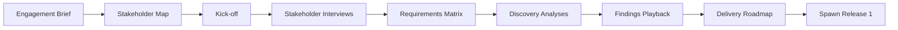

# Tutorial: Discovery (SOP)

## Statement of Work

```
**Rittman Analytics × Thornfield Private Healthcare**  
**Engagement**: Thornfield SOP Discovery  
**Date**: June 2026  
**Type**: Time & materials

### Engagement overview

Thornfield Private Healthcare is engaging Rittman Analytics for a formal discovery engagement following the Rittman Analytics Canonical (SOP) discovery methodology. Thornfield operates across three systems — Cliniko, Stripe, and HubSpot — with no analytics layer and no cross-system reporting. This engagement runs structured stakeholder interviews against a mandatory four-tag classification scheme, consolidates the tagged findings into a requirements matrix, produces three diagnostic analyses (Analytics Hierarchy of Needs, People/Process/Technology, and a Data Analytics Maturity Curve pin), and exits through a sponsor-facing Findings Playback that gates a delivery roadmap for the subsequent build engagement.

### In scope

- Engagement brief and stakeholder map covering 6 named stakeholders (Clinical Operations Director as sponsor, 2 Clinic Managers, Billing Administrator, IT Manager, Data Administrator)
- Structured interviews for all 6 stakeholders, each theme tagged against all four closed classification sets (domain, type, hierarchy tier, and People/Process/Technology axis)
- A requirements matrix consolidating every tagged theme into de-duplicated, sourced requirements with MoSCoW and phase assigned
- The three discovery analyses: Analytics Hierarchy of Needs, People/Process/Technology diagnosis, and a Data Analytics Maturity Curve pin
- A Findings Playback deck presented to the Clinical Operations Director as sponsor, with the 7-item Sponsor Validation Checklist captured on record
- A Delivery Roadmap presenting Build / Pair / Coach options for the Release 1 build engagement

### Out of scope

- Any technical build work — no connectors, dbt models, LookML, or dashboards will be produced during this engagement
- Data modelling or schema design for the analytics layer — that begins in Release 1, spawned from this discovery
- GDPR legal review — a separate Data Processing Agreement engagement is recommended prior to build; this discovery engagement records the GDPR constraint but does not constitute legal advice
- System integration or API testing against live Cliniko, Stripe, or HubSpot environments

### Timeline

**Days 1–2 — Engagement brief and stakeholder map**  
Generate the engagement brief from the signed SoW and initial Fathom briefing call. GDPR is recorded as a known constraint at this stage. Generate the stakeholder map for all 6 stakeholders and confirm P0/P1/P2 priority and interview booking owners with the engagement lead.

**Day 3 — Kick-off**  
Kick-off deck generated and reviewed internally, then presented to the Clinical Operations Director alongside the stakeholder map for sign-off.

**Days 4–6 — Stakeholder interviews**  
Consultant conducts all 6 interviews using Fathom to record each session. Every theme bullet is tagged against all four closed sets as the write-up is produced; `stakeholder-interview-validate --all` checks tag completeness and stakeholder-map coverage before requirements-matrix generation is allowed to start.

**Days 7–8 — Requirements matrix and discovery analyses**  
Tagged themes are consolidated into the requirements matrix, then the three discovery analyses are generated: Hierarchy of Needs, PPT diagnosis, and the Maturity Curve pin. MoSCoW and phase get assigned onto the matrix at this stage, not before.

**Days 9–10 — Findings Playback, sponsor sign-off, and Delivery Roadmap**  
The Findings Playback deck is generated and presented live to the Clinical Operations Director. The engagement is only `approved` once all 7 items on the Sponsor Validation Checklist are confirmed `true` on the call. The Delivery Roadmap is generated immediately after, presenting Build / Pair / Coach options for Release 1, which is then spawned as a `full_platform` release.

### Key assumptions

- All 6 stakeholders are confirmed and available for interviews within the Days 4–6 window
- The GDPR constraint — no patient identifiers (NHS number, full name, date of birth) permitted in the analytics layer — is confirmed as a hard constraint by the client prior to engagement start, and is recorded in the engagement brief's Known Constraints field
- Initial briefing call recording is available in Fathom before Day 1; each interview's recording is available in Fathom within 24 hours of that session
- The Clinical Operations Director is available, as sponsor, for the Findings Playback session on Day 9 or 10 — this session cannot be represented by a delegate, since the Sponsor Validation Checklist requires the sponsor's own verbal confirmation
- Release 1 does not begin until a separate SOW for the build engagement is agreed; this discovery produces the scoping basis for that SOW, not the SOW itself

### Acceptance criteria

- Every stakeholder interview write-up passes `stakeholder-interview-validate --all` with zero tag failures
- Requirements matrix covers all 6 domains represented in the interviews, every row sourced back to a verbatim interview quote, and MoSCoW/phase populated for every row (no `TBD` remaining)
- All 7 items on the Sponsor Validation Checklist confirmed `true` by the Clinical Operations Director on the Findings Playback call, on record in `playback_meeting_notes.md`
- Delivery Roadmap accepted with a named preferred delivery option (Build, Pair, or Coach) within 3 working days of the playback

---
```


## What is a Discovery (SOP) release?

The SOP discovery release is the formal Rittman Analytics Canonical discovery methodology — the structured alternative to a Shape Up discovery. Rather than scoping a single bet, it produces a full diagnostic: stakeholder interviews classified against a mandatory four-tag scheme, a consolidated requirements matrix, and three named analyses (an Analytics Hierarchy of Needs distribution, a People/Process/Technology diagnosis, and a single Data Analytics Maturity Curve pin) that together tell the sponsor, in their own language, what's actually going on. It exits through a live Findings Playback presented to the sponsor, gated by a 7-item Sponsor Validation Checklist that has to be confirmed `true` on the call before the release can spawn any delivery work. Use it when the client is buying a genuine consulting engagement rather than just build scoping, when the problem is wide enough that multiple stakeholders' competing priorities need to be reconciled before any technical recommendation is credible, or when a regulatory constraint like GDPR needs to be formally surfaced and carried forward rather than discovered mid-build.

Wire's Atlassian MCP integration runs automatically during [`/wire:new`](../reference/commands#session-and-management-commands) for SOP discovery releases. It creates a Jira Epic and one Task issue per planned artifact — so from the moment the release is set up, the delivery team and client stakeholders can track progress against a structured issue hierarchy without any manual Jira configuration. Review commands sync artifact status back to Jira as each gate is passed, giving the engagement sponsor a real-time view of what has been completed and what is pending their input.

### High-Level Process


```mermaid
graph LR
    EB["Engagement Brief"]
    SM["Stakeholder Map"]
    KO["Kick-off"]
    SI["Stakeholder Interviews"]
    RM["Requirements Matrix"]
    DA["Discovery Analyses"]
    FP["Findings Playback"]
    DR["Delivery Roadmap"]
    RS["Spawn Release 1"]

    EB --> SM --> KO --> SI --> RM --> DA --> FP --> DR --> RS
```

## Engagement overview

| | |
|---|---|
| **Client** | Thornfield Private Healthcare |
| **Sector** | UK private healthcare, 4 clinics, ~800 patients/month |
| **Release type** | `sop_discovery` |
| **Release ID** | `01-thornfield-sop-discovery` |
| **Duration** | 10 days |
| **Key constraint** | GDPR — patient identifiers must not appear in the analytics layer |

Thornfield's clinical operations director wants to understand data flows, reporting gaps, and integration opportunities across three systems — Cliniko for clinic management, Stripe for billing, and HubSpot for patient CRM — before commissioning a data platform. Each system holds a different slice of the patient journey, and none of them currently talk to each other. The analytics layer does not exist. This discovery engagement classifies what every stakeholder actually needs, diagnoses where the underlying maturity gaps are, and produces a sponsor-endorsed roadmap the clinical ops director can take to the board.

## Deliverables

| Artifact | Description |
|---|---|
| Engagement brief | Problem statement, sponsor, scope, GDPR constraint recorded as CON-1 |
| Stakeholder map | 6 stakeholders, priority (P0/P1/P2), influence/interest, booking owners |
| Kick-off deck | Presented to the sponsor alongside the stakeholder map for sign-off |
| Stakeholder interview write-ups | 6 write-ups, every theme tagged against all four closed sets |
| Requirements matrix | De-duplicated, sourced requirements with MoSCoW and phase assigned |
| Discovery analyses | Hierarchy of Needs distribution, PPT diagnosis, Maturity Curve pin |
| Findings Playback deck + Sponsor Validation Checklist | Presented live; all 7 checklist items confirmed on record |
| Delivery Roadmap | Build / Pair / Coach options, Release 1 scope, discovery exit checklist |

## Tutorial Playbook

The diagram below is the delivery playbook for this tutorial's scenario. In a live engagement, [`/wire:playbook-generate`](../reference/commands#session-and-management-commands) generates this as a Mermaid-format delivery plan — dependency order, team assignments, and target dates tailored to the specific release.


```mermaid
flowchart TD

START([Engagement kick-off]):::event

SETUP["/wire:new\nsop_discovery\nJira Epic TPH-1 created"]:::wireCmd
EB["/wire:engagement-brief-generate"]:::wireCmd
EBGATE{"Engagement brief\napproved? (internal)"}:::decision
SM["/wire:stakeholder-map-generate"]:::wireCmd
SMGATE{"Stakeholder map\napproved?"}:::decision
KO["/wire:kickoff-generate"]:::wireCmd
SI["/wire:stakeholder-interview-generate\n×6 stakeholders"]:::wireCmd
SIVAL["/wire:stakeholder-interview-validate --all"]:::wireCmd
SIGATE{"All tags valid,\ncoverage complete?"}:::decision
SIFIX["Fix tag errors,\nfill coverage gaps"]:::offline
SIREV["/wire:stakeholder-interview-review\n(per stakeholder)"]:::wireCmd
RM["/wire:requirements-matrix-generate"]:::wireCmd
RMGATE{"Matrix\napproved?"}:::decision
DA["/wire:discovery-analyses-generate"]:::wireCmd
DAGATE{"Analyses\napproved?"}:::decision
FP["/wire:findings-playback-generate"]:::wireCmd
FPMEET["/wire:findings-playback-review\n(live sponsor playback)"]:::wireCmd
FPGATE{"All 7 checklist\nitems = true?"}:::decision
FPFOLLOWUP["Schedule sponsor\nfollow-up session"]:::offline
DR["/wire:delivery-roadmap-generate"]:::wireCmd
DRGATE{"Roadmap\napproved?"}:::decision
RS["/wire:release-spawn"]:::wireCmd
END([Release 1 spawned]):::event

START --> SETUP --> EB --> EBGATE
EBGATE -->|No| EB
EBGATE -->|Yes| SM --> SMGATE
SMGATE -->|No| SM
SMGATE -->|Yes| KO --> SI --> SIVAL --> SIGATE
SIGATE -->|No| SIFIX --> SI
SIGATE -->|Yes| SIREV --> RM --> RMGATE
RMGATE -->|No| RM
RMGATE -->|Yes| DA --> DAGATE
DAGATE -->|No| DA
DAGATE -->|Yes| FP --> FPMEET --> FPGATE
FPGATE -->|Not all true| FPFOLLOWUP --> FPMEET
FPGATE -->|All true| DR --> DRGATE
DRGATE -->|No| DR
DRGATE -->|Yes| RS --> END

classDef wireCmd fill:#1a3a5c,stroke:#4a90d9,color:#fff
classDef offline fill:#2d4a1e,stroke:#6abf4b,color:#fff
classDef decision fill:#5c3a00,stroke:#d98c1a,color:#fff
classDef event fill:#1a1a1a,stroke:#888,color:#fff
```

## Walkthrough

### Engagement setup

:::info[First release in this repository?]

If this is the first release created in a git repository, `/wire:new` will first take you through the steps to set up the overall client engagement — naming the client, setting the engagement context, and configuring any integrations — before scaffolding the release itself. See [Setting up a new engagement](https://docs.rittmananalytics.com/en/latest/docs/getting-started/engagements-releases#setting-up-a-new-engagement) for further details.

:::

```
/wire:new
→ Client: Thornfield Private Healthcare
→ Engagement name: thornfield-sop-discovery
→ Release type: sop_discovery
→ Release ID: 01-thornfield-sop-discovery
→ Branch: feature/thornfield-sop-discovery
→ .wire/releases/01-thornfield-sop-discovery/status.md created
  7 artifacts across 7 phases, all at not_started

→ Atlassian MCP: creating Jira issue hierarchy...
  Epic TPH-1  Thornfield SOP Discovery — created
  Task TPH-2  Engagement brief — created
  Task TPH-3  Stakeholder map — created
  Task TPH-4  Stakeholder interviews (6 sessions) — created
  Task TPH-5  Requirements matrix — created
  Task TPH-6  Discovery analyses — created
  Task TPH-7  Findings Playback — created
  Task TPH-8  Delivery roadmap — created
```

:::info[Issue tracking and document sync]

Wire can sync artifact progress to [Jira](../advanced/issue-tracking#jira-integration) or [Linear](../advanced/issue-tracking#linear-integration) as each generate, validate, and review step completes. With the Jira integration, you can choose between one sub-task per lifecycle step (each moving through its own workflow states) or one ticket per artifact that transitions between issue statuses. Wire can create the Epic and issue hierarchy for you when you run `/wire:new`, or link to an existing one you have already set up.

Generated artifacts can also be replicated to [Confluence](../advanced/document-store#confluence) or [Notion](../advanced/document-store#notion) for client review — review commands pull comments and edits made in the document store back as context before gathering sign-off.

Both integrations are optional. Configure the [Atlassian](../reference/mcp-servers#atlassian), [Linear](../reference/mcp-servers#linear), or [Notion](../reference/mcp-servers#notion) MCP servers in `.claude/settings.json` to enable them.

:::

From this point, the Jira hierarchy is live. The clinical ops director's team can track the engagement in Jira without any additional setup on the client side.

### Engagement brief — auto-delegated to `discovery-analyst`

```
/wire:engagement-brief-generate 01-thornfield-sop-discovery
→ [auto-delegated to discovery-analyst agent]
→ Fathom context: initial briefing call (2026-06-02, 54 min) pulled

  Clinical ops director: reporting gaps across all 3 systems, no consolidated
  patient journey view, billing reconciliation done manually in spreadsheets,
  HubSpot CRM used for patient comms but not linked to clinical records

→ Generating engagement brief...

  Client: Thornfield Private Healthcare
  Sponsor: Clinical Operations Director — personal success: "walk into the
           Q3 board meeting with one number for patient volume, not three"
  Problem statement: "We have three systems that don't talk to each other
                       and I can't get a straight answer on patient volume
                       or revenue without someone manually reconciling
                       spreadsheets for two days."
  Desired outcome: "A single, trusted view of clinic activity and revenue
                     that doesn't require manual reconciliation."
  In-scope domains: clinical, billing, crm, governance
  Known constraints: GDPR — patient identifiers (NHS number, full name,
                      date of birth) must not appear in the analytics layer
                      (CON-1)
  Known risks: Cliniko/Stripe/HubSpot have no existing cross-system link

  Pre-discovery checklist: 9/9 complete

→ Written to:
  .wire/releases/01-thornfield-sop-discovery/planning/engagement_brief.md
→ Atlassian MCP: TPH-2 status updated → in_progress
```

:::info[Auto-delegation]

When you see `-> [auto-delegated to X agent]`, the main session has routed that command to a [specialist subagent](../advanced/wire-agents#auto-delegation-on-individual-commands) automatically — no extra steps needed. The specialist runs with a focused brief rather than the full engagement context, which typically produces sharper domain-specific output. Review commands (`*-review`) always stay in the main session and require your direct input.

:::

```
/wire:engagement-brief-validate 01-thornfield-sop-discovery
→ Problem statement: one sentence, client's own words — PASS
→ Desired outcome: business-outcome framed, not deliverable-framed — PASS
→ Out-of-scope: populated (most commonly skipped field) — PASS
→ Sponsor: has a personal-success line, not just a title — PASS
→ PASS — no blocking findings

/wire:engagement-brief-review 01-thornfield-sop-discovery
→ [main session — internal review, Head of Delivery]
→ Approved, 2026-06-03
→ Atlassian MCP: TPH-2 status updated → done
```

The GDPR constraint (CON-1) is captured here, at the very first artifact in the release, from the initial briefing call transcript alone. It will be carried forward as known context into the stakeholder map, every interview, and eventually a specific row of the requirements matrix — never re-discovered from scratch downstream.

### Stakeholder map

```
/wire:stakeholder-map-generate 01-thornfield-sop-discovery
→ [auto-delegated to discovery-analyst agent]
→ Reading: engagement_brief.md, SoW named stakeholders, HubSpot contacts

  Stakeholder map: 6 stakeholders

  | Slug                    | Role                        | Priority | Booking owner |
  |-------------------------|------------------------------|----------|----------------|
  | rebecca-forsyth         | Clinical Operations Director | P0 (sponsor) | RA lead |
  | daniel-osei             | Clinic Manager, Clinic A    | P1       | RA lead |
  | priya-chandra           | Clinic Manager, Clinic B    | P1       | RA lead |
  | mark-whitfield          | Billing Administrator       | P1       | RA lead |
  | susan-idowu             | IT Manager                  | P1       | RA lead |
  | tom-blakeley            | Data Administrator          | P2       | RA lead |

  Coverage check: clinical (2), billing (1), crm (1), governance (1 — IT
  Manager also covers data residency/access questions) — all 4 in-scope
  domains have ≥1 P0/P1. Sponsor is P0. P0+P1 count = 5, within range for
  a multi-domain engagement.

→ Written to:
  .wire/releases/01-thornfield-sop-discovery/planning/stakeholder_map.md
→ Atlassian MCP: TPH-3 status updated → in_progress
```

```
/wire:stakeholder-map-validate 01-thornfield-sop-discovery → PASS

/wire:stakeholder-map-review 01-thornfield-sop-discovery
→ [main session — first sponsor-facing review of the release]
→ Approved with additions by Rebecca Forsyth: add Tom Blakeley (Data
  Administrator) as P1, not P2 — "he's the one who actually maintains the
  workbooks, he needs a proper slot, not a time-permitting one"
→ Atlassian MCP: TPH-3 status updated → done
```

### Kick-off

```
/wire:kickoff-generate 01-thornfield-sop-discovery
→ Reading: engagement_brief.md (approved), stakeholder_map.md (approved)
→ Populating kick-off deck from the SOP discovery template
→ Written to: .wire/releases/01-thornfield-sop-discovery/artifacts/kickoff-deck.html

/wire:kickoff-review 01-thornfield-sop-discovery
→ [main session — internal pre-client review]
→ Approved, ready to present alongside the stakeholder map
```

### Stakeholder interviews — the mandatory four-tag rule

```
/wire:stakeholder-interview-generate 01-thornfield-sop-discovery --stakeholder mark-whitfield
→ [auto-delegated to discovery-analyst agent]
→ Fathom context: interview with Mark Whitfield, Billing Administrator
  (2026-06-09, 45 min) pulled

  Themes:
    - #billing #pain #clean #process — "I reconcile Stripe charges against
      Cliniko invoices by hand every Friday, and about a third of the time
      the customer ID just doesn't match anything on the Cliniko side"
    - #billing #kpi #define-track #people — "Nobody has actually agreed
      what counts as a 'write-off' versus a 'pending reconciliation' — I
      made up my own definition two years ago and nobody's corrected me"

→ Written to:
  .wire/releases/01-thornfield-sop-discovery/planning/interviews/mark-whitfield.md
```

Every theme bullet carries exactly one tag from each of four closed sets — domain (open, per-engagement: `#billing`, `#clinical`, `#crm`, `#governance`), type (`#pain` `#requirement` `#kpi` `#risk` `#existing-asset`), hierarchy tier (`#collect` `#clean` `#define-track` `#analyse` `#optimise-predict` — the lowest tier whose absence is actually blocking the stakeholder), and PPT axis (`#people` `#process` `#technology` — whichever axis's absence is causing the problem). Refusing to pick a hierarchy tier or a PPT axis is refusing to diagnose, so the spec doesn't allow it.

The IT Manager's interview is where the GDPR constraint (CON-1) resurfaces on the record, tagged consistently with the rest:

```
/wire:stakeholder-interview-generate 01-thornfield-sop-discovery --stakeholder susan-idowu
→ [auto-delegated to discovery-analyst agent]

  Themes:
    - #governance #risk #clean #process — "Cliniko and HubSpot both hold
      NHS number and full name. If any of that ends up in a dashboard,
      that's a GDPR breach, full stop — there's no data governance process
      that catches this today"

→ Written to:
  .wire/releases/01-thornfield-sop-discovery/planning/interviews/susan-idowu.md
```

After all 6 write-ups exist, `--all` checks tag completeness across every file and cross-references the stakeholder map:

```
/wire:stakeholder-interview-validate 01-thornfield-sop-discovery --all
→ Checking tag completeness across 6 interview files...

  | File               | Theme bullets | Fully tagged | Missing tag | Uncertain (?) | Result |
  |--------------------|---------------|--------------|-------------|-----------------|--------|
  | rebecca-forsyth.md | 5             | 5            | —           | —               | ✅     |
  | daniel-osei.md     | 4             | 3            | Hierarchy   | —               | ❌     |
  | priya-chandra.md   | 4             | 4            | —           | 1 (#process?)   | ⚠️     |
  | mark-whitfield.md  | 6             | 6            | —           | —               | ✅     |
  | susan-idowu.md     | 5             | 5            | —           | —               | ✅     |
  | tom-blakeley.md    | 4             | 4            | —           | —               | ✅     |

  Failures:
    daniel-osei.md, theme 3: "#clinical #pain #people" — missing Hierarchy
    tier. Zero tags from the Hierarchy set on this line.

  Warnings:
    priya-chandra.md, theme 2: "#clinical #pain #define-track #process?"
    — uncertain PPT tag, confirm before review.

  Coverage: all 6 stakeholder-map rows have a matching interview file.

→ FAIL — 1 tag error must be fixed before requirements-matrix can proceed
```

```
[Consultant reviews the Daniel Osei transcript, confirms the missing tier]
/wire:stakeholder-interview-generate 01-thornfield-sop-discovery --stakeholder daniel-osei
→ Theme 3 corrected: "#clinical #pain #clean #people" — appointment records
  get manually corrected after the fact because nobody owns data quality
  for the scheduling system

/wire:stakeholder-interview-validate 01-thornfield-sop-discovery --all
→ PASS — 6/6 fully tagged, 1 uncertain tag confirmed, coverage complete
```

```
/wire:stakeholder-interview-review 01-thornfield-sop-discovery --stakeholder mark-whitfield
→ [main session — internal peer review, not sponsor-facing]
→ Checked: tag classification matches the bullet; the "write-off" theme is
  a genuine KPI gap, not a workaround disguised as a requirement; the
  reconciliation quote does real diagnostic work
→ Approved
# ... repeated for the remaining 5 stakeholders
→ Atlassian MCP: TPH-4 status updated → done
```

### Requirements matrix

```
/wire:requirements-matrix-generate 01-thornfield-sop-discovery
→ [auto-delegated to discovery-analyst agent]
→ Reading: 6 interview files (all validated), engagement_brief.md,
  stakeholder_map.md

  Harvesting tagged themes, de-duplicating near-identical bullets across
  stakeholders...

  R-BILLING-01   Billing    #pain #clean #process     Cliniko/Stripe
                 customer ID mismatch — 2 sources, sponsor_backing: N
  R-BILLING-02   Billing    #kpi #define-track #people  No agreed
                 write-off definition — 1 source
  R-CLINICAL-01  Clinical   #pain #clean #people      Manual appointment
                 record correction — 1 source
  R-GOVERNANCE-01 Governance #risk #clean #process    GDPR — no process
                 catching PII reaching the analytics layer — 2 sources
                 (IT Manager, Clinical Ops Director), sponsor_backing: Y
  ...

  MoSCoW and Phase columns: TBD (assigned in discovery-analyses, not here)

  Conflicts log: none found requiring escalation this round.

→ Written to:
  .wire/releases/01-thornfield-sop-discovery/planning/requirements_matrix.md
```

```
/wire:requirements-matrix-validate 01-thornfield-sop-discovery
→ Req ID format and uniqueness — PASS
→ Every quote verifiable verbatim in its source interview — PASS
→ MoSCoW/Phase still TBD at this stage (expected) — PASS
→ Every interview file contributes ≥1 row — PASS
→ PASS

/wire:requirements-matrix-review 01-thornfield-sop-discovery
→ [main session — internal RA review]
→ Approved, 2026-06-15
→ Atlassian MCP: TPH-5 status updated → done
```

`R-GOVERNANCE-01` is the GDPR constraint's third appearance in this release — first as a known constraint in the engagement brief, then as a tagged theme in the IT Manager's and the sponsor's own interviews, now as a sourced, two-stakeholder requirement with `sponsor_backing: Y`. That backing is exactly what makes it a strong Phase 1 candidate once MoSCoW gets applied in the next step.

### Discovery analyses — the three diagnoses

```
/wire:discovery-analyses-generate 01-thornfield-sop-discovery
→ [auto-delegated to discovery-analyst agent]
→ Reading: requirements_matrix.md (11 rows), all 6 interview write-ups

1. ANALYTICS HIERARCHY OF NEEDS
   Collect: 1   Clean: 6   Define & Track: 2   Analyse: 2   Optimise: 0

   Diagnosis: Six of eleven requirements sit at Clean — the plumbing
   between Cliniko, Stripe, and HubSpot doesn't exist yet, and most of
   what looks like a reporting problem ("I can't get a straight answer
   on patient volume") is actually a data-cleaning and identity-resolution
   problem underneath it. Nothing sits at Optimise — nobody at Thornfield
   is asking a prediction question yet, which is the right place to be
   for a business with no analytics layer at all.

2. PEOPLE / PROCESS / TECHNOLOGY
   People: 2   Process: 7   Technology: 2

   Diagnosis: This is fundamentally a Process problem, not a technology
   gap. The write-off definition (R-BILLING-02) and the GDPR governance
   gap (R-GOVERNANCE-01) are both about the absence of an agreed process
   and owner, not missing tooling. Word cloud: ManualReconciliation,
   NoAgreedDefinitions, NoDataOwner, UntrackedPII, NoQualityGate,
   InformalWorkarounds.

3. DATA ANALYTICS MATURITY CURVE
   Pin: Data Chaos

   Justification: no analytics layer exists at all; every cross-system
   number is produced by manual reconciliation; there is no agreed
   definition for a core billing KPI two years into the current process.
   This is honest, not unkind — every subsequent recommendation is built
   on Thornfield genuinely starting from zero.

4. MOSCOW + PHASE (applied directly onto requirements_matrix.md)
   R-GOVERNANCE-01 → Must, Phase 1  (sponsor-backed, foundational, blocking)
   R-BILLING-01    → Must, Phase 1  (foundational identity-resolution gap)
   R-BILLING-02    → Should, Phase 1
   R-CLINICAL-01   → Should, Phase 2
   ...

5. SPONSOR DECISIONS REQUIRED
   None outstanding — no conflicting stakeholder positions this round.

→ Written to:
  .wire/releases/01-thornfield-sop-discovery/planning/discovery_analyses.md
→ requirements_matrix.md updated: MoSCoW/Phase columns filled, no TBD remaining
```

```
/wire:discovery-analyses-validate 01-thornfield-sop-discovery
→ Distribution counts cross-check against matrix — PASS
→ Diagnosis bullets reference specific verbatim quotes — PASS
→ Maturity pin internally consistent with Hierarchy/PPT distribution — PASS
→ No remaining TBD in requirements_matrix.md — PASS
→ PASS

/wire:discovery-analyses-review 01-thornfield-sop-discovery
→ [main session — internal RA review]
→ Approved, 2026-06-17
→ Atlassian MCP: TPH-6 status updated → done
```

The Data Chaos pin is the moment this discovery earns its fee. It would be easy — and dishonest — to place a more flattering pin. The spec is explicit that the pin has to reflect the evidence, not the client relationship.

### Findings Playback — the sponsor gate

```
/wire:findings-playback-generate 01-thornfield-sop-discovery
→ [auto-delegated to discovery-analyst agent]
→ Reading: discovery_analyses.md (approved), requirements_matrix.md
→ Populating Findings Playback deck (38 slides) from template

  Vision Statement drafted: "Thornfield will have one trusted number for
  patient volume and revenue, refreshed daily, with GDPR-compliant
  pseudonymised identifiers end to end — replacing two days of manual
  reconciliation with a dashboard the board can query directly."

→ Written to:
  .wire/releases/01-thornfield-sop-discovery/playback/findings_playback.html
```

```
/wire:findings-playback-validate 01-thornfield-sop-discovery
→ Slide count 38, in range [28,60] — PASS
→ Cover, Scope & Discovery Process, 3 lens-intro slides, Current State
  divider, Vision Statement, per-axis sections — all present — PASS
→ Vision Statement: 2 paragraphs, each with ≥1 bolded phrase — PASS
→ Required assets present (hierarchy-of-needs.png, ppt-venn.svg,
  maturity-curve.png, fonts) — PASS
→ PASS
```

```
/wire:findings-playback-review 01-thornfield-sop-discovery
→ [main session — the live sponsor playback, presented to Rebecca Forsyth]
→ Fathom recording: Findings Playback session (2026-06-22, 52 min)

  Sponsor Validation Checklist:
    1. Maturity Curve pin agreed .......................... ✅ true
       "Yeah — I mean, it's not comfortable to hear, but yes, that's
       where we are." (Rebecca Forsyth, 00:14:02)
    2. Hierarchy of Needs diagnosis agreed ................. ✅ true
    3. PPT diagnosis agreed ................................ ✅ true
    4. Vision Statement endorsed (both paragraphs) ......... ✅ true
    5. Solution Initiatives confirmed ...................... ✅ true
    6. Preferred Delivery Option named (Build/Pair/Coach) .. ✅ true — Build
       "We don't have anyone in-house who could pair on this. Build it,
       and make sure we can maintain it after." (00:41:17)
    7. Open conflicts resolved (or follow-up scheduled) .... ✅ true — none

→ playback_meeting_notes.md written with all 7 rows
→ sponsor_validation.playback_held: true
→ sponsor_validation.preferred_delivery_option: build
→ Release status: approved (all 7 checklist items true)
→ Atlassian MCP: TPH-7 status updated → done
```

If any of the 7 items had come back `false` or `unclear`, the release would stay at `reviewed` rather than `approved`, and a 30-minute sponsor follow-up session would need to be scheduled before delivery-roadmap generation could proceed. This is deliberately the hardest gate in the whole release — the spec calls the sponsor's verbal sign-off here "the most important artefact in the engagement after the SoW itself."

### Delivery roadmap

```
/wire:delivery-roadmap-generate 01-thornfield-sop-discovery
→ [auto-delegated to discovery-analyst agent]
→ Reading: playback_meeting_notes.md (playback held, Build preferred),
  requirements_matrix.md (MoSCoW/Phase set)

  Release 1 scope (Phase 1 rows): R-GOVERNANCE-01, R-BILLING-01 — 2 rows,
  both Must, both foundational (Clean-tier) — well under the 4-rows-per-
  sprint-week guideline for a single sprint week.

  Delivery Options — Build headlined (sponsor's named preference):

  | Dimension | Build | Pair | Coach |
  |---|---|---|---|
  | What RA delivers | Full implementation: pipelines, dbt models, semantic layer, dashboards | 50–70% of implementation; reviews 100% | Architecture + reference implementations + weekly coaching |
  | What client provides | System access, sponsor time, end-user validation | A named data engineer pairing 3–4 days/week | A full delivery team |
  | Time to value | Fastest | Medium | Slowest |
  | Knowledge transfer | Documentation + recorded sessions | Hands-on, paired | Strongest — client owns delivery |
  | Risk profile | Low delivery risk; medium adoption risk | Medium delivery risk; low adoption risk | High delivery risk; lowest adoption risk |

  Discovery exit checklist: 10/10 complete

→ Written to:
  .wire/releases/01-thornfield-sop-discovery/planning/delivery_roadmap.md
```

```
/wire:delivery-roadmap-validate 01-thornfield-sop-discovery
→ All 3 options present, all dimensions filled — PASS
→ Build headlined as the named preferred option — PASS
→ Every Phase-1 row appears in the breakdown table — PASS
→ PASS

/wire:delivery-roadmap-review 01-thornfield-sop-discovery
→ [main session — sponsor sign-off]
→ Approved by Rebecca Forsyth, Build option confirmed, 2026-06-24
→ Atlassian MCP: TPH-8 status updated → done
```

### Spawning Release 1

```
/wire:release-spawn 01-thornfield-sop-discovery
→ Reading Section 4 (Downstream Releases) of delivery_roadmap.md

  Release 1: Thornfield Foundation Platform — full_platform
  Scope: Cliniko/Stripe identity resolution (R-BILLING-01), GDPR-compliant
  pseudonymised ingestion (R-GOVERNANCE-01), plus the standard full_platform
  lifecycle for BI enablement

→ .wire/releases/02-thornfield-foundation-platform/ created
  status.md created from discovery-status-template.md
  spawned_from: 01-thornfield-sop-discovery

  | Release | Type | Folder | Status |
  |---|---|---|---|
  | Thornfield Foundation Platform | full_platform | 02-thornfield-foundation-platform | Ready |

Next steps:
  /wire:session:start 02-thornfield-foundation-platform
  /wire:requirements-generate 02-thornfield-foundation-platform
```

## What was produced

| Artifact | Location | Status |
|---|---|---|
| Engagement brief | `.wire/releases/01-thornfield-sop-discovery/planning/engagement_brief.md` | Approved — GDPR recorded as CON-1 |
| Stakeholder map | `.wire/releases/01-thornfield-sop-discovery/planning/stakeholder_map.md` | Approved — 6 stakeholders, 1 addition |
| Kick-off deck | `.wire/releases/01-thornfield-sop-discovery/artifacts/kickoff-deck.html` | Approved internally |
| Stakeholder interviews | `.wire/releases/01-thornfield-sop-discovery/planning/interviews/` | 6 write-ups, all fully tagged, all approved |
| Requirements matrix | `.wire/releases/01-thornfield-sop-discovery/planning/requirements_matrix.md` | Approved — 11 rows, MoSCoW/Phase assigned |
| Discovery analyses | `.wire/releases/01-thornfield-sop-discovery/planning/discovery_analyses.md` | Approved — Maturity pin: Data Chaos |
| Findings Playback | `.wire/releases/01-thornfield-sop-discovery/playback/findings_playback.html` | Approved — 7/7 Sponsor Validation Checklist items true |
| Delivery roadmap | `.wire/releases/01-thornfield-sop-discovery/planning/delivery_roadmap.md` | Approved — Build option confirmed |
| Release 1 | `.wire/releases/02-thornfield-foundation-platform/` | Spawned, `full_platform` |
| Jira Epic | TPH-1 — 7 Task issues, all `done` | Tracked throughout |
