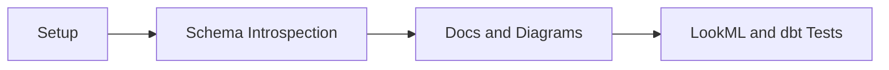
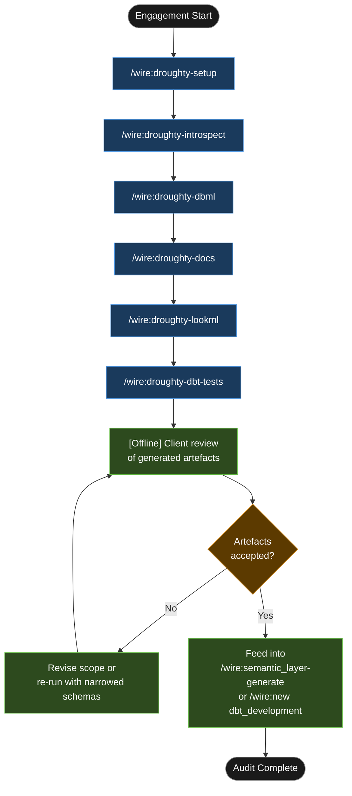

# Tutorial: Droughty Release — Birchfield Capital Management Schema Audit

## Statement of Work

```
**Rittman Analytics × Birchfield Capital Management**
**Engagement**: Snowflake Schema Audit and LookML Generation
**Date**: June 2026
**Type**: Fixed price

### Engagement overview
Birchfield Capital Management operates a 240-table Snowflake warehouse across six schemas — `fund_admin`, `portfolio`, `risk`, `compliance`, `reporting`, and `staging` — with no transformation layer, no column descriptions, and no documented relationships. Rittman Analytics is engaged to produce a complete schema inventory, infer and document entity relationships, generate AI-authored field descriptions for all 1,847 columns, and deliver 240 base LookML views and dbt schema test stubs for the 40 highest-traffic tables. The engagement uses Wire's `droughty` release type in discovery/audit mode — no dbt project is required or in scope.

### In scope
- Schema inventory covering all 240 tables across `fund_admin`, `portfolio`, `risk`, `compliance`, `reporting`, and `staging` — with column counts, estimated row counts, and PK/FK coverage per schema (`schema_inventory.md`)
- DBML entity-relationship diagram with all 186 inferred relationships across all 6 schemas, rendered as `birchfield_dw.dbml`
- AI-generated field descriptions for all 1,847 columns via GPT-4o, with manual review flags (`-- REVIEW REQUIRED`) for the 24 ambiguous columns where column name alone is insufficient
- 240 base LookML view files (one per table) written to `lookml/views/generated/`, with type inference (timestamp, yesno, number, string) and snake_case label generation
- dbt schema test stubs for the 40 highest-traffic tables, identified from Snowflake query history, written to `artifacts/dbt_stubs/schema.yml`

### Out of scope
- dbt project initialisation or deployment — test stubs are ready but not executable without a dbt project; that work belongs to a subsequent `dbt_development` engagement
- LookML explore authoring — base views are generated; explore definitions and joins are the data team's responsibility
- Looker dashboard creation
- Any writes to or modifications of the Snowflake warehouse — this engagement is read-only throughout
- Data quality remediation — issues surfaced by the schema audit (e.g. zero FK declarations in the compliance schema) are documented, not resolved

### Timeline
**Day 1** — Setup (`/wire:droughty-setup`), schema introspection (`/wire:droughty-introspect`), DBML entity-relationship diagram (`/wire:droughty-dbml`). Snowflake service account access must be confirmed before work begins.

**Day 2** — AI field descriptions for all 1,847 columns (`/wire:droughty-docs`, requires OpenAI API key); base LookML view generation for all 240 tables (`/wire:droughty-lookml`).

**Day 3** — dbt schema test stubs for the 40 highest-traffic tables (`/wire:droughty-dbt-tests`); internal review of all artefacts; handover session with Birchfield data team and Looker team lead.

### Key assumptions
- Snowflake service account with `USAGE` on all 6 schemas and `SELECT` on all tables is provided to Rittman Analytics before Day 1; delays in access provision will push the timeline accordingly
- OpenAI API key is provided by Birchfield (or Rittman Analytics can use its own, with costs passed through at cost); without it, the field descriptions step (`/wire:droughty-docs`) cannot run
- Python 3.11 is available on the delivery environment; Droughty v0.20.1 (the Wire-pinned version) is the runtime for all commands
- Birchfield's Looker admin confirms that `lookml/views/generated/` is the correct import target before Day 2 ends, so the LookML step writes to the right location
- Client accepts that dbt test stubs require a dbt project to be initialised before they are executable; no such project is in scope for this engagement

### Acceptance criteria
- Schema inventory covers all 240 tables with no gaps — verified by cross-referencing the `schema_inventory.md` table count against `INFORMATION_SCHEMA.TABLES` for all 6 schemas
- DBML diagram reviewed and accepted by Birchfield's data team lead, with the 31 inferred compliance-schema relationships explicitly acknowledged as unverified
- Sample of 20 LookML views successfully imported into Looker without validation errors (Looker admin to confirm)
- dbt schema test stubs confirmed syntactically valid via a dry-run `dbt parse` on a minimal dbt project scaffolded for the purpose
```


## What is a Droughty release?

Droughty is the bottom-up complement to Wire's top-down, document-driven approach. Where a standard Wire release starts from requirements and drives toward dbt models, Droughty starts from the live warehouse schema and works outward — generating a DBML entity-relationship diagram, AI-authored field descriptions, base LookML views, and dbt schema test stubs directly from `INFORMATION_SCHEMA`. No dbt project is required. The toolkit reads what is actually in the warehouse, not what you intended to put there.

Wire wraps Droughty in two modes. **Discovery/audit mode** maps an existing warehouse with no upstream transformation layer — the target for this tutorial. **Post-dbt mode** assumes a deployed dbt project and generates the base LookML and test layer from already-built models, feeding directly into [`/wire:semantic_layer-generate`](../reference/commands#development--semantic-layer-and-orchestration). Python 3.9–3.12 is required on the consultant's machine for both modes. This tutorial uses the pinned version of Droughty that ships with Wire: **v0.20.1**.

### High-Level Process



## Engagement overview

| | |
|-|-|
| **Client** | Birchfield Capital Management |
| **Industry** | UK alternative investment fund management, ~£800m AUM, 45 staff |
| **Stack** | Snowflake, Looker (existing semantic layer, hand-written views) |
| **Problem** | 240 tables across 6 schemas, no dbt project, no column descriptions, no documented relationships |
| **Release type** | `droughty` — discovery/audit mode |
| **Release ID** | `01-birchfield-droughty-audit` |

Birchfield built their Snowflake warehouse 18 months ago without a transformation layer. The data team has been writing Looker views by hand — a workable approach for the first 30 tables, but the catalogue has since grown to 240. There are no field descriptions, no documented FK relationships, and no schema tests. The compliance and risk schemas in particular have accumulated tables whose purpose is unclear even to the people who created them. The immediate ask: produce an inventory, document what exists, and give the Looker team a generated starting point so they stop writing base views from scratch.

## Deliverables

| Deliverable | Format | Location |
|---|---|---|
| Schema inventory | `schema_inventory.md` | `.wire/releases/01-birchfield-droughty-audit/artifacts/` |
| DBML entity-relationship diagram | `.dbml` | `.wire/releases/01-birchfield-droughty-audit/artifacts/` |
| AI-generated field descriptions | Injected into `schema_inventory.md` | Same directory |
| Base LookML views (one per table) | 240 `.view.lkml` files | `lookml/views/generated/` |
| dbt schema test stubs | `schema.yml` entries | `.wire/releases/01-birchfield-droughty-audit/artifacts/dbt_stubs/` |

## Tutorial Playbook

The diagram below is the delivery playbook for this tutorial's scenario. In a live engagement, [`/wire:playbook-generate`](../reference/commands#session-and-management-commands) generates this as a Mermaid-format delivery plan — dependency order, team assignments, and target dates tailored to the specific release.



## Walkthrough

### Step 1 — Setup

:::info[First release in this repository?]

If this is the first release created in a git repository, `/wire:droughty-setup` will first take you through the steps to set up the overall client engagement — naming the client, setting the engagement context, and configuring any integrations — before scaffolding the release itself. See [Setting up a new engagement](https://docs.rittmananalytics.com/en/latest/docs/getting-started/engagements-releases#setting-up-a-new-engagement) for further details.

:::

```
/wire:droughty-setup 01-birchfield-droughty-audit
→ Installing Droughty v0.20.1 (pinned)
→ Generating ~/.droughty/profile.yaml (Snowflake connection)
→ Generating droughty_project.yaml at git root
→ Setup complete — 6 schemas in scope
```

:::info[Issue tracking and document sync]

Wire can sync artifact progress to [Jira](../advanced/issue-tracking#jira-integration) or [Linear](../advanced/issue-tracking#linear-integration) as each generate, validate, and review step completes. With the Jira integration, you can choose between one sub-task per lifecycle step (each moving through its own workflow states) or one ticket per artifact that transitions between issue statuses. Wire can create the Epic and issue hierarchy for you when you run `/wire:new`, or link to an existing one you have already set up.

Generated artifacts can also be replicated to [Confluence](../advanced/document-store#confluence) or [Notion](../advanced/document-store#notion) for client review — review commands pull comments and edits made in the document store back as context before gathering sign-off.

Both integrations are optional. Configure the [Atlassian](../reference/mcp-servers#atlassian), [Linear](../reference/mcp-servers#linear), or [Notion](../reference/mcp-servers#notion) MCP servers in `.claude/settings.json` to enable them.

:::


The setup command writes two configuration files. `~/.droughty/profile.yaml` holds the Snowflake connection: account identifier, role (`TRANSFORMER`), warehouse (`COMPUTE_WH`), database (`BIRCHFIELD_DW`), and the six schemas in scope — `fund_admin`, `portfolio`, `risk`, `compliance`, `reporting`, `staging`. The `droughty_project.yaml` at the git root records the project name, warehouse type, and an OpenAI API key reference for the docs step. Without the API key, `/wire:droughty-docs` will fail — it is the one step that calls an external LLM.

### Step 2 — Introspect

```
/wire:droughty-introspect 01-birchfield-droughty-audit
→ Querying INFORMATION_SCHEMA across 6 schemas
→ Schema inventory: 240 tables, 1,847 columns
→ schema_inventory.md written
```

The introspect command queries `INFORMATION_SCHEMA.TABLES` and `INFORMATION_SCHEMA.COLUMNS` across the six schemas and produces a machine-readable inventory. The summary table:

| Schema | Tables | Columns | Est. row count | PK coverage |
|---|---|---|---|---|
| `fund_admin` | 47 | 382 | 12.4M | 91% |
| `portfolio` | 38 | 294 | 8.1M | 87% |
| `risk` | 41 | 318 | 5.6M | 84% |
| `compliance` | 52 | 401 | 3.2M | 0% |
| `reporting` | 29 | 224 | 19.7M | 96% |
| `staging` | 33 | 228 | 41.3M | 78% |

The compliance schema finding is immediate and significant. Zero percent explicit FK declarations — all relationships in that schema are inferred from column naming patterns (`_id` suffixes, shared column names across tables) rather than defined constraints. Birchfield's compliance team will need to confirm the inferred relationships before the DBML diagram can be treated as authoritative.

### Step 3 — DBML entity-relationship diagram

```
/wire:droughty-dbml 01-birchfield-droughty-audit
→ Running droughty dbml
→ 240 nodes, 186 inferred relationships across 6 schemas
→ birchfield_dw.dbml written
```

The DBML file is renderable in dbdiagram.io, DataGrip, or any tool that accepts the DBML format. With 240 nodes and 186 relationships, the full diagram is dense — the practical workflow is to filter by schema in the rendering tool. One finding stands out immediately: the `fund_admin` schema forms a particularly dense cluster of 47 tables with tightly interconnected FK relationships. Droughty flags this cluster as a candidate for normalisation review — the relationship density suggests several tables that originated as flat extract targets rather than purpose-designed relational entities.

The compliance schema, as expected from the introspect step, shows 52 nodes with 0 hard-declared relationships and 31 inferred ones. These inferred edges are shown in the DBML with a comment marking them as `-- inferred from column name pattern, unverified`.

### Step 4 — AI field descriptions

```
/wire:droughty-docs 01-birchfield-droughty-audit
→ Generating AI field descriptions for 1,847 columns via GPT-4o
→ Progress: 240/240 tables processed
→ 1,823 descriptions generated (98.7%), 24 flagged as ambiguous
→ Elapsed: 4m 12s
→ schema_inventory.md updated with descriptions
```

The docs step sends column name, table name, schema, and inferred data type to GPT-4o for each column and writes the resulting description back into `schema_inventory.md`. Three examples from the Birchfield inventory:

```
fund_admin.fund_nav.nav_amount
→ "Net asset value of the fund at the pricing date, denominated in the fund's
   base currency. Represents the total market value of holdings less liabilities,
   before fee accruals."

risk.risk_assessment.risk_rating_cd
→ "Enumerated risk rating code assigned to the position. Expected values: L (Low),
   M (Medium), H (High), C (Critical). Populated by the daily risk scoring batch."

compliance.breach_monitoring.is_regulatory_breach
→ "Boolean flag indicating whether the monitored event constitutes a reportable
   regulatory breach under FCA guidelines. True = reportable; False = monitoring
   event only."
```

The 24 ambiguous columns — those where column name alone provided insufficient context — are left blank in `schema_inventory.md` with a `-- REVIEW REQUIRED` marker. In practice, most of these were in the compliance schema: columns with names like `flag_cd`, `ref_val`, and `proc_status` that carry no schema-level documentation and no table comment.

### Step 5 — Base LookML views

```
/wire:droughty-lookml 01-birchfield-droughty-audit
→ Generating base LookML views: 240 tables
→ Type inference applied (timestamp, yesno, number, string)
→ Label generation from snake_case column names
→ 240 .view.lkml files written to lookml/views/generated/
```

Droughty generates one LookML view file per table, applying column-type inference before writing. Timestamp columns become `type: time` with standard timeframes (`raw`, `date`, `week`, `month`, `quarter`, `year`). Boolean columns become `type: yesno`. Numeric columns become `type: number`. Everything else is `type: string`. Labels are generated by converting snake_case to title case — `nav_amount` becomes `Nav Amount`, `is_regulatory_breach` becomes `Is Regulatory Breach`.

An example view for `fund_admin.fund_nav`:

```lookml
view: fund_nav {
  sql_table_name: BIRCHFIELD_DW.fund_admin.fund_nav ;;

  dimension: fund_nav_pk {
    type: string
    primary_key: yes
    sql: ${TABLE}.fund_nav_pk ;;
    label: "Fund Nav Pk"
  }

  dimension: nav_amount {
    type: number
    sql: ${TABLE}.nav_amount ;;
    label: "Nav Amount"
    description: "Net asset value of the fund at the pricing date, denominated in
                  the fund's base currency."
  }

  dimension_group: pricing {
    type: time
    timeframes: [raw, date, week, month, quarter, year]
    sql: ${TABLE}.pricing_ts ;;
    label: "Pricing"
  }

  dimension: fund_id_fk {
    type: string
    sql: ${TABLE}.fund_id_fk ;;
    label: "Fund"
  }

  dimension: is_finalised {
    type: yesno
    sql: ${TABLE}.is_finalised ;;
    label: "Is Finalised"
  }

  measure: count {
    type: count
    label: "Count"
  }
}
```

The AI-generated field descriptions from the docs step are injected as LookML `description` fields where they exist. The 24 ambiguous columns receive no description field in the generated view — a deliberate omission that surfaces them clearly for the Looker developer to handle.

Never hand-edit files in `lookml/views/generated/`. Each re-run of `/wire:droughty-lookml` regenerates them from the warehouse schema. Business logic — calculated fields, custom measures, label overrides — belongs in `lookml/views/extended/` using LookML refinements against the generated base views.

### Step 6 — dbt schema test stubs

```
/wire:droughty-dbt-tests 01-birchfield-droughty-audit
→ Identifying 40 highest-traffic tables by Snowflake query history
→ Generating schema test stubs
→ schema.yml entries written to artifacts/dbt_stubs/
```

Droughty queries Snowflake's `QUERY_HISTORY` view to rank tables by access frequency and generates test stubs for the top 40. These are not executable yet — a dbt project must be initialised before `dbt test` can run against them. They are stubs: a `schema.yml` structure the data team can drop into a future dbt project without writing the boilerplate themselves.

A sample entry for `reporting.investor_position_summary`:

```yaml
models:
  - name: investor_position_summary
    description: "Summary of investor positions by fund and valuation date."
    columns:
      - name: position_summary_pk
        description: "Primary key."
        tests:
          - not_null
          - unique

      - name: fund_id_fk
        description: "Foreign key to fund_admin.fund."
        tests:
          - not_null

      - name: position_status_cd
        description: "Current position status."
        tests:
          - accepted_values:
              values: ['OPEN', 'CLOSED', 'SUSPENDED', 'PENDING']

      - name: valuation_date
        description: "Date of position valuation."
        tests:
          - not_null
```

## What was produced

| Artefact | Count / size |
|---|---|
| Tables inventoried | 240 |
| Columns documented | 1,847 |
| AI field descriptions generated | 1,823 |
| Columns flagged for manual review | 24 |
| DBML relationships mapped | 186 |
| Base LookML views generated | 240 |
| dbt schema test stubs | 40 tables, ~320 test entries |

## Next steps

The generated LookML views in `lookml/views/generated/` give the Birchfield Looker team a working starting point for every table in the warehouse. The practical next move is to run [`/wire:new`](../reference/commands#session-and-management-commands) with release type `dbt_development` to begin a proper transformation layer on top of the Snowflake schema — at which point the generated LookML base views feed directly into `/wire:semantic_layer-generate` as the view layer, replacing the hand-written views the team has been maintaining.

The 24 columns flagged as ambiguous by the docs step warrant a short working session with the compliance team before that transition. The schema test stubs for the top-40 tables are ready to drop into a dbt project the moment one is initialised.
