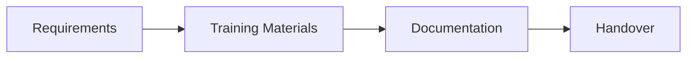
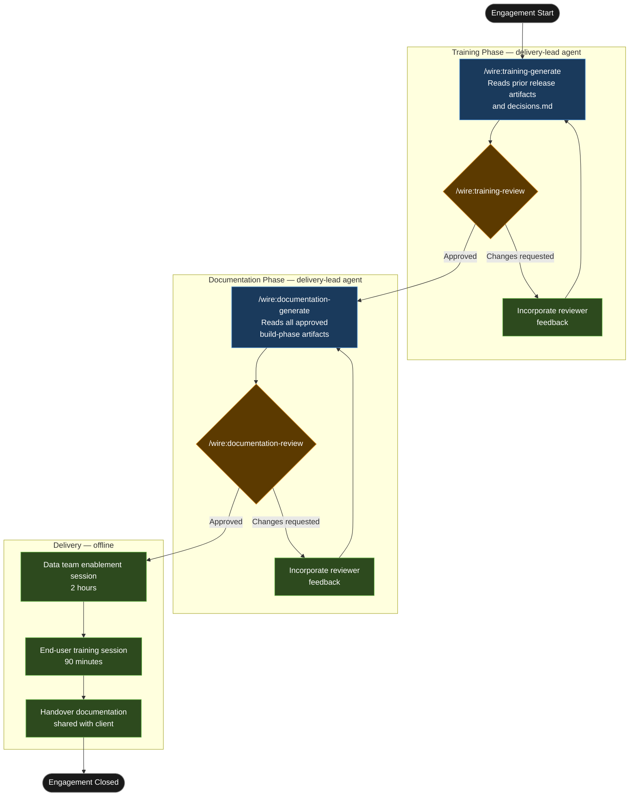

# Tutorial: Enablement

## Statement of Work

```
**Rittman Analytics × Hargreave Insurance Ltd**
**Engagement**: Platform Enablement and Technical Handover
**Date**: June 2026
**Type**: Time and materials

### Engagement overview

Hargreave Insurance Ltd's data platform — delivered under engagement `01-hargreave-platform` six weeks prior — is in production. The data engineering and analyst teams are using it but remain dependent on Rittman Analytics for operational questions and platform changes. This engagement transfers that knowledge formally: structured training sessions for two distinct audiences, and a complete technical documentation pack covering all 19 dbt models, 87 LookML fields, and the operational runbook.

### In scope

- Data team enablement session: 2 hours, 2 attendees (data engineer and analytics engineer), covering dbt Cloud job operations, LookML extension, and the documentation system
- End-user training session: 90 minutes, up to 8 attendees (analysts and business stakeholders), covering dashboard navigation, data freshness interpretation, and the change request process
- Technical documentation pack:
  - Architecture overview (data flow diagram, source-to-dashboard narrative)
  - dbt model reference covering all 19 models: grain, key measures, upstream dependencies, and design decision references
  - dbt Cloud job reference for both `hargreave_scheduled_run` and `hargreave_ci`
  - LookML field catalogue for all 87 measures and dimensions across 5 views
  - Operational runbook: monitoring alerts, on-call steps, rollback procedure, maintenance schedule
- Handover sign-off by the data engineering lead

### Out of scope

- Any changes to deployed dbt models or LookML code
- New dashboard development or metric additions
- Ongoing support retainer (a separate support agreement is recommended following handover)

### Timeline

| Day | Activity |
|---|---|
| Day 1 | Training material generation ([`/wire:training-generate`](../reference/commands#testing-and-deployment)), internal review, and approval |
| Day 2 (morning) | Data team enablement session — 2 hours |
| Day 2 (afternoon) | End-user training session — 90 minutes |
| Day 3 | Documentation pack review ([`/wire:documentation-review`](../reference/commands#testing-and-deployment)), sign-off, engagement close |

### Key assumptions

- The prior full platform build (`01-hargreave-platform`) is complete and in production before this engagement begins
- All approved artifacts and `decisions.md` from `01-hargreave-platform` are accessible to the `delivery-lead` agent
- The data engineering lead and up to 8 end users are available for the full day on Day 2
- Client accepts that all documentation reflects the system as delivered — not a hypothetical future state
- No platform changes are requested during this engagement; any such requests will be handled under a separate scope

### Acceptance criteria

- Data team lead signs off training materials before any sessions run
- Documentation pack reviewed and approved by the data engineering lead within 48 hours of delivery
- Post-session feedback collected from all attendees via survey
- Engagement close confirmed in writing by the data engineering lead
```


## What is an Enablement release?

A `full_platform` engagement ends when the dashboards are live and the data quality tests pass. The platform is working. What is often not working is the client team's ability to operate it independently. Data engineers who watched the dbt project being built do not necessarily know how to triage a failed job, extend an explore, or interpret a freshness alert at 7am before anyone else is online. An `enablement` release addresses that gap directly — structured training for two distinct audiences, plus the reference documentation that makes the training durable.

The release can follow a `full_platform` engagement (the most common case) or be commissioned independently against a platform built by another team. In either case the `delivery-lead` agent owns the entire release — reading the approved build-phase artifacts and `decisions.md` to extract the knowledge the training materials need, then producing an agenda and supporting materials calibrated to the audience's technical level. Two sessions are standard: a two-hour technical session for the data engineering and analytics team, and a 90-minute business session for end users. Both are generated, reviewed, and approved before delivery. The documentation package — architecture overview, model reference, job reference, field catalogue, operational runbook — follows the same generate-validate-review cycle and is handed over at engagement close.

### High-Level Process



## Scenario

| | |
|---|---|
| **Client** | Hargreave Insurance Ltd |
| **Description** | UK specialist insurance broker, approximately 200 staff |
| **Engagement** | Platform Enablement and Technical Handover |
| **Release ID** | `01-hargreave-enablement` |
| **Release type** | `enablement` |
| **Prior release** | `01-hargreave-platform` (`full_platform`, completed 6 weeks prior) |
| **Duration** | 5 days |

Hargreave's platform was delivered six weeks ago: Fivetran connectors from Policy Centre and Acturis, a 19-model dbt project, a Looker semantic layer covering risk metrics, policy performance, and claims analysis. The data engineering team (two people) and the analyst team (three people) have been using it, but every non-trivial operational question — why did this job fail, how do I add a dimension to this explore, what does this timestamp mean — comes back to the Rittman Analytics team. That dependency is unsustainable as the engagement closes. The technical handover documentation also needs to be written before the RA team disengages.

## Deliverables

| Deliverable | Detail |
|---|---|
| Data team training pack | 2-hour agenda, slide deck, hands-on exercises |
| End-user training pack | 90-minute agenda, annotated dashboard screenshots |
| Architecture documentation | Data flow diagram, source-to-dashboard narrative |
| dbt model reference | All 19 models: grain, key measures, dependencies |
| dbt Cloud job reference | Job names, selectors, cadence, failure procedure |
| LookML field catalogue | All 87 measures and dimensions, alphabetical |
| Operational runbook | Monitoring alerts, on-call steps, rollback procedure |

## Tutorial Playbook

The diagram below is the delivery playbook for this tutorial's scenario. In a live engagement, [`/wire:playbook-generate`](../reference/commands#session-and-management-commands) generates this as a Mermaid-format delivery plan — dependency order, team assignments, and target dates tailored to the specific release.



## Walkthrough

### Engagement setup

:::info[First release in this repository?]

If this is the first release created in a git repository, `/wire:new` will first take you through the steps to set up the overall client engagement — naming the client, setting the engagement context, and configuring any integrations — before scaffolding the release itself. See [Setting up a new engagement](https://docs.rittmananalytics.com/en/latest/docs/getting-started/engagements-releases#setting-up-a-new-engagement) for further details.

:::

```
/wire:new
→ Client: Hargreave Insurance Ltd
→ Engagement name: hargreave_enablement
→ Release type: enablement
→ Release ID: 01-hargreave-enablement
→ Prior release reference: 01-hargreave-platform
→ Branch: feature/hargreave-enablement
→ .wire/releases/01-hargreave-enablement/status.md created
  4 artifacts: training, documentation — each with generate/validate/review
```

:::info[Issue tracking and document sync]

Wire can sync artifact progress to [Jira](../advanced/issue-tracking#jira-integration) or [Linear](../advanced/issue-tracking#linear-integration) as each generate, validate, and review step completes. With the Jira integration, you can choose between one sub-task per lifecycle step (each moving through its own workflow states) or one ticket per artifact that transitions between issue statuses. Wire can create the Epic and issue hierarchy for you when you run `/wire:new`, or link to an existing one you have already set up.

Generated artifacts can also be replicated to [Confluence](../advanced/document-store#confluence) or [Notion](../advanced/document-store#notion) for client review — review commands pull comments and edits made in the document store back as context before gathering sign-off.

Both integrations are optional. Configure the [Atlassian](../reference/mcp-servers#atlassian), [Linear](../reference/mcp-servers#linear), or [Notion](../reference/mcp-servers#notion) MCP servers in `.claude/settings.json` to enable them.

:::


The prior release reference tells Wire where to find the approved build-phase artifacts. Before generating anything, copy the `decisions.md` from `01-hargreave-platform` into `01-hargreave-enablement/requirements/` — the agent uses the 9 logged decisions to explain rationale in the training materials.

### Generating training materials

```
/wire:training-generate 01-hargreave-enablement
→ [auto-delegated to delivery-lead agent]
→ Reading: 01-hargreave-platform/artifacts/ (19 approved artifacts)
→ Reading: requirements/decisions.md (9 decisions from the build phase)
→ Stakeholder list: 2 data engineers, 3 analysts, 1 operations director, 11 end users
```

:::info[Auto-delegation]

When you see `-> [auto-delegated to X agent]`, the main session has routed that command to a [specialist subagent](../advanced/wire-agents#auto-delegation-on-individual-commands) automatically — no extra steps needed. The specialist runs with a focused brief rather than the full engagement context, which typically produces sharper domain-specific output. Review commands (`*-review`) always stay in the main session and require your direct input.

:::

The agent reads the full build-phase artifact set and produces two distinct training packs calibrated to their respective audiences.

**Data team enablement — session agenda (2 hours)**

```
Hargreave Insurance — Data Team Enablement
Audience: 2 data engineers, 3 analysts
Duration: 2 hours

1. Architecture walkthrough — source to dashboard (20 min)
   Policy Centre → Acturis → Fivetran → BigQuery raw → staging → warehouse → Looker
   Walk the data flow diagram live; identify where each team's responsibilities begin and end.
   Key decision: why the risk score is calculated in LookML, not stored in dbt
   (decisions.md entry 4 — dynamic calculation requirement from legal, 2025-11-14)

2. dbt Cloud job operations (30 min)
   Job inventory: hargreave_scheduled_run (every 4 hours), hargreave_ci (PR trigger)
   Run history: how to read the run timeline, identify which model failed, inspect the error log
   Failure triage: most common failure types (source freshness, unique key violation, null test)
   Re-run patterns: when to use --select, when to run full refresh, how to use --exclude
   Hands-on: participants navigate to Run History in dbt Cloud and trace a historical failure

3. Extending a LookML explore: adding a dimension and measure (30 min)
   Structure of a view file: dimension, measure, sql, type, label
   Adding premium_band as a dimension to the policy_performance explore
   Adding avg_premium_gbp as a measure — avoiding the aggregation-on-aggregation trap
   Deploying via PR: how the CI job validates the change before merge
   Hands-on: each participant adds one dimension to a non-production explore branch

4. Documentation system: how decisions.md was used during the build (15 min)
   What the file contains and why it exists
   How to add a new entry when a non-obvious choice is made operationally
   Where to find the LookML field catalogue and dbt model reference in the handover docs

5. Open Q&A (25 min)
```

**End-user training — session agenda (90 minutes)**

```
Hargreave Insurance — Dashboard User Training
Audience: Operations director, 10 business users (underwriters, claims handlers)
Duration: 90 minutes

1. Dashboard navigation and the bookmark system (20 min)
   The three dashboards: Risk Signals, Policy Performance, Claims Analysis
   How to use filters: date range, product line, branch, underwriter
   Creating and sharing personal bookmarks — use case: "my branch, last 30 days"

2. Interpreting the risk signals (15 min)
   What "high-risk cohort" means in the Risk Signals dashboard (decision from decisions.md 7)
   The three contributing factors: lapse history, claims frequency, premium to exposure ratio
   What to do when a signal appears — the agreed escalation path

3. Data freshness — what the timestamps mean (10 min)
   "Data as of" label: what it shows and how often it updates (every 4 hours)
   What to do if the timestamp is more than 8 hours old — who to contact
   Why real-time data is not available and what that means for morning review routines

4. Requesting new metrics — the change request process (15 min)
   What counts as a metric change vs a filter change
   How to submit a request: the agreed template, expected turnaround
   Two examples from the build phase of requests that were scoped out and why

5. Hands-on guided exercise (20 min)
   Participants work through three scenarios using their own Looker logins:
   Scenario A — find all policies in the North East branch with lapse risk flag
   Scenario B — compare Q3 vs Q4 claims frequency for motor fleet product line
   Scenario C — bookmark the "my underwriter book, this quarter" filter state

6. Q&A (10 min)
```

```
/wire:training-validate 01-hargreave-enablement → PASS

/wire:training-review 01-hargreave-enablement
→ [main session]
→ Reviewers: data engineering lead + operations director
→ Data engineering lead: add a note on the --no-partial-parse flag for cache corruption
→ Operations director: rename "high-risk cohort" to "priority review cohort" throughout
→ Both changes incorporated and approved, 2026-05-28
```

### Generating technical documentation

```
/wire:documentation-generate 01-hargreave-enablement
→ [auto-delegated to delivery-lead agent]
→ Reading all 19 approved artifacts from 01-hargreave-platform
→ Reading decisions.md (9 entries)
→ Reading dbt project: models/, schema.yml, sources.yml
→ Reading LookML: 5 view files, 3 explore files
```

The agent reads the full artifact set and produces five documents under `documentation/`:

**Architecture overview** — narrative data flow from Policy Centre and Acturis through Fivetran into BigQuery, through the three dbt layers (staging, integration, warehouse), into the Looker semantic layer and dashboards. Includes a Mermaid diagram of the full stack with system boundaries marked.

**dbt model reference** — all 19 models in alphabetical order, each with: materialisation type, grain, primary key definition, upstream dependencies (via `ref()` or `source()`), key measures or transformations, and the design decision reference where relevant. Example entry: `int__policy_risk_unified` — incremental, unique_key `policy_risk_sk`, merges lapse history from `stg_policy_centre__lapses` with claims frequency from `stg_acturis__claims`, decision-7 explains the risk scoring weight methodology.

**dbt Cloud job reference** — two jobs documented in full: `hargreave_scheduled_run` (4-hour cadence, selectors, what `dbt test --select` covers, Slack alert configuration, how to trigger a manual run, what to do on consecutive failure) and `hargreave_ci` (PR trigger, `state:modified+` selector, how to read the PR status check, how to re-run a failed CI build).

**LookML field catalogue** — all 87 measures and dimensions across 5 views, in alphabetical order per view. Each entry: field name, type, SQL definition or formula, label as displayed in Looker, which explores it appears in. The dynamic calculations (risk score components, loss ratio) include a note referencing the design decision that keeps them in Looker rather than stored in dbt.

**Operational runbook** — four sections: monitoring alerts (what each dbt Cloud alert and Looker content health alert means, and the response procedure), on-call steps (who to contact for data engineering issues vs platform access issues), rollback procedure (how to revert a failed dbt deployment using the previous manifest), and the scheduled maintenance window for Fivetran connector upgrades.

```
/wire:documentation-validate 01-hargreave-enablement → PASS

/wire:documentation-review 01-hargreave-enablement
→ [main session]
→ Reviewers: data engineering lead + client sponsor (Head of Operations)
→ One addition: rollback procedure to include BigQuery dataset snapshot step
→ Incorporated and approved, 2026-05-30
```

The approved documentation package is published to the client's Confluence space via the Atlassian MCP connector before the final session.

## What was produced

| Artifact | Detail |
|---|---|
| Data team training pack | 2-hour agenda covering architecture, dbt Cloud operations, LookML extension, documentation system |
| End-user training pack | 90-minute agenda covering navigation, risk interpretation, freshness, change requests |
| Architecture overview | Data flow diagram, source-to-dashboard narrative, system boundary diagram |
| dbt model reference | All 19 models documented with grain, key, dependencies, and decision references |
| dbt Cloud job reference | Two jobs: scheduled run and CI — selectors, cadence, failure procedure, manual run steps |
| LookML field catalogue | 87 measures and dimensions, alphabetical per view, with SQL definitions |
| Operational runbook | Monitoring alerts, on-call contacts, rollback procedure, maintenance schedule |
| decisions.md | 9 decisions from the build phase carried forward into training context |
