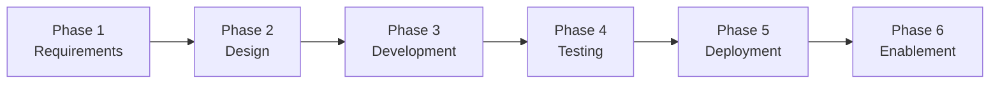

# Tutorial: Full Platform Release — Eversholt Brewing Co

## Statement of Work

```
**Rittman Analytics × Eversholt Brewing Co**
**Engagement**: Full Analytics Platform Build
**Date**: June 2026
**Type**: Fixed price

### Engagement overview

Eversholt Brewing Co operates three disconnected data systems — a Shopify DTC store, a BrewMan ERP, and a HubSpot CRM — with no automated integration between them. The finance director currently produces margin and revenue reports by exporting from all three systems manually every Monday morning. Rittman Analytics will design and deliver a complete analytics platform on BigQuery, dbt Cloud, and Looker that makes margin by SKU and channel revenue available daily without manual intervention.

### In scope

- Three Fivetran connectors: Shopify REST API, BrewMan PostgreSQL CDC (via Cloud SQL Auth Proxy), HubSpot REST API
- Seven dbt staging models: `stg_shopify__orders`, `stg_shopify__order_lines`, `stg_shopify__products`, `stg_brewman__production_batches`, `stg_brewman__stock_movements`, `stg_brewman__ingredient_costs`, `stg_hubspot__deals`
- One dbt integration model: `int__product_unified` (cross-system SKU identity resolution via `product_crosswalk.csv` seed)
- Five dbt warehouse models: `sku_dim`, `channel_dim`, `sales_fct`, `production_cost_fct`, `margin_summary`
- dbt Cloud orchestration: daily production job (06:00 UTC) and CI/PR job
- LookML semantic layer: four explores (`sku_performance`, `channel_revenue`, `production_margin`, `wholesale_accounts`) with views for all warehouse models
- Three Looker dashboards: Margin by SKU, Channel Revenue, Production Cost
- Data quality tests (freshness, row count reconciliation, cross-system FK validation) beyond the embedded dbt test layer
- Two UAT sessions (ops team and finance director)
- Deployment runbook covering all layers
- Data team enablement session (2 hours) and end-user training session (90 minutes)
- Technical documentation: architecture overview, dbt model reference, LookML field catalogue, operational runbook

### Out of scope

- Financial forecasting and demand planning models
- BrewMan write-back or any reverse ETL from BigQuery to BrewMan
- AWS or GCP infrastructure management outside the specific resources created during deployment
- Duty drawback adjustment on exported wholesale volume (deferred to a subsequent phase; noted in `decisions.md`)

### Timeline

| Period | Activity |
|---|---|
| Week 1, Days 1–3 | Requirements capture, conceptual model, pipeline design, data model, dashboard mockups — all approved before development begins |
| Week 1, Days 4–7 | Fivetran connector configuration, dbt development (5 parallel agents across 3 waves), dbt Cloud orchestration, LookML semantic layer |
| Week 2, Days 8–9 | Data quality tests, two UAT sessions, defect remediation |
| Week 2, Day 10 | Deployment to production (dev validation first, then production go-live) |
| Week 2, Days 11–12 | Data team and end-user training, technical documentation, engagement archive |

### Key assumptions

- Shopify API credentials are confirmed and accessible before Day 1
- The BrewMan on-premises PostgreSQL server is reachable from GCP via the existing VPN, and the Cloud SQL Auth Proxy service account pattern is already approved by Eversholt IT
- HubSpot API key is provided before pipeline design begins
- The Looker instance is already provisioned; Rittman Analytics is not responsible for Looker licensing or initial setup
- Client data team (Tom Barnard) is available for two-hour review sessions on Days 2, 3, and 4, and for UAT co-ordination on Days 8 and 9

### Acceptance criteria

- All 41 dbt tests passing in the dbt Cloud production environment with no errors
- `margin_summary` refreshing daily by 07:00 UTC and query time under 3 seconds in Looker production
- All three Looker dashboards live in the production Looker environment and accessible to named end users
- Written UAT sign-off received from the finance director (Laura Hennessy) and ops team lead before deployment to production
```


## What is a Full Platform release?

The `full_platform` release type is the most comprehensive Wire engagement, spanning all six phases from requirements capture through trained users. Every artifact type is in scope: the requirements specification, conceptual entity model, pipeline design, physical data model, dbt project, dbt Cloud orchestration config, LookML semantic layer, Looker dashboards, data quality tests, UAT plan, deployment runbook, training materials, and technical documentation. Where a narrower release type — `dbt_development`, `semantic_layer`, or `dashboard_first` — starts at a later phase or omits an entire layer, `full_platform` assumes you are building something that does not yet exist: new sources, new models, new analytics.

Choose `full_platform` when the client has no functioning analytics stack, or when they have disparate data sources with no reliable single view and the engagement SOW covers the full journey. It is a poor fit when the client already has deployed dbt models and a working warehouse — in that case, reach for `semantic_layer` or `dbt_development` and save the full sequence for a future phase. The typical two-week cadence puts requirements and design in Week 1, development and testing across Days 4–9, and deployment plus enablement in the final two days.

### High-Level Process



## The scenario

| | |
|---|---|
| **Client** | Eversholt Brewing Co |
| **Sector** | UK craft brewery, ~£8m annual revenue, regional distribution |
| **Problem** | Sales, production, and distribution data across Shopify (DTC), BrewMan ERP (production batches, stock), and HubSpot CRM (wholesale accounts). Monday morning manual Google Sheet refresh. Finance director cannot see real-time margin by SKU or channel without multiple manual exports. |
| **Stack** | BigQuery, Fivetran, dbt Cloud, Looker |
| **Release type** | `full_platform` |
| **Release ID** | `01-eversholt-brewing-platform` |
| **Duration** | 2 weeks (12 business days) |

Eversholt brews six core SKUs — a pale, a session IPA, a porter, a stout, a wheat beer, and a seasonal — distributed through two channels: DTC via Shopify and wholesale via approximately 40 regional pub groups managed in HubSpot. The ops team knows which SKUs are selling because they check Shopify. The finance director knows margin only after month-end, when the production cost data from BrewMan is reconciled manually. The Google Sheet in between is updated every Monday by whoever has time. This is the problem the platform will solve.

## What you will produce

| Artifact | Format | Owner |
|---|---|---|
| Requirements specification | `requirements/requirements_specification.md` | `discovery-analyst` |
| Delivery playbook | `planning/eversholt_brewing_playbook.md` | Main session |
| Conceptual entity model | `design/conceptual_model.md` | `data-designer` |
| Pipeline design | `design/pipeline_design.md` | `pipeline-engineer` |
| Data model specification | `design/data_model.md` | `data-designer` |
| Dashboard mockups | `design/mockups/margin-by-sku-dashboard.html` | Main session |
| dbt project | 7 staging models, 1 integration model, 5 warehouse models, 41 tests | `dbt-developer` (5 agents) |
| dbt Cloud config | `development/dbt_cloud_config.md` — daily 6am + CI/PR job | `orchestration-engineer` |
| LookML semantic layer | 4 explores, views for all warehouse models | `semantic-layer-developer` |
| Looker dashboards | Margin by SKU, Channel Revenue, Production Cost | `semantic-layer-developer` |
| Data quality tests | Freshness, row count reconciliation, cross-system validation | `data-quality-engineer` |
| UAT plan | 2 sessions (ops team, finance director) | `data-quality-engineer` |
| Deployment runbook | `deployment/runbook.md` | `delivery-lead` |
| Training materials | Data team enablement (2hr), end-user session (90min) | `delivery-lead` |
| Technical documentation | Architecture, dbt model reference, LookML field catalogue | `delivery-lead` |
| `decisions.md` | 9 architectural decisions across the engagement | All agents |

## Tutorial Playbook

The diagram below is the delivery playbook for this tutorial's scenario. In a live engagement, [`/wire:playbook-generate`](../reference/commands#session-and-management-commands) generates this as a Mermaid-format delivery plan — dependency order, team assignments, and target dates tailored to the specific release.

```mermaid
flowchart TD

START([Engagement Start — Day 1]):::event

subgraph REQ["Phase 1 — Requirements (Day 1)"]
    R1["/wire:new<br/>/wire:requirements-generate"]:::wireCmd
    RGATE{"Requirements<br/>approved?"}:::decision
    R2["/wire:requirements-validate<br/>/wire:requirements-review"]:::wireCmd
    RCHASE["Chase client sponsor<br/>— requirements sign-off"]:::offline
end

subgraph DESIGN["Phase 2 — Design (Days 2–3)"]
    D1["/wire:conceptual_model-generate"]:::wireCmd
    D2["/wire:conceptual_model-validate<br/>/wire:conceptual_model-review"]:::wireCmd
    DGATE1{"Conceptual model<br/>approved?"}:::decision
    D3["/wire:pipeline_design-generate"]:::wireCmd
    D4["/wire:pipeline_design-validate<br/>/wire:pipeline_design-review"]:::wireCmd
    DGATE2{"Pipeline design<br/>approved?"}:::decision
    D5["/wire:data_model-generate"]:::wireCmd
    D6["/wire:data_model-validate<br/>/wire:data_model-review"]:::wireCmd
    DGATE3{"Data model<br/>approved?"}:::decision
    D7["/wire:mockups-generate<br/>/wire:mockups-review"]:::wireCmd
    DGATE4{"Mockups<br/>approved?"}:::decision
end

subgraph DEV["Phase 3 — Development (Days 4–7)"]
    DEV1["/wire:delegate — pipeline-engineer"]:::wireCmd
    DEV2A["/wire:dbt-generate — staging agent 1/2<br/>stg_shopify__*, stg_brewman__*"]:::wireCmd
    DEV2B["/wire:dbt-generate — staging agent 2/2<br/>stg_hubspot__*"]:::wireCmd
    DEV3["/wire:dbt-generate — integration agent<br/>int__product_unified"]:::wireCmd
    DEV4A["/wire:dbt-generate — warehouse agent 1/2<br/>sku_dim, channel_dim, sales_fct"]:::wireCmd
    DEV4B["/wire:dbt-generate — warehouse agent 2/2<br/>production_cost_fct, margin_summary"]:::wireCmd
    DEV5A["/wire:orchestration-generate"]:::wireCmd
    DEV5B["/wire:semantic_layer-generate"]:::wireCmd
    DEVGATE{"Development<br/>approved?"}:::decision
end

subgraph TEST["Phase 4 — Testing (Days 8–9)"]
    T1["/wire:data_quality-generate"]:::wireCmd
    T2["/wire:uat-generate"]:::wireCmd
    UAT["[Offline] UAT sessions<br/>— ops team and finance director"]:::offline
    TGATE{"UAT passed?"}:::decision
    TFIX["Fix defects, re-validate"]:::offline
end

subgraph DEPLOY["Phase 5 — Deployment (Day 10)"]
    DEP1["/wire:deployment-generate"]:::wireCmd
    DEP2["/wire:utils-deploy-to-dev"]:::wireCmd
    DEP3["/wire:deployment-review"]:::wireCmd
    DEP4["/wire:utils-deploy-to-prod"]:::wireCmd
    DEPGATE{"Deployment<br/>approved?"}:::decision
end

subgraph ENABLE["Phase 6 — Enablement (Days 11–12)"]
    E1["/wire:training-generate"]:::wireCmd
    E2["[Offline] Data team enablement<br/>+ end-user training sessions"]:::offline
    E3["/wire:documentation-generate"]:::wireCmd
    E4["/wire:archive"]:::wireCmd
end

END([Platform Go-Live — Day 12]):::event

START --> R1
R1 --> R2
R2 --> RGATE
RGATE -->|No| RCHASE
RCHASE --> R2
RGATE -->|Yes| D1
D1 --> D2
D2 --> DGATE1
DGATE1 -->|Yes| D3
D3 --> D4
D4 --> DGATE2
DGATE2 -->|Yes| D5
D5 --> D6
D6 --> DGATE3
DGATE3 -->|Yes| D7
D7 --> DGATE4
DGATE4 -->|Yes| DEV1
DEV1 --> DEV2A & DEV2B
DEV2A & DEV2B --> DEV3
DEV3 --> DEV4A & DEV4B
DEV4A & DEV4B --> DEV5A & DEV5B
DEV5A & DEV5B --> DEVGATE
DEVGATE -->|Yes| T1
T1 --> T2
T2 --> UAT
UAT --> TGATE
TGATE -->|No| TFIX
TFIX --> UAT
TGATE -->|Yes| DEP1
DEP1 --> DEP2
DEP2 --> DEP3
DEP3 --> DEPGATE
DEPGATE -->|Yes| DEP4
DEP4 --> E1
E1 --> E2
E2 --> E3
E3 --> E4
E4 --> END

classDef wireCmd fill:#1a3a5c,stroke:#4a90d9,color:#fff
classDef offline fill:#2d4a1e,stroke:#6abf4b,color:#fff
classDef decision fill:#5c3a00,stroke:#d98c1a,color:#fff
classDef event fill:#1a1a1a,stroke:#888,color:#fff
```



## Walkthrough

### Phase 1 — Setup and requirements (Day 1)

Start by creating the release. The [`/wire:new`](../reference/commands#session-and-management-commands) command scaffolds the folder structure and status tracker:

:::info[First release in this repository?]

If this is the first release created in a git repository, `/wire:new` will first take you through the steps to set up the overall client engagement — naming the client, setting the engagement context, and configuring any integrations — before scaffolding the release itself. See [Setting up a new engagement](https://docs.rittmananalytics.com/en/latest/docs/getting-started/engagements-releases#setting-up-a-new-engagement) for further details.

:::

```
/wire:new
→ Client: Eversholt Brewing Co
→ Engagement name: eversholt_brewing
→ Release type: full_platform
→ Release ID: 01-eversholt-brewing-platform
→ Branch: feature/01-eversholt-brewing-platform
→ .wire/releases/01-eversholt-brewing-platform/status.md created
  14 artifacts across 6 phases, all at not_started
→ Jira Epic EBC-1 created
```

:::info[Issue tracking and document sync]

Wire can sync artifact progress to [Jira](../advanced/issue-tracking#jira-integration) or [Linear](../advanced/issue-tracking#linear-integration) as each generate, validate, and review step completes. With the Jira integration, you can choose between one sub-task per lifecycle step (each moving through its own workflow states) or one ticket per artifact that transitions between issue statuses. Wire can create the Epic and issue hierarchy for you when you run `/wire:new`, or link to an existing one you have already set up.

Generated artifacts can also be replicated to [Confluence](../advanced/document-store#confluence) or [Notion](../advanced/document-store#notion) for client review — review commands pull comments and edits made in the document store back as context before gathering sign-off.

Both integrations are optional. Configure the [Atlassian](../reference/mcp-servers#atlassian), [Linear](../reference/mcp-servers#linear), or [Notion](../reference/mcp-servers#notion) MCP servers in `.claude/settings.json` to enable them.

:::


Copy the SOW PDF, Shopify export schema, BrewMan PostgreSQL schema dump, and HubSpot CRM field catalogue into `releases/01-eversholt-brewing-platform/requirements/`. Then generate the requirements specification:

```
/wire:requirements-generate 01-eversholt-brewing-platform
→ [auto-delegated to discovery-analyst agent]
→ Fathom context: pre-engagement discovery call transcript pulled
  Key context surfaced: finance director described "running four exports every Monday
  morning, then spending two hours in Excel" — Monday morning reporting pain point
  confirmed as primary driver. Ops manager flagged BrewMan's API as PostgreSQL CDC
  only, no REST endpoint. Wholesale channel uses HubSpot deals, not Shopify.
```

:::info[Auto-delegation]

When you see `-> [auto-delegated to X agent]`, the main session has routed that command to a [specialist subagent](../advanced/wire-agents#auto-delegation-on-individual-commands) automatically — no extra steps needed. The specialist runs with a focused brief rather than the full engagement context, which typically produces sharper domain-specific output. Review commands (`*-review`) always stay in the main session and require your direct input.

:::

The agent produces a 10-section requirements specification: FR-1 through FR-7 (functional requirements with acceptance criteria), NFR-1 through NFR-4 (freshness SLA of daily by 7am, row-level security by brewery role, sub-3-second dashboard load, 99.5% pipeline uptime), and a deliverable-to-artifact mapping. It writes two entries immediately to `decisions.md`:

- Modelled at SKU-day grain for sales, not order-line — order-line grain would require 12× the Fivetran MAR volume with no analytical benefit at the reporting level required
- Wholesale accounts use HubSpot deal stage as the channel qualifier, not a custom Eversholt field — custom field data quality is inconsistent across reps

```
/wire:requirements-validate 01-eversholt-brewing-platform
→ [auto-delegated to discovery-analyst agent]
→ PASS — all 7 FRs have acceptance criteria; all 4 NFRs are measurable

/wire:requirements-review 01-eversholt-brewing-platform
→ [main session — review gates stay with the consultant]
→ Fathom context: discovery call with FD — margin reporting urgency confirmed
→ Approved by Laura Hennessy (Finance Director), 2026-06-03
```

Generate the playbook before moving to design:

```
/wire:playbook-generate 01-eversholt-brewing-platform
→ planning/eversholt_brewing_playbook.md created
→ Mermaid control-flow diagram + narrative guide across all 6 phases
→ Phase 1 marked ✅ COMPLETE
→ Open question flagged: OQ-1 — confirm BrewMan brew-day batch grain
  (daily batch vs hourly production run) before data model review
```

### Phase 2 — Design (Days 2–3)

#### Conceptual model

```
/wire:conceptual_model-generate 01-eversholt-brewing-platform
→ [auto-delegated to data-designer agent]
```

The agent produces a business-level entity model with five domain entities — `Product` (SKU), `ProductionBatch`, `SalesOrder`, `WholesaleAccount`, `Channel` — and a Mermaid `erDiagram` showing that a `ProductionBatch` produces multiple units of one `Product`, and a `SalesOrder` references both `Product` and `Channel`. No columns at this stage. Business stakeholders need to approve the entities before any technical work begins.

```
/wire:conceptual_model-validate 01-eversholt-brewing-platform → PASS
/wire:conceptual_model-review 01-eversholt-brewing-platform
→ Approved by Laura Hennessy + James Whitfield (Head Brewer), 2026-06-04
→ Decision: ProductionBatch is a first-class entity with brew-day grain,
  not collapsed into Product — batch costs vary by brew and must be traceable
```

#### Pipeline design

```
/wire:pipeline_design-generate 01-eversholt-brewing-platform
→ [auto-delegated to pipeline-engineer agent]
```

The agent produces the full pipeline architecture document. Three Fivetran connectors:

- **Shopify REST API** — orders, order lines, products, customers; full refresh daily with incremental on `updated_at`; estimated MAR ~1.1M rows/month
- **BrewMan PostgreSQL CDC** — production batches, stock movements, ingredient costs; log-based CDC via Fivetran's PostgreSQL connector; estimated MAR ~0.8M rows/month; Cloud Function required for IAM-scoped connection (BrewMan runs on-prem, tunnel via Cloud SQL Auth Proxy)
- **HubSpot REST API** — deals, contacts, companies, line items; incremental on `hs_lastmodifieddate`; estimated MAR ~0.2M rows/month

Total estimated MAR: ~2.1M rows/month. Key decisions written to `decisions.md`:

- Production batch grain set at brew-day, not hourly production run — BrewMan records costs at batch close, not per run; hourly grain would require synthetic cost allocation with no source data to support it (resolves OQ-1)
- BrewMan connection requires a Cloud Function for auth token management — on-prem PostgreSQL behind VPN, direct Fivetran connector not available; Cloud SQL Auth Proxy with a service account is the supported pattern

```
/wire:pipeline_design-validate 01-eversholt-brewing-platform → PASS
/wire:pipeline_design-review 01-eversholt-brewing-platform
→ Approved by Tom Barnard (Data Engineering Lead), 2026-06-04
→ Cloud Function auth approach confirmed with Eversholt IT
```

#### Data model

```
/wire:data_model-generate 01-eversholt-brewing-platform
→ [auto-delegated to data-designer agent]
```

The agent produces `_sources.yml` for all three Fivetran connectors, a physical ERD, and a full model inventory:

**Staging layer (7 models):**
- `stg_shopify__orders` — order header, `order_pk`, surrogate on `shopify_order_id`
- `stg_shopify__order_lines` — line items with `order_line_pk`, `product_fk`
- `stg_shopify__products` — SKU master, `product_pk`
- `stg_brewman__production_batches` — brew-day grain, `batch_pk`, ingredient cost total
- `stg_brewman__stock_movements` — stock in/out with `movement_pk`, `batch_fk`
- `stg_brewman__ingredient_costs` — cost per batch, `cost_pk`, `batch_fk`
- `stg_hubspot__deals` — wholesale deals with `deal_pk`, `company_fk`

**Integration layer (1 model):**
- `int__product_unified` — resolves product identity across Shopify SKU codes and BrewMan product codes; 6-core-SKU mapping from a seed file (`product_crosswalk.csv`)

**Warehouse layer (5 models):**
- `sku_dim` — product dimension with category, ABV, and format attributes
- `channel_dim` — DTC vs wholesale with sub-channel hierarchy
- `sales_fct` — daily SKU-channel sales grain; revenue, volume, Shopify discount
- `production_cost_fct` — batch-level cost grain; ingredient cost, packaging cost, duty
- `margin_summary` — daily SKU-channel margin; joins `sales_fct` to `production_cost_fct` via `product_fk`; materialised as table for Looker query performance

```
/wire:data_model-validate 01-eversholt-brewing-platform → PASS
/wire:data_model-review 01-eversholt-brewing-platform
→ Approved by Tom Barnard + Laura Hennessy, 2026-06-05
→ Decision: margin_summary materialised as table — full refresh nightly;
  Looker query against a view joining two large facts would exceed the 3-second NFR
```

#### Dashboard mockups

```
/wire:mockups-generate 01-eversholt-brewing-platform
→ [auto-delegated to dashboard-mock-developer agent]
```

```
Dashboard Mockups Generated

  File: design/mockups/margin-by-sku-dashboard.html — open in any browser

  What's in it:

  - Margin by SKU — 4 KPI tiles (Gross Margin % overall, Revenue MTD,
    Production Cost MTD, Volume HL MTD), SKU margin bar chart (6 bars),
    channel split doughnut, 8-week margin trend line by SKU. Filter by
    channel, date range, SKU.
  - Channel Revenue — DTC vs Wholesale side-by-side; weekly revenue bars;
    average order value tile; top 10 wholesale accounts table with revenue
    and deal stage.
  - Production Cost — Batch cost timeline; ingredient cost vs packaging cost
    stacked bar by brew week; cost-per-HL trend; batch summary table with
    batch ID, brew date, SKU, total cost.

  All charts are Chart.js 4.4.1, fully interactive. No build step.
```

```
/wire:mockups-review 01-eversholt-brewing-platform
→ Approved by Laura Hennessy + James Whitfield, 2026-06-05
→ Change request: add duty cost as a separate line in Production Cost view —
  duty drawback applies to export wholesale only and FD wants it visible
```

### Phase 3 — Development (Days 4–7)

#### Batch dispatch

With all four design artifacts approved, open a new session and run [`/wire:delegate`](../reference/commands#session-and-management-commands). It reads `status.md`, identifies every pending artifact in the development phase, computes a parallel/sequential execution plan based on Wire's artifact dependency graph, and presents it for your approval before spawning any subagents. Running commands individually is also valid — `/wire:delegate` is most useful when several development artifacts are pending simultaneously and you want a single reviewed plan before agents start. See [Wire Agents — Batch delegation](../advanced/wire-agents#batch-delegation-with-wiredelegate).

```
/wire:delegate 01-eversholt-brewing-platform
```

Wire inspects `status.md`, identifies all development artifacts at `not_started`, and presents the delegation plan:

```
Delegation plan — Eversholt Brewing Co / 01-eversholt-brewing-platform
───────────────────────────────────────────────────────────────────────

Step 1 (sequential):
  pipeline-engineer  →  pipeline-generate
                        (Shopify REST API, BrewMan PostgreSQL CDC,
                         HubSpot REST API + Cloud Function for BrewMan auth)

Step 2 (multi-wave fan-out, starts after Step 1):

  Wave 2a — Staging layer  (2 parallel agents):
    dbt-developer [staging 1/2]  →  stg_shopify__orders, stg_shopify__order_lines,
                                     stg_shopify__products, stg_brewman__production_batches,
                                     stg_brewman__stock_movements
    dbt-developer [staging 2/2]  →  stg_brewman__ingredient_costs,
                                     stg_hubspot__deals
                                     + seed: product_crosswalk.csv

  Wave 2b — Integration layer  (1 agent, starts after Wave 2a):
    dbt-developer [integration 1/1]  →  int__product_unified

  Wave 2c — Warehouse layer  (2 parallel agents, starts after Wave 2b):
    dbt-developer [warehouse 1/2]  →  sku_dim, channel_dim, sales_fct
    dbt-developer [warehouse 2/2]  →  production_cost_fct, margin_summary

  Total dbt-developer agents: 5  (2 + 1 + 2)

Step 3 (parallel, starts after Step 2):
  3a  orchestration-engineer    →  orchestration-generate  (dbt Cloud job config)
  3b  semantic-layer-developer  →  semantic_layer-generate  (LookML views + explores)

Total: 8 specialist agents across 4 execution stages. Review commands stay in this session.

Confirm delegation plan? [y/n]
```

#### What each specialist produces

**`pipeline-engineer`** — Fivetran connector YAML config for all three sources. For the BrewMan connector, produces a Cloud Function (`brewman_auth/main.py`) that manages the IAM-scoped connection via Cloud SQL Auth Proxy, with a service account key stored in Secret Manager. Error handling: failed syncs write to a `pipeline_errors` BigQuery table; three consecutive failures trigger a Slack alert to `#data-alerts`. MAR estimate confirmed at 2.1M rows/month across all three connectors.

**`dbt-developer` (5 agents across 3 waves)** — 7 staging models, 1 integration model, 5 warehouse models; 41 tests total. Surrogate keys via `dbt_utils.generate_surrogate_key()`. `sales_fct` and `production_cost_fct` use incremental materialisation with `merge` strategy on their respective PKs. `margin_summary` is materialised as table with `full_refresh=true`. Static analysis passes for all 5 agents. The `decisions.md` entries from each wave are merged by the orchestrating session after each wave completes:

- `int__product_unified` uses `coalesce(shopify_sku, brewman_product_code)` for the unified product key — 6 of 6 core SKUs have matching codes; 4 historical SKUs are Shopify-only and treated as inactive
- Duty cost added as a separate column in `production_cost_fct` — sourced from `stg_brewman__ingredient_costs.duty_amount_gbp`; resolves the FD's change request from mockup review

**`orchestration-engineer`** — dbt Cloud job configuration:

```markdown
## Jobs

### eversholt_scheduled_run
- Environment: Production (eversholt-analytics, target: prod)
- Schedule: daily at 06:00 UTC (data available in BigQuery by 05:45; NFR-1: ready by 07:00)
- Commands:
    dbt run --select staging+ warehouse+
    dbt test --select staging+ warehouse+
- On failure: Slack → #data-alerts, page Tom Barnard on PagerDuty

### eversholt_ci
- Trigger: pull request against main
- Commands: dbt build --select state:modified+
- On completion: GitHub PR status check
```

Decision written to `decisions.md`: daily 06:00 UTC schedule chosen over hourly — Fivetran syncs complete by 05:30; hourly runs would add dbt Cloud job costs with no benefit given the daily data grain of all warehouse models.

**`semantic-layer-developer`** — LookML views for all 5 warehouse models and 4 explores:

- `sku_performance` — joins `sales_fct` to `sku_dim` and `channel_dim`; revenue, volume, and margin measures; dimensions for SKU, ABV band, format
- `channel_revenue` — wholesale vs DTC split; top accounts table via `wholesale_account_dim`; `average_order_value_gbp` as a measure
- `production_margin` — joins `margin_summary` to `sku_dim`; `gross_margin_pct` calculated as `(revenue - production_cost) / revenue`; separate duty cost measure
- `wholesale_accounts` — HubSpot deal data; account revenue ranking; deal stage funnel

#### Development reviews

```
/wire:pipeline-review 01-eversholt-brewing-platform
→ Tom Barnard (Data Engineering Lead)
→ Cloud Function auth reviewed; connector YAML validated against Fivetran docs
→ Approved 2026-06-09

/wire:dbt-review 01-eversholt-brewing-platform
→ Tom Barnard
→ Static analysis PASS, 41 tests reviewed, incremental strategies confirmed
→ Approved 2026-06-09

/wire:orchestration-review 01-eversholt-brewing-platform
→ Tom Barnard
→ 06:00 UTC schedule confirmed against Fivetran sync window; CI selector verified
→ Approved 2026-06-09

/wire:semantic_layer-review 01-eversholt-brewing-platform
→ Laura Hennessy + Tom Barnard
→ gross_margin_pct formula verified; duty cost measure confirmed as additive
→ Approved 2026-06-10
```

With the semantic layer approved, generate and review the dashboards:

```
/wire:dashboards-generate 01-eversholt-brewing-platform
/wire:dashboards-validate 01-eversholt-brewing-platform → PASS
/wire:dashboards-review 01-eversholt-brewing-platform → Approved 2026-06-10
```

### Phase 4 — Testing (Days 8–9)

```
/wire:data_quality-generate 01-eversholt-brewing-platform
→ [auto-delegated to data-quality-engineer agent]
```

The agent adds tests beyond the embedded dbt layer: a daily freshness check (`sales_fct` must have data for `current_date - 1` by 07:00 UTC), row count reconciliation between Shopify order count and `sales_fct` row count (±5% tolerance), null rate monitoring on `margin_summary.gross_margin_pct`, and a cross-system FK hit rate check confirming that every `product_fk` in `sales_fct` resolves to a row in `sku_dim`.

```
/wire:data_quality-validate 01-eversholt-brewing-platform → PASS
/wire:data_quality-review 01-eversholt-brewing-platform
→ Tom Barnard + Laura Hennessy
→ Freshness threshold and row count tolerance approved
→ Approved 2026-06-10
```

UAT plan generation and sessions:

```
/wire:uat-generate 01-eversholt-brewing-platform
→ [auto-delegated to data-quality-engineer agent]
→ UAT plan mapped to FR-1 through FR-7
→ Session 1: ops team (James Whitfield + ops manager) — production cost view
→ Session 2: finance director (Laura Hennessy) — margin by SKU and channel revenue
```

Two UAT sessions ran on Days 8 and 9. One finding required remediation:

> **UAT-F1 (deferred)**: `margin_summary` does not account for duty drawback — the HMRC excise duty refund on exported wholesale volume that reduces the effective duty cost. This affects wholesale SKUs exported outside the UK. The duty amount in BrewMan is the pre-drawback figure. Finance director accepted deferral to Phase 2 scope; a `decisions.md` entry was written noting that `production_cost_fct.duty_amount_gbp` requires a drawback adjustment column in the next release.

```
/wire:uat-review 01-eversholt-brewing-platform
→ Approved by Laura Hennessy, 2026-06-11 — UAT-F1 deferred to Phase 2 scope
```

### Phase 5 — Deployment (Day 10)

```
/wire:deployment-generate 01-eversholt-brewing-platform
→ [auto-delegated to delivery-lead agent]
```

Produces the deployment runbook: Fivetran connector activation sequence, BigQuery dataset creation and IAM binding, dbt Cloud environment and job configuration, Looker connection update and dashboard publish, monitoring and alerting setup, rollback procedures for each layer.

```
/wire:deployment-validate 01-eversholt-brewing-platform → PASS

/wire:utils-deploy-to-dev 01-eversholt-brewing-platform
→ All 13 dbt models built in dbt Cloud dev environment
→ 41 tests passing
→ Dashboards visible in Looker dev — margin_summary query time 1.8 seconds (NFR-1: <3s)

/wire:deployment-review 01-eversholt-brewing-platform
→ Tom Barnard + Laura Hennessy
→ Dev results presented; runbook walked through step by step
→ Approved 2026-06-12

/wire:utils-deploy-to-prod 01-eversholt-brewing-platform
→ Fivetran connectors activated — initial sync complete for all three sources
→ dbt Cloud production environment configured and tested
→ Scheduled job (daily 06:00 UTC) and CI/PR job activated
→ Dashboards published to Looker production
→ Monitoring alerts live in #data-alerts
```

### Phase 6 — Enablement (Days 11–12)

```
/wire:training-generate 01-eversholt-brewing-platform
→ [auto-delegated to delivery-lead agent]
```

Two training packages produced:

**Data Team Enablement** (Day 11 morning, 2 hours with Tom Barnard): pipeline architecture and Fivetran connector management, Cloud Function maintenance and Secret Manager key rotation, dbt model structure and how to extend the staging layer for new sources, dbt Cloud job operation and how to handle a failed run, LookML extension for new measures, and a live trace of a BrewMan brew batch record from PostgreSQL to `margin_summary` in Looker.

**End User Training** (Day 11 afternoon, 90 minutes with Laura Hennessy, James Whitfield, and the ops manager): dashboard navigation and filter usage, interpreting margin by SKU, understanding data freshness expectations (data by 07:00 each morning), how to raise a data quality issue, and what the duty drawback deferred item means for the margin figures.

```
/wire:training-validate 01-eversholt-brewing-platform → PASS
/wire:training-review 01-eversholt-brewing-platform
→ Approved by Laura Hennessy, 2026-06-13
```

```
/wire:documentation-generate 01-eversholt-brewing-platform
→ [auto-delegated to delivery-lead agent — reads all approved artifacts and decisions.md]
```

Produces: architecture overview (source-to-dashboard data flow), dbt model reference (each model's purpose, grain, key fields, and dependencies), dbt Cloud job reference (selectors, cadence, how to change the schedule, how to trigger a manual run), LookML field catalogue (every measure and dimension with calculation notes), operational runbook (what to do when Fivetran fails, when dbt tests fail, when a Looker dashboard shows stale data).

```
/wire:documentation-validate 01-eversholt-brewing-platform → PASS
/wire:documentation-review 01-eversholt-brewing-platform → Approved 2026-06-14

/wire:archive 01-eversholt-brewing-platform
→ 14 artifacts, 42 commands run, 9 decisions.md entries
→ Jira Epic EBC-1 closed
→ Release branch merged to main
```

## What was produced

| | Count |
|---|---|
| Artifacts completed | 14 |
| Wire commands run | 42 |
| `decisions.md` entries | 9 |
| dbt models | 13 (7 staging, 1 integration, 5 warehouse) |
| dbt tests | 41 |
| Fivetran connectors configured | 3 |
| Cloud Functions deployed | 1 (BrewMan auth) |
| LookML explores | 4 |
| Looker dashboards | 3 |
| UAT sessions | 2 |
| Deferred items | 1 (duty drawback — Phase 2 scope) |
| Jira issues closed | EBC-1 (Epic) + 14 Tasks + 42 Sub-tasks |
| Engagement duration | 12 business days |
