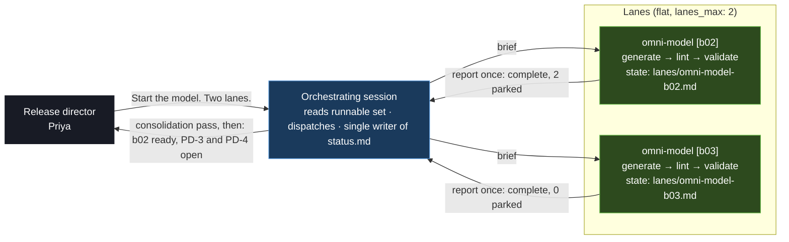

# Tutorial: Looker to Omni Migration

This walkthrough runs a complete `bi_migration` release, Looker to Omni, from an empty engagement repo to Looker being switched off. It uses a fictional UK retailer whose warehouse and dbt project stay exactly where they are. Only the reporting layer moves.

The release is driven the way v4.0.0 intends: the consultant is the **release director** and gives direction in prose. The **orchestrating session** works out what is runnable from the release-type graph, runs the Wire commands, dispatches batches to lanes, and stops at every decision that is the director's to make. Every step still runs a real `/wire:` command, so this tutorial names the command Wire runs at each point, what it reads, what it writes, and where it stops. Read [The Release Director Model](../advanced/release-director) first if the terms director, lane, ruling and parked decision are new.

Nothing here needs you to type a command. Everything here can be typed if you prefer. The record on disk is the same either way.

## Statement of Work

```
**Rittman Analytics × Halcyon Outdoor Ltd**
**Engagement**: Looker to Omni Migration
**Date**: October 2026
**Type**: Fixed price

### Engagement overview

Halcyon Outdoor Ltd sells outdoor clothing through 40 UK stores and an online shop.
Their analytics platform is BigQuery, dbt Cloud and Looker. The Looker contract ends
on 31 March 2027 and will not be renewed. Rittman Analytics will migrate the Looker
semantic model and content to Omni on the same BigQuery warehouse, prove every
migrated dashboard returns the same numbers, run both tools side by side for 60 days,
then retire Looker.

### In scope

- Audit of the LookML project (54 views, 11 explores) and all Looker content
  (74 dashboards, 38 Looks, 19 schedules, 4 alerts), with usage from System Activity
- Migration plan: usage ranking, what is dropped, how each persistent derived table
  (PDT) is handled, permission mapping, topic design, batches
- Omni model built on a branch of the client's existing Omni model (`hal-analytics`),
  through Wire's deterministic LookML to Omni converter plus recorded hand work
- Omni dashboards rebuilt for every dashboard and Look that is kept
- Tile-level parity: every kept tier 1 dashboard compared against Looker at a pinned
  as-of date until every tile passes
- 60-day parallel run, group-by-group access switch, schedules and alerts recreated,
  Looker set read-only, then decommissioned
- Training for report builders and a model handbook for the client's two modellers

### Out of scope

- Any change to the BigQuery warehouse or the dbt project, other than dbt models that
  replace PDTs where the client rules so
- Redesign of dashboards beyond what the plan rules; parity dashboards are rebuilt as-is
- Styling and colour themes beyond Omni defaults; text and markdown tiles are recreated
  by the client from the hand-finish list
- Content nobody has opened in 180 days (the drop list), unless the client names it

### Timeline

| Period | Activity |
|---|---|
| Weeks 1 to 2 | Repos registered; Looker audit; audit approved |
| Week 3 | Migration plan; rulings; plan approved; Omni target setup |
| Weeks 4 to 7 | Model batches as lanes; lint and validate per batch; model approved |
| Weeks 8 to 11 | Content batches as lanes; parity sweeps per batch; fixes |
| Weeks 12 to 13 | Cutover runbook; parallel run begins; first groups switched |
| Week 14 | Training and documentation |
| To 31 March 2027 | Parallel run, Looker read-only on 1 March, decommission on 31 March |

### Key assumptions

- The LookML project is in a GitHub repo Rittman Analytics can clone; the client keeps
  merging their own LookML changes during the engagement
- The Omni model `hal-analytics` exists, is git-connected, and reads the same BigQuery
  project as Looker's connection
- Rittman Analytics has a Looker API key with System Activity access and an Omni API key
  that can create a model branch, groups and documents
- Nobody at the client is added to an Omni group until that group's dashboards have passed parity

### Acceptance criteria

- Every tier 1 dashboard rolls up to pass or pass_qualified in the parity report
- Every Looker schedule and alert in scope has delivered once from Omni before its Looker original is disabled
- The migration register accounts for every in-scope object with a state and, for dashboards, a parity verdict
- Looker is read-only on 1 March 2027 with no open parked decisions
```

## What is a BI migration release?

The `bi_migration` release type ([reference page](../release-types/bi-migration)) moves a reporting layer between BI tools while the warehouse stays put. In 4.0.0 the only pair is `looker_to_omni`. Nine phases, six of them gated by a director ruling:

| Phase | Artifact | Gate before the next phase |
|---|---|---|
| Business rules (optional) | `business_rules` | advisory |
| Audit | `looker_audit`, `omni_audit` (optional) | audit **review** approved |
| Plan | `bi_migration_plan`, `migration_drift` (optional) | plan **review** approved |
| Target | `omni_target_setup` | target **review** approved |
| Model | `omni_model` | model **validate** PASS, then model **review** approved before any document is written |
| Content | `omni_content` | content generate complete |
| Parity | `bi_equivalency` | parity **validate** pass |
| Cutover | `cutover` | cutover **review** approved |
| Enablement (optional) | `training`, `documentation` | |

Two things make it different from the linear release types. It is **batched**: the plan cuts the model into batches of views and explores, and the content into batches of dashboards, and each batch is one lane. And it has a **deterministic core**: a Python converter turns LookML into Omni YAML with no AI call, and refuses anything it cannot translate into a `needs_human.json` list. The agent's job is the list, not the YAML.

## The scenario

Halcyon's Looker estate has grown for six years. The client's analytics lead, Tom Askew, knows roughly a third of the dashboards are dead. Two client modellers will keep editing LookML until cutover, and will start editing the Omni model as soon as there is one. The consultant, Priya Menon, is the release director. She has one engagement repo, one session per working day, and no intention of typing 80 commands.

What the numbers turn out to be:

| Object | Count | Kept | Dropped |
|---|---|---|---|
| LookML views | 54 | 47 | 7 (nothing in scope references them) |
| LookML explores | 11 | 11 | 0 |
| Fields | 912 | | |
| Dashboards | 74 | 43 (16 tier 1, 27 tier 2) | 31 stale |
| Looks | 38 | 16 | 22 stale |
| Tiles | 486 | 372 | 41 text tiles, plus tiles of dropped content |
| Schedules and alerts | 23 | 18 | 5 on dropped content |
| Groups and user attributes | 5 and 2 | all | |

## What you will produce

```
.wire/releases/01-looker-to-omni/
├── status.md                              # the record; written only by the orchestrating session
├── decisions.md                           # every ruling, the moment it is given
├── execution_log.md                       # one row per Wire run, with By and Session columns
├── lanes/                                 # one state file per lane
├── audit/
│   ├── looker_audit.md
│   ├── looker_model_catalog.csv           # one row per construct, with its class
│   └── looker_content_catalog.csv         # one row per dashboard, Look, tile, schedule
├── migration/
│   ├── source_snapshot/lookml/            # the client's LookML at a recorded commit
│   ├── bi_migration_plan.md
│   ├── bi_migration_batches.csv           # 13 batches; dropped objects carry an empty batch id
│   ├── migration_register.csv             # 512 rows; one per in-scope object
│   ├── baseline.yaml                      # what parity is measured against
│   ├── omni_target_setup.md
│   ├── omni_model/
│   │   ├── b02/ ... b06/                  # emitted YAML, needs_human.json, manifest.json, lint
│   │   └── omni_model.md
│   ├── omni_content/
│   │   ├── b07/ ... b13/                  # plan.json, source/, bodies/, manifest.csv
│   │   └── omni_content.md
│   ├── verdicts/run_1/, run_2/            # one verdict file per parity lane
│   ├── migration_verdict_log.csv
│   ├── bi_equivalency_report_1.md, _2.md
│   ├── migration_drift_report_1.md
│   └── cutover_runbook.md
└── enablement/
    ├── training.md
    └── documentation.md
```

## Tutorial playbook

The whole release in one table. **You say** is the director. **Wire runs** is what the orchestrating session executes, named before it runs, and recorded in `execution_log.md` with `Session: orchestrator` or a lane label. **Stops at** is where the session parks and waits.

| Step | You say | Wire runs | Stops at |
|---|---|---|---|
| 1 | New engagement, SOW attached, two lanes max, nothing against the warehouse yet | `/wire:new` (proposes `bi_migration` / `looker_to_omni`, asks the five setup questions), `/wire:migration-source-register` twice, `/wire:migration-source-refresh` | Confirmation block |
| 2 | Audit it | `/wire:looker-audit-generate`, auto-validate | Audit review (parked: needs ruling) |
| 3 | Approve. Rulings on drop list, PDTs, topics, parallel run | `/wire:looker-audit-review`, `/wire:bi-migration-plan-generate`, auto-validate | Plan review, with the rulings it could not make |
| 4 | Approve; parity scope tier 1; permission map as proposed | `/wire:bi-migration-plan-review`, `/wire:omni-target-setup-generate`, `-validate` | Target review |
| 5 | Approve. Model batches, two lanes | `/wire:omni-target-setup-review`; lanes run `/wire:omni-model-generate --batch N`, `-lint --batch N`, `-validate --batch N`; orchestrator re-runs `omni models validate` on the branch | Parked `needs_human` items |
| 6 | Rulings on parked items; re-run the batch | `/wire:omni-model-generate --batch b04` (lint, validate again) | Model review |
| 7 | Check for LookML drift first | `/wire:migration-source-refresh lookml`, `/wire:migration-drift-generate` | One blocking drift finding |
| 8 | Re-translate the affected view; then approve the model | `/wire:omni-model-reverse-port`, `/wire:omni-model-generate --batch b03`, lint, validate, `/wire:omni-model-review` | Content batches ready |
| 9 | Content batches, two lanes, plan before write | Lanes run `/wire:omni-content-generate --batch N` (plan), `-validate --batch N`, `-generate --batch N --write`, `-validate --batch N` | Skipped tiles and hand-finish list |
| 10 | Parity on tier 1 | Lanes run `/wire:bi-equivalency-validate --batch N` | 9 failing tiles |
| 11 | Fix the two causes; re-run | Branch edits recorded, `/wire:omni-model-validate --batch b02`, `/wire:bi-equivalency-validate --batch b07`, `--batch b08` | Parity pass; content review |
| 12 | Approve content; cutover plan for 60 days | `/wire:omni-content-review`, `/wire:cutover-generate`, `-validate` | Cutover review (client sign-off) |
| 13 | Client signed; switch the first group | `/wire:cutover-review`; access switch step 1 recorded in the runbook | Next group |
| 14 | Training and a model handbook | `/wire:training-generate`, `/wire:documentation-generate`, auto-validate, reviews | Done |

## Walkthrough

### 1. Setup: the engagement and the two repos

Priya opens a session in an empty repo with the SOW in `docs/sow.md`.

| You say | Wire does |
|---|---|
| "New engagement for Halcyon Outdoor, Looker to Omni on the same BigQuery warehouse. SOW in `docs/sow.md`. Two lanes max. No warehouse queries until I say. Stop at every decision." | Reads the SOW. Proposes release type `bi_migration`, profile `looker_to_omni`, **with the reason** (the warehouse stays, the source is Looker, the target is Omni). Shows one confirmation block. Asks the setup questions `/wire:new` needs for this type. |

The questions are the ones in the `/wire:new` spec for `bi_migration`: where the LookML is checked out (default `./lookml`), the Looker base URL, the Omni base URL, the Omni model id, which Omni CLI profile to use, the LookML GitHub URL, the Omni model repo URL, and the parallel-run length.

```
[wire] Proposed: bi_migration / looker_to_omni
       Reason: SOW moves Looker to Omni; warehouse (BigQuery) and dbt unchanged.

  Release folder      01-looker-to-omni
  LookML repo         github.com/halcyon-data/looker-hal (branch main)   -> registered as source `lookml`
  Omni model repo     github.com/halcyon-data/omni-hal-analytics         -> registered as source `omni_model`
  Looker              https://halcyon.eu.looker.com
  Omni                https://halcyon.omniapp.co   model hal-analytics   profile: halcyon
  Parallel run        60 days

Confirm, or change anything above.
```

| You say | Wire does |
|---|---|
| "Confirm." | Runs `/wire:new`. Writes `status.md` from the BI migration template with `project_type: bi_migration`, `bi_pair: looker_to_omni`, the `bi_migration:` block and the `budget:` block (`lanes_max: 2`, `warehouse_spend: none`, `stop_at: decisions`). Claims the release: `agents.mode: orchestrated`, `coordinator_session` with Priya's name, session id and branch. Then runs `/wire:migration-source-register 01-looker-to-omni lookml <url>` and `/wire:migration-source-register 01-looker-to-omni omni_model <url>`, and `/wire:migration-source-refresh 01-looker-to-omni`. |

The refresh clones both repos into `migration/source_snapshot/lookml/` and `migration/source_snapshot/omni_model/` and records each `last_commit` in `status.md`. Every audit row and register row will carry that commit. Without the LookML URL the audit still runs from the local checkout, but drift detection later is not possible.

```
[wire] migration-source-refresh: lookml   54 .lkml files   commit 7c1e4a2
[wire] migration-source-refresh: omni_model   0 .view, 0 .topic   commit e09b31d   (model is empty; brownfield audit not needed)

Runnable now: looker_audit (generate).   Blocked: bi_migration_plan (looker_audit review not approved).
```

The session's first report after setup is the **runnable set**: what the graph allows now, and what is blocked by which unmet gate.

### 2. Audit

| You say | Wire does |
|---|---|
| "Audit it." | Runs `/wire:looker-audit-generate 01-looker-to-omni`. Auto-validate follows. Reports once. |

The audit reads the LookML snapshot, not the live repo. It applies the feature-detection patterns from `bi_pairs/looker_to_omni/feature_detection.md` to every construct and assigns one class per row: `mechanical` (the converter will emit it), `assisted` (emitted with a note, or withheld where a wrong emission would change a number), or `redesign` (not emitted; the Omni alternative is recorded). It catalogs content through the Looker API and reads usage from System Activity. It never infers usage from folder names.

```
[wire] looker-audit-generate: 01-looker-to-omni   (LookML at 7c1e4a2)

Model     54 views, 11 explores, 912 fields, 6 PDTs
          mechanical 781   assisted 92   redesign 39
          redesign reasons: Liquid in sql/label 14, parameter 9, filter field 5, PDT 6, html 3, running_total 2

Content   74 dashboards, 38 Looks, 486 tiles, 19 schedules, 4 alerts
          usage_source: system_activity
          41 text tiles -> class drop (recreate by hand)
          31 dashboards and 22 Looks: 0 views in 90 days, last viewed > 180 days

Files     audit/looker_audit.md, audit/looker_model_catalog.csv, audit/looker_content_catalog.csv

[wire] looker-audit-validate: PASS (0 rows without a class; 0 redesign rows without a reason)

Review gate: looker_audit. Approve now, changes, or park for client sign-off?
```

A review edge is never runnable on its own. Wire presents the summary, the validate result and any Fathom meeting context the review spec gathers, then asks for one of three answers.

| You say | Wire does |
|---|---|
| "Approve. Tom has seen the stale list and agrees it." | Runs `/wire:looker-audit-review 01-looker-to-omni` and records the approval under Priya's name. `bi_migration_plan` becomes runnable. |

### 3. Plan: where most rulings close

| You say | Wire does |
|---|---|
| "Plan it. Tier 1 and tier 2 both parity, no redesign. Drop the stale set, no exceptions. PDTs: the two `customer_ltv` ones become dbt models, the other four become Omni query views. One topic per explore. Parallel run 60 days." | Writes rulings R-1 to R-5 to `decisions.md` **now**, in the form the precondition gate reads. Then runs `/wire:bi-migration-plan-generate 01-looker-to-omni`. Auto-validate follows. |

```markdown
## R-1 | 2026-10-14 10:02 | Priya Menon | parity for tier 1 and tier 2
Applies to: bi_migration_plan (ruling: parity or redesign, per tier)
Ruling: parity for both tiers. No dashboard is redesigned in this release.

## R-2 | 2026-10-14 10:02 | Priya Menon | drop list
Applies to: bi_migration_plan (ruling: drop list)
Ruling: drop the stale set (31 dashboards, 22 Looks). No exceptions. Client agreed 2026-10-13.

## R-3 | 2026-10-14 10:03 | Priya Menon | PDT disposition
Applies to: bi_migration_plan (ruling: PDT disposition)
Ruling: customer_ltv_daily, customer_ltv_monthly -> dbt model. order_facts_pdt, returns_pdt, stock_pdt, web_sessions_pdt -> Omni query view.
```

The plan reads its rulings from `decisions.md`. A ruling that is missing is not guessed: it becomes a `parked_decisions` entry in `status.md` (kind `ruling`) and the plan records `ruling: parked`. Here two rulings were not given, so the plan parks them.

What the plan does, in order:

1. **Ranks content by usage.** Sorts dashboards and Looks by `views_90d`. The smallest set that reaches 80% of views is tier 1 (16 dashboards, 80.4%). The rest with any views is tier 2 (27). Zero views and last viewed over 180 days ago is stale (31 and 22).
2. **Captures rulings.** Five present, two parked: the permission map (the plan proposes a one-to-one map and needs confirmation) and parity scope.
3. **Decides model scope.** Every view and explore referenced by kept content, plus every view those explores join: 47 views, 11 explores. Seven views go under "Model not carried".
4. **Cuts batches.** One permissions batch first (`b01`), five model batches of 9 or 10 views each ordered so a topic's views are all emitted before it (`b02` to `b06`), then content batches: tier 1 by usage rank (`b07`, `b08`), tier 2 (`b09` to `b11`), Looks (`b12`, `b13`). Each content batch's `depends_on_batch` is the last model batch it needs.
5. **Bootstraps the register.** `migration/migration_register.csv` gets one row per in-scope object: 512 rows. Every view and topic row carries `last_migrated_commit: 7c1e4a2`; every dashboard and Look row carries `source_updated_at` from the catalog. Those are the baselines drift will compare against.
6. **Writes `baseline.yaml` and the evidence file.** The baseline records the LookML commit, the Looker deployed revision, the Omni model id and branch, the warehouse, the converter, pair ruleset and comparator versions, and the pinned `parity_as_of` (set here if it was null). Every tile and view gets a row in `migration/parity/evidence.csv` with an `evidence_fingerprint` over what its future verdict will be measured against, so a later drift finding can mark exactly the evidence that a change invalidates rather than leave a stale pass in place.

```
[wire] bi-migration-plan-generate: 01-looker-to-omni

In scope    47 views, 11 explores, 43 dashboards, 16 Looks, 372 tiles, 18 schedules/alerts, 5 groups
Dropped     7 views (unreferenced), 31 dashboards, 22 Looks, 41 text tiles, 5 schedules
Batches     13: b01 permissions; b02-b06 model; b07-b08 tier 1; b09-b11 tier 2; b12-b13 Looks
Register    512 rows bootstrapped, state pending

Rulings     made: R-1 parity, R-2 drop list, R-3 PDTs, R-4 topics (one per explore), R-5 parallel run 60d
            parked: PD-1 permission map (proposed 5 groups, 2 attributes, 1 access grant `region_access`: confirm?)
                    PD-2 parity scope (every tile, or tier 1 only?)

[wire] bi-migration-plan-validate: PASS

Review gate: bi_migration_plan. Two parked decisions are open. Approve now, changes, or park?
```

| You say | Wire does |
|---|---|
| "Permission map as proposed. Parity scope tier 1 only; tier 2 gets a spot check by hand. Approve the plan." | Records R-6 and R-7, clears PD-1 and PD-2, sets `bi_migration.parity_scope: prioritised`. Runs `/wire:bi-migration-plan-review 01-looker-to-omni`. `omni_target_setup` becomes runnable. |

Parity scope is a budget decision. Every compared tile is two warehouse queries, one from each tool. Tier 1 is 119 comparable tiles, so 238 queries per run. All 372 tiles would be 744.

### 4. Target setup

| You say | Wire does |
|---|---|
| "Set up the Omni side. Warehouse spend still none." | Runs `/wire:omni-target-setup-generate 01-looker-to-omni`. This command writes to Omni, so validate does not auto-run; Wire runs `/wire:omni-target-setup-validate` as the next step and says so. |

What the generate step does, each write recorded with its reversing action:

1. Confirms CLI access (`omni config show`, `omni whoami`).
2. Verifies the Omni model's connection reads the **same** BigQuery project and dataset as Looker's connection. If they differ it stops. A BI migration assumes the warehouse does not move.
3. Records that `hal-analytics` is git-connected, so the model will merge through `omni models commit` and a pull request in the client's repo, not `merge-branch`.
4. Creates the model branch `wire-01-looker-to-omni` (`omni models create-branch`). Every model write in the release goes to this branch. Nothing merges without a ruling at cutover.
5. Refreshes the schema (`omni models refresh`) so plain column dimensions the converter emits by name will resolve.
6. Creates the 5 groups and 2 user attributes from the permission map. It does not add any users. Membership is a cutover step.

```
[wire] omni-target-setup-generate: connection_verified true (bq: halcyon-analytics-prod / analytics, both sides)
       branch wire-01-looker-to-omni (id 3f9c...)   schema refreshed, 212 tables
       groups created 5, user attributes created 2, model_git_connected true
[wire] omni-target-setup-validate: PASS

Review gate: omni_target_setup. Approve now, changes, or park?
```

| You say | Wire does |
|---|---|
| "Approve. Start the model. Two lanes." | Runs `/wire:omni-target-setup-review`. Reads the runnable set: `omni_model` is runnable. Dispatches `b02` and `b03` as two lanes within `lanes_max: 2`. `b01` (permissions) is already satisfied by target setup and is marked complete in the register. |

### 5. Model batches as lanes

Each model lane gets a brief: the batch id, the tree it owns (`migration/omni_model/<batch>/`), its state file (`lanes/omni-model-b02.md`), the budget line (none: the converter does not query the warehouse), and the lane contract verbatim. The lane does not write `status.md` or `execution_log.md`. The orchestrator writes both from the lane's state file.



A lane runs three commands for its batch.

**`/wire:omni-model-generate 01-looker-to-omni --batch b02`.** Runs the converter on the batch's views and explores against the LookML snapshot:

```bash
python3 <plugin-root>/scripts/lookml_to_omni.py \
  --lookml migration/source_snapshot/lookml \
  --out .wire/releases/01-looker-to-omni/migration/omni_model/b02 \
  --views orders,order_items,customers,products,stores,regions,calendar,returns,payments \
  --explores orders,returns \
  --overrides .wire/engagement/bi_pair_overrides/looker_to_omni \
  --report .wire/releases/01-looker-to-omni/migration/omni_model/b02/needs_human.json
```

The converter writes `ANALYTICS/<view>.view` files, one `<explore>.topic` per explore, `relationships.yaml`, an `ir/` directory (the intermediate form of every construct it read, with a namespaced identity like `looker:hal:view:orders`), `dependencies.jsonl` (which topic uses which view, which field uses which field), `needs_human.json` and `conversion_summary.json`. Same input, identical output, no AI call.

The lane then reads `needs_human.json` and applies the plan's rulings to each item in order: a ruling that names the view or field resolves it (R-3 sends `order_facts_pdt` to a hand-written Omni query view, the one place hand-written YAML is expected); an `assisted` item that was emitted stays open until validate confirms it; anything else becomes a **parked decision** for the director. It does not guess a redesign. A guessed redesign passes validate and returns wrong numbers at parity, which is the most expensive place to find it.

Then it writes every emitted file to the branch with `omni models yaml-create`, views first, then relationships, then topics, reads each back with `yaml-get`, and writes `manifest.json` with a SHA-256 per file. It never runs `merge-branch` or `commit`.

**`/wire:omni-model-lint 01-looker-to-omni --batch b02`.** Ten deterministic checks on the emitted files: no `${TABLE}`, no Liquid, only Omni timeframes, only Omni aggregate types, measure filters as operator objects, a primary key on every view in a relationship, every topic view resolves, valid relationship and join types, no duplicate names, and no emitted counterpart for any `redesign` item.

**`/wire:omni-model-validate 01-looker-to-omni --batch b02`.** Runs `omni models validate` on the branch, confirms every emitted field resolves, and closes each `assisted` item as `confirmed`, `changed` or `parked`. An item still `open` is a FAIL.

The lane reports once:

```
Lane omni-model [b02]: complete.
  emitted 9 views, 2 topics, 8 relationships   lint PASS (10/10)   omni models validate: 0 errors
  needs_human: 14 items -> 9 resolved by R-3/plan, 3 confirmed at validate, 2 parked
  PD-3  orders.region_label: Liquid in sql. Omni alternative: templated filter on the topic, or a groups dimension.
  PD-4  customers.cohort: case with a LIKE condition. Omni alternative: hand-written sql.
```

**Consolidation pass.** Before the orchestrator tells Priya a batch is ready it re-runs `omni models validate` on the branch itself, reads the `needs_human` open count from the file rather than the lane's summary, and confirms the lane did not write `status.md`. Then it writes the register rows for the batch (`state: migrated`, `last_migrated_commit: 7c1e4a2`) and the status block, dispatches `b04` into the freed lane slot, and reports.

| You say | Wire does |
|---|---|
| "PD-3: groups dimension, four buckets as in the Liquid. PD-4: write the sql by hand, `LIKE` stays. Carry on." | Records R-8 and R-9. Re-dispatches `b02` to apply them (`omni-model-generate --batch b02` again is an edit on the branch, not a create; lint and validate follow). Continues `b04`, `b05`, `b06` as slots free. |

Five batches take four working sessions. Each session's first line is the count of open parked decisions and their questions.

### 6. Drift: the client kept editing LookML

Before the model review, Priya asks for a drift check. The client's modellers merged two LookML pull requests during the model phase.

| You say | Wire does |
|---|---|
| "Check for LookML drift before I approve the model." | Runs `/wire:migration-source-refresh 01-looker-to-omni lookml` (new commit `b41d90f`), then `/wire:migration-drift-generate 01-looker-to-omni`. |

The drift gate diffs the refreshed snapshot against each register row's `last_migrated_commit`, re-classifies changed constructs, and follows `dependencies.jsonl` to find what is affected downstream.

```
[wire] migration-drift-generate: lookml 7c1e4a2 -> b41d90f

| Finding | Object | Class | Blast radius | Action |
|---|---|---|---|---|
| renamed  | customers.lifetime_value -> customers.ltv | advisory | topics: orders, customers; tiles: 6 | re-translate b03; content b07 plan must re-map 6 tiles |
| modified (blocking) | products.category_label gained Liquid | mechanical -> redesign | topics: orders, stock; tiles: 11 | parked: PD-5 |
| unregistered_new | views/gift_cards.view.lkml (+2) | | none in scope | listed; plan decides |

Evidence invalidated: 2 view rows, 17 tile rows (evidence_fingerprint changed; parity for these tiles will need a fresh run).
```

| You say | Wire does |
|---|---|
| "PD-5: the client agrees to hold that Liquid change out of Omni; a plain label. Re-translate the affected views, then the model review." | Records R-10. Runs `/wire:omni-model-reverse-port 01-looker-to-omni` first (the client's modellers may have touched the branch; see step 8), then `/wire:omni-model-generate --batch b03`, lint, validate. Register rows for the two views advance to `last_migrated_commit: b41d90f`. |

### 7. Model review

`/wire:omni-model-review` requires `artifacts.omni_model.validate: pass` for every batch. Approval means content may be built on these topics. A field or topic changed after approval sends its content batch back to generate.

```
Model review: 5 batches, 47 views, 11 topics, 38 relationships on branch wire-01-looker-to-omni
  needs_human 61 items: 41 resolved by plan rulings, 14 confirmed at validate, 6 by director ruling (R-8..R-10, R-11..R-13), 0 open
  topic design: one per explore (R-4), no departures
  reverse port: 1 file client_ahead (ANALYTICS/orders.view, label edits by a client modeller), ported; 0 conflicts
Approve now, changes, or park?
```

| You say | Wire does |
|---|---|
| "Approve. Content batches, two lanes, plan before write." | Runs `/wire:omni-model-review`. Dispatches `b07` and `b08` as content lanes. |

### 8. Keeping the Omni side in sync

The client's two modellers start working on the Omni branch as soon as topics exist. `/wire:omni-model-reverse-port` reads what is on the branch (from the git-connected model repo registered as `omni_model`, refreshed, or live with `yaml-get`) and compares it to each emitted file's SHA in `manifest.json`:

| Class | Meaning | Action |
|---|---|---|
| `identical` | Nobody changed it | none |
| `client_ahead` | Changed in Omni, not locally | ported into the delivery tree; a line in `decisions.md` |
| `delivery_ahead` | Changed locally, not in Omni | left; the next generate writes it |
| `conflict` | Both changed | reported, **never written**; a parked decision |
| `client_new` | Exists in Omni only | reported; ported only with `--adopt-new` |
| `client_removed` | Deleted in Omni | reported; register row noted |

`omni-model-generate` runs the reverse port itself before every batch once an earlier batch is complete, so a re-translation never overwrites a client edit. Priya also asks for it before parity. A conflict blocks lint and parity for that batch until she rules.

### 9. Content batches as lanes

Each content lane owns `migration/omni_content/<batch>/`. Content is split into a **plan** that writes nothing to Omni, a **validate** of the plan, and a **write** that only runs on a validated plan. The plan is the dry run.

**`/wire:omni-content-generate 01-looker-to-omni --batch b07`** (plan). For each of the 8 dashboards: fetches the definition from the Looker API and saves it under `source/<dashboard_id>.json`; maps every tile field to the Omni `view.field` on the branch (a dimension group timeframe `created_month` becomes `created_at[month]`); turns tile and dashboard filters into Omni filter objects; maps table calculations; maps the visualisation type through `content_mapping.md`; turns dashboard filters into `controls` and the `listen` map into control maps with `false` where a tile is excluded; authors the full `containers` layout tree. A tile whose field is not on the branch is **skipped with reason `unmapped_field`**, never given a similar field. Writes `plan.json` and `manifest.csv` with `state: planned`.

**`/wire:omni-content-validate --batch b07`** (pre-write). Every planned field exists on the branch, every control id appears in every tile's map, no quarter-grained date key, every skip has a reason from the closed set.

**`/wire:omni-content-generate --batch b07 --write`.** Refuses unless the plan validated and `omni_model review: approved`. Creates each dashboard with `omni documents v2-create`, reads it back with `v2-get`, confirms the tile and control counts, moves it to the plan's folder, records `target_identifier` and `target_url`. A failed create records `state: failed` and moves on. Wire never deletes an Omni document by name; the manifest's identifier is the only handle.

**`/wire:omni-content-validate --batch b07`** (post-write). Read-back checks against the created documents.

```
Lane omni-content [b07]: complete.
  8 dashboards planned, 8 created   67 tiles planned, 6 skipped (text_tile 3, liquid 1, unsupported_calc 2)   table fallbacks 2
  hand-finish list: 11 items (3 text tiles, 2 KPI comparison styles, 4 conditional formats, 2 chart colours)
  https://halcyon.omniapp.co/dashboards/...  (8 URLs in manifest.csv)
```

Content batches `b09` to `b13` follow as slots free. `b12` and `b13` are Looks, each a single-tile document in the same folder as the Look.

### 10. Parity

Parity is the cutover gate. It compares each tile's result in Looker against the same tile in Omni, at the tile grain, with the date filter pinned on both sides so a difference in data vintage cannot masquerade as a translation error.

| You say | Wire does |
|---|---|
| "Parity on tier 1. As-of the 31st of October. Warehouse spend: estimate first." | Sets `bi_migration.parity_as_of: 2026-10-31` and `budget.warehouse_spend: estimate_required`. Dispatches `b07` and `b08` as two parity-sweep lanes, each running `/wire:bi-equivalency-validate 01-looker-to-omni --batch <id>`. Each brief carries the budget line: 2 queries per compared tile, and the dry-run scan estimate as the authorisation figure. |

For each tile the lane:

1. Reads the parity **contract** for the tile at `migration/parity/contracts/<dashboard_id>/<tile_key>.yaml`, written from the plan and `source/<dashboard_id>.json`: the two sides' queries, the execution settings (principal, timezone, as-of, filters, limit), the comparison rules (row semantics, key fields, field map, a comparator per measure), and any accepted difference from `decisions.md`.
2. Runs the Looker side through `run_inline_query` and the Omni side through `omni query run` with `branchId` set to the release branch, then `omni query wait`.
3. Compares with `scripts/bi_parity.py`: row count exactly; the row set keyed by the tile's dimensions; each measure with its comparator (exact for sums and counts, within tolerance for averages, ratios and calculations, default 0.5% relative); pivots unpivoted then the pivot set; top-N under the tile's sort where there is a limit.
4. Writes the tile's verdict to its own file under `migration/verdicts/run_1/` after **each** tile, so a killed lane resumes at the first tile not in its file.

The comparator's outcomes map to the migration verdict taxonomy the register uses:

| Comparator outcome | Register verdict | Meaning |
|---|---|---|
| PASS | `pass` | Identical |
| PASS within tolerance, or order only | `pass_qualified` with mechanism `rounding`, `timezone_conversion` or `sort_only` | Same numbers, explained difference |
| ACCEPTED_DIFFERENCE | `pass_declared_deviation` | A named person accepted it in `decisions.md`, with reason |
| FAIL | `fail` | Count, key set or value differs with no mechanism |
| BLOCKED | no verdict | The source query errored. A source failure is never a target success. |
| INCONCLUSIVE | no verdict | Truncated by the row limit, or both sides empty where rows were expected |
| NOT_RUN | `not_compared` | Skipped tile, or outside parity scope |

Only `pass`, `pass_qualified` and `pass_declared_deviation` satisfy the cutover gate. A tile with no verdict counts as unresolved.

The orchestrator merges the verdict files into `migration_verdict_log.csv` and the register (single writer) and rolls each dashboard up: `pass` only when every compared tile passes; `pass_qualified` when every tile is pass or pass_qualified; otherwise the worst tile.

```
[wire] bi-equivalency-validate run 1: tier 1, as-of 2026-10-31, 16 dashboards
  tiles 131: compared 119, not_compared 12 (text_tile 7, liquid 2, unsupported_calc 3)
  pass 103   pass_qualified 7 (rounding 5, timezone_conversion 2)   fail 9
  dashboards: 11 pass, 3 pass_qualified, 2 fail
  budget: 238 queries, 41 GB scanned (estimate 44 GB)

  fail  Sales Overview / 4,5,6,9,11,12   orders topic default filter: Omni `last 30 days` excludes today; Looker `30 days` includes it
  fail  Returns / 2,3,7                  returns.return_rate: ${count} resolved to orders.count under the join; Looker meant returns.count

validate: fail. Cutover is blocked until these are fixed or formally accepted.
```

| You say | Wire does |
|---|---|
| "Both are model fixes, not accepted differences. Fix them on the branch, re-validate b02, re-run parity for those two dashboards." | Edits the two YAML files on the branch (recorded on the `needs_human` items as `changed`), runs `/wire:omni-model-validate --batch b02`, then `/wire:bi-equivalency-validate --batch b07` and `--batch b08` as run 2. |

```
[wire] bi-equivalency-validate run 2
  pass 112   pass_qualified 7   fail 0   dashboards: 13 pass, 3 pass_qualified, 0 uncompared
validate: pass
```

Tier 2 is outside `parity_scope`, so its tiles are `not_compared` in the report and Priya's hand spot-check is recorded as a decision, not a verdict.

### 11. Content review and cutover

| You say | Wire does |
|---|---|
| "Approve content. Cutover plan: 60 days, groups in the plan's order, finance first." | Runs `/wire:omni-content-review`, then `/wire:cutover-generate 01-looker-to-omni` and `-validate`. |

On a `bi_migration` release the cutover runbook is about access and content, not connections. Its sections, in order:

1. **Parity gate.** Every dashboard in scope at `pass`, `pass_qualified` or `pass_declared_deviation`, and none uncompared. One `fail`, `diff_*` or unresolved tile and the runbook stops here and lists them.
2. **Parallel run.** Both tools live for 60 days. Omni content is published; Looker is untouched.
3. **Access switch, group by group.** Users added to each Omni group in the plan's order, with a check-in after each. This is the first time any client user sees Omni content.
4. **Schedules and alerts.** Each of the 18 recreated against its Omni dashboard; the Looker original disabled only after the Omni copy has delivered once.
5. **Looker read-only** on 1 March 2027. Nothing deleted.
6. **Decommission** on 31 March 2027, a separate scheduled step: export and archive the LookML repo and content, then remove access.

Rollback is re-enabling Looker for the affected group. Nothing in the warehouse changed and Looker content was never edited. The decommission step never runs while any group is still on Looker.

The cutover review is a client sign-off, so Priya parks it.

| You say | Wire does |
|---|---|
| "Park the cutover review for Tom's sign-off on Thursday." | Writes `PD-6`, kind `review`, `awaiting: "Tom Askew, analytics lead"`. No review row is written. |
| *(Thursday)* "Tom signed off, minutes in Fathom. Switch finance." | Runs `/wire:cutover-review` (the review spec surfaces the Fathom transcript as context). Records the finance group switch in the runbook with the date. |

### 12. Enablement

| You say | Wire does |
|---|---|
| "Training for report builders, and a model handbook for the two modellers." | Runs `/wire:training-generate` and `/wire:documentation-generate` as two lanes (no dependency between them), auto-validate on each, then presents both reviews. |

## The session shape

Fourteen weeks, 23 working sessions, one release, one branch. Every session opened with the count of parked decisions and their questions, then the runnable set.

| Measure | Value |
|---|---|
| Wire runs in `execution_log.md` | 81 |
| Typed `/wire:` commands | 0 |
| Director messages that were decisions | 31 (rulings R-1 to R-19, parked decisions cleared, approvals at 7 review edges) |
| Lanes dispatched | 24 (5 model, 1 re-translation, 7 content, 4 parity, 2 enablement, 5 re-runs) |
| Lanes that stalled and were re-dispatched | 1 (a usage-limit outage; it resumed at the in-flight dashboard) |
| Parked decisions at close | 0 |

Two people contributed without being the director. A client modeller edited the Omni branch; the reverse port picked it up and recorded it. Tom Askew signed off the cutover; the parked decision named him and the review row carries his sign-off. Neither typed a Wire command. Neither wrote `status.md`.

## Command reference for this release type

What the orchestrating session runs, in the order the graph releases it. Every one of these can be typed instead.

| Command | Phase | Reads | Writes | Runs as |
|---|---|---|---|---|
| `/wire:new` | setup | SOW | `status.md`, `decisions.md`, folder scaffold | foreground |
| `/wire:migration-source-register <release> lookml <url>` | setup | | `migration_sources.lookml` | foreground |
| `/wire:migration-source-register <release> omni_model <url>` | setup | | `migration_sources.omni_model`, `client_repos` | foreground |
| `/wire:migration-source-refresh <release> [lookml\|omni_model]` | any | the repos | `migration/source_snapshot/`, `last_commit` | foreground |
| `/wire:looker-audit-generate` (auto-validate) | audit | LookML snapshot, Looker API, System Activity | `audit/*.md`, two catalogs | foreground |
| `/wire:looker-audit-review` | audit | | approval | on ruling |
| `/wire:bi-migration-plan-generate` (auto-validate) | plan | catalogs, `decisions.md` | plan, batches CSV, register, `baseline.yaml`, parked rulings | foreground |
| `/wire:bi-migration-plan-review` | plan | | approval | on ruling |
| `/wire:migration-drift-generate` | plan (optional, repeatable) | refreshed snapshot, register, `dependencies.jsonl` | drift report, register notes, invalidated evidence | foreground or scheduled |
| `/wire:omni-target-setup-generate`, `-validate` | target | plan permission map, Omni CLI | branch, groups, attributes, setup doc | foreground |
| `/wire:omni-target-setup-review` | target | | approval | on ruling |
| `/wire:omni-model-generate --batch N` | model | snapshot, batches CSV, rulings | YAML on branch, `ir/`, `dependencies.jsonl`, `needs_human.json`, `manifest.json` | lane |
| `/wire:omni-model-lint --batch N` | model | emitted files | lint section | lane |
| `/wire:omni-model-validate --batch N` | model | branch (`omni models validate`) | item statuses, `batches_validated` | lane |
| `/wire:omni-model-reverse-port [--batch N] [--dry-run] [--adopt-new]` | model | branch or model repo, `manifest.json` | ported files, `decisions.md` lines, conflicts parked | foreground, and inside generate |
| `/wire:omni-model-review` | model | all batches | approval; content may start | on ruling |
| `/wire:omni-content-generate --batch N` | content | Looker API, branch fields | `plan.json`, `source/`, `manifest.csv` | lane |
| `/wire:omni-content-validate --batch N` | content | plan, branch | pre-write and post-write checks | lane |
| `/wire:omni-content-generate --batch N --write` | content | validated plan | Omni documents (`v2-create`), `target_identifier` | lane |
| `/wire:omni-content-review` | content | URLs, hand-finish list | approval | on ruling |
| `/wire:bi-equivalency-validate [--batch N \| --dashboards ...] [--post-cutover]` | parity | contracts, Looker and Omni queries | verdict files, verdict log, register roll-up, report | lane |
| `/wire:cutover-generate`, `-validate` | cutover | register verdicts, plan | runbook | foreground |
| `/wire:cutover-review` | cutover | Fathom context | approval | on ruling (client sign-off) |
| `/wire:training-generate`, `/wire:documentation-generate` (auto-validate), reviews | enablement | everything above | `enablement/*` | lanes |

`/wire:status`, `/wire:start` and `/wire:delegate` read the same runnable-set computation as the orchestrating session, so they cannot disagree about what comes next.

## Three rules to remember

- **Nothing merges to the Omni model, and no client user is added to a group, without a ruling.** The branch, the parity gate and the group-by-group switch exist so that the client never sees a wrong number.
- **The converter never guesses.** Anything it cannot translate is in `needs_human.json`, and anything the plan did not rule on is a parked decision with your name on the answer.
- **Lanes write their tree and their state file. The orchestrating session writes the record.** If you read a claim in a lane report, the consolidation pass has already re-checked it against the branch and the register.

## What was produced

| Artifact | Where |
|---|---|
| Audit with two catalogs | `audit/` |
| Plan, 13 batches, 512-row register, baseline | `migration/` |
| 47 views, 11 topics, 38 relationships on branch `wire-01-looker-to-omni`; 4 hand-written query views; 2 PDTs replaced by dbt models in the client's dbt repo | Omni branch; `migration/omni_model/` |
| 59 Omni documents (43 dashboards, 16 Looks) with identifiers and URLs | Omni; `migration/omni_content/*/manifest.csv` |
| 2 parity runs, 119 tiles compared, 16 dashboards at pass or pass_qualified | `migration/verdicts/`, `migration/bi_equivalency_report_2.md` |
| 1 drift report with 1 blocking finding, resolved | `migration/migration_drift_report_1.md` |
| Cutover runbook with 5 group switches dated | `migration/cutover_runbook.md` |
| Training pack and model handbook | `enablement/` |
| 19 rulings and 6 parked decisions, all closed | `decisions.md`, `status.md` |

## See also

- [BI Tool Migration](../release-types/bi-migration): the reference page for this release type
- [The Release Director Model](../advanced/release-director): rulings, budget, lanes, the claim
- [Platform Migration](./platform-migration): the same batched, register-driven pattern applied to a warehouse move
