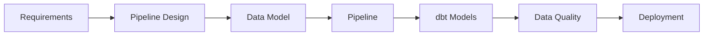
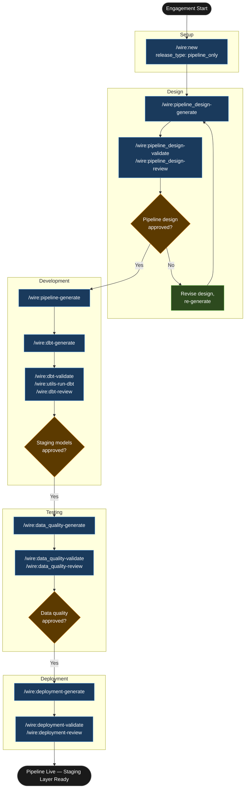

# Tutorial: Pipeline and dbt

## Statement of Work

```
**Rittman Analytics × Meridian Logistics Group**
**Engagement**: `01-meridian-pipeline-staging`
**Date**: June 2026
**Type**: Time and materials

### Engagement overview

Meridian Logistics Group operates across three disconnected systems — Salesforce (CRM and contracts), NetSuite (finance and ERP), and a bespoke fleet management application with no existing integration. The commercial team needs a unified view of shipment revenue, cost, and on-time delivery in Looker, but no data pipeline exists to bring these sources together. Rittman Analytics is engaged to deliver the ingestion layer and dbt staging models, establishing clean, tested, freshness-monitored raw data in BigQuery as the foundation for a subsequent warehouse modelling engagement.

### In scope

- Fivetran Salesforce REST API connector — `Account`, `Opportunity`, `Contract`, `ContractLineItem` objects, CDC enabled, syncing to `raw_salesforce` BigQuery dataset
- Fivetran NetSuite REST API connector — `Transaction`, `TransactionLine`, `Item`, `Vendor` records, CDC enabled, syncing to `raw_netsuite` BigQuery dataset
- Custom fleet ingest pipeline: Cloud Function (Python) triggered every 15 minutes by Cloud Scheduler, polling SFTP for delivery and route export files, staging raw CSVs to GCS, loading to `raw_fleet` BigQuery dataset via the Storage Write API
- `sources.yml` dbt source definitions for all three raw BigQuery schemas
- Six dbt staging models: `stg_salesforce__accounts`, `stg_salesforce__contracts`, `stg_netsuite__invoices`, `stg_netsuite__items`, `stg_fleet__deliveries`, `stg_fleet__routes`
- 24 schema tests: `not_null` and `unique` on primary keys, `relationships` on foreign keys
- Source freshness checks: Salesforce warn 24h/error 48h, NetSuite warn 24h/error 48h, fleet warn 30min/error 1h — with Slack alerting to `#data-alerts` on any error-level breach
- Deployment runbook covering Fivetran activation sequence, Cloud Function deployment, and dbt Core scheduling via Cloud Scheduler

### Out of scope

- Integration models (`int__` layer) and warehouse models (`_dim`/`_fct` layer) — deferred to a follow-on `dbt_development` engagement
- LookML authoring or any work within the existing Looker instance
- Dashboard creation
- End-user training

### Timeline

| Day(s) | Activity |
|--------|----------|
| Day 1 | Pipeline design: architecture document, source-by-source design decisions, MAR estimates, review and approval |
| Days 2–3 | Connector configuration and testing: Fivetran connectors for Salesforce and NetSuite, Cloud Function for fleet SFTP, first successful loads verified |
| Day 4 | dbt staging models: all 6 SQL files, 24 schema tests, documentation YAML, dbt run and validation |
| Day 5 | Data quality checks, freshness configuration, deployment runbook, handover |

### Key assumptions

- Salesforce and NetSuite API credentials (OAuth client ID and secret, or service account details) provided before Day 1
- Fleet system SFTP credentials (host, username, SSH key) and file format specification provided before Day 1 — the Cloud Function design depends on knowing the export schema
- GCP project exists with BigQuery and Cloud Functions APIs enabled; Rittman Analytics granted sufficient IAM permissions to deploy Cloud Functions and create BigQuery datasets
- Meridian's data engineer is available during Days 2–3 to review connector configs and validate that raw data matches expectations in source systems
- The 15-minute micro-batch frequency for the fleet function is sufficient to meet the on-time delivery freshness SLA — if a tighter SLA is identified during design, scope and timeline will need to be revised

### Acceptance criteria

- All three sources — Salesforce, NetSuite, and fleet SFTP — loading into BigQuery raw schemas without errors, with no data loss or duplication observable in the `raw_fleet.ingest_log` control table
- All 6 dbt staging models built successfully and all 24 schema tests passing in the BigQuery environment
- Source freshness checks alerting correctly in Slack — verified by manually delaying a test load and confirming the alert fires within the expected window
- Cloud Scheduler job for the fleet Cloud Function confirmed running on 15-minute cadence for 24 hours prior to handover, with no unhandled errors in Cloud Logging
```


## What is a Pipeline and dbt release?

A `pipeline_only` release covers ingestion and the dbt staging layer — nothing further. You configure and activate the connectors, define the raw landing schemas in the warehouse, and build staging models that normalise and document what arrived. Warehouse models, semantic layer authoring, and dashboards are explicitly out of scope. They follow in a subsequent `dbt_development` release, or in a `full_platform` release if the BI layer is also in scope.

This split makes sense when the sources are complex enough to deserve focused engineering attention before any modelling decisions are made. Three new connectors with different latency profiles, a bespoke SFTP system that needs a custom Cloud Function, and a client data team that wants to validate raw data quality before committing to a warehouse design — all of these are reasons to deliver the pipeline and staging layer first and treat the warehouse layer as phase two. You get clean, tested, freshness-monitored raw data into the warehouse on a predictable schedule, and the downstream modelling work starts from a solid foundation rather than a moving target.

### High-Level Process



## Scenario

| | |
|-|-|
| **Client** | Meridian Logistics Group |
| **Sector** | UK freight — road and rail, ~300 employees |
| **Release** | `01-meridian-pipeline-staging` |
| **Release type** | `pipeline_only` |
| **Stack** | BigQuery, Fivetran, dbt Core |

Meridian runs its commercial operations across three systems: Salesforce for CRM and contract management, NetSuite for finance and ERP, and a bespoke fleet management application that exports operational data via SFTP. The commercial team needs a unified view of shipment revenue, cost, and on-time delivery performance in their existing Looker instance. The catch is that no two systems share a customer or contract identifier, and the fleet system has never been integrated with anything.

The scope for this release is deliberate: Fivetran connectors where standard connectors exist, a custom ingest path for the fleet SFTP, raw landing schemas in BigQuery, and dbt staging models with tests. Warehouse models and LookML follow in a subsequent release once the data team has validated that what is arriving in BigQuery is accurate.

## Deliverables

| Deliverable | Description |
|---|---|
| Fivetran connector configs | Salesforce REST API connector, NetSuite REST API connector |
| Fleet ingest function | Cloud Function (Python) polling SFTP, staging to GCS, loading to BigQuery |
| BigQuery landing schemas | Three `raw_` prefixed datasets with column-level descriptions |
| `sources.yml` | dbt source definitions for all three raw schemas |
| Staging models (6) | One model per raw entity — normalisation, type casting, boolean flags |
| Schema tests | 24 tests: `not_null` and `unique` on PKs, `relationships` on FKs |
| Source freshness checks | Configured with alerting thresholds per source |

## Tutorial Playbook

The diagram below is the delivery playbook for this tutorial's scenario. In a live engagement, [`/wire:playbook-generate`](../reference/commands#session-and-management-commands) generates this as a Mermaid-format delivery plan — dependency order, team assignments, and target dates tailored to the specific release.



## Walkthrough

### Engagement setup

:::info[First release in this repository?]

If this is the first release created in a git repository, `/wire:new` will first take you through the steps to set up the overall client engagement — naming the client, setting the engagement context, and configuring any integrations — before scaffolding the release itself. See [Setting up a new engagement](https://docs.rittmananalytics.com/en/latest/docs/getting-started/engagements-releases#setting-up-a-new-engagement) for further details.

:::

```
/wire:new
→ Client: Meridian Logistics Group
→ Engagement name: meridian
→ Release type: pipeline_only
→ Release ID: 01-meridian-pipeline-staging
→ Branch: feature/meridian-pipeline-staging
→ .wire/releases/01-meridian-pipeline-staging/status.md created
  7 artifacts across 4 phases, all at not_started
```

:::info[Issue tracking and document sync]

Wire can sync artifact progress to [Jira](../advanced/issue-tracking#jira-integration) or [Linear](../advanced/issue-tracking#linear-integration) as each generate, validate, and review step completes. With the Jira integration, you can choose between one sub-task per lifecycle step (each moving through its own workflow states) or one ticket per artifact that transitions between issue statuses. Wire can create the Epic and issue hierarchy for you when you run `/wire:new`, or link to an existing one you have already set up.

Generated artifacts can also be replicated to [Confluence](../advanced/document-store#confluence) or [Notion](../advanced/document-store#notion) for client review — review commands pull comments and edits made in the document store back as context before gathering sign-off.

Both integrations are optional. Configure the [Atlassian](../reference/mcp-servers#atlassian), [Linear](../reference/mcp-servers#linear), or [Notion](../reference/mcp-servers#notion) MCP servers in `.claude/settings.json` to enable them.

:::


Before running any generate commands, copy the Salesforce and NetSuite field exports and the SFTP file layout specification into `releases/01-meridian-pipeline-staging/requirements/`. The `pipeline-engineer` agent reads the SFTP spec to understand the fleet export format before writing any Cloud Function code.

### Pipeline design — auto-delegated to `pipeline-engineer`

```
/wire:pipeline_design-generate 01-meridian-pipeline-staging
→ [auto-delegated to pipeline-engineer agent]
```

:::info[Auto-delegation]

When you see `-> [auto-delegated to X agent]`, the main session has routed that command to a [specialist subagent](../advanced/wire-agents#auto-delegation-on-individual-commands) automatically — no extra steps needed. The specialist runs with a focused brief rather than the full engagement context, which typically produces sharper domain-specific output. Review commands (`*-review`) always stay in the main session and require your direct input.

:::

The agent produces a full pipeline architecture document covering all three sources. Key design decisions:

**Salesforce**: standard Fivetran REST API connector with CDC enabled. Captures `Account`, `Opportunity`, `Contract`, and `ContractLineItem` objects. Estimated MAR contribution: ~1.2M rows/month.

**NetSuite**: standard Fivetran REST API connector with CDC. Captures `Transaction`, `TransactionLine`, `Item`, and `Vendor` records. Estimated MAR contribution: ~2.1M rows/month.

**Fleet system**: no standard connector exists. The agent designs a custom ingest path — a Cloud Function triggered every 15 minutes by Cloud Scheduler, polling the SFTP endpoint for new delivery and route export files, staging raw CSVs to a GCS bucket, then loading to BigQuery via the Storage Write API. This 15-minute micro-batch interval is necessary to meet the on-time delivery dashboard freshness SLA specified in the requirements.

Combined MAR estimate: ~4.8M rows/month across all three sources.

The agent appends to `decisions.md`: CDC chosen for Salesforce and NetSuite in preference to full-table replication — at this MAR volume, full-table replication would process approximately 3.6× more data per sync cycle with no analytical benefit.

```
/wire:pipeline_design-validate 01-meridian-pipeline-staging → PASS
/wire:pipeline_design-review 01-meridian-pipeline-staging
→ [main session]
→ Approved by infrastructure lead, 2026-06-10
→ Decision: fleet function to use exponential backoff on SFTP connection failures, max 3 retries
```

### Pipeline implementation — auto-delegated to `pipeline-engineer`

```
/wire:pipeline-generate 01-meridian-pipeline-staging
→ [auto-delegated to pipeline-engineer agent]
```

The agent generates Fivetran connector configuration files for Salesforce and NetSuite — schema selection, sync frequency (every 6 hours), field inclusion lists, and destination dataset names (`raw_salesforce`, `raw_netsuite`).

For the fleet system, the agent writes a Cloud Function in Python. The function signature and staging logic:

```python
def poll_fleet_sftp(request):
    """
    Cloud Function: polls fleet SFTP for new delivery and route exports,
    stages raw files to GCS, loads to BigQuery raw_fleet dataset.
    Triggered by Cloud Scheduler every 15 minutes.
    """
    client = get_sftp_client(
        host=os.environ["FLEET_SFTP_HOST"],
        username=os.environ["FLEET_SFTP_USER"],
        key_path="/secrets/fleet_sftp_key"
    )
    new_files = list_new_files(client, remote_path="/exports/", 
                               since=get_last_processed_ts())
    for f in new_files:
        gcs_uri = stage_to_gcs(client, f, bucket=os.environ["GCS_STAGING_BUCKET"])
        load_to_bigquery(gcs_uri, table=derive_table_name(f),
                         dataset="raw_fleet", write_disposition="WRITE_APPEND")
        record_processed(f)
```

The GCS staging step retains the raw file for 30 days, giving the data team an audit trail before BigQuery loading. The `record_processed` call writes to a `raw_fleet.ingest_log` control table so the function never reprocesses a file, even if Cloud Scheduler fires early or the function is retried after a partial failure.

### Staging models — auto-delegated to `dbt-developer`

```
/wire:dbt-generate 01-meridian-pipeline-staging
→ [auto-delegated to dbt-developer agent]
→ 6 staging models generated, 24 tests written
```

The six staging models: `stg_salesforce__accounts`, `stg_salesforce__contracts`, `stg_netsuite__invoices`, `stg_netsuite__items`, `stg_fleet__deliveries`, `stg_fleet__routes`.

The fleet delivery model does meaningful field-level work — the raw SFTP export contains epoch timestamps, a numeric status code, and distance in metres:

```sql
-- models/staging/fleet/stg_fleet__deliveries.sql
with source as (
    select * from {{ source('raw_fleet', 'deliveries') }}
),

renamed as (
    select
        delivery_id,
        route_id,
        vehicle_id,
        timestamp_seconds(scheduled_ts_epoch)           as scheduled_at,
        timestamp_seconds(actual_ts_epoch)              as delivered_at,
        distance_m / 1000.0                             as distance_km,
        status_code = 1                                 as is_on_time,
        status_code = 3                                 as is_failed,
        _file_name                                      as source_file,
        _loaded_at                                      as ingested_at

    from source
)

select * from renamed
```

The `is_on_time` boolean flag is derived here, at the staging layer, because it is a direct function of the raw `status_code` value — no cross-source join is required, and it would be incorrect to leave an integer status code for warehouse developers to re-interpret independently.

```
/wire:dbt-validate 01-meridian-pipeline-staging
→ Checking ref() usage in all CTEs ... PASS
→ Checking source() calls in staging models only ... PASS
→ Checking schema.yml coverage ... PASS
→ PASS

/wire:utils-run-dbt 01-meridian-pipeline-staging
→ dbt run: 6 models built (0 errors, 0 warnings)
→ dbt test: 24 tests passed, 0 failed

/wire:dbt-review 01-meridian-pipeline-staging
→ Approved by analytics engineering lead, 2026-06-11
```

### Data quality — auto-delegated to `data-quality-engineer`

```
/wire:data_quality-generate 01-meridian-pipeline-staging
→ [auto-delegated to data-quality-engineer agent]
```

The agent configures source freshness checks in `sources.yml`: Salesforce warn at 24h, error at 48h; NetSuite warn at 24h, error at 48h; fleet SFTP warn at 30 minutes, error at 1 hour. The tight fleet threshold reflects the 15-minute micro-batch frequency — if no file has arrived within 30 minutes, something is wrong with the SFTP polling function. Slack alerts route to `#data-alerts` on any error-level breach.

```
/wire:data_quality-validate 01-meridian-pipeline-staging → PASS
/wire:data_quality-review 01-meridian-pipeline-staging → Approved 2026-06-11
```

### Deployment

```
/wire:deployment-generate 01-meridian-pipeline-staging
```

The runbook covers the activation sequence: enable Fivetran connectors for Salesforce and NetSuite, deploy the fleet Cloud Function and Cloud Scheduler trigger, verify the first successful load to all three raw datasets, then run `dbt run` and `dbt test` against the live data. dbt Core scheduling runs via Cloud Scheduler on a 30-minute cadence, triggered after the Salesforce and NetSuite Fivetran sync windows.

```
/wire:deployment-validate 01-meridian-pipeline-staging → PASS
/wire:deployment-review 01-meridian-pipeline-staging → Approved 2026-06-12
```

## What was produced

| Artifact | Detail |
|---|---|
| Fivetran configs | Salesforce and NetSuite connector configurations, schema selections |
| Fleet Cloud Function | Python SFTP polling function with GCS staging and BigQuery load |
| BigQuery landing schemas | `raw_salesforce`, `raw_netsuite`, `raw_fleet` — column-level descriptions |
| `sources.yml` | dbt source definitions for all three raw schemas |
| Staging models | 6 SQL files across Salesforce, NetSuite, and fleet sources |
| Schema tests | 24 tests: `not_null`, `unique`, relationship integrity |
| Freshness checks | Per-source thresholds with Slack alerting |
| Deployment runbook | Fivetran activation sequence + dbt Core scheduling via Cloud Scheduler |
| `decisions.md` | CDC selection rationale, micro-batch frequency decision, `is_on_time` flag placement |

## Next steps

Follow this release with a `dbt_development` release to build the integration and warehouse layer — the unified customer model, contract revenue facts, and on-time performance metrics that the Looker dashboards will sit on. If the LookML authoring and dashboard configuration are also in scope for the same engagement sprint, use a `full_platform` release instead, which covers the semantic layer and dashboard phases in a single end-to-end delivery.
