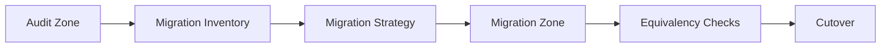
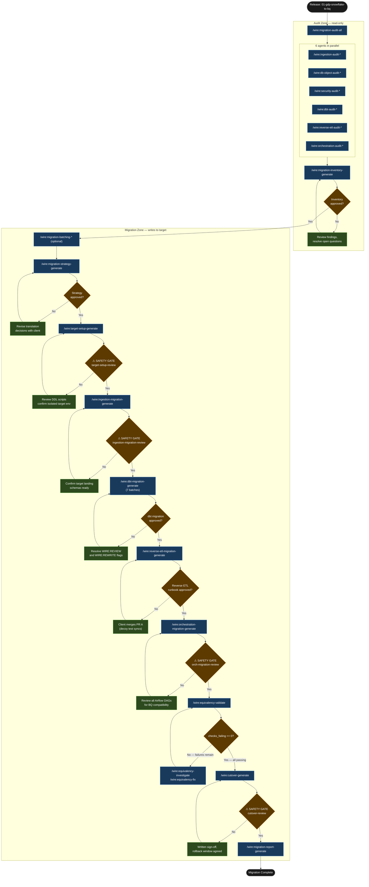
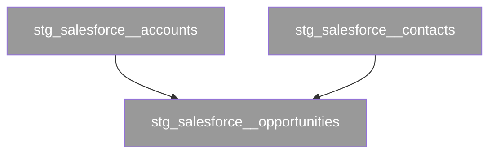

# Tutorial: Platform Migration

This walkthrough traces a complete platform migration engagement from audit through cutover, using a fictional B2B data services client moving their analytics stack from Snowflake to BigQuery. It covers every domain in the migration sequence — ingestion (Fivetran), database objects, security, dbt, reverse ETL (Hightouch), and orchestration (Airflow) — shows how the two-zone model keeps the audit phase safe, and demonstrates the equivalency validation loop that gates cutover.

## Statement of Work

```
**Rittman Analytics × Gatwick Data Partners**
**Engagement**: Snowflake to BigQuery Platform Migration
**Date**: March 2026
**Type**: Fixed price

### Engagement overview

Gatwick Data Partners operates a Snowflake-based analytics platform that must migrate to BigQuery before a fixed board-mandated GCP consolidation deadline. The Snowflake contract renewal window cannot slip. Rittman Analytics will execute a full platform migration — 180 dbt models, four Fivetran connectors, 22 Hightouch reverse ETL syncs, Airflow orchestration, and the Looker semantic layer — using Wire's two-zone model to keep the audit phase entirely read-only and gate every write to the target platform behind a safety review.

### In scope

- Full audit of the existing Snowflake platform: all four Fivetran connectors (Salesforce, NetSuite, Intercom, SFTP), all Snowflake database objects, security roles and grants, 180 dbt models (classified by migration complexity), 26 Hightouch reverse ETL syncs, and 11 Airflow DAGs
- Migration inventory and risk matrix derived from the six audits
- Migration strategy document covering all Snowflake-to-BigQuery translation decisions
- Target BigQuery environment setup: four datasets (`gdp_raw`, `gdp_staging`, `gdp_integration`, `gdp_warehouse`), IAM bindings, service account provisioning — derived from the DB object and security audits
- Fivetran connector reconfiguration to BigQuery destinations for all four connectors (two native BQ destinations; two requiring manual reconfiguration via HVR and custom connector update)
- Translation of all 180 dbt models across seven batches (132 auto-translated, 45 guided-translate, 3 full rewrites for Snowflake VARIANT handling)
- Hightouch reverse ETL migration: 22 in-scope syncs added as target-warehouse syncs to the existing GitHub-Sync config repo, validated against decoy destinations, cut over via two client-merged pull requests
- Airflow orchestration migration: 11 DAGs rewritten for BigQuery (Snowflake operators and connection swapped), secrets moved from Airflow connections to a GCP Secret Manager backend
- Equivalency validation loop: row count, schema, value, freshness, and dbt tests run against both platforms until `checks_failing: 0`
- Structured cutover with a 72-hour Snowflake rollback window
- Migration report documenting all decisions and outcomes

### Out of scope

- Looker dashboard redesign or LookML rewrites beyond the minimum required to make existing explores work against BigQuery (the `netsuite_explore` PDT patch is in scope; broader LookML refactoring is not)
- New source connections, new Hightouch syncs, or new Airflow DAGs not already active in the Snowflake environment
- Post-migration feature development, new dbt models, or analytics layer extensions
- AWS infrastructure or any GCP services outside the BigQuery and Secret Manager resources created during target setup

### Timeline

| Period | Activity |
|---|---|
| Weeks 1–2 | Audit zone: six parallel audits (ingestion, DB objects, security, dbt, reverse ETL, orchestration), all approved before any migration work begins |
| Week 3 | Migration inventory synthesis and migration strategy document; both approved before target setup |
| Weeks 4–6 | Target setup (safety gate), Fivetran connector reconfiguration (safety gate), dbt migration batches 1–7, Hightouch reverse ETL syncs added as PR-gated changes |
| Week 7 | Airflow orchestration migration (safety gate), equivalency validation loop — investigate and fix cycles until `checks_failing: 0` |
| Week 8 | Two-week parallel run window; final equivalency validation; cutover (safety gate) including the two reverse ETL cutover PRs; migration report |

### Key assumptions

- The existing Snowflake account remains live and accessible throughout the engagement; Rittman Analytics requires read credentials for all schemas in scope
- Gatwick Data Partners provides a GCP project (`gdp-analytics-prod`) with billing active and sufficient IAM permissions for Rittman Analytics to create datasets, service accounts, and Secret Manager secrets
- All four Fivetran connectors support BigQuery as a destination (Salesforce and NetSuite confirmed native; Intercom and SFTP compatibility to be confirmed in the ingestion audit — any gaps are a scope risk)
- Hightouch is managed by GitHub Sync against a config repository the client controls; the client owns the merge of every migration pull request, including the two cutover PRs
- The two-week parallel run window (weeks 7–8) is agreed with the client's operations team before the engagement begins; no production Snowflake workloads will be decommissioned within this window without the client's written sign-off
- Looker PDT rebuild is scheduled outside business hours; the client's retail data customers will experience a brief dashboard unavailability during the PDT rebuild at cutover

### Acceptance criteria

- All 180 dbt models producing equivalent output in BigQuery with `checks_failing: 0` across all five equivalency check types (row count ±2%, schema match, value spot-check, freshness, dbt tests)
- All four Fivetran connectors active and syncing to BigQuery destinations
- All 22 in-scope Hightouch syncs deployed as target-warehouse syncs, validated against decoy destinations, with production destination IDs confirmed absent from the test syncs until the cutover PR
- All 11 Airflow DAGs running on the target with BigQuery connections and no task failures
- Looker connected to BigQuery; all 12 production dashboards verified by the client and confirmed undisrupted
- Written cutover sign-off on record in `decisions.md` from an authorised Gatwick Data Partners stakeholder before the Snowflake read access window closes
```


## What is a Platform Migration release?

The Platform Migration release type is built around one structural insight: the moment you start writing to the target platform, the risk profile changes entirely. To reflect this, Wire divides all migration work into two zones.

The **audit zone** is read-only. The audit commands — ingestion, database objects, security, dbt, orchestration, and (where the source platform has reverse ETL) Hightouch — connect to the source platform and produce catalogues. Nothing is created, reconfigured, or modified anywhere. An analyst running these commands on a production Snowflake environment cannot break anything. The zone is designed to be safely executable by someone with read credentials and no write access to either platform.

The **migration zone** writes to the target. It begins with the migration strategy — a pure document, no external writes — and escalates to DDL execution, connector reconfiguration, dbt batch translation, reverse ETL sync deployment, orchestration migration, and finally cutover. Four commands in this zone are **safety-gated**: `target-setup-review`, `ingestion-migration-review`, `orchestration-migration-review`, and `cutover-review`. Each requires explicit confirmation before Wire proceeds. The cutover gate is the point of no return — it requires all equivalency checks passing, written client sign-off on record, and an agreed rollback window.

The **equivalency validation loop** sits between orchestration migration and cutover. It runs five check types — row count, schema, value, freshness, and dbt tests — against both platforms simultaneously. When checks fail, you run `equivalency-investigate` to diagnose and `equivalency-fix` to repair. `cutover-generate` is blocked until `checks_failing: 0`. There is no way to skip this gate programmatically.

Two domains in this engagement carry their own safety mechanics on top of the zone model. Reverse ETL never writes to a production destination during the build — every test sync points at a **decoy** destination of the same type, written through a scoped credential that has no grant on the real downstream systems. Orchestration runs a **parallel period** where source and target jobs run side by side before the source schedule is paused. Both are covered below.

### High-Level Process



## The scenario

| | |
|-|-|
| **Client** | Gatwick Data Partners (B2B data services, UK) |
| **Engagement** | Snowflake to BigQuery platform migration |
| **Release ID** | `01-gdp-snowflake-to-bq` |
| **Release type** | `platform_migration` |
| **Migration pair** | `snowflake_to_bigquery` |
| **Target duration** | 8 weeks (parallel-run window: weeks 7–8) |

**Scope**: 180 dbt models (mix of dbt Core and dbt Cloud managed), 4 Fivetran connectors (Salesforce, NetSuite, Intercom, SFTP), 26 Hightouch reverse ETL syncs (managed by GitHub Sync, destinations across Salesforce, Braze, Iterable, and Google Sheets), Airflow orchestration with 11 DAGs, Looker semantic layer with 6 explores and 12 dashboards.

The 8-week deadline is driven by a board-mandated cloud consolidation onto GCP, which means the Snowflake contract renewal window is fixed. Slipping past it means an unplanned renewal. Two elements carry the most operational uncertainty. The Airflow DAGs use `SnowflakeOperator` and a `snowflake_default` connection throughout, so DAG code needs hands-on review rather than a syntax substitution. And the Hightouch syncs write to live customer-facing systems — a single mistaken sync run during validation would push test data into Braze or Salesforce, so the build must keep production destinations out of reach until cutover. The Looker semantic layer must remain intact throughout; disrupting the 12 production dashboards during migration is not acceptable to the client's retail data customers.

## What you will produce

**Audit zone** — read-only analysis:

| Artifact | Location |
|---|---|
| Ingestion audit (4 Fivetran connectors catalogued) | `artifacts/ingestion_audit/` |
| DB object audit (Snowflake databases, schemas, tables, views) | `artifacts/db_object_audit/` |
| Security audit (roles, grants, service accounts) | `artifacts/security_audit/` |
| dbt audit (180 models classified by complexity) | `artifacts/dbt_audit/` |
| Reverse ETL audit (26 Hightouch syncs, source-resolution coverage) | `artifacts/reverse_etl_audit/` |
| Orchestration audit (11 Airflow DAGs, schedules, dependencies) | `artifacts/orchestration_audit/` |
| Migration inventory (unified catalogue, risk matrix, phasing plan) | `artifacts/migration_inventory/` |

**Migration zone** — target platform artifacts:

| Artifact | Location |
|---|---|
| Migration strategy (translation decisions, wave phasing, rollback) | `artifacts/migration_strategy/` |
| Target setup DDL (BigQuery datasets, IAM, service accounts) | `artifacts/target_setup/` |
| Ingestion migration (Fivetran connector reconfigurations) | `artifacts/ingestion_migration/` |
| dbt migration (180 translated models, 7 batches) | `models/` (in-repo) |
| Reverse ETL migration (Hightouch runbook + decoy mapping) | `artifacts/reverse_etl_migration/` |
| Orchestration migration (11 Airflow DAGs, rewritten for BigQuery) | `artifacts/orchestration_migration/` |
| Equivalency validation reports (iterative) | `artifacts/equivalency_validation/` |
| Cutover runbook | `artifacts/cutover/` |
| Migration report | `artifacts/migration_report/` |

## Tutorial Playbook

The diagram below is the delivery playbook for this tutorial's scenario. In a live engagement, [`/wire:playbook-generate`](../reference/commands#session-and-management-commands) generates this as a Mermaid-format delivery plan — dependency order, team assignments, and target dates tailored to the specific release.



## Walkthrough

### 5a. Setup and audit zone

:::info[First release in this repository?]

If this is the first release created in a git repository, `/wire:new` will first take you through the steps to set up the overall client engagement — naming the client, setting the engagement context, and configuring any integrations — before scaffolding the release itself. See [Setting up a new engagement](https://docs.rittmananalytics.com/en/latest/docs/getting-started/engagements-releases#setting-up-a-new-engagement) for further details.

:::

```
/wire:new
→ Client: Gatwick Data Partners
→ Engagement name: gatwick_data_partners
→ Release type: platform_migration
→ Release ID: 01-gdp-snowflake-to-bq
→ Branch: feature/01-gdp-snowflake-to-bq

Platform Migration — additional questions:
  (1) Source platform: Snowflake
  (2) Target platform: BigQuery
  (3) dbt project path: dbt/gdp_analytics
  (4) Orchestration tool: Airflow
  (5) Reverse ETL tool: Hightouch
  (6) Connectivity: public endpoint (Snowflake + BigQuery both reachable)

→ .wire/releases/01-gdp-snowflake-to-bq/status.md created
  16 migration artifacts across audit + migration zones, all at not_started
  migration_pair: snowflake_to_bigquery
```

### Register the source dbt repository (v3.9.9+)

Before running the first dbt migration batch, register the source dbt project location and create a local snapshot:

```
/wire:migration-source-register 01-gdp-snowflake-to-bq

[wire] Registering source dbt repository
────────────────────────────────────────────────────────
  git_repo:              https://github.com/gdp/analytics-dbt
  branch:                main
  models_path:           models/
  local_snapshot_path:   .wire/releases/01-gdp-snowflake-to-bq/migration/source_snapshot/

Saved to status.md under migration_source. Run /wire:migration-source-refresh to create the local snapshot.

/wire:migration-source-refresh 01-gdp-snowflake-to-bq

[wire] Refreshing source snapshot...
  Cloning: https://github.com/gdp/analytics-dbt (branch: main)
  .wire/releases/01-gdp-snowflake-to-bq/migration/source_snapshot/ created
  180 models found:
    staging/        82 models
    integration/    58 models
    warehouse/      40 models
  migration_source.last_refreshed: 2026-04-08
```

:::info[Issue tracking and document sync]

Wire can sync artifact progress to [Jira](../advanced/issue-tracking#jira-integration) or [Linear](../advanced/issue-tracking#linear-integration) as each generate, validate, and review step completes. With the Jira integration, you can choose between one sub-task per lifecycle step (each moving through its own workflow states) or one ticket per artifact that transitions between issue statuses. Wire can create the Epic and issue hierarchy for you when you run `/wire:new`, or link to an existing one you have already set up.

Generated artifacts can also be replicated to [Confluence](../advanced/document-store#confluence) or [Notion](../advanced/document-store#notion) for client review — review commands pull comments and edits made in the document store back as context before gathering sign-off.

Both integrations are optional. Configure the [Atlassian](../reference/mcp-servers#atlassian), [Linear](../reference/mcp-servers#linear), or [Notion](../reference/mcp-servers#notion) MCP servers in `.claude/settings.json` to enable them.

:::


:::info[MCP server connections for migration commands]

The audit and migration commands reach beyond Wire's standard integrations — they connect directly to your source platform, target platform, ingestion service, reverse ETL tool, and orchestration layer to read schema, inspect pipeline state, and run equivalency checks. Configure the relevant connections in `.claude/settings.json` before running the first audit command. The Hightouch audit reads via the Hightouch REST API (`HIGHTOUCH_TOKEN`) or a copy of the client's GitHub Sync config at `audit/hightouch_git/`. See [MCP Servers](../reference/mcp-servers) for the full list of supported servers and connection setup.

:::


With the release created, run all six audits simultaneously:

```
/wire:migration-audit-all 01-gdp-snowflake-to-bq

Token cost confirmation
─────────────────────────────────────────────────────────────────
  6 audit agents × estimated 12k tokens each ≈ 72k tokens total
  (5 core audits + reverse ETL, run because Hightouch is in scope)
  Parallel (recommended): ~9 min wall-clock
  Sequential: ~42 min wall-clock

  Proceed in parallel? [Y/n]: Y

Dispatching 6 agents simultaneously:
  → [migration-specialist agent: ingestion-audit-generate]
  → [migration-specialist agent: db-object-audit-generate]
  → [migration-specialist agent: security-audit-generate]
  → [migration-specialist agent: dbt-audit-generate]
  → [migration-specialist agent: reverse-etl-audit-generate]
  → [migration-specialist agent: orchestration-audit-generate]
```

The **dbt audit** produces a complexity classification table for all 180 models:

```
dbt Audit — Model Complexity Classification
──────────────────────────────────────────────────────────────────────
  Rating      Count   Notes
  ──────────  ─────   ──────────────────────────────────────────────
  trivial       82    Views and simple selects; no platform functions
  low           50    DATE_DIFF, SPLIT, DATEADD — direct equivalents
  medium        31    Incremental models; 3+ function substitutions
  high          14    Nested FLATTEN logic; complex MERGE strategies
  blocked        3    Use VARIANT type with no BigQuery equivalent

  BLOCKED MODELS:
    stg_salesforce__opportunity_history
      — PARSE_JSON(variant_col) with downstream FLATTEN: no direct
        BQ equivalent; requires redesign as JSON STRING + JSON_EXTRACT
    int__netsuite_line_items
      — LATERAL FLATTEN(input => custom_fields) across 4 CTEs
    fct_intercom_event_attributes
      — VARIANT array with positional access [:0], [:1]: must
        rewrite using JSON_EXTRACT_ARRAY
```

The **ingestion audit** finds a split in Fivetran connector compatibility:

```
Ingestion Audit — Fivetran Connector Analysis
──────────────────────────────────────────────────────────────────────
  Connector       Source      Current dest   BQ native?   Action needed
  ──────────────  ──────────  ─────────────  ──────────   ─────────────
  salesforce      Salesforce  Snowflake      Yes          Add new BQ destination
  netsuite        NetSuite    Snowflake      Yes          Add new BQ destination
  intercom        Intercom    Snowflake      No           Reconfigure via HVR
  sftp_retail     SFTP        Snowflake      No (SFTP)    Custom connector update

  2 of 4 connectors support BigQuery as a native destination.
  2 require manual reconfiguration. See ingestion_audit/connector_detail.md
  for recommended approach per connector.
```

The **DB object and security audits** are read-only inventories. They do not have their own migration commands — instead they feed the target setup. The DB object audit enumerates every database, schema, table, view, and stored procedure on Snowflake; the security audit catalogues roles, grants, users, and service accounts. Both become inputs to `target-setup-generate`, which derives the BigQuery dataset layout and IAM bindings from them (see 5d).

```
DB Object Audit — Snowflake Inventory
──────────────────────────────────────────────────────────────────────
  Databases:        1 (GDP_ANALYTICS)
  Schemas:          4 (RAW, STAGING, INTEGRATION, WAREHOUSE)
  Tables:         263   Views:  118   Materialized views: 4
  Stored procedures: 2 (both Snowflake JavaScript — flagged: no BQ
                       equivalent, manual reimplementation required)
  → Drives the four-dataset BigQuery target layout in target_setup

Security Audit — Roles and Grants
──────────────────────────────────────────────────────────────────────
  Roles:            7 (SYSADMIN, TRANSFORMER, REPORTER, LOADER, + 3 custom)
  Service accounts: 3 (FIVETRAN_SVC, DBT_CLOUD_SVC, LOOKER_SVC)
  PII-tagged cols: 41 across 9 tables (Snowflake MASKING POLICY)
  → BQ target maps TRANSFORMER → BigQuery Data Editor, REPORTER →
    Data Viewer; the 41 PII columns require BigQuery policy tags applied
    in target_setup before any migration batch runs
```

The **reverse ETL audit** catalogues all 26 Hightouch syncs and — new in v3.10.0 — resolves the source object behind every model type, not just raw-SQL models:

```
Reverse ETL Audit — Hightouch Sync Catalogue
──────────────────────────────────────────────────────────────────────
  Active syncs:           26
  By destination:  Salesforce 9 · Braze 7 · Iterable 6 · Google Sheets 4
  By model type:   dbtModel 14 · table 7 · custom 5
  By approach:     repoint 16 · rewrite_model 7 · rebuild 3

  Source-resolution coverage:  24 / 26 active syncs resolved (92.3%)
    rawSql   resolved by SQL parse
    dbtModel resolved against the dbt audit catalogue
    table    resolved directly to the configured source table
    custom   3 of 5 resolved from the model definition

  UNRESOLVED (2) — source layer and drift exposure unknown:
    sync_braze_winback_audience  (custom) — query body references a
      session-scoped temp table; cannot resolve statically
    sync_gsheet_finance_extract  (custom) — connection metadata only

  Deployment: GitHub Sync (config repo: gdp/hightouch-config)
    → migration defaults to additive PR-gated syncs in this repo
```

:::tip[Why source resolution matters]

Before v3.10.0 the reverse ETL audit only parsed `rawSql` models, so `table` and `custom` syncs landed with blank `warehouse_objects` — in a real Carwow audit that left 37% of active syncs with no recorded source object, and no way to know which ones touched a column that would drift between platforms. The audit now resolves all four model types and reports a coverage metric, so unresolved syncs are listed explicitly rather than silently dropped.

:::

The **orchestration audit** catalogues the 11 Airflow DAGs, their schedules, and their dependencies:

```
Orchestration Audit — Airflow DAG Inventory
──────────────────────────────────────────────────────────────────────
  DAGs:              11   Tasks: 84   Schedules: 9 (2 DAGs sensor-triggered)
  Operators in use:  SnowflakeOperator (38), PythonOperator (29),
                     SnowflakeHook via custom operators (11), others (6)
  Connections:       snowflake_default (used by all 11 DAGs)
  Secrets:           Snowflake credentials stored as an Airflow connection
                     in the metadata DB — no external secrets backend
  → Every SnowflakeOperator/Hook task must move to a BigQuery operator
    + bigquery_default connection; secrets to a GCP Secret Manager backend
```

### 5b. Migration inventory

Once all six audits are approved, the inventory synthesises them:

```
/wire:migration-inventory-generate 01-gdp-snowflake-to-bq
→ [auto-delegated to migration-specialist agent]

Migration Inventory — Risk Summary
──────────────────────────────────────────────────────────────────────
  HIGH risk items (4):
    RISK-01: VARIANT type handling — 3 blocked dbt models require full
             redesign; estimated 3–4 days manual effort
    RISK-02: Airflow Snowflake coupling — all 11 DAGs use
             SnowflakeOperator and a single snowflake_default
             connection; each task must move to a BigQuery operator
             and bigquery_default connection, and Snowflake credentials
             must move from an Airflow connection to a GCP Secret
             Manager backend
    RISK-03: Reverse ETL type drift — under BigLake Iceberg, Fivetran
             lands some Snowflake VARIANT columns as STRING, not JSON.
             2 Hightouch syncs extract from such columns; the generic
             VARIANT → JSON / JSON_VALUE translation would silently
             produce wrong results. Translation must be drift-aware.
    RISK-04: Looker explore using Snowflake-specific SQL — the
             netsuite_explore uses a PDT with TO_DATE(col, 'YYYY-MM-DD')
             and TIMESTAMPDIFF(day, ...); will break on BQ without
             LookML-level patch

  MEDIUM risk items (7):
    RISK-05: 2 unresolved Hightouch custom syncs — source object could
             not be resolved in the audit; must be resolved manually or
             deferred before they can be safely migrated
    RISK-06: 2 Snowflake JavaScript stored procedures — no BQ equivalent
    ...

  Phasing recommendation:
    Wave 1 (weeks 1–2): Connectors (Salesforce, NetSuite native BQ)
                        + trivial/low models (132 models)
    Wave 2 (weeks 3–5): Medium complexity models (31 models)
                        + Intercom/SFTP connector reconfig
                        + Hightouch repoint syncs (those whose dbt
                          models land in waves 1–2)
    Wave 3 (weeks 5–6): High complexity models (14 models, manual review)
                        + Airflow DAG migration
                        + Hightouch rewrite_model / rebuild syncs
    Wave 4 (weeks 7–8): Blocked models redesign (3 models)
                        + equivalency loop + cutover (incl. reverse ETL
                          cutover PRs)
```

:::info[Auto-delegation]

When you see `-> [auto-delegated to X agent]`, the main session has routed that command to a [specialist subagent](../advanced/wire-agents#auto-delegation-on-individual-commands) automatically — no extra steps needed. The specialist runs with a focused brief rather than the full engagement context, which typically produces sharper domain-specific output. Review commands (`*-review`) always stay in the main session and require your direct input.

:::

:::tip[Optional: domain-batch scheduling]

Before moving to strategy, a team scheduling this migration across several sprints or sub-teams would run `/wire:migration-batching-generate 01-gdp-snowflake-to-bq`, `-validate`, then `-review`. It partitions the approved inventory into named, independently-schedulable domain batches — checked against the real dependency graph, not a hand-drawn guess — distinct from the ≤20-model translation batches `dbt_audit` already assigns. Gatwick's migration is small enough to run as a single sequential build, so this tutorial skips straight to strategy; see [Migration batching](../release-types/platform-migration#migration-batching-domain-batches-vs-translation-batches) for the full walkthrough.

:::

### 5c. Migration strategy

```
/wire:migration-strategy-generate 01-gdp-snowflake-to-bq
→ [auto-delegated to migration-specialist agent]
```

A sample of the translation decisions from the strategy document:

```markdown
## Snowflake → BigQuery: Key Translation Decisions

### FLATTEN → UNNEST
  Snowflake: SELECT f.value FROM table, LATERAL FLATTEN(input => arr) f
  BigQuery:  SELECT f FROM table, UNNEST(arr) AS f
  Treatment: auto-translate for simple cases; guided-translate where
             FLATTEN is nested inside a CTE

### DATE_DIFF argument order
  Snowflake: DATEDIFF('day', start_date, end_date)  -- (unit, start, end)
  BigQuery:  DATE_DIFF(end_date, start_date, DAY)   -- (end, start, unit)
  Treatment: auto-translate; regex pattern is unambiguous

### VARIANT column landing type (reverse ETL drift)
  Snowflake: event_props is VARIANT; col:field path access
  BigQuery:  under BigLake Iceberg, event_props lands as STRING, not JSON
  Treatment: drift-aware — for columns in the drift manifest, translate
             against the type the column actually lands as (STRING), not
             the generic VARIANT → JSON / JSON_VALUE mapping

### MERGE with explicit unique_key
  Snowflake: MERGE with WHEN MATCHED / WHEN NOT MATCHED
  BigQuery:  Same syntax; difference is in dbt's unique_key handling
             for incremental models — must be a column, not an
             expression, in BQ adapter
  Treatment: auto-translate merge SQL; flag any unique_key that is
             a dbt expression with WIRE:REVIEW
```

:::info[Batch DAGs generated]

`/wire:migration-strategy-generate` also created one Mermaid progress tracker per batch at `artifacts/migration_strategy/`. Initially all nodes are grey. They update automatically as `dbt-migration-generate` processes each model.



After batch 1 completes all three nodes would show `:::complete` (green).

:::

### 5d. Target setup (SAFETY GATE)

Target setup is where the DB object and security audits pay off. The dataset layout below mirrors the four Snowflake schemas the DB object audit found, and the IAM bindings map the roles the security audit catalogued — `TRANSFORMER` becomes BigQuery Data Editor, `REPORTER` becomes Data Viewer. The 41 PII columns the security audit flagged get BigQuery policy tags applied here, before any migration batch runs.

```
/wire:target-setup-generate 01-gdp-snowflake-to-bq
→ [auto-delegated to migration-specialist agent]
→ DDL scripts generated: artifacts/target_setup/

/wire:target-setup-validate 01-gdp-snowflake-to-bq → PASS

/wire:target-setup-review 01-gdp-snowflake-to-bq

⚠  SAFETY GATE — target-setup-review
──────────────────────────────────────────────────────────────────────
This command will create BigQuery datasets, IAM bindings, and service
accounts in the target GCP project (gdp-analytics-prod).

Before confirming, verify:
  [ ] DDL scripts reviewed: artifacts/target_setup/bigquery_ddl.sql
  [ ] Dataset layout matches the DB object audit (4 schemas → 4 datasets)
  [ ] IAM bindings match the security audit role map
  [ ] PII policy tags applied for the 41 flagged columns
  [ ] Target environment is isolated from any existing production data
  [ ] Client has approved target setup in writing (attach to decisions.md)
  [ ] GCP project billing confirmed active

Proceeding creates the following resources:
  - 4 BigQuery datasets: gdp_raw, gdp_staging, gdp_integration, gdp_warehouse
  - 1 service account: wire-dbt-runner@gdp-analytics-prod.iam.gserviceaccount.com
  - IAM bindings: BigQuery Data Editor on gdp_raw/gdp_staging/gdp_integration/gdp_warehouse
  - Policy tags on 41 PII columns

Confirm? Type YES to proceed: YES

→ BigQuery datasets created (gdp_raw, gdp_staging, gdp_integration, gdp_warehouse)
→ Service account wire-dbt-runner provisioned
→ IAM bindings applied; PII policy tags applied
→ artifacts/target_setup/target_setup.md updated — status: complete
```

### 5e. Ingestion migration — Fivetran (SAFETY GATE)

With the target datasets in place, the Fivetran connectors get new BigQuery destinations. When the Fivetran MCP server is reachable, Wire executes the migration directly through it — creating new connectors and returning setup-card URLs for the client to enter credentials. The rule throughout is **always create new connectors pointing at BigQuery; never re-point or edit an existing Snowflake connector**, so the source pipeline keeps running untouched as the rollback path through the parallel-run window.

```
/wire:ingestion-migration-generate 01-gdp-snowflake-to-bq
→ [auto-delegated to migration-specialist agent]

Pre-flight — in-scope ingestion tools and connectivity
──────────────────────────────────────────────────────────────────────
  Fivetran   CONNECTED — will execute via MCP (mcp__fivetran__)
  4 connectors flagged include_in_migration: true

⚠️  DATA SAFETY REMINDER
  Snowflake connectors: READ ONLY — not modified or re-pointed.
  New connectors point at BigQuery (gdp-analytics-prod) only.
```

```
/wire:ingestion-migration-validate 01-gdp-snowflake-to-bq → PASS

/wire:ingestion-migration-review 01-gdp-snowflake-to-bq

⚠  SAFETY GATE — ingestion-migration-review
──────────────────────────────────────────────────────────────────────
This will create 4 new Fivetran connectors writing to BigQuery:

  salesforce_bq    Salesforce → gdp_raw   (native BQ destination)
  netsuite_bq      NetSuite   → gdp_raw   (native BQ destination)
  intercom_bq      Intercom   → gdp_raw   (reconfigured via HVR)
  sftp_retail_bq   SFTP       → gdp_raw   (custom connector update)

Before confirming, verify:
  [ ] Target landing schemas exist (gdp_raw created in target_setup)
  [ ] No new connector points at a blocked production project
  [ ] Existing Snowflake connectors remain active (rollback path)

Confirm? Type YES to proceed: YES

→ 4 BigQuery connectors created (paused — initial sync not yet triggered)
→ Setup-card URLs returned for credential entry:
    salesforce_bq:  https://fivetran.com/dashboard/connectors/.../setup
    ... (3 more)
→ Connectors stay paused until cutover; Snowflake connectors untouched
```

The new connectors are created but left **paused**. They are not activated until cutover — until then, Snowflake remains the live ingestion path. Intercom and SFTP, the two non-native connectors, carry the reconfiguration notes the ingestion audit recommended (HVR for Intercom, a custom connector update for SFTP).

### 5f. dbt migration — batched

With 180 models across 7 batches, Wire processes them wave by wave. A shared **pre-flight gate** (v3.10.0+) runs before each batch starts: it confirms the source dbt project was freshly re-synced for this batch, every source object the batch reads exists and has data on the target, and the target environment is prepared (PII policy tags and target setup applied, not a playground). Any failure stops the command before it generates anything.

```
/wire:dbt-migration-generate 01-gdp-snowflake-to-bq --batch 1
→ [auto-delegated to migration-specialist agent]

✅ MCP connectivity verified: Snowflake (source) + BigQuery (target)
✅ Pre-flight gate passed for batch 1
   • source snapshot re-synced 2h ago • all source objects present on target
   • target_setup approved • PII policy tags applied
⚡ Source snapshot freshness: 2h old — OK

Processing 26 models in batch 1...

[1/26] stg_salesforce__accounts       iteration 1/5 → PASSED (A✅ B✅ C✅)
[2/26] stg_salesforce__contacts       iteration 1/5 → PASSED (A✅ B✅ C✅)
[3/26] stg_salesforce__opportunities  iteration 1/5 → compile fail
                                      iteration 2/5 → PASSED (A✅ B✅ C✅)
...
[26/26] stg_netsuite__transactions    iteration 1/5 → PASSED (A✅ B✅ C✅)

Batch 1 — Translation + Equivalency Results
┌──────────────────────────────────────┬────────┬───────────┬─────────┐
│ Model                                │ Iter.  │ Status    │ Checks  │
├──────────────────────────────────────┼────────┼───────────┼─────────┤
│ stg_salesforce__accounts             │ 1      │ ✅ PASSED  │ A B C   │
│ stg_salesforce__opportunities        │ 2      │ ✅ PASSED  │ A B C   │
│ ... (24 more PASSED)                 │ 1      │ ✅ PASSED  │ A B C   │
└──────────────────────────────────────┴────────┴───────────┴─────────┘
26 passed · 0 failed · acceptance pack generated (batch 1)

Review and sign off the acceptance pack:
/wire:migration-acceptance-pack-review 01-gdp-snowflake-to-bq --batch 1
```

A guided-translate example from batch 3, flagged for consultant review:

```sql
-- models/staging/stg_salesforce__opportunity_stages.sql
-- WIRE:REVIEW — DATE_DIFF used with computed interval variable.
-- Auto-translated arg order; verify business logic matches source.
-- Source (Snowflake): DATEDIFF(v_interval, created_date, close_date)
-- Translated (BigQuery): DATE_DIFF(close_date, created_date, DAY)
-- If v_interval was ever changed from 'day' at runtime, this will silently
-- compute incorrectly. Confirm v_interval is always 'day' before approving.

SELECT
    opportunity_id,
    stage_name,
    DATE_DIFF(close_date, created_date, DAY) AS days_in_stage,
    ...
```

One of the three blocked models required a full rewrite. The VARIANT handling for `fct_intercom_event_attributes`:

```sql
-- models/staging/stg_intercom__event_attributes.sql
-- WIRE:REWRITE — Original used VARIANT positional access [:0], [:1]
-- on a PARSE_JSON() column. BigQuery has no VARIANT type.
-- Rewritten to use JSON_EXTRACT_ARRAY + OFFSET-based access.
-- Original Snowflake: event_props[:0]::STRING AS prop_key
-- BigQuery equivalent below. Review SAFE offset use — source data may
-- have arrays shorter than expected.

SELECT
    event_id,
    JSON_EXTRACT_SCALAR(
        JSON_EXTRACT_ARRAY(event_props)[SAFE_OFFSET(0)]
    ) AS prop_key,
    JSON_EXTRACT_SCALAR(
        JSON_EXTRACT_ARRAY(event_props)[SAFE_OFFSET(1)]
    ) AS prop_value,
    ...
```

#### Acceptance pack sign-off

Each batch generates an acceptance pack — a structured record of every model translated, its iteration count, and its equivalency check results. The pack must be reviewed and signed off before the next batch begins.

```
/wire:migration-acceptance-pack-review 01-gdp-snowflake-to-bq --batch 1

[wire] Migration Batch 1 — Acceptance Pack
═══════════════════════════════════════════

# Migration Batch 1 — Acceptance Pack

**Generated**: 2026-05-14
**Release**: 01-gdp-snowflake-to-bq
**Batch**: 1
**Models in batch**: 26
**Status**: 26 passed · 0 failed

## Results Table

| Model | Iterations | Compile | Run | Row Count | Schema | Value Sample | Status |
|---|---|---|---|---|---|---|---|
| stg_salesforce__accounts | 1 | ✅ | ✅ | ✅ | ✅ | ✅ | **PASSED** |
| stg_salesforce__opportunities | 2 | ✅ | ✅ | ✅ | ✅ | ✅ | **PASSED** |
| stg_salesforce__contacts | 1 | ✅ | ✅ | ✅ | ✅ | ✅ | **PASSED** |
| stg_netsuite__transactions | 3 | ✅ | ✅ | ✅ | ✅ | ✅ | **PASSED** |
| stg_netsuite__customers | 1 | ✅ | ✅ | ✅ | ✅ | ✅ | **PASSED** |
| ... (21 more models) | 1–2 | ✅ | ✅ | ✅ | ✅ | ✅ | **PASSED** |

## Confirmation Statements

- All 26 models in batch 1 have been processed through the translation and equivalency loop
- All models marked PASSED have satisfied: row count ±0.5%, schema match, column value sampling ±1%/±2%
- No models failed. No manual remediation required for this batch.
- No writes were made to the source platform (Snowflake) during this batch
- All translated models are committed to `.wire/releases/01-gdp-snowflake-to-bq/migration/dbt/`

## Batch 1 DAG

[Mermaid DAG — all 26 nodes green]

## Sign-off

*Pending review by `/wire:migration-acceptance-pack-review 01-gdp-snowflake-to-bq --batch 1`*

---
*Generated automatically by Wire Framework v3.10.0 · `/wire:dbt-migration-generate 01-gdp-snowflake-to-bq`*

═══════════════════════════════════════════

Reviewer — please confirm before responding:

  [ ] You have reviewed the model-by-model results table
  [ ] FAILED models have been noted and escalated, accepted as known
      gaps, or scheduled for a follow-up batch
  [ ] You are satisfied that PASSED models meet the equivalency
      thresholds agreed in the migration strategy

Decision (A=Approve · R=Reject · H=Hold): A
Reviewer name: Alex Caldwell (Senior Analytics Engineer, GDP)

→ Sign-off recorded. Batch 1 approved.

## Sign-off

| Field | Value |
|---|---|
| Decision | APPROVED |
| Reviewer | Alex Caldwell |
| Date | 2026-05-14 |
| Notes | — |

→ Next batch: /wire:dbt-migration-generate 01-gdp-snowflake-to-bq --batch 2
```

### 5g. Reverse ETL migration — Hightouch

The Hightouch syncs read from the warehouse models, so this runs once the dbt models the syncs depend on are built on BigQuery. The v3.10.0 reverse ETL migration defaults to an **additive, PR-gated topology**: GitHub Sync carries models and syncs but not destinations, so spinning up a parallel workspace would force re-authenticating every Braze, Salesforce, and Iterable connection. Instead, Wire adds a new batch of target-warehouse syncs alongside the existing source-warehouse ones in the same config repo, reuses the destination definitions in place, and stages every change as a pull request the client reviews and merges. RA never enables or disables a sync directly — the PR gate is the safety control.

```
/wire:reverse-etl-migration-generate 01-gdp-snowflake-to-bq
→ [auto-delegated to migration-specialist agent]

⚠️  DATA SAFETY REMINDER
  All changes staged as PULL REQUESTS for the client to merge.
  New test syncs carry DECOY destination IDs only — production
  destination IDs are ABSENT until the cutover PR.

Topology: additive PR-gated syncs in the existing GitHub-Sync repo
Branch:   migration/reverse-etl-target-syncs

Step 4-pre — source-model scope gate
──────────────────────────────────────────────────────────────────────
  22 syncs in scope (4 of 26 excluded: 2 unresolved custom, 2 disabled >90d)
  1 sync DEFERRED — source model not built on target:
    sync_braze_campaign_attribution → int_marketing__campaign_attribution
      (scheduled in batch 6; not yet on BigQuery)
  → 21 syncs proceed this release

Step 4-verify — re-verify the audit's approach tags
──────────────────────────────────────────────────────────────────────
  3 syncs tagged 'repoint' reclassified to 'rewrite_model':
    sync_sfdc_account_rrp     — found `RRP :: NUMBER` cast
    sync_iterable_ltv         — found `:: FLOAT` cast
    sync_braze_last_seen      — found CONVERT_TIMEZONE(...)
  → the audit missed these casts; they need translation, not a repoint

Step 4c — drift-aware translation
──────────────────────────────────────────────────────────────────────
  2 syncs touch a VARIANT column landing as STRING under BigLake Iceberg:
    sync_braze_event_props, sync_iterable_event_props
  → translated against STRING (not the generic VARIANT → JSON_VALUE),
    matching the dbt_migration diff for the underlying model
```

The decoy mapping keeps production destinations unreachable during validation. Each in-scope sync gets a decoy of the **same destination type** — a decoy Google Sheet for a Google Sheets destination, a Braze sandbox app for a Braze destination — and a scoped credential that can write to the decoys only:

```
Decoy destination mapping — migration/reverse_etl_decoy_mapping.csv
──────────────────────────────────────────────────────────────────────
  sync_name                production_destination     decoy_destination
  ───────────────────────  ─────────────────────────  ──────────────────
  sync_sfdc_account_rrp     Salesforce (prod org)      Salesforce sandbox
  sync_braze_event_props    Braze (prod app)           Braze sandbox app
  sync_iterable_ltv         Iterable (prod project)    Iterable test proj
  sync_gsheet_revenue       Google Sheet (prod)        Decoy Google Sheet
  ... (21 rows, one per in-scope sync)

  Scoped credential: hightouch-decoy-writer — write access to decoy
  targets only, NO grant on any production destination.

PR A — "add target-warehouse test syncs" raised for client review.
  Purely additive: new BigQuery source connection + 21 disabled/decoy
  test syncs. Touches no existing source-backed sync.
```

```
/wire:reverse-etl-migration-validate 01-gdp-snowflake-to-bq → PASS
  ✓ Topology, decoy mapping, scoped credential present
  ✓ Production destination IDs absent from all 21 test syncs
  ✓ Scope-gate deferral and 3 reclassifications recorded

/wire:reverse-etl-migration-review 01-gdp-snowflake-to-bq
  → presents: topology, 21 syncs by approach, drift-adjusted columns,
    decoy mapping, and the two-PR cutover plan
  → reviewer confirms the decoy credential has no production grant and
    the client owns the PR merges
  → APPROVED
```

Validation runs the syncs in preview against the **decoy** destinations only, comparing model output and audience sizes against a frozen source baseline. A test sync physically cannot reach Braze or Salesforce production, because it carries a decoy ID and the credential has no production grant. The two cutover PRs (PR B disables every source-origin sync; PR C swaps the decoy IDs back to production and enables the target-origin syncs) are prepared now but merged by the client at cutover, in one window — covered in 5j.

### 5h. Orchestration migration — Airflow (SAFETY GATE)

The Airflow migration recreates all 11 DAGs against BigQuery. Every `SnowflakeOperator` and `SnowflakeHook` task moves to a BigQuery equivalent, the single `snowflake_default` connection is replaced with `bigquery_default`, and the Snowflake credentials move out of the Airflow metadata DB into a GCP Secret Manager secrets backend.

```
/wire:orchestration-migration-generate 01-gdp-snowflake-to-bq
→ [auto-delegated to migration-specialist agent]

Orchestration Migration — Airflow (11 DAGs)
──────────────────────────────────────────────────────────────────────
  Connection:  create bigquery_default (service account
               wire-dbt-runner@gdp-analytics-prod)
  Secrets:     configure CloudSecretManagerBackend
               (apache-airflow-providers-google) — credentials leave
               the metadata DB
  Per-DAG operator changes:
    SnowflakeOperator (38 tasks) → BigQueryInsertJobOperator
    SnowflakeHook custom ops (11) → BigQueryHook
    conn_id: snowflake_default → bigquery_default
  Variables:   3 DAG-level Variables updated (warehouse/dataset refs)
  Parallel run: new DAGs created paused (manual trigger); source DAGs
                keep their schedules until cutover
```

A before/after for one DAG task:

```python
# dags/load_salesforce_warehouse.py
# BEFORE (Snowflake)
run_transform = SnowflakeOperator(
    task_id="run_sfdc_transform",
    snowflake_conn_id="snowflake_default",
    sql="CALL gdp_analytics.warehouse.refresh_salesforce()",
)

# AFTER (BigQuery)
run_transform = BigQueryInsertJobOperator(
    task_id="run_sfdc_transform",
    gcp_conn_id="bigquery_default",
    configuration={"query": {
        "query": "CALL `gdp-analytics-prod.gdp_warehouse.refresh_salesforce`()",
        "useLegacySql": False,
    }},
)
```

```
/wire:orchestration-migration-validate 01-gdp-snowflake-to-bq → PASS

/wire:orchestration-migration-review 01-gdp-snowflake-to-bq

⚠  SAFETY GATE — orchestration-migration-review
──────────────────────────────────────────────────────────────────────
  11 Airflow DAGs rewritten for BigQuery.

Before confirming, verify:
  [ ] bigquery_default connection created and tested
  [ ] Secret Manager backend configured; no credentials left in
      the metadata DB
  [ ] All SnowflakeOperator/Hook tasks moved to BigQuery operators
  [ ] New DAGs created paused — source DAG schedules untouched
  [ ] Parallel-run comparison plan agreed

Confirm? Type YES to proceed: YES

→ 11 BigQuery DAGs deployed (paused, manual-trigger)
→ Secret Manager backend live; Snowflake credentials migrated
→ Source Airflow DAGs continue on their schedules (rollback path)
```

### 5i. Equivalency validation loop

With both platforms loaded and the new Airflow DAGs materialising the BigQuery models, the equivalency loop begins. This loop validates the **warehouse models** — the reverse ETL syncs have their own decoy-based validation (5g), and are not part of these five checks.

```
/wire:equivalency-validate 01-gdp-snowflake-to-bq

Equivalency Validation — Run 1 of n
──────────────────────────────────────────────────────────────────────
  Check type          Tables checked   Passing   Failing
  ──────────────────  ──────────────   ───────   ───────
  Row count (±2%)            180           178         2
  Schema match               180           179         1
  Value spot-check            45            43         2
  Freshness (<4h lag)        180           180         0
  dbt tests                  180           176         4

  checks_failing: 9
  Cutover blocked until checks_failing == 0

  Failing objects:
    fct_netsuite_revenue          — row count delta: 3.1% (above 2% threshold)
    fct_salesforce_pipeline       — row count delta: 2.4%
    stg_salesforce__accounts      — schema: column 'annual_revenue_converted'
                                    NUMERIC in Snowflake, FLOAT64 in BigQuery
    fct_netsuite_revenue          — value: SUM(net_amount) differs by 0.08%
    fct_salesforce_pipeline       — value: COUNT(DISTINCT opp_id) differs
    stg_intercom__sessions        — dbt test: not_null on session_end_ts fails
    [3 more dbt test failures...]
```

Investigating the largest discrepancy — `fct_netsuite_revenue` with a 3.1% row count delta:

```
/wire:equivalency-investigate 01-gdp-snowflake-to-bq \
  --object gdp_warehouse.fct_netsuite_revenue

Investigation: fct_netsuite_revenue
──────────────────────────────────────────────────────────────────────
  Snowflake row count:  847,293
  BigQuery row count:   821,054
  Delta:                26,239 rows (3.10%)

  Likely cause identified:
    The incremental model uses unique_key = 'transaction_id || line_id'
    — a string concatenation expression. The Snowflake dbt adapter
    accepts expressions as unique_key. The BigQuery adapter does not;
    it silently fell back to a full OVERWRITE on the first run and then
    used INSERT-only on subsequent runs, missing 26k updates.

  Recommended fix:
    Add surrogate_key column to the model using
    dbt_utils.generate_surrogate_key(['transaction_id', 'line_id'])
    and set unique_key = 'surrogate_key' in the model config.
```

```
/wire:equivalency-fix 01-gdp-snowflake-to-bq \
  --object gdp_warehouse.fct_netsuite_revenue \
  --approach "Add dbt_utils surrogate_key, update unique_key config"

→ Model updated: models/warehouse/fct_netsuite_revenue.sql
→ dbt run --select fct_netsuite_revenue --full-refresh (BigQuery target)
→ Row count after fix: 847,301 (delta vs Snowflake: 8 rows, 0.001%)
→ fct_netsuite_revenue: row count PASS, value PASS
```

After three rounds of investigate-fix cycles across all failing objects:

```
/wire:equivalency-validate 01-gdp-snowflake-to-bq

Equivalency Validation — Run 4 of 4
──────────────────────────────────────────────────────────────────────
  Check type          Tables checked   Passing   Failing
  ──────────────────  ──────────────   ───────   ───────
  Row count (±2%)            180           180         0
  Schema match               180           180         0
  Value spot-check            45            45         0
  Freshness (<4h lag)        180           180         0
  dbt tests                  180           180         0

  checks_failing: 0
  Cutover gate is now unblocked.
```

### 5j. Cutover (SAFETY GATE)

Cutover now sequences five subsystems: Airflow, dbt, Looker, Fivetran, and the two reverse ETL PRs.

```
/wire:cutover-generate 01-gdp-snowflake-to-bq
→ [auto-delegated to migration-specialist agent]

/wire:cutover-validate 01-gdp-snowflake-to-bq → PASS

/wire:cutover-review 01-gdp-snowflake-to-bq

⚠  SAFETY GATE — cutover-review (point of no return)
──────────────────────────────────────────────────────────────────────
Pre-flight requirements:
  [✓] All equivalency checks passing (checks_failing: 0, run 4)
  [✓] Written client sign-off on record
      — decisions.md entry: "GDP board sign-off received 2026-04-18,
        ref email from CTO James Forrester"
  [✓] Rollback window agreed: 72 hours post-cutover
  [✓] Looker PDT rebuild scheduled: 2026-04-22 03:00 UTC
  [✓] Reverse ETL: decoy mapping round-trips; production destination
      IDs confirmed absent from test syncs; client owns PR B + PR C merge
  [✗] Airflow task tests on BigQuery target: NOT YET RUN
      → Trigger each migrated DAG once on the BQ target and confirm
        no task failures before proceeding

  One pre-flight item incomplete. Resolve before confirming.
```

After resolving the Airflow task pre-flight item:

```
Confirm cutover? This will:
  1. Pause all Airflow DAGs on Snowflake
  2. Switch dbt profiles.yml target to BigQuery
  3. Rebuild Looker PDTs against BigQuery
  4. Activate the paused Fivetran BigQuery connectors
  5. Resume Airflow DAGs pointing at BigQuery
  6. Client merges reverse ETL PR B (disable source-origin syncs) and
     PR C (swap decoy → production destination IDs, enable target syncs)
     together in one window
  7. Decommission Snowflake read access (72h window)

Type YES to proceed: YES

→ Cutover runbook executing...
  Step 1/7: Airflow DAGs paused on Snowflake — DONE
  Step 2/7: dbt profiles.yml switched to BigQuery — DONE
  Step 3/7: Looker PDT rebuild triggered — RUNNING (async)
  Step 4/7: Fivetran BigQuery connectors activated — DONE
  Step 5/7: Airflow DAGs resumed on BigQuery — DONE
  Step 6/7: Reverse ETL PR B + PR C merged by client — DONE
            21 target-warehouse syncs now write to production destinations
  Step 7/7: Snowflake read access window: 72h from 2026-04-22 04:17 UTC
→ Cutover complete. Platform is now live on BigQuery.
```

The reverse ETL rollback is the same PR mechanism in reverse — revert PR C to restore the decoy IDs and disable the target syncs, then revert PR B to re-enable the source-origin syncs. Until that window closes, the Snowflake-backed syncs remain merge-able as the rollback path.

### 5k. Migration report

```
/wire:migration-report-generate 01-gdp-snowflake-to-bq
→ [auto-delegated to migration-specialist agent]

Migration Report — 01-gdp-snowflake-to-bq
──────────────────────────────────────────────────────────────────────
  Models migrated:          180 (132 auto-translated, 45 guided-translate,
                                 3 full rewrites)
  Connectors reconfigured:  4 (2 native BQ destinations, 2 reconfigurations)
  Hightouch syncs migrated: 21 of 22 in scope (1 deferred — source model
                                 lands in a later batch); 3 reclassified
                                 repoint → rewrite_model, 2 drift-adjusted
  Airflow DAGs rewritten:   11 (Snowflake operators → BigQuery; secrets
                                 moved to GCP Secret Manager backend)
  Rows spot-checked:        2,847 across 45 tables
  Equivalency failures at cutover: 0
  Looker explores affected: 1 (netsuite_explore PDT patched)
  Dashboards disrupted:     0

  Duration: 7.5 weeks (target: 8 weeks)

  Key decisions recorded in decisions.md:
    - VARIANT columns redesigned as JSON STRING + JSON_EXTRACT (3 models)
    - Reverse ETL kept additive in the existing GitHub-Sync repo; cutover
      via two client-merged PRs; production destinations unreachable
      during build via decoy mapping + scoped credential
    - 2 Hightouch syncs translated against STRING (BigLake Iceberg drift),
      not the generic VARIANT → JSON_VALUE mapping
    - Airflow secrets migrated from metadata-DB connections to a GCP
      Secret Manager backend
    - Looker netsuite_explore PDT rewritten: TO_DATE → PARSE_DATE,
      TIMESTAMPDIFF → DATE_DIFF
    - fct_netsuite_revenue unique_key changed from expression to surrogate
      column (BigQuery adapter constraint)
    - Snowflake decommission scheduled 72h post-cutover: 2026-04-25 04:17 UTC
    - Deferred sync_braze_campaign_attribution scheduled for a follow-up
      once int_marketing__campaign_attribution lands on BigQuery
```

## What was produced

| Artifact | Format | Status |
|---|---|---|
| Ingestion audit | `artifacts/ingestion_audit/ingestion_audit.md` | Approved |
| DB object audit | `artifacts/db_object_audit/db_object_audit.md` | Approved |
| Security audit | `artifacts/security_audit/security_audit.md` | Approved |
| dbt audit (complexity matrix) | `artifacts/dbt_audit/dbt_audit.md` | Approved |
| Reverse ETL audit (26 Hightouch syncs) | `artifacts/reverse_etl_audit/reverse_etl_audit.md` | Approved |
| Orchestration audit (11 Airflow DAGs) | `artifacts/orchestration_audit/orchestration_audit.md` | Approved |
| Migration inventory | `artifacts/migration_inventory/migration_inventory.md` | Approved |
| Migration strategy | `artifacts/migration_strategy/migration_strategy.md` | Approved |
| Target setup DDL | `artifacts/target_setup/bigquery_ddl.sql` + runbook | Approved |
| Ingestion migration config | `artifacts/ingestion_migration/` | Approved |
| dbt migration (180 models, 7 batches) | `models/` in repo | Approved |
| Reverse ETL migration (runbook + decoy mapping) | `artifacts/reverse_etl_migration/` | Approved |
| Orchestration migration (11 Airflow DAGs) | `artifacts/orchestration_migration/` | Approved |
| Equivalency validation reports (4 runs) | `artifacts/equivalency_validation/` | All checks passing |
| Cutover runbook | `artifacts/cutover/cutover_runbook.md` | Executed |
| Migration report | `artifacts/migration_report/migration_report.md` | Complete |
| `decisions.md` | 23 agent decisions across audit and migration zones | — |
