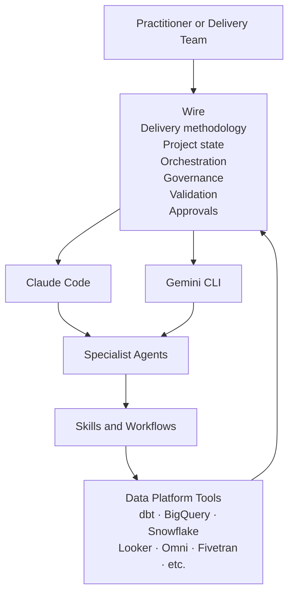
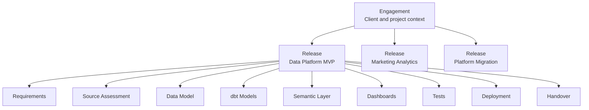
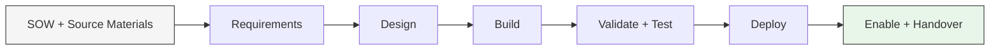
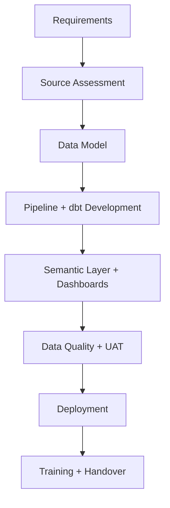
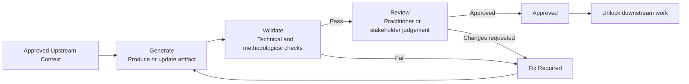
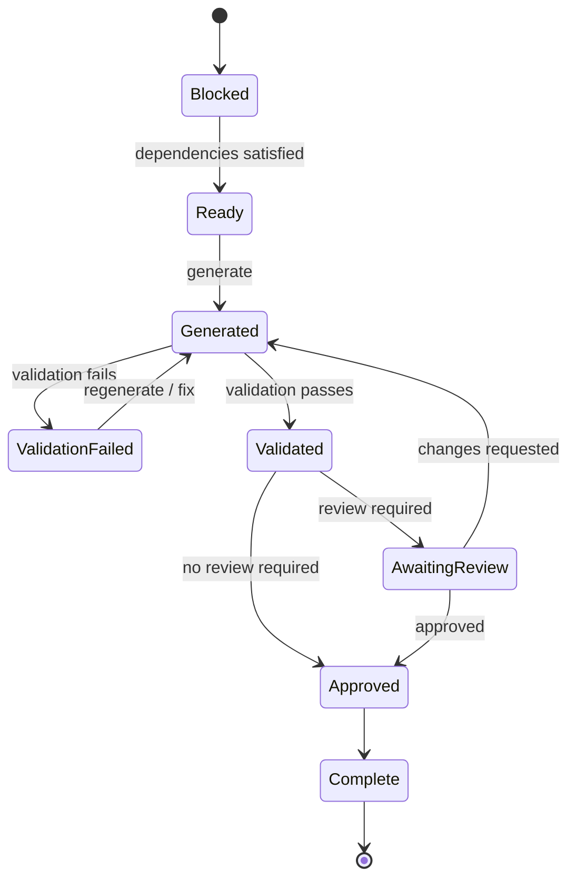
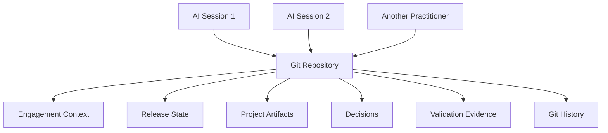

# The Wire Framework

**Rittman Analytics** | Version 4.0.0

Wire is Rittman Analytics' **agentic delivery system for data platform projects**. It combines our delivery methodology with AI coding agents to plan, build, validate and govern an engagement from initial requirements through design, development, testing, deployment and handover.

You direct the work in plain English. Wire works out what can happen next, coordinates the specialist agents needed to do it, runs the required validation and quality checks and stops where a decision or approval belongs to you or the client.

Throughout the project, Wire maintains the state of the engagement: what has been produced, what it depends on, what has passed validation, what has been approved and what remains blocked.

**Claude Code** from Anthropic and **Gemini CLI** from Google provide AI execution runtimes. Wire provides the delivery system around them: the methodology, release lifecycle, project state, specialist workflows, quality gates, approvals and audit trail that turn individual AI-generated outputs into a coherent data platform project.

Wire sits above the individual coding runtime. Claude Code or Gemini CLI supplies reasoning and execution. Wire supplies the project-level method and controls that determine what should happen, when it can happen and how the resulting work is checked.

## Coding agents complete tasks. Wire delivers projects.

Modern coding agents are very good at individual engineering tasks. Given the right context, they can write SQL, create a dbt model, build a pipeline, generate LookML or diagnose a failing test.

A data platform project requires more than a sequence of isolated tasks.

It needs to know:

- why something is being built
- which requirement it satisfies
- which design decisions constrain it
- whether its upstream dependencies are ready
- which engineering standards apply
- how the result should be validated
- what evidence needs to be retained
- whether a client or practitioner needs to approve it
- which downstream work it unlocks
- what the next person working on the project needs to know

Without that project-level context and control, even individually good AI-generated outputs can drift apart. Naming conventions change. Business rules are interpreted differently between models. Tests do not reflect requirements. Downstream work starts before upstream decisions have been agreed. Important context disappears between sessions.

Wire provides the structure around the coding agent that prevents this.

It treats a data platform engagement as a **governed delivery process**, not simply a collection of prompts.

## Engagements and releases

A Wire project is organised as an **engagement** containing one or more **releases**.

The engagement holds the long-lived context for the client and project.

A release represents a defined piece of delivery work, with a goal, scope, expected artifacts and dependencies.

Each release then contains the artifacts needed to deliver that outcome.

This distinction matters because project context and release state have different lifetimes.

An engagement might continue for a year while individual releases deliver a new platform, a marketing data product, a migration or a dashboard extension within it.

## How Wire works

Each release defines the outcome being delivered and the sequence of artifacts needed to get there.

Depending on the type of work, those artifacts might include requirements, source assessments, conceptual models, pipeline designs, dbt models, semantic layers, dashboards, data quality tests, deployment runbooks and training materials.

Those artifacts form a dependency graph.

Wire uses that graph, together with the current project state, to determine what work is ready to begin and what is waiting on something else.

For each stage, Wire provides the AI with the methodology and project context it needs. This can include:

- upstream requirements and design decisions
- source-system and warehouse context
- naming and modelling conventions
- technology-specific implementation guidance
- expected artifact structure
- validation criteria
- review requirements
- project decisions recorded earlier in the engagement

The agent therefore does not start each task from a blank prompt. It works inside the accumulated context and constraints of the project.

## What it looks like in practice

You might start with a signed Statement of Work, workshop notes, an existing warehouse and a set of source systems.

You ask Wire to create the engagement and release.

Wire extracts and structures the requirements, identifies missing information and creates the initial project state.

Once the requirements are agreed, it can move into design. Approved designs become inputs to development. Generated code is validated against both engineering standards and the decisions made earlier in the project. Work that requires practitioner or client judgement stops for review before dependent work continues.

A typical release might progress like this:

The actual graph depends on the release type. Some activities can happen in parallel while others are deliberately blocked until upstream decisions are approved.

At any point you can ask Wire what has been completed, what is currently blocked and what it recommends doing next.

You can work interactively, directing individual pieces of work yourself, or use **Autopilot** once the shape of the work is sufficiently well understood.

Autopilot coordinates the applicable Wire workflows through the release, pausing where validation fails or human approval is required.

The practitioner remains responsible for the project. Wire handles more of the mechanics required to keep that project coherent.

## More than code generation

Wire does not just generate implementation code.

A typical data platform engagement can require dozens of different deliverables across discovery, architecture, analytics engineering, business intelligence, testing, deployment and enablement.

Wire can coordinate work across areas such as:

- requirements discovery and specification
- source-system analysis
- data architecture and modelling
- data pipeline design and development
- dbt development and migration
- data quality and testing
- BigQuery and Snowflake engineering
- Looker and LookML development
- dashboard design and validation
- semantic layer development
- platform and warehouse migrations
- deployment planning
- user acceptance testing
- documentation
- training and handover

The exact workflow depends on the release type.

A focused dbt development release will therefore behave differently from a full data platform implementation or a platform migration.

Wire selects the methodology appropriate to the work rather than forcing every engagement through the same sequence.

## Methodology as executable project context

The delivery methodology behind Wire is encoded as structured workflow specifications, specialist skills and release definitions that the AI reads as it works.

These specifications tell the agent things such as:

- what inputs it should inspect before starting
- which upstream decisions constrain the task
- what engineering patterns to follow
- what deliverable it is expected to produce
- what validation should be performed
- what evidence should be recorded
- how the result relates to the rest of the release

This addresses one of the main limitations of using a general-purpose coding agent on a substantial data project.

The problem is rarely that the model does not know SQL or dbt.

The problem is maintaining **context, consistency and control across an entire engagement**.

For example, an AI model may know perfectly well how surrogate keys should be implemented. That does not guarantee that 30 models produced across several sessions will all use the agreed pattern, implement the agreed grain and remain consistent with the requirements and semantic model.

Wire carries those decisions forward.

Instead of repeatedly telling the agent how the project works, the project itself becomes part of the agent's working context.

## Generate, validate, review

An important part of the Wire delivery model is the separation between producing an artifact and deciding that it is ready.

Depending on the artifact and release type, work can move through separate **generate**, **validate** and **review** stages.

**Generate** produces or updates the deliverable using the approved upstream context.

**Validate** checks it against the applicable technical rules, project requirements and quality criteria.

**Review** handles the judgement and approval needed before the project moves forward.

Not every check can or should be delegated to an AI agent. Wire is designed around the idea that automation should accelerate delivery without removing the points where practitioner or stakeholder judgement matters.

A requirements specification can be generated and checked for completeness, for example, but a client may still need to confirm that it accurately represents what they want.

A data model can pass technical validation while still requiring an architect to approve an important modelling decision.

Wire keeps those distinctions explicit.

## Project state controls what happens next

Wire does not simply execute a fixed checklist from beginning to end.

The current state of the release determines what work is available.

An artifact may be:

- ready to generate
- waiting on an upstream dependency
- generated but awaiting validation
- failed validation
- awaiting review
- approved
- complete

That state affects downstream work.

This allows Wire to reason about the project as a connected delivery system rather than treating every instruction as an independent prompt.

It also makes orchestration possible. Several independent artifacts can be worked on concurrently while work with unresolved dependencies remains blocked.

## Persistent project state

AI coding sessions are temporary. Projects are not.

Wire therefore stores the important state of an engagement in the project's git repository rather than relying on the coding agent to remember what happened in an earlier conversation.

That state includes the artifacts produced by the project, their status, relevant decisions and the information needed to continue the work.

This means a practitioner can leave a project, return later or hand it to somebody else without reconstructing the engagement from chat history.

It also means that the project develops an inspectable history alongside the implementation itself.

At the end of a release, you do not just have generated SQL, models, dashboards and documentation.

You have a version-controlled record of:

- what was requested
- what was designed
- what was built
- which requirements the implementation addresses
- how it was validated
- which decisions were made
- what was approved
- what was deployed
- what was handed over

That record becomes part of the deliverable.

## The practitioner stays in control

Wire is designed to increase the amount of project delivery that AI can perform, not to remove practitioners from the process.

The valuable work of a data consultant or analytics engineer is not simply typing SQL.

It includes understanding the client's problem, challenging assumptions, making architectural trade-offs, interpreting ambiguous requirements, deciding what *should* be built and working with stakeholders to make sure the result is useful.

Wire takes on more of the repeatable mechanics around that work.

It can read the project context every time. It can apply the same engineering conventions repeatedly. It can trace an implementation back to its requirements. It can run validation consistently. It can maintain project state and coordinate work between specialist agents.

That gives the practitioner more time to concentrate on the decisions, relationships and problem-solving where human judgement has the greatest value.

## What Wire provides

The easiest way to think about the relationship between Wire and the underlying AI is:

| AI coding runtime | Wire |
| --- | --- |
| Generates and edits code | Defines how the project is delivered |
| Reasons about the immediate task | Maintains engagement and release context |
| Uses tools | Coordinates specialist workflows and tools |
| Responds to prompts | Determines applicable delivery steps |
| Can inspect the repository | Maintains persistent project state |
| Can test its work | Defines the required validation process |
| Executes engineering tasks | Connects tasks to requirements and designs |
| Works autonomously where appropriate | Introduces approvals and review gates where required |

Claude Code or Gemini CLI provides the reasoning and execution capability.

**Wire provides the delivery discipline around it.**

:::info[About Wire and Rittman Analytics]

Wire was created by Rittman Analytics from the methods we use to deliver data platform, analytics engineering and platform migration engagements.

It is designed primarily for Rittman Analytics team members and our clients' data teams, providing an agentic way to develop and evolve modern data platforms while retaining the structure, quality controls and practitioner oversight expected of a professional consulting engagement.

The integrations, processes and workflows embedded in Wire reflect current practices at Rittman Analytics and continue to evolve as we use the framework on real delivery projects.

The plugin code and documentation are publicly available under the [Functional Source License 1.1](https://fsl.software). You're free to use them within those terms.

For more information about Wire or Rittman Analytics' consulting services, contact [info@rittmananalytics.com](mailto:info@rittmananalytics.com).

:::
