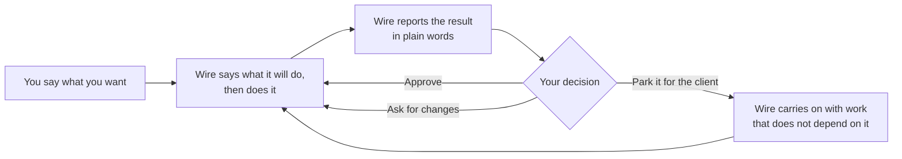

# What Wire Is

**Rittman Analytics** | Version 4.0.0

Wire is Rittman Analytics' analytics engineering assistant, an agent that runs inside Claude Code and carries our delivery method with it. You direct the work in plain English while it plans the steps, produces the documents, models and dashboards, checks its own output against the method and stops whenever a decision is yours. Everything it produces and does lives as files in your engagement's git repository.

This chapter covers what makes Wire different from a coding assistant, the work you can ask it to do, how a session unfolds, what you have at the end of a release, and installing Wire ready for Chapter 2. Let's start with what Wire knows that a coding assistant does not.

## What Problem Does It Solve?

A general coding assistant will write you a valid SQL model, and it will do so quickly. What it will not do is write the model the way the rest of the project expects it: named to the project's convention, with its tests, its documentation and a note of the requirement it satisfies, and only once the design it implements has been approved. Wire does all of that, because Wire knows how a data platform engagement is run. It knows which documents come first, what has to be approved before the next step can start, how a warehouse is laid out in layers, which tests every table needs and what the client should be handed at the end, and it knows these things because they are Rittman Analytics' delivery method, built over more than 20 years of consulting and written down in a form that an agent can follow rather than guess at.

It follows, therefore, that Wire does not improvise a structure and hope it holds together. It follows the method, it shows you the result at each stage and, where the method calls for a human decision, it stops and asks for one. As we will see in Chapter 5, the method is written down as data that Wire reads rather than as advice it might forget, which is what makes the difference between the third model and the thirtieth.

## What Can You Ask It To Do?

Wire organises work into "releases": a release is one piece of work with a defined start, a set of things it produces and a finish, and every release follows one of a small number of patterns that Wire knows, each of which says what gets produced, in what order and where the approvals fall. Some of the things you can say to Wire, each of which starts a release of one kind or another, are:

- "Start a new engagement from this statement of work."
- "Design the dashboards first and get them approved before we build anything."
- "Build the dbt project for these three source systems."
- "Run a discovery with this client and give me a roadmap their sponsor can sign off."
- "Migrate this Snowflake warehouse to BigQuery and prove the numbers match."
- "Move these Looker dashboards to Omni."
- "Prepare the training and hand-over for the client's team."

Releases belong to an "engagement", which is the client contract, and most engagements have more than one release: a discovery first, as a rule, then one or more builds that the discovery scoped. Part 2 has [a page for every kind of release](../getting-started/release-types.md), and Chapters 2, 3, 4 and 6 of this part each follow one of them from beginning to end.

## How Do You Work With It?

The short answer is that you direct, and Wire does the work and reports back. The slightly longer answer is that a session with Wire is a loop, and it is worth seeing the whole loop once before we look at each part of it.



You say what you want, in a sentence or two. Wire tells you what it is about to do and why, in one sentence, and then does it, checking each piece of work against the method as it finishes. When the work is done, or when a decision is needed, it reports back in plain words: what it produced, what the checks found and what it needs from you. At every approval you have three answers available, which are to approve, to ask for changes or to "park" the decision for the client to sign off, and Wire never approves anything on your behalf (unless you switch on the unattended mode described in Part 2, in which case it says so in the record). Work that does not depend on the parked decision carries on around it.

So what does that look like in practice? Here are the first few minutes of the Northwind Retail engagement, exactly as you would type them and Wire would reply.

| You say | Wire replies |
|---|---|
| "New engagement for Northwind Retail, store performance dashboards. The statement of work is in the docs folder. No warehouse access for two weeks. Stop at every decision." | "This reads as a dashboards-first release: the client wants to approve the dashboard designs before any data work starts. Client Northwind Retail, one release named Store Performance. You have no warehouse access yet, so the first build will run on sample data. Confirm?" |
| "Confirm." | "Engagement set up. Requirements drafted from the statement of work: 14 requirements, all checks pass, two need clarifying with the client. Approve now, or park for the client?" |
| "Approve, and carry the two questions to the kickoff." | "Approved, and the two questions are noted for kickoff. Starting the dashboard designs with you now, and drafting the conceptual model in the background. The two do not depend on each other." |

Three messages from you, and Wire has set up the engagement, written and checked the requirements, recorded your approval together with your instruction about the kickoff and started two pieces of work at once, because it could see that neither depended on the other. [Chapter 2](./02-getting-started.md) follows this release all the way to live dashboards.

## What Do You Get at the End?

Everything Wire produces is a file in your project's git repository, which means it is versioned, reviewable and yours. For a full platform build that comes to the requirements traced back to the statement of work, the designs (the business concepts, the data model and the pipeline design), the dbt project with tests on every table, the semantic layer and the dashboards, data quality tests and user acceptance tests and the deployment runbook, together with training material and documentation for the client's team.

Alongside all of that, and just as valuable, Wire keeps a record of the work itself: what was done and when, what was approved and by whom, together with every decision you made along the way and your reason for it. As such, a colleague who has never seen the engagement can open the repository, read the record and pick the work up where you left it, which is something no amount of well-written SQL gives you on its own.

## Where Does It Run, and What Does It Connect To?

Wire runs in Claude Code, Anthropic's command-line coding assistant, inside a git repository. Directing it in plain English, which is what this part of the guide describes, works in Claude Code only. Wire also works in Gemini CLI, Google's equivalent, but there you type Wire's commands yourself; [Part 2 documents every command](../reference/commands.md), and [Chapter 6](./06-a-full-platform-build.md) shows where typing one directly is the better choice even in Claude Code.

:::note
The commands, the artifacts and the record on disk are identical whichever way you run Wire. Only the way you drive it differs, so nothing you learn in Part 1 is wasted if you later find yourself typing.
:::

When the connections are set up, Wire can also read your recorded client meetings and bring the decisions made in them into its reviews, keep Jira or Linear in step with the work, publish its documents to Confluence or Notion for the client to comment on, and read from and write to the warehouse and the tools around it, such as BigQuery, Snowflake, Looker, Omni and Fivetran. [Part 2 lists the connections](../reference/mcp-servers.md) and how to set each one up.

## Who Is Wire For?

Wire is built for Rittman Analytics consultants and for the data teams of our clients, and the method it follows is the one Rittman Analytics uses on its own engagements. The plugin and this documentation are public under the [Functional Source License 1.1](https://fsl.software), and if you would like to know more about Wire or about our consulting, you can contact us at [info@rittmananalytics.com](mailto:info@rittmananalytics.com).

## Getting Started

Installing Wire into Claude Code takes three steps, each of which is a command you type into a Claude Code session. At a high level they are:

1. Add Rittman Analytics' plugin catalogue.
2. Install the Wire plugin.
3. Load it into the current session.

Let's take a look at each in turn.

**Step 1: Adding the catalogue.** Claude Code installs plugins from catalogues (Anthropic calls them "marketplaces"), so your first step is to add ours:

```
/plugin marketplace add rittmananalytics/wire-plugin
```

**Step 2: Installing Wire.** With the catalogue added, install the plugin itself:

```
/plugin install wire@rittman-analytics
```

**Step 3: Loading it.** Finally, load the plugin into the session you are in, so that Wire is available without restarting Claude Code:

```
/reload-plugins
```

You should now be able to type `/wire:` and see Wire's commands offered for completion. If they do not appear, run the third step again; it activates whatever was installed since the session began. [Installation](../getting-started/installation.md) in Part 2 covers Gemini CLI and the connections, and [Upgrading from 3.x](../getting-started/upgrading-from-3x.md) is for anyone who has used an earlier Wire.

With Wire installed, open Claude Code in the git repository for your engagement and say what you want. If this is your first time, follow Chapter 2, which starts from an empty repository and ends with approved dashboards.

## What Is in This Guide?

Part 1 of this guide is meant to be read in order. It shows how you work with Wire, in plain language, through three releases of increasing size, and then explains what was happening underneath before showing the largest kind of release with commands typed at the points where that helps.

| Chapter | What it covers |
|---|---|
| 1. What Wire Is | This page |
| 2. Getting Started | A first release from an empty repository: dashboards designed and approved before any data work |
| 3. Data Modelling and Transformation | A dbt build across three source systems, with the definitions agreed first |
| 4. Running Discovery | A discovery with seven stakeholders that ends in a roadmap the sponsor signs off |
| 5. How Wire Works | The orchestration agent, the lane agents and the commands behind the steps you have seen |
| 6. A Full Platform Build, with Commands | The largest kind of release, with commands typed directly where it helps |

Part 2 is the reference: installation and upgrading, every kind of release, command-level walkthroughs, the integrations and the full command list. Let's begin, then, with a first release.
